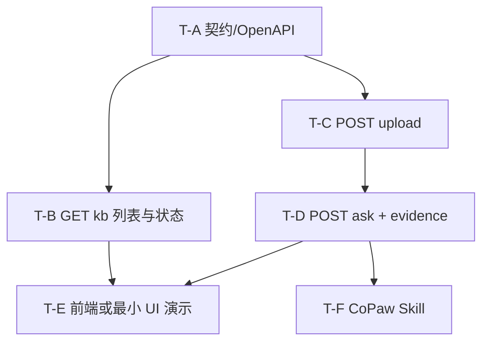

# 任务地图与 Qoder Quest 执行指南

> **版本**：v0.1  
> **日期**：2026-04-03  
> **定位**：在 **`01-Spec` 已冻结**、`02-TC` 已对齐的前提下，用于 **上机执行**：整体地图、**统一约定**（避免各 Task API 风格漂移）、以及 **Tasks 文件** 的用法。  
> **真源**：Task 依赖与编号仍以 `01-Spec` §6.2 为准；本文不新增契约。

---

## 1. 下一步建议流程

| 步骤 | 动作 |
|------|------|
| 1 | **Proposal 评审通过**（`00-Proposal`） |
| 2 | **冻结 Spec**（更新 `01-Spec` 文首状态为「已冻结」，并记录日期） |
| 3 | 确认 **`02-TC`** 与冻结版一致 |
| 4 | 按 **§2 依赖顺序** 执行 Task；每 Task 打开 `docs/tasks/T-*.md`，将其中 **Quest 输入模板** 粘贴到 Qoder Quest（建议 **一 Task 一 Quest**，见 §4） |
| 5 | 用 `02-TC` 勾选验收；再开下一 Task |

---

## 2. 整体地图（依赖一览）



**推荐执行顺序（单人）**：T-A → T-B → T-C → T-D → T-E → T-F。  
**并行（多人/多分支）**：在 **T-A 已合并** 的前提下，T-B 与 T-C 可分头；T-E 与 T-F 在 T-D 完成后可并行（不同目录时注意合并冲突）。

---

## 3. 统一约定（所有 Task 必须遵守）

以下与 **`01-Spec` §3、§7** 一致；实现时 **不得** 在各 Task 中自创一套命名。

### 3.1 路径与前缀

| 项 | 约定 |
|----|------|
| API 基路径 | `/api/v1`（若实现用其他前缀，须在 Quest 输入与 README 中 **显式写出** 完整路径） |
| 知识库 | `GET /kb/documents`、`GET /kb/index/status` |
| 问答与上传 | `POST /research/qa/upload`、`POST /research/qa/ask` |

### 3.2 JSON 字段

- 以 **Spec §3** 中的字段名为准（如 `doc_id`、`evidence_refs`、`trace_id`、`items`）。  
- **新增字段** 仅允许 **可选** 追加，且不得破坏已有解析。

### 3.3 错误体（非业务拒答）

统一形状见 **`01-Spec` §7**：

```json
{
  "error": "string",
  "code": "string",
  "trace_id": "string | null"
}
```

**业务拒答**（无证据）：仍用 **HTTP 200** + `evidence_refs: []`，**不使用** 上述错误体替代。

### 3.4 环境与密钥（占位）

| 类型 | 约定 |
|------|------|
| BFF 基地址 | 环境变量占位，如 `BFF_BASE_URL`（实现与 CoPaw Skill 共用） |
| 模型/密钥 | **不**写入仓库；Quest 输入中写「使用环境变量，勿硬编码」 |

### 3.5 代码风格（若生成后端代码）

- 与目标仓库现有风格一致；无仓库时：**HTTP 状态码与 JSON 与 Spec 一致即可**。  
- 建议在仓库根使用 **`AGENTS.md`** 或 **`.qoder/rules`** 写死上述 3.1～3.3，**减少每个 Quest 重复贴约定**。

---

## 4. Qoder Quest 怎么用这些 Task

| 做法 | 说明 |
|------|------|
| **推荐** | **一个 Quest 完成一个 Task**（T-A 单独跑、T-B 单独跑…），便于中途验收与改提示词。 |
| **可选** | 将 T-B+T-C 合并为一条 Quest：仅在 **同一开发者、契约已冻结** 且接受 **更长单次执行** 时使用。 |
| **每条 Quest 的输入** | 至少包含：`docs/tasks/T-*.md` 全文 + 本文件 **§3 统一约定**（或说明「已读仓库 AGENTS.md」） |

---

## 5. Tasks 文件存在哪里、格式是什么

| 路径 | 作用 |
|------|------|
| `docs/tasks/README.md` | **索引**：Task ID、对应 Spec、对应 TC、链接到各文件 |
| `docs/tasks/T-A.md` … `T-F.md` | **每 Task 一份**：依赖、Quest 输入模板、完成条件、与 TC 对齐 |

**不必**再拆到「仓库外」；**本目录即单环节资料包**。若用 Jira/飞书，可把 Task ID 与链接同步到看板，**正文仍以本仓库 Markdown 为准** 避免漂移。

---

## 6. 变更记录

| 版本 | 日期 | 说明 |
|------|------|------|
| v0.1 | 2026-04-03 | 初稿：地图、统一约定、Quest 用法、tasks 目录说明 |
