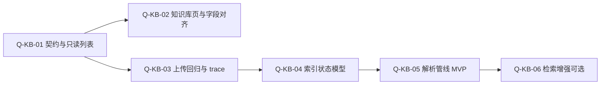

# 投研助手（IRA）· `/knowledge` · Qoder Quest 设计方案

## 本文档角色（与三段式的区别）

| 维度 | `00-Proposal` / `01-Spec` / `02-TC` | **本文** |
|------|-------------------------------------|----------|
| **性质** | 立项、**契约**、验收 | **教学法 + 执行指南**（如何拆 Quest、选 Local/Remote、可选 IRA 路径对照） |
| **是否必含** | 单环节 **必含** | **可选**：只做文档评审与交付时 **可不读**；上机练 **Qoder Quest** 或对接 **IRA 仓库** 时 **建议保留** |
| **真源** | API/行为以 `01` 冻结版为准 | 不定义契约；若与 `01` 冲突，**以 `01` 为准** |

> **版本**：v0.1  
> **日期**：2026-04-03  
> **范围**：在 IRA 仓库中，以 **Qoder Quest** 驱动 **知识库模块**（前端 `/knowledge` + `GET /api/v1/kb/*` + 与 `POST /research/qa/upload`、问答引用链路的协同）。  
> **术语**：下文 **「教学法 Quest」** 指「大任务拆子任务、按依赖推进」；**「产品 Quest」** 指 Qoder IDE 内 Quest 模式（Local / Remote）。二者可组合使用，但不要与 CoPaw 产品内其他「Quest」名称混讲（见 Workshop 映射说明）。

> **与三段式文档包的关系**：若仅推进 **单环节 Workshop**、不绑定具体仓库路径，请以同目录 **`00-Proposal` → `01-Spec`（冻结）→ `02-TC`** 为契约真源；本文侧重 Quest 链与执行环境，**不替代** `01` 中的 API 与 CoPaw 映射。

---

## 1. 目标与边界

### 1.1 为什么要用 Quest 做 knowledge

- 知识库能力是 **流水线型**：入库 →（解析）→ 索引状态 → 与 **研报问答** 的 `evidence_refs` 联动，天然适合拆成 **有序子任务**。  
- Workshop 已将该能力标为 **⑦ 知识库 · Qoder Quest（教学法 ●）**（见 `投研助手-Workshop-环节与教学法映射.md`）。

### 1.2 当前 IRA 真实现状（设计锚点）

| 层级 | 现状（便于定 Quest 起点） |
|------|---------------------------|
| 后端 | `kb_bp.py`：`GET /api/v1/kb/documents` 读 `data/kb_documents.json`；`GET /api/v1/kb/index/status` 为 **示意固定 JSON**（`index_ver` / `updated_at`）。 |
| 上传与问答 | `research_bp.py`：`POST .../research/qa/upload` 落盘并写 `kb_documents.json`；`_kb_evidence_refs_and_block()` 从元数据构造 `evidence_refs`。 |
| 前端 | `/knowledge` 在导航与 `workshopContent` 中已配置；教学重点为 **Quest 拆条** 与 API 对照。 |

**边界声明**：本方案 **不强制** 一期上完整向量 RAG；可按 **难度阶梯** 先完成「元数据一致 + 状态可观测 + 与 QA 契约对齐」，再迭代解析/向量。

---

## 2. Quest 链总览（推荐执行顺序）

按 **依赖** 与 **演示价值** 排序：**先打通「看得见的数据流」**，再加深「索引与检索」。

---

## 3. 子任务定义（含难度与 Local / Remote 建议）

**难度说明**：低 = 1～2 个文件为主、无长时任务；中 = 跨前后端或小管道；高 = 向量依赖、异步 Worker、或大规模重构。

| ID | 子任务 | 完成条件（摘要） | 难度 | 优先 |
|----|--------|------------------|------|------|
| **Q-KB-01** | **OpenAPI + `kb_documents` 模型对齐** | `openapi.yaml` 中 `/kb/documents`、`/kb/index/status` 与实现一致；字段与前端列表一致（含 `items[]` 最小字段）。 | 低 | **P0** |
| **Q-KB-02** | **前端 `/knowledge` 列表与空态** | 调 `GET /api/v1/kb/documents` 展示列表；错误与加载态；与 `workshopContent` 文案一致。 | 低 | **P0** |
| **Q-KB-03** | **上传 → 元数据 → QA 引用回归** | 走通 `POST .../research/qa/upload`；`kb_documents.json` 新增；`POST .../research/qa/ask` 中 `evidence_refs` 含新文档语义（与现有 `_kb_evidence_refs_and_block` 一致）。 | 中 | **P0** |
| **Q-KB-04** | **索引状态「去 Mock」** | `GET /kb/index/status` 反映真实状态：至少含 `status`（如 `idle`/`indexing`/`ready`/`error`）、`updated_at`；可与 Q-KB-03 写入联动或短轮询兼容。 | 中 | **P1** |
| **Q-KB-05** | **解析管线 MVP** | 上传 PDF → 文本提取（或落盘中间件）→ 更新文档记录中的 `parse_status` / `chunk_count`（字段可渐进）；失败路径可观测。 | 高 | **P2** |
| **Q-KB-06** | **检索增强（关键词或向量）** | `ask` 侧检索不只「前 N 条」，而是按 query 命中片段；需与合规/拒答策略一致。 | 高 | **P3** |

**推荐优先完成**：**Q-KB-01 → Q-KB-02 → Q-KB-03**（P0）。这三步已能支撑 Workshop「入库元数据 → 列表可见 → 问答引用」叙事；**Q-KB-04** 强化「索引状态」真实感；**Q-KB-05/06** 为进阶。

---

## 4. 执行环境：产品 Quest 的 Local / Remote / ECS

### 4.1 选择原则（与 Qoder 官方材料一致）

| 环境 | 特点 | 适合承载的 Quest |
|------|------|------------------|
| **Local** | 零启动成本、反馈快、适合反复改 UI/契约 | **Q-KB-01、Q-KB-02**；**Q-KB-03** 中单测与短链路调试 |
| **Remote（Qoder 云端容器）** | 长程、可并行、本机可离开 | **Q-KB-05、Q-KB-06**（解析/向量依赖多、步骤长）；或 **整条 Epic 打包** 为一条 Remote Quest |
| **自建 ECS / 私有 Runner** | 组织策略要求代码不出公网、或需内网 pip/apt 源 | 仅当 **不能** 使用官方 Remote 时考虑；**非默认路径** |

**结论**：

- **默认**：P0 用 **Local Quest** 快速迭代；P2/P3 或「一次跑完 Q-KB-01～06」可用 **Remote Quest**。  
- **ECS**：与 **Qoder 官方托管 Remote** 无必然关系；**用官方 Remote 一般不需要自购 ECS**；只有 **私有部署 Quest Runner** 时才需要类似 ECS 的算力与网络环境。

### 4.2 教学法层面的「任务委派」

- **主 Quest**（目标）：「IRA 知识库 P0 可用：列表 + 上传 + QA 引用一致」。  
- **子 Quest**：上表 Q-KB-01～03；依赖顺序见 §2。  
- 可在 `AGENTS.md` 或 Quest 描述中写明：**实现仓库为 IRA 根目录**、`DATA_DIR` 下 `kb_documents.json` 为真源之一。

---

## 5. 难度对比小结

| 对比维 | P0（01～03） | P1（04） | P2/P3（05～06） |
|--------|--------------|----------|-----------------|
| 涉及面 | 契约 + 单页 + 已有上传/问答 | 状态机 + 可能轻量后台任务 | 解析库、分块、向量或检索策略 |
| 调试周期 | 短 | 中 | 长 |
| 适合 Quest 环境 | **Local 为主** | Local / Remote 均可 | **Remote 更省本机时间** |
| 与 Glue 边界 | 仍属 **知识域编排**；外部向量服务接入时 **衔接 Glue 物料**（参考 `reference/IRA-物料索引.md` 同仓库的适配器模式） | — | 强相关 |

---

## 6. 验收清单（P0）

- [ ] OpenAPI 与 `kb_bp` / 前端字段一致，或显式标注「Workshop 示意字段」。  
- [ ] `/knowledge` 能列出 `kb_documents.json` 中条目（含上传后刷新可见）。  
- [ ] 上传后 **`research/qa/ask` 的 `evidence_refs` 行为**符合当前 `research_bp` 设计（或已同步更新文档）。  
- [ ] 关键请求带 `trace_id` / 与血缘页可查（与现有 IRA 约定一致）。  

---

## 7. IRA 代码与数据入口（克隆后路径）

以下相对于 IRA 应用仓库根目录（示例：`ira/ira/ira`）。

| 类型 | 路径 |
|------|------|
| 知识库蓝图 | `backend/app/blueprints/kb_bp.py` |
| 上传与 evidence | `backend/app/blueprints/research_bp.py`（`_kb_evidence_refs_and_block`、upload） |
| 数据 | `DATA_DIR` 下 `kb_documents.json`（见 `json_store` / `seed_data`） |
| 前端 | `frontend/src/config/nav.ts`、`workshopContent.ts`、知识库页面组件（以仓库实际为准） |

---

## 8. 与 CoPaw 衔接：哪些子任务适合「基于 CoPaw」开发

原则（与 IRA 总方案一致）：**业务真源仍在 IRA（Flask BFF + `kb_documents.json` + 现有契约）**；CoPaw 侧做 **编排、工具、统一入口、可观测**，**不**要求把知识库核心逻辑只写在 CoPaw 里。Workshop 常见是 **IRA 先跑通**，再 **HTTP 浅接** CoPaw。

| 设计方案中的条目 | 与 CoPaw 的典型关系 | 说明 |
|------------------|---------------------|------|
| **Q-KB-01～03（P0）** | **多数在 IRA 内完成** | OpenAPI、页面、`research_bp` 上传与 `evidence_refs` 与 CoPaw 无强绑定；CoPaw 可通过 **Skill `requests.post` → BFF** 复用同一能力，但 **不必**为 P0 同时开 CoPaw 工程。 |
| **Q-KB-04 索引状态** | **可选** CoPaw Cron / Workflow 轮询或驱动 | 状态真源仍在 IRA；CoPaw 适合作为 **「触发重索引 / 汇报状态」** 的调度壳（演示向）。 |
| **Q-KB-05 解析管线** | **映射上常对齐「Ingest Pipeline」**（见能力映射表 R-004） | **实现位置二选一或组合**：① 仍在 IRA 内用 Python 库解析 + 更新 JSON；② **重型步骤**放到 CoPaw Workflow/Worker，**结果回写** IRA 或仍由 IRA 拉取；对外 **路径保持** `POST .../upload` 不变。 |
| **Q-KB-06 检索增强** | **映射「Retrieve + Metadata」**（R-003） | 向量/混合检索若在 CoPaw 有现成 Retrieve，可做 **适配器** 把结果 **映射为 IRA 的 `evidence_refs`**；合规与拒答仍以 IRA / `compliance` 为准。 |
| **横切：trace** | **Trace Hooks / 统一 trace_id**（R-005） | IRA 已生成 `trace_id` 时，CoPaw 侧 Skill 调用应 **原样传递或回显**，便于血缘页一致。 |

**小结**：**P0 可以完全不用 CoPaw**；**从 Q-KB-05/06 或「要在 CoPaw Chat 里问同一套知识」开始**，最值得投入 CoPaw（Skill、Workflow、Ingest/Retrieve 叙事）。详见 `ira-workshop/docs/FEATURE-research-qa-design.md` §三、`01-CoPaw能力映射表.md`。

---

## 9. Qoder Quest：你该输入什么？如何还能「参与」

你的直觉对：**Quest 偏自主执行**，若只扔一句模糊需求，结果容易漂移；**输入（提示词 + 附件文档）就是最主要的控制面**。

### 9.1 建议在每次 Quest 里一并给出的内容

| 类别 | 内容 | 作用 |
|------|------|------|
| **目标与范围** | 只做哪一个 Q-KB-xx；**明确不写什么**（非目标） | 防止扩 scope |
| **验收条件** | 可勾选列表（与本方案 §6 或各 Q 的「完成条件」一致） | 对齐「完成定义」 |
| **代码锚点** | 仓库路径：`kb_bp.py`、`research_bp.py`、前端知识库页、`openapi.yaml` 片段 | 减少乱改结构 |
| **契约** | 相关 API 的请求/响应字段；是否与现有 `trace_id`、`evidence_refs` 兼容 | 避免破坏集成 |
| **运行约束** | `DATA_DIR`、`IRA_*` 环境变量、是否需要本机 Key | 减少环境玄学失败 |
| **参考文档** | 本文件、`FEATURE-research-qa-design.md`、或 OpenAPI 节选 | 减少幻觉 |

不必追求一篇巨文：**一条 Quest = 一个 Q-KB-xx + 上表最小集**，比「一句话开发整个知识库」可控得多。

### 9.2 如何参与：不是只能等跑完

| 做法 | 说明 |
|------|------|
| **拆 Quest** | 按 §2 顺序开 **多个短 Quest**（例如先 Q-KB-01，再 Q-KB-02），每步结束 **你审 diff / 跑验收** 再开下一步。 |
| **Local 优先于大包 Remote** | P0 用 Local，便于中途打断、改提示词、补约束。 |
| **利用「验收门槛」** | 在提示词里写死：「改完须 `pytest` 通过某某用例 / 手工步骤 1～3」——Quest 会朝可验证结果收敛。 |
| **仓库内长期约束** | `AGENTS.md`、`.qoder/rules` 里写 IRA 规范（错误格式、`IRA_*` 前缀），**每次 Quest 自动继承**，减轻纯靠一段提示词的压力。 |
| **Remote 长任务** | 适合 Q-KB-05/06；仍建议 **先附本文 §3 表格 + 验收清单**，避免远程跑飞。 |

**一句话**：Quest 模式是 **「你定义目标与边界 + 文档化契约 → AI 执行 → 你按验收表评审」**；**输入越像「微型 PRD + 路径清单」**，你越省力、越能介入关键节点。

---

## 10. 文档变更记录

| 日期 | 说明 |
|------|------|
| 2026-04-03 | 初稿：Quest 链、Local/Remote/ECS、难度与 P0～P3 优先级 |
| 2026-04-03 | 增补：§8 CoPaw 衔接、§9 Quest 输入与参与方式 |
