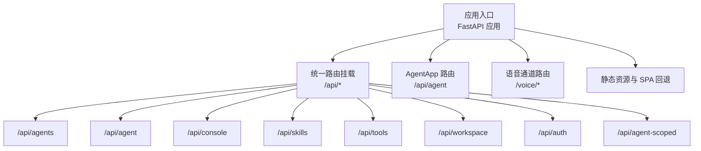
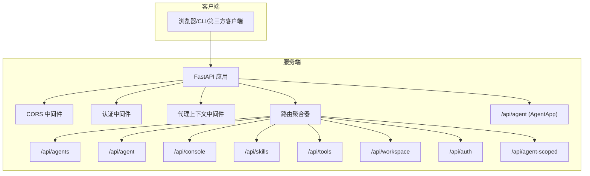
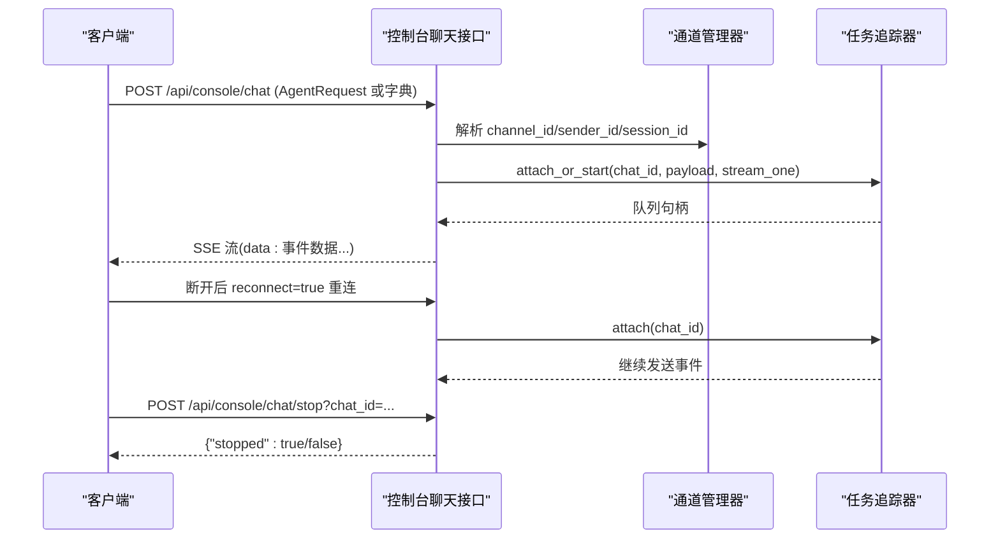
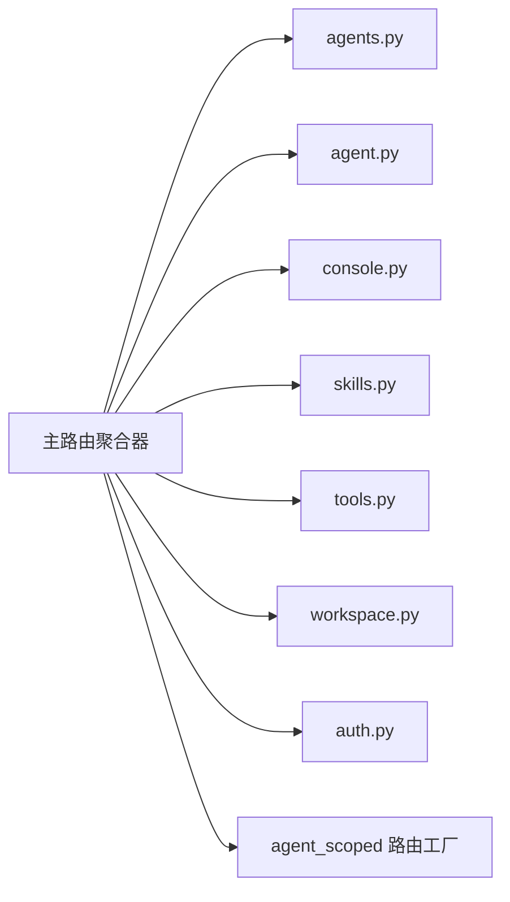

# API参考

<cite>
**本文引用的文件**
- [src\copaw\app\_app.py](file://src\copaw\app\_app.py)
- [src\copaw\app\routers\__init__.py](file://src\copaw\app\routers\__init__.py)
- [src\copaw\app\routers\agent.py](file://src\copaw\app\routers\agent.py)
- [src\copaw\app\routers\agents.py](file://src\copaw\app\routers\agents.py)
- [src\copaw\app\routers\auth.py](file://src\copaw\app\routers\auth.py)
- [src\copaw\app\routers\console.py](file://src\copaw\app\routers\console.py)
- [src\copaw\app\routers\skills.py](file://src\copaw\app\routers\skills.py)
- [src\copaw\app\routers\tools.py](file://src\copaw\app\routers\tools.py)
- [src\copaw\app\routers\workspace.py](file://src\copaw\app\routers\workspace.py)
- [src\copaw\cli\http.py](file://src\copaw\cli\http.py)
</cite>

## 目录
1. [简介](#简介)
2. [项目结构](#项目结构)
3. [核心组件](#核心组件)
4. [架构总览](#架构总览)
5. [详细组件分析](#详细组件分析)
6. [依赖分析](#依赖分析)
7. [性能考量](#性能考量)
8. [故障排查指南](#故障排查指南)
9. [结论](#结论)
10. [附录](#附录)

## 简介
本文件为 CoPaw 的完整 API 参考文档，覆盖以下内容：
- RESTful API：HTTP 方法、URL 模式、请求/响应模型与认证方式
- WebSocket API：当前未发现显式的 WebSocket 路由；如需实时交互，请参考控制台聊天流式传输（Server-Sent Events）
- 协议特定示例：基于实际路由定义给出调用路径与参数说明
- 错误处理策略：状态码与典型错误场景
- 安全考虑：认证开关、令牌校验、上传文件大小限制与路径安全
- 速率限制：当前未实现全局速率限制中间件
- 版本信息：/api/version 返回当前版本
- 常见用例：多代理管理、技能导入与启用、工作区打包/解包、控制台聊天与文件上传
- 客户端实现指南：使用 CLI HTTP 客户端或任意 HTTP 客户端访问 /api 前缀下的接口
- 性能优化技巧：异步任务、后台热重载、流式响应
- 调试与监控：SSE 流、日志级别、遥测收集
- 已弃用功能与兼容性：当前未发现明确的弃用接口

## 项目结构
CoPaw 使用 FastAPI 提供 REST API，并通过统一入口挂载多个子路由模块。应用启动时注册以下路由前缀：
- /api/agents：多代理管理
- /api/agent：当前激活代理的文件与运行配置等
- /api/console：控制台聊天（SSE）、文件上传与推送消息
- /api/skills：技能列表、搜索、从 Hub 安装、批量启用/禁用、上传 ZIP 导入
- /api/tools：内置工具启用/禁用
- /api/workspace：工作区打包下载与上传合并
- /api/auth：登录、注册、认证状态与令牌验证
- /api/agent-scoped：按代理维度的路由（通过工厂函数动态挂载）

此外，应用还提供：
- /api/version：返回版本号
- /api/agent：AgentApp 路由（用于运行时对话）
- 语音通道路由（Twilio 相关）在根路径下（非 /api 前缀）

**图表来源**
- [src\copaw\app\_app.py:327-342](file://src\copaw\app\_app.py#L327-L342)
- [src\copaw\app\routers\__init__.py:23-52](file://src\copaw\app\routers\__init__.py#L23-L52)

**章节来源**
- [src\copaw\app\_app.py:241-342](file://src\copaw\app\_app.py#L241-L342)
- [src\copaw\app\routers\__init__.py:1-56](file://src\copaw\app\routers\__init__.py#L1-L56)

## 核心组件
- 应用生命周期与中间件
  - CORS 中间件：可选，根据环境变量配置允许的源
  - 认证中间件：统一鉴权逻辑
  - 代理上下文中间件：为代理作用域路由注入当前代理上下文
  - AgentApp 集成：统一的对话运行器
- 路由组织
  - 主路由聚合器：集中 include 各子路由
  - 代理作用域路由工厂：动态挂载以 /api/agents/{agentId}/ 开头的子路由
- CLI HTTP 客户端
  - 自动为所有请求添加 /api 前缀
  - 默认超时 30 秒

**章节来源**
- [src\copaw\app\_app.py:148-263](file://src\copaw\app\_app.py#L148-L263)
- [src\copaw\app\_app.py:327-342](file://src\copaw\app\_app.py#L327-L342)
- [src\copaw\app\routers\__init__.py:23-52](file://src\copaw\app\routers\__init__.py#L23-L52)
- [src\copaw\cli\http.py:14-24](file://src\copaw\cli\http.py#L14-L24)

## 架构总览
CoPaw 的 API 架构围绕“多代理”与“技能系统”展开，同时提供工作区管理与控制台聊天能力。认证可选开启，支持单用户注册与 Bearer 令牌验证。

**图表来源**
- [src\copaw\app\_app.py:241-342](file://src\copaw\app\_app.py#L241-L342)
- [src\copaw\app\routers\__init__.py:23-52](file://src\copaw\app\routers\__init__.py#L23-L52)

## 详细组件分析

### 认证与授权 (/api/auth)
- 登录
  - 方法：POST
  - 路径：/api/auth/login
  - 请求体：用户名、密码
  - 成功：返回 token 与用户名；若未启用认证则返回空 token
  - 失败：401 无效凭据
- 注册
  - 方法：POST
  - 路径：/api/auth/register
  - 条件：仅当 COPAW_AUTH_ENABLED 为真且尚未有用户时允许
  - 成功：返回 token 与用户名
  - 失败：403（未启用/已有用户），400（用户名或密码为空），409（注册失败）
- 认证状态
  - 方法：GET
  - 路径：/api/auth/status
  - 返回：enabled、has_users
- 令牌验证
  - 方法：GET
  - 路径：/api/auth/verify
  - 请求头：Authorization: Bearer <token>
  - 成功：valid=true，username
  - 失败：401（未启用/无 token/无效或过期）

安全与错误处理要点
- 认证可选；可通过环境变量控制是否启用
- 令牌验证严格要求 Bearer 前缀
- 注册仅允许一次

**章节来源**
- [src\copaw\app\routers\auth.py:41-114](file://src\copaw\app\routers\auth.py#L41-L114)

### 多代理管理 (/api/agents)
- 列表
  - 方法：GET
  - 路径：/api/agents
  - 返回：代理列表（含 id、name、description、workspace_dir）
- 获取详情
  - 方法：GET
  - 路径：/api/agents/{agentId}
  - 返回：完整代理配置
- 创建
  - 方法：POST
  - 路径：/api/agents
  - 请求体：name、description、workspace_dir、language
  - 返回：AgentProfileRef（包含生成的 agentId 与 workspace_dir）
- 更新
  - 方法：PUT
  - 路径：/api/agents/{agentId}
  - 请求体：部分字段更新（使用 Pydantic 排除未设置字段）
  - 行为：保存后触发后台热重载
- 删除
  - 方法：DELETE
  - 路径：/api/agents/{agentId}
  - 限制：不可删除默认代理
  - 行为：停止实例、从根配置移除、不删除工作区目录
- 代理工作区文件
  - 列表：GET /api/agents/{agentId}/files
  - 读取：GET /api/agents/{agentId}/files/{filename}
  - 写入：PUT /api/agents/{agentId}/files/{filename}
- 代理内存文件
  - 列表：GET /api/agents/{agentId}/memory

常见用例
- 快速创建新代理并初始化工作区
- 在线编辑代理工作区 Markdown 文件
- 动态切换代理运行配置并热重载

**章节来源**
- [src\copaw\app\routers\agents.py:81-536](file://src\copaw\app\routers\agents.py#L81-L536)

### 当前代理操作 (/api/agent)
- 工作区文件
  - 列表：GET /api/agent/files
  - 读取：GET /api/agent/files/{md_name}
  - 写入：PUT /api/agent/files/{md_name}
- 内存文件
  - 列表：GET /api/agent/memory
  - 读取：GET /api/agent/memory/{md_name}
  - 写入：PUT /api/agent/memory/{md_name}
- 语言设置
  - 读取：GET /api/agent/language
  - 更新：PUT /api/agent/language（支持 zh/en/ru；可选复制对应语言的 MD 文件）
- 音频模式
  - 读取：GET /api/agent/audio-mode（值：auto/native）
  - 更新：PUT /api/agent/audio-mode
- 音频转写提供者
  - 读取类型：GET /api/agent/transcription-provider-type（值：disabled/whisper_api/local_whisper）
  - 设置类型：PUT /api/agent/transcription-provider-type
  - 读取可用提供者：GET /api/agent/transcription-providers
  - 设置提供者：PUT /api/agent/transcription-provider（空字符串可取消）
  - 本地 Whisper 可用性：GET /api/agent/local-whisper-status
- 运行配置
  - 读取：GET /api/agent/running-config
  - 更新：PUT /api/agent/running-config（后台热重载）
- 系统提示文件
  - 读取：GET /api/agent/system-prompt-files
  - 更新：PUT /api/agent/system-prompt-files（后台热重载）

**章节来源**
- [src\copaw\app\routers\agent.py:39-524](file://src\copaw\app\routers\agent.py#L39-L524)

### 控制台聊天与文件上传 (/api/console)
- 聊天（SSE）
  - 方法：POST
  - 路径：/api/console/chat
  - 请求体：遵循 AgentRequest 格式；支持 body.reconnect=true 重连
  - 响应：text/event-stream，分块返回事件数据
  - 行为：支持断开后重连、后台继续执行
- 停止聊天
  - 方法：POST
  - 路径：/api/console/chat/stop
  - 查询参数：chat_id
- 文件上传（聊天附件）
  - 方法：POST
  - 路径：/api/console/upload
  - 限制：最大 10MB；存储于控制台通道媒体目录
  - 返回：存储后的文件名与大小
- 上传文件访问
  - 方法：GET
  - 路径：/api/console/files/{agent_id}/{filename}
  - 安全：禁止路径穿越；仅限当前代理访问
- 推送消息
  - 方法：GET
  - 路径：/api/console/push-messages
  - 参数：session_id（可选）
  - 行为：返回最近推送消息或指定会话的消息队列

SSE 交互流程

**图表来源**
- [src\copaw\app\routers\console.py:68-161](file://src\copaw\app\routers\console.py#L68-L161)

**章节来源**
- [src\copaw\app\routers\console.py:68-241](file://src\copaw\app\routers\console.py#L68-L241)

### 技能管理 (/api/skills)
- 列表
  - 方法：GET
  - 路径：/api/skills
  - 返回：技能清单（含 enabled 标记）
- 可用技能
  - 方法：GET
  - 路径：/api/skills/available
  - 返回：已启用的技能清单
- Hub 搜索
  - 方法：GET
  - 路径：/api/skills/hub/search?q=&limit=
  - 返回：Hub 技能条目
- 从 Hub 安装（同步）
  - 方法：POST
  - 路径：/api/skills/hub/install
  - 请求体：bundle_url、version、enable、overwrite
  - 返回：安装结果
- 从 Hub 安装（异步任务）
  - 开始：POST /api/skills/hub/install/start
  - 状态查询：GET /api/skills/hub/install/status/{task_id}
  - 取消：POST /api/skills/hub/install/cancel/{task_id}
- ZIP 上传导入
  - 方法：POST
  - 路径：/api/skills/upload
  - 限制：最大 100MB；仅允许 zip 类型
  - 返回：导入结果
- 批量启用/禁用
  - 启用：POST /api/skills/batch-enable
  - 禁用：POST /api/skills/batch-disable
- 新建技能
  - 方法：POST
  - 路径：/api/skills
  - 请求体：name、content、references、scripts
- 启用/禁用/删除
  - 启用：POST /api/skills/{skill_name}/enable
  - 禁用：POST /api/skills/{skill_name}/disable
  - 删除：DELETE /api/skills/{skill_name}
- 读取技能文件
  - 方法：GET
  - 路径：/api/skills/{skill_name}/files/{source}/{file_path:path}
  - source：builtin 或 customized

安全扫描
- 所有导入与启用前均进行安全扫描，若发现高风险规则将返回 422 并包含扫描结果摘要

**章节来源**
- [src\copaw\app\routers\skills.py:122-753](file://src\copaw\app\routers\skills.py#L122-L753)

### 内置工具管理 (/api/tools)
- 列表
  - 方法：GET
  - 路径：/api/tools
  - 返回：工具名称、启用状态与描述
- 切换
  - 方法：PATCH
  - 路径：/api/tools/{tool_name}/toggle
  - 行为：保存后触发后台热重载

**章节来源**
- [src\copaw\app\routers\tools.py:29-133](file://src\copaw\app\routers\tools.py#L29-L133)

### 工作区管理 (/api/workspace)
- 下载
  - 方法：GET
  - 路径：/api/workspace/download
  - 响应：application/zip 流，文件名为 copaw_workspace_{agent_id}_{时间戳}.zip
- 上传合并
  - 方法：POST
  - 路径：/api/workspace/upload
  - 限制：仅允许 zip；校验路径安全性；合并到工作区（覆盖/合并）
  - 行为：仅合并 zip 内容，不清理其他文件

**章节来源**
- [src\copaw\app\routers\workspace.py:112-203](file://src\copaw\app\routers\workspace.py#L112-L203)

### 版本信息与代理作用域
- 版本
  - 方法：GET
  - 路径：/api/version
  - 返回：{"version": "..."}
- 代理作用域路由
  - 通过工厂函数动态挂载至 /api/agents/{agentId}/ 前缀下

**章节来源**
- [src\copaw\app\_app.py:321-331](file://src\copaw\app\_app.py#L321-L331)
- [src\copaw\app\routers\__init__.py:44-52](file://src\copaw\app\routers\__init__.py#L44-L52)

## 依赖分析
- 路由聚合
  - 主路由聚合器 include 所有子路由模块
  - 代理作用域路由通过工厂函数动态 include
- 中间件链
  - CORS → 认证 → 代理上下文 → 具体业务路由
- AgentApp 集成
  - 通过动态 Runner 将请求路由到具体代理的工作区运行器
- CLI 客户端
  - 自动为所有请求添加 /api 前缀，便于直接调用 /api 下的接口

**图表来源**
- [src\copaw\app\routers\__init__.py:23-52](file://src\copaw\app\routers\__init__.py#L23-L52)

**章节来源**
- [src\copaw\app\_app.py:241-342](file://src\copaw\app\_app.py#L241-L342)
- [src\copaw\app\routers\__init__.py:23-52](file://src\copaw\app\routers\__init__.py#L23-L52)

## 性能考量
- 异步与并发
  - 控制台聊天采用 SSE 流式输出，支持断开重连
  - 技能 Hub 安装支持异步任务与取消
  - 工作区打包/上传使用线程池避免阻塞
- 热重载
  - 更新代理运行配置与技能/工具启用状态后，通过后台任务触发热重载
- 资源限制
  - 控制台文件上传最大 10MB
  - ZIP 技能上传最大 100MB
  - 路径安全校验防止目录穿越
- 日志与遥测
  - 支持设置日志级别
  - 首次启动可收集并上传遥测（可被用户选择退出）

**章节来源**
- [src\copaw\app\routers\console.py:163-194](file://src\copaw\app\routers\console.py#L163-L194)
- [src\copaw\app\routers\skills.py:344-453](file://src\copaw\app\routers\skills.py#L344-L453)
- [src\copaw\app\routers\workspace.py:165-203](file://src\copaw\app\routers\workspace.py#L165-L203)
- [src\copaw\app\_app.py:148-263](file://src\copaw\app\_app.py#L148-L263)

## 故障排查指南
- 认证相关
  - 401 未启用认证或令牌无效：确认 COPAW_AUTH_ENABLED 与 Bearer 令牌
  - 403 注册失败：可能已存在用户或未启用认证
- SSE 聊天
  - 404 重连失败：可能无正在运行的会话
  - 503 控制台通道不存在：检查通道配置
- 技能导入
  - 422 安全扫描失败：查看扫描结果中的严重等级与违规项
  - 502 Hub 安装上游错误：网络或上游限流
- 工作区上传
  - 400 非法 zip 或路径不安全：确保是有效 zip 且无路径穿越
- CLI 客户端
  - 自动添加 /api 前缀：确保 base_url 正确（例如 http://127.0.0.1:8088）

**章节来源**
- [src\copaw\app\routers\auth.py:41-114](file://src\copaw\app\routers\auth.py#L41-L114)
- [src\copaw\app\routers\console.py:82-161](file://src\copaw\app\routers\console.py#L82-L161)
- [src\copaw\app\routers\skills.py:28-51](file://src\copaw\app\routers\skills.py#L28-L51)
- [src\copaw\cli\http.py:14-24](file://src\copaw\cli\http.py#L14-L24)

## 结论
CoPaw 的 API 设计清晰，围绕多代理、技能系统与工作区管理构建，提供丰富的 RESTful 接口与流式交互能力。认证可选、安全扫描贯穿导入流程，上传与下载具备安全与容量限制。建议在生产环境中：
- 明确启用认证并妥善管理令牌
- 对外部导入的技能与工作区变更进行审计
- 使用 SSE 与异步任务提升用户体验与吞吐

## 附录

### 常见用例与最佳实践
- 多代理快速上手
  - POST /api/agents 创建代理
  - PUT /api/agents/{agentId}/running-config 更新运行配置
  - GET /api/agents/{agentId}/files 列表/读取/写入工作区文件
- 技能生态
  - GET /api/skills/hub/search 搜索
  - POST /api/skills/hub/install/start 异步安装
  - POST /api/skills/batch-enable 批量启用
- 工作区备份与恢复
  - GET /api/workspace/download 下载
  - POST /api/workspace/upload 合并
- 控制台聊天
  - POST /api/console/chat 发起聊天（SSE）
  - POST /api/console/chat/stop 停止
  - POST /api/console/upload 上传附件

### 客户端实现指南
- 使用 CLI HTTP 客户端
  - 自动添加 /api 前缀与超时设置
  - 示例：client(base_url).post("/api/agents") ...
- 使用任意 HTTP 客户端
  - 直接访问 http://host:port/api/... 路径
  - 注意：/voice/* 路由位于根路径，不在 /api 前缀下

**章节来源**
- [src\copaw\cli\http.py:14-24](file://src\copaw\cli\http.py#L14-L24)