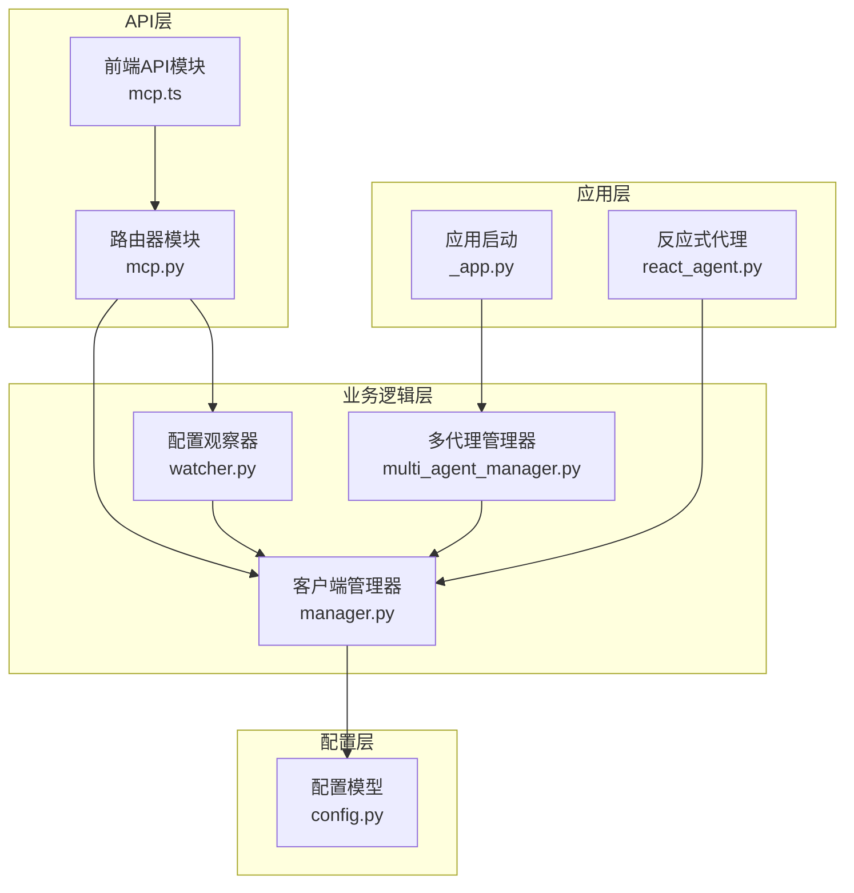
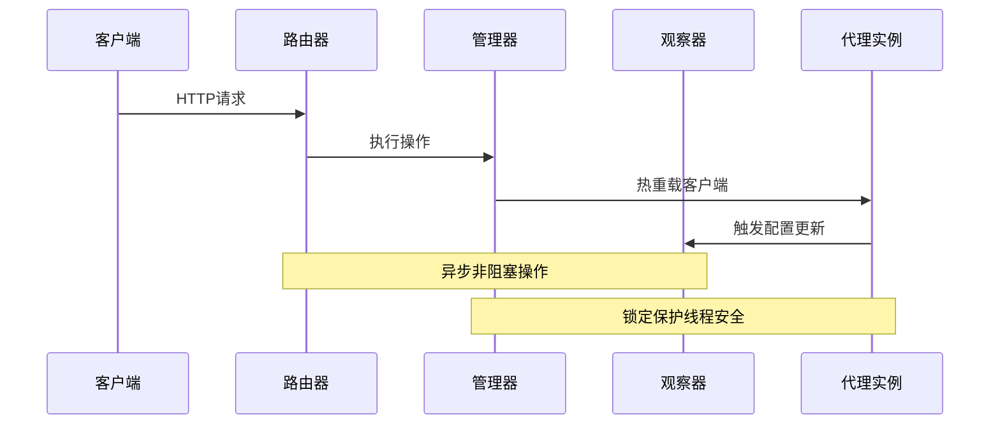
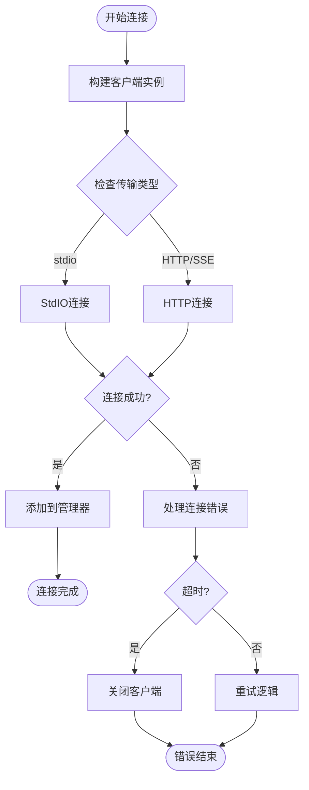
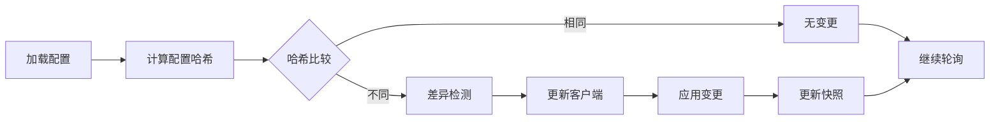
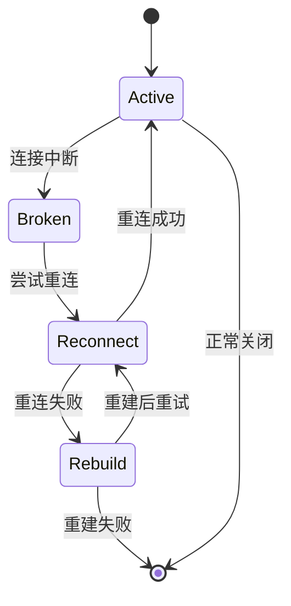
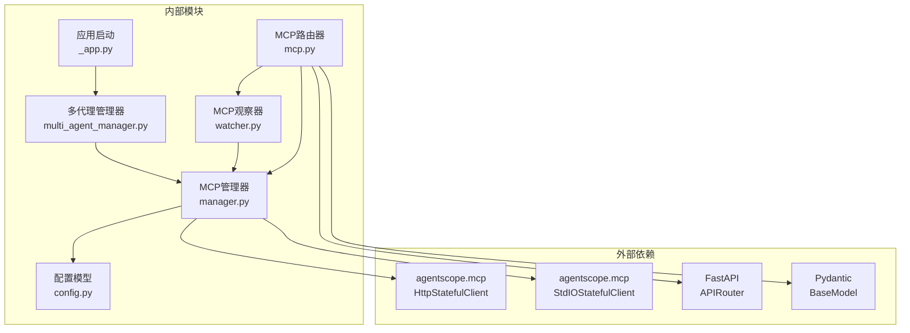

# MCP协议API

<cite>
**本文档引用的文件**
- [mcp.py](file://src/copaw/app/routers/mcp.py)
- [manager.py](file://src/copaw/app/mcp/manager.py)
- [watcher.py](file://src/copaw/app/mcp/watcher.py)
- [config.py](file://src/copaw/config/config.py)
- [mcp.ts](file://console/src/api/modules/mcp.ts)
- [mcp.ts 类型定义](file://console/src/api/types/mcp.ts)
- [_app.py](file://src/copaw/app/_app.py)
- [multi_agent_manager.py](file://src/copaw/app/multi_agent_manager.py)
- [react_agent.py](file://src/copaw/agents/react_agent.py)
</cite>

## 目录
1. [简介](#简介)
2. [项目结构](#项目结构)
3. [核心组件](#核心组件)
4. [架构概览](#架构概览)
5. [详细组件分析](#详细组件分析)
6. [依赖关系分析](#依赖关系分析)
7. [性能考虑](#性能考虑)
8. [故障排除指南](#故障排除指南)
9. [结论](#结论)

## 简介

CoPaw MCP协议API为Model Context Protocol（MCP）客户端管理提供了完整的REST API接口。该系统支持多种传输协议（stdio、streamable_http、sse），允许动态配置和热重载MCP客户端，实现了零停机的客户端生命周期管理。

MCP协议是AI助手与外部工具和服务交互的标准协议，通过统一的接口规范实现模型上下文的扩展和工具调用。本API提供了从客户端配置到运行时管理的完整解决方案。

## 项目结构

CoPaw MCP协议API的代码组织遵循清晰的分层架构：

**图表来源**
- [mcp.py:1-455](file://src/copaw/app/routers/mcp.py#L1-L455)
- [manager.py:1-225](file://src/copaw/app/mcp/manager.py#L1-L225)
- [watcher.py:1-334](file://src/copaw/app/mcp/watcher.py#L1-L334)

**章节来源**
- [mcp.py:1-455](file://src/copaw/app/routers/mcp.py#L1-L455)
- [config.py:535-774](file://src/copaw/config/config.py#L535-L774)

## 核心组件

### MCP客户端路由器

MCP路由器提供RESTful API端点，支持完整的CRUD操作：

- **GET /mcp** - 获取所有MCP客户端列表
- **GET /mcp/{client_key}** - 获取特定客户端详情
- **POST /mcp** - 创建新的MCP客户端
- **PUT /mcp/{client_key}** - 更新现有客户端
- **PATCH /mcp/{client_key}/toggle** - 切换客户端启用状态
- **DELETE /mcp/{client_key}** - 删除客户端

### MCP客户端管理器

负责MCP客户端的生命周期管理，包括：
- 客户端连接和断开
- 动态替换和热重载
- 锁定机制确保线程安全
- 超时控制和错误处理

### 配置观察器

独立的配置监控器，实现：
- 基于轮询的配置变更检测
- 智能增量更新
- 失败重试机制
- 零停机重载

**章节来源**
- [mcp.py:191-455](file://src/copaw/app/routers/mcp.py#L191-L455)
- [manager.py:23-225](file://src/copaw/app/mcp/manager.py#L23-L225)
- [watcher.py:26-334](file://src/copaw/app/mcp/watcher.py#L26-L334)

## 架构概览

CoPaw MCP协议API采用事件驱动的异步架构，支持高并发和零停机操作：

**图表来源**
- [mcp.py:289-301](file://src/copaw/app/routers/mcp.py#L289-L301)
- [manager.py:78-133](file://src/copaw/app/mcp/manager.py#L78-L133)
- [watcher.py:182-190](file://src/copaw/app/mcp/watcher.py#L182-L190)

## 详细组件分析

### API端点规范

#### 客户端列表获取
- **URL**: `GET /mcp`
- **功能**: 返回所有已配置的MCP客户端信息
- **响应**: `List[MCPClientInfo]`
- **认证**: 需要有效的代理上下文

#### 单个客户端获取
- **URL**: `GET /mcp/{client_key}`
- **参数**: `client_key` (路径参数)
- **功能**: 返回指定客户端的详细配置
- **响应**: `MCPClientInfo`
- **错误**: 404 Not Found（客户端不存在）

#### 客户端创建
- **URL**: `POST /mcp`
- **请求体**: `MCPClientCreateRequest`
- **功能**: 创建新的MCP客户端配置
- **响应**: `MCPClientInfo`
- **状态码**: 201 Created
- **并发**: 异步热重载，不影响其他客户端

#### 客户端更新
- **URL**: `PUT /mcp/{client_key}`
- **参数**: `client_key` (路径参数)
- **请求体**: `MCPClientUpdateRequest`
- **功能**: 更新现有客户端配置
- **响应**: `MCPClientInfo`
- **特殊处理**: 环境变量合并策略

#### 启用状态切换
- **URL**: `PATCH /mcp/{client_key}/toggle`
- **参数**: `client_key` (路径参数)
- **功能**: 切换客户端的启用状态
- **响应**: `MCPClientInfo`

#### 客户端删除
- **URL**: `DELETE /mcp/{client_key}`
- **参数**: `client_key` (路径参数)
- **功能**: 删除指定客户端配置
- **响应**: `{ message: string }`

**章节来源**
- [mcp.py:191-455](file://src/copaw/app/routers/mcp.py#L191-L455)
- [mcp.ts:8-53](file://console/src/api/modules/mcp.ts#L8-L53)

### 数据模型定义

#### MCPClientInfo（响应模型）
| 字段名 | 类型 | 描述 | 必需 |
|--------|------|------|------|
| key | string | 客户端唯一标识符 | 是 |
| name | string | 客户端显示名称 | 是 |
| description | string | 客户端描述 | 否 |
| enabled | boolean | 是否启用 | 是 |
| transport | "stdio" \| "streamable_http" \| "sse" | 传输类型 | 是 |
| url | string | 远程端点URL（HTTP/SSE） | 否 |
| headers | Record<string, string> | HTTP头部 | 否 |
| command | string | 启动命令 | 否 |
| args | string[] | 命令行参数 | 否 |
| env | Record<string, string> | 环境变量（已掩码） | 否 |
| cwd | string | 工作目录 | 否 |

#### MCPClientCreateRequest（创建请求）
- **client_key**: string - 客户端键名
- **client**: 对象 - 客户端配置详情

#### MCPClientUpdateRequest（更新请求）
- 支持部分字段更新
- 所有字段均为可选

**章节来源**
- [mcp.ts 类型定义:5-79](file://console/src/api/types/mcp.ts#L5-L79)
- [mcp.py:16-129](file://src/copaw/app/routers/mcp.py#L16-L129)

### 客户端生命周期管理

#### 连接建立流程

**图表来源**
- [manager.py:94-133](file://src/copaw/app/mcp/manager.py#L94-L133)
- [manager.py:188-225](file://src/copaw/app/mcp/manager.py#L188-L225)

#### 热重载机制
- **最小锁定时间**: 连接新客户端时不持有锁
- **原子替换**: 在锁内进行旧客户端关闭和新客户端替换
- **异常安全**: 失败时自动清理资源
- **超时控制**: 默认60秒连接超时

**章节来源**
- [manager.py:78-133](file://src/copaw/app/mcp/manager.py#L78-L133)

### 配置变更监控

#### 变更检测算法

**图表来源**
- [watcher.py:137-140](file://src/copaw/app/mcp/watcher.py#L137-L140)
- [watcher.py:215-233](file://src/copaw/app/mcp/watcher.py#L215-L233)

#### 失败重试策略
- **最大重试次数**: 3次
- **失败跟踪**: 按客户端键名跟踪失败计数
- **跳过机制**: 达到重试上限后跳过该客户端
- **手动干预**: 修改配置后可重新尝试

**章节来源**
- [watcher.py:284-318](file://src/copaw/app/mcp/watcher.py#L284-L318)

### 错误处理和恢复

#### 客户端恢复流程

**图表来源**
- [react_agent.py:434-449](file://src/copaw/agents/react_agent.py#L434-L449)
- [react_agent.py:484-510](file://src/copaw/agents/react_agent.py#L484-L510)

#### 恢复策略
1. **最佳重连**: 优先尝试重新连接现有客户端
2. **重建恢复**: 无法重连时根据元数据重建客户端
3. **引用复用**: 保持管理器共享的客户端引用稳定
4. **异常传播**: 区分MCP内部取消和任务取消

**章节来源**
- [react_agent.py:382-432](file://src/copaw/agents/react_agent.py#L382-L432)
- [react_agent.py:434-549](file://src/copaw/agents/react_agent.py#L434-L549)

## 依赖关系分析

### 组件间依赖图

**图表来源**
- [manager.py:15-16](file://src/copaw/app/mcp/manager.py#L15-L16)
- [mcp.py:8-13](file://src/copaw/app/routers/mcp.py#L8-L13)

### 关键依赖特性

#### 线程安全设计
- **异步锁**: 使用`asyncio.Lock()`保护客户端字典
- **最小锁定时间**: 连接新客户端时释放锁
- **原子操作**: 替换客户端时使用锁保护

#### 配置验证
- **传输类型验证**: 确保stdio需要命令，HTTP需要URL
- **别名映射**: 支持多种传输类型别名
- **环境变量展开**: HTTP客户端支持环境变量替换

**章节来源**
- [manager.py:34-37](file://src/copaw/app/mcp/manager.py#L34-L37)
- [config.py:592-604](file://src/copaw/config/config.py#L592-L604)

## 性能考虑

### 并发处理优化

1. **异步非阻塞**: 所有API操作都是异步的
2. **连接池管理**: 客户端连接按需建立
3. **内存效率**: 使用生成器和流式处理
4. **缓存策略**: 配置快照减少重复计算

### 资源管理

- **超时控制**: 默认60秒连接超时
- **自动清理**: 异常情况下自动关闭客户端
- **内存泄漏防护**: 及时释放不再使用的客户端
- **资源监控**: 记录客户端状态和性能指标

## 故障排除指南

### 常见问题诊断

#### 客户端连接失败
**症状**: 创建或更新客户端时报错
**可能原因**:
- 传输配置错误（stdio缺少命令，HTTP缺少URL）
- 网络连接问题
- 权限不足
- 超时设置过短

**解决步骤**:
1. 验证配置字段完整性
2. 检查网络连通性
3. 查看应用日志
4. 增加超时时间

#### 热重载失败
**症状**: 配置更新后客户端未生效
**可能原因**:
- 客户端连接超时
- 旧客户端关闭失败
- 配置验证失败

**解决步骤**:
1. 检查客户端健康状态
2. 查看重试日志
3. 手动触发重载
4. 检查资源限制

#### 环境变量问题
**症状**: 客户端无法访问敏感信息
**解决步骤**:
1. 确认环境变量已正确设置
2. 检查变量展开是否正常
3. 验证权限设置

**章节来源**
- [manager.py:98-116](file://src/copaw/app/mcp/manager.py#L98-L116)
- [watcher.py:284-318](file://src/copaw/app/mcp/watcher.py#L284-L318)

## 结论

CoPaw MCP协议API提供了一个完整、健壮且高性能的MCP客户端管理解决方案。其关键优势包括：

1. **零停机操作**: 支持热重载和动态配置更新
2. **多传输支持**: 兼容stdio、HTTP和SSE等多种传输协议
3. **企业级可靠性**: 完善的错误处理和恢复机制
4. **开发友好**: 清晰的API设计和丰富的配置选项
5. **性能优化**: 异步架构和资源管理优化

该API适合在生产环境中部署，能够满足各种规模的应用需求，从单用户工具到企业级AI助手平台。