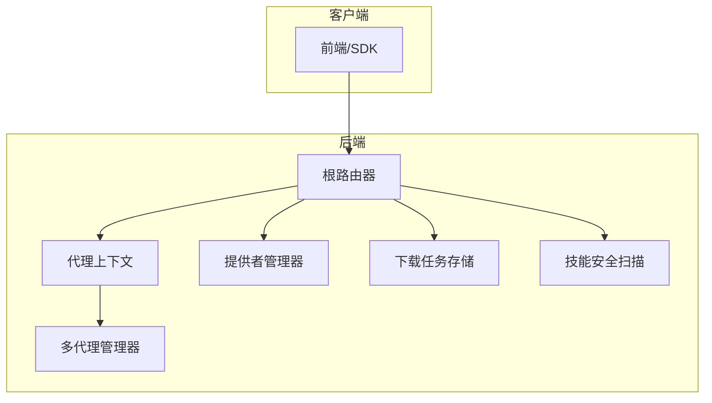
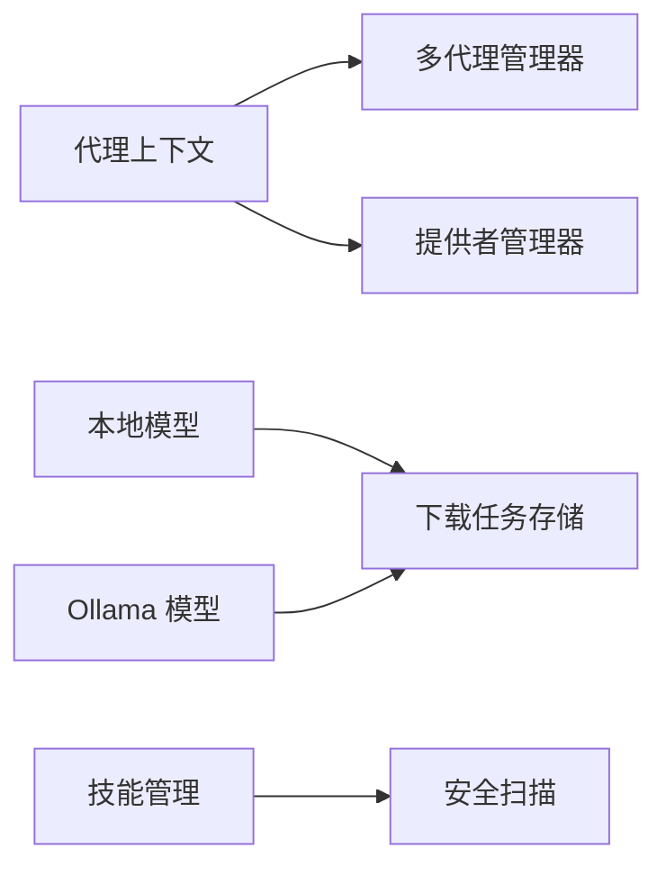

# REST API

<cite>
**本文引用的文件**
- [routers/__init__.py](file://src/copaw/app/routers/__init__.py)
- [routers/agent.py](file://src/copaw/app/routers/agent.py)
- [routers/agents.py](file://src/copaw/app/routers/agents.py)
- [routers/auth.py](file://src/copaw/app/routers/auth.py)
- [routers/console.py](file://src/copaw/app/routers/console.py)
- [routers/envs.py](file://src/copaw/app/routers/envs.py)
- [routers/local_models.py](file://src/copaw/app/routers/local_models.py)
- [routers/mcp.py](file://src/copaw/app/routers/mcp.py)
- [routers/ollama_models.py](file://src/copaw/app/routers/ollama_models.py)
- [routers/providers.py](file://src/copaw/app/routers/providers.py)
- [routers/skills.py](file://src/copaw/app/routers/skills.py)
- [routers/skills_stream.py](file://src/copaw/app/routers/skills_stream.py)
- [routers/tools.py](file://src/copaw/app/routers/tools.py)
- [routers/workspace.py](file://src/copaw/app/routers/workspace.py)
- [routers/token_usage.py](file://src/copaw/app/routers/token_usage.py)
- [routers/voice.py](file://src/copaw/app/routers/voice.py)
</cite>

## 目录
1. [简介](#简介)
2. [项目结构](#项目结构)
3. [核心组件](#核心组件)
4. [架构总览](#架构总览)
5. [详细组件分析](#详细组件分析)
6. [依赖分析](#依赖分析)
7. [性能考量](#性能考量)
8. [故障排查指南](#故障排查指南)
9. [结论](#结论)
10. [附录](#附录)

## 简介
本文件为 CoPaw 的 REST API 文档，覆盖代理管理、多代理管理、认证、配置、控制台、环境变量、本地模型、MCP、Ollama 模型、提供者、技能、技能流、令牌使用、工具、语音、工作空间等模块的全部 HTTP 接口。内容包括：
- URL 模式与请求方法
- 请求/响应格式与数据模型
- 认证与授权要求
- 参数校验规则与必填字段
- 错误码与典型场景
- 版本控制、速率限制与安全建议

## 项目结构
CoPaw 后端基于 FastAPI 构建，API 路由按功能模块拆分，统一在根级路由器中挂载。

```mermaid
graph TB
Root["根路由器<br/>routers/__init__.py"] --> Agent["代理文件与运行配置<br/>routers/agent.py"]
Root --> Agents["多代理管理<br/>routers/agents.py"]
Root --> Auth["认证鉴权<br/>routers/auth.py"]
Root --> Console["控制台聊天与上传<br/>routers/console.py"]
Root --> Envs["环境变量管理<br/>routers/envs.py"]
Root --> LocalModels["本地模型下载与状态<br/>routers/local_models.py"]
Root --> MCP["MCP 客户端配置<br/>routers/mcp.py"]
Root --> OllamaModels["Ollama 模型管理<br/>routers/ollama_models.py"]
Root --> Providers["LLM 提供者与模型<br/>routers/providers.py"]
Root --> Skills["技能管理与导入<br/>routers/skills.py"]
Root --> SkillsStream["技能流式优化<br/>routers/skills_stream.py"]
Root --> Tools["内置工具开关<br/>routers/tools.py"]
Root --> Workspace["工作空间打包/解包<br/>routers/workspace.py"]
Root --> TokenUsage["令牌用量统计<br/>routers/token_usage.py"]
Root --> Voice["语音通道(Twilio)<br/>routers/voice.py"]
```

图表来源
- [routers/__init__.py:23-56](file://src/copaw/app/routers/__init__.py#L23-L56)

章节来源
- [routers/__init__.py:1-56](file://src/copaw/app/routers/__init__.py#L1-L56)

## 核心组件
- 根路由器：集中注册各模块子路由，支持代理作用域路由生成器。
- 代理上下文：通过请求解析当前活动代理，贯穿多数需要“当前代理”的接口。
- 多代理管理器：负责多实例代理的生命周期与热重载。
- 提供者管理器：统一管理 LLM 提供者、模型槽位与全局/代理级激活模型。
- 下载任务存储：本地模型与 Ollama 模型的后台下载任务状态管理。
- 安全扫描：技能导入前的安全扫描与拦截。

章节来源
- [routers/__init__.py:44-56](file://src/copaw/app/routers/__init__.py#L44-L56)
- [routers/agent.py:18-20](file://src/copaw/app/routers/agent.py#L18-L20)
- [routers/agents.py:71-78](file://src/copaw/app/routers/agents.py#L71-L78)

## 架构总览
下图展示关键模块间交互与数据流向：

图表来源
- [routers/__init__.py:23-56](file://src/copaw/app/routers/__init__.py#L23-L56)
- [routers/agent.py:18-20](file://src/copaw/app/routers/agent.py#L18-L20)
- [routers/agents.py:71-78](file://src/copaw/app/routers/agents.py#L71-L78)
- [routers/providers.py:31-40](file://src/copaw/app/routers/providers.py#L31-L40)
- [routers/local_models.py:13-22](file://src/copaw/app/routers/local_models.py#L13-L22)
- [routers/skills.py:22-22](file://src/copaw/app/routers/skills.py#L22-L22)

## 详细组件分析

### 认证与鉴权
- 路径与方法
  - POST /auth/login
  - POST /auth/register
  - GET /auth/status
  - GET /auth/verify
- 请求体
  - 登录：username, password
  - 注册：username, password
  - 验证：Authorization: Bearer <token>
- 响应体
  - 登录/注册：token, username
  - 状态：enabled, has_users
  - 验证：valid, username
- 认证要求
  - 默认未启用时，登录返回空 token；注册仅在 COPAW_AUTH_ENABLED=true 且未注册用户时允许。
  - 验证需携带 Bearer token。
- 错误码
  - 400：用户名或密码为空；无效日期格式；缺少签名等。
  - 401：凭据无效或过期；未提供 token。
  - 403：认证未启用；已注册用户；签名无效。
  - 409：注册失败。
  - 500：内部错误。
- 参数校验
  - 用户名/密码非空；token 必填且以 Bearer 开头。
- 安全建议
  - 生产环境务必启用认证与 HTTPS；定期轮换密钥；限制注册次数。

章节来源
- [routers/auth.py:41-114](file://src/copaw/app/routers/auth.py#L41-L114)

### 控制台（聊天、上传、推送消息）
- 路径与方法
  - POST /console/chat（SSE 流式响应）
  - POST /console/chat/stop
  - POST /console/upload
  - GET /console/files/{agent_id}/{filename}
  - GET /console/push-messages
- 请求体/参数
  - chat：Agent API 请求体（支持 reconnect=true 重连）。
  - chat/stop：chat_id（查询参数）。
  - upload：multipart/form-data 文件。
  - push-messages：可选 session_id。
- 响应
  - chat：SSE 数据流；每条事件为 JSON 字符串。
  - upload：url, file_name, size。
  - push-messages：messages。
- 错误码
  - 400：文件过大；非法文件名；无效日期格式；签名缺失/无效。
  - 404：会话不存在；文件不存在。
  - 503：控制台通道不可用。
- 安全与性能
  - 上传大小限制；路径穿越防护；SSE 连接超时与断开处理。

章节来源
- [routers/console.py:68-241](file://src/copaw/app/routers/console.py#L68-L241)

### 代理（单代理）
- 路径与方法
  - GET /agent/files
  - GET /agent/files/{md_name}
  - PUT /agent/files/{md_name}
  - GET /agent/memory
  - GET /agent/memory/{md_name}
  - PUT /agent/memory/{md_name}
  - GET /agent/language
  - PUT /agent/language
  - GET /agent/audio-mode
  - PUT /agent/audio-mode
  - GET /agent/transcription-provider-type
  - PUT /agent/transcription-provider-type
  - GET /agent/local-whisper-status
  - GET /agent/transcription-providers
  - PUT /agent/transcription-provider
  - GET /agent/running-config
  - PUT /agent/running-config
  - GET /agent/system-prompt-files
  - PUT /agent/system-prompt-files
- 请求体/参数
  - 写入文件：body.content。
  - 更新语言：{"language": "zh|en|ru"}。
  - 更新音频模式：{"audio_mode": "auto|native"}。
  - 设置转录提供者类型：{"transcription_provider_type": "disabled|whisper_api|local_whisper"}。
  - 设置转录提供者：{"provider_id": "..."}。
  - 更新运行配置：AgentsRunningConfig。
  - 更新系统提示文件列表：数组字符串。
- 响应体
  - 列表文件：MdFileInfo[]。
  - 读取文件：MdFileContent。
  - 更新语言/音频模式/转录类型：{"language|audio_mode|transcription_provider_type": "..."}。
  - 本地 Whisper 状态：可用性检查结果。
  - 转录提供者列表：providers, configured_provider_id。
  - 运行配置：AgentsRunningConfig。
- 错误码
  - 400：语言/音频模式/转录类型值无效；无效日期格式。
  - 404：文件不存在。
  - 500：内部错误。
- 参数校验
  - 语言必须为 zh/en/ru；音频模式必须为 auto/native；转录类型必须为 disabled/whisper_api/local_whisper。

章节来源
- [routers/agent.py:39-524](file://src/copaw/app/routers/agent.py#L39-L524)

### 多代理管理
- 路径与方法
  - GET /agents
  - GET /agents/{agentId}
  - POST /agents（创建）
  - PUT /agents/{agentId}（更新）
  - DELETE /agents/{agentId}（删除）
  - GET /agents/{agentId}/files
  - GET /agents/{agentId}/files/{filename}
  - PUT /agents/{agentId}/files/{filename}
  - GET /agents/{agentId}/memory
- 请求体/参数
  - 创建：name, description, workspace_dir, language。
  - 更新：AgentProfileConfig（部分字段可选）。
  - 删除：不可删除 default。
  - 文件读写：MdFileContent。
- 响应体
  - 列表：AgentListResponse。
  - 详情：AgentProfileConfig。
  - 创建：AgentProfileRef。
- 错误码
  - 400：无法生成唯一 ID；删除 default。
  - 404：Agent 不存在；文件不存在。
  - 500：内部错误。
- 热重载
  - 更新/切换语言/系统提示文件后触发后台热重载。

章节来源
- [routers/agents.py:81-536](file://src/copaw/app/routers/agents.py#L81-L536)

### 环境变量管理
- 路径与方法
  - GET /envs
  - PUT /envs（批量保存）
  - DELETE /envs/{key}
- 请求体/参数
  - 批量保存：键值对字典。
  - 删除：key。
- 响应体
  - EnvVar[]。
- 错误码
  - 400：键为空。
  - 404：键不存在。
- 安全建议
  - 敏感信息避免明文存储；必要时加密或外部密管。

章节来源
- [routers/envs.py:32-81](file://src/copaw/app/routers/envs.py#L32-L81)

### 本地模型（下载/状态/删除）
- 路径与方法
  - GET /local-models
  - POST /local-models/download
  - GET /local-models/download-status
  - DELETE /local-models/{model_id}
  - POST /local-models/cancel-download/{task_id}
- 请求体/参数
  - 下载：repo_id, filename, backend(llamacpp|mlx), source(huggingface|modelscope)。
  - 取消：task_id。
  - 删除：model_id。
- 响应体
  - 列表：LocalModelResponse[]。
  - 下载任务：DownloadTaskResponse。
- 错误码
  - 400：枚举值无效；任务不可取消。
  - 404：任务/模型不存在。
  - 501：未安装本地模型依赖。
  - 500：内部错误。
- 并发与清理
  - 后台任务并发池；取消时清理临时文件。

章节来源
- [routers/local_models.py:94-320](file://src/copaw/app/routers/local_models.py#L94-L320)

### Ollama 模型（下载/状态/删除）
- 路径与方法
  - GET /ollama-models
  - POST /ollama-models/download
  - GET /ollama-models/download-status
  - DELETE /ollama-models/{name}
  - DELETE /ollama-models/download/{task_id}
- 请求体/参数
  - 下载：name（模型名）。
  - 取消：task_id。
  - 删除：name。
- 响应体
  - 列表：OllamaModelResponse[]。
  - 下载任务：OllamaDownloadTaskResponse。
- 错误码
  - 501：未安装 Ollama SDK。
  - 500：连接/执行失败。
  - 400：删除失败。
- 依赖
  - 依赖 Ollama 守护进程与 SDK。

章节来源
- [routers/ollama_models.py:152-291](file://src/copaw/app/routers/ollama_models.py#L152-L291)

### 提供者与模型
- 路径与方法
  - GET /models
  - PUT /models/{provider_id}/config
  - POST /models/custom-providers
  - POST /models/{provider_id}/test
  - POST /models/{provider_id}/discover
  - POST /models/{provider_id}/models/test
  - DELETE /models/custom-providers/{provider_id}
  - POST /models/{provider_id}/models
  - DELETE /models/{provider_id}/models/{model_id}
  - GET /models/active
  - PUT /models/active
- 请求体/参数
  - 配置：api_key, base_url, chat_model, generate_kwargs。
  - 自定义提供者：id, name, default_base_url, api_key_prefix, chat_model, models。
  - 测试：api_key/base_url/chat_model（可选）。
  - 发现：同上（可选）。
  - 激活：provider_id, model。
- 响应体
  - ProviderInfo[], ProviderInfo, ActiveModelsInfo。
- 错误码
  - 400/404：提供者/模型不存在；测试失败。
  - 500：内部错误。
- 全局/代理级
  - 优先返回代理级 active_model，否则回退到全局。

章节来源
- [routers/providers.py:79-437](file://src/copaw/app/routers/providers.py#L79-L437)

### 技能管理
- 路径与方法
  - GET /skills
  - GET /skills/available
  - GET /skills/hub/search?q&limit
  - POST /skills/hub/install
  - POST /skills/hub/install/start
  - GET /skills/hub/install/status/{task_id}
  - POST /skills/hub/install/cancel/{task_id}
  - POST /skills/upload
  - POST /skills/batch-enable
  - POST /skills/batch-disable
  - POST /skills
  - POST /skills/{skill_name}/enable
  - POST /skills/{skill_name}/disable
  - DELETE /skills/{skill_name}
  - GET /skills/{skill_name}/files/{source}/{file_path}
- 请求体/参数
  - 创建：name, content, references, scripts。
  - 导入：bundle_url, version, enable, overwrite。
  - ZIP：enable, overwrite。
  - 批量：skill_name[]。
  - 文件：source=builtin|customized。
- 响应体
  - 列表：SkillSpec[]。
  - HubInstallTask。
  - 成功/失败/取消状态。
- 错误码
  - 400/404：技能不存在；上传类型/大小不合法；发现/测试失败。
  - 422：安全扫描未通过（返回严重级别与发现项）。
  - 500/502：内部错误/上游错误。
- 安全扫描
  - 导入前扫描，阻断高危风险；可异步安装并轮询状态。

章节来源
- [routers/skills.py:122-753](file://src/copaw/app/routers/skills.py#L122-L753)

### 技能流式优化（SSE）
- 路径与方法
  - POST /skills/ai/optimize/stream
- 请求体
  - content（要优化的技能内容）
  - language（en/zh/ru）
- 响应
  - SSE 流，逐段返回优化增量；结束发送 done 标记。
- 错误码
  - 500：模型未配置或调用失败。
- 适用场景
  - 在线优化技能描述与结构，提升可读性与规范性。

章节来源
- [routers/skills_stream.py:166-245](file://src/copaw/app/routers/skills_stream.py#L166-L245)

### 工具管理
- 路径与方法
  - GET /tools
  - PATCH /tools/{tool_name}/toggle
- 响应体
  - ToolInfo[]；ToolInfo。
- 错误码
  - 404：工具不存在。
- 热重载
  - 切换后触发后台热重载。

章节来源
- [routers/tools.py:29-133](file://src/copaw/app/routers/tools.py#L29-L133)

### 工作空间
- 路径与方法
  - GET /workspace/download
  - POST /workspace/upload
- 响应
  - download：application/zip 流。
  - upload：{"success": true}。
- 错误码
  - 400：非 zip；路径穿越；无效日期格式。
  - 404：工作区不存在。
  - 500：合并失败。
- 安全建议
  - 上传前校验 zip 结构，防止目录穿越。

章节来源
- [routers/workspace.py:112-203](file://src/copaw/app/routers/workspace.py#L112-L203)

### 令牌使用统计
- 路径与方法
  - GET /token-usage
- 查询参数
  - start_date（YYYY-MM-DD，默认30天前）
  - end_date（YYYY-MM-DD，默认今天）
  - model（模型名）
  - provider（提供者ID）
- 响应体
  - TokenUsageSummary。
- 错误码
  - 400：日期格式无效。

章节来源
- [routers/token_usage.py:23-62](file://src/copaw/app/routers/token_usage.py#L23-L62)

### 语音通道（Twilio）
- 路径与方法
  - POST /voice/incoming
  - WS /voice/ws
  - POST /voice/status-callback
- 安全
  - X-Twilio-Signature 校验；开发模式可跳过。
- 响应
  - incoming：TwiML XML。
  - ws：WebSocket 会话；单次 token 校验。
  - status-callback：204。
- 错误码
  - 403：签名缺失/无效。
  - 404：通道不可用。
  - 500：内部错误。

章节来源
- [routers/voice.py:84-184](file://src/copaw/app/routers/voice.py#L84-L184)

## 依赖分析
- 组件耦合
  - 多数接口依赖代理上下文与多代理管理器进行热重载。
  - 提供者管理器集中管理模型槽位与全局/代理级激活模型。
  - 下载任务存储统一管理本地与 Ollama 的后台任务。
- 外部依赖
  - Ollama SDK（可选）。
  - Twilio SDK（可选）。
- 循环依赖
  - 路由器之间无循环导入；通过应用状态注入管理共享服务。

图表来源
- [routers/agent.py:457-469](file://src/copaw/app/routers/agent.py#L457-L469)
- [routers/providers.py:31-40](file://src/copaw/app/routers/providers.py#L31-L40)
- [routers/local_models.py:13-22](file://src/copaw/app/routers/local_models.py#L13-L22)
- [routers/skills.py:22-22](file://src/copaw/app/routers/skills.py#L22-L22)

## 性能考量
- 流式响应
  - 控制台聊天与技能优化均采用 SSE，降低延迟与内存占用。
- 异步与后台任务
  - 下载任务在后台线程执行，避免阻塞主请求。
- 热重载
  - 更新配置后异步触发，避免同步等待。
- 上传与打包
  - 使用内存缓冲与流式压缩，减少磁盘 IO。

## 故障排查指南
- 认证
  - 401：检查 Authorization 头与 token 是否过期。
  - 403：确认 COPAW_AUTH_ENABLED 与用户状态。
- 控制台
  - 503：检查控制台通道是否初始化。
  - 400：文件过大或路径非法。
- 本地/Ollama 模型
  - 501：未安装对应依赖；确认 extras。
  - 500：连接/执行异常。
- 技能导入
  - 422：安全扫描未通过，查看严重级别与具体发现。
  - 502：上游服务限流或失败。
- 工作空间
  - 400：上传文件非 zip 或存在路径穿越风险。
- 令牌统计
  - 400：日期格式错误或范围非法。

章节来源
- [routers/auth.py:41-114](file://src/copaw/app/routers/auth.py#L41-L114)
- [routers/console.py:163-224](file://src/copaw/app/routers/console.py#L163-L224)
- [routers/local_models.py:134-141](file://src/copaw/app/routers/local_models.py#L134-L141)
- [routers/ollama_models.py:169-175](file://src/copaw/app/routers/ollama_models.py#L169-L175)
- [routers/skills.py:316-322](file://src/copaw/app/routers/skills.py#L316-L322)
- [routers/workspace.py:56-71](file://src/copaw/app/routers/workspace.py#L56-L71)
- [routers/token_usage.py:13-21](file://src/copaw/app/routers/token_usage.py#L13-L21)

## 结论
本文档系统梳理了 CoPaw 的 REST API，涵盖从认证、代理、模型、技能到工作空间与语音通道的完整能力边界。建议在生产环境中：
- 启用 HTTPS 与强认证；
- 对上传与导入流程实施严格的安全扫描；
- 合理设置下载任务并发与超时；
- 使用 SSE 与流式响应优化用户体验。

## 附录
- 版本控制
  - 当前未见显式的 API 版本号；建议在请求头中引入版本标识（如 X-API-Version）以便演进。
- 速率限制
  - 未见内置限流策略；建议结合网关或中间件实现基于 IP/用户/令牌的配额控制。
- 安全考虑
  - 传输加密、最小权限、敏感信息脱敏（如环境变量值掩码）、输入校验与路径穿越防护。