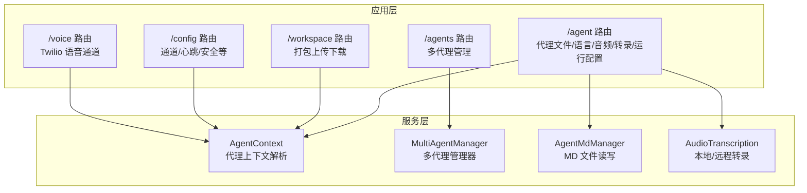
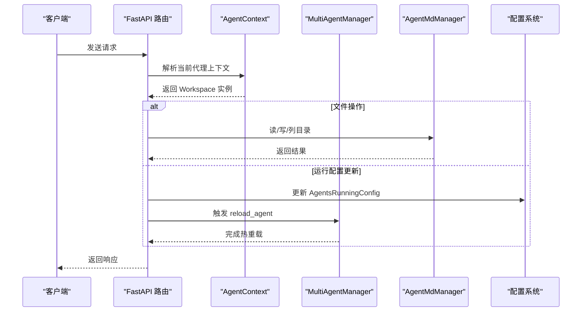
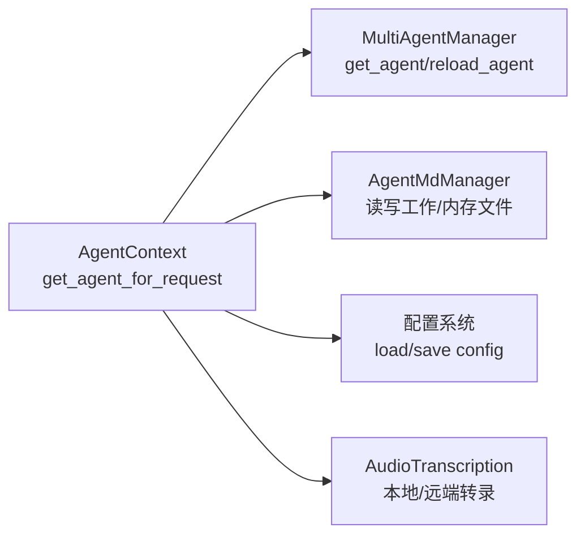

# 代理管理API

<cite>
**本文档引用的文件**
- [agent.py](file://src/copaw/app/routers/agent.py)
- [agents.py](file://src/copaw/app/routers/agents.py)
- [workspace.py](file://src/copaw/app/routers/workspace.py)
- [config.py](file://src/copaw/app/routers/config.py)
- [schemas_config.py](file://src/copaw/app/routers/schemas_config.py)
- [agent_context.py](file://src/copaw/app/agent_context.py)
- [multi_agent_manager.py](file://src/copaw/app/multi_agent_manager.py)
- [_app.py](file://src/copaw/app/_app.py)
- [agent_md_manager.py](file://src/copaw/agents/memory/agent_md_manager.py)
- [audio_transcription.py](file://src/copaw/agents/utils/audio_transcription.py)
- [voice.py](file://src/copaw/app/routers/voice.py)
- [config.py（配置模型）](file://src/copaw/config/config.py)
</cite>

## 目录
1. [简介](#简介)
2. [项目结构](#项目结构)
3. [核心组件](#核心组件)
4. [架构总览](#架构总览)
5. [详细组件分析](#详细组件分析)
6. [依赖关系分析](#依赖关系分析)
7. [性能考量](#性能考量)
8. [故障排查指南](#故障排查指南)
9. [结论](#结论)
10. [附录](#附录)

## 简介
本文件为 CoPaw 代理管理 API 的完整技术文档，覆盖以下主题：
- 代理工作文件与内存文件的读写与列表
- 代理语言设置与自动复制默认 MD 文件
- 音频处理模式与转录提供者配置
- 运行时配置（AgentsRunningConfig）热重载
- 多代理管理与工作区打包上传下载
- 认证与代理上下文选择机制

本文件提供每个端点的 URL 模式、请求方法、请求/响应格式、参数校验规则、错误码说明以及典型请求/响应示例路径。

## 项目结构
CoPaw 后端采用 FastAPI 构建，路由按功能模块划分：
- 代理文件与内存文件：/agent 前缀
- 多代理管理：/agents 前缀
- 工作区打包上传下载：/workspace 前缀
- 全局配置与通道配置：/config 前缀
- 语音通道（Twilio）：/voice 路由挂载在应用根部

图表来源
- [agent.py:1-524](file://src/copaw/app/routers/agent.py#L1-L524)
- [agents.py:1-536](file://src/copaw/app/routers/agents.py#L1-L536)
- [workspace.py:1-203](file://src/copaw/app/routers/workspace.py#L1-L203)
- [config.py:1-565](file://src/copaw/app/routers/config.py#L1-L565)
- [voice.py:1-184](file://src/copaw/app/routers/voice.py#L1-L184)
- [agent_context.py:1-131](file://src/copaw/app/agent_context.py#L1-L131)
- [multi_agent_manager.py:1-200](file://src/copaw/app/multi_agent_manager.py#L1-L200)
- [agent_md_manager.py:1-124](file://src/copaw/agents/memory/agent_md_manager.py#L1-L124)
- [audio_transcription.py:1-200](file://src/copaw/agents/utils/audio_transcription.py#L1-L200)

章节来源
- [agent.py:1-524](file://src/copaw/app/routers/agent.py#L1-L524)
- [agents.py:1-536](file://src/copaw/app/routers/agents.py#L1-L536)
- [workspace.py:1-203](file://src/copaw/app/routers/workspace.py#L1-L203)
- [config.py:1-565](file://src/copaw/app/routers/config.py#L1-L565)
- [voice.py:1-184](file://src/copaw/app/routers/voice.py#L1-L184)

## 核心组件
- 代理上下文解析：根据请求头、通道元数据或配置解析当前活跃代理实例。
- 多代理管理器：负责代理实例的懒加载、生命周期与热重载。
- MD 文件管理器：统一管理工作目录与内存目录下的 Markdown 文件读写与列表。
- 音频转录工具：支持本地 Whisper 与远端 Whisper API，提供可用性检查与提供者列表查询。

章节来源
- [agent_context.py:22-96](file://src/copaw/app/agent_context.py#L22-L96)
- [multi_agent_manager.py:34-82](file://src/copaw/app/multi_agent_manager.py#L34-L82)
- [agent_md_manager.py:8-124](file://src/copaw/agents/memory/agent_md_manager.py#L8-L124)
- [audio_transcription.py:87-147](file://src/copaw/agents/utils/audio_transcription.py#L87-L147)

## 架构总览
下图展示代理管理 API 的关键交互流程：请求进入后通过代理上下文解析确定目标代理，再调用相应服务完成业务逻辑，并在需要时触发热重载。

图表来源
- [agent.py:45-107](file://src/copaw/app/routers/agent.py#L45-L107)
- [agent.py:441-470](file://src/copaw/app/routers/agent.py#L441-L470)
- [agent_context.py:22-96](file://src/copaw/app/agent_context.py#L22-L96)
- [multi_agent_manager.py:200-260](file://src/copaw/app/multi_agent_manager.py#L200-L260)
- [agent_md_manager.py:19-124](file://src/copaw/agents/memory/agent_md_manager.py#L19-L124)

## 详细组件分析

### 代理文件管理（/agent）
- 列表工作文件
  - 方法与路径：GET /agent/files
  - 请求参数：无
  - 响应：数组，元素为文件元数据对象
  - 错误：500 服务器异常
  - 示例路径：[agent.py:45-58](file://src/copaw/app/routers/agent.py#L45-L58)
- 读取工作文件
  - 方法与路径：GET /agent/files/{md_name}
  - 路径参数：md_name（文件名，可带或不带 .md）
  - 响应：包含 content 字段的字符串内容
  - 错误：404 文件不存在；500 服务器异常
  - 示例路径：[agent.py:69-84](file://src/copaw/app/routers/agent.py#L69-L84)
- 写入工作文件
  - 方法与路径：PUT /agent/files/{md_name}
  - 路径参数：md_name
  - 请求体：包含 content 的 JSON 对象
  - 响应：{"written": true}
  - 错误：500 服务器异常
  - 示例路径：[agent.py:93-107](file://src/copaw/app/routers/agent.py#L93-L107)
- 列表内存文件
  - 方法与路径：GET /agent/memory
  - 响应：数组，元素为文件元数据对象
  - 错误：500 服务器异常
  - 示例路径：[agent.py:116-131](file://src/copaw/app/routers/agent.py#L116-L131)
- 读取内存文件
  - 方法与路径：GET /agent/memory/{md_name}
  - 响应：包含 content 的字符串内容
  - 错误：404 文件不存在；500 服务器异常
  - 示例路径：[agent.py:140-155](file://src/copaw/app/routers/agent.py#L140-L155)
- 写入内存文件
  - 方法与路径：PUT /agent/memory/{md_name}
  - 请求体：包含 content 的 JSON 对象
  - 响应：{"written": true}
  - 错误：500 服务器异常
  - 示例路径：[agent.py:164-178](file://src/copaw/app/routers/agent.py#L164-L178)

章节来源
- [agent.py:39-178](file://src/copaw/app/routers/agent.py#L39-L178)
- [agent_md_manager.py:19-124](file://src/copaw/agents/memory/agent_md_manager.py#L19-L124)

### 代理语言设置（/agent/language）
- 获取语言
  - 方法与路径：GET /agent/language
  - 响应：{"language": "zh|en|ru", "agent_id": "..."}
  - 示例路径：[agent.py:186-193](file://src/copaw/app/routers/agent.py#L186-L193)
- 更新语言
  - 方法与路径：PUT /agent/language
  - 请求体：{"language": "zh|en|ru"}
  - 行为：更新语言并可选复制对应语言的默认 MD 文件到工作区
  - 响应：{"language": "...", "copied_files": [...], "agent_id": "..."}
  - 参数校验：language 必须为 "zh"/"en"/"ru" 之一
  - 错误：400 无效语言；500 服务器异常
  - 示例路径：[agent.py:204-252](file://src/copaw/app/routers/agent.py#L204-L252)

章节来源
- [agent.py:181-252](file://src/copaw/app/routers/agent.py#L181-L252)

### 音频处理模式（/agent/audio-mode）
- 获取模式
  - 方法与路径：GET /agent/audio-mode
  - 响应：{"audio_mode": "auto|native"}
  - 示例路径：[agent.py:263-266](file://src/copaw/app/routers/agent.py#L263-L266)
- 更新模式
  - 方法与路径：PUT /agent/audio-mode
  - 请求体：{"audio_mode": "auto|native"}
  - 参数校验：audio_mode 必须为 "auto"/"native"
  - 响应：{"audio_mode": "..."}
  - 错误：400 无效模式；500 服务器异常
  - 示例路径：[agent.py:278-299](file://src/copaw/app/routers/agent.py#L278-L299)

章节来源
- [agent.py:255-299](file://src/copaw/app/routers/agent.py#L255-L299)

### 转录提供者类型（/agent/transcription-provider-type）
- 获取类型
  - 方法与路径：GET /agent/transcription-provider-type
  - 响应：{"transcription_provider_type": "disabled|whisper_api|local_whisper"}
  - 示例路径：[agent.py:310-317](file://src/copaw/app/routers/agent.py#L310-L317)
- 设置类型
  - 方法与路径：PUT /agent/transcription-provider-type
  - 请求体：{"transcription_provider_type": "disabled|whisper_api|local_whisper"}
  - 参数校验：必须为上述三值之一
  - 响应：{"transcription_provider_type": "..."}
  - 错误：400 无效类型；500 服务器异常
  - 示例路径：[agent.py:330-354](file://src/copaw/app/routers/agent.py#L330-L354)

章节来源
- [agent.py:302-354](file://src/copaw/app/routers/agent.py#L302-L354)

### 本地 Whisper 可用性检查（/agent/local-whisper-status）
- 方法与路径：GET /agent/local-whisper-status
- 响应：{"available": true|false, "ffmpeg_installed": true|false, "whisper_installed": true|false}
- 示例路径：[agent.py:365-371](file://src/copaw/app/routers/agent.py#L365-L371)

章节来源
- [agent.py:357-371](file://src/copaw/app/routers/agent.py#L357-L371)

### 转录提供者列表（/agent/transcription-providers）
- 方法与路径：GET /agent/transcription-providers
- 响应：{"providers": [...], "configured_provider_id": "..."}
- 提供者项：{"id": "...", "name": "...", "available": true|false}
- 示例路径：[agent.py:382-392](file://src/copaw/app/routers/agent.py#L382-L392)

章节来源
- [agent.py:374-392](file://src/copaw/app/routers/agent.py#L374-L392)

### 设置转录提供者（/agent/transcription-provider）
- 方法与路径：PUT /agent/transcription-provider
- 请求体：{"provider_id": "..."}（空字符串可取消设置）
- 响应：{"provider_id": "..."}
- 示例路径：[agent.py:403-417](file://src/copaw/app/routers/agent.py#L403-L417)

章节来源
- [agent.py:395-417](file://src/copaw/app/routers/agent.py#L395-L417)

### 运行配置（/agent/running-config）
- 获取运行配置
  - 方法与路径：GET /agent/running-config
  - 响应：AgentsRunningConfig 对象
  - 示例路径：[agent.py:426-432](file://src/copaw/app/routers/agent.py#L426-L432)
- 更新运行配置
  - 方法与路径：PUT /agent/running-config
  - 请求体：AgentsRunningConfig 对象
  - 行为：保存配置并异步触发热重载
  - 响应：返回更新后的配置对象
  - 示例路径：[agent.py:441-470](file://src/copaw/app/routers/agent.py#L441-L470)

章节来源
- [agent.py:420-470](file://src/copaw/app/routers/agent.py#L420-L470)
- [config.py（配置模型）:252-353](file://src/copaw/config/config.py#L252-L353)

### 系统提示文件（/agent/system-prompt-files）
- 获取系统提示文件列表
  - 方法与路径：GET /agent/system-prompt-files
  - 响应：字符串数组
  - 示例路径：[agent.py:479-485](file://src/copaw/app/routers/agent.py#L479-L485)
- 更新系统提示文件列表
  - 方法与路径：PUT /agent/system-prompt-files
  - 请求体：字符串数组
  - 行为：保存并异步触发热重载
  - 响应：返回更新后的数组
  - 示例路径：[agent.py:494-523](file://src/copaw/app/routers/agent.py#L494-L523)

章节来源
- [agent.py:473-523](file://src/copaw/app/routers/agent.py#L473-L523)

### 多代理管理（/agents）
- 列表所有代理
  - 方法与路径：GET /agents
  - 响应：包含 agents 数组的结构，每个元素含 id/name/description/workspace_dir
  - 示例路径：[agents.py:87-117](file://src/copaw/app/routers/agents.py#L87-L117)
- 获取单个代理详情
  - 方法与路径：GET /agents/{agentId}
  - 路径参数：agentId
  - 响应：AgentProfileConfig
  - 错误：404 未找到；500 服务器异常
  - 示例路径：[agents.py:126-134](file://src/copaw/app/routers/agents.py#L126-L134)
- 创建新代理
  - 方法与路径：POST /agents
  - 请求体：CreateAgentRequest（name/description/workspace_dir/language）
  - 响应：AgentProfileRef（包含生成的 agent id 与 workspace_dir）
  - 行为：自动生成短 ID，初始化工作区与默认文件
  - 错误：500 生成 ID 失败；500 服务器异常
  - 示例路径：[agents.py:144-209](file://src/copaw/app/routers/agents.py#L144-L209)
- 更新代理
  - 方法与路径：PUT /agents/{agentId}
  - 请求体：AgentProfileConfig（仅更新传入字段）
  - 行为：合并更新并异步触发热重载
  - 错误：404 未找到；500 服务器异常
  - 示例路径：[agents.py:218-260](file://src/copaw/app/routers/agents.py#L218-L260)
- 删除代理
  - 方法与路径：DELETE /agents/{agentId}
  - 行为：停止运行实例并从配置中移除（不可删除 default）
  - 响应：{"success": true, "agent_id": "..."}
  - 错误：404 未找到；400 不可删除 default；500 服务器异常
  - 示例路径：[agents.py:268-298](file://src/copaw/app/routers/agents.py#L268-L298)

章节来源
- [agents.py:81-298](file://src/copaw/app/routers/agents.py#L81-L298)

### 代理工作区文件（/agents/{agentId}/...）
- 列表工作区文件
  - 方法与路径：GET /agents/{agentId}/files
  - 响应：文件元数据数组
  - 错误：404 未找到；500 服务器异常
  - 示例路径：[agents.py:307-328](file://src/copaw/app/routers/agents.py#L307-L328)
- 读取工作区文件
  - 方法与路径：GET /agents/{agentId}/files/{filename}
  - 响应：包含 content 的字符串
  - 错误：404 未找到；500 服务器异常
  - 示例路径：[agents.py:337-361](file://src/copaw/app/routers/agents.py#L337-L361)
- 写入工作区文件
  - 方法与路径：PUT /agents/{agentId}/files/{filename}
  - 请求体：包含 content 的 JSON 对象
  - 响应：{"written": true, "filename": "..."}
  - 错误：500 服务器异常
  - 示例路径：[agents.py:370-390](file://src/copaw/app/routers/agents.py#L370-L390)
- 列表内存文件
  - 方法与路径：GET /agents/{agentId}/memory
  - 响应：文件元数据数组
  - 错误：500 服务器异常
  - 示例路径：[agents.py:399-420](file://src/copaw/app/routers/agents.py#L399-L420)

章节来源
- [agents.py:301-420](file://src/copaw/app/routers/agents.py#L301-L420)

### 工作区打包上传下载（/workspace）
- 下载工作区为 ZIP
  - 方法与路径：GET /workspace/download
  - 响应：application/zip 流，文件名为 copaw_workspace_{agent_id}_{时间戳}.zip
  - 错误：404 工作区不存在；500 服务器异常
  - 示例路径：[workspace.py:126-150](file://src/copaw/app/routers/workspace.py#L126-L150)
- 上传 ZIP 并合并到工作区
  - 方法与路径：POST /workspace/upload
  - 请求体：multipart/form-data，文件字段为 zip
  - 行为：校验 zip 安全性（防路径穿越），解压并合并到工作区
  - 响应：{"success": true}
  - 错误：400 非法 zip 或路径穿越；400 非 zip 类型；500 合并失败
  - 示例路径：[workspace.py:165-202](file://src/copaw/app/routers/workspace.py#L165-L202)

章节来源
- [workspace.py:112-202](file://src/copaw/app/routers/workspace.py#L112-L202)

### 全局配置与通道（/config）
- 列出所有通道配置
  - 方法与路径：GET /config/channels
  - 响应：键为通道名，值为该通道配置对象
  - 示例路径：[config.py:64-98](file://src/copaw/app/routers/config.py#L64-L98)
- 获取通道类型列表
  - 方法与路径：GET /config/channels/types
  - 响应：字符串数组（可用通道类型）
  - 示例路径：[config.py:106-108](file://src/copaw/app/routers/config.py#L106-L108)
- 更新全部通道配置
  - 方法与路径：PUT /config/channels
  - 请求体：ChannelConfig
  - 行为：保存并异步触发热重载
  - 示例路径：[config.py:117-152](file://src/copaw/app/routers/config.py#L117-L152)
- 获取单个通道配置
  - 方法与路径：GET /config/channels/{channel_name}
  - 响应：对应通道配置对象
  - 错误：404 未找到
  - 示例路径：[config.py:161-196](file://src/copaw/app/routers/config.py#L161-L196)
- 更新单个通道配置
  - 方法与路径：PUT /config/channels/{channel_name}
  - 请求体：该通道配置对象（字典或对应 Pydantic 模型）
  - 行为：保存并异步触发热重载
  - 错误：404 未找到
  - 示例路径：[config.py:205-265](file://src/copaw/app/routers/config.py#L205-L265)
- 获取心跳配置
  - 方法与路径：GET /config/heartbeat
  - 响应：心跳配置对象（含 enabled/every/target/activeHours）
  - 示例路径：[config.py:273-283](file://src/copaw/app/routers/config.py#L273-L283)
- 更新心跳配置
  - 方法与路径：PUT /config/heartbeat
  - 请求体：HeartbeatBody（enabled/every/target/activeHours）
  - 行为：保存并异步重新调度心跳
  - 示例路径：[config.py:291-325](file://src/copaw/app/routers/config.py#L291-L325)
- 获取/设置用户时区
  - 方法与路径：GET /config/user-timezone
  - 方法与路径：PUT /config/user-timezone（{"timezone": "..."}）
  - 参数校验：timezone 不能为空
  - 错误：400 缺少时区
  - 示例路径：[config.py:360-379](file://src/copaw/app/routers/config.py#L360-L379)

章节来源
- [config.py:59-379](file://src/copaw/app/routers/config.py#L59-L379)
- [schemas_config.py:11-23](file://src/copaw/app/routers/schemas_config.py#L11-L23)

### 语音通道（Twilio，/voice）
- 入站电话回调
  - 方法与路径：POST /voice/incoming
  - 行为：校验 Twilio 签名，返回 TwiML 将呼叫转发至 WebSocket
  - 错误：403 签名校验失败；500 语音通道不可用
  - 示例路径：[voice.py:84-122](file://src/copaw/app/routers/voice.py#L84-L122)
- WebSocket 会话
  - 方法与路径：WebSocket /voice/ws
  - 行为：校验一次性 token，建立会话并交由处理器处理
  - 错误：1008 无效 token；断开后结束会话
  - 示例路径：[voice.py:125-161](file://src/copaw/app/routers/voice.py#L125-L161)
- 状态回调
  - 方法与路径：POST /voice/status-callback
  - 行为：根据状态结束会话
  - 示例路径：[voice.py:163-183](file://src/copaw/app/routers/voice.py#L163-L183)

章节来源
- [voice.py:84-183](file://src/copaw/app/routers/voice.py#L84-L183)

## 依赖关系分析
- 代理上下文解析优先级：显式 agent_id > 请求 state 中的 agent_id > X-Agent-Id 头 > 通道元数据中的 target_agent_id > 配置中的 active_agent
- 多代理管理器负责代理实例的懒加载与热重载，确保更新配置后零停机切换
- 文件操作统一通过 AgentMdManager 访问工作区与内存目录，保证一致性
- 音频转录能力依赖 ProviderManager 提供的可用凭据，支持本地 Whisper 与远端 Whisper API

图表来源
- [agent_context.py:22-96](file://src/copaw/app/agent_context.py#L22-L96)
- [multi_agent_manager.py:34-82](file://src/copaw/app/multi_agent_manager.py#L34-L82)
- [agent_md_manager.py:8-124](file://src/copaw/agents/memory/agent_md_manager.py#L8-L124)
- [audio_transcription.py:87-147](file://src/copaw/agents/utils/audio_transcription.py#L87-L147)

章节来源
- [agent_context.py:22-96](file://src/copaw/app/agent_context.py#L22-L96)
- [multi_agent_manager.py:34-82](file://src/copaw/app/multi_agent_manager.py#L34-L82)
- [agent_md_manager.py:8-124](file://src/copaw/agents/memory/agent_md_manager.py#L8-L124)
- [audio_transcription.py:87-147](file://src/copaw/agents/utils/audio_transcription.py#L87-L147)

## 性能考量
- 热重载采用异步后台任务，避免阻塞主请求线程
- 文件读写与打包下载使用异步线程池与流式响应，降低内存占用
- 本地 Whisper 使用单例模型缓存，减少重复加载开销
- 通道配置更新与心跳调度均采用非阻塞方式执行

## 故障排查指南
- 400 参数校验失败
  - 语言/音频模式/转录提供者类型不在允许集合内
  - 时区为空
  - ZIP 非法或包含路径穿越
- 404 未找到
  - 代理不存在
  - 文件不存在
  - 通道未配置
- 403 Twilio 签名校验失败
  - 缺失签名头或签名不匹配
- 500 服务器异常
  - 文件系统错误
  - 配置保存失败
  - ProviderManager 未初始化
  - 本地 Whisper 依赖缺失

章节来源
- [agent.py:214-223](file://src/copaw/app/routers/agent.py#L214-L223)
- [agent.py:286-295](file://src/copaw/app/routers/agent.py#L286-L295)
- [agent.py:330-350](file://src/copaw/app/routers/agent.py#L330-L350)
- [config.py:370-375](file://src/copaw/app/routers/config.py#L370-L375)
- [workspace.py:56-70](file://src/copaw/app/routers/workspace.py#L56-L70)
- [voice.py:42-81](file://src/copaw/app/routers/voice.py#L42-L81)

## 结论
本文档系统梳理了 CoPaw 代理管理 API 的文件、语言、音频与转录、运行配置、多代理与工作区等核心能力，明确了各端点的 URL 模式、请求方法、参数校验与错误处理策略。通过代理上下文解析与多代理管理器，系统实现了灵活的代理选择与零停机热重载，满足生产环境对稳定性与可维护性的要求。

## 附录
- 认证与代理选择
  - 代理上下文解析顺序：显式 agent_id → 请求 state → X-Agent-Id → 通道元数据 → 配置 active_agent
  - 应用启动时初始化 MultiAgentManager 并加载已配置代理
  - 示例路径：[agent_context.py:22-96](file://src/copaw/app/agent_context.py#L22-L96)，[_app.py:182-207](file://src/copaw/app/_app.py#L182-L207)

章节来源
- [agent_context.py:22-96](file://src/copaw/app/agent_context.py#L22-L96)
- [_app.py:182-207](file://src/copaw/app/_app.py#L182-L207)