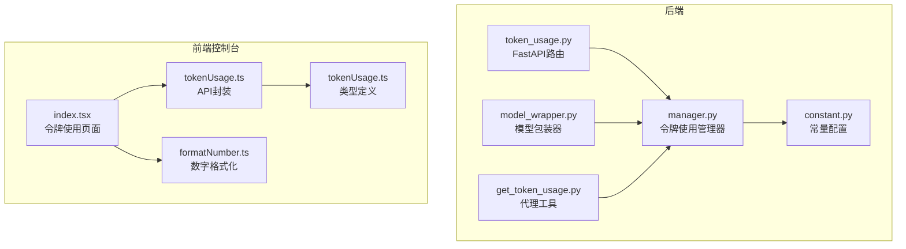
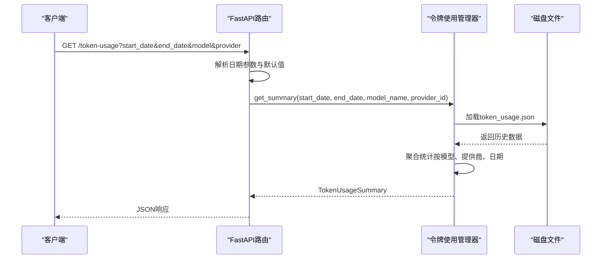
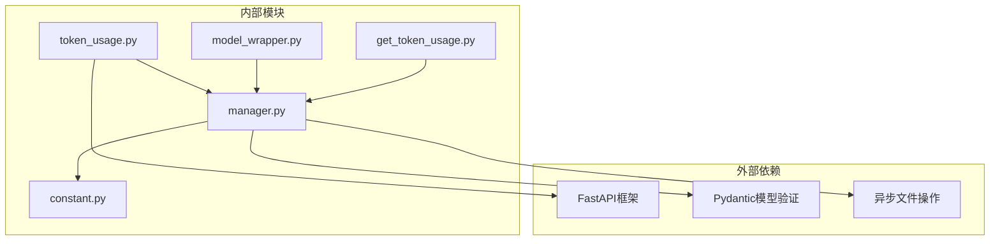

# 令牌使用API

<cite>
**本文档引用的文件**
- [src\copaw\app\routers\token_usage.py](file://src\copaw\app\routers\token_usage.py)
- [src\copaw\token_usage\manager.py](file://src\copaw\token_usage\manager.py)
- [src\copaw\token_usage\model_wrapper.py](file://src\copaw\token_usage\model_wrapper.py)
- [src\copaw\agents\tools\get_token_usage.py](file://src\copaw\agents\tools\get_token_usage.py)
- [src\copaw\constant.py](file://src\copaw\constant.py)
- [console\src\api\modules\tokenUsage.ts](file://console\src\api\modules\tokenUsage.ts)
- [console\src\api\types\tokenUsage.ts](file://console\src\api\types\tokenUsage.ts)
- [console\src\pages\Settings\TokenUsage\index.tsx](file://console\src\pages\Settings\TokenUsage\index.tsx)
- [console\src\utils\formatNumber.ts](file://console\src\utils\formatNumber.ts)
</cite>

## 目录
1. [简介](#简介)
2. [项目结构](#项目结构)
3. [核心组件](#核心组件)
4. [架构概览](#架构概览)
5. [详细组件分析](#详细组件分析)
6. [依赖关系分析](#依赖关系分析)
7. [性能考虑](#性能考虑)
8. [故障排除指南](#故障排除指南)
9. [结论](#结论)

## 简介
本文档详细描述了CoPaw项目的令牌使用API，该API用于记录、查询和统计大模型调用产生的令牌消耗。系统通过统一的令牌使用管理器记录每次模型调用的输入令牌（prompt_tokens）、输出令牌（completion_tokens）以及调用次数（call_count），并支持按日期、模型提供商和模型名称进行聚合统计。

该API的核心功能包括：
- 令牌消耗查询：支持指定时间范围内的令牌使用统计
- 使用历史记录：按日期、模型和提供商维度的历史数据
- 成本统计：基于令牌消耗的费用估算（需结合外部计费规则）
- 配额管理：通过令牌使用统计辅助配额监控与告警

## 项目结构
令牌使用API涉及后端FastAPI路由、令牌使用管理器、模型包装器以及前端控制台界面等多个组件。下图展示了相关文件之间的关系：

**图表来源**
- [src\copaw\app\routers\token_usage.py:1-62](file://src\copaw\app\routers\token_usage.py#L1-62)
- [src\copaw\token_usage\manager.py:1-309](file://src\copaw\token_usage\manager.py#L1-309)
- [src\copaw\token_usage\model_wrapper.py:1-71](file://src\copaw\token_usage\model_wrapper.py#L1-71)
- [src\copaw\agents\tools\get_token_usage.py:1-86](file://src\copaw\agents\tools\get_token_usage.py#L1-86)
- [src\copaw\constant.py:72-98](file://src\copaw\constant.py#L72-98)
- [console\src\api\modules\tokenUsage.ts:1-21](file://console\src\api\modules\tokenUsage.ts#L1-21)
- [console\src\api\types\tokenUsage.ts:1-17](file://console\src\api\types\tokenUsage.ts#L1-17)
- [console\src\pages\Settings\TokenUsage\index.tsx:1-223](file://console\src\pages\Settings\TokenUsage\index.tsx#L1-223)
- [console\src\utils\formatNumber.ts:1-27](file://console\src\utils\formatNumber.ts#L1-27)

**章节来源**
- [src\copaw\app\routers\token_usage.py:1-62](file://src\copaw\app\routers\token_usage.py#L1-62)
- [src\copaw\token_usage\manager.py:1-309](file://src\copaw\token_usage\manager.py#L1-309)
- [src\copaw\token_usage\model_wrapper.py:1-71](file://src\copaw\token_usage\model_wrapper.py#L1-71)
- [src\copaw\agents\tools\get_token_usage.py:1-86](file://src\copaw\agents\tools\get_token_usage.py#L1-86)
- [src\copaw\constant.py:72-98](file://src\copaw\constant.py#L72-98)
- [console\src\api\modules\tokenUsage.ts:1-21](file://console\src\api\modules\tokenUsage.ts#L1-21)
- [console\src\api\types\tokenUsage.ts:1-17](file://console\src\api\types\tokenUsage.ts#L1-17)
- [console\src\pages\Settings\TokenUsage\index.tsx:1-223](file://console\src\pages\Settings\TokenUsage\index.tsx#L1-223)
- [console\src\utils\formatNumber.ts:1-27](file://console\src\utils\formatNumber.ts#L1-27)

## 核心组件
- FastAPI路由层：提供RESTful接口，接收查询参数并返回聚合统计结果
- 令牌使用管理器：负责数据的持久化存储、查询与聚合计算
- 模型包装器：在模型调用时自动记录令牌使用情况
- 前端API封装与页面：提供用户友好的查询界面与数据展示

**章节来源**
- [src\copaw\app\routers\token_usage.py:23-62](file://src\copaw\app\routers\token_usage.py#L23-62)
- [src\copaw\token_usage\manager.py:62-309](file://src\copaw\token_usage\manager.py#L62-309)
- [src\copaw\token_usage\model_wrapper.py:15-71](file://src\copaw\token_usage\model_wrapper.py#L15-71)
- [console\src\api\modules\tokenUsage.ts:17-21](file://console\src\api\modules\tokenUsage.ts#L17-21)

## 架构概览
下图展示了令牌使用API从请求到响应的完整流程：

**图表来源**
- [src\copaw\app\routers\token_usage.py:28-61](file://src\copaw\app\routers\token_usage.py#L28-61)
- [src\copaw\token_usage\manager.py:198-294](file://src\copaw\token_usage\manager.py#L198-294)

## 详细组件分析

### API端点定义
- 端点路径：`/token-usage`
- 请求方法：GET
- 功能：获取令牌使用汇总统计，支持按日期、模型和提供商过滤

查询参数
- start_date: 开始日期（YYYY-MM-DD，包含），默认为结束日期前30天
- end_date: 结束日期（YYYY-MM-DD，包含），默认为今天
- model: 模型名称（可选）
- provider: 提供商ID（可选）

响应格式（TokenUsageSummary）
- total_prompt_tokens: 总输入令牌数
- total_completion_tokens: 总输出令牌数
- total_calls: 总调用次数
- by_model: 以"provider:model"为键的聚合统计
- by_provider: 以提供商ID为键的聚合统计
- by_date: 以日期（YYYY-MM-DD）为键的聚合统计

**章节来源**
- [src\copaw\app\routers\token_usage.py:28-61](file://src\copaw\app\routers\token_usage.py#L28-61)
- [src\copaw\token_usage\manager.py:42-60](file://src\copaw\token_usage\manager.py#L42-60)

### 数据模型与统计逻辑
令牌使用管理器定义了以下核心数据模型：
- TokenUsageStats：包含prompt_tokens、completion_tokens、call_count
- TokenUsageRecord：单条记录，包含date、provider_id、model
- TokenUsageByModel：按模型聚合的统计
- TokenUsageSummary：最终返回的汇总结果

统计聚合逻辑
- 按模型聚合：键为"provider_id:model"，累加prompt_tokens、completion_tokens和call_count
- 按提供商聚合：按provider_id累加
- 按日期聚合：按日期字符串累加

**章节来源**
- [src\copaw\token_usage\manager.py:19-60](file://src\copaw\token_usage\manager.py#L19-60)
- [src\copaw\token_usage\manager.py:198-294](file://src\copaw\token_usage\manager.py#L198-294)

### 模型调用记录机制
模型包装器在每次模型调用后自动记录令牌使用：
- 对同步调用：直接读取响应中的usage字段
- 对流式调用：捕获最后一个chunk中的usage字段
- 记录内容：provider_id、model_name、prompt_tokens、completion_tokens、at_date（当日）

**章节来源**
- [src\copaw\token_usage\model_wrapper.py:15-71](file://src\copaw\token_usage\model_wrapper.py#L15-71)

### 前端集成与展示
前端控制台提供了令牌使用查询界面：
- 支持日期范围选择，默认显示最近30天
- 展示总输入/输出令牌数卡片
- 按模型和按日期的表格展示
- 数字格式化：千位分隔符与K/M/B缩写

**章节来源**
- [console\src\pages\Settings\TokenUsage\index.tsx:19-223](file://console\src\pages\Settings\TokenUsage\index.tsx#L19-223)
- [console\src\api\modules\tokenUsage.ts:17-21](file://console\src\api\modules\tokenUsage.ts#L17-21)
- [console\src\utils\formatNumber.ts:5-26](file://console\src\utils\formatNumber.ts#L5-26)

## 依赖关系分析
令牌使用API的依赖关系如下：

**图表来源**
- [src\copaw\app\routers\token_usage.py:6-8](file://src\copaw\app\routers\token_usage.py#L6-8)
- [src\copaw\token_usage\manager.py:12-14](file://src\copaw\token_usage\manager.py#L12-14)
- [src\copaw\token_usage\model_wrapper.py:7-12](file://src\copaw\token_usage\model_wrapper.py#L7-12)
- [src\copaw\agents\tools\get_token_usage.py](file://src\copaw\agents\tools\get_token_usage.py#L9)
- [src\copaw\constant.py](file://src\copaw\constant.py#L14)

**章节来源**
- [src\copaw\app\routers\token_usage.py:6-8](file://src\copaw\app\routers\token_usage.py#L6-8)
- [src\copaw\token_usage\manager.py:12-14](file://src\copaw\token_usage\manager.py#L12-14)
- [src\copaw\token_usage\model_wrapper.py:7-12](file://src\copaw\token_usage\model_wrapper.py#L7-12)
- [src\copaw\agents\tools\get_token_usage.py](file://src\copaw\agents\tools\get_token_usage.py#L9)
- [src\copaw\constant.py](file://src\copaw\constant.py#L14)

## 性能考虑
- 文件存储：令牌数据以JSON格式存储在本地文件中，适合中小规模使用
- 异步I/O：使用aiofiles进行异步文件读写，减少阻塞
- 内存优化：查询时按日期逐日遍历，避免一次性加载全部数据
- 缓存策略：管理器采用单例模式，避免重复实例化

## 故障排除指南
常见问题与解决方案：
- 文件读写错误：检查工作目录权限和token_usage.json文件是否存在
- 日期解析失败：确保start_date和end_date格式为YYYY-MM-DD
- 数据缺失：确认模型调用是否通过包装器进行，以确保记录被正确保存
- 前端显示异常：检查API响应格式与前端类型定义是否一致

**章节来源**
- [src\copaw\token_usage\manager.py:73-108](file://src\copaw\token_usage\manager.py#L73-108)
- [src\copaw\app\routers\token_usage.py:13-21](file://src\copaw\app\routers\token_usage.py#L13-21)

## 结论
CoPaw的令牌使用API提供了一个完整的令牌消耗记录、查询与统计解决方案。通过统一的管理器和包装器，系统能够自动记录每次模型调用的令牌使用情况，并支持灵活的时间范围与维度过滤查询。配合前端控制台的可视化展示，用户可以方便地监控和分析令牌使用模式，为成本控制和配额管理提供数据支撑。