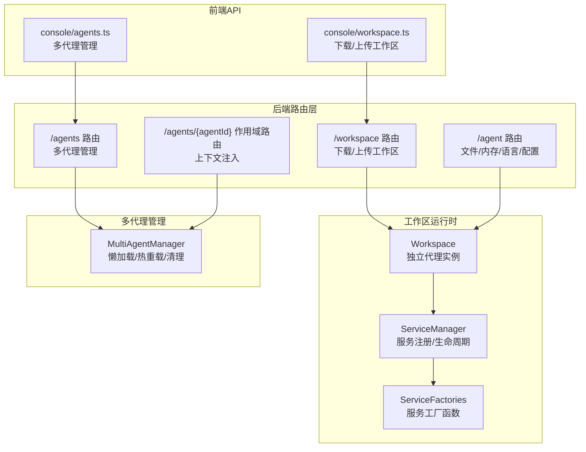
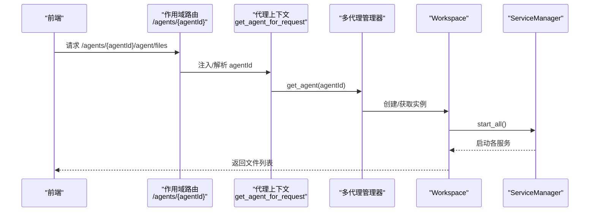
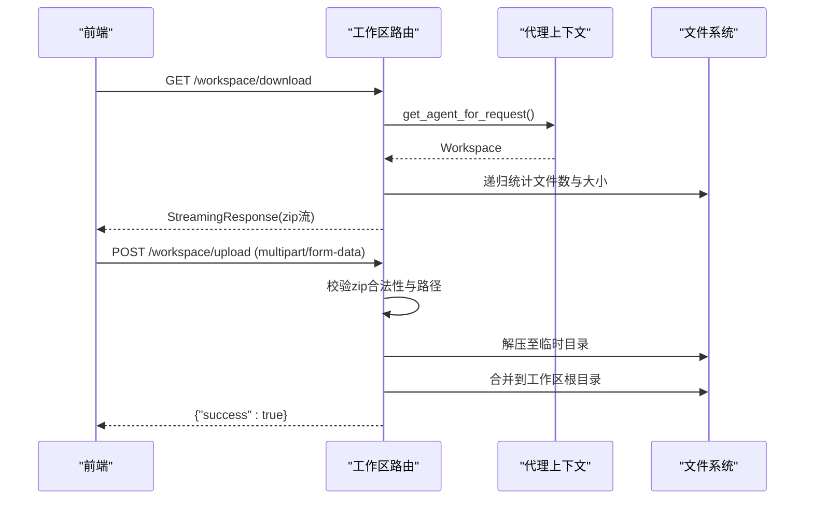
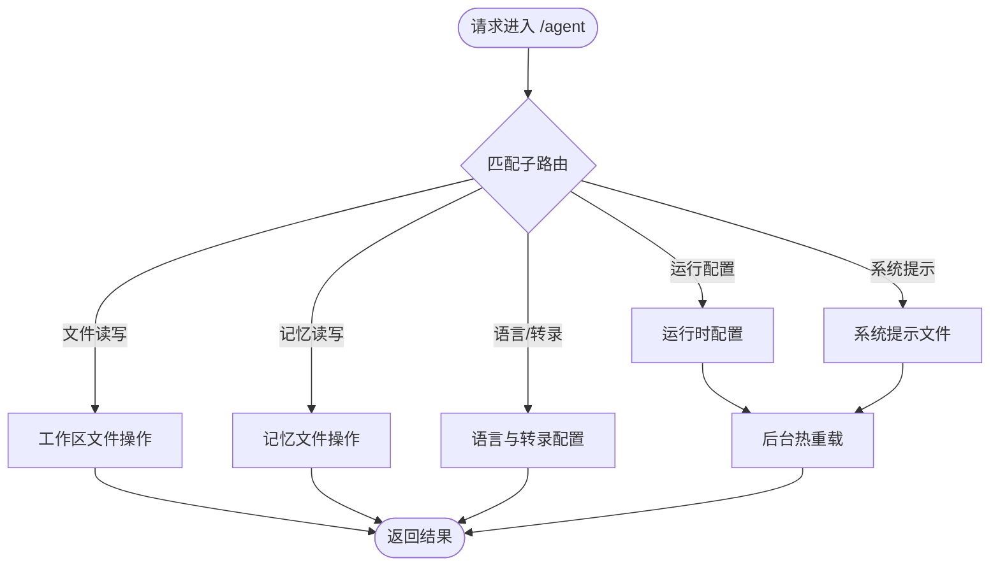
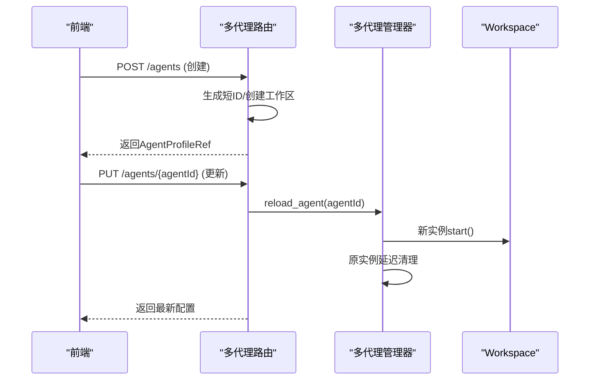
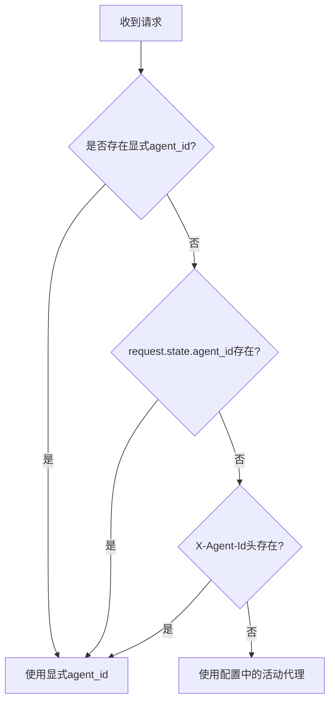
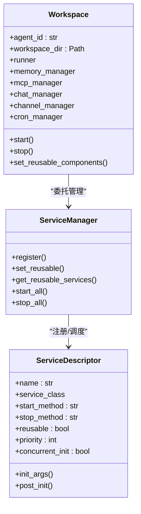
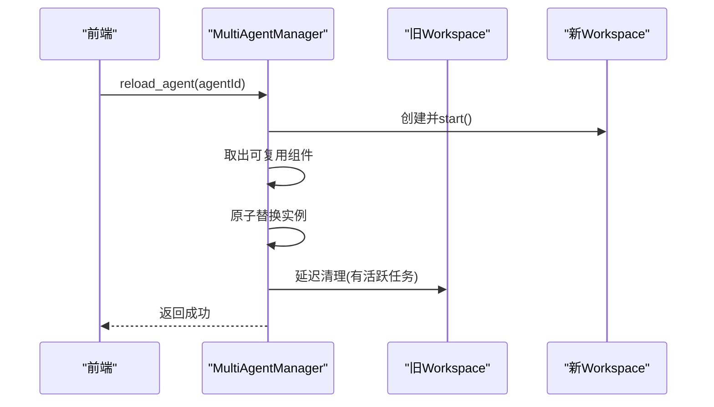
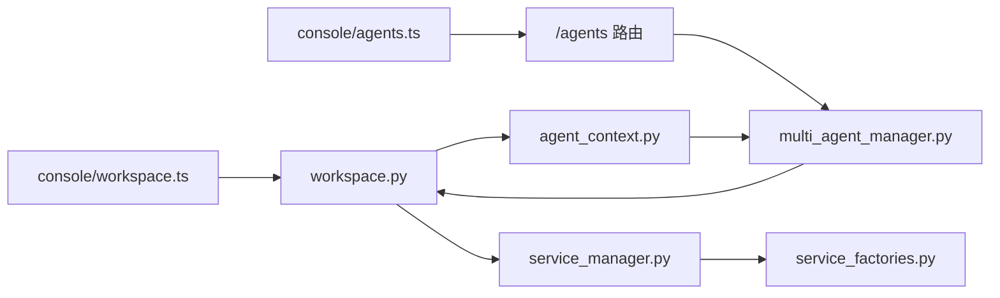

# 工作空间API

<cite>
**本文档引用的文件**
- [workspace.py](file://src/copaw/app/routers/workspace.py)
- [workspace.py](file://src/copaw/app/workspace/workspace.py)
- [service_manager.py](file://src/copaw/app/workspace/service_manager.py)
- [service_factories.py](file://src/copaw/app/workspace/service_factories.py)
- [multi_agent_manager.py](file://src/copaw/app/multi_agent_manager.py)
- [agent_scoped.py](file://src/copaw/app/routers/agent_scoped.py)
- [agent_context.py](file://src/copaw/app/agent_context.py)
- [agents.py](file://src/copaw/app/routers/agents.py)
- [agent.py](file://src/copaw/app/routers/agent.py)
- [workspace.ts](file://console/src/api/modules/workspace.ts)
- [agents.ts](file://console/src/api/modules/agents.ts)
- [config.py](file://src/copaw/config/config.py)
</cite>

## 目录
1. [简介](#简介)
2. [项目结构](#项目结构)
3. [核心组件](#核心组件)
4. [架构总览](#架构总览)
5. [详细组件分析](#详细组件分析)
6. [依赖关系分析](#依赖关系分析)
7. [性能考虑](#性能考虑)
8. [故障排除指南](#故障排除指南)
9. [结论](#结论)

## 简介
本文件为 CoPaw 工作空间API的权威技术文档，覆盖多工作区支持、代理生命周期管理、配置隔离与数据持久化等能力。重点围绕以下主题：
- 工作空间管理：工作区打包下载、上传合并、文件系统读写、内存文件管理
- 多代理实例管理：按代理ID隔离的路由、上下文注入、零停机热重载
- 工作区配置：运行时配置更新、系统提示文件管理、语言与转录设置
- 资源监控：服务启动顺序、并发初始化、优雅停止与延迟清理

## 项目结构
工作空间API由后端FastAPI路由层、工作区运行时封装、服务管理器与多代理管理器共同组成，并通过前端模块提供统一调用入口。

**图表来源**
- [workspace.py:112-203](file://src/copaw/app/routers/workspace.py#L112-L203)
- [agent.py:39-179](file://src/copaw/app/routers/agent.py#L39-L179)
- [agents.py:81-117](file://src/copaw/app/routers/agents.py#L81-L117)
- [agent_scoped.py:53-92](file://src/copaw/app/routers/agent_scoped.py#L53-L92)
- [workspace.py:39-78](file://src/copaw/app/workspace/workspace.py#L39-L78)
- [service_manager.py:74-105](file://src/copaw/app/workspace/service_manager.py#L74-L105)
- [service_factories.py:18-62](file://src/copaw/app/workspace/service_factories.py#L18-L62)
- [multi_agent_manager.py:17-82](file://src/copaw/app/multi_agent_manager.py#L17-L82)
- [workspace.ts:62-137](file://console/src/api/modules/workspace.ts#L62-L137)
- [agents.ts:11-47](file://console/src/api/modules/agents.ts#L11-L47)

**章节来源**
- [workspace.py:18-203](file://src/copaw/app/routers/workspace.py#L18-L203)
- [agent.py:20-179](file://src/copaw/app/routers/agent.py#L20-L179)
- [agents.py:28-117](file://src/copaw/app/routers/agents.py#L28-L117)
- [agent_scoped.py:53-92](file://src/copaw/app/routers/agent_scoped.py#L53-L92)
- [workspace.py:39-78](file://src/copaw/app/workspace/workspace.py#L39-L78)
- [service_manager.py:74-105](file://src/copaw/app/workspace/service_manager.py#L74-L105)
- [service_factories.py:18-62](file://src/copaw/app/workspace/service_factories.py#L18-L62)
- [multi_agent_manager.py:17-82](file://src/copaw/app/multi_agent_manager.py#L17-L82)
- [workspace.ts:62-137](file://console/src/api/modules/workspace.ts#L62-L137)
- [agents.ts:11-47](file://console/src/api/modules/agents.ts#L11-L47)

## 核心组件
- 工作区路由（/workspace）：提供工作区打包下载与上传合并功能，确保路径安全与内容校验。
- 代理文件路由（/agent）：提供工作区文件与记忆文件的读写、语言与转录配置管理。
- 多代理路由（/agents）：提供代理的创建、查询、更新、删除与文件读写。
- 作用域路由（/agents/{agentId}）：通过中间件注入代理上下文，实现多代理隔离。
- 工作区运行时（Workspace）：封装Runner、ChannelManager、MemoryManager、MCPClientManager、CronManager等完整运行时。
- 服务管理器（ServiceManager）：统一注册、并发初始化、启动/停止与可复用组件管理。
- 多代理管理器（MultiAgentManager）：懒加载、零停机热重载、延迟清理与全局生命周期管理。

**章节来源**
- [workspace.py:112-203](file://src/copaw/app/routers/workspace.py#L112-L203)
- [agent.py:39-179](file://src/copaw/app/routers/agent.py#L39-L179)
- [agents.py:81-117](file://src/copaw/app/routers/agents.py#L81-L117)
- [agent_scoped.py:15-51](file://src/copaw/app/routers/agent_scoped.py#L15-L51)
- [workspace.py:39-136](file://src/copaw/app/workspace/workspace.py#L39-L136)
- [service_manager.py:74-200](file://src/copaw/app/workspace/service_manager.py#L74-L200)
- [multi_agent_manager.py:17-82](file://src/copaw/app/multi_agent_manager.py#L17-L82)

## 架构总览
工作空间API采用“路由层-运行时-服务管理-多代理管理”的分层设计，通过上下文注入与作用域路由实现多代理隔离；通过服务描述符与工厂函数实现组件解耦与可复用；通过多代理管理器实现零停机热重载与资源回收。

**图表来源**
- [agent_scoped.py:15-51](file://src/copaw/app/routers/agent_scoped.py#L15-L51)
- [agent_context.py:22-84](file://src/copaw/app/agent_context.py#L22-L84)
- [multi_agent_manager.py:34-82](file://src/copaw/app/multi_agent_manager.py#L34-L82)
- [workspace.py:311-337](file://src/copaw/app/workspace/workspace.py#L311-L337)
- [service_manager.py:171-200](file://src/copaw/app/workspace/service_manager.py#L171-L200)

## 详细组件分析

### 工作区打包与上传（/workspace）
- 下载工作区
  - URL: GET /workspace/download
  - 功能: 将代理工作区目录打包为zip流式返回
  - 安全: 仅对已存在的工作区目录进行打包
  - 响应: application/zip 流，Content-Disposition包含时间戳命名的文件名
- 上传工作区
  - URL: POST /workspace/upload
  - 功能: 校验zip合法性与路径安全性，解压并合并到工作区目录
  - 安全: 路径穿越检测，拒绝越界路径
  - 行为: 文件覆盖、目录合并，保留其他文件不变

**图表来源**
- [workspace.py:112-150](file://src/copaw/app/routers/workspace.py#L112-L150)
- [workspace.py:153-203](file://src/copaw/app/routers/workspace.py#L153-L203)
- [agent_context.py:22-84](file://src/copaw/app/agent_context.py#L22-L84)

**章节来源**
- [workspace.py:112-203](file://src/copaw/app/routers/workspace.py#L112-L203)
- [agent_context.py:22-84](file://src/copaw/app/agent_context.py#L22-L84)

### 代理文件与内存管理（/agent）
- 工作区文件
  - GET /agent/files：列出工作区markdown文件元信息
  - GET /agent/files/{md_name}：读取指定文件内容
  - PUT /agent/files/{md_name}：创建或更新文件内容
- 记忆文件
  - GET /agent/memory：列出记忆目录文件
  - GET /agent/memory/{md_name}：读取记忆文件
  - PUT /agent/memory/{md_name}：创建或更新记忆文件
- 语言与转录配置
  - GET/PUT /agent/language：获取/设置代理MD文件语言（zh/en/ru）
  - GET/PUT /agent/audio-mode：获取/设置音频处理模式（auto/native）
  - GET/PUT /agent/transcription-provider-type：获取/设置转录提供者类型
  - GET /agent/local-whisper-status：检查本地whisper可用性
  - GET/PUT /agent/transcription-providers：列出/设置转录提供者
- 运行时配置
  - GET/PUT /agent/running-config：获取/更新运行时配置（异步触发热重载）
- 系统提示文件
  - GET/PUT /agent/system-prompt-files：获取/更新系统提示文件列表

**图表来源**
- [agent.py:39-179](file://src/copaw/app/routers/agent.py#L39-L179)
- [agent.py:180-524](file://src/copaw/app/routers/agent.py#L180-L524)

**章节来源**
- [agent.py:39-179](file://src/copaw/app/routers/agent.py#L39-L179)
- [agent.py:180-524](file://src/copaw/app/routers/agent.py#L180-L524)

### 多代理管理（/agents）
- 列表与详情
  - GET /agents：列出所有已配置代理摘要
  - GET /agents/{agentId}：获取代理完整配置
- 创建与更新
  - POST /agents：创建新代理（自动生成短ID，初始化默认工作区）
  - PUT /agents/{agentId}：更新代理配置（异步触发热重载）
- 删除
  - DELETE /agents/{agentId}：停止运行实例并从配置移除（不可删除default）
- 代理文件
  - GET /agents/{agentId}/files：列出代理工作区文件
  - GET/PUT /agents/{agentId}/files/{filename}：读取/写入文件

**图表来源**
- [agents.py:137-210](file://src/copaw/app/routers/agents.py#L137-L210)
- [agents.py:212-261](file://src/copaw/app/routers/agents.py#L212-L261)
- [agents.py:263-299](file://src/copaw/app/routers/agents.py#L263-L299)
- [agents.py:301-391](file://src/copaw/app/routers/agents.py#L301-L391)
- [multi_agent_manager.py:200-312](file://src/copaw/app/multi_agent_manager.py#L200-L312)

**章节来源**
- [agents.py:81-117](file://src/copaw/app/routers/agents.py#L81-L117)
- [agents.py:137-210](file://src/copaw/app/routers/agents.py#L137-L210)
- [agents.py:212-261](file://src/copaw/app/routers/agents.py#L212-L261)
- [agents.py:263-299](file://src/copaw/app/routers/agents.py#L263-L299)
- [agents.py:301-391](file://src/copaw/app/routers/agents.py#L301-L391)
- [multi_agent_manager.py:200-312](file://src/copaw/app/multi_agent_manager.py#L200-L312)

### 代理作用域与上下文注入（/agents/{agentId}）
- 中间件优先级
  - 路径参数 > X-Agent-Id 头 > 配置中的活动代理
- 上下文变量
  - 使用contextvars存储当前agentId，贯穿异步调用链
- 代理选择策略
  - 显式agent_id > request.state.agent_id > X-Agent-Id > 配置活动代理

**图表来源**
- [agent_scoped.py:15-51](file://src/copaw/app/routers/agent_scoped.py#L15-L51)
- [agent_context.py:22-84](file://src/copaw/app/agent_context.py#L22-L84)

**章节来源**
- [agent_scoped.py:15-51](file://src/copaw/app/routers/agent_scoped.py#L15-L51)
- [agent_context.py:22-84](file://src/copaw/app/agent_context.py#L22-L84)

### 工作区运行时与服务管理
- Workspace
  - 组成：Runner、MemoryManager、MCPClientManager、ChatManager、ChannelManager、CronManager
  - 生命周期：start()/stop()，支持可复用组件与热重载
- ServiceManager
  - 描述符注册：ServiceDescriptor定义服务类、初始化参数、后置初始化、启动/停止方法、优先级、并发初始化
  - 启动流程：按优先级分组，同优先级并发，不同优先级顺序执行
  - 停止流程：逆序优先级并行停止，跳过可复用组件（final=false）
- ServiceFactories
  - MCP服务初始化与绑定
  - ChatManager复用与绑定
  - ChannelManager条件创建与进程绑定
  - 配置监视器创建（AgentConfigWatcher、MCPConfigWatcher）

**图表来源**
- [workspace.py:39-136](file://src/copaw/app/workspace/workspace.py#L39-L136)
- [service_manager.py:30-105](file://src/copaw/app/workspace/service_manager.py#L30-L105)
- [service_manager.py:171-323](file://src/copaw/app/workspace/service_manager.py#L171-L323)
- [service_factories.py:18-163](file://src/copaw/app/workspace/service_factories.py#L18-L163)

**章节来源**
- [workspace.py:39-136](file://src/copaw/app/workspace/workspace.py#L39-L136)
- [service_manager.py:30-105](file://src/copaw/app/workspace/service_manager.py#L30-L105)
- [service_manager.py:171-323](file://src/copaw/app/workspace/service_manager.py#L171-L323)
- [service_factories.py:18-163](file://src/copaw/app/workspace/service_factories.py#L18-L163)

### 多代理管理器与零停机热重载
- 懒加载：首次访问才创建并启动Workspace
- 热重载：原子替换旧实例，后台优雅停止，支持延迟清理
- 并发启动：批量预加载与并发启动
- 全局停止：取消延迟清理任务并停止所有代理

**图表来源**
- [multi_agent_manager.py:200-312](file://src/copaw/app/multi_agent_manager.py#L200-L312)
- [multi_agent_manager.py:83-179](file://src/copaw/app/multi_agent_manager.py#L83-L179)

**章节来源**
- [multi_agent_manager.py:200-312](file://src/copaw/app/multi_agent_manager.py#L200-L312)
- [multi_agent_manager.py:83-179](file://src/copaw/app/multi_agent_manager.py#L83-L179)

## 依赖关系分析
- 路由层依赖代理上下文与多代理管理器，实现按代理ID隔离与懒加载
- Workspace依赖ServiceManager进行组件生命周期管理，ServiceFactories负责具体服务装配
- 前端模块通过统一的workspaceApi与agentsApi封装后端接口，自动注入X-Agent-Id头

**图表来源**
- [workspace.ts:62-137](file://console/src/api/modules/workspace.ts#L62-L137)
- [agents.ts:11-47](file://console/src/api/modules/agents.ts#L11-L47)
- [workspace.py:126-203](file://src/copaw/app/routers/workspace.py#L126-L203)
- [agents.py:81-117](file://src/copaw/app/routers/agents.py#L81-L117)
- [agent_context.py:22-84](file://src/copaw/app/agent_context.py#L22-L84)
- [multi_agent_manager.py:34-82](file://src/copaw/app/multi_agent_manager.py#L34-L82)
- [service_manager.py:74-105](file://src/copaw/app/workspace/service_manager.py#L74-L105)
- [service_factories.py:18-62](file://src/copaw/app/workspace/service_factories.py#L18-L62)

**章节来源**
- [workspace.ts:62-137](file://console/src/api/modules/workspace.ts#L62-L137)
- [agents.ts:11-47](file://console/src/api/modules/agents.ts#L11-L47)
- [workspace.py:126-203](file://src/copaw/app/routers/workspace.py#L126-L203)
- [agents.py:81-117](file://src/copaw/app/routers/agents.py#L81-L117)
- [agent_context.py:22-84](file://src/copaw/app/agent_context.py#L22-L84)
- [multi_agent_manager.py:34-82](file://src/copaw/app/multi_agent_manager.py#L34-L82)
- [service_manager.py:74-105](file://src/copaw/app/workspace/service_manager.py#L74-L105)
- [service_factories.py:18-62](file://src/copaw/app/workspace/service_factories.py#L18-L62)

## 性能考虑
- 并发初始化：ServiceManager按优先级分组，同组并发启动，显著缩短启动时间
- 零停机热重载：新实例先行启动，原子替换，避免请求中断
- 延迟清理：在有活跃任务时延后停止旧实例，保证长连接/流式任务不被中断
- 异步I/O：工作区打包/上传使用异步线程池与流式响应，降低内存占用

## 故障排除指南
- 路径穿越错误
  - 现象：上传zip时报错“Zip contains unsafe path”
  - 原因：zip中包含相对路径越界
  - 处理：确保上传包内路径不包含上层目录引用
- 工作区不存在
  - 现象：下载报404
  - 原因：工作区目录不存在
  - 处理：确认代理ID正确且工作区已初始化
- 代理未找到
  - 现象：多代理管理返回404
  - 原因：配置中不存在该agentId
  - 处理：检查/agents配置或使用默认代理
- 热重载失败
  - 现象：更新配置后异常
  - 处理：查看后台日志，确认新实例启动成功并完成原子替换

**章节来源**
- [workspace.py:56-71](file://src/copaw/app/routers/workspace.py#L56-L71)
- [workspace.py:133-137](file://src/copaw/app/routers/workspace.py#L133-L137)
- [agents.py:274-285](file://src/copaw/app/routers/agents.py#L274-L285)
- [multi_agent_manager.py:278-288](file://src/copaw/app/multi_agent_manager.py#L278-L288)

## 结论
CoPaw工作空间API通过清晰的分层设计与严格的上下文隔离，提供了稳定可靠的多工作区与多代理管理能力。结合服务管理器的并发初始化与多代理管理器的零停机热重载，系统在易用性与可靠性之间取得良好平衡。建议在生产环境中配合路径安全校验与资源监控，确保大规模部署的稳定性。