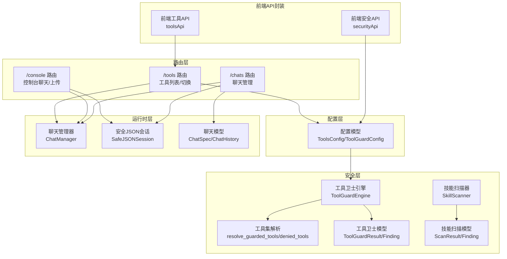
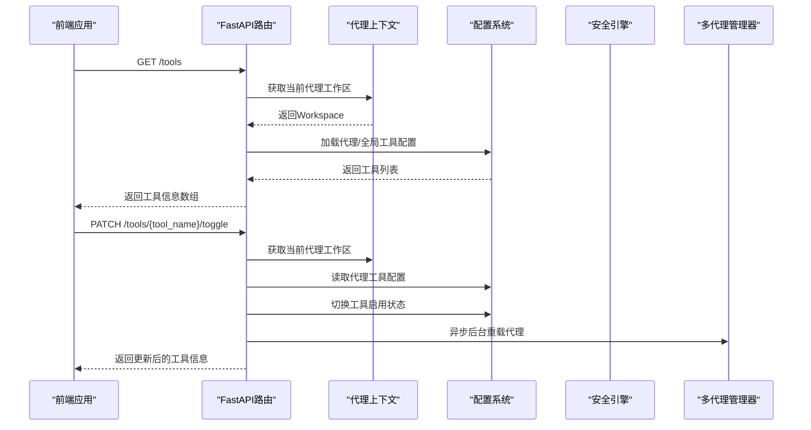
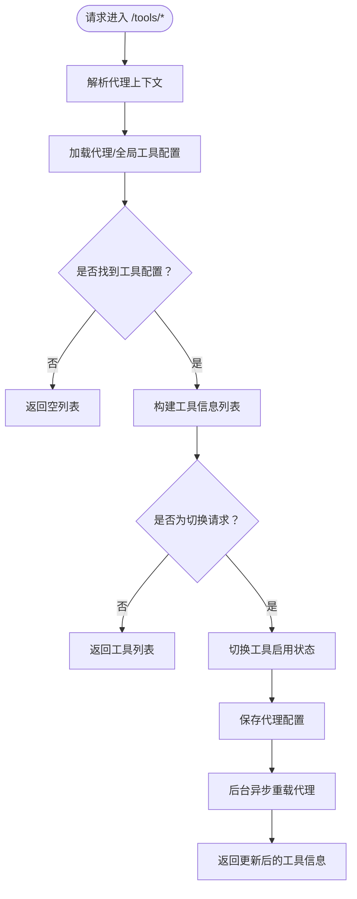
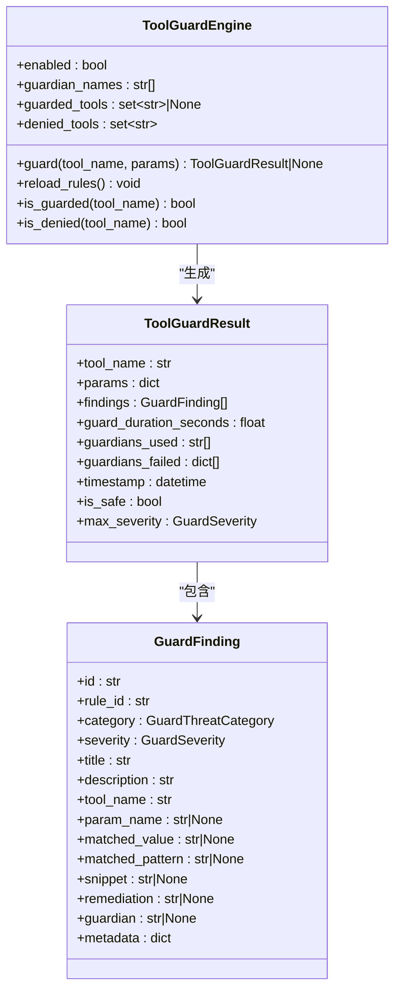
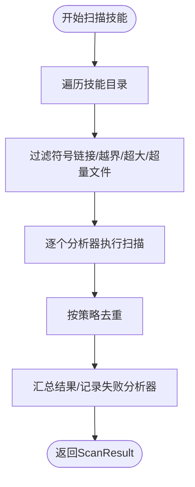
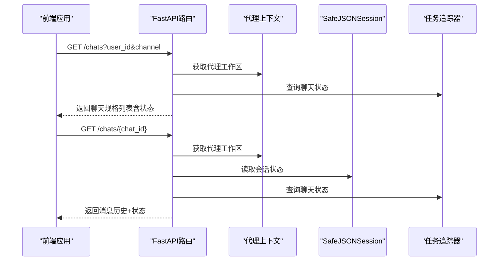
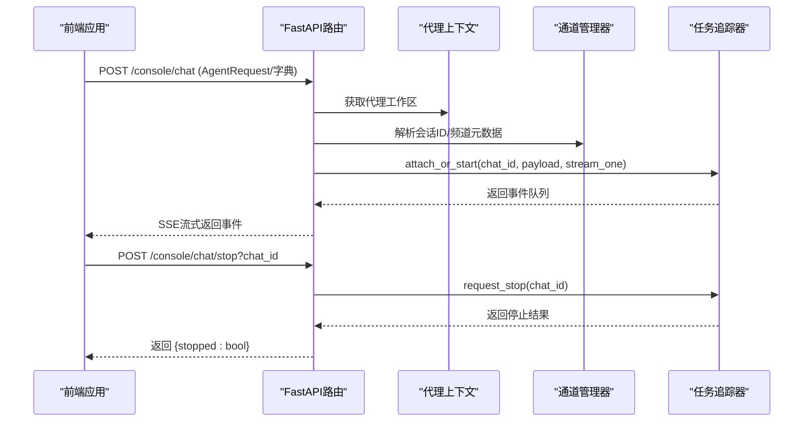
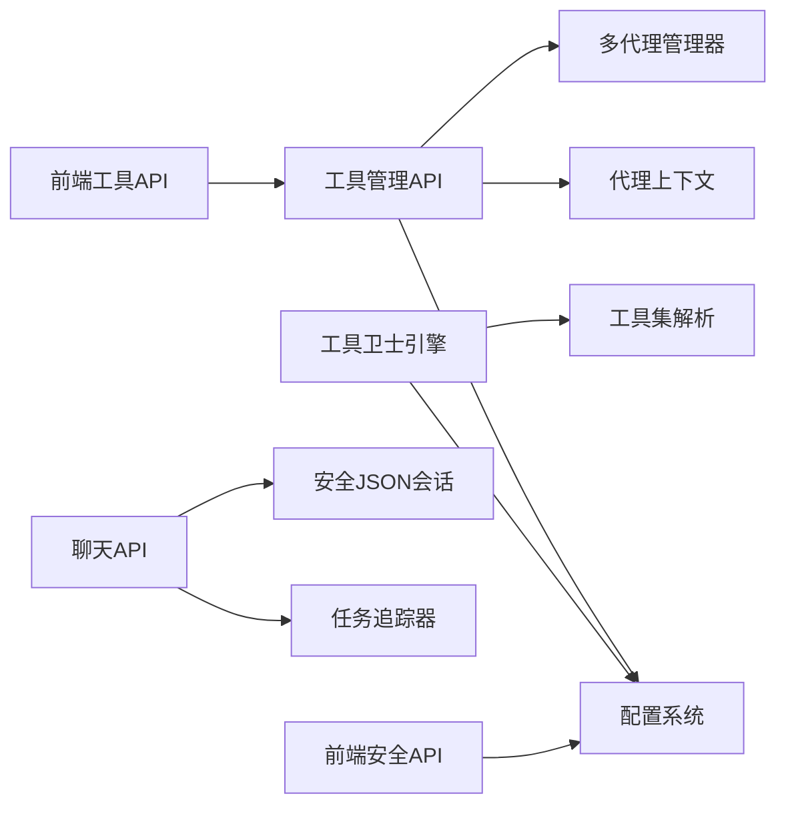

# 工具管理API

<cite>
**本文档引用的文件**
- [tools.py](file://src/copaw/app/routers/tools.py)
- [tools.ts](file://console/src/api/modules/tools.ts)
- [security.ts](file://console/src/api/modules/security.ts)
- [config.py](file://src/copaw/config/config.py)
- [engine.py](file://src/copaw/security/tool_guard/engine.py)
- [utils.py](file://src/copaw/security/tool_guard/utils.py)
- [models.py](file://src/copaw/security/tool_guard/models.py)
- [scanner.py](file://src/copaw/security/skill_scanner/scanner.py)
- [models.py](file://src/copaw/security/skill_scanner/models.py)
- [agent_context.py](file://src/copaw/app/agent_context.py)
- [api.py](file://src/copaw/app/runner/api.py)
- [manager.py](file://src/copaw/app/runner/manager.py)
- [session.py](file://src/copaw/app/runner/session.py)
- [models.py](file://src/copaw/app/runner/models.py)
- [console.py](file://src/copaw/app/routers/console.py)
</cite>

## 目录
1. [简介](#简介)
2. [项目结构](#项目结构)
3. [核心组件](#核心组件)
4. [架构总览](#架构总览)
5. [详细组件分析](#详细组件分析)
6. [依赖分析](#依赖分析)
7. [性能考虑](#性能考虑)
8. [故障排除指南](#故障排除指南)
9. [结论](#结论)

## 简介
本文件为 CoPaw 工具管理API的权威技术文档，覆盖以下主题：
- 工具管理：内置工具列表查询、启用/禁用切换
- 工具调用安全：工具调用前参数安全检查（工具卫士）
- 工具开发与配置：工具配置模型、默认工具集、运行时热重载
- 动态加载与热更新：基于工作区的后台异步重载
- 工具链管理：聊天会话、消息状态、任务追踪
- 权限与安全：多代理上下文、环境变量与配置优先级、拒绝/受保护工具集解析

本文件面向后端开发者、平台管理员与前端集成工程师，提供清晰的端点定义、数据模型、流程图与排障建议。

## 项目结构
围绕“工具管理”与“工具调用安全”的核心模块分布如下：
- 路由层：工具管理路由、控制台聊天路由、聊天管理路由
- 配置层：工具配置模型、安全策略配置
- 安全层：工具卫士引擎、规则解析、技能扫描器
- 运行时层：聊天管理、会话存储、任务追踪
- 前端API封装：工具与安全配置的前端调用封装

**图表来源**
- [tools.py:18-133](file://src/copaw/app/routers/tools.py#L18-L133)
- [console.py:21-241](file://src/copaw/app/routers/console.py#L21-L241)
- [api.py:18-241](file://src/copaw/app/runner/api.py#L18-L241)
- [config.py:628-755](file://src/copaw/config/config.py#L628-L755)
- [engine.py:52-218](file://src/copaw/security/tool_guard/engine.py#L52-L218)
- [utils.py:56-156](file://src/copaw/security/tool_guard/utils.py#L56-L156)
- [models.py:103-185](file://src/copaw/security/tool_guard/models.py#L103-L185)
- [scanner.py:76-319](file://src/copaw/security/skill_scanner/scanner.py#L76-L319)
- [models.py:168-235](file://src/copaw/security/skill_scanner/models.py#L168-L235)

**章节来源**
- [tools.py:18-133](file://src/copaw/app/routers/tools.py#L18-L133)
- [config.py:628-755](file://src/copaw/config/config.py#L628-L755)
- [engine.py:52-218](file://src/copaw/security/tool_guard/engine.py#L52-L218)
- [utils.py:56-156](file://src/copaw/security/tool_guard/utils.py#L56-L156)
- [scanner.py:76-319](file://src/copaw/security/skill_scanner/scanner.py#L76-L319)

## 核心组件
- 工具管理路由：提供工具列表查询与启用/禁用切换，支持按活动代理维度读取与写入配置，并触发后台热重载
- 工具卫士引擎：在工具调用前对参数进行安全检查，支持规则化守护、拒绝名单、受保护工具集解析
- 技能扫描器：对技能包进行文件发现、分析器扫描、去重与聚合，输出扫描结果
- 聊天管理与会话：提供聊天生命周期管理、会话状态持久化、任务状态追踪
- 前端API封装：统一工具与安全配置的前端调用方式

**章节来源**
- [tools.py:29-133](file://src/copaw/app/routers/tools.py#L29-L133)
- [engine.py:161-207](file://src/copaw/security/tool_guard/engine.py#L161-L207)
- [scanner.py:148-242](file://src/copaw/security/skill_scanner/scanner.py#L148-L242)
- [api.py:64-241](file://src/copaw/app/runner/api.py#L64-L241)

## 架构总览
工具管理API通过FastAPI路由暴露REST端点，结合配置系统与安全引擎实现“可配置、可审计、可扩展”的工具管理能力。前端通过封装好的API模块调用后端接口，后端在请求上下文中解析当前代理，读取或更新对应配置，并在必要时触发后台热重载。

**图表来源**
- [tools.py:29-133](file://src/copaw/app/routers/tools.py#L29-L133)
- [agent_context.py:22-84](file://src/copaw/app/agent_context.py#L22-L84)

**章节来源**
- [tools.py:29-133](file://src/copaw/app/routers/tools.py#L29-L133)
- [agent_context.py:22-84](file://src/copaw/app/agent_context.py#L22-L84)

## 详细组件分析

### 工具管理API
- 端点：GET /tools、PATCH /tools/{tool_name}/toggle
- 请求方法：GET、PATCH
- 请求路径参数：tool_name（工具函数名）
- 响应模型：ToolInfo（name、enabled、description）
- 权限与上下文：通过代理上下文解析当前代理，支持显式agent_id、请求状态中的agent_id、HTTP头X-Agent-Id或配置中的活动代理
- 配置来源：优先读取代理配置；若不存在则回退到全局配置；若仍不存在返回空列表
- 后台热重载：切换成功后异步触发代理重载，避免阻塞请求

**图表来源**
- [tools.py:29-133](file://src/copaw/app/routers/tools.py#L29-L133)
- [agent_context.py:22-84](file://src/copaw/app/agent_context.py#L22-L84)

**章节来源**
- [tools.py:29-133](file://src/copaw/app/routers/tools.py#L29-L133)
- [tools.ts:9-22](file://console/src/api/modules/tools.ts#L9-L22)
- [agent_context.py:22-84](file://src/copaw/app/agent_context.py#L22-L84)

### 工具调用安全（工具卫士）
- 引擎：ToolGuardEngine负责编排守护者、聚合结果、计算最大严重级别
- 规则解析：从环境变量、配置文件解析受保护工具集与拒绝工具集
- 结果模型：ToolGuardResult包含工具名、参数、发现、失败守护者、耗时等
- 使用场景：在工具调用前对参数进行安全检查，决定是否放行或需要审批

**图表来源**
- [engine.py:52-218](file://src/copaw/security/tool_guard/engine.py#L52-L218)
- [models.py:103-185](file://src/copaw/security/tool_guard/models.py#L103-L185)

**章节来源**
- [engine.py:161-207](file://src/copaw/security/tool_guard/engine.py#L161-L207)
- [utils.py:56-156](file://src/copaw/security/tool_guard/utils.py#L56-L156)
- [models.py:103-185](file://src/copaw/security/tool_guard/models.py#L103-L185)

### 技能安全扫描（技能扫描器）
- 文件发现：遍历技能目录，跳过符号链接与越界文件，按策略限制文件数量与大小
- 分析器：默认使用模式匹配分析器，支持注册自定义分析器
- 结果聚合：去重、统计、记录失败分析器，输出扫描结果

**图表来源**
- [scanner.py:148-242](file://src/copaw/security/skill_scanner/scanner.py#L148-L242)
- [models.py:168-235](file://src/copaw/security/skill_scanner/models.py#L168-L235)

**章节来源**
- [scanner.py:148-242](file://src/copaw/security/skill_scanner/scanner.py#L148-L242)
- [models.py:168-235](file://src/copaw/security/skill_scanner/models.py#L168-L235)

### 聊天与会话管理（工具链执行状态）
- 路由：GET /chats、POST /chats、GET /chats/{chat_id}、PUT /chats/{chat_id}、DELETE /chats/{chat_id}
- 会话：SafeJSONSession提供跨平台文件名清洗与异步文件IO
- 状态：结合任务追踪器获取聊天状态（idle/running），并返回消息历史

**图表来源**
- [api.py:64-175](file://src/copaw/app/runner/api.py#L64-L175)
- [session.py:186-237](file://src/copaw/app/runner/session.py#L186-L237)
- [models.py:15-69](file://src/copaw/app/runner/models.py#L15-L69)

**章节来源**
- [api.py:64-175](file://src/copaw/app/runner/api.py#L64-L175)
- [session.py:186-237](file://src/copaw/app/runner/session.py#L186-L237)
- [models.py:15-69](file://src/copaw/app/runner/models.py#L15-L69)

### 控制台聊天与文件上传（工具链交互）
- 端点：POST /console/chat（流式响应）、POST /console/chat/stop、POST /console/upload、GET /console/files/{agent_id}/{filename}
- 会话解析：从请求体提取会话ID、发送者ID、内容片段，自动创建或获取聊天
- 流式输出：基于事件队列的Server-Sent Events
- 文件上传：限制大小、清理文件名、保存至媒体目录

**图表来源**
- [console.py:68-161](file://src/copaw/app/routers/console.py#L68-L161)

**章节来源**
- [console.py:68-161](file://src/copaw/app/routers/console.py#L68-L161)

## 依赖分析
- 工具管理路由依赖代理上下文解析当前代理，读取配置并触发后台重载
- 工具卫士引擎依赖配置与环境变量解析受保护/拒绝工具集
- 聊天管理依赖会话存储与任务追踪器
- 前端API封装依赖后端路由与类型定义

**图表来源**
- [tools.py:85-125](file://src/copaw/app/routers/tools.py#L85-L125)
- [engine.py:133-146](file://src/copaw/security/tool_guard/engine.py#L133-L146)
- [utils.py:56-118](file://src/copaw/security/tool_guard/utils.py#L56-L118)
- [api.py:21-62](file://src/copaw/app/runner/api.py#L21-L62)

**章节来源**
- [tools.py:85-125](file://src/copaw/app/routers/tools.py#L85-L125)
- [engine.py:133-146](file://src/copaw/security/tool_guard/engine.py#L133-L146)
- [utils.py:56-118](file://src/copaw/security/tool_guard/utils.py#L56-L118)
- [api.py:21-62](file://src/copaw/app/runner/api.py#L21-L62)

## 性能考虑
- 异步后台重载：工具切换后通过异步任务触发代理重载，避免阻塞请求
- 文件扫描限制：技能扫描器限制最大文件数与单文件大小，防止资源滥用
- 会话存储：SafeJSONSession采用异步文件IO，避免阻塞事件循环
- 任务追踪：聊天状态与消息历史分离，减少单次请求的数据负载

[本节为通用指导，无需特定文件来源]

## 故障排除指南
- 工具未找到：当工具名称不在代理配置中时，切换端点返回404
- 代理未初始化：无法获取MultiAgentManager时返回500
- 聊天不存在：查询/删除聊天时若不存在返回404
- 文件上传过大：超过最大限制返回400
- 工具卫士失败：守护者异常会被记录并计入失败列表，不影响整体返回

**章节来源**
- [tools.py:95-98](file://src/copaw/app/routers/tools.py#L95-L98)
- [agent_context.py:63-83](file://src/copaw/app/agent_context.py#L63-L83)
- [api.py:156-159](file://src/copaw/app/runner/api.py#L156-L159)
- [console.py:180-185](file://src/copaw/app/routers/console.py#L180-L185)

## 结论
本API体系以“可配置、可审计、可扩展”为核心设计目标，通过工具管理路由、工具卫士引擎与技能扫描器形成完整的工具生命周期与安全闭环，配合聊天与会话管理实现工具链执行状态的可视化与可控性。前端通过封装好的API模块简化集成，后端通过异步与配置驱动确保高可用与灵活性。