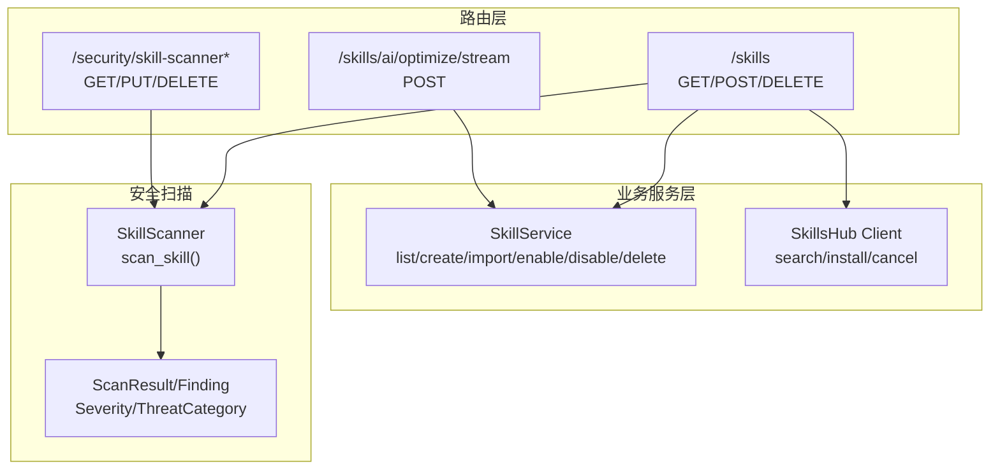
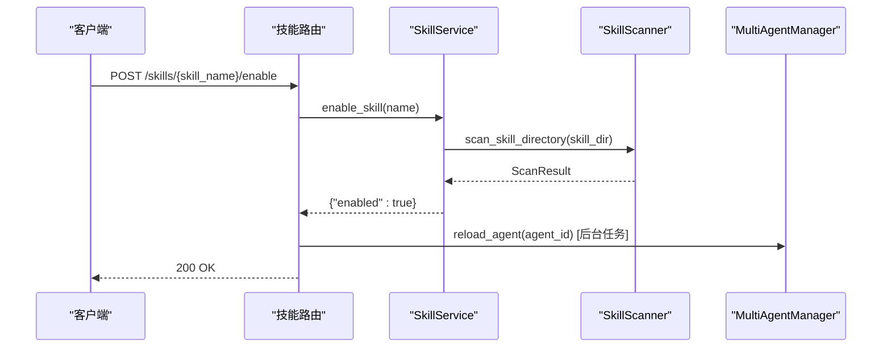
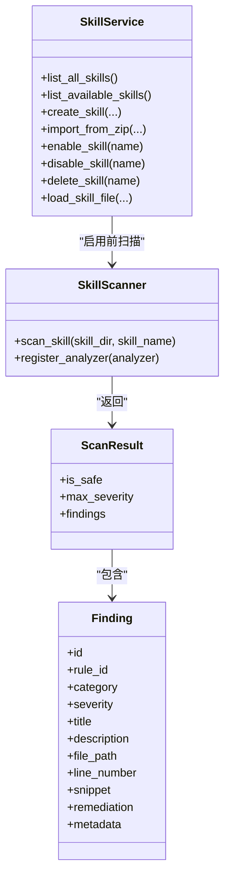

# 技能管理API

<cite>
**本文引用的文件**
- [src/copaw/app/routers/skills.py](file://src/copaw/app/routers/skills.py)
- [src/copaw/app/routers/skills_stream.py](file://src/copaw/app/routers/skills_stream.py)
- [src/copaw/agents/skills_manager.py](file://src/copaw/agents/skills_manager.py)
- [src/copaw/agents/skills_hub.py](file://src/copaw/agents/skills_hub.py)
- [src/copaw/security/skill_scanner/scanner.py](file://src/copaw/security/skill_scanner/scanner.py)
- [src/copaw/security/skill_scanner/models.py](file://src/copaw/security/skill_scanner/models.py)
- [src/copaw/app/routers/config.py](file://src/copaw/app/routers/config.py)
</cite>

## 目录
1. [简介](#简介)
2. [项目结构](#项目结构)
3. [核心组件](#核心组件)
4. [架构总览](#架构总览)
5. [详细组件分析](#详细组件分析)
6. [依赖关系分析](#依赖关系分析)
7. [性能考量](#性能考量)
8. [故障排查指南](#故障排查指南)
9. [结论](#结论)

## 简介
本文件为 CoPaw 技能管理API的权威文档，覆盖技能列表查询、启用/禁用、批量操作、上传与导入、从技能中心安装、AI优化流式响应、安全扫描与白名单配置、权限与错误处理等能力。API以FastAPI路由实现，结合技能服务层与安全扫描器，提供从技能开发到运行时热重载的完整闭环。

## 项目结构
围绕技能管理的关键模块如下：
- 路由层
  - 技能管理路由：/skills
  - 技能流式优化路由：/skills/ai/optimize/stream
  - 安全扫描配置路由：/security/skill-scanner*
- 业务服务层
  - 技能服务：技能读写、目录树构建、ZIP导入、启用/禁用、删除
  - 技能Hub客户端：搜索、版本解析、下载、取消检查
- 安全扫描
  - 扫描器：文件发现、多分析器聚合、结果模型
  - 结果模型：严重级别、威胁分类、Finding/ScanResult

**图表来源**
- [src/copaw/app/routers/skills.py:119-753](file://src/copaw/app/routers/skills.py#L119-L753)
- [src/copaw/app/routers/skills_stream.py:166-245](file://src/copaw/app/routers/skills_stream.py#L166-L245)
- [src/copaw/app/routers/config.py:450-565](file://src/copaw/app/routers/config.py#L450-L565)
- [src/copaw/agents/skills_manager.py:627-800](file://src/copaw/agents/skills_manager.py#L627-L800)
- [src/copaw/agents/skills_hub.py:1-120](file://src/copaw/agents/skills_hub.py#L1-L120)
- [src/copaw/security/skill_scanner/scanner.py:76-242](file://src/copaw/security/skill_scanner/scanner.py#L76-L242)
- [src/copaw/security/skill_scanner/models.py:19-235](file://src/copaw/security/skill_scanner/models.py#L19-L235)

**章节来源**
- [src/copaw/app/routers/skills.py:119-753](file://src/copaw/app/routers/skills.py#L119-L753)
- [src/copaw/app/routers/skills_stream.py:166-245](file://src/copaw/app/routers/skills_stream.py#L166-L245)
- [src/copaw/app/routers/config.py:450-565](file://src/copaw/app/routers/config.py#L450-L565)
- [src/copaw/agents/skills_manager.py:627-800](file://src/copaw/agents/skills_manager.py#L627-L800)
- [src/copaw/agents/skills_hub.py:1-120](file://src/copaw/agents/skills_hub.py#L1-L120)
- [src/copaw/security/skill_scanner/scanner.py:76-242](file://src/copaw/security/skill_scanner/scanner.py#L76-L242)
- [src/copaw/security/skill_scanner/models.py:19-235](file://src/copaw/security/skill_scanner/models.py#L19-L235)

## 核心组件
- 技能管理路由
  - 列表与可用技能查询
  - 启用/禁用单个技能
  - 批量启用/禁用
  - 创建技能、上传ZIP、删除技能
  - 从Hub搜索、安装、任务状态轮询与取消
  - 加载技能内部文件（references/scripts）
- 流式优化路由
  - 基于AI模型的技能内容优化，SSE流式返回
- 安全扫描配置路由
  - 获取/更新扫描器配置
  - 阻断历史查询/清理/移除
  - 白名单增删

**章节来源**
- [src/copaw/app/routers/skills.py:122-753](file://src/copaw/app/routers/skills.py#L122-L753)
- [src/copaw/app/routers/skills_stream.py:166-245](file://src/copaw/app/routers/skills_stream.py#L166-L245)
- [src/copaw/app/routers/config.py:450-565](file://src/copaw/app/routers/config.py#L450-L565)

## 架构总览
技能管理API通过路由层接收请求，调用技能服务进行文件系统操作，并在关键路径触发安全扫描。启用/禁用会触发后台热重载；上传与Hub安装支持异步任务与取消；流式优化通过SSE推送增量文本。

**图表来源**
- [src/copaw/app/routers/skills.py:626-693](file://src/copaw/app/routers/skills.py#L626-L693)
- [src/copaw/agents/skills_manager.py:627-800](file://src/copaw/agents/skills_manager.py#L627-L800)
- [src/copaw/security/skill_scanner/scanner.py:148-242](file://src/copaw/security/skill_scanner/scanner.py#L148-L242)

## 详细组件分析

### 技能管理路由（/skills）
- 路径与方法
  - GET /skills —— 列出所有技能（内置+自定义），标注启用状态
  - GET /skills/available —— 列出当前可用（已启用）技能
  - POST /skills —— 创建新技能（含references/scripts树形结构）
  - POST /skills/upload —— 从ZIP上传并导入技能（可选择启用/覆盖）
  - POST /skills/batch-enable —— 批量启用技能（遇高危扫描阻断返回422）
  - POST /skills/batch-disable —— 批量禁用技能
  - POST /skills/{skill_name}/enable —— 启用技能（先扫描再复制至active_skills，后台热重载）
  - POST /skills/{skill_name}/disable —— 禁用技能（删除active_skills对应目录）
  - DELETE /skills/{skill_name} —— 删除自定义技能
  - GET /skills/{skill_name}/files/{source}/{file_path:path} —— 读取技能内部文件（builtin/customized）
  - GET /skills/hub/search —— 搜索Hub技能
  - POST /skills/hub/install —— 即时安装（同步）
  - POST /skills/hub/install/start —— 异步安装任务启动（返回任务ID）
  - GET /skills/hub/install/status/{task_id} —— 查询任务状态
  - POST /skills/hub/install/cancel/{task_id} —— 取消安装任务

- 请求/响应要点
  - 列表类接口返回技能清单，包含名称、描述、来源、路径、references/scripts树
  - 启用/禁用返回布尔结果
  - 批量启用若扫描阻断，返回包含被阻断技能列表的422响应
  - ZIP上传限制类型与大小，超限返回400
  - Hub安装支持版本选择、覆盖策略、启用策略与异步任务状态管理

- 错误处理
  - 400：参数非法（如ZIP类型不符、过大、缺失必需字段）
  - 404：技能不存在
  - 422：安全扫描阻断（包含严重级别、违规详情）
  - 502/500：上游错误或失败

- 权限与上下文
  - 路由通过请求上下文获取当前工作区与代理，确保对当前agent生效

**章节来源**
- [src/copaw/app/routers/skills.py:122-753](file://src/copaw/app/routers/skills.py#L122-L753)

### 技能服务（SkillService）
- 能力
  - 读取内置与自定义技能，去重合并（自定义优先）
  - 读取可用技能（active_skills）
  - 创建技能（校验SKILL.md Front Matter，生成references/scripts树）
  - ZIP导入（校验压缩包合法性，解压到自定义目录）
  - 启用/禁用/删除技能（操作active_skills与自定义目录）
  - 文件读取（references/scripts）

- 关键流程
  - 启用前扫描：对源目录执行扫描，遇高危阻断
  - 禁用：删除active_skills对应目录，触发后台热重载
  - 扫描异常非致命，仅影响启用阶段

**章节来源**
- [src/copaw/agents/skills_manager.py:627-800](file://src/copaw/agents/skills_manager.py#L627-L800)

### 技能Hub客户端
- 能力
  - 搜索Hub技能
  - 解析URL提取标识符（ClawHub/LoBeHub/Skills.sh等）
  - 下载版本文件，组装bundle（SKILL.md + references/scripts）
  - 支持取消检查（用户可取消安装任务）
  - 失败重试与退避、速率限制提示

- 安装流程
  - 即时安装：直接下载并导入
  - 异步安装：创建任务、后台执行、状态轮询、取消

**章节来源**
- [src/copaw/agents/skills_hub.py:1-120](file://src/copaw/agents/skills_hub.py#L1-L120)
- [src/copaw/app/routers/skills.py:344-452](file://src/copaw/app/routers/skills.py#L344-L452)

### 安全扫描（SkillScanner）
- 能力
  - 发现技能目录内可扫描文件（跳过符号链接、隐藏项、超大文件、扩展白名单）
  - 运行多个分析器（默认PatternAnalyzer），聚合Findings
  - 生成ScanResult，包含最高严重级别、分析器使用情况、失败列表

- 结果模型
  - Severity：CRITICAL/HIGH/MEDIUM/LOW/INFO/SAFE
  - ThreatCategory：多种威胁类别（注入、硬编码密钥、供应链攻击等）
  - Finding/ScanResult：包含定位、修复建议、元数据

- 配置
  - 策略：文件分类、最大文件数/大小、去重策略
  - 可注册自定义分析器

**章节来源**
- [src/copaw/security/skill_scanner/scanner.py:76-242](file://src/copaw/security/skill_scanner/scanner.py#L76-L242)
- [src/copaw/security/skill_scanner/models.py:19-235](file://src/copaw/security/skill_scanner/models.py#L19-L235)

### 技能流式优化（/skills/ai/optimize/stream）
- 能力
  - 接收当前技能内容与语言偏好
  - 基于已配置模型生成优化建议
  - SSE流式返回增量文本，结束时发送done标志

- 交互
  - 请求体：content（技能内容）、language（en/zh/ru）
  - 响应：text/event-stream，逐块推送delta，最后done

**章节来源**
- [src/copaw/app/routers/skills_stream.py:166-245](file://src/copaw/app/routers/skills_stream.py#L166-L245)

### 安全扫描配置（/security/skill-scanner*）
- 能力
  - 获取扫描器配置
  - 更新扫描器配置
  - 查看/清空/移除阻断历史
  - 添加/移除白名单

- 接口
  - GET /security/skill-scanner
  - PUT /security/skill-scanner
  - GET /security/skill-scanner/blocked-history
  - DELETE /security/skill-scanner/blocked-history
  - DELETE /security/skill-scanner/blocked-history/{index}
  - POST /security/skill-scanner/whitelist
  - DELETE /security/skill-scanner/whitelist/{skill_name}

**章节来源**
- [src/copaw/app/routers/config.py:450-565](file://src/copaw/app/routers/config.py#L450-L565)

## 依赖关系分析

**图表来源**
- [src/copaw/agents/skills_manager.py:627-800](file://src/copaw/agents/skills_manager.py#L627-L800)
- [src/copaw/security/skill_scanner/scanner.py:148-242](file://src/copaw/security/skill_scanner/scanner.py#L148-L242)
- [src/copaw/security/skill_scanner/models.py:168-235](file://src/copaw/security/skill_scanner/models.py#L168-L235)

**章节来源**
- [src/copaw/agents/skills_manager.py:627-800](file://src/copaw/agents/skills_manager.py#L627-L800)
- [src/copaw/security/skill_scanner/scanner.py:148-242](file://src/copaw/security/skill_scanner/scanner.py#L148-L242)
- [src/copaw/security/skill_scanner/models.py:168-235](file://src/copaw/security/skill_scanner/models.py#L168-L235)

## 性能考量
- 文件扫描
  - 采用深度遍历与安全路径校验，避免符号链接与越界访问
  - 可配置最大文件数与单文件大小，防止资源滥用
- ZIP导入
  - 校验压缩包总解压大小、路径合法性与符号链接禁止
- Hub安装
  - 支持分块读取与最大字节数限制，避免内存溢出
  - 重试与退避策略降低上游不稳定因素影响
- 启用/禁用
  - 后台热重载异步执行，避免阻塞请求

[本节为通用指导，无需特定文件来源]

## 故障排查指南
- 启用技能返回422
  - 检查扫描结果中的最高严重级别与违规详情
  - 可临时加入白名单或调整扫描策略
- ZIP上传失败（400/500）
  - 确认文件类型为zip，大小未超过限制
  - 查看后端日志定位具体异常
- Hub安装失败（502）
  - 检查网络与上游服务状态，必要时设置GITHUB_TOKEN
  - 使用任务状态接口确认是否被速率限制
- 扫描器配置问题
  - 通过配置路由更新策略，查看阻断历史定位问题技能
- 热重载不生效
  - 确认后台任务已创建且无异常日志

**章节来源**
- [src/copaw/app/routers/skills.py:28-51](file://src/copaw/app/routers/skills.py#L28-L51)
- [src/copaw/app/routers/skills.py:547-566](file://src/copaw/app/routers/skills.py#L547-L566)
- [src/copaw/app/routers/skills.py:362-382](file://src/copaw/app/routers/skills.py#L362-L382)
- [src/copaw/app/routers/config.py:450-565](file://src/copaw/app/routers/config.py#L450-L565)

## 结论
该技能管理API以清晰的路由分层、稳健的服务封装与严格的安全扫描机制，实现了从技能开发、导入、启用/禁用到运行时优化与治理的全链路能力。通过异步任务与SSE流式优化，兼顾了用户体验与系统稳定性；通过白名单与阻断历史，提供了可操作的风险治理手段。