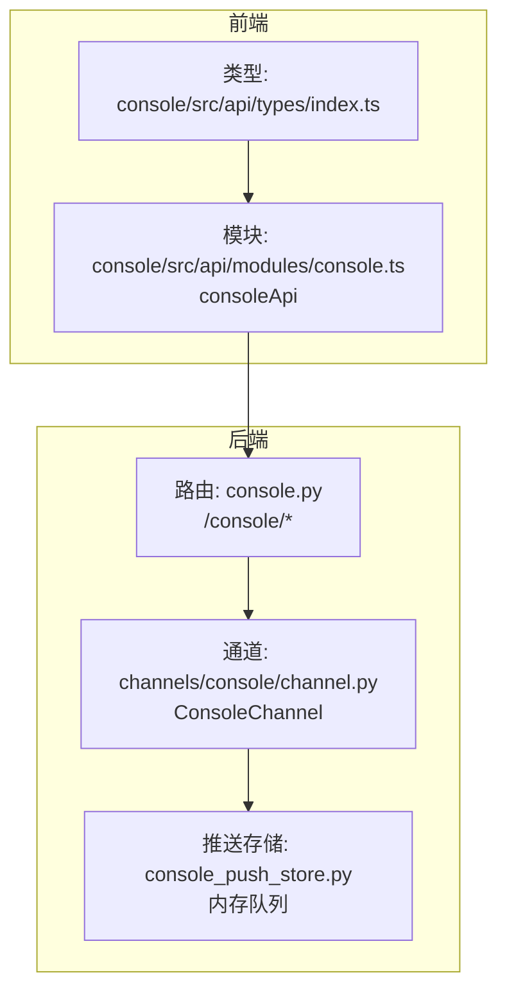
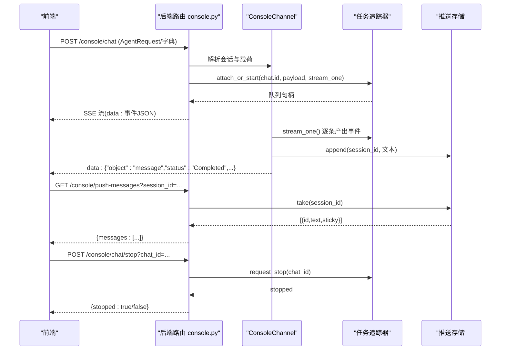
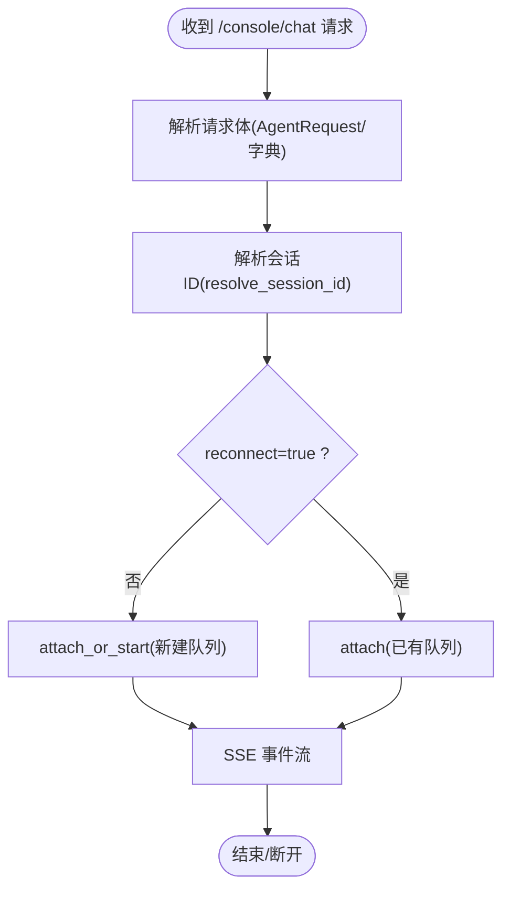
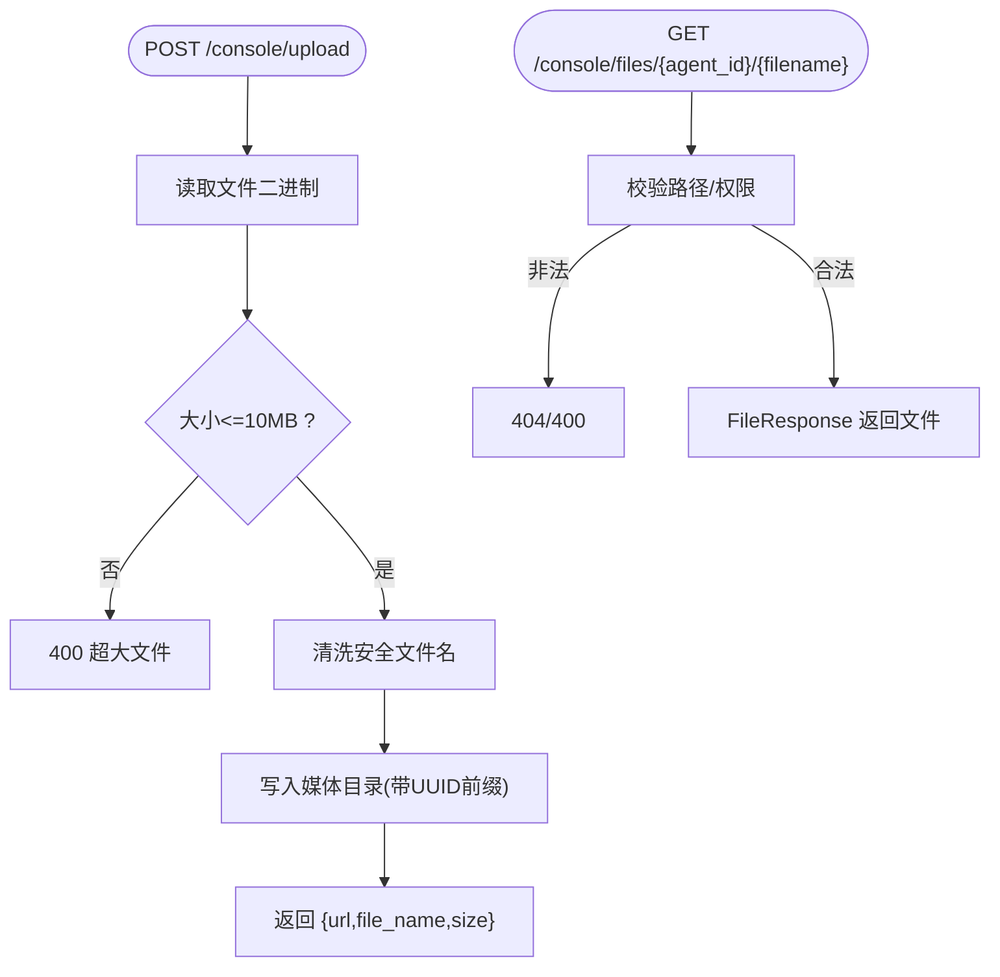
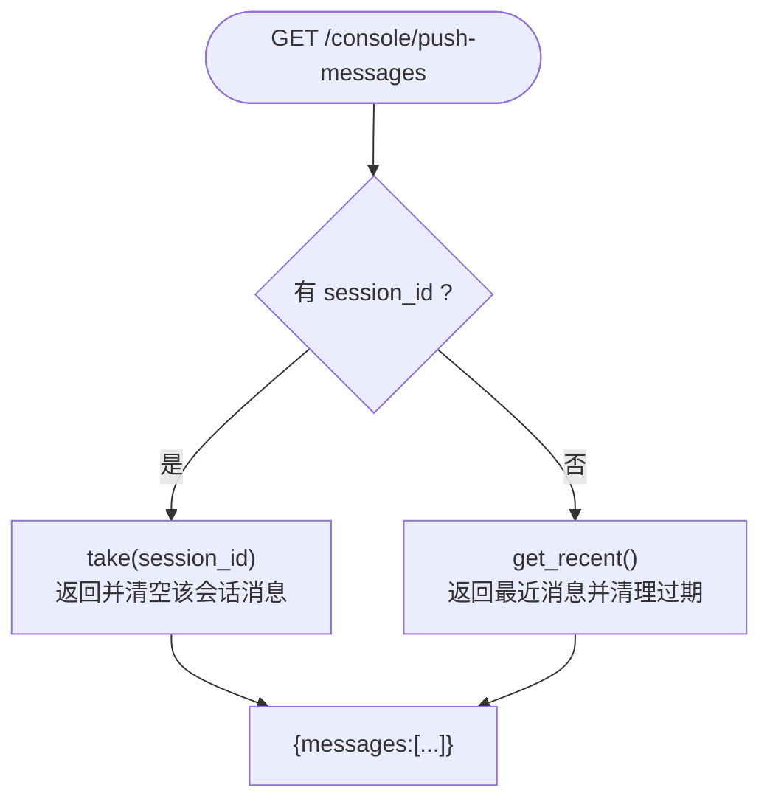
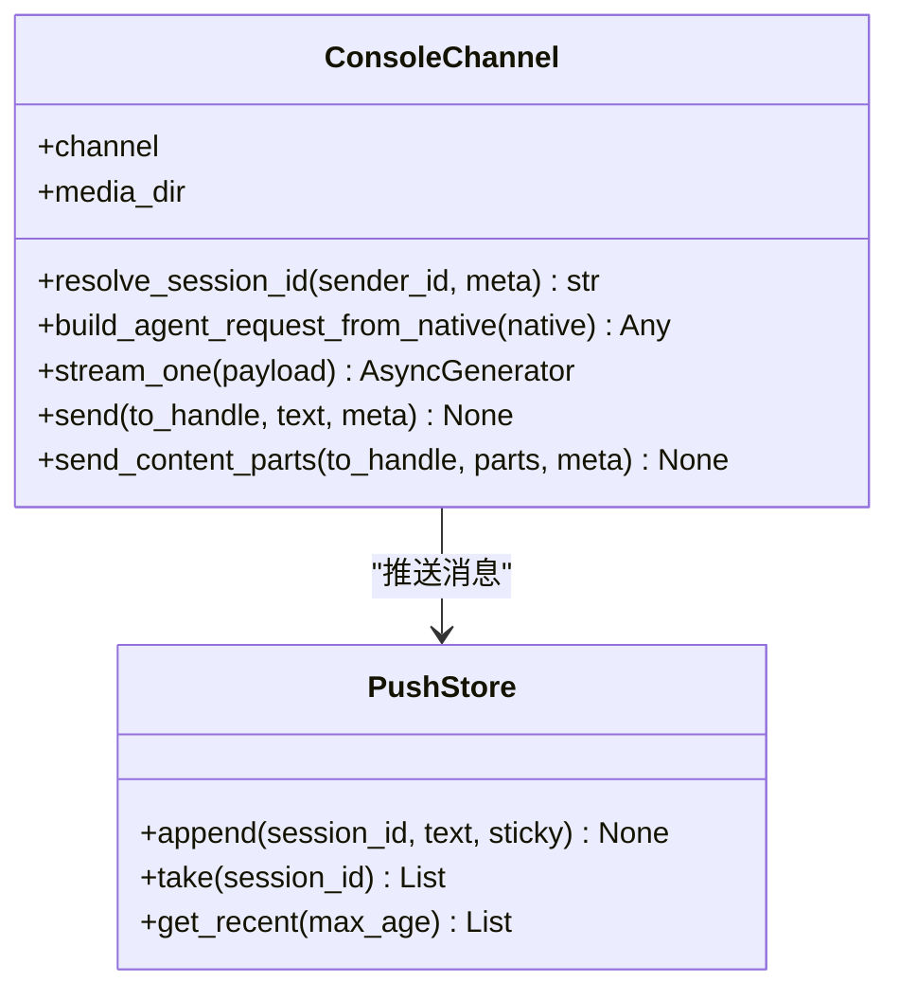
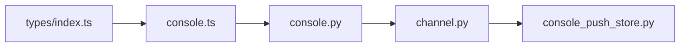

# 控制台API

<cite>
**本文引用的文件**
- [console.py](file://src/copaw/app/routers/console.py)
- [console_push_store.py](file://src/copaw/app/console_push_store.py)
- [channel.py](file://src/copaw/app/channels/console/channel.py)
- [console.ts](file://console/src/api/modules/console.ts)
- [index.ts](file://console/src/api/types/index.ts)
- [heartbeat.py](file://src/copaw/app/crons/heartbeat.py)
- [workspace.py](file://src/copaw/app/routers/workspace.py)
</cite>

## 目录
1. [简介](#简介)
2. [项目结构](#项目结构)
3. [核心组件](#核心组件)
4. [架构总览](#架构总览)
5. [详细组件分析](#详细组件分析)
6. [依赖分析](#依赖分析)
7. [性能考虑](#性能考虑)
8. [故障排查指南](#故障排查指南)
9. [结论](#结论)
10. [附录](#附录)

## 简介
本文件为 CoPaw 控制台 API 的权威文档，聚焦控制台相关能力，包括：
- 控制台聊天（流式响应）、停止聊天、上传文件与文件服务
- 推送消息（控制台通道的前端消息推送）
- 会话解析与媒体目录管理
- 与后端的数据交换协议与消息格式（SSE/JSON）

文档面向前后端开发者与集成者，提供端点说明、请求/响应结构、错误码、使用示例与协议细节。

## 项目结构
控制台 API 主要由三部分组成：
- 后端 FastAPI 路由：提供 /console 前缀的端点（聊天、上传、文件服务、推送消息）
- 控制台通道：负责将消息打印到终端并推送至前端存储
- 前端模块：封装控制台相关请求方法

图表来源
- [console.py:21-241](file://src/copaw/app/routers/console.py#L21-L241)
- [channel.py:56-471](file://src/copaw/app/channels/console/channel.py#L56-L471)
- [console_push_store.py:1-83](file://src/copaw/app/console_push_store.py#L1-L83)
- [console.ts:1-12](file://console/src/api/modules/console.ts#L1-L12)
- [index.ts:1-13](file://console/src/api/types/index.ts#L1-L13)

章节来源
- [console.py:21-241](file://src/copaw/app/routers/console.py#L21-L241)
- [channel.py:56-471](file://src/copaw/app/channels/console/channel.py#L56-L471)
- [console_push_store.py:1-83](file://src/copaw/app/console_push_store.py#L1-L83)
- [console.ts:1-12](file://console/src/api/modules/console.ts#L1-L12)
- [index.ts:1-13](file://console/src/api/types/index.ts#L1-L13)

## 核心组件
- 控制台聊天路由：POST /console/chat（流式）、POST /console/chat/stop（停止）、GET /console/push-messages（推送消息）
- 控制台通道：ConsoleChannel，负责构建请求、处理事件流、打印到终端、推送消息到前端
- 推送存储：内存队列，按会话保留最近消息，支持拉取与去重
- 文件上传与服务：POST /console/upload、GET /console/files/{agent_id}/{filename}

章节来源
- [console.py:68-241](file://src/copaw/app/routers/console.py#L68-L241)
- [channel.py:56-471](file://src/copaw/app/channels/console/channel.py#L56-L471)
- [console_push_store.py:22-83](file://src/copaw/app/console_push_store.py#L22-L83)

## 架构总览
控制台聊天采用“请求-通道-任务追踪-事件流”的链路，后端通过 SSE 将事件推送到前端；控制台通道同时负责终端输出与消息推送。

图表来源
- [console.py:68-241](file://src/copaw/app/routers/console.py#L68-L241)
- [channel.py:266-458](file://src/copaw/app/channels/console/channel.py#L266-L458)
- [console_push_store.py:41-83](file://src/copaw/app/console_push_store.py#L41-L83)

## 详细组件分析

### 控制台聊天与停止
- 端点
  - POST /console/chat
    - 请求体：支持两种形式
      - 运行时标准 AgentRequest 结构（来自运行时引擎）
      - 字典结构（兼容性）：包含 channel、user_id、session_id、input 等
    - 行为：根据 reconnect 参数决定“重新连接”或“启动新流”
    - 响应：SSE 流，逐条发送事件 JSON
  - POST /console/chat/stop
    - 查询参数：chat_id（聊天标识）
    - 响应：{ "stopped": true/false }

- 关键流程
  - 会话解析：ConsoleChannel.resolve_session_id 优先使用 meta.session_id，否则生成 console:<sender_id>
  - 事件流：ConsoleChannel.stream_one 逐条产出事件，并在消息完成时打印到终端
  - 停止：通过任务追踪器请求停止

图表来源
- [console.py:75-161](file://src/copaw/app/routers/console.py#L75-L161)
- [channel.py:174-186](file://src/copaw/app/channels/console/channel.py#L174-L186)

章节来源
- [console.py:68-161](file://src/copaw/app/routers/console.py#L68-L161)
- [channel.py:266-358](file://src/copaw/app/channels/console/channel.py#L266-L358)

### 文件上传与服务
- 端点
  - POST /console/upload
    - 表单文件字段：file
    - 响应：{ "url": 存储文件名, "file_name": 原始名, "size": 字节数 }
  - GET /console/files/{agent_id}/{filename}
    - 返回媒体目录中的文件（受安全校验）

- 安全与限制
  - 单文件最大 10MB
  - 文件名清洗（仅允许字母数字/./-_，最多 200 字符）
  - 路径遍历防护（相对路径检查）

图表来源
- [console.py:163-224](file://src/copaw/app/routers/console.py#L163-L224)
- [channel.py:118-121](file://src/copaw/app/channels/console/channel.py#L118-L121)

章节来源
- [console.py:163-224](file://src/copaw/app/routers/console.py#L163-L224)
- [channel.py:118-121](file://src/copaw/app/channels/console/channel.py#L118-L121)

### 推送消息（控制台通道）
- 端点
  - GET /console/push-messages
    - 查询参数：session_id（可选）
    - 无 session_id：返回最近 60 秒内未消费的消息（所有会话）
    - 有 session_id：返回该会话的消息并从存储中移除

- 存储特性
  - 内存队列，最多保留 500 条消息
  - 自动清理过期（默认 60 秒）
  - 去除时间戳字段，仅保留 id、text、sticky

图表来源
- [console.py:226-241](file://src/copaw/app/routers/console.py#L226-L241)
- [console_push_store.py:41-83](file://src/copaw/app/console_push_store.py#L41-L83)

章节来源
- [console.py:226-241](file://src/copaw/app/routers/console.py#L226-L241)
- [console_push_store.py:22-83](file://src/copaw/app/console_push_store.py#L22-L83)

### 控制台通道与消息格式
- 通道职责
  - 构建 AgentRequest：从原生载荷组装用户内容、会话元数据
  - 处理事件流：将事件序列化为 JSON 并通过 SSE 发送
  - 终端输出：按内容类型打印文本、图片、视频、文件等
  - 推送消息：将文本内容推送到前端推送存储（按会话）

- 事件格式（SSE）
  - 每条事件以 data: 开头，后跟一行 JSON
  - 典型对象包含 object、status、type 等字段
  - 当 object=message 且 status=Completed 时，通道打印内容

- 原生载荷结构
  - channel_id、sender_id、content_parts（内容部件列表）、meta（含 session_id、user_id）

图表来源
- [channel.py:56-471](file://src/copaw/app/channels/console/channel.py#L56-L471)
- [console_push_store.py:22-83](file://src/copaw/app/console_push_store.py#L22-L83)

章节来源
- [channel.py:243-358](file://src/copaw/app/channels/console/channel.py#L243-L358)
- [console_push_store.py:22-83](file://src/copaw/app/console_push_store.py#L22-L83)

### 前端对接
- 前端模块导出 consoleApi，包含 getPushMessages 方法
- 类型导出集中于 types/index.ts

章节来源
- [console.ts:1-12](file://console/src/api/modules/console.ts#L1-L12)
- [index.ts:1-13](file://console/src/api/types/index.ts#L1-L13)

## 依赖分析
- 控制台路由依赖工作区上下文与通道管理器
- ConsoleChannel 依赖通道基类、推送存储与媒体目录
- 推送存储为独立内存队列，无外部依赖
- 前端模块依赖后端路由与类型定义

图表来源
- [console.ts:1-12](file://console/src/api/modules/console.ts#L1-L12)
- [console.py:21-241](file://src/copaw/app/routers/console.py#L21-L241)
- [channel.py:56-471](file://src/copaw/app/channels/console/channel.py#L56-L471)
- [console_push_store.py:1-83](file://src/copaw/app/console_push_store.py#L1-L83)
- [index.ts:1-13](file://console/src/api/types/index.ts#L1-L13)

章节来源
- [console.py:21-241](file://src/copaw/app/routers/console.py#L21-L241)
- [channel.py:56-471](file://src/copaw/app/channels/console/channel.py#L56-L471)
- [console_push_store.py:1-83](file://src/copaw/app/console_push_store.py#L1-L83)
- [console.ts:1-12](file://console/src/api/modules/console.ts#L1-L12)
- [index.ts:1-13](file://console/src/api/types/index.ts#L1-L13)

## 性能考虑
- SSE 流式传输：事件逐条发送，适合长对话与实时反馈
- 任务追踪：支持断线重连（reconnect=true），避免重复计算
- 推送存储：内存队列，容量与过期时间可控，建议前端去重
- 文件上传：限制单文件大小，避免内存压力
- 终端输出：按内容类型打印，避免阻塞事件流

[本节为通用指导，不涉及具体文件分析]

## 故障排查指南
- 400 错误
  - 文件过大：检查上传大小限制
  - 非法文件名/路径：检查文件名清洗与路径遍历校验
- 404 错误
  - 重连失败：当 reconnect=true 但无运行中的会话
  - 文件不存在：检查媒体目录与文件名
- 503 错误
  - 控制台通道未找到：确认通道初始化与启用状态
- 事件异常
  - 通道内部异常会被捕获并以错误事件形式返回

章节来源
- [console.py:84-92](file://src/copaw/app/routers/console.py#L84-L92)
- [console.py:116-122](file://src/copaw/app/routers/console.py#L116-L122)
- [console.py:180-185](file://src/copaw/app/routers/console.py#L180-L185)
- [console.py:204-223](file://src/copaw/app/routers/console.py#L204-L223)

## 结论
控制台 API 提供了完整的聊天、文件与推送能力，结合 ConsoleChannel 的事件流与推送存储，实现了从前端到终端的一致体验。建议在生产环境关注会话管理、推送去重与资源限制，确保稳定性与性能。

[本节为总结性内容，不涉及具体文件分析]

## 附录

### API 端点一览
- POST /console/chat
  - 请求体：AgentRequest 或字典（见“核心组件”）
  - 响应：SSE 流（逐条 data: JSON）
- POST /console/chat/stop
  - 查询参数：chat_id
  - 响应：{ "stopped": true/false }
- POST /console/upload
  - 表单字段：file
  - 响应：{ "url": "...", "file_name": "...", "size": number }
- GET /console/files/{agent_id}/{filename}
  - 响应：文件下载
- GET /console/push-messages
  - 查询参数：session_id（可选）
  - 响应：{ "messages": [{ "id": "...", "text": "...", "sticky": false }] }

章节来源
- [console.py:68-241](file://src/copaw/app/routers/console.py#L68-L241)

### 数据交换协议与消息格式
- 协议
  - SSE（Server-Sent Events）
  - JSON 事件对象（每条以 data: 开头）
- 事件对象关键字段
  - object：事件对象类型（如 message、response）
  - status：运行状态（如 Completed、Running）
  - type：事件类型（可选）
- 原生载荷字段
  - channel_id、sender_id、content_parts、meta（含 session_id、user_id）

章节来源
- [channel.py:303-358](file://src/copaw/app/channels/console/channel.py#L303-L358)
- [console.py:32-65](file://src/copaw/app/routers/console.py#L32-L65)

### 相关扩展（心跳与工作区）
- 心跳（HEARTBEAT.md）：定时运行，可选择回传到上次通道或仅执行
- 工作区打包/解包：支持整包下载与上传合并

章节来源
- [heartbeat.py:89-183](file://src/copaw/app/crons/heartbeat.py#L89-L183)
- [workspace.py:112-203](file://src/copaw/app/routers/workspace.py#L112-L203)