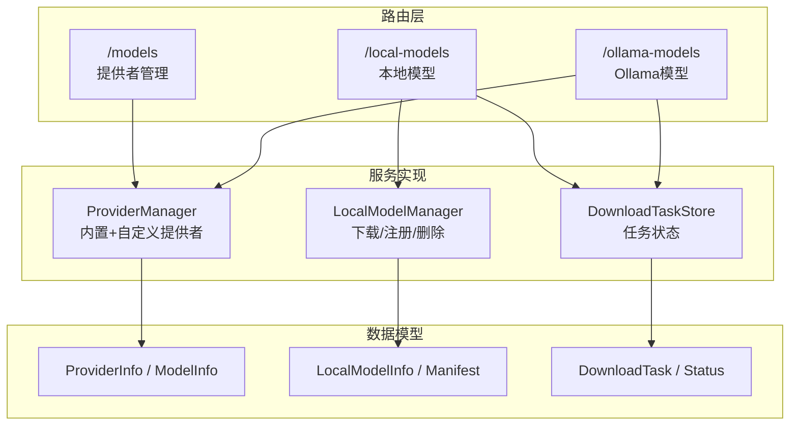
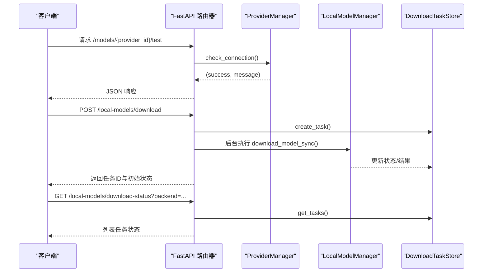
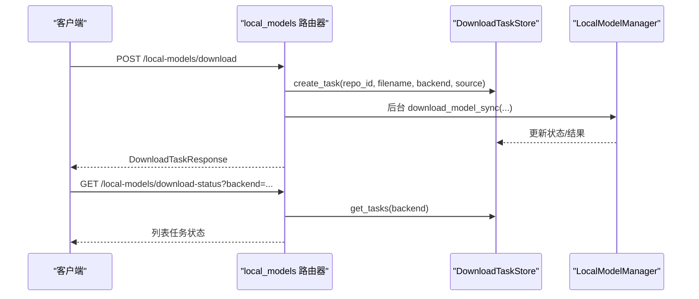
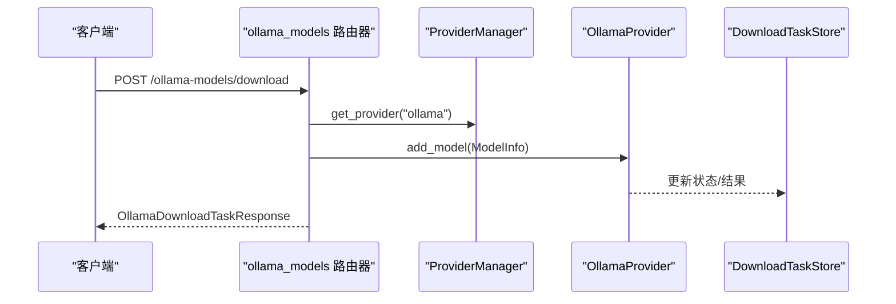
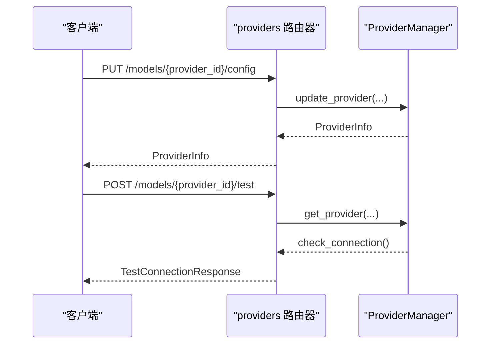
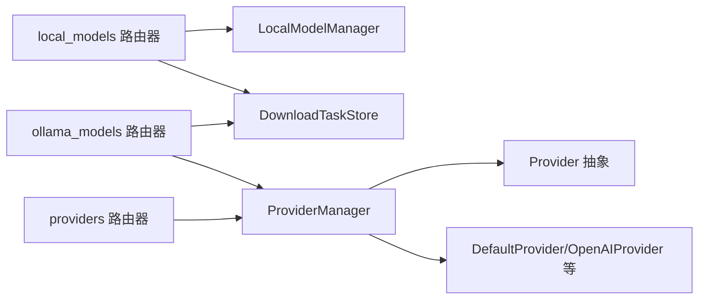

# 模型管理API

<cite>
**本文引用的文件**
- [src/copaw/app/routers/local_models.py](file://src/copaw/app/routers/local_models.py)
- [src/copaw/app/routers/ollama_models.py](file://src/copaw/app/routers/ollama_models.py)
- [src/copaw/app/routers/providers.py](file://src/copaw/app/routers/providers.py)
- [src/copaw/local_models/schema.py](file://src/copaw/local_models/schema.py)
- [src/copaw/providers/models.py](file://src/copaw/providers/models.py)
- [src/copaw/app/download_task_store.py](file://src/copaw/app/download_task_store.py)
- [src/copaw/providers/provider_manager.py](file://src/copaw/providers/provider_manager.py)
- [src/copaw/local_models/manager.py](file://src/copaw/local_models/manager.py)
- [src/copaw/providers/provider.py](file://src/copaw/providers/provider.py)
- [src/copaw/local_models/factory.py](file://src/copaw/local_models/factory.py)
- [src/copaw/constant.py](file://src/copaw/constant.py)
</cite>

## 目录
1. [简介](#简介)
2. [项目结构](#项目结构)
3. [核心组件](#核心组件)
4. [架构总览](#架构总览)
5. [详细组件分析](#详细组件分析)
6. [依赖分析](#依赖分析)
7. [性能考虑](#性能考虑)
8. [故障排查指南](#故障排查指南)
9. [结论](#结论)
10. [附录](#附录)

## 简介
本文件为 CoPaw 模型管理API的权威文档，覆盖以下能力：
- 本地模型：列出已下载模型、触发后台下载任务、查询下载状态、取消下载、删除模型
- Ollama 模型：列出 Ollama 已有模型、触发后台拉取任务、查询下载状态、取消下载、删除模型
- 提供者（Provider）管理：列出所有提供者、配置提供者、测试连接、发现模型、添加/移除自定义提供者与模型、设置/获取当前激活模型
- 资源管理：模型可用性检查、加载状态查询、后台任务状态管理

文档提供各端点的URL模式、请求方法、请求/响应格式、配置参数、错误处理策略，并给出性能与运维建议。

## 项目结构
围绕模型管理的核心模块包括：
- 路由层：FastAPI 路由器，暴露REST端点
- 数据模型：Pydantic 模型，统一请求/响应结构
- 下载任务存储：内存中跟踪后台下载任务的状态
- 本地模型管理：下载、注册、删除、清单维护
- 提供者管理：内置与自定义提供者、模型发现与连接测试、激活模型
- 常量与路径：工作目录、模型目录等

图表来源
- [src/copaw/app/routers/providers.py:22-437](file://src/copaw/app/routers/providers.py#L22-L437)
- [src/copaw/app/routers/local_models.py:27-320](file://src/copaw/app/routers/local_models.py#L27-L320)
- [src/copaw/app/routers/ollama_models.py:34-291](file://src/copaw/app/routers/ollama_models.py#L34-L291)
- [src/copaw/providers/provider_manager.py:288-717](file://src/copaw/providers/provider_manager.py#L288-L717)
- [src/copaw/local_models/manager.py:94-413](file://src/copaw/local_models/manager.py#L94-L413)
- [src/copaw/app/download_task_store.py:18-131](file://src/copaw/app/download_task_store.py#L18-L131)

章节来源
- [src/copaw/app/routers/providers.py:22-437](file://src/copaw/app/routers/providers.py#L22-L437)
- [src/copaw/app/routers/local_models.py:27-320](file://src/copaw/app/routers/local_models.py#L27-L320)
- [src/copaw/app/routers/ollama_models.py:34-291](file://src/copaw/app/routers/ollama_models.py#L34-L291)

## 核心组件
- 路由器
  - /models：提供者与模型管理
  - /local-models：本地模型与下载任务
  - /ollama-models：Ollama 模型与下载任务
- 数据模型
  - ProviderInfo / ModelInfo：提供者与模型元数据
  - LocalModelInfo / LocalModelsManifest：本地模型清单
  - DownloadTask / DownloadTaskStatus：后台任务状态
- 服务实现
  - ProviderManager：统一管理内置/自定义提供者、模型发现、连接测试、激活模型
  - LocalModelManager：本地模型下载、注册、删除、清单维护
  - DownloadTaskStore：任务创建、更新、取消、清理

章节来源
- [src/copaw/providers/models.py:11-81](file://src/copaw/providers/models.py#L11-L81)
- [src/copaw/local_models/schema.py:22-59](file://src/copaw/local_models/schema.py#L22-L59)
- [src/copaw/app/download_task_store.py:18-131](file://src/copaw/app/download_task_store.py#L18-L131)
- [src/copaw/providers/provider_manager.py:288-717](file://src/copaw/providers/provider_manager.py#L288-L717)
- [src/copaw/local_models/manager.py:94-413](file://src/copaw/local_models/manager.py#L94-L413)

## 架构总览
CoPaw 的模型管理采用“路由器 + 服务 + 存储”的分层设计：
- 路由器负责HTTP协议与参数校验
- 服务层封装业务逻辑（提供者管理、本地模型管理）
- 存储层负责任务状态与持久化清单

图表来源
- [src/copaw/app/routers/providers.py:206-236](file://src/copaw/app/routers/providers.py#L206-L236)
- [src/copaw/app/routers/local_models.py:123-168](file://src/copaw/app/routers/local_models.py#L123-L168)
- [src/copaw/app/download_task_store.py:43-94](file://src/copaw/app/download_task_store.py#L43-L94)
- [src/copaw/local_models/manager.py:98-123](file://src/copaw/local_models/manager.py#L98-L123)

## 详细组件分析

### 本地模型管理 API
- 路径前缀：/local-models
- 功能：列出本地模型、触发下载、查询下载状态、取消下载、删除模型

端点一览
- GET /local-models
  - 查询参数：backend（可选，枚举："llamacpp" 或 "mlx"）
  - 响应：LocalModelResponse 数组
  - 说明：返回已下载的本地模型清单
- POST /local-models/download
  - 请求体：DownloadRequest
    - repo_id：仓库ID（如 Hugging Face 或 ModelScope 上的模型仓库）
    - filename：可选，指定具体文件名；未指定时按后端自动选择
    - backend：后端类型（"llamacpp" 或 "mlx"）
    - source：来源（"huggingface" 或 "modelscope"）
  - 响应：DownloadTaskResponse
  - 行为：创建后台下载任务并立即返回任务ID；下载完成后更新状态与结果
- GET /local-models/download-status
  - 查询参数：backend（可选）
  - 响应：DownloadTaskResponse 数组
  - 说明：轮询下载任务状态
- DELETE /local-models/{model_id}
  - 路径参数：model_id（模型唯一标识）
  - 响应：JSON 字典
  - 说明：删除本地模型文件并从清单移除
- POST /local-models/cancel-download/{task_id}
  - 路径参数：task_id
  - 响应：JSON 字典
  - 说明：取消待执行或进行中的下载任务

请求/响应模型
- DownloadRequest：见上文字段说明
- LocalModelResponse：
  - id、repo_id、filename、backend、source、file_size、local_path、display_name
- DownloadTaskResponse：
  - task_id、status、repo_id、filename、backend、source、error、result（包含 LocalModelResponse）

错误处理
- 依赖缺失：当本地模型相关依赖未安装时，返回 501 并提示安装命令
- 参数非法：backend/source 非法时返回 400
- 删除不存在模型：返回 404
- 取消任务不可取消：返回 404

图表来源
- [src/copaw/app/routers/local_models.py:123-168](file://src/copaw/app/routers/local_models.py#L123-L168)
- [src/copaw/app/routers/local_models.py:258-268](file://src/copaw/app/routers/local_models.py#L258-L268)
- [src/copaw/app/download_task_store.py:43-94](file://src/copaw/app/download_task_store.py#L43-L94)
- [src/copaw/local_models/manager.py:98-123](file://src/copaw/local_models/manager.py#L98-L123)

章节来源
- [src/copaw/app/routers/local_models.py:94-320](file://src/copaw/app/routers/local_models.py#L94-L320)
- [src/copaw/local_models/schema.py:22-59](file://src/copaw/local_models/schema.py#L22-L59)
- [src/copaw/app/download_task_store.py:18-131](file://src/copaw/app/download_task_store.py#L18-L131)
- [src/copaw/local_models/manager.py:52-87](file://src/copaw/local_models/manager.py#L52-L87)

### Ollama 模型管理 API
- 路径前缀：/ollama-models
- 功能：列出 Ollama 模型、触发拉取任务、查询下载状态、取消拉取、删除模型

端点一览
- GET /ollama-models
  - 响应：OllamaModelResponse 数组
  - 说明：通过 Ollama SDK 获取已存在的模型列表
- POST /ollama-models/download
  - 请求体：OllamaDownloadRequest
    - name：Ollama 模型名称（如 "llama3:8b"）
  - 响应：OllamaDownloadTaskResponse
  - 行为：创建后台拉取任务并立即返回任务ID
- GET /ollama-models/download-status
  - 响应：OllamaDownloadTaskResponse 数组
  - 说明：轮询 Ollama 相关下载任务状态
- DELETE /ollama-models/download/{task_id}
  - 路径参数：task_id
  - 响应：JSON 字典
  - 说明：取消待执行或进行中的拉取任务
- DELETE /ollama-models/{name}
  - 路径参数：name
  - 响应：JSON 字典
  - 说明：删除 Ollama 中的模型

请求/响应模型
- OllamaDownloadRequest：name
- OllamaModelResponse：
  - name、size、digest、modified_at
- OllamaDownloadTaskResponse：
  - task_id、status、name、error、result（包含 OllamaModelResponse）

错误处理
- SDK 未安装：返回 501
- 连接失败：返回 500 并附错误详情
- 取消任务不可取消：返回 404

图表来源
- [src/copaw/app/routers/ollama_models.py:193-230](file://src/copaw/app/routers/ollama_models.py#L193-L230)
- [src/copaw/providers/provider_manager.py:265-271](file://src/copaw/providers/provider_manager.py#L265-L271)

章节来源
- [src/copaw/app/routers/ollama_models.py:152-291](file://src/copaw/app/routers/ollama_models.py#L152-L291)

### 提供者（Provider）管理 API
- 路径前缀：/models
- 功能：列出提供者、配置提供者、测试连接、发现模型、添加/移除自定义提供者与模型、设置/获取当前激活模型

端点一览
- GET /models
  - 响应：ProviderInfo 数组
  - 说明：返回所有内置与自定义提供者信息
- PUT /models/{provider_id}/config
  - 请求体：ProviderConfigRequest
    - api_key、base_url、chat_model、generate_kwargs
  - 响应：ProviderInfo
- POST /models/custom-providers
  - 请求体：CreateCustomProviderRequest
    - id、name、default_base_url、api_key_prefix、chat_model、models
  - 响应：ProviderInfo
  - 状态码：201
- POST /models/{provider_id}/test
  - 请求体：TestProviderRequest
    - api_key、base_url、chat_model
  - 响应：TestConnectionResponse
- POST /models/{provider_id}/discover
  - 请求体：DiscoverModelsRequest
    - api_key、base_url、chat_model
  - 响应：DiscoverModelsResponse
- POST /models/{provider_id}/models/test
  - 请求体：TestModelRequest
    - model_id
  - 响应：TestConnectionResponse
- DELETE /models/custom-providers/{provider_id}
  - 响应：ProviderInfo 数组
- POST /models/{provider_id}/models
  - 请求体：AddModelRequest
    - id、name
  - 响应：ProviderInfo
  - 状态码：201
- DELETE /models/{provider_id}/models/{model_id}
  - 响应：ProviderInfo
- GET /models/active
  - 响应：ActiveModelsInfo
  - 说明：优先返回当前 Agent 的激活模型，否则返回全局激活模型
- PUT /models/active
  - 请求体：ModelSlotRequest
    - provider_id、model
  - 响应：ActiveModelsInfo

请求/响应模型
- ProviderConfigRequest：api_key、base_url、chat_model、generate_kwargs
- CreateCustomProviderRequest：id、name、default_base_url、api_key_prefix、chat_model、models
- TestProviderRequest / DiscoverModelsRequest：api_key、base_url、chat_model
- TestConnectionResponse：success、message
- DiscoverModelsResponse：success、models、message、added_count
- TestModelRequest：model_id
- AddModelRequest：id、name
- ModelSlotRequest：provider_id、model
- ActiveModelsInfo：active_llm（包含 provider_id 与 model）

错误处理
- 提供者不存在：返回 404
- 自定义提供者删除失败：返回 400
- 激活模型不存在：返回 400
- 连接测试失败：返回 4xx 并附错误消息

图表来源
- [src/copaw/app/routers/providers.py:90-122](file://src/copaw/app/routers/providers.py#L90-L122)
- [src/copaw/app/routers/providers.py:206-236](file://src/copaw/app/routers/providers.py#L206-L236)

章节来源
- [src/copaw/app/routers/providers.py:79-437](file://src/copaw/app/routers/providers.py#L79-L437)
- [src/copaw/providers/models.py:11-81](file://src/copaw/providers/models.py#L11-L81)
- [src/copaw/providers/provider.py:16-71](file://src/copaw/providers/provider.py#L16-L71)
- [src/copaw/providers/provider_manager.py:342-407](file://src/copaw/providers/provider_manager.py#L342-L407)

### 数据模型与枚举
- BackendType：本地模型后端类型（"llamacpp"、"mlx"）
- DownloadSource：下载来源（"huggingface"、"modelscope"）
- LocalModelInfo：本地模型元数据
- ModelInfo：提供者/模型信息
- ProviderInfo：提供者信息（含支持能力标志位）
- DownloadTask / DownloadTaskStatus：后台任务状态机

章节来源
- [src/copaw/local_models/schema.py:12-59](file://src/copaw/local_models/schema.py#L12-L59)
- [src/copaw/providers/models.py:11-81](file://src/copaw/providers/models.py#L11-L81)
- [src/copaw/app/download_task_store.py:18-37](file://src/copaw/app/download_task_store.py#L18-L37)

### 资源管理与可用性检查
- 模型可用性检查
  - 提供者连接测试：POST /models/{provider_id}/test
  - 指定模型连接测试：POST /models/{provider_id}/models/test
- 加载状态查询
  - 本地模型：GET /local-models
  - Ollama 模型：GET /ollama-models
  - 激活模型：GET /models/active
- 资源清理
  - 清理已完成/失败的任务：后台定时或手动调用清理逻辑
  - 删除模型：DELETE /local-models/{model_id}、DELETE /ollama-models/{name}

章节来源
- [src/copaw/app/routers/providers.py:206-300](file://src/copaw/app/routers/providers.py#L206-L300)
- [src/copaw/app/routers/local_models.py:94-121](file://src/copaw/app/routers/local_models.py#L94-L121)
- [src/copaw/app/routers/ollama_models.py:152-190](file://src/copaw/app/routers/ollama_models.py#L152-L190)
- [src/copaw/providers/provider_manager.py:670-690](file://src/copaw/providers/provider_manager.py#L670-L690)

## 依赖分析
- 路由器依赖 ProviderManager（提供者管理）、LocalModelManager（本地模型）、DownloadTaskStore（任务状态）
- ProviderManager 维护内置与自定义提供者，支持模型发现与连接测试
- LocalModelManager 负责下载、注册、删除与清单维护
- DownloadTaskStore 提供任务的创建、更新、取消与清理

图表来源
- [src/copaw/app/routers/local_models.py:23-31](file://src/copaw/app/routers/local_models.py#L23-L31)
- [src/copaw/app/routers/ollama_models.py:29-34](file://src/copaw/app/routers/ollama_models.py#L29-L34)
- [src/copaw/providers/provider_manager.py:288-338](file://src/copaw/providers/provider_manager.py#L288-L338)
- [src/copaw/providers/provider.py:73-231](file://src/copaw/providers/provider.py#L73-L231)

章节来源
- [src/copaw/providers/provider_manager.py:288-717](file://src/copaw/providers/provider_manager.py#L288-L717)
- [src/copaw/local_models/manager.py:94-413](file://src/copaw/local_models/manager.py#L94-L413)
- [src/copaw/app/download_task_store.py:43-131](file://src/copaw/app/download_task_store.py#L43-L131)

## 性能考虑
- 后台任务并发：多任务并发下载/拉取，使用内存任务存储，避免磁盘抖动
- 任务状态持久化：已完成/失败/取消任务保留以便前端轮询，需定期清理
- 本地模型加载：本地模型工厂采用单例复用，避免重复加载导致的资源浪费
- 提供者连接超时：可通过环境变量调整超时时间，平衡响应速度与稳定性
- 模型清单缓存：ProviderManager 在初始化时加载并缓存提供者配置，减少IO

章节来源
- [src/copaw/app/download_task_store.py:115-131](file://src/copaw/app/download_task_store.py#L115-L131)
- [src/copaw/local_models/factory.py:42-107](file://src/copaw/local_models/factory.py#L42-L107)
- [src/copaw/constant.py:123-129](file://src/copaw/constant.py#L123-L129)

## 故障排查指南
常见问题与处理
- 本地模型依赖未安装
  - 现象：/local-models 端点返回 501
  - 处理：根据提示安装本地模型相关依赖
- Ollama SDK 未安装或无法连接
  - 现象：/ollama-models 端点返回 501 或 500
  - 处理：安装 Ollama SDK；确认 Ollama 守护进程运行
- 任务无法取消
  - 现象：/local-models/cancel-download 或 /ollama-models/download/{task_id} 返回 404
  - 处理：仅待执行/下载中的任务可取消；检查任务状态
- 删除模型失败
  - 现象：/local-models/{model_id} 或 /ollama-models/{name} 返回 404/400
  - 处理：确认模型ID存在且未被占用
- 提供者连接失败
  - 现象：/models/{provider_id}/test 返回失败
  - 处理：检查 api_key、base_url、网络连通性；必要时指定 chat_model

章节来源
- [src/copaw/app/routers/local_models.py:133-141](file://src/copaw/app/routers/local_models.py#L133-L141)
- [src/copaw/app/routers/ollama_models.py:169-180](file://src/copaw/app/routers/ollama_models.py#L169-L180)
- [src/copaw/app/routers/local_models.py:293-310](file://src/copaw/app/routers/local_models.py#L293-L310)
- [src/copaw/app/routers/ollama_models.py:247-263](file://src/copaw/app/routers/ollama_models.py#L247-L263)
- [src/copaw/app/routers/providers.py:215-236](file://src/copaw/app/routers/providers.py#L215-L236)

## 结论
CoPaw 的模型管理API以清晰的路由分层与强类型数据模型为基础，提供了本地模型、Ollama 模型与提供者管理的完整能力。通过后台任务机制与资源复用策略，兼顾了易用性与性能。建议在生产环境中合理配置超时与日志级别，并定期清理已完成任务，确保系统稳定运行。

## 附录

### URL 与请求/响应速查
- 本地模型
  - GET /local-models?backend=llamacpp|mlx
  - POST /local-models/download
    - 请求体：repo_id, filename?, backend, source
    - 响应：DownloadTaskResponse
  - GET /local-models/download-status?backend=...
  - POST /local-models/cancel-download/{task_id}
  - DELETE /local-models/{model_id}
- Ollama 模型
  - GET /ollama-models
  - POST /ollama-models/download
    - 请求体：name
    - 响应：OllamaDownloadTaskResponse
  - GET /ollama-models/download-status
  - DELETE /ollama-models/download/{task_id}
  - DELETE /ollama-models/{name}
- 提供者管理
  - GET /models
  - PUT /models/{provider_id}/config
    - 请求体：api_key?, base_url?, chat_model?, generate_kwargs?
  - POST /models/custom-providers
  - POST /models/{provider_id}/test
    - 请求体：api_key?, base_url?, chat_model?
  - POST /models/{provider_id}/discover
    - 请求体：api_key?, base_url?, chat_model?
  - POST /models/{provider_id}/models/test
    - 请求体：model_id
  - DELETE /models/custom-providers/{provider_id}
  - POST /models/{provider_id}/models
    - 请求体：id, name
  - DELETE /models/{provider_id}/models/{model_id}
  - GET /models/active
  - PUT /models/active
    - 请求体：provider_id, model

章节来源
- [src/copaw/app/routers/local_models.py:94-320](file://src/copaw/app/routers/local_models.py#L94-L320)
- [src/copaw/app/routers/ollama_models.py:152-291](file://src/copaw/app/routers/ollama_models.py#L152-L291)
- [src/copaw/app/routers/providers.py:79-437](file://src/copaw/app/routers/providers.py#L79-L437)