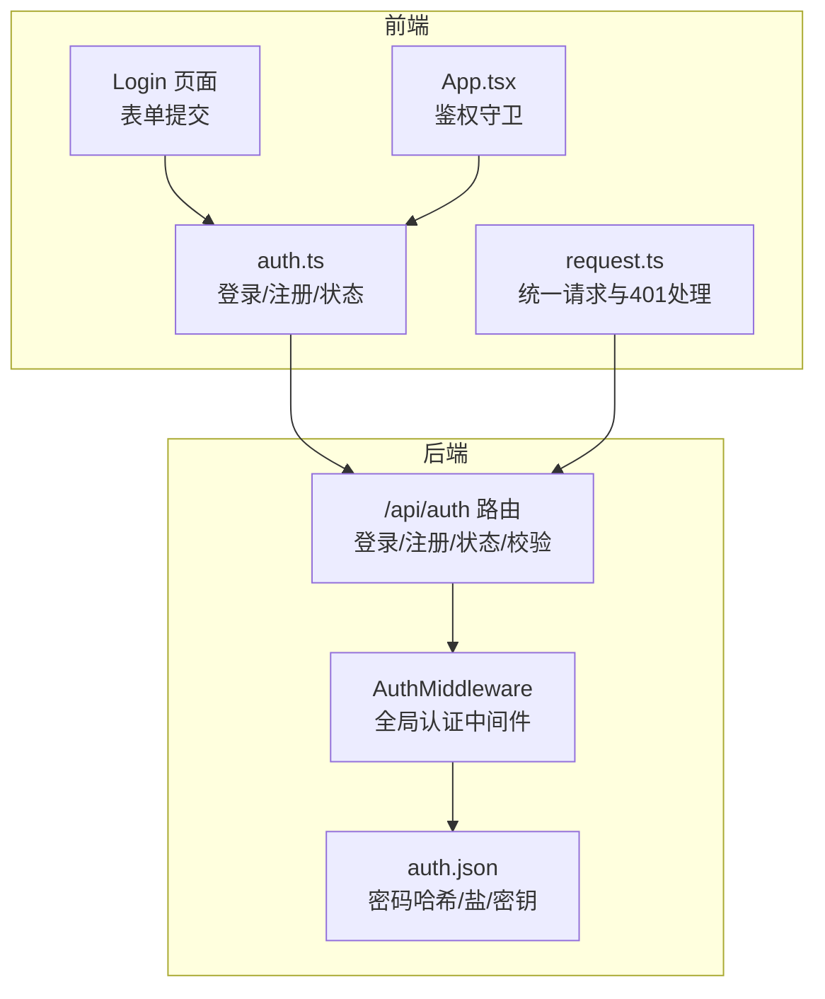
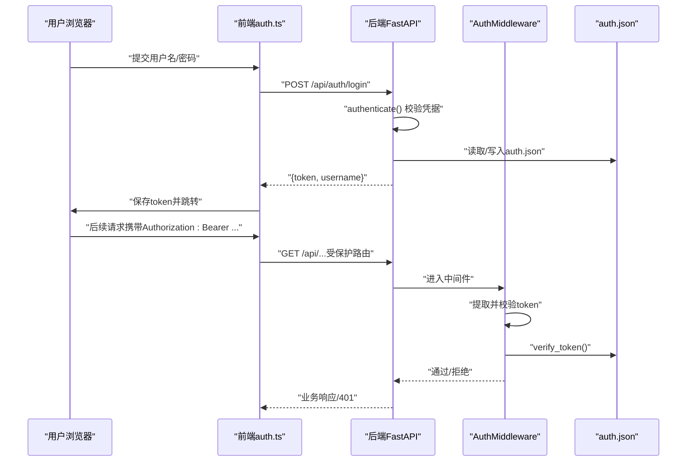
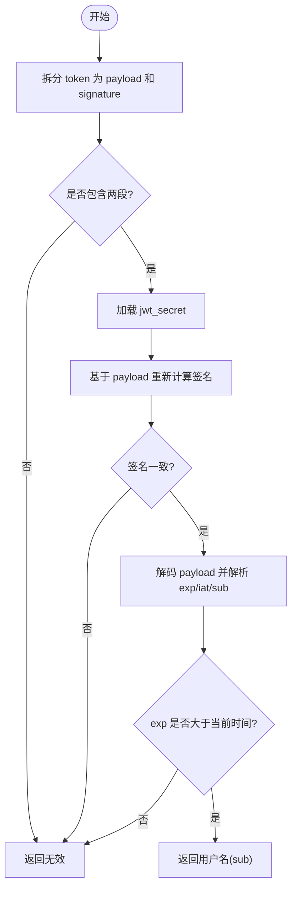
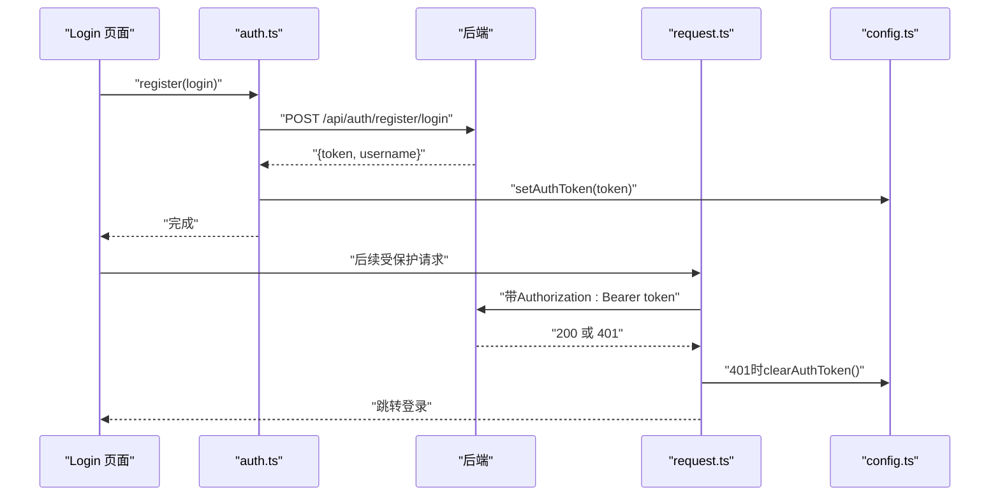
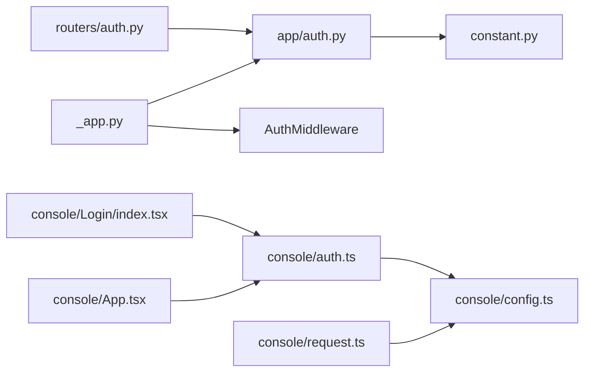

# 认证API

<cite>
**本文引用的文件列表**
- [src/copaw/app/routers/auth.py](file://src/copaw/app/routers/auth.py)
- [src/copaw/app/auth.py](file://src/copaw/app/auth.py)
- [src/copaw/app/_app.py](file://src/copaw/app/_app.py)
- [src/copaw/constant.py](file://src/copaw/constant.py)
- [console/src/api/modules/auth.ts](file://console/src/api/modules/auth.ts)
- [console/src/api/request.ts](file://console/src/api/request.ts)
- [console/src/api/config.ts](file://console/src/api/config.ts)
- [console/src/pages/Login/index.tsx](file://console/src/pages/Login/index.tsx)
- [console/src/App.tsx](file://console/src/App.tsx)
- [website/public/docs/security.zh.md](file://website/public/docs/security.zh.md)
</cite>

## 目录
1. [简介](#简介)
2. [项目结构](#项目结构)
3. [核心组件](#核心组件)
4. [架构总览](#架构总览)
5. [详细组件分析](#详细组件分析)
6. [依赖关系分析](#依赖关系分析)
7. [性能与安全特性](#性能与安全特性)
8. [故障排查指南](#故障排查指南)
9. [结论](#结论)
10. [附录：API参考与示例](#附录api参考与示例)

## 简介
本文件为 CoPaw 认证API的权威文档，覆盖用户认证、令牌管理与会话管理的完整流程。内容包括：
- 登录、注册、状态查询、令牌校验等端点的URL模式、请求方法、请求/响应格式与安全要求
- 认证流程说明、令牌格式、过期策略与错误处理机制
- 前端调用示例与后端实现要点

认证系统采用“单用户”设计，默认关闭，需通过环境变量显式启用；令牌为自签名JWT风格（HMAC-SHA256），7天有效期；受保护路由仅限 /api/*。

## 项目结构
认证相关代码分布在后端FastAPI应用与前端控制台两部分：
- 后端
  - 认证路由：/api/auth/*
  - 认证中间件：全局拦截受保护路径，校验Authorization头中的Bearer令牌
  - 认证数据持久化：auth.json（位于SECRET_DIR），含密码哈希、盐值与JWT密钥
- 前端
  - 控制台通过auth.ts封装登录/注册/状态查询
  - 统一请求层request.ts对401进行统一处理（清空令牌并跳转登录）
  - 登录页Login页面负责首次注册与后续登录

图表来源
- [src/copaw/app/routers/auth.py:18-114](file://src/copaw/app/routers/auth.py#L18-L114)
- [src/copaw/app/auth.py:302-367](file://src/copaw/app/auth.py#L302-L367)
- [console/src/api/modules/auth.ts:14-49](file://console/src/api/modules/auth.ts#L14-L49)
- [console/src/api/request.ts:39-80](file://console/src/api/request.ts#L39-L80)
- [console/src/pages/Login/index.tsx:33-68](file://console/src/pages/Login/index.tsx#L33-L68)
- [console/src/App.tsx:45-94](file://console/src/App.tsx#L45-L94)

章节来源
- [src/copaw/app/routers/auth.py:18-114](file://src/copaw/app/routers/auth.py#L18-L114)
- [src/copaw/app/auth.py:302-367](file://src/copaw/app/auth.py#L302-L367)
- [console/src/api/modules/auth.ts:14-49](file://console/src/api/modules/auth.ts#L14-L49)
- [console/src/api/request.ts:39-80](file://console/src/api/request.ts#L39-L80)
- [console/src/pages/Login/index.tsx:33-68](file://console/src/pages/Login/index.tsx#L33-L68)
- [console/src/App.tsx:45-94](file://console/src/App.tsx#L45-L94)

## 核心组件
- 认证路由模块
  - 提供 /api/auth/login、/api/auth/register、/api/auth/status、/api/auth/verify 四个端点
  - 登录/注册返回包含token与username的JSON对象
- 认证中间件
  - 对受保护路径（/api/*）进行拦截，提取Authorization头中的Bearer令牌并校验
  - 放行公开路径（如登录、注册、状态、版本、静态资源）与OPTIONS预检请求
  - 本地回环地址（127.0.0.1 / ::1）免认证
- 令牌与密码
  - 令牌：HMAC-SHA256签名的“载荷.签名”，7天过期
  - 密码：加盐SHA-256哈希，存储于auth.json
- 前端认证客户端
  - 封装登录/注册/状态查询
  - 统一请求层对401自动清理令牌并重定向到登录页

章节来源
- [src/copaw/app/routers/auth.py:41-114](file://src/copaw/app/routers/auth.py#L41-L114)
- [src/copaw/app/auth.py:38-49](file://src/copaw/app/auth.py#L38-L49)
- [src/copaw/app/auth.py:114-158](file://src/copaw/app/auth.py#L114-L158)
- [console/src/api/modules/auth.ts:14-49](file://console/src/api/modules/auth.ts#L14-L49)
- [console/src/api/request.ts:52-60](file://console/src/api/request.ts#L52-L60)

## 架构总览
认证系统遵循“后端路由+中间件+前端客户端”的分层设计：
- 后端
  - 路由层：定义认证相关端点
  - 中间件层：统一校验令牌
  - 数据层：auth.json持久化
- 前端
  - 客户端：封装认证API调用
  - 请求层：统一处理401
  - 登录页：触发登录/注册流程

图表来源
- [src/copaw/app/routers/auth.py:41-114](file://src/copaw/app/routers/auth.py#L41-L114)
- [src/copaw/app/auth.py:302-367](file://src/copaw/app/auth.py#L302-L367)
- [console/src/api/modules/auth.ts:14-49](file://console/src/api/modules/auth.ts#L14-L49)
- [console/src/api/request.ts:39-80](file://console/src/api/request.ts#L39-L80)

## 详细组件分析

### 认证路由与端点
- 路由前缀：/api/auth
- 端点一览
  - POST /api/auth/login
    - 功能：用户名+密码登录，返回token与username
    - 请求体：{username, password}
    - 成功：200 {token, username}
    - 失败：401（无效凭据）
  - POST /api/auth/register
    - 功能：首次注册（单用户），仅允许一次
    - 请求体：{username, password}
    - 成功：200 {token, username}
    - 失败：400（缺少用户名/密码）、403（未启用认证/已注册）、409（注册失败）
  - GET /api/auth/status
    - 功能：查询认证是否启用及是否存在用户
    - 返回：{enabled, has_users}
  - GET /api/auth/verify
    - 功能：校验传入Bearer令牌有效性
    - 请求头：Authorization: Bearer <token>
    - 成功：200 {valid:true, username}
    - 失败：401（未提供令牌/无效或过期）

章节来源
- [src/copaw/app/routers/auth.py:41-114](file://src/copaw/app/routers/auth.py#L41-L114)

### 认证中间件与受保护路径
- 公开路径（无需认证）
  - /api/auth/login、/api/auth/register、/api/auth/status、/api/version
  - 静态资源前缀：/assets/、/logo.png、/copaw-symbol.svg
- 受保护路径
  - 仅限 /api/* 路由
  - OPTIONS 预检请求免认证
  - 本地回环地址（127.0.0.1 / ::1）免认证
- 令牌提取
  - HTTP：Authorization: Bearer <token>
  - WebSocket：升级请求时从查询参数token获取

章节来源
- [src/copaw/app/auth.py:41-56](file://src/copaw/app/auth.py#L41-L56)
- [src/copaw/app/auth.py:335-367](file://src/copaw/app/auth.py#L335-L367)
- [src/copaw/app/_app.py:251-251](file://src/copaw/app/_app.py#L251-L251)

### 令牌生成与校验
- 令牌结构
  - 形式：base64url编码的payload.signature
  - 载荷字段：sub（用户名）、exp（过期时间）、iat（签发时间）
  - 签名算法：HMAC-SHA256，密钥来自auth.json中的jwt_secret
- 过期策略
  - 默认7天（TOKEN_EXPIRY_SECONDS=7天）
- 校验流程
  - 拆分payload与signature
  - 使用jwt_secret重新计算签名并与传入签名比对
  - 解码payload，检查exp是否小于当前时间戳
  - 任一步骤失败则判定为无效

图表来源
- [src/copaw/app/auth.py:114-158](file://src/copaw/app/auth.py#L114-L158)

章节来源
- [src/copaw/app/auth.py:114-158](file://src/copaw/app/auth.py#L114-L158)

### 密码存储与注册
- 存储方式
  - auth.json中保存：username、password_hash、password_salt、jwt_secret
  - 文件权限：0o600（仅所有者可读写）
- 注册流程
  - 仅允许一次注册
  - 自动生成jwt_secret（若不存在）
  - 成功后返回token

章节来源
- [src/copaw/app/auth.py:214-238](file://src/copaw/app/auth.py#L214-L238)
- [src/copaw/app/auth.py:166-189](file://src/copaw/app/auth.py#L166-L189)

### 前端认证客户端与会话管理
- 客户端封装
  - auth.ts：login/register/getStatus
  - request.ts：统一fetch封装，401自动清理localStorage中的token并跳转登录
  - config.ts：token存取（localStorage优先，否则构建时常量）
- 登录页逻辑
  - 首次无用户时自动切换到注册流程
  - 登录成功后设置token并跳转
- 鉴权守卫
  - App.tsx中先getStatus，再根据token调用/verify确认有效性

图表来源
- [console/src/pages/Login/index.tsx:33-68](file://console/src/pages/Login/index.tsx#L33-L68)
- [console/src/api/modules/auth.ts:14-49](file://console/src/api/modules/auth.ts#L14-L49)
- [console/src/api/request.ts:52-60](file://console/src/api/request.ts#L52-L60)
- [console/src/api/config.ts:23-41](file://console/src/api/config.ts#L23-L41)
- [console/src/App.tsx:45-94](file://console/src/App.tsx#L45-L94)

章节来源
- [console/src/pages/Login/index.tsx:33-68](file://console/src/pages/Login/index.tsx#L33-L68)
- [console/src/api/modules/auth.ts:14-49](file://console/src/api/modules/auth.ts#L14-L49)
- [console/src/api/request.ts:52-60](file://console/src/api/request.ts#L52-L60)
- [console/src/api/config.ts:23-41](file://console/src/api/config.ts#L23-L41)
- [console/src/App.tsx:45-94](file://console/src/App.tsx#L45-L94)

## 依赖关系分析
- 后端
  - 路由依赖认证模块（authenticate、register_user、verify_token、is_auth_enabled等）
  - 应用启动时挂载AuthMiddleware，全局生效
  - SECRET_DIR来自constant.py，auth.json存放于此
- 前端
  - auth.ts依赖config.ts提供的getApiUrl
  - request.ts统一处理401并清理token
  - 登录页与鉴权守卫配合完成会话生命周期管理

图表来源
- [src/copaw/app/routers/auth.py:10-16](file://src/copaw/app/routers/auth.py#L10-L16)
- [src/copaw/app/_app.py:20-251](file://src/copaw/app/_app.py#L20-L251)
- [src/copaw/constant.py:72-86](file://src/copaw/constant.py#L72-L86)
- [console/src/api/modules/auth.ts:1-1](file://console/src/api/modules/auth.ts#L1-L1)
- [console/src/api/config.ts:1-42](file://console/src/api/config.ts#L1-L42)
- [console/src/api/request.ts:39-80](file://console/src/api/request.ts#L39-L80)
- [console/src/pages/Login/index.tsx:6-7](file://console/src/pages/Login/index.tsx#L6-L7)
- [console/src/App.tsx:45-94](file://console/src/App.tsx#L45-L94)

章节来源
- [src/copaw/app/routers/auth.py:10-16](file://src/copaw/app/routers/auth.py#L10-L16)
- [src/copaw/app/_app.py:20-251](file://src/copaw/app/_app.py#L20-L251)
- [src/copaw/constant.py:72-86](file://src/copaw/constant.py#L72-L86)
- [console/src/api/modules/auth.ts:1-1](file://console/src/api/modules/auth.ts#L1-L1)
- [console/src/api/config.ts:1-42](file://console/src/api/config.ts#L1-L42)
- [console/src/api/request.ts:39-80](file://console/src/api/request.ts#L39-L80)
- [console/src/pages/Login/index.tsx:6-7](file://console/src/pages/Login/index.tsx#L6-L7)
- [console/src/App.tsx:45-94](file://console/src/App.tsx#L45-L94)

## 性能与安全特性
- 性能
  - 令牌校验为O(1)，仅涉及HMAC比较与JSON解析
  - 密码哈希为标准SHA-256，避免额外依赖
- 安全
  - 单用户设计，降低攻击面
  - 密码存储为加盐SHA-256哈希，不存储明文
  - 令牌7天过期，支持定期续期
  - auth.json权限严格（0o600）
  - 本地回环免认证，便于CLI使用
  - CORS预检与WebSocket令牌传递有明确限制

章节来源
- [src/copaw/app/auth.py:81-96](file://src/copaw/app/auth.py#L81-L96)
- [src/copaw/app/auth.py:114-158](file://src/copaw/app/auth.py#L114-L158)
- [src/copaw/app/auth.py:166-189](file://src/copaw/app/auth.py#L166-L189)
- [website/public/docs/security.zh.md:267-281](file://website/public/docs/security.zh.md#L267-L281)

## 故障排查指南
- 401 未认证
  - 前端：request.ts检测到401会自动清理localStorage中的token，并跳转至登录页
  - 后端：中间件未提供有效Bearer令牌或令牌无效/过期
- 403 禁止访问
  - 注册端点：认证未启用或已存在用户
  - 登录端点：认证未启用
- 400 参数错误
  - 注册：用户名或密码为空
- 409 冲突
  - 注册失败（例如用户已存在）
- 常见问题定位
  - 确认COPAW_AUTH_ENABLED已正确设置
  - 检查auth.json权限与内容
  - 确认Authorization头格式为Bearer <token>
  - 检查本地回环地址是否被误拦截

章节来源
- [console/src/api/request.ts:52-60](file://console/src/api/request.ts#L52-L60)
- [src/copaw/app/routers/auth.py:56-83](file://src/copaw/app/routers/auth.py#L56-L83)
- [src/copaw/app/auth.py:302-367](file://src/copaw/app/auth.py#L302-L367)

## 结论
CoPaw认证API采用简洁可靠的单用户方案：后端通过中间件统一校验令牌，前端提供统一的登录/注册/状态查询与401处理。令牌与密码均采用标准加密方式，安全边界清晰；受保护路由仅限/api/*，便于扩展与维护。建议在生产环境中启用认证，并妥善管理SECRET_DIR与auth.json权限。

## 附录：API参考与示例

### 端点清单与规范
- POST /api/auth/login
  - 请求体：{username, password}
  - 成功响应：{token, username}
  - 失败响应：401（无效凭据）
- POST /api/auth/register
  - 请求体：{username, password}
  - 成功响应：{token, username}
  - 失败响应：400（缺少参数）、403（未启用/已注册）、409（注册失败）
- GET /api/auth/status
  - 响应：{enabled, has_users}
- GET /api/auth/verify
  - 请求头：Authorization: Bearer <token>
  - 成功响应：{valid:true, username}
  - 失败响应：401（未提供令牌/无效或过期）

章节来源
- [src/copaw/app/routers/auth.py:41-114](file://src/copaw/app/routers/auth.py#L41-L114)

### 令牌格式与过期策略
- 格式：base64url(payload).signature
- 载荷字段：sub、exp、iat
- 签名算法：HMAC-SHA256
- 过期时间：默认7天
- 密钥来源：auth.json中的jwt_secret

章节来源
- [src/copaw/app/auth.py:114-158](file://src/copaw/app/auth.py#L114-L158)

### 前端调用示例（概念性）
- 登录
  - 方法：POST /api/auth/login
  - 请求头：Content-Type: application/json
  - 请求体：{username, password}
  - 成功后：将返回的token保存到localStorage
- 注册
  - 方法：POST /api/auth/register
  - 请求头：Content-Type: application/json
  - 请求体：{username, password}
  - 成功后：将返回的token保存到localStorage
- 校验
  - 方法：GET /api/auth/verify
  - 请求头：Authorization: Bearer <token>

章节来源
- [console/src/api/modules/auth.ts:14-49](file://console/src/api/modules/auth.ts#L14-L49)
- [console/src/api/config.ts:23-41](file://console/src/api/config.ts#L23-L41)