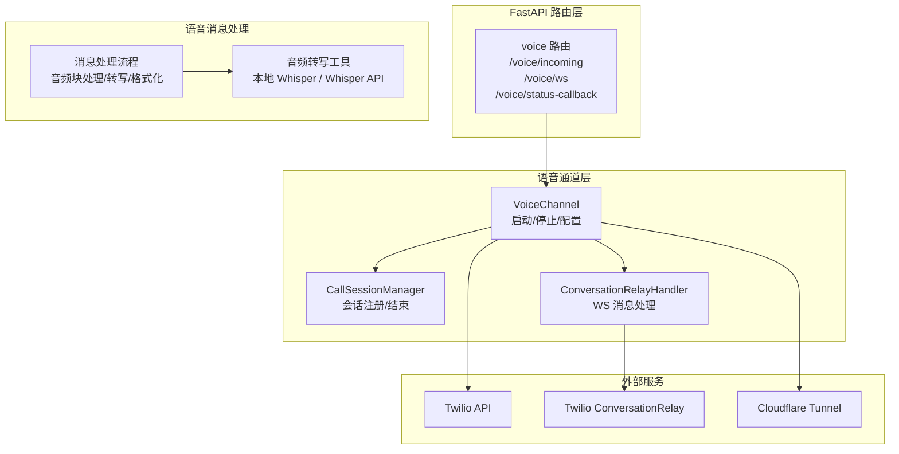
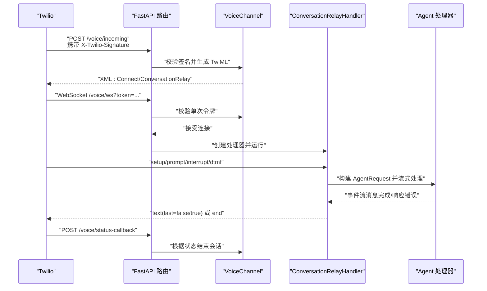
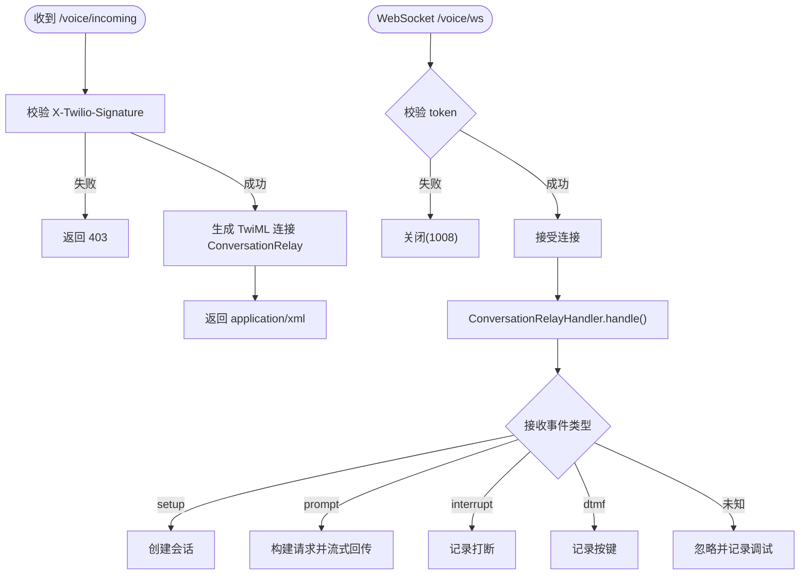
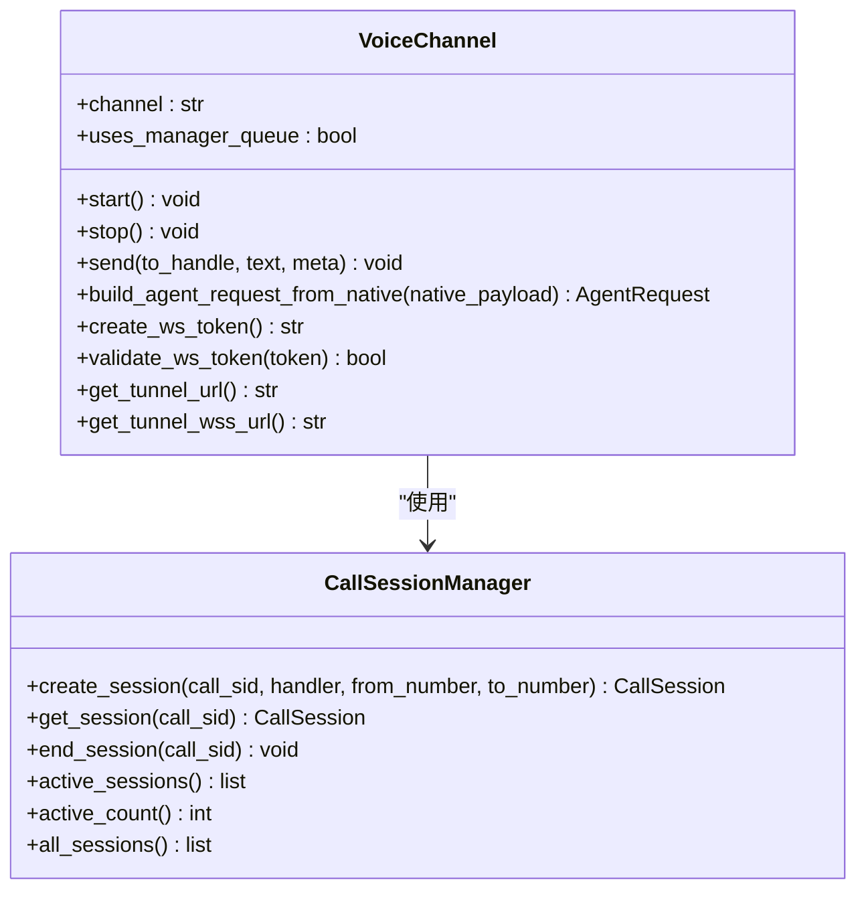
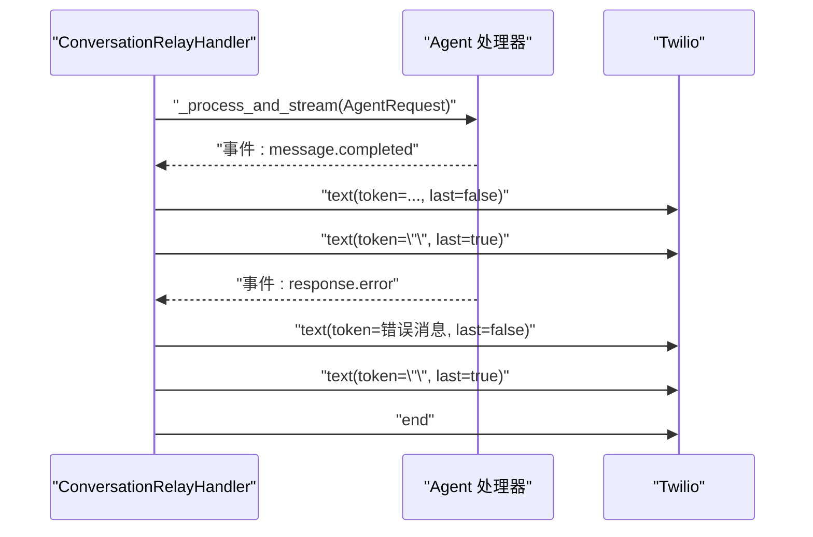
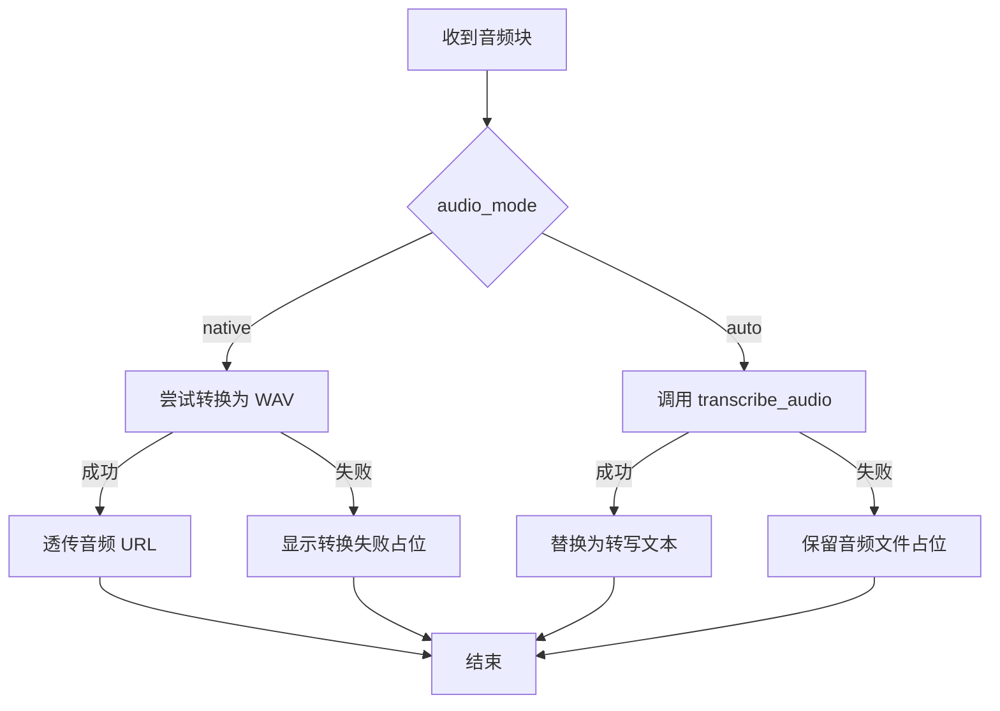
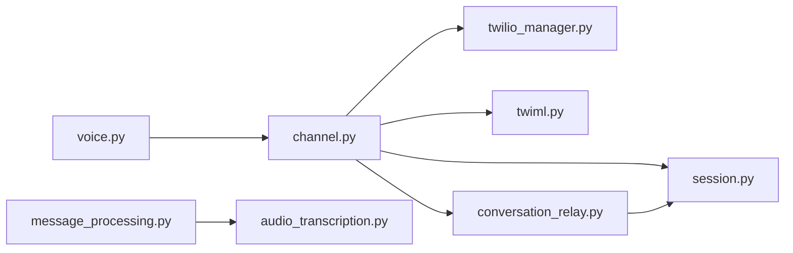

# 语音API

<cite>
**本文档引用的文件**
- [src\copaw\app\routers\voice.py](file://src\copaw\app\routers\voice.py)
- [src\copaw\app\channels\voice\channel.py](file://src\copaw\app\channels\voice\channel.py)
- [src\copaw\app\channels\voice\session.py](file://src\copaw\app\channels\voice\session.py)
- [src\copaw\app\channels\voice\conversation_relay.py](file://src\copaw\app\channels\voice\conversation_relay.py)
- [src\copaw\app\channels\voice\twilio_manager.py](file://src\copaw\app\channels\voice\twilio_manager.py)
- [src\copaw\app\channels\voice\twiml.py](file://src\copaw\app\channels\voice\twiml.py)
- [src\copaw\config\config.py](file://src\copaw\config\config.py)
- [src\copaw\agents\utils\audio_transcription.py](file://src\copaw\agents\utils\audio_transcription.py)
- [src\copaw\agents\utils\message_processing.py](file://src\copaw\agents\utils\message_processing.py)
- [src\copaw\app\channels\base.py](file://src\copaw\app\channels\base.py)
- [src\copaw\app\runner\utils.py](file://src\copaw\app\runner\utils.py)
- [src\copaw\cli\channels_cmd.py](file://src\copaw\cli\channels_cmd.py)
- [console\src\pages\Control\Channels\components\ChannelDrawer.tsx](file://console\src\pages\Control\Channels\components\ChannelDrawer.tsx)
</cite>

## 目录
1. [简介](#简介)
2. [项目结构](#项目结构)
3. [核心组件](#核心组件)
4. [架构总览](#架构总览)
5. [详细组件分析](#详细组件分析)
6. [依赖关系分析](#依赖关系分析)
7. [性能考虑](#性能考虑)
8. [故障排除指南](#故障排除指南)
9. [结论](#结论)
10. [附录](#附录)

## 简介
本文件为 CoPaw 语音API的权威技术文档，覆盖以下能力与范围：
- 语音通话（基于 Twilio 的来电接入、WebSocket 转接、状态回调）
- 语音消息处理（语音转文字、音频格式支持、转录质量设置）
- 语音质量控制（TTS/STT 提供商、语言与语音参数）
- 通话状态监控（状态回调、会话生命周期管理）
- 错误处理与安全校验（Twilio 签名校验、单次令牌、异常恢复）

文档面向后端开发者、平台集成工程师与运维人员，提供端点定义、数据格式、协议细节与最佳实践。

## 项目结构
语音功能主要由 FastAPI 路由器、Voice 通道实现、会话管理、WebSocket 处理器以及 Twilio/Twilio Relay 集成构成。同时，系统支持将语音消息转为文本或以原生音频形式传递给下游模型。

**图表来源**
- [src\copaw\app\routers\voice.py:84-183](file://src\copaw\app\routers\voice.py#L84-L183)
- [src\copaw\app\channels\voice\channel.py:17-240](file://src\copaw\app\channels\voice\channel.py#L17-L240)
- [src\copaw\app\channels\voice\session.py:28-73](file://src\copaw\app\channels\voice\session.py#L28-L73)
- [src\copaw\app\channels\voice\conversation_relay.py:29-289](file://src\copaw\app\channels\voice\conversation_relay.py#L29-L289)
- [src\copaw\agents\utils\audio_transcription.py:295-318](file://src\copaw\agents\utils\audio_transcription.py#L295-L318)

**章节来源**
- [src\copaw\app\routers\voice.py:1-184](file://src\copaw\app\routers\voice.py#L1-L184)
- [src\copaw\app\channels\voice\channel.py:1-240](file://src\copaw\app\channels\voice\channel.py#L1-L240)

## 核心组件
- 语音路由（FastAPI）：暴露 Twilio 对接端点，负责签名验证、WebSocket 认证与状态回调。
- 语音通道（VoiceChannel）：封装 Twilio 配置、Cloudflare 隧道、会话管理与 WebSocket 令牌机制。
- 会话管理（CallSessionManager）：跟踪活跃通话、记录起止时间与状态。
- 通话中继处理器（ConversationRelayHandler）：解析 TwiML 事件、构建代理请求、流式回传文本。
- Twilio 管理器（TwilioManager）：异步封装 Twilio SDK，更新来电号码的 Webhook。
- TwiML 工具（twiml）：生成连接到 ConversationRelay 的 TwiML XML。
- 音频转写工具（audio_transcription）：支持本地 Whisper 与 Whisper API 的转写入口。
- 消息处理（message_processing）：在非语音通道中对音频块进行转写或原生音频处理。

**章节来源**
- [src\copaw\app\channels\voice\channel.py:17-240](file://src\copaw\app\channels\voice\channel.py#L17-L240)
- [src\copaw\app\channels\voice\session.py:16-73](file://src\copaw\app\channels\voice\session.py#L16-L73)
- [src\copaw\app\channels\voice\conversation_relay.py:29-289](file://src\copaw\app\channels\voice\conversation_relay.py#L29-L289)
- [src\copaw\app\channels\voice\twilio_manager.py:12-58](file://src\copaw\app\channels\voice\twilio_manager.py#L12-L58)
- [src\copaw\app\channels\voice\twiml.py:8-62](file://src\copaw\app\channels\voice\twiml.py#L8-L62)
- [src\copaw\agents\utils\audio_transcription.py:295-318](file://src\copaw\agents\utils\audio_transcription.py#L295-L318)
- [src\copaw\agents\utils\message_processing.py:239-289](file://src\copaw\agents\utils\message_processing.py#L239-L289)

## 架构总览
下图展示从 Twilio 到 CoPaw 的完整语音通话链路，包括 Webhook 接入、WebSocket 中继、会话管理与状态回调。

**图表来源**
- [src\copaw\app\routers\voice.py:84-183](file://src\copaw\app\routers\voice.py#L84-L183)
- [src\copaw\app\channels\voice\channel.py:100-137](file://src\copaw\app\channels\voice\channel.py#L100-L137)
- [src\copaw\app\channels\voice\conversation_relay.py:60-102](file://src\copaw\app\channels\voice\conversation_relay.py#L60-L102)

## 详细组件分析

### 语音路由与端点
- /voice/incoming（POST）
  - 功能：Twilio 来电 Webhook，返回连接到 ConversationRelay 的 TwiML。
  - 安全校验：使用 X-Twilio-Signature 与 RequestValidator 校验；可跳过（开发模式）。
  - 输出：application/xml（TwiML）。
  - 关键参数（来自 VoiceChannel 配置）：welcome_greeting、tts_provider、tts_voice、stt_provider、language、interruptible。
- /voice/ws（WebSocket）
  - 功能：与 Twilio ConversationRelay 建立双向通信。
  - 认证：查询参数 token 必须通过 VoiceChannel 的一次性令牌校验。
  - 协议：按类型分发 setup/prompt/interrupt/dtmf；向 Twilio 回传 text/end。
- /voice/status-callback（POST）
  - 功能：Twilio 通话状态回调，用于结束会话。
  - 触发状态：completed/busy/no-answer/canceled/failed。

**图表来源**
- [src\copaw\app\routers\voice.py:84-183](file://src\copaw\app\routers\voice.py#L84-L183)
- [src\copaw\app\channels\voice\conversation_relay.py:60-102](file://src\copaw\app\channels\voice\conversation_relay.py#L60-L102)

**章节来源**
- [src\copaw\app\routers\voice.py:84-183](file://src\copaw\app\routers\voice.py#L84-L183)

### 语音通道与会话管理
- 启动流程
  - 校验启用状态与 Twilio 凭据。
  - 启动 Cloudflare 隧道，获取公网 URL。
  - 通过 TwilioManager 更新来电号码的 voice_url 与 status_callback。
- 会话管理
  - CallSessionManager 维护活跃会话列表，记录 call_sid、来电/去电号码、开始时间与状态。
  - 支持主动结束会话与统计活跃数量。
- WebSocket 令牌
  - 生成一次性 token 并限制最大数量，连接时消费该 token。

**图表来源**
- [src\copaw\app\channels\voice\channel.py:17-240](file://src\copaw\app\channels\voice\channel.py#L17-L240)
- [src\copaw\app\channels\voice\session.py:16-73](file://src\copaw\app\channels\voice\session.py#L16-L73)

**章节来源**
- [src\copaw\app\channels\voice\channel.py:81-158](file://src\copaw\app\channels\voice\channel.py#L81-L158)
- [src\copaw\app\channels\voice\session.py:28-73](file://src\copaw\app\channels\voice\session.py#L28-L73)

### 通话中继处理器（WebSocket）
- 事件处理
  - setup：提取 callSid 与 caller 信息，创建会话。
  - prompt：提取语音转写文本，构建 AgentRequest，调用 _process_and_stream 流式回传。
  - interrupt：记录打断内容（可扩展截断助手回复）。
  - dtmf：记录按键输入。
- 流式回传
  - 每条消息完成后发送空 token（last=false），再发送空 token（last=true）以触发播放。
  - 响应错误时发送统一错误提示并结束。
- 异常处理
  - 捕获 WebSocketDisconnect 与未预期异常，确保会话正确结束与连接关闭。

**图表来源**
- [src\copaw\app\channels\voice\conversation_relay.py:185-226](file://src\copaw\app\channels\voice\conversation_relay.py#L185-L226)

**章节来源**
- [src\copaw\app\channels\voice\conversation_relay.py:60-289](file://src\copaw\app\channels\voice\conversation_relay.py#L60-L289)

### Twilio 集成与 TwiML
- TwilioManager
  - 异步封装 Twilio SDK，更新来电号码的 voice_url 与 status_callback。
- TwiML 生成
  - build_conversation_relay_twiml：输出 Connect/ConversationRelay XML，包含欢迎语、TTS/STT 提供商、语言与可中断性等参数。
  - build_busy_twiml/build_error_twiml：用于忙线或错误场景的语音播报。

**章节来源**
- [src\copaw\app\channels\voice\twilio_manager.py:12-58](file://src\copaw\app\channels\voice\twilio_manager.py#L12-L58)
- [src\copaw\app\channels\voice\twiml.py:8-62](file://src\copaw\app\channels\voice\twiml.py#L8-L62)

### 语音消息处理与转录
- 非语音通道中的语音消息
  - audio_mode=native：尝试将音频转换为 WAV，支持部分格式直接透传；不支持则显示占位提示。
  - audio_mode=auto：调用 transcribe_audio 尝试转写；成功则替换为文本块，失败则保留“收到音频文件”的占位。
- 音频转写工具
  - 支持本地 Whisper 与 Whisper API 两种后端，依据配置选择。
  - Whisper API 使用 OpenAI 兼容客户端，支持自定义 base_url 与模型名。
  - 本地 Whisper 需要 ffmpeg 与 openai-whisper 可用。
- 消息处理流程
  - 下载音频文件至本地，根据配置决定转写或原生透传，并在消息内容中替换相应块。

**图表来源**
- [src\copaw\agents\utils\message_processing.py:239-289](file://src\copaw\agents\utils\message_processing.py#L239-L289)
- [src\copaw\agents\utils\audio_transcription.py:295-318](file://src\copaw\agents\utils\audio_transcription.py#L295-L318)

**章节来源**
- [src\copaw\agents\utils\message_processing.py:239-289](file://src\copaw\agents\utils\message_processing.py#L239-L289)
- [src\copaw\agents\utils\audio_transcription.py:155-201](file://src\copaw\agents\utils\audio_transcription.py#L155-L201)
- [src\copaw\agents\utils\audio_transcription.py:236-287](file://src\copaw\agents\utils\audio_transcription.py#L236-L287)

### 配置与控制台
- 语音通道配置项（VoiceChannelConfig）
  - twilio_account_sid/twilio_auth_token：Twilio 凭据。
  - phone_number/phone_number_sid：绑定的来电号码标识。
  - tts_provider/tts_voice/stt_provider/language：TTS/STT 提供商与语言设置。
  - welcome_greeting：来电欢迎语。
- CLI 交互配置
  - 交互式配置 Twilio 凭据与电话号码 SID。
- 控制台界面
  - 提供 Twilio 账号信息表单与语音通道配置入口。

**章节来源**
- [src\copaw\config\config.py:143-155](file://src\copaw\config\config.py#L143-L155)
- [src\copaw\cli\channels_cmd.py:497-532](file://src\copaw\cli\channels_cmd.py#L497-L532)
- [console\src\pages\Control\Channels\components\ChannelDrawer.tsx:602-626](file://console\src\pages\Control\Channels\components\ChannelDrawer.tsx#L602-L626)

## 依赖关系分析
- 路由依赖 Twilio 签名校验与 VoiceChannel 实例。
- VoiceChannel 依赖 TwilioManager、CloudflareTunnelDriver、CallSessionManager。
- ConversationRelayHandler 依赖 WebSocket、Agent 处理器与 CallSessionManager。
- 音频转写工具依赖 ProviderManager 与 OpenAI 兼容客户端或本地 Whisper 库。

**图表来源**
- [src\copaw\app\routers\voice.py:84-183](file://src\copaw\app\routers\voice.py#L84-L183)
- [src\copaw\app\channels\voice\channel.py:17-240](file://src\copaw\app\channels\voice\channel.py#L17-L240)
- [src\copaw\app\channels\voice\conversation_relay.py:29-289](file://src\copaw\app\channels\voice\conversation_relay.py#L29-L289)
- [src\copaw\agents\utils\message_processing.py:239-289](file://src\copaw\agents\utils\message_processing.py#L239-L289)
- [src\copaw\agents\utils\audio_transcription.py:295-318](file://src\copaw\agents\utils\audio_transcription.py#L295-L318)

**章节来源**
- [src\copaw\app\routers\voice.py:1-184](file://src\copaw\app\routers\voice.py#L1-L184)
- [src\copaw\app\channels\voice\channel.py:1-240](file://src\copaw\app\channels\voice\channel.py#L1-L240)

## 性能考虑
- WebSocket 循环与事件处理
  - 采用逐事件处理，避免阻塞；每条消息完成后立即回传，提升实时性。
- 令牌与会话管理
  - 一次性 token 限制最大数量，防止内存膨胀；会话状态及时清理。
- 转写后端选择
  - Whisper API：延迟低、稳定性高，适合生产环境。
  - 本地 Whisper：减少网络依赖，但需要 ffmpeg 与模型加载开销。
- 音频格式处理
  - native 模式优先转换为 WAV，减少下游兼容问题；auto 模式在转写失败时保留文件占位，避免阻塞。

[本节为通用指导，无需特定文件来源]

## 故障排除指南
- Twilio 签名验证失败（403）
  - 检查 X-Twilio-Signature 是否存在，确认 auth_token 配置正确，注意反向代理下的 x-forwarded-* 头。
- WebSocket 连接被拒绝（1008）
  - 确认 token 存在且未过期；检查 /voice/incoming 返回的 URL 是否包含有效 token。
- 无法启动语音通道
  - 检查 Twilio 凭据与 phone_number_sid；确认 Cloudflare 隧道可访问；查看日志中的异常堆栈。
- 通话结束后未释放资源
  - 确认 status-callback 正常触发；检查会话状态是否标记为 ended。
- 转写失败
  - 检查 Whisper API 凭据与 base_url；确认 Whisper 本地安装与 ffmpeg 可用；查看超时与异常日志。

**章节来源**
- [src\copaw\app\routers\voice.py:42-82](file://src\copaw\app\routers\voice.py#L42-L82)
- [src\copaw\app\channels\voice\channel.py:138-158](file://src\copaw\app\channels\voice\channel.py#L138-L158)
- [src\copaw\agents\utils\audio_transcription.py:155-201](file://src\copaw\agents\utils\audio_transcription.py#L155-L201)
- [src\copaw\agents\utils\audio_transcription.py:236-287](file://src\copaw\agents\utils\audio_transcription.py#L236-L287)

## 结论
CoPaw 语音API通过 Twilio 与 Cloudflare 隧道实现了端到端的语音通话与消息处理能力。路由层提供安全校验与认证，通道层负责会话与令牌管理，中继处理器实现事件驱动的流式回传，转写工具支持多种后端以满足不同部署需求。结合完善的配置与控制台界面，系统具备良好的可运维性与扩展性。

[本节为总结，无需特定文件来源]

## 附录

### API 端点一览
- 方法与路径
  - POST /voice/incoming
  - GET /voice/ws?token=...
  - POST /voice/status-callback
- 请求/响应格式
  - /incoming：接收表单参数，返回 application/xml（TwiML）。
  - /ws：WebSocket 文本帧，类型字段区分事件。
  - /status-callback：接收表单参数（CallSid、CallStatus），返回 204。
- 安全要求
  - 所有 Twilio 相关端点需通过 X-Twilio-Signature 校验。
  - WebSocket 连接需一次性 token 校验。

**章节来源**
- [src\copaw\app\routers\voice.py:84-183](file://src\copaw\app\routers\voice.py#L84-L183)

### 语音消息处理与音频格式
- 支持的处理模式
  - native：尝试转换为 WAV 并透传音频 URL。
  - auto：尝试转写为文本，失败时保留音频文件占位。
- 音频格式
  - native 模式下优先转换为 WAV；支持常见音频扩展名透传。
- 转写后端
  - Whisper API：OpenAI 兼容接口，可配置 base_url 与模型名。
  - 本地 Whisper：需要 ffmpeg 与 openai-whisper。

**章节来源**
- [src\copaw\agents\utils\message_processing.py:239-289](file://src\copaw\agents\utils\message_processing.py#L239-L289)
- [src\copaw\agents\utils\audio_transcription.py:155-201](file://src\copaw\agents\utils\audio_transcription.py#L155-L201)
- [src\copaw\agents\utils\audio_transcription.py:236-287](file://src\copaw\agents\utils\audio_transcription.py#L236-L287)

### 语音质量控制与参数
- TTS/STT 提供商与语音
  - tts_provider、tts_voice、stt_provider、language 在 TwiML 中配置。
- 可中断性
  - interruptible 参数控制通话中打断能力。
- 会话与状态
  - 通过 CallSessionManager 管理活跃会话，status-callback 触发结束逻辑。

**章节来源**
- [src\copaw\app\channels\voice\twiml.py:8-37](file://src\copaw\app\channels\voice\twiml.py#L8-L37)
- [src\copaw\app\channels\voice\session.py:28-73](file://src\copaw\app\channels\voice\session.py#L28-L73)