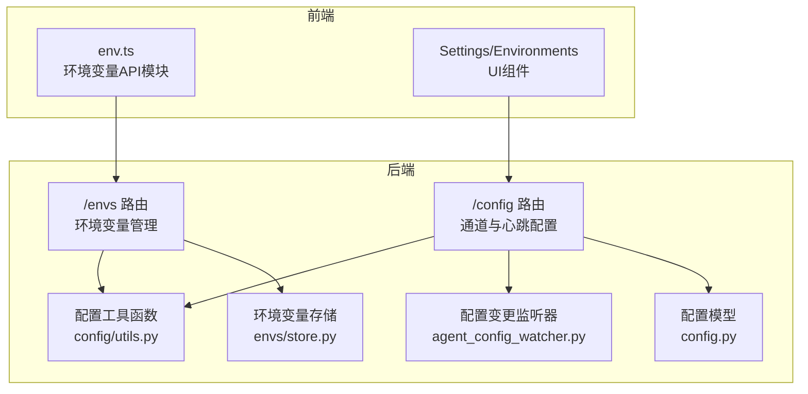
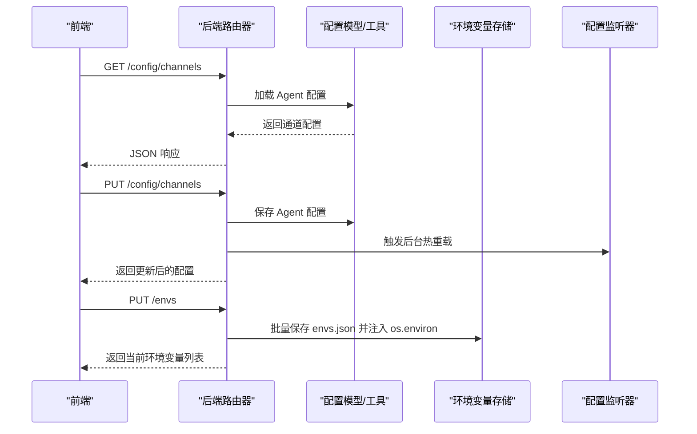
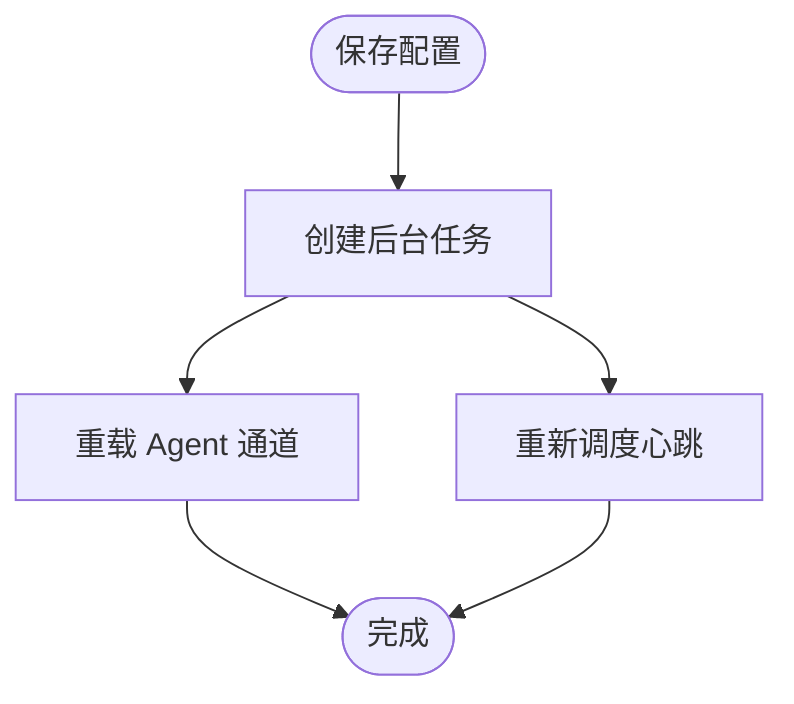
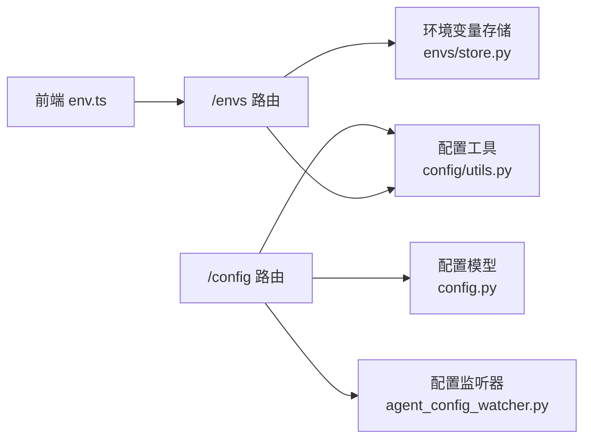

# 配置管理API

<cite>
**本文档引用的文件**
- [src/copaw/app/routers/config.py](file://src/copaw/app/routers/config.py)
- [src/copaw/app/routers/envs.py](file://src/copaw/app/routers/envs.py)
- [src/copaw/config/config.py](file://src/copaw/config/config.py)
- [src/copaw/envs/store.py](file://src/copaw/envs/store.py)
- [src/copaw/app/routers/schemas_config.py](file://src/copaw/app/routers/schemas_config.py)
- [src/copaw/app/agent_config_watcher.py](file://src/copaw/app/agent_config_watcher.py)
- [src/copaw/config/utils.py](file://src/copaw/config/utils.py)
- [console/src/api/modules/env.ts](file://console/src/api/modules/env.ts)
- [console/src/api/tabs/Settings/Environments/index.tsx](file://console/src/pages/Settings/Environments/index.tsx)
- [website/public/docs/config.zh.md](file://website/public/docs/config.zh.md)
</cite>

## 目录
1. [简介](#简介)
2. [项目结构](#项目结构)
3. [核心组件](#核心组件)
4. [架构总览](#架构总览)
5. [详细组件分析](#详细组件分析)
6. [依赖关系分析](#依赖关系分析)
7. [性能考虑](#性能考虑)
8. [故障排除指南](#故障排除指南)
9. [结论](#结论)
10. [附录](#附录)

## 简介
本文件为 CoPaw 配置管理 API 的权威技术文档，覆盖应用配置与环境变量管理的全部端点与行为。内容包括：
- 全局配置读取/更新、环境变量设置、配置验证与热重载机制
- URL 模式、请求方法、请求/响应格式
- 配置项说明、默认值、验证规则
- 环境变量的存储方式、作用域与优先级
- 错误处理策略与常见问题排查

## 项目结构
CoPaw 的配置管理由后端 FastAPI 路由器与配置模型共同实现，前端通过统一的 API 模块进行调用。

**图表来源**
- [src/copaw/app/routers/config.py:40-565](file://src/copaw/app/routers/config.py#L40-L565)
- [src/copaw/app/routers/envs.py:12-81](file://src/copaw/app/routers/envs.py#L12-L81)
- [src/copaw/config/config.py:806-1101](file://src/copaw/config/config.py#L806-L1101)
- [src/copaw/envs/store.py:103-243](file://src/copaw/envs/store.py#L103-L243)
- [src/copaw/app/agent_config_watcher.py:35-278](file://src/copaw/app/agent_config_watcher.py#L35-L278)
- [src/copaw/config/utils.py:423-474](file://src/copaw/config/utils.py#L423-L474)
- [console/src/api/modules/env.ts:4-18](file://console/src/api/modules/env.ts#L4-L18)

**章节来源**
- [src/copaw/app/routers/config.py:40-565](file://src/copaw/app/routers/config.py#L40-L565)
- [src/copaw/app/routers/envs.py:12-81](file://src/copaw/app/routers/envs.py#L12-L81)
- [src/copaw/config/config.py:806-1101](file://src/copaw/config/config.py#L806-L1101)
- [src/copaw/envs/store.py:103-243](file://src/copaw/envs/store.py#L103-L243)
- [src/copaw/app/agent_config_watcher.py:35-278](file://src/copaw/app/agent_config_watcher.py#L35-L278)
- [src/copaw/config/utils.py:423-474](file://src/copaw/config/utils.py#L423-L474)
- [console/src/api/modules/env.ts:4-18](file://console/src/api/modules/env.ts#L4-L18)

## 核心组件
- 配置路由器（/config）
  - 通道配置：批量读取、批量更新、按通道读取、按通道更新
  - 心跳配置：读取、更新并热重载调度器
  - 安全与扫描：工具守卫、技能扫描器及其白名单、阻断历史
  - 用户时区：读取、更新
  - LLM 路由：全局读取、更新
- 环境变量路由器（/envs）
  - 列表、批量保存、单键删除
- 配置模型与工具
  - Pydantic 模型定义配置结构与默认值
  - 配置加载/保存工具函数
  - 环境变量持久化与注入
- 配置热重载
  - 后台异步热重载通道与心跳
  - 文件变更监听器自动重载

**章节来源**
- [src/copaw/app/routers/config.py:59-565](file://src/copaw/app/routers/config.py#L59-L565)
- [src/copaw/app/routers/envs.py:32-81](file://src/copaw/app/routers/envs.py#L32-L81)
- [src/copaw/config/config.py:806-1101](file://src/copaw/config/config.py#L806-L1101)
- [src/copaw/envs/store.py:151-243](file://src/copaw/envs/store.py#L151-L243)
- [src/copaw/app/agent_config_watcher.py:74-278](file://src/copaw/app/agent_config_watcher.py#L74-L278)

## 架构总览
配置管理涉及三层：前端 API 模块、后端路由器、配置与存储层。

**图表来源**
- [src/copaw/app/routers/config.py:111-152](file://src/copaw/app/routers/config.py#L111-L152)
- [src/copaw/app/routers/envs.py:43-63](file://src/copaw/app/routers/envs.py#L43-L63)
- [src/copaw/config/utils.py:423-474](file://src/copaw/config/utils.py#L423-L474)
- [src/copaw/envs/store.py:182-201](file://src/copaw/envs/store.py#L182-L201)
- [src/copaw/app/agent_config_watcher.py:240-278](file://src/copaw/app/agent_config_watcher.py#L240-L278)

## 详细组件分析

### 通道配置 API
- 批量读取通道配置
  - 方法与路径：GET /config/channels
  - 功能：返回当前可用通道的配置，未配置的通道使用默认值
  - 响应：通道字典（含 isBuiltin 标记）
- 通道类型枚举
  - 方法与路径：GET /config/channels/types
  - 功能：返回可用通道类型标识符（受 COPAW_ENABLED_CHANNELS/COPAW_DISABLED_CHANNELS 过滤）
- 批量更新通道配置
  - 方法与路径：PUT /config/channels
  - 请求体：完整 ChannelConfig
  - 响应：更新后的 ChannelConfig
  - 热重载：后台异步重载对应 Agent
- 按通道读取
  - 方法与路径：GET /config/channels/{channel_name}
  - 响应：指定通道配置
- 按通道更新
  - 方法与路径：PUT /config/channels/{channel_name}
  - 请求体：通道配置对象
  - 响应：更新后的通道配置
  - 热重载：后台异步重载对应 Agent

请求/响应格式要点
- 通道配置对象包含通用字段与各通道专属字段
- 未配置的通道返回默认值（enabled=false、bot_prefix="" 等）

验证与错误
- 通道名不在可用列表时返回 404
- 通道未配置时返回 404
- 更新后触发后台热重载，失败会记录警告日志

**章节来源**
- [src/copaw/app/routers/config.py:59-196](file://src/copaw/app/routers/config.py#L59-L196)
- [src/copaw/app/routers/config.py:199-265](file://src/copaw/app/routers/config.py#L199-L265)
- [src/copaw/config/config.py:167-184](file://src/copaw/config/config.py#L167-L184)
- [src/copaw/config/config.py:28-40](file://src/copaw/config/config.py#L28-L40)

### 心跳配置 API
- 读取心跳配置
  - 方法与路径：GET /config/heartbeat
  - 响应：HeartbeatConfig（未配置时使用默认值）
- 更新心跳配置
  - 方法与路径：PUT /config/heartbeat
  - 请求体：HeartbeatBody（enabled、every、target、activeHours）
  - 响应：更新后的 HeartbeatConfig
  - 热重载：后台异步重新调度心跳任务

请求/响应格式要点
- HeartbeatBody 支持 activeHours（可选）别名为 activeHours
- 更新后立即触发后台重调度

**章节来源**
- [src/copaw/app/routers/config.py:268-325](file://src/copaw/app/routers/config.py#L268-L325)
- [src/copaw/app/routers/schemas_config.py:11-23](file://src/copaw/app/routers/schemas_config.py#L11-L23)

### 用户时区 API
- 读取用户时区
  - 方法与路径：GET /config/user-timezone
  - 响应：{"timezone": "..."}
- 更新用户时区
  - 方法与路径：PUT /config/user-timezone
  - 请求体：{"timezone": "..."}
  - 响应：{"timezone": "..."}
  - 验证：timezone 不能为空

**章节来源**
- [src/copaw/app/routers/config.py:355-379](file://src/copaw/app/routers/config.py#L355-L379)

### 安全与扫描 API
- 工具守卫
  - 读取：GET /config/security/tool-guard
  - 更新：PUT /config/security/tool-guard
  - 行为：更新后立即重载守卫引擎
- 内置规则
  - 读取：GET /config/security/tool-guard/builtin-rules
- 技能扫描器
  - 读取：GET /config/security/skill-scanner
  - 更新：PUT /config/security/skill-scanner
  - 阻断历史
    - 读取：GET /config/security/skill-scanner/blocked-history
    - 清空：DELETE /config/security/skill-scanner/blocked-history
    - 删除单项：DELETE /config/security/skill-scanner/blocked-history/{index}
  - 白名单
    - 添加：POST /config/security/skill-scanner/whitelist
    - 删除：DELETE /config/security/skill-scanner/whitelist/{skill_name}

请求/响应与验证
- 添加白名单时 skill_name 不能为空，若已存在则返回 409
- 删除白名单时若不存在返回 404
- 删除阻断历史单项时若不存在返回 404

**章节来源**
- [src/copaw/app/routers/config.py:385-565](file://src/copaw/app/routers/config.py#L385-L565)

### LLM 路由 API
- 读取全局 LLM 路由设置
  - 方法与路径：GET /config/agents/llm-routing
- 更新全局 LLM 路由设置
  - 方法与路径：PUT /config/agents/llm-routing
  - 请求体：AgentsLLMRoutingConfig
  - 响应：更新后的配置

**章节来源**
- [src/copaw/app/routers/config.py:328-349](file://src/copaw/app/routers/config.py#L328-L349)

### 环境变量 API
- 列出所有环境变量
  - 方法与路径：GET /envs
  - 响应：EnvVar[]（key、value）
- 批量保存（全量替换）
  - 方法与路径：PUT /envs
  - 请求体：Record<string, string>
  - 验证：key 不能为空，否则返回 400
  - 行为：清理并保存，同时注入到 os.environ（受保护键除外）
- 删除单个环境变量
  - 方法与路径：DELETE /envs/{key}
  - 行为：若不存在返回 404，存在则删除并返回当前列表

存储与注入策略
- envs.json 为持久化存储（敏感目录），os.environ 注入当前进程及子进程
- 启动时加载 envs.json，受保护键（如 COPAW_WORKING_DIR、COPAW_SECRET_DIR）不注入
- 旧版 envs.json 会迁移至安全目录

**章节来源**
- [src/copaw/app/routers/envs.py:32-81](file://src/copaw/app/routers/envs.py#L32-L81)
- [src/copaw/envs/store.py:151-243](file://src/copaw/envs/store.py#L151-L243)
- [console/src/api/modules/env.ts:4-18](file://console/src/api/modules/env.ts#L4-L18)

### 配置热重载机制
- 后台热重载
  - 通道更新：保存后创建后台任务，调用 MultiAgentManager.reload_agent
  - 心跳更新：保存后创建后台任务，调用 CronManager.reschedule_heartbeat
- 文件变更监听
  - AgentConfigWatcher 每 2 秒轮询 agent.json，检测变更后自动重载通道与心跳
  - 失败时回滚并记录异常

**图表来源**
- [src/copaw/app/routers/config.py:140-150](file://src/copaw/app/routers/config.py#L140-L150)
- [src/copaw/app/routers/config.py:312-323](file://src/copaw/app/routers/config.py#L312-L323)
- [src/copaw/app/agent_config_watcher.py:240-278](file://src/copaw/app/agent_config_watcher.py#L240-L278)

**章节来源**
- [src/copaw/app/routers/config.py:140-150](file://src/copaw/app/routers/config.py#L140-L150)
- [src/copaw/app/routers/config.py:312-323](file://src/copaw/app/routers/config.py#L312-L323)
- [src/copaw/app/agent_config_watcher.py:74-95](file://src/copaw/app/agent_config_watcher.py#L74-L95)

## 依赖关系分析
- 路由器依赖配置模型与工具函数
- 环境变量 API 依赖 envs/store.py 的持久化与注入逻辑
- 热重载依赖 MultiAgentManager 与 CronManager（在请求生命周期外异步执行）
- 配置监听器依赖通道可用性枚举与配置加载

**图表来源**
- [src/copaw/app/routers/config.py:9-38](file://src/copaw/app/routers/config.py#L9-L38)
- [src/copaw/app/routers/envs.py:10-11](file://src/copaw/app/routers/envs.py#L10-L11)
- [src/copaw/config/config.py:806-1101](file://src/copaw/config/config.py#L806-L1101)
- [src/copaw/envs/store.py:103-243](file://src/copaw/envs/store.py#L103-L243)
- [console/src/api/modules/env.ts:4-18](file://console/src/api/modules/env.ts#L4-L18)

**章节来源**
- [src/copaw/app/routers/config.py:9-38](file://src/copaw/app/routers/config.py#L9-L38)
- [src/copaw/app/routers/envs.py:10-11](file://src/copaw/app/routers/envs.py#L10-L11)
- [src/copaw/config/config.py:806-1101](file://src/copaw/config/config.py#L806-L1101)
- [src/copaw/envs/store.py:103-243](file://src/copaw/envs/store.py#L103-L243)

## 性能考虑
- 后台热重载采用异步任务，避免阻塞请求线程
- 配置监听器轮询间隔为 2 秒，折中平衡实时性与开销
- 批量保存环境变量时仅对新增/变更键注入 os.environ，减少不必要的系统调用
- 配置模型使用 Pydantic 校验，减少后续运行时错误

[本节为通用指导，无需特定文件来源]

## 故障排除指南
- 通道不存在或未配置
  - 现象：返回 404
  - 处理：确认通道名在可用列表且已配置
- 环境变量键为空
  - 现象：返回 400
  - 处理：确保键非空
- 删除不存在的环境变量/白名单条目
  - 现象：返回 404
  - 处理：检查键/名称是否存在
- 热重载失败
  - 现象：后台日志出现警告
  - 处理：检查 Agent 状态与相关服务可用性
- 环境变量未生效
  - 现象：子进程无法读取
  - 处理：确认 envs.json 已保存并注入；检查受保护键未被注入

**章节来源**
- [src/copaw/app/routers/config.py:173-195](file://src/copaw/app/routers/config.py#L173-L195)
- [src/copaw/app/routers/envs.py:55-60](file://src/copaw/app/routers/envs.py#L55-L60)
- [src/copaw/envs/store.py:222-242](file://src/copaw/envs/store.py#L222-L242)

## 结论
CoPaw 的配置管理 API 提供了完善的全局配置与环境变量管理能力，结合热重载与文件监听机制，实现了无中断的配置更新体验。通过清晰的端点设计、严格的验证与错误处理，以及安全的环境变量存储策略，满足了多智能体场景下的配置需求。

[本节为总结，无需特定文件来源]

## 附录

### API 端点速查
- 通道配置
  - GET /config/channels
  - GET /config/channels/types
  - PUT /config/channels
  - GET /config/channels/{channel_name}
  - PUT /config/channels/{channel_name}
- 心跳配置
  - GET /config/heartbeat
  - PUT /config/heartbeat
- 用户时区
  - GET /config/user-timezone
  - PUT /config/user-timezone
- 安全与扫描
  - GET /config/security/tool-guard
  - PUT /config/security/tool-guard
  - GET /config/security/tool-guard/builtin-rules
  - GET /config/security/skill-scanner
  - PUT /config/security/skill-scanner
  - GET /config/security/skill-scanner/blocked-history
  - DELETE /config/security/skill-scanner/blocked-history
  - DELETE /config/security/skill-scanner/blocked-history/{index}
  - POST /config/security/skill-scanner/whitelist
  - DELETE /config/security/skill-scanner/whitelist/{skill_name}
- LLM 路由
  - GET /config/agents/llm-routing
  - PUT /config/agents/llm-routing
- 环境变量
  - GET /envs
  - PUT /envs
  - DELETE /envs/{key}

**章节来源**
- [src/copaw/app/routers/config.py:59-565](file://src/copaw/app/routers/config.py#L59-L565)
- [src/copaw/app/routers/envs.py:32-81](file://src/copaw/app/routers/envs.py#L32-L81)

### 配置项与默认值参考
- 通道通用字段
  - enabled: false
  - bot_prefix: ""
  - filter_tool_messages: false
  - filter_thinking: false
  - dm_policy/group_policy: "open" 或 "allowlist"
  - allow_from: []
  - deny_message: ""
  - require_mention: false
- 心跳配置
  - enabled: false
  - every: 默认值（来自常量）
  - target: 默认值（来自常量）
  - activeHours: 可选
- 用户时区
  - timezone: 系统时区（启动时检测）
- 工具守卫
  - enabled: true
  - guarded_tools: 可选
  - denied_tools: []
  - custom_rules: []
  - disabled_rules: []
- 技能扫描器
  - mode: "warn"
  - timeout: 30
  - whitelist: []

**章节来源**
- [src/copaw/config/config.py:28-40](file://src/copaw/config/config.py#L28-L40)
- [src/copaw/config/config.py:199-211](file://src/copaw/config/config.py#L199-L211)
- [src/copaw/config/config.py:817-821](file://src/copaw/config/config.py#L817-L821)
- [src/copaw/config/config.py:743-755](file://src/copaw/config/config.py#L743-L755)
- [src/copaw/config/config.py:772-795](file://src/copaw/config/config.py#L772-L795)

### 环境变量存储与优先级
- 存储位置
  - envs.json：持久化存储于安全目录（SECRET_DIR），受 0600 权限保护
- 注入策略
  - 启动时加载 envs.json，仅注入非受保护键，且不覆盖已存在的系统/进程环境变量
- 优先级
  - 系统/进程环境变量 > envs.json 注入 > 默认值
- 受保护键
  - COPAW_WORKING_DIR、COPAW_SECRET_DIR 等在注入阶段被忽略

**章节来源**
- [src/copaw/envs/store.py:103-144](file://src/copaw/envs/store.py#L103-L144)
- [src/copaw/envs/store.py:222-242](file://src/copaw/envs/store.py#L222-L242)
- [website/public/docs/config.zh.md:70-98](file://website/public/docs/config.zh.md#L70-L98)