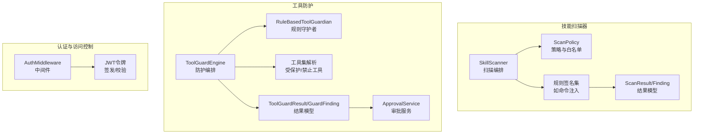
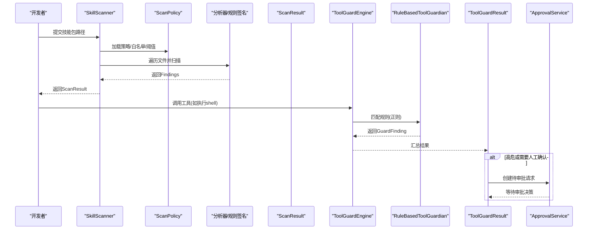
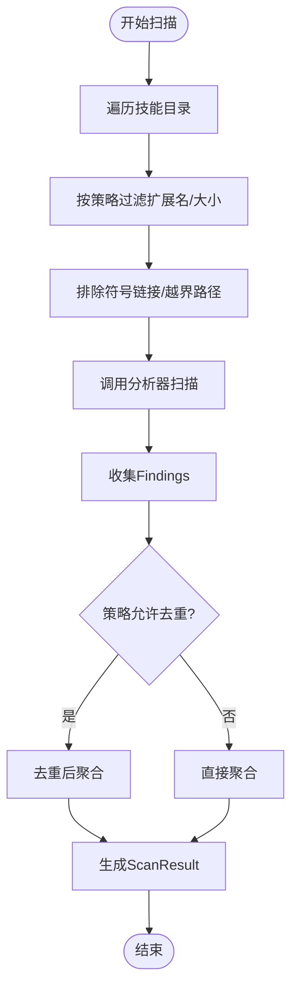
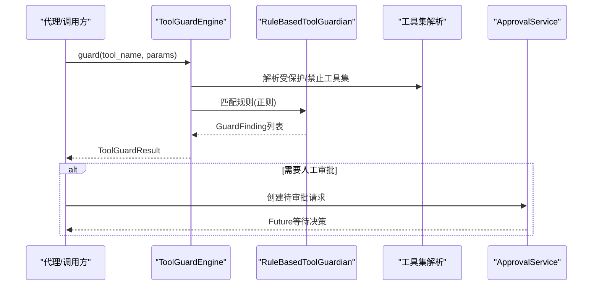
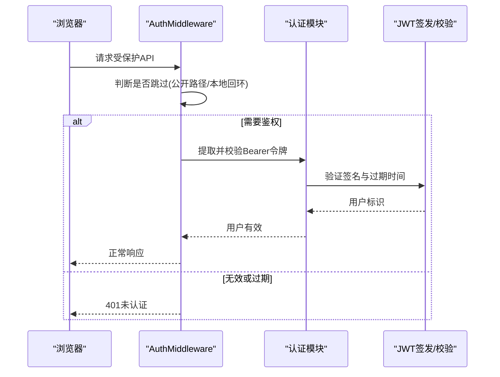
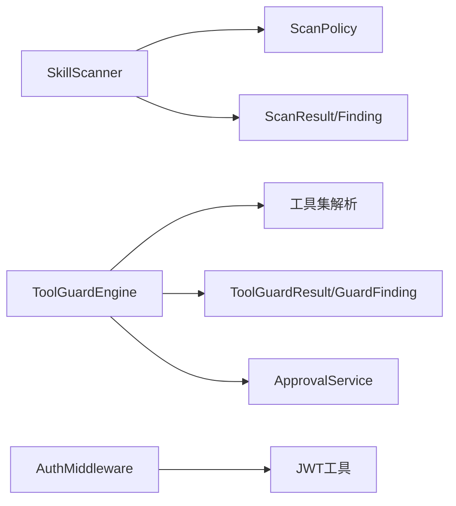

# 安全系统

<cite>
**本文引用的文件**
- [src/copaw/security/skill_scanner/scanner.py](file://src/copaw/security/skill_scanner/scanner.py)
- [src/copaw/security/skill_scanner/models.py](file://src/copaw/security/skill_scanner/models.py)
- [src/copaw/security/skill_scanner/scan_policy.py](file://src/copaw/security/skill_scanner/scan_policy.py)
- [src/copaw/security/skill_scanner/data/default_policy.yaml](file://src/copaw/security/skill_scanner/data/default_policy.yaml)
- [src/copaw/security/skill_scanner/rules/signatures/command_injection.yaml](file://src/copaw/security/skill_scanner/rules/signatures/command_injection.yaml)
- [src/copaw/security/tool_guard/engine.py](file://src/copaw/security/tool_guard/engine.py)
- [src/copaw/security/tool_guard/guardians/rule_guardian.py](file://src/copaw/security/tool_guard/guardians/rule_guardian.py)
- [src/copaw/security/tool_guard/models.py](file://src/copaw/security/tool_guard/models.py)
- [src/copaw/security/tool_guard/utils.py](file://src/copaw/security/tool_guard/utils.py)
- [src/copaw/security/tool_guard/approval.py](file://src/copaw/security/tool_guard/approval.py)
- [src/copaw/security/tool_guard/rules/dangerous_shell_commands.yaml](file://src/copaw/security/tool_guard/rules/dangerous_shell_commands.yaml)
- [src/copaw/app/auth.py](file://src/copaw/app/auth.py)
- [src/copaw/app/approvals/service.py](file://src/copaw/app/approvals/service.py)
- [src/copaw/config/config.py](file://src/copaw/config/config.py)
- [website/public/docs/security.en.md](file://website/public/docs/security.en.md)
- [console/src/pages/Settings/Security/index.tsx](file://console/src/pages/Settings/Security/index.tsx)
</cite>

## 目录
1. [简介](#简介)
2. [项目结构](#项目结构)
3. [核心组件](#核心组件)
4. [架构总览](#架构总览)
5. [详细组件分析](#详细组件分析)
6. [依赖分析](#依赖分析)
7. [性能考量](#性能考量)
8. [故障排查指南](#故障排查指南)
9. [结论](#结论)
10. [附录](#附录)

## 简介
本文件面向CoPaw的安全系统，围绕以下目标展开：技能扫描器的扫描规则与白名单机制、工具防护系统的危险命令检测与审批流程、认证与访问控制、权限管理、安全最佳实践、漏洞防护与合规性、安全配置指南、安全事件响应流程、数据与传输安全、以及审计与监控策略。文档以代码为依据，辅以可视化图示帮助理解。

## 项目结构
安全系统主要由三部分组成：
- 技能扫描器（Skill Scanner）：对技能包进行静态扫描，识别注入、硬编码密钥、供应链等威胁，并支持组织级策略与白名单。
- 工具防护系统（Tool Guard）：在工具调用前进行参数级安全检查，基于规则引擎匹配潜在危险命令，必要时触发审批流程。
- 认证与访问控制（Auth）：可选的Web登录认证，保护控制台免受未授权访问。

图表来源
- [src/copaw/security/skill_scanner/scanner.py:76-319](file://src/copaw/security/skill_scanner/scanner.py#L76-L319)
- [src/copaw/security/skill_scanner/scan_policy.py:156-476](file://src/copaw/security/skill_scanner/scan_policy.py#L156-L476)
- [src/copaw/security/tool_guard/engine.py:52-218](file://src/copaw/security/tool_guard/engine.py#L52-L218)
- [src/copaw/security/tool_guard/guardians/rule_guardian.py:280-383](file://src/copaw/security/tool_guard/guardians/rule_guardian.py#L280-L383)
- [src/copaw/app/auth.py:302-368](file://src/copaw/app/auth.py#L302-L368)

章节来源
- [src/copaw/security/skill_scanner/scanner.py:1-319](file://src/copaw/security/skill_scanner/scanner.py#L1-L319)
- [src/copaw/security/tool_guard/engine.py:1-218](file://src/copaw/security/tool_guard/engine.py#L1-L218)
- [src/copaw/app/auth.py:1-368](file://src/copaw/app/auth.py#L1-L368)

## 核心组件
- 技能扫描器：负责遍历技能目录、加载策略、运行分析器、去重与聚合结果。
- 扫描策略：组织级白名单、规则范围、凭证抑制、文件分类与阈值。
- 工具防护引擎：按需启用，选择受保护工具集，执行规则匹配，汇总结果并可触发审批。
- 规则守护者：从YAML加载正则规则，匹配参数字符串，生成告警。
- 审批服务：集中管理待审批请求，超时回收，参数一致性校验。
- 认证中间件：可选的Bearer令牌校验，保护API路由。

章节来源
- [src/copaw/security/skill_scanner/models.py:168-235](file://src/copaw/security/skill_scanner/models.py#L168-L235)
- [src/copaw/security/tool_guard/models.py:103-185](file://src/copaw/security/tool_guard/models.py#L103-L185)
- [src/copaw/app/approvals/service.py:58-282](file://src/copaw/app/approvals/service.py#L58-L282)

## 架构总览
下图展示从“技能扫描”到“工具防护”的端到端流程，以及与审批、认证的关系。

图表来源
- [src/copaw/security/skill_scanner/scanner.py:148-242](file://src/copaw/security/skill_scanner/scanner.py#L148-L242)
- [src/copaw/security/tool_guard/engine.py:161-206](file://src/copaw/security/tool_guard/engine.py#L161-L206)
- [src/copaw/app/approvals/service.py:80-136](file://src/copaw/app/approvals/service.py#L80-L136)

## 详细组件分析

### 技能扫描器：扫描规则与白名单机制
- 文件发现与过滤
  - 遍历技能根目录，跳过符号链接与越界文件，按扩展名与大小限制过滤，避免资源滥用。
- 分析器编排
  - 默认使用模式匹配分析器（PatternAnalyzer），可注册其他分析器；失败时记录并继续。
- 结果聚合与去重
  - 收集各分析器结果，按策略配置去重；最终输出ScanResult，包含最高严重级别与是否安全。
- 策略与白名单
  - 通过ScanPolicy加载默认策略或自定义策略，支持：
    - 隐藏文件/目录白名单（benign_dotfiles/benign_dotdirs）
    - 规则范围（仅代码文件、文档区跳过、特定规则仅对SKILL.md+脚本生效）
    - 凭证抑制（known_test_values、placeholder_markers）
    - 文件分类（inert/structured/archive/code_extensions）
    - 文件数量/大小/描述长度等阈值
    - 严重级别覆盖与禁用规则列表
- 规则签名
  - 内置命令注入等威胁签名，限定文件类型，提供修复建议。

图表来源
- [src/copaw/security/skill_scanner/scanner.py:248-299](file://src/copaw/security/skill_scanner/scanner.py#L248-L299)
- [src/copaw/security/skill_scanner/scan_policy.py:156-476](file://src/copaw/security/skill_scanner/scan_policy.py#L156-L476)

章节来源
- [src/copaw/security/skill_scanner/scanner.py:148-242](file://src/copaw/security/skill_scanner/scanner.py#L148-L242)
- [src/copaw/security/skill_scanner/scan_policy.py:156-476](file://src/copaw/security/skill_scanner/scan_policy.py#L156-L476)
- [src/copaw/security/skill_scanner/data/default_policy.yaml:1-245](file://src/copaw/security/skill_scanner/data/default_policy.yaml#L1-L245)
- [src/copaw/security/skill_scanner/rules/signatures/command_injection.yaml:1-195](file://src/copaw/security/skill_scanner/rules/signatures/command_injection.yaml#L1-L195)

### 工具防护系统：危险命令检测、规则引擎与审批流程
- 启用与作用域
  - 受环境变量/COPAW_TOOL_GUARD_ENABLED控制，默认启用；可通过配置决定受保护工具集（guarded_tools）与禁止工具集（denied_tools）。
- 规则引擎
  - RuleBasedToolGuardian从YAML加载规则，逐条匹配参数字符串（忽略排除模式），生成GuardFinding。
  - 内置规则覆盖破坏性命令、网络加载、提权、混淆等高危模式。
- 防护编排
  - ToolGuardEngine按顺序调用各守护者，聚合结果；当结果不安全或需确认时，进入审批流程。
- 审批服务
  - ApprovalService集中管理待审批请求，支持按会话查询、参数一致性校验、超时回收与历史清理。
- 日志与可观测性
  - 对高危告警进行结构化日志输出，便于审计与监控。

图表来源
- [src/copaw/security/tool_guard/engine.py:161-206](file://src/copaw/security/tool_guard/engine.py#L161-L206)
- [src/copaw/security/tool_guard/guardians/rule_guardian.py:329-382](file://src/copaw/security/tool_guard/guardians/rule_guardian.py#L329-L382)
- [src/copaw/security/tool_guard/utils.py:56-118](file://src/copaw/security/tool_guard/utils.py#L56-L118)
- [src/copaw/app/approvals/service.py:80-136](file://src/copaw/app/approvals/service.py#L80-L136)

章节来源
- [src/copaw/security/tool_guard/engine.py:52-218](file://src/copaw/security/tool_guard/engine.py#L52-L218)
- [src/copaw/security/tool_guard/guardians/rule_guardian.py:280-383](file://src/copaw/security/tool_guard/guardians/rule_guardian.py#L280-L383)
- [src/copaw/security/tool_guard/utils.py:1-156](file://src/copaw/security/tool_guard/utils.py#L1-L156)
- [src/copaw/app/approvals/service.py:58-282](file://src/copaw/app/approvals/service.py#L58-L282)
- [src/copaw/security/tool_guard/rules/dangerous_shell_commands.yaml:1-120](file://src/copaw/security/tool_guard/rules/dangerous_shell_commands.yaml#L1-L120)

### 认证机制、访问控制与权限管理
- 可选Web认证
  - 通过环境变量开启；首次启动显示注册页，后续显示登录页；单用户模型，本地存储凭据与JWT密钥。
- 中间件保护
  - 对受保护API路径进行Bearer令牌校验；静态资源与版本接口默认放行；本地回环地址豁免。
- 权限与会话
  - 登录成功返回7天有效期的HMAC-SHA256签名令牌；前端自动携带令牌访问受保护接口。

图表来源
- [src/copaw/app/auth.py:302-368](file://src/copaw/app/auth.py#L302-L368)

章节来源
- [src/copaw/app/auth.py:1-368](file://src/copaw/app/auth.py#L1-L368)
- [website/public/docs/security.en.md:118-137](file://website/public/docs/security.en.md#L118-L137)

### 数据模型与结果表示
- 技能扫描结果模型
  - ScanResult封装技能名称、目录、Findings、耗时、分析器使用情况与时间戳；提供最高严重级别与是否安全判断。
- 工具防护结果模型
  - ToolGuardResult封装工具名、参数、GuardFinding、耗时、守护者使用情况与时间戳；提供最高严重级别与是否安全判断。

章节来源
- [src/copaw/security/skill_scanner/models.py:168-235](file://src/copaw/security/skill_scanner/models.py#L168-L235)
- [src/copaw/security/tool_guard/models.py:103-185](file://src/copaw/security/tool_guard/models.py#L103-L185)

## 依赖分析
- 组件内聚与耦合
  - 技能扫描器与工具防护系统各自独立，通过策略与配置解耦；工具防护内部通过守护者模式扩展规则。
- 外部依赖
  - 认证模块依赖标准库实现密码哈希与JWT签名；工具防护依赖配置系统与审批服务。
- 循环依赖
  - 当前设计未见循环导入；审批服务与工具防护结果模型存在单向依赖。

图表来源
- [src/copaw/security/skill_scanner/scanner.py:100-134](file://src/copaw/security/skill_scanner/scanner.py#L100-L134)
- [src/copaw/security/tool_guard/engine.py:64-77](file://src/copaw/security/tool_guard/engine.py#L64-L77)
- [src/copaw/app/auth.py:302-368](file://src/copaw/app/auth.py#L302-L368)

章节来源
- [src/copaw/security/skill_scanner/scanner.py:100-134](file://src/copaw/security/skill_scanner/scanner.py#L100-L134)
- [src/copaw/security/tool_guard/engine.py:64-77](file://src/copaw/security/tool_guard/engine.py#L64-L77)
- [src/copaw/app/auth.py:302-368](file://src/copaw/app/auth.py#L302-L368)

## 性能考量
- 扫描限制
  - 文件数量上限与单文件大小上限可由策略或构造参数设定，防止资源滥用。
- 规则匹配
  - 正则规则预编译，排除无效模式；匹配时仅对字符串化参数进行扫描，降低开销。
- 异步审批
  - 审批采用Future异步等待，避免阻塞主流程；定期GC清理过期记录，控制内存占用。

章节来源
- [src/copaw/security/skill_scanner/scan_policy.py:221-227](file://src/copaw/security/skill_scanner/scan_policy.py#L221-L227)
- [src/copaw/security/tool_guard/guardians/rule_guardian.py:96-115](file://src/copaw/security/tool_guard/guardians/rule_guardian.py#L96-L115)
- [src/copaw/app/approvals/service.py:209-267](file://src/copaw/app/approvals/service.py#L209-L267)

## 故障排查指南
- 技能扫描
  - 若扫描结果为空或异常，检查策略中的文件分类与阈值设置；确认未被错误地跳过扩展名；查看日志中关于“无法遍历/越界/过大文件”的警告。
- 工具防护
  - 若误报/漏报，调整规则或排除模式；确认受保护工具集配置；检查审批服务是否正确创建/消费请求。
- 认证
  - 若401错误，确认令牌格式与有效期；检查是否命中本地回环豁免；核对公开路径与静态资源前缀配置。

章节来源
- [src/copaw/security/skill_scanner/scanner.py:252-277](file://src/copaw/security/skill_scanner/scanner.py#L252-L277)
- [src/copaw/security/tool_guard/guardians/rule_guardian.py:153-185](file://src/copaw/security/tool_guard/guardians/rule_guardian.py#L153-L185)
- [src/copaw/app/auth.py:335-367](file://src/copaw/app/auth.py#L335-L367)

## 结论
CoPaw的安全系统通过“技能静态扫描+工具动态防护+可选认证”的组合，提供了从供应链到运行时的多层防护。策略与规则可定制，审批流程可接入业务流程，满足不同组织的安全基线与合规要求。

## 附录

### 安全最佳实践
- 使用组织策略覆盖默认规则，启用凭证抑制与文档区跳过，减少误报。
- 将高风险工具纳入受保护集合，对破坏性命令与网络加载实施严格拦截。
- 启用审批流程，确保高危操作必须经人工确认；对已批准的调用参数进行一致性校验。
- 开启可选认证，保护控制台与API；对敏感文件与目录设置最小权限。

### 漏洞防护与合规性
- 命令注入、硬编码密钥、供应链攻击、路径穿越等威胁通过规则签名与策略抑制得到缓解。
- 审计与日志：结构化日志输出高危告警摘要，便于合规审计与事件追踪。

### 安全配置指南
- 技能扫描
  - 在配置文件中设置扫描模式、超时与白名单；通过策略文件覆盖默认行为。
- 工具防护
  - 设置受保护工具集与禁止工具集；根据环境变量或配置文件动态调整。
- 认证
  - 通过环境变量启用认证；支持自动注册管理员账户；令牌有效期可按需调整。

章节来源
- [src/copaw/security/skill_scanner/data/default_policy.yaml:1-245](file://src/copaw/security/skill_scanner/data/default_policy.yaml#L1-L245)
- [src/copaw/security/tool_guard/utils.py:56-118](file://src/copaw/security/tool_guard/utils.py#L56-L118)
- [website/public/docs/security.en.md:100-137](file://website/public/docs/security.en.md#L100-L137)
- [console/src/pages/Settings/Security/index.tsx:218-270](file://console/src/pages/Settings/Security/index.tsx#L218-L270)

### 安全事件响应流程
- 发现高危告警后，立即隔离受影响的技能包或工具调用。
- 审批流程中拒绝高危请求；对已批准的调用进行参数回溯与影响评估。
- 回归测试：更新规则与策略，验证修复效果；持续监控日志与告警趋势。

章节来源
- [src/copaw/app/approvals/service.py:116-136](file://src/copaw/app/approvals/service.py#L116-L136)
- [src/copaw/security/tool_guard/utils.py:121-156](file://src/copaw/security/tool_guard/utils.py#L121-L156)

### 数据加密、传输安全与存储安全
- 传输安全：建议在生产环境中启用HTTPS与TLS；对WebSocket连接进行必要的安全加固。
- 存储安全：认证凭据与JWT密钥保存在受限目录，文件权限严格控制；密码采用盐值哈希存储。
- 数据最小化：扫描与防护仅处理必要参数与内容；清理过期审批记录，避免长期留存敏感信息。

章节来源
- [src/copaw/app/auth.py:166-188](file://src/copaw/app/auth.py#L166-L188)
- [src/copaw/app/auth.py:310-333](file://src/copaw/app/auth.py#L310-L333)

### 安全审计、日志记录与监控策略
- 结构化日志：工具防护对高危告警输出统一格式，包含严重级别、规则ID、匹配值等字段。
- 监控指标：记录扫描耗时、防护耗时、告警数量与最高严重级别；结合审批超时率评估系统负载。
- 审计留痕：保留ScanResult与ToolGuardResult的关键元数据，支持合规审计与溯源。

章节来源
- [src/copaw/security/tool_guard/utils.py:121-156](file://src/copaw/security/tool_guard/utils.py#L121-L156)
- [src/copaw/security/skill_scanner/models.py:178-180](file://src/copaw/security/skill_scanner/models.py#L178-L180)
- [src/copaw/security/tool_guard/models.py:113-115](file://src/copaw/security/tool_guard/models.py#L113-L115)