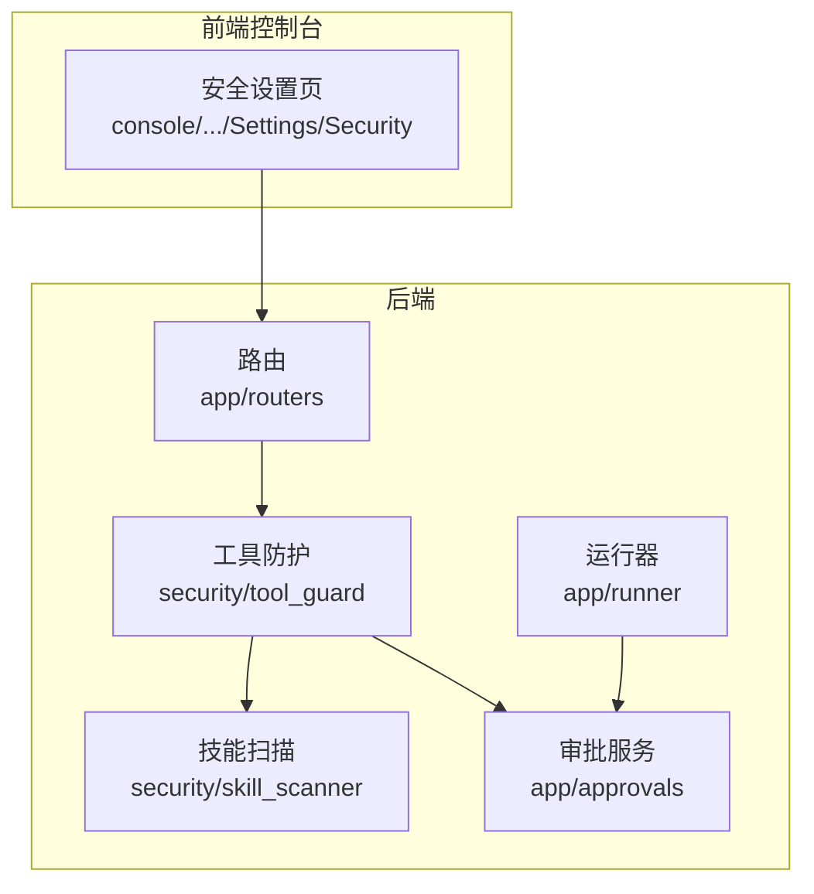
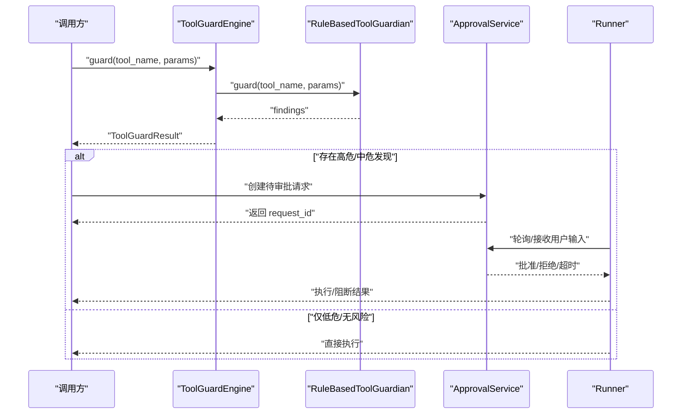
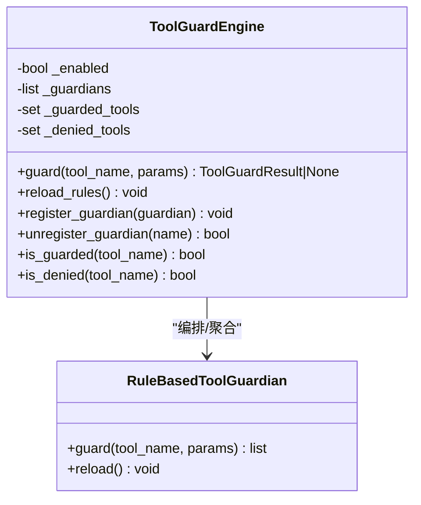
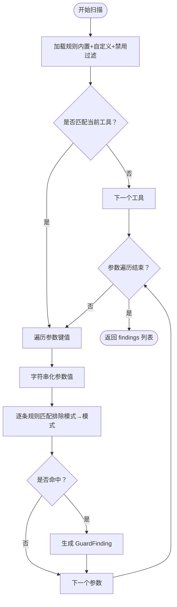
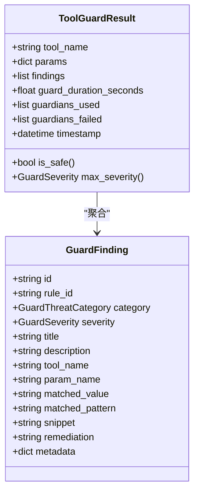
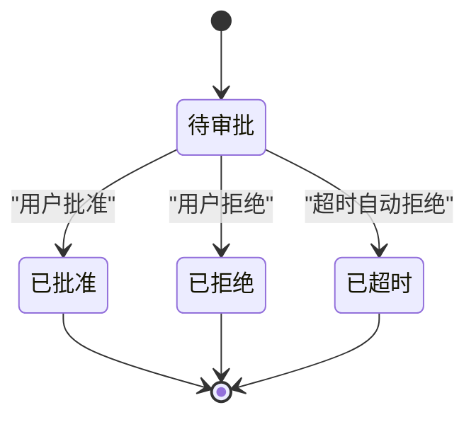
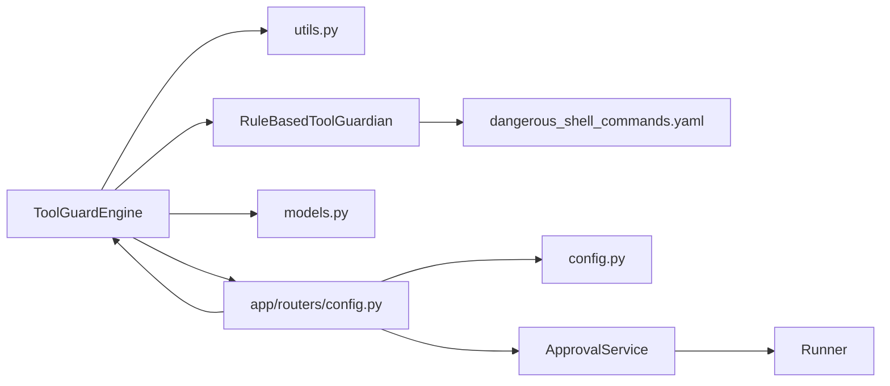

# 工具防护系统

<cite>
**本文引用的文件**
- [engine.py](file://src/copaw/security/tool_guard/engine.py)
- [rule_guardian.py](file://src/copaw/security/tool_guard/guardians/rule_guardian.py)
- [models.py](file://src/copaw/security/tool_guard/models.py)
- [utils.py](file://src/copaw/security/tool_guard/utils.py)
- [dangerous_shell_commands.yaml](file://src/copaw/security/tool_guard/rules/dangerous_shell_commands.yaml)
- [approval.py](file://src/copaw/security/tool_guard/approval.py)
- [config.py](file://src/copaw/config/config.py)
- [config.py（路由）](file://src/copaw/app/routers/config.py)
- [service.py](file://src/copaw/app/approvals/service.py)
- [runner.py](file://src/copaw/app/runner/runner.py)
- [scanner.py](file://src/copaw/security/skill_scanner/scanner.py)
- [scan_policy.py](file://src/copaw/security/skill_scanner/scan_policy.py)
- [default_policy.yaml](file://src/copaw/security/skill_scanner/data/default_policy.yaml)
- [command_injection.yaml](file://src/copaw/security/skill_scanner/rules/signatures/command_injection.yaml)
- [index.tsx（安全设置页）](file://console/src/pages/Settings/Security/index.tsx)
- [useToolGuard.ts](file://console/src/pages/Settings/Security/useToolGuard.ts)
</cite>

## 目录
1. [简介](#简介)
2. [项目结构](#项目结构)
3. [核心组件](#核心组件)
4. [架构总览](#架构总览)
5. [组件详解](#组件详解)
6. [依赖关系分析](#依赖关系分析)
7. [性能与可扩展性](#性能与可扩展性)
8. [故障排查指南](#故障排查指南)
9. [结论](#结论)
10. [附录：配置与使用指南](#附录配置与使用指南)

## 简介
本文件面向“工具防护系统”，聚焦于工具调用前的安全防护机制，包括：
- 规则守护者（Rule-Based Tool Guardian）对工具参数进行快速正则匹配扫描
- 工具调用前的审批流程与自动阻断
- 危险命令规则库的加载、优先级与禁用策略
- 审计日志、异常行为检测与自动阻断
- 配置指南、调试方法与性能监控
- 白名单机制、临时放行与紧急审批流程

## 项目结构
工具防护系统位于后端 Python 包中，前端控制台提供可视化配置入口。核心模块分布如下：
- 后端安全子系统
  - 工具防护：security/tool_guard（引擎、守护者、模型、工具函数、规则）
  - 技能扫描：security/skill_scanner（扫描器、策略、默认策略、规则签名）
- 后端应用层
  - 路由：app/routers（提供安全配置读写接口）
  - 审批服务：app/approvals（审批状态机与超时回收）
  - 运行器：app/runner（会话中触发审批、超时处理）
- 前端控制台
  - 安全设置页面：console/src/pages/Settings/Security（配置开关、工具范围、规则管理）

**图表来源**
- [engine.py:52-218](file://src/copaw/security/tool_guard/engine.py#L52-L218)
- [scanner.py:76-319](file://src/copaw/security/skill_scanner/scanner.py#L76-L319)
- [config.py（路由）:385-418](file://src/copaw/app/routers/config.py#L385-L418)
- [service.py:86-281](file://src/copaw/app/approvals/service.py#L86-L281)
- [runner.py:118-157](file://src/copaw/app/runner/runner.py#L118-L157)

**章节来源**
- [engine.py:1-218](file://src/copaw/security/tool_guard/engine.py#L1-L218)
- [scanner.py:1-319](file://src/copaw/security/skill_scanner/scanner.py#L1-L319)
- [config.py（路由）:385-418](file://src/copaw/app/routers/config.py#L385-L418)

## 核心组件
- 工具守卫引擎（ToolGuardEngine）
  - 统一编排所有注册的守护者，聚合结果生成 ToolGuardResult
  - 支持按环境变量、配置文件动态启用/禁用
  - 支持按工具名与规则集的“受保护工具”和“直接拒绝工具”集合
- 规则守护者（RuleBasedToolGuardian）
  - 基于 YAML 规则的正则签名匹配，扫描工具参数字符串化后的值
  - 支持内置规则目录与自定义规则合并、禁用规则过滤
- 数据模型（ToolGuardResult/GuardFinding）
  - 结构化表示发现、严重级别、威胁类别、修复建议等
- 工具函数（utils）
  - 解析受保护工具集合、直接拒绝工具集合
  - 结构化日志输出
- 审批与阻断（ApprovalService + Runner）
  - 在高危或中危发现时触发审批；超时自动阻断
- 技能扫描（SkillScanner + ScanPolicy）
  - 对技能包进行静态扫描，支持组织级策略覆盖与规则优先级

**章节来源**
- [engine.py:52-218](file://src/copaw/security/tool_guard/engine.py#L52-L218)
- [rule_guardian.py:280-383](file://src/copaw/security/tool_guard/guardians/rule_guardian.py#L280-L383)
- [models.py:60-185](file://src/copaw/security/tool_guard/models.py#L60-L185)
- [utils.py:56-156](file://src/copaw/security/tool_guard/utils.py#L56-L156)
- [service.py:86-281](file://src/copaw/app/approvals/service.py#L86-L281)
- [runner.py:118-157](file://src/copaw/app/runner/runner.py#L118-L157)
- [scanner.py:76-319](file://src/copaw/security/skill_scanner/scanner.py#L76-L319)
- [scan_policy.py:156-476](file://src/copaw/security/skill_scanner/scan_policy.py#L156-L476)

## 架构总览
工具调用防护的关键流程：
- 调用前拦截：引擎根据“受保护工具”集合与守护者规则扫描参数
- 发现风险：生成 GuardFinding，汇总到 ToolGuardResult
- 决策分支：
  - SAFE/HIGH/MEDIUM：进入审批流程（如需要）
  - CRITICAL：直接阻断
- 审批与阻断：审批服务维护待处理与完成队列，超时自动拒绝
- 日志审计：结构化日志输出，便于追踪

**图表来源**
- [engine.py:161-206](file://src/copaw/security/tool_guard/engine.py#L161-L206)
- [rule_guardian.py:329-383](file://src/copaw/security/tool_guard/guardians/rule_guardian.py#L329-L383)
- [service.py:86-157](file://src/copaw/app/approvals/service.py#L86-L157)
- [runner.py:118-157](file://src/copaw/app/runner/runner.py#L118-L157)

## 组件详解

### 工具守卫引擎（ToolGuardEngine）
- 功能要点
  - 懒加载单例，按需初始化默认守护者（规则守护者）
  - 支持通过构造参数注入自定义守护者
  - 动态启用/禁用：环境变量 > 配置文件 > 默认开启
  - 受保护工具集合与直接拒绝工具集合解析
  - 结果聚合：findings、耗时、失败守护者列表
- 关键接口
  - guard(tool_name, params)：返回 ToolGuardResult 或 None（禁用时）
  - reload_rules()：重载规则并刷新工具集合
  - is_guarded/is_denied：判断工具是否在保护范围内或直接拒绝

**图表来源**
- [engine.py:52-218](file://src/copaw/security/tool_guard/engine.py#L52-L218)
- [rule_guardian.py:280-383](file://src/copaw/security/tool_guard/guardians/rule_guardian.py#L280-L383)

**章节来源**
- [engine.py:52-218](file://src/copaw/security/tool_guard/engine.py#L52-L218)

### 规则守护者（RuleBasedToolGuardian）
- 规则来源
  - 内置规则目录：rules/*.yaml（默认加载危险命令规则）
  - 自定义规则：config.json 中 security.tool_guard.custom_rules
  - 禁用规则：config.json 中 security.tool_guard.disabled_rules
- 扫描逻辑
  - 将每个参数值转换为字符串进行扫描
  - 先排除匹配“排除模式”的内容，再匹配“模式”
  - 生成 GuardFinding，包含严重级别、威胁类别、修复建议等
- 性能特性
  - 预编译正则表达式，避免重复编译开销
  - 仅在适用工具/参数上匹配，减少无效扫描

**图表来源**
- [rule_guardian.py:153-231](file://src/copaw/security/tool_guard/guardians/rule_guardian.py#L153-L231)
- [rule_guardian.py:329-383](file://src/copaw/security/tool_guard/guardians/rule_guardian.py#L329-L383)

**章节来源**
- [rule_guardian.py:280-383](file://src/copaw/security/tool_guard/guardians/rule_guardian.py#L280-L383)
- [dangerous_shell_commands.yaml:1-120](file://src/copaw/security/tool_guard/rules/dangerous_shell_commands.yaml#L1-L120)

### 数据模型与审计
- GuardFinding：单条发现，包含规则ID、工具名、参数名、匹配值、上下文片段、修复建议等
- ToolGuardResult：一次工具调用的聚合结果，包含最高严重级别、发现数量、耗时、失败守护者等
- 审计日志：log_findings 输出结构化日志，区分高危/非高危级别

**图表来源**
- [models.py:60-185](file://src/copaw/security/tool_guard/models.py#L60-L185)

**章节来源**
- [models.py:60-185](file://src/copaw/security/tool_guard/models.py#L60-L185)
- [utils.py:121-156](file://src/copaw/security/tool_guard/utils.py#L121-L156)

### 审批流程与自动阻断
- 审批服务（ApprovalService）
  - 创建待审批请求 PendingApproval，携带摘要与发现数
  - 支持批准/拒绝/超时三种决议
  - 垃圾回收：超期未处理的待审批请求自动超时；已完成记录按容量限制清理
- 运行器（Runner）
  - 在会话中等待审批，超时自动拒绝并提示
  - 支持用户输入“同意/批准”触发批准
- 阻断策略
  - 当 ToolGuardResult 的最高严重级别为 CRITICAL 时，直接阻断执行
  - 对于 HIGH/MEDIUM，进入审批流程；审批通过后执行

**图表来源**
- [service.py:86-281](file://src/copaw/app/approvals/service.py#L86-L281)
- [runner.py:118-157](file://src/copaw/app/runner/runner.py#L118-L157)

**章节来源**
- [service.py:86-281](file://src/copaw/app/approvals/service.py#L86-L281)
- [runner.py:118-157](file://src/copaw/app/runner/runner.py#L118-L157)

### 危险命令规则库与优先级
- 内置规则
  - 危险命令：删除、移动、格式化、fork bomb、管道到 shell、反向 shell、权限变更、混淆执行等
  - 严重级别：CRITICAL（高危）、HIGH（中危）、MEDIUM（宽泛捕获）
- 自定义规则
  - 通过 config.json 的 security.tool_guard.custom_rules 注入
  - 通过 security.tool_guard.disabled_rules 禁用特定规则
- 优先级与合并
  - 内置规则 + 额外规则 + 自定义规则合并
  - 禁用规则集合过滤，最终生效规则集

**章节来源**
- [dangerous_shell_commands.yaml:1-120](file://src/copaw/security/tool_guard/rules/dangerous_shell_commands.yaml#L1-L120)
- [rule_guardian.py:239-273](file://src/copaw/security/tool_guard/guardians/rule_guardian.py#L239-L273)

### 技能扫描（对比参考）
- 技能扫描器（SkillScanner）用于静态扫描技能包，支持组织级策略（ScanPolicy）
- 与工具防护的区别：前者面向代码与资源的静态分析，后者面向运行时工具调用的参数检查
- 策略覆盖：隐藏文件、规则作用域、凭证占位符、文件分类、阈值、严重级别覆盖、禁用规则等

**章节来源**
- [scanner.py:76-319](file://src/copaw/security/skill_scanner/scanner.py#L76-L319)
- [scan_policy.py:156-476](file://src/copaw/security/skill_scanner/scan_policy.py#L156-L476)
- [default_policy.yaml:1-245](file://src/copaw/security/skill_scanner/data/default_policy.yaml#L1-L245)
- [command_injection.yaml:1-195](file://src/copaw/security/skill_scanner/rules/signatures/command_injection.yaml#L1-L195)

## 依赖关系分析
- 引擎依赖守护者接口与工具函数
- 守护者依赖规则文件与配置解析
- 审批服务与运行器耦合，共同决定执行/阻断
- 前端控制台通过路由接口读取/更新安全配置

**图表来源**
- [engine.py:52-218](file://src/copaw/security/tool_guard/engine.py#L52-L218)
- [utils.py:56-156](file://src/copaw/security/tool_guard/utils.py#L56-L156)
- [rule_guardian.py:280-383](file://src/copaw/security/tool_guard/guardians/rule_guardian.py#L280-L383)
- [dangerous_shell_commands.yaml:1-120](file://src/copaw/security/tool_guard/rules/dangerous_shell_commands.yaml#L1-L120)
- [models.py:60-185](file://src/copaw/security/tool_guard/models.py#L60-L185)
- [config.py（路由）:385-418](file://src/copaw/app/routers/config.py#L385-L418)
- [config.py:800-804](file://src/copaw/config/config.py#L800-L804)

**章节来源**
- [engine.py:52-218](file://src/copaw/security/tool_guard/engine.py#L52-L218)
- [config.py（路由）:385-418](file://src/copaw/app/routers/config.py#L385-L418)

## 性能与可扩展性
- 正则预编译：规则守护者在加载时预编译正则，降低运行时匹配成本
- 规则过滤：仅对匹配工具/参数的规则进行扫描，减少无效匹配
- 异常容错：守护者执行失败会被记录但不影响整体流程
- 可扩展点：可通过注册新的守护者扩展其他检测能力（如 LLM 分析器）

[本节为通用指导，无需列出具体文件来源]

## 故障排查指南
- 工具调用被阻断
  - 检查 ToolGuardResult 的最高严重级别与发现详情
  - 查看结构化日志定位规则ID与匹配值
- 审批未生效或超时
  - 确认审批服务状态与超时阈值
  - 检查会话中的用户输入是否符合“批准”识别
- 规则未生效
  - 确认是否被 disabled_rules 禁用
  - 检查 guarded_tools 是否包含该工具
  - 确认规则文件路径与语法正确
- 前端配置不生效
  - 通过路由接口确认配置已保存并触发 reload_rules

**章节来源**
- [utils.py:121-156](file://src/copaw/security/tool_guard/utils.py#L121-L156)
- [service.py:209-267](file://src/copaw/app/approvals/service.py#L209-L267)
- [runner.py:118-157](file://src/copaw/app/runner/runner.py#L118-L157)
- [config.py（路由）:395-413](file://src/copaw/app/routers/config.py#L395-L413)

## 结论
工具防护系统以“规则守护者 + 审批服务 + 自动阻断”为核心，结合结构化日志与可配置规则，实现了对高危工具调用的前置拦截与可控执行。通过受保护工具集合、直接拒绝工具集合与规则禁用机制，兼顾了灵活性与安全性。

[本节为总结性内容，无需列出具体文件来源]

## 附录：配置与使用指南

### 工具防护配置项
- 开关控制
  - 环境变量：COPAW_TOOL_GUARD_ENABLED
  - 配置文件：security.tool_guard.enabled
- 受保护工具集合
  - 环境变量：COPAW_TOOL_GUARD_TOOLS（支持通配符/空值）
  - 配置文件：security.tool_guard.guarded_tools
  - 默认：仅 execute_shell_command
- 直接拒绝工具集合
  - 环境变量：COPAW_TOOL_GUARD_DENIED_TOOLS
  - 配置文件：security.tool_guard.denied_tools
- 自定义规则与禁用
  - 自定义规则：security.tool_guard.custom_rules
  - 禁用规则：security.tool_guard.disabled_rules

**章节来源**
- [engine.py:34-49](file://src/copaw/security/tool_guard/engine.py#L34-L49)
- [utils.py:56-119](file://src/copaw/security/tool_guard/utils.py#L56-L119)
- [config.py:800-804](file://src/copaw/config/config.py#L800-L804)
- [config.py（路由）:395-413](file://src/copaw/app/routers/config.py#L395-L413)

### 前端配置入口
- 控制台安全设置页提供：
  - 启用/禁用工具防护
  - 设置受保护工具集合
  - 设置直接拒绝工具集合
  - 查看/编辑内置规则与自定义规则
  - 查看禁用规则集合

**章节来源**
- [index.tsx（安全设置页）:238-270](file://console/src/pages/Settings/Security/index.tsx#L238-L270)
- [useToolGuard.ts:1-39](file://console/src/pages/Settings/Security/useToolGuard.ts#L1-L39)

### 审批流程触发与处理
- 触发条件
  - ToolGuardResult 中存在 HIGH/MEDIUM 发现（CRITICAL 直接阻断）
- 处理机制
  - 创建 PendingApproval，等待用户批准/拒绝/超时
  - 超时自动拒绝并提示
  - 审批通过后执行工具调用

**章节来源**
- [service.py:86-157](file://src/copaw/app/approvals/service.py#L86-L157)
- [runner.py:118-157](file://src/copaw/app/runner/runner.py#L118-L157)

### 白名单机制、临时放行与紧急审批
- 白名单机制
  - 通过受保护工具集合与直接拒绝工具集合实现“白/黑名单”效果
- 临时放行
  - 在受保护工具集合中显式包含目标工具，确保其进入防护流程
- 紧急审批
  - 高危场景下通过审批服务快速决策；超时自动阻断保障安全

**章节来源**
- [utils.py:56-119](file://src/copaw/security/tool_guard/utils.py#L56-L119)
- [service.py:209-267](file://src/copaw/app/approvals/service.py#L209-L267)

### 规则优先级与管理
- 内置规则优先级：CRITICAL > HIGH > MEDIUM
- 自定义规则可覆盖内置规则语义，但需遵循相同字段结构
- 禁用规则：通过 disabled_rules 快速屏蔽特定规则

**章节来源**
- [dangerous_shell_commands.yaml:7-10](file://src/copaw/security/tool_guard/rules/dangerous_shell_commands.yaml#L7-L10)
- [rule_guardian.py:239-273](file://src/copaw/security/tool_guard/guardians/rule_guardian.py#L239-L273)

### 审计日志与异常行为检测
- 结构化日志
  - 输出严重级别、工具名、参数名、规则ID、描述、匹配值
  - 汇总日志：最大严重级别、发现数量、耗时
- 异常行为检测
  - 通过规则签名与严重级别阈值自动识别高危/中危行为
  - 审批服务记录请求生命周期，便于回溯

**章节来源**
- [utils.py:121-156](file://src/copaw/security/tool_guard/utils.py#L121-L156)
- [models.py:121-176](file://src/copaw/security/tool_guard/models.py#L121-L176)

### 调试方法与性能监控
- 调试方法
  - 查看结构化日志定位规则与匹配值
  - 通过路由接口更新配置并触发 reload_rules
  - 使用前端安全设置页验证配置生效
- 性能监控
  - 关注 ToolGuardResult.guard_duration_seconds
  - 规则加载与匹配次数、守护者失败统计

**章节来源**
- [config.py（路由）:407-413](file://src/copaw/app/routers/config.py#L407-L413)
- [models.py:103-176](file://src/copaw/security/tool_guard/models.py#L103-L176)