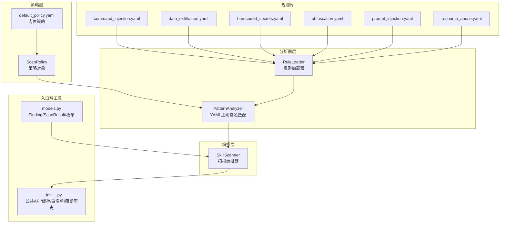
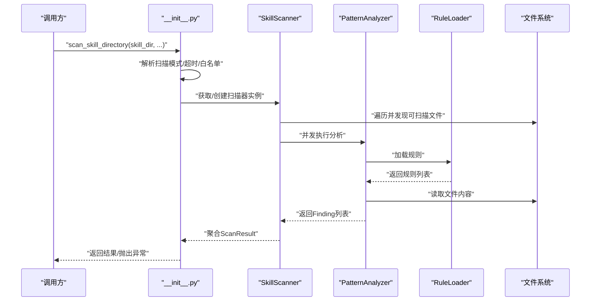
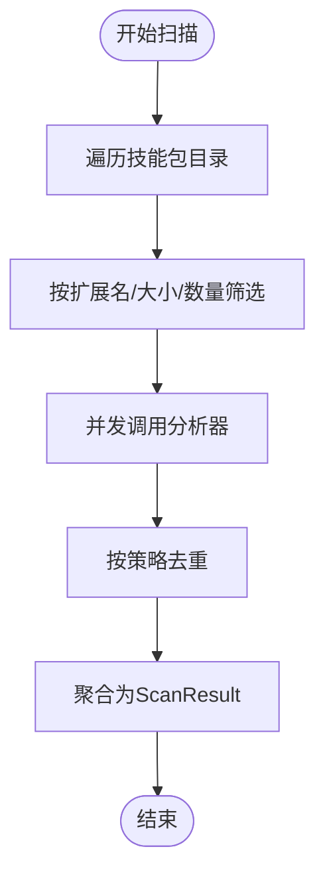
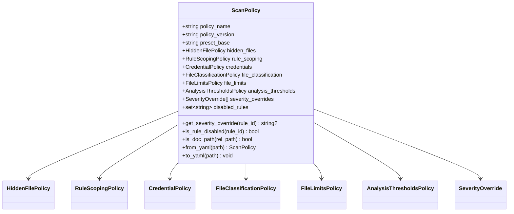
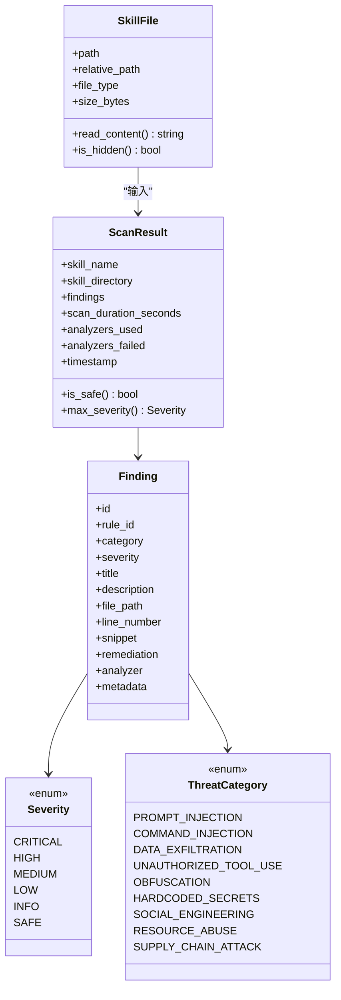
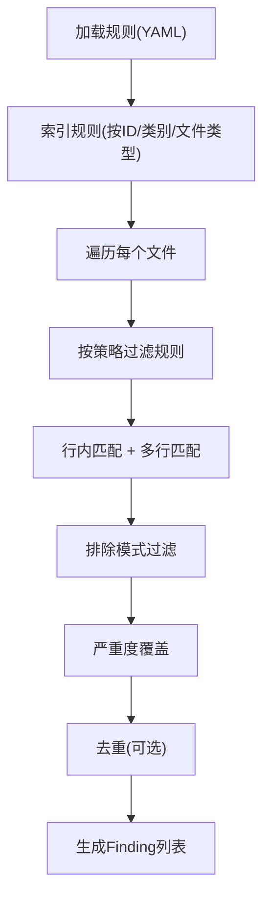
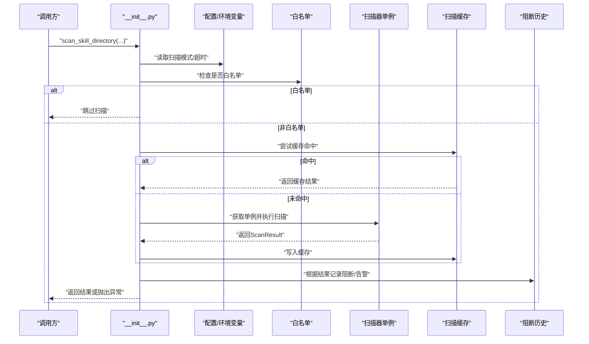
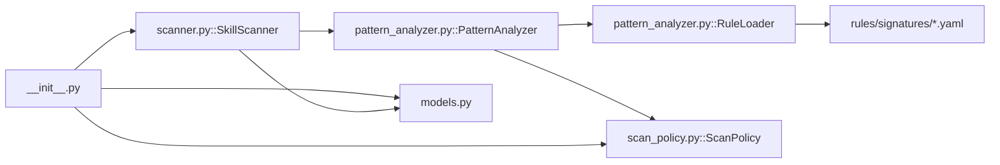

# 技能扫描器

<cite>
**本文引用的文件**
- [src\copaw\security\skill_scanner\__init__.py](file://src\copaw\security\skill_scanner\__init__.py)
- [src\copaw\security\skill_scanner\scanner.py](file://src\copaw\security\skill_scanner\scanner.py)
- [src\copaw\security\skill_scanner\scan_policy.py](file://src\copaw\security\skill_scanner\scan_policy.py)
- [src\copaw\security\skill_scanner\models.py](file://src\copaw\security\skill_scanner\models.py)
- [src\copaw\security\skill_scanner\data\default_policy.yaml](file://src\copaw\security\skill_scanner\data\default_policy.yaml)
- [src\copaw\security\skill_scanner\analyzers\pattern_analyzer.py](file://src\copaw\security\skill_scanner\analyzers\pattern_analyzer.py)
- [src\copaw\security\skill_scanner\rules\signatures\command_injection.yaml](file://src\copaw\security\skill_scanner\rules\signatures\command_injection.yaml)
- [src\copaw\security\skill_scanner\rules\signatures\data_exfiltration.yaml](file://src\copaw\security\skill_scanner\rules\signatures\data_exfiltration.yaml)
- [src\copaw\security\skill_scanner\rules\signatures\hardcoded_secrets.yaml](file://src\copaw\security\skill_scanner\rules\signatures\hardcoded_secrets.yaml)
- [src\copaw\security\skill_scanner\rules\signatures\obfuscation.yaml](file://src\copaw\security\skill_scanner\rules\signatures\obfuscation.yaml)
- [src\copaw\security\skill_scanner\rules\signatures\prompt_injection.yaml](file://src\copaw\security\skill_scanner\rules\signatures\prompt_injection.yaml)
- [src\copaw\security\skill_scanner\rules\signatures\resource_abuse.yaml](file://src\copaw\security\skill_scanner\rules\signatures\resource_abuse.yaml)
- [src\copaw\security\tool_guard\engine.py](file://src\copaw\security\tool_guard\engine.py)
- [console\src\pages\Settings\Security\useSkillScanner.ts](file://console\src\pages\Settings\Security\useSkillScanner.ts)
</cite>

## 目录
1. [简介](#简介)
2. [项目结构](#项目结构)
3. [核心组件](#核心组件)
4. [架构总览](#架构总览)
5. [详细组件分析](#详细组件分析)
6. [依赖关系分析](#依赖关系分析)
7. [性能考量](#性能考量)
8. [故障排查指南](#故障排查指南)
9. [结论](#结论)
10. [附录](#附录)

## 简介
本文件面向CoPaw技能扫描器（Skill Security Scanner），系统性阐述其工作原理、扫描规则定义机制与安全威胁检测算法，覆盖默认策略配置、签名规则库与自定义规则开发，扫描策略配置方法、扫描结果解读与风险评估标准，并提供性能优化建议、误报处理策略、扫描结果导出能力、部署配置、日志记录与监控策略。

## 项目结构
技能扫描器位于安全子模块中，采用“策略驱动 + 分析器插件化”的轻量设计：策略（ScanPolicy）统一管理规则范围、严重度覆盖、文件分类与阈值；分析器（Analyzer）负责具体检测逻辑，默认提供基于YAML正则签名的PatternAnalyzer；扫描编排器（SkillScanner）负责文件发现、并发执行分析器并聚合结果；顶层入口提供便捷API与缓存、白名单、阻断历史持久化等功能。

**图表来源**
- [src\copaw\security\skill_scanner\__init__.py:1-505](file://src\copaw\security\skill_scanner\__init__.py#L1-L505)
- [src\copaw\security\skill_scanner\scanner.py:1-319](file://src\copaw\security\skill_scanner\scanner.py#L1-L319)
- [src\copaw\security\skill_scanner\scan_policy.py:1-476](file://src\copaw\security\skill_scanner\scan_policy.py#L1-L476)
- [src\copaw\security\skill_scanner\models.py:1-235](file://src\copaw\security\skill_scanner\models.py#L1-L235)
- [src\copaw\security\skill_scanner\analyzers\pattern_analyzer.py:1-393](file://src\copaw\security\skill_scanner\analyzers\pattern_analyzer.py#L1-L393)
- [src\copaw\security\skill_scanner\data\default_policy.yaml:1-245](file://src\copaw\security\skill_scanner\data\default_policy.yaml#L1-L245)
- [src\copaw\security\skill_scanner\rules\signatures\command_injection.yaml:1-195](file://src\copaw\security\skill_scanner\rules\signatures\command_injection.yaml#L1-L195)
- [src\copaw\security\skill_scanner\rules\signatures\data_exfiltration.yaml:1-142](file://src\copaw\security\skill_scanner\rules\signatures\data_exfiltration.yaml#L1-L142)
- [src\copaw\security\skill_scanner\rules\signatures\hardcoded_secrets.yaml:1-150](file://src\copaw\security\skill_scanner\rules\signatures\hardcoded_secrets.yaml#L1-L150)
- [src\copaw\security\skill_scanner\rules\signatures\obfuscation.yaml:1-47](file://src\copaw\security\skill_scanner\rules\signatures\obfuscation.yaml#L1-L47)
- [src\copaw\security\skill_scanner\rules\signatures\prompt_injection.yaml:1-59](file://src\copaw\security\skill_scanner\rules\signatures\prompt_injection.yaml#L1-L59)
- [src\copaw\security\skill_scanner\rules\signatures\resource_abuse.yaml:1-40](file://src\copaw\security\skill_scanner\rules\signatures\resource_abuse.yaml#L1-L40)

**章节来源**
- [src\copaw\security\skill_scanner\__init__.py:1-505](file://src\copaw\security\skill_scanner\__init__.py#L1-L505)
- [src\copaw\security\skill_scanner\scanner.py:1-319](file://src\copaw\security\skill_scanner\scanner.py#L1-L319)
- [src\copaw\security\skill_scanner\scan_policy.py:1-476](file://src\copaw\security\skill_scanner\scan_policy.py#L1-L476)
- [src\copaw\security\skill_scanner\models.py:1-235](file://src\copaw\security\skill_scanner\models.py#L1-L235)
- [src\copaw\security\skill_scanner\data\default_policy.yaml:1-245](file://src\copaw\security\skill_scanner\data\default_policy.yaml#L1-L245)

## 核心组件
- 扫描编排器（SkillScanner）
  - 负责技能包目录遍历、文件筛选、并发调用各分析器、去重与聚合结果。
- 策略（ScanPolicy）
  - 组织隐藏文件、规则作用域、凭证过滤、文件分类、文件数量/大小限制、分析阈值、严重度覆盖与禁用规则集。
- 模型（models.py）
  - 定义威胁类别、严重度等级、文件模型、检测发现与扫描结果。
- 默认策略（default_policy.yaml）
  - 内置默认策略，可被组织策略覆盖或扩展。
- 分析器（PatternAnalyzer）
  - 基于YAML规则的正则签名匹配，支持行内与多行匹配、排除模式、按文件类型路由、严重度覆盖与去重。
- 规则库（rules/signatures/*.yaml）
  - 针对命令注入、数据泄露、硬编码密钥、混淆与恶意指标、提示词注入、资源滥用等威胁类别的规则集合。
- 公共API与工具（__init__.py）
  - 提供扫描入口、扫描模式与超时控制、内容哈希、白名单判定、阻断历史持久化、扫描结果缓存与线程安全单例。

**章节来源**
- [src\copaw\security\skill_scanner\scanner.py:76-319](file://src\copaw\security\skill_scanner\scanner.py#L76-L319)
- [src\copaw\security\skill_scanner\scan_policy.py:156-476](file://src\copaw\security\skill_scanner\scan_policy.py#L156-L476)
- [src\copaw\security\skill_scanner\models.py:19-235](file://src\copaw\security\skill_scanner\models.py#L19-L235)
- [src\copaw\security\skill_scanner\data\default_policy.yaml:1-245](file://src\copaw\security\skill_scanner\data\default_policy.yaml#L1-L245)
- [src\copaw\security\skill_scanner\analyzers\pattern_analyzer.py:236-393](file://src\copaw\security\skill_scanner\analyzers\pattern_analyzer.py#L236-L393)
- [src\copaw\security\skill_scanner\__init__.py:82-505](file://src\copaw\security\skill_scanner\__init__.py#L82-L505)

## 架构总览
技能扫描器遵循“策略即代码”的原则：策略决定规则生效范围与行为，分析器专注于检测实现，编排器负责流程与聚合。默认策略与规则库随包分发，组织可通过策略文件进行定制化覆盖。

**图表来源**
- [src\copaw\security\skill_scanner\__init__.py:415-505](file://src\copaw\security\skill_scanner\__init__.py#L415-L505)
- [src\copaw\security\skill_scanner\scanner.py:148-242](file://src\copaw\security\skill_scanner\scanner.py#L148-L242)
- [src\copaw\security\skill_scanner\analyzers\pattern_analyzer.py:265-347](file://src\copaw\security\skill_scanner\analyzers\pattern_analyzer.py#L265-L347)

## 详细组件分析

### 扫描编排器（SkillScanner）
- 文件发现与筛选
  - 递归遍历技能包，跳过符号链接与越界路径，按策略/默认分类跳过非代码文件，按大小与数量上限控制。
- 并发分析
  - 使用线程池并发运行各分析器，捕获失败并记录。
- 结果聚合
  - 合并所有分析器输出，按策略去重，计算最大严重度与是否安全。

**图表来源**
- [src\copaw\security\skill_scanner\scanner.py:248-299](file://src\copaw\security\skill_scanner\scanner.py#L248-L299)
- [src\copaw\security\skill_scanner\scanner.py:189-242](file://src\copaw\security\skill_scanner\scanner.py#L189-L242)

**章节来源**
- [src\copaw\security\skill_scanner\scanner.py:76-319](file://src\copaw\security\skill_scanner\scanner.py#L76-L319)

### 策略（ScanPolicy）
- 配置项概览
  - hidden_files：受保护的点文件/点目录白名单
  - rule_scoping：规则作用域（仅在文档/代码文件触发、文档路径排除、去重）
  - credentials：测试凭证与占位符自动抑制
  - file_classification：文件扩展分类（惰性/结构化/归档/代码）
  - file_limits：文件数量、大小、名称/描述长度等阈值
  - analysis_thresholds：最小置信度、正则长度上限
  - severity_overrides：按规则ID覆盖严重度
  - disabled_rules：禁用规则集合
- 加载与合并
  - 支持从默认策略与用户策略文件深合并，生成最终策略树。

**图表来源**
- [src\copaw\security\skill_scanner\scan_policy.py:156-476](file://src\copaw\security\skill_scanner\scan_policy.py#L156-L476)

**章节来源**
- [src\copaw\security\skill_scanner\scan_policy.py:1-476](file://src\copaw\security\skill_scanner\scan_policy.py#L1-L476)
- [src\copaw\security\skill_scanner\data\default_policy.yaml:1-245](file://src\copaw\security\skill_scanner\data\default_policy.yaml#L1-L245)

### 模型（models.py）
- 枚举
  - Severity：CRITICAL/HIGH/MEDIUM/LOW/INFO/SAFE
  - ThreatCategory：涵盖提示词注入、命令注入、数据泄露、未授权工具使用、混淆、硬编码密钥、社会工程、资源滥用、供应链攻击等
- 数据结构
  - SkillFile：文件路径、相对路径、类型、大小与内容读取
  - Finding：检测到的问题，含规则ID、类别、严重度、标题、描述、文件路径、行号、片段、修复建议、元数据
  - ScanResult：扫描结果，含是否安全、最大严重度、统计信息与失败分析器

**图表来源**
- [src\copaw\security\skill_scanner\models.py:19-235](file://src\copaw\security\skill_scanner\models.py#L19-L235)

**章节来源**
- [src\copaw\security\skill_scanner\models.py:1-235](file://src\copaw\security\skill_scanner\models.py#L1-L235)

### 规则加载与匹配（PatternAnalyzer）
- 规则加载
  - 从目录或单文件加载YAML规则，构建SecurityRule对象索引（按ID、类别、文件类型）。
- 匹配流程
  - 行内正则快速匹配；对包含换行的模式进行多行匹配；支持排除模式；按策略应用规则过滤（禁用、文档/代码作用域）；按策略覆盖严重度与去重。
- 凭证过滤
  - 对硬编码密钥类发现，结合策略中的测试值与占位符标记进行二次过滤。

**图表来源**
- [src\copaw\security\skill_scanner\analyzers\pattern_analyzer.py:163-229](file://src\copaw\security\skill_scanner\analyzers\pattern_analyzer.py#L163-L229)
- [src\copaw\security\skill_scanner\analyzers\pattern_analyzer.py:265-347](file://src\copaw\security\skill_scanner\analyzers\pattern_analyzer.py#L265-L347)

**章节来源**
- [src\copaw\security\skill_scanner\analyzers\pattern_analyzer.py:1-393](file://src\copaw\security\skill_scanner\analyzers\pattern_analyzer.py#L1-L393)

### 规则库与威胁类型
- 命令注入（command_injection.yaml）
  - 检测危险函数调用、字符串格式化拼接、shell=True、路径遍历、SQL拼接、SVG/JS嵌入脚本、find -exec等高危模式。
- 数据泄露（data_exfiltration.yaml）
  - 检测网络请求、POST外发、socket连接、敏感文件读取、base64编码+网络组合等。
- 硬编码密钥（hardcoded_secrets.yaml）
  - 检测AWS/GitHub/Stripe/Google/JWT私钥、数据库连接串、密码变量等。
- 混淆与恶意指标（obfuscation.yaml）
  - 检测base64解码+执行链、大段十六进制、XOR编码、二进制文件。
- 提示词注入（prompt_injection.yaml）
  - 检测覆盖系统指令、绕过安全策略、揭示系统提示、隐藏操作等模式。
- 资源滥用（resource_abuse.yaml）
  - 检测无限循环、fork炸弹、超大内存分配等。

**章节来源**
- [src\copaw\security\skill_scanner\rules\signatures\command_injection.yaml:1-195](file://src\copaw\security\skill_scanner\rules\signatures\command_injection.yaml#L1-L195)
- [src\copaw\security\skill_scanner\rules\signatures\data_exfiltration.yaml:1-142](file://src\copaw\security\skill_scanner\rules\signatures\data_exfiltration.yaml#L1-L142)
- [src\copaw\security\skill_scanner\rules\signatures\hardcoded_secrets.yaml:1-150](file://src\copaw\security\skill_scanner\rules\signatures\hardcoded_secrets.yaml#L1-L150)
- [src\copaw\security\skill_scanner\rules\signatures\obfuscation.yaml:1-47](file://src\copaw\security\skill_scanner\rules\signatures\obfuscation.yaml#L1-L47)
- [src\copaw\security\skill_scanner\rules\signatures\prompt_injection.yaml:1-59](file://src\copaw\security\skill_scanner\rules\signatures\prompt_injection.yaml#L1-L59)
- [src\copaw\security\skill_scanner\rules\signatures\resource_abuse.yaml:1-40](file://src\copaw\security\skill_scanner\rules\signatures\resource_abuse.yaml#L1-L40)

### 入口与工具（公共API）
- 扫描入口
  - scan_skill_directory：支持扫描模式（block/warn/off）、超时、白名单、缓存命中、阻断历史记录与异常抛出。
- 白名单与阻断历史
  - is_skill_whitelisted：支持按技能名与内容哈希匹配；阻断历史以JSON持久化，支持查询、清理、删除条目。
- 缓存与单例
  - 基于目录修改时间的扫描结果缓存，线程安全懒加载扫描器单例。

**图表来源**
- [src\copaw\security\skill_scanner\__init__.py:415-505](file://src\copaw\security\skill_scanner\__init__.py#L415-L505)

**章节来源**
- [src\copaw\security\skill_scanner\__init__.py:82-505](file://src\copaw\security\skill_scanner\__init__.py#L82-L505)

### 工具守卫（Tool Guard，用于对比理解）
- ToolGuardEngine：与技能扫描器类似，采用守护者（Guardian）插件化架构，对工具调用参数进行预检，支持启用开关、默认守护者、规则重载与受保护/禁止工具集。
- 与技能扫描器的关系：前者关注“运行期工具调用”，后者关注“安装前技能包静态扫描”。

**章节来源**
- [src\copaw\security\tool_guard\engine.py:52-218](file://src\copaw\security\tool_guard\engine.py#L52-L218)

## 依赖关系分析
- 组件耦合
  - SkillScanner依赖ScanPolicy与多个Analyzer；PatternAnalyzer依赖RuleLoader与ScanPolicy；__init__.py依赖SkillScanner与策略/配置。
- 外部依赖
  - YAML解析、正则表达式、文件系统遍历、线程池并发、JSON持久化。
- 可能的循环依赖
  - 当前模块间为单向依赖，未见循环。

**图表来源**
- [src\copaw\security\skill_scanner\__init__.py:1-505](file://src\copaw\security\skill_scanner\__init__.py#L1-L505)
- [src\copaw\security\skill_scanner\scanner.py:1-319](file://src\copaw\security\skill_scanner\scanner.py#L1-L319)
- [src\copaw\security\skill_scanner\analyzers\pattern_analyzer.py:1-393](file://src\copaw\security\skill_scanner\analyzers\pattern_analyzer.py#L1-L393)
- [src\copaw\security\skill_scanner\scan_policy.py:1-476](file://src\copaw\security\skill_scanner\scan_policy.py#L1-L476)
- [src\copaw\security\skill_scanner\models.py:1-235](file://src\copaw\security\skill_scanner\models.py#L1-L235)

**章节来源**
- [src\copaw\security\skill_scanner\__init__.py:1-505](file://src\copaw\security\skill_scanner\__init__.py#L1-L505)
- [src\copaw\security\skill_scanner\scanner.py:1-319](file://src\copaw\security\skill_scanner\scanner.py#L1-L319)
- [src\copaw\security\skill_scanner\analyzers\pattern_analyzer.py:1-393](file://src\copaw\security\skill_scanner\analyzers\pattern_analyzer.py#L1-L393)
- [src\copaw\security\skill_scanner\scan_policy.py:1-476](file://src\copaw\security\skill_scanner\scan_policy.py#L1-L476)
- [src\copaw\security\skill_scanner\models.py:1-235](file://src\copaw\security\skill_scanner\models.py#L1-L235)

## 性能考量
- 并发与缓存
  - 使用线程池并发执行分析器；基于目录修改时间的扫描结果缓存，避免重复扫描。
- 文件发现与限流
  - 通过策略/默认的文件数量与大小限制，以及扩展名分类，减少无效IO。
- 正则与匹配
  - 行内快速匹配优先，多行匹配仅针对包含换行的模式；策略限制正则长度上限，避免复杂度爆炸。
- 建议
  - 在CI中复用缓存；合理设置file_limits；对大型仓库分批扫描；必要时拆分策略以减少规则数量。

[本节为通用性能建议，不直接分析特定文件]

## 故障排查指南
- 常见问题
  - 扫描超时：调整超时或减少文件数量/大小限制。
  - 白名单误判：核对内容哈希与技能名；必要时移除或更新白名单条目。
  - 阻断历史无法读取/写入：检查工作目录权限与JSON格式。
  - 规则加载失败：确认YAML语法正确且规则列表为数组。
- 定位手段
  - 查看扫描日志（info/warning/error级别）；检查ScanResult中的analyzers_failed字段；使用to_dict导出结果进行离线分析。
- 误报处理
  - 使用策略的disabled_rules与severity_overrides精准关闭或降级；在规则中增加更严格的exclude_patterns；将测试/示例场景纳入doc路径指示或文档文件名模式。

**章节来源**
- [src\copaw\security\skill_scanner\scanner.py:189-242](file://src\copaw\security\skill_scanner\scanner.py#L189-L242)
- [src\copaw\security\skill_scanner\__init__.py:231-302](file://src\copaw\security\skill_scanner\__init__.py#L231-L302)
- [src\copaw\security\skill_scanner\scan_policy.py:190-230](file://src\copaw\security\skill_scanner\scan_policy.py#L190-L230)

## 结论
技能扫描器以策略为中心、以规则为载体，提供可扩展、可定制、可审计的静态安全扫描能力。通过默认策略与规则库，可快速覆盖主流安全威胁；通过策略覆盖与禁用规则，满足组织差异化需求；通过白名单、阻断历史与缓存，兼顾效率与合规。建议在生产环境中结合CI/CD流水线与日志监控，持续迭代策略与规则，降低误报并提升检出率。

[本节为总结性内容，不直接分析特定文件]

## 附录

### 默认策略配置要点
- 隐藏文件白名单：.gitignore/.editorconfig等
- 规则作用域：文档路径与示例文件的规则豁免
- 凭证过滤：测试值与占位符自动抑制
- 文件分类：图像/字体/压缩包/结构化文档/归档/代码
- 文件限制：数量、大小、名称/描述长度
- 分析阈值：最小置信度、正则长度上限
- 严重度覆盖与禁用规则：按需调整

**章节来源**
- [src\copaw\security\skill_scanner\data\default_policy.yaml:1-245](file://src\copaw\security\skill_scanner\data\default_policy.yaml#L1-L245)
- [src\copaw\security\skill_scanner\scan_policy.py:156-476](file://src\copaw\security\skill_scanner\scan_policy.py#L156-L476)

### 自定义规则开发步骤
- 新建规则文件（YAML）：定义规则ID、类别、严重度、匹配模式、排除模式、文件类型、描述与修复建议。
- 将规则文件放入rules/signatures目录或指定路径，PatternAnalyzer会自动加载。
- 在策略中使用disabled_rules或severity_overrides进行微调。
- 使用ScanPolicy.to_yaml导出当前策略以便编辑与版本化。

**章节来源**
- [src\copaw\security\skill_scanner\analyzers\pattern_analyzer.py:163-229](file://src\copaw\security\skill_scanner\analyzers\pattern_analyzer.py#L163-L229)
- [src\copaw\security\skill_scanner\scan_policy.py:283-304](file://src\copaw\security\skill_scanner\scan_policy.py#L283-L304)

### 扫描策略配置方法
- 通过环境变量COPAW_SKILL_SCAN_MODE设置扫描模式（block/warn/off）。
- 在应用配置中设置timeout与whitelist；也可在运行时调用scan_skill_directory传入block/timeout参数。
- 使用ScanPolicy.from_yaml加载组织策略文件，覆盖默认策略。

**章节来源**
- [src\copaw\security\skill_scanner\__init__.py:95-114](file://src\copaw\security\skill_scanner\__init__.py#L95-L114)
- [src\copaw\security\skill_scanner\scan_policy.py:261-282](file://src\copaw\security\skill_scanner\scan_policy.py#L261-L282)

### 扫描结果解读与风险评估
- 是否安全：是否存在CRITICAL/HIGH级别发现。
- 最大严重度：从CRITICAL到INFO排序取最高值。
- 发现统计：按严重度与威胁类别汇总。
- 修复建议：来自规则的修复建议字段。
- 导出：使用ScanResult.to_dict导出为字典，便于进一步处理或持久化。

**章节来源**
- [src\copaw\security\skill_scanner\models.py:186-235](file://src\copaw\security\skill_scanner\models.py#L186-L235)

### 常见威胁识别方法
- 命令注入：危险函数调用、字符串格式化拼接、shell=True、路径遍历、SQL拼接、嵌入脚本。
- 数据泄露：网络请求、POST外发、socket连接、敏感文件读取、base64编码+网络。
- 硬编码密钥：各类API密钥、私钥块、连接串、密码变量。
- 混淆与恶意指标：base64解码+执行链、大段十六进制、XOR编码、二进制文件。
- 提示词注入：覆盖系统指令、绕过安全策略、揭示系统提示、隐藏操作。
- 资源滥用：无限循环、fork炸弹、超大内存分配。

**章节来源**
- [src\copaw\security\skill_scanner\rules\signatures\command_injection.yaml:1-195](file://src\copaw\security\skill_scanner\rules\signatures\command_injection.yaml#L1-L195)
- [src\copaw\security\skill_scanner\rules\signatures\data_exfiltration.yaml:1-142](file://src\copaw\security\skill_scanner\rules\signatures\data_exfiltration.yaml#L1-L142)
- [src\copaw\security\skill_scanner\rules\signatures\hardcoded_secrets.yaml:1-150](file://src\copaw\security\skill_scanner\rules\signatures\hardcoded_secrets.yaml#L1-L150)
- [src\copaw\security\skill_scanner\rules\signatures\obfuscation.yaml:1-47](file://src\copaw\security\skill_scanner\rules\signatures\obfuscation.yaml#L1-L47)
- [src\copaw\security\skill_scanner\rules\signatures\prompt_injection.yaml:1-59](file://src\copaw\security\skill_scanner\rules\signatures\prompt_injection.yaml#L1-L59)
- [src\copaw\security\skill_scanner\rules\signatures\resource_abuse.yaml:1-40](file://src\copaw\security\skill_scanner\rules\signatures\resource_abuse.yaml#L1-L40)

### 误报处理与扫描结果导出
- 误报处理
  - 使用策略的disabled_rules禁用特定规则；通过severity_overrides降低严重度；在规则中增加exclude_patterns；将示例/文档场景纳入doc路径指示。
- 结果导出
  - 使用ScanResult.to_dict导出为字典；__init__.py提供to_dict辅助；阻断历史以JSON持久化，支持查询与清理。

**章节来源**
- [src\copaw\security\skill_scanner\scan_policy.py:183-193](file://src\copaw\security\skill_scanner\scan_policy.py#L183-L193)
- [src\copaw\security\skill_scanner\models.py:220-235](file://src\copaw\security\skill_scanner\models.py#L220-L235)
- [src\copaw\security\skill_scanner\__init__.py:231-302](file://src\copaw\security\skill_scanner\__init__.py#L231-L302)

### 部署配置、日志记录与监控
- 部署配置
  - 通过环境变量COPAW_SKILL_SCAN_MODE设置扫描模式；在应用配置中设置timeout与whitelist；在CI中复用扫描缓存。
- 日志记录
  - 使用Python logging模块记录扫描过程、错误与警告；可在前端控制台查看错误消息。
- 监控策略
  - 监控扫描耗时、命中规则数、阻断历史增长趋势；对高频误报规则进行策略调整。

**章节来源**
- [src\copaw\security\skill_scanner\__init__.py:95-114](file://src\copaw\security\skill_scanner\__init__.py#L95-L114)
- [src\copaw\security\skill_scanner\scanner.py:169-242](file://src\copaw\security\skill_scanner\scanner.py#L169-L242)
- [console\src\pages\Settings\Security\useSkillScanner.ts:1-128](file://console\src\pages\Settings\Security\useSkillScanner.ts#L1-L128)