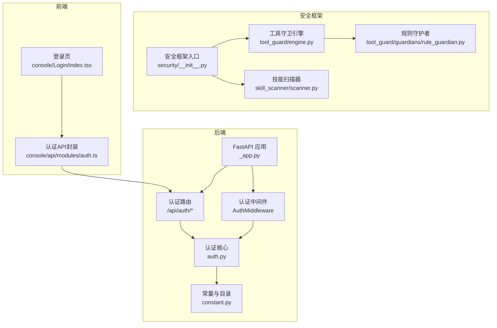
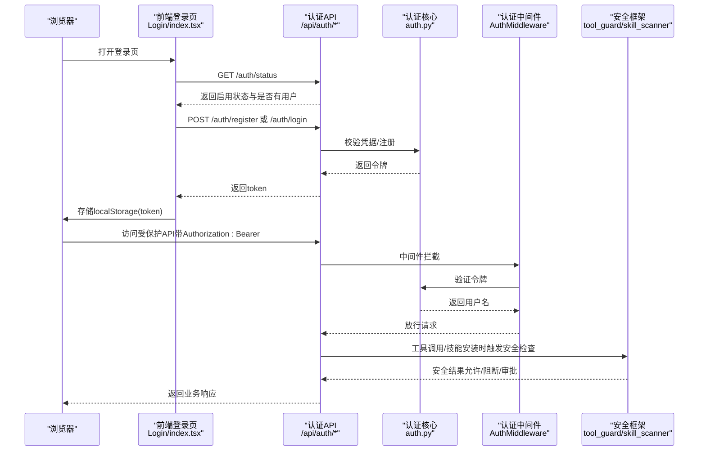
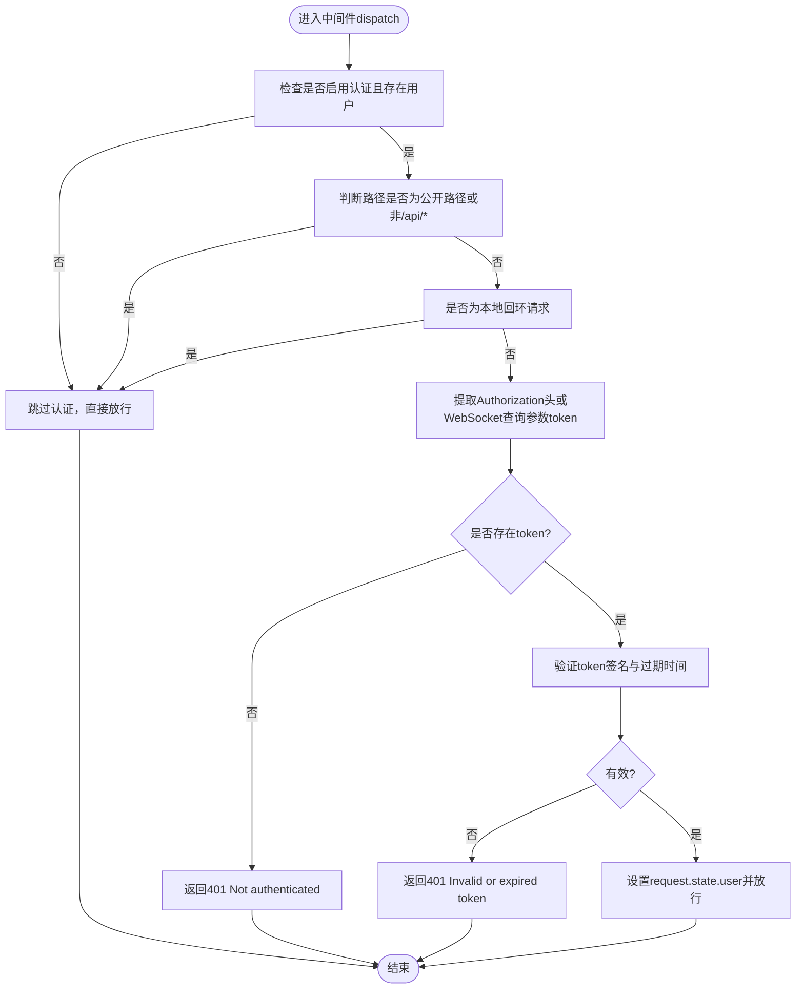
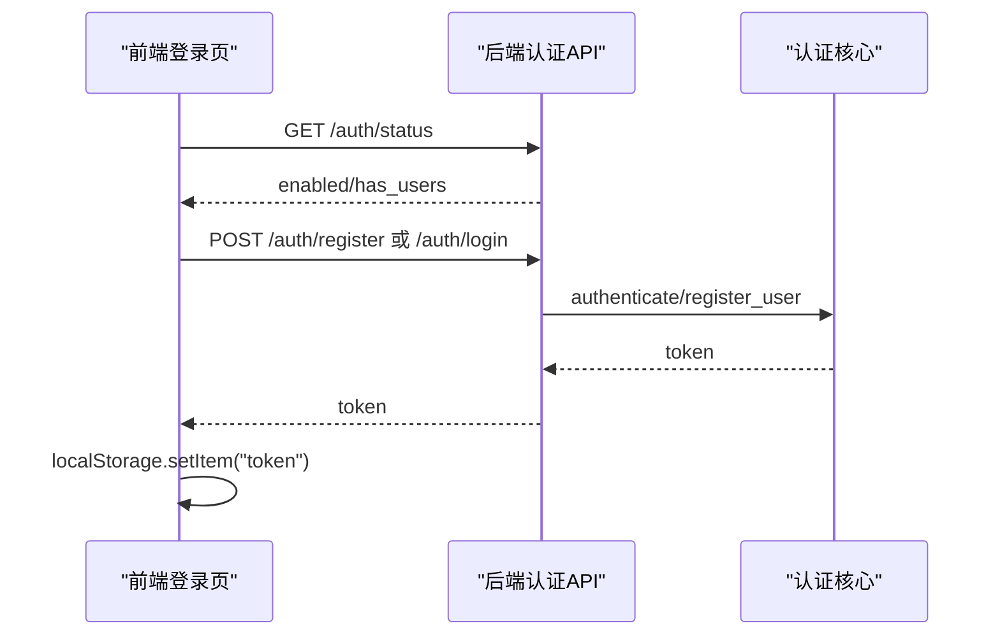
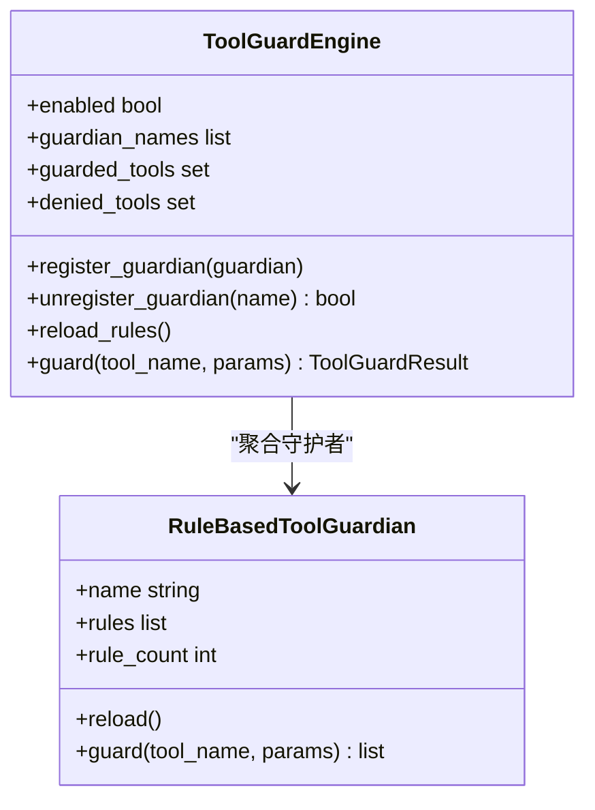
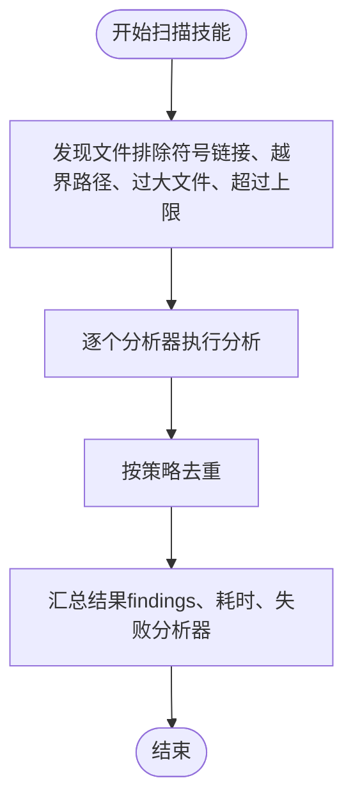
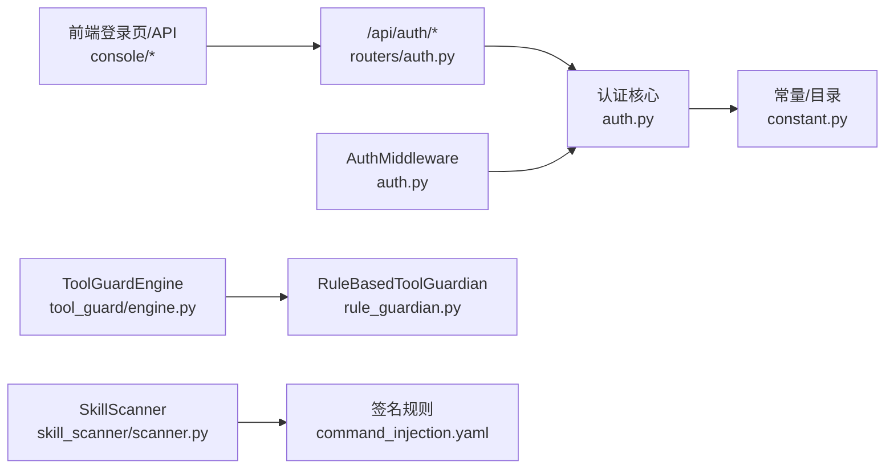

# 认证与授权

<cite>
**本文引用的文件**   
- [src\copaw\app\auth.py](file://src\copaw\app\auth.py)
- [src\copaw\app\routers\auth.py](file://src\copaw\app\routers\auth.py)
- [src\copaw\app\_app.py](file://src\copaw\app\_app.py)
- [src\copaw\constant.py](file://src\copaw\constant.py)
- [src\copaw\security\__init__.py](file://src\copaw\security\__init__.py)
- [src\copaw\security\tool_guard\engine.py](file://src\copaw\security\tool_guard\engine.py)
- [src\copaw\security\tool_guard\guardians\rule_guardian.py](file://src\copaw\security\tool_guard\guardians\rule_guardian.py)
- [src\copaw\security\tool_guard\rules\dangerous_shell_commands.yaml](file://src\copaw\security\tool_guard\rules\dangerous_shell_commands.yaml)
- [src\copaw\security\skill_scanner\scanner.py](file://src\copaw\security\skill_scanner\scanner.py)
- [src\copaw\security\skill_scanner\rules\signatures\command_injection.yaml](file://src\copaw\security\skill_scanner\rules\signatures\command_injection.yaml)
- [src\copaw\config\config.py](file://src\copaw\config\config.py)
- [console\src\pages\Login\index.tsx](file://console\src\pages\Login\index.tsx)
- [console\src\api\modules\auth.ts](file://console\src\api\modules\auth.ts)
- [website\public\docs\security.zh.md](file://website\public\docs\security.zh.md)
- [SECURITY.md](file://SECURITY.md)
</cite>

## 目录
1. [简介](#简介)
2. [项目结构](#项目结构)
3. [核心组件](#核心组件)
4. [架构总览](#架构总览)
5. [详细组件分析](#详细组件分析)
6. [依赖分析](#依赖分析)
7. [性能考虑](#性能考虑)
8. [故障排查指南](#故障排查指南)
9. [结论](#结论)
10. [附录](#附录)

## 简介
本文件面向CoPaw认证与授权系统，围绕以下目标展开：  
- 解释认证机制的实现原理、令牌管理与会话控制  
- 说明授权策略、权限模型与访问控制清单  
- 记录用户认证流程、密码策略与多因素认证支持现状  
- 提供API访问控制、角色管理与权限继承机制说明  
- 给出认证配置指南、安全最佳实践与常见问题解决方案  
- 覆盖JWT令牌的生成、验证与刷新机制，以及认证中间件的配置与使用  

CoPaw采用“单用户”信任模型，强调个人助理场景下的最小权限与端到端安全。认证默认关闭，需通过环境变量显式启用；令牌为HMAC-SHA256签名的自定义格式，有效期7天；中间件对受保护路径进行拦截校验。

## 项目结构
认证与授权相关代码主要分布在如下模块：
- 后端认证与中间件：src\copaw\app\auth.py、src\copaw\app\routers\auth.py、src\copaw\app\_app.py
- 常量与目录：src\copaw\constant.py
- 安全框架入口：src\copaw\security\__init__.py
- 工具调用防护（工具守卫）：src\copaw\security\tool_guard\engine.py、src\copaw\security\tool_guard\guardians\rule_guardian.py、src\copaw\security\tool_guard\rules\dangerous_shell_commands.yaml
- 技能扫描（安全扫描）：src\copaw\security\skill_scanner\scanner.py、src\copaw\security\skill_scanner\rules\signatures\command_injection.yaml
- 配置模型：src\copaw\config\config.py
- 前端登录与API封装：console\src\pages\Login\index.tsx、console\src\api\modules\auth.ts
- 文档与信任模型：website\public\docs\security.zh.md、SECURITY.md

**图表来源**
- [src\copaw\app\_app.py:241-264](file://src\copaw\app\_app.py#L241-L264)
- [src\copaw\app\auth.py:302-368](file://src\copaw\app\auth.py#L302-L368)
- [src\copaw\app\routers\auth.py:18-114](file://src\copaw\app\routers\auth.py#L18-L114)
- [src\copaw\constant.py:72-86](file://src\copaw\constant.py#L72-L86)
- [src\copaw\security\__init__.py:1-17](file://src\copaw\security\__init__.py#L1-L17)
- [src\copaw\security\tool_guard\engine.py:52-218](file://src\copaw\security\tool_guard\engine.py#L52-L218)
- [src\copaw\security\tool_guard\guardians\rule_guardian.py:280-383](file://src\copaw\security\tool_guard\guardians\rule_guardian.py#L280-L383)
- [src\copaw\security\skill_scanner\scanner.py:76-319](file://src\copaw\security\skill_scanner\scanner.py#L76-L319)
- [console\src\pages\Login\index.tsx:1-152](file://console\src\pages\Login\index.tsx#L1-L152)
- [console\src\api\modules\auth.ts:14-49](file://console\src\api\modules\auth.ts#L14-L49)

**章节来源**
- [src\copaw\app\_app.py:241-264](file://src\copaw\app\_app.py#L241-L264)
- [src\copaw\app\auth.py:302-368](file://src\copaw\app\auth.py#L302-L368)
- [src\copaw\app\routers\auth.py:18-114](file://src\copaw\app\routers\auth.py#L18-L114)
- [src\copaw\constant.py:72-86](file://src\copaw\constant.py#L72-L86)
- [src\copaw\security\__init__.py:1-17](file://src\copaw\security\__init__.py#L1-L17)
- [src\copaw\security\tool_guard\engine.py:52-218](file://src\copaw\security\tool_guard\engine.py#L52-L218)
- [src\copaw\security\tool_guard\guardians\rule_guardian.py:280-383](file://src\copaw\security\tool_guard\guardians\rule_guardian.py#L280-L383)
- [src\copaw\security\skill_scanner\scanner.py:76-319](file://src\copaw\security\skill_scanner\scanner.py#L76-L319)
- [console\src\pages\Login\index.tsx:1-152](file://console\src\pages\Login\index.tsx#L1-L152)
- [console\src\api\modules\auth.ts:14-49](file://console\src\api\modules\auth.ts#L14-L49)

## 核心组件
- 认证核心与中间件
  - 认证核心：密码加盐SHA-256存储、HMAC-SHA256签名令牌、令牌过期时间、认证数据持久化（auth.json）
  - 认证中间件：对受保护路径进行拦截，提取并验证Bearer令牌，支持WebSocket查询参数令牌
- 认证API
  - /api/auth/login：用户名+密码登录，返回令牌
  - /api/auth/register：首次启用认证时注册单用户
  - /api/auth/status：查询认证是否启用及是否存在用户
  - /api/auth/verify：校验客户端携带的令牌有效性
- 安全框架
  - 工具守卫：在工具调用前扫描参数，识别高危模式（如危险命令、注入等），支持规则加载与动态重载
  - 技能扫描：对技能包进行静态扫描，基于签名规则与策略判定安全性
- 配置与常量
  - SECRET_DIR、COPAW_AUTH_ENABLED、COPAW_AUTH_USERNAME/PASSWORD等环境变量
  - 前端登录页与API封装

**章节来源**
- [src\copaw\app\auth.py:191-295](file://src\copaw\app\auth.py#L191-L295)
- [src\copaw\app\auth.py:302-368](file://src\copaw\app\auth.py#L302-L368)
- [src\copaw\app\routers\auth.py:41-114](file://src\copaw\app\routers\auth.py#L41-L114)
- [src\copaw\security\tool_guard\engine.py:52-218](file://src\copaw\security\tool_guard\engine.py#L52-L218)
- [src\copaw\security\tool_guard\guardians\rule_guardian.py:280-383](file://src\copaw\security\tool_guard\guardians\rule_guardian.py#L280-L383)
- [src\copaw\security\skill_scanner\scanner.py:76-319](file://src\copaw\security\skill_scanner\scanner.py#L76-L319)
- [src\copaw\constant.py:72-86](file://src\copaw\constant.py#L72-L86)

## 架构总览
下图展示从浏览器到后端的认证与授权关键交互：

**图表来源**
- [console\src\pages\Login\index.tsx:17-68](file://console\src\pages\Login\index.tsx#L17-L68)
- [console\src\api\modules\auth.ts:14-49](file://console\src\api\modules\auth.ts#L14-L49)
- [src\copaw\app\routers\auth.py:41-114](file://src\copaw\app\routers\auth.py#L41-L114)
- [src\copaw\app\auth.py:302-368](file://src\copaw\app\auth.py#L302-L368)
- [src\copaw\security\tool_guard\engine.py:161-207](file://src\copaw\security\tool_guard\engine.py#L161-L207)
- [src\copaw\security\skill_scanner\scanner.py:148-242](file://src\copaw\security\skill_scanner\scanner.py#L148-L242)

## 详细组件分析

### 认证核心与中间件
- 密码策略
  - 使用Python标准库实现加盐SHA-256哈希，存储于SECRET_DIR下的auth.json，文件权限限制为0o600
  - 单用户注册：仅允许注册一次；若忘记密码，删除auth.json并重启服务可重新注册
- 令牌机制
  - 自定义JWT格式：base64(urlsafe)的payload + HMAC-SHA256签名，7天有效期
  - 令牌存储：浏览器localStorage；登出或收到401响应时清理
- 中间件策略
  - 受保护路径：仅对/api/*生效
  - 免认证路径：/api/auth/login、/api/auth/register、/api/auth/status、/api/version、静态资源
  - 本地回环免认证：来自127.0.0.1/::1的请求
  - WebSocket认证：通过查询参数token传递，且仅限升级请求
  - OPTIONS预检请求免认证
- 自动注册
  - 启动时可从环境变量COPAW_AUTH_USERNAME/PASSWORD自动注册管理员账号（用于容器/自动化部署）

**图表来源**
- [src\copaw\app\auth.py:335-368](file://src\copaw\app\auth.py#L335-L368)
- [src\copaw\app\auth.py:135-158](file://src\copaw\app\auth.py#L135-L158)

**章节来源**
- [src\copaw\app\auth.py:191-295](file://src\copaw\app\auth.py#L191-L295)
- [src\copaw\app\auth.py:302-368](file://src\copaw\app\auth.py#L302-L368)
- [src\copaw\constant.py:72-86](file://src\copaw\constant.py#L72-L86)

### 认证API与前端集成
- 后端API
  - /api/auth/login：校验用户名/密码，成功返回token
  - /api/auth/register：仅在认证启用且无用户时允许注册
  - /api/auth/status：返回认证启用状态与是否存在用户
  - /api/auth/verify：校验传入的Bearer token
- 前端
  - 登录页根据/status决定显示注册或登录
  - 登录/注册成功后将token存入localStorage，并在后续请求中携带
  - 文档明确：令牌存储于localStorage，退出登录或收到401响应时清除

**图表来源**
- [console\src\pages\Login\index.tsx:17-68](file://console\src\pages\Login\index.tsx#L17-L68)
- [console\src\api\modules\auth.ts:14-49](file://console\src\api\modules\auth.ts#L14-L49)
- [src\copaw\app\routers\auth.py:41-114](file://src\copaw\app\routers\auth.py#L41-L114)
- [src\copaw\app\auth.py:214-238](file://src\copaw\app\auth.py#L214-L238)

**章节来源**
- [src\copaw\app\routers\auth.py:41-114](file://src\copaw\app\routers\auth.py#L41-L114)
- [console\src\pages\Login\index.tsx:17-68](file://console\src\pages\Login\index.tsx#L17-L68)
- [console\src\api\modules\auth.ts:14-49](file://console\src\api\modules\auth.ts#L14-L49)
- [website\public\docs\security.zh.md:267-281](file://website\public\docs\security.zh.md#L267-L281)

### 工具调用防护（工具守卫）
- 引擎
  - ToolGuardEngine：聚合多个守护者，按配置决定是否启用、受保护工具集与禁用工具集
  - 支持动态注册/注销守护者、重载规则、计算耗时
- 规则守护者
  - RuleBasedToolGuardian：从YAML加载规则，匹配工具参数字符串，输出威胁发现
  - 默认规则覆盖危险shell命令、注入、权限变更、网络隧道等
- 配置
  - config.json中security.tool_guard控制开关、受保护工具集、禁用规则、自定义规则

**图表来源**
- [src\copaw\security\tool_guard\engine.py:52-218](file://src\copaw\security\tool_guard\engine.py#L52-L218)
- [src\copaw\security\tool_guard\guardians\rule_guardian.py:280-383](file://src\copaw\security\tool_guard\guardians\rule_guardian.py#L280-L383)

**章节来源**
- [src\copaw\security\tool_guard\engine.py:52-218](file://src\copaw\security\tool_guard\engine.py#L52-L218)
- [src\copaw\security\tool_guard\guardians\rule_guardian.py:280-383](file://src\copaw\security\tool_guard\guardians\rule_guardian.py#L280-L383)
- [src\copaw\security\tool_guard\rules\dangerous_shell_commands.yaml:1-120](file://src\copaw\security\tool_guard\rules\dangerous_shell_commands.yaml#L1-L120)
- [src\copaw\config\config.py:743-755](file://src\copaw\config\config.py#L743-L755)

### 技能扫描（安全扫描）
- Scanner
  - 发现技能目录文件、运行多个分析器、聚合结果、去重、超时与大小限制
  - 支持策略化文件分类、扩展过滤、最大文件数限制
- 规则
  - PatternAnalyzer基于YAML签名规则扫描，覆盖命令注入、路径遍历、SQL注入、嵌入脚本等
- 配置
  - config.json中security.skill_scanner控制扫描模式、超时、白名单

**图表来源**
- [src\copaw\security\skill_scanner\scanner.py:148-242](file://src\copaw\security\skill_scanner\scanner.py#L148-L242)
- [src\copaw\security\skill_scanner\scanner.py:248-299](file://src\copaw\security\skill_scanner\scanner.py#L248-L299)

**章节来源**
- [src\copaw\security\skill_scanner\scanner.py:76-319](file://src\copaw\security\skill_scanner\scanner.py#L76-L319)
- [src\copaw\security\skill_scanner\rules\signatures\command_injection.yaml:1-195](file://src\copaw\security\skill_scanner\rules\signatures\command_injection.yaml#L1-L195)
- [src\copaw\config\config.py:772-795](file://src\copaw\config\config.py#L772-L795)

### 授权策略、权限模型与访问控制
- 授权策略
  - 单用户信任模型：同一实例内的已认证调用者被视为可信操作员，会话标识符与标签仅为路由/上下文控制，不构成用户级授权边界
  - 不支持多租户/多用户隔离；推荐每用户/每主机/每OS用户隔离
- 权限模型
  - 无细粒度RBAC/ABAC；当前实现为“单用户+受保护API路径”的简单授权
  - 工具调用与技能安装通过工具守卫与技能扫描进行安全前置控制
- 访问控制清单
  - 公开路径：/api/auth/login、/api/auth/register、/api/auth/status、/api/version、静态资源
  - 受保护路径：/api/*
  - WebSocket：通过查询参数token传递，仅限升级请求
  - 本地回环：127.0.0.1/::1免认证

**章节来源**
- [SECURITY.md:65-118](file://SECURITY.md#L65-L118)
- [website\public\docs\security.zh.md:267-281](file://website\public\docs\security.zh.md#L267-L281)
- [src\copaw\app\auth.py:335-368](file://src\copaw\app\auth.py#L335-L368)

## 依赖分析
- 认证中间件依赖认证核心提供的令牌验证与用户解析
- 认证API依赖认证核心完成注册与登录逻辑
- 安全框架独立模块化，工具守卫与技能扫描分别在工具调用与技能安装阶段发挥作用
- 前端通过API封装与后端认证API交互

**图表来源**
- [src\copaw\app\routers\auth.py:10-16](file://src\copaw\app\routers\auth.py#L10-L16)
- [src\copaw\app\auth.py:103-132](file://src\copaw\app\auth.py#L103-L132)
- [src\copaw\constant.py:72-86](file://src\copaw\constant.py#L72-L86)
- [src\copaw\security\tool_guard\engine.py:52-218](file://src\copaw\security\tool_guard\engine.py#L52-L218)
- [src\copaw\security\tool_guard\guardians\rule_guardian.py:280-383](file://src\copaw\security\tool_guard\guardians\rule_guardian.py#L280-L383)
- [src\copaw\security\skill_scanner\scanner.py:76-319](file://src\copaw\security\skill_scanner\scanner.py#L76-L319)
- [console\src\pages\Login\index.tsx:17-68](file://console\src\pages\Login\index.tsx#L17-L68)

**章节来源**
- [src\copaw\app\routers\auth.py:10-16](file://src\copaw\app\routers\auth.py#L10-L16)
- [src\copaw\app\auth.py:103-132](file://src\copaw\app\auth.py#L103-L132)
- [src\copaw\security\tool_guard\engine.py:52-218](file://src\copaw\security\tool_guard\engine.py#L52-L218)
- [src\copaw\security\skill_scanner\scanner.py:76-319](file://src\copaw\security\skill_scanner\scanner.py#L76-L319)

## 性能考虑
- 令牌验证为O(1)，包含签名计算与JSON解析，开销极低
- 中间件仅在受保护路径与非公开路径生效，避免对静态资源与公开接口产生额外负担
- 工具守卫与技能扫描在工具调用与技能安装时触发，具备超时与文件数量/大小限制，防止扫描过程成为性能瓶颈
- 建议
  - 合理设置工具守卫与技能扫描的超时与阈值
  - 对高频工具调用场景，评估规则复杂度与正则表达式性能

[本节为通用指导，无需特定文件引用]

## 故障排查指南
- 无法登录/401未认证
  - 检查COPAW_AUTH_ENABLED是否启用
  - 确认是否已注册用户；若无用户，先走注册流程
  - 确认请求头Authorization是否为Bearer token，或WebSocket是否通过查询参数token传递
  - 本地回环请求（127.0.0.1/::1）会被免认证，确认客户端IP
- 令牌过期/401无效或过期
  - 令牌有效期7天；过期后需重新登录获取新令牌
  - 前端会在收到401时清理localStorage中的token
- 注册失败/403
  - 若已存在用户，再次注册会被拒绝
  - 确保COPAW_AUTH_ENABLED=true且用户名/密码非空
- 工具调用被阻断
  - 检查security.tool_guard配置，确认工具是否在受保护集合或被禁用
  - 查看规则匹配详情，必要时调整规则或添加例外
- 技能安装被阻止
  - 检查security.skill_scanner.mode与白名单；必要时调整策略或加入白名单

**章节来源**
- [src\copaw\app\auth.py:310-333](file://src\copaw\app\auth.py#L310-L333)
- [src\copaw\app\routers\auth.py:56-83](file://src\copaw\app\routers\auth.py#L56-L83)
- [src\copaw\security\tool_guard\engine.py:161-207](file://src\copaw\security\tool_guard\engine.py#L161-L207)
- [src\copaw\security\skill_scanner\scanner.py:148-242](file://src\copaw\security\skill_scanner\scanner.py#L148-L242)
- [website\public\docs\security.zh.md:267-281](file://website\public\docs\security.zh.md#L267-L281)

## 结论
CoPaw认证与授权体系以“单用户+受保护API路径”为核心，结合HMAC-SHA256签名令牌与中间件拦截，满足个人助理场景的安全需求。工具守卫与技能扫描作为安全前置防线，进一步降低工具滥用与恶意技能的风险。建议在生产环境中严格遵循单用户隔离原则，合理配置工具守卫与技能扫描策略，并定期审查规则与白名单。

[本节为总结，无需特定文件引用]

## 附录

### 认证配置指南
- 启用认证
  - 设置COPAW_AUTH_ENABLED=true
  - 首次访问控制台将引导注册单用户；后续访问显示登录页
- 自动注册（自动化部署）
  - 设置COPAW_AUTH_USERNAME与COPAW_AUTH_PASSWORD，启动时自动注册管理员账号
- 目录与文件权限
  - SECRET_DIR用于存放auth.json，文件权限为0o600
- 环境变量
  - COPAW_AUTH_ENABLED/COPAW_AUTH_USERNAME/COPAW_AUTH_PASSWORD/COPAW_SECRET_DIR等

**章节来源**
- [src\copaw\app\routers\auth.py:56-83](file://src\copaw\app\routers\auth.py#L56-L83)
- [src\copaw\app\auth.py:241-271](file://src\copaw\app\auth.py#L241-L271)
- [src\copaw\constant.py:72-86](file://src\copaw\constant.py#L72-L86)

### 安全最佳实践
- 严格遵循单用户信任模型，避免多人共享同一实例
- 使用强口令并妥善保管；忘记口令可通过删除auth.json并重启服务重新注册
- 定期审查工具守卫规则与技能扫描策略，及时更新签名规则
- 在容器/云环境中，确保SECRET_DIR所在卷权限受限，避免泄露auth.json
- 对外暴露API时，谨慎配置CORS_ORIGINS，避免跨域风险

**章节来源**
- [SECURITY.md:65-118](file://SECURITY.md#L65-L118)
- [website\public\docs\security.zh.md:267-281](file://website\public\docs\security.zh.md#L267-L281)