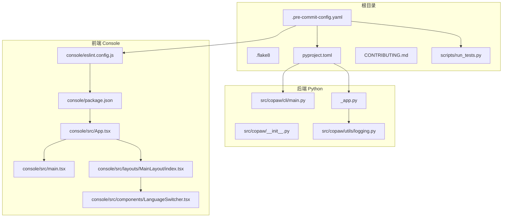
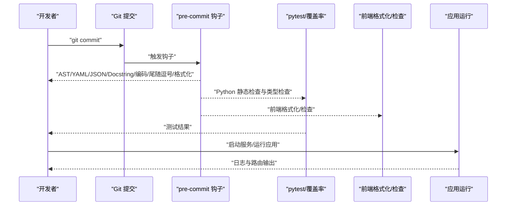
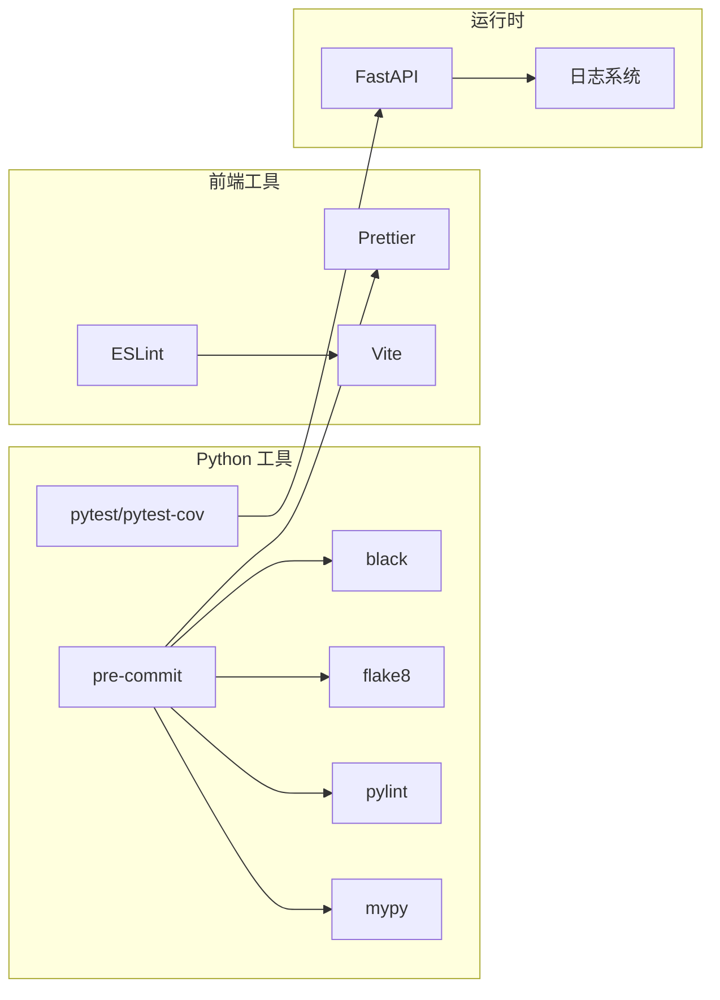

# 代码规范

<cite>
**本文引用的文件**
- [.pre-commit-config.yaml](file://.pre-commit-config.yaml)
- [.flake8](file://.flake8)
- [pyproject.toml](file://pyproject.toml)
- [console/eslint.config.js](file://console/eslint.config.js)
- [console/package.json](file://console/package.json)
- [scripts/run_tests.py](file://scripts/run_tests.py)
- [CONTRIBUTING.md](file://CONTRIBUTING.md)
- [src/copaw/__init__.py](file://src/copaw/__init__.py)
- [src/copaw/cli/main.py](file://src/copaw/cli/main.py)
- [src/copaw/app/_app.py](file://src/copaw/app/_app.py)
- [src/copaw/utils/logging.py](file://src/copaw/utils/logging.py)
- [console/src/App.tsx](file://console/src/App.tsx)
- [console/src/main.tsx](file://console/src/main.tsx)
- [console/src/components/LanguageSwitcher.tsx](file://console/src/components/LanguageSwitcher.tsx)
- [console/src/layouts/MainLayout/index.tsx](file://console/src/layouts/MainLayout/index.tsx)
</cite>

## 目录
1. [简介](#简介)
2. [项目结构](#项目结构)
3. [核心规范](#核心规范)
4. [架构总览](#架构总览)
5. [组件与文件规范详解](#组件与文件规范详解)
6. [依赖关系分析](#依赖关系分析)
7. [性能与可维护性建议](#性能与可维护性建议)
8. [故障排查指南](#故障排查指南)
9. [结论](#结论)
10. [附录](#附录)

## 简介
本文件为 CoPaw 项目的统一代码规范文档，覆盖 Python 后端、TypeScript/React 前端、Git 提交与分支管理、代码审查、测试与覆盖率、文档与自动化工具等关键方面。目标是确保团队协作一致性、提升代码质量与可维护性，并降低集成与发布风险。

## 项目结构
CoPaw 采用多语言混合工程：后端为 Python（FastAPI + Click），前端为 TypeScript/React（Vite + Ant Design）。根目录通过预提交钩子与测试脚本统一约束开发流程；前端在 console 子目录内，提供独立的包管理与构建脚本。

图表来源
- [.pre-commit-config.yaml:1-120](file://.pre-commit-config.yaml#L1-L120)
- [pyproject.toml:1-99](file://pyproject.toml#L1-L99)
- [console/eslint.config.js:1-29](file://console/eslint.config.js#L1-L29)
- [console/package.json:1-57](file://console/package.json#L1-L57)
- [scripts/run_tests.py:1-282](file://scripts/run_tests.py#L1-L282)
- [src/copaw/__init__.py:1-33](file://src/copaw/__init__.py#L1-L33)
- [src/copaw/cli/main.py:1-173](file://src/copaw/cli/main.py#L1-L173)
- [src/copaw/app/_app.py:1-409](file://src/copaw/app/_app.py#L1-L409)
- [src/copaw/utils/logging.py:1-185](file://src/copaw/utils/logging.py#L1-L185)
- [console/src/App.tsx:1-171](file://console/src/App.tsx#L1-L171)
- [console/src/main.tsx:1-31](file://console/src/main.tsx#L1-L31)
- [console/src/layouts/MainLayout/index.tsx:1-86](file://console/src/layouts/MainLayout/index.tsx#L1-L86)
- [console/src/components/LanguageSwitcher.tsx:1-59](file://console/src/components/LanguageSwitcher.tsx#L1-L59)

章节来源
- [.pre-commit-config.yaml:1-120](file://.pre-commit-config.yaml#L1-L120)
- [pyproject.toml:1-99](file://pyproject.toml#L1-L99)
- [console/eslint.config.js:1-29](file://console/eslint.config.js#L1-L29)
- [console/package.json:1-57](file://console/package.json#L1-L57)
- [scripts/run_tests.py:1-282](file://scripts/run_tests.py#L1-L282)

## 核心规范
- Python 风格与静态检查
  - 使用 flake8 与 black 统一风格；flake8 行宽限制为 79；忽略若干规则以适配项目现状。
  - 使用 pylint 进行额外静态检查，禁用部分规则以减少噪音。
  - 使用 mypy 进行类型检查，忽略缺失导入与特定错误类别。
  - 预提交钩子对 Python 文件执行 AST 检查、YAML/JSON/XML/DOCSTRING/编码等基础校验，以及自动尾随逗号与格式化。
- TypeScript/React 规范
  - ESLint 使用 typescript-eslint 推荐配置，启用 React Hooks 与刷新插件；推荐使用 react-refresh 的仅导出组件规则。
  - 前端格式化与检查通过 package.json 脚本统一入口。
- Git 提交与分支
  - 提交信息遵循 Conventional Commits；PR 标题同格式；本地门禁要求通过 pre-commit 与 pytest。
- 测试与覆盖率
  - 本地测试脚本支持单元/集成测试、并行执行与覆盖率报告生成；pytest 配置位于 pyproject.toml。
- 文档与贡献
  - 贡献指南明确提交格式、PR 格式、本地门禁、前端格式化与文档更新要求。

章节来源
- [.flake8:1-12](file://.flake8#L1-L12)
- [.pre-commit-config.yaml:1-120](file://.pre-commit-config.yaml#L1-L120)
- [pyproject.toml:93-99](file://pyproject.toml#L93-L99)
- [console/eslint.config.js:1-29](file://console/eslint.config.js#L1-L29)
- [console/package.json:1-57](file://console/package.json#L1-L57)
- [CONTRIBUTING.md:23-86](file://CONTRIBUTING.md#L23-L86)
- [scripts/run_tests.py:1-282](file://scripts/run_tests.py#L1-L282)

## 架构总览
下图展示从开发者提交到本地门禁与运行时的关键路径，体现 Python 与前端工具链的协同。

图表来源
- [.pre-commit-config.yaml:1-120](file://.pre-commit-config.yaml#L1-L120)
- [scripts/run_tests.py:1-282](file://scripts/run_tests.py#L1-L282)
- [console/eslint.config.js:1-29](file://console/eslint.config.js#L1-L29)
- [console/package.json:1-57](file://console/package.json#L1-L57)
- [src/copaw/app/_app.py:1-409](file://src/copaw/app/_app.py#L1-L409)

## 组件与文件规范详解

### Python 代码风格与静态检查
- 命名约定
  - 模块与包：小写、下划线分隔；避免短名称，保持语义清晰。
  - 函数与变量：小驼峰或下划线，优先可读性；常量全大写加下划线。
  - 类：帕斯卡命名；异常类以 Error 结尾。
  - 私有成员：以下划线前缀；公共接口避免单字母变量。
- 导入顺序与组织
  - 标准库 → 第三方库 → 项目内部模块；每组之间空一行；同一组内按字母序。
  - 避免相对导入，优先使用绝对导入；在包内跨模块引用时保持清晰路径。
- 注释与文档字符串
  - 模块首行编码声明；函数/类/模块需有简洁文档字符串；复杂逻辑补充行内注释。
  - TODO/FIXME 使用统一标记并在后续修复。
- 静态检查与格式化
  - flake8：行宽 79；忽略 F401/F403/W503/E731 等规则以适配现状。
  - black：行宽 79；自动格式化 Python 文件。
  - pylint：禁用若干规则以减少噪音；保留关键问题提示。
  - mypy：忽略缺失导入与特定错误类别；启用 follow-imports=skip 与 explicit-package-bases。
- 日志与运行时
  - 使用统一的日志命名空间与彩色终端输出；文件日志按平台策略处理。
  - 应用生命周期中注入中间件与静态资源路由，确保控制台可用性。

章节来源
- [.flake8:1-12](file://.flake8#L1-L12)
- [.pre-commit-config.yaml:54-120](file://.pre-commit-config.yaml#L54-L120)
- [src/copaw/utils/logging.py:1-185](file://src/copaw/utils/logging.py#L1-L185)
- [src/copaw/app/_app.py:1-409](file://src/copaw/app/_app.py#L1-L409)

### TypeScript/JavaScript 代码规范
- ESLint 配置
  - 使用 typescript-eslint 推荐配置；启用 React Hooks 与 react-refresh 插件。
  - 仅允许常量导出组件的刷新规则，避免误报。
- 代码格式化与检查
  - 通过 package.json 脚本统一入口：format/format:check/lint；建议在提交前执行。
- 组件命名约定
  - 组件文件以帕斯卡命名（如 LanguageSwitcher.tsx）；样式文件与组件同名且以 .module.less 结尾。
  - 页面组件与布局组件分离；路由映射集中管理，避免硬编码路径。
- 依赖与版本
  - 前端依赖与开发依赖明确区分；版本锁定于 package.json；构建脚本统一由 Vite 执行。

章节来源
- [console/eslint.config.js:1-29](file://console/eslint.config.js#L1-L29)
- [console/package.json:1-57](file://console/package.json#L1-L57)
- [console/src/App.tsx:1-171](file://console/src/App.tsx#L1-L171)
- [console/src/main.tsx:1-31](file://console/src/main.tsx#L1-L31)
- [console/src/layouts/MainLayout/index.tsx:1-86](file://console/src/layouts/MainLayout/index.tsx#L1-L86)
- [console/src/components/LanguageSwitcher.tsx:1-59](file://console/src/components/LanguageSwitcher.tsx#L1-L59)

### Git 提交规范与分支管理
- 提交信息格式
  - 遵循 Conventional Commits：<type>(<scope>): <subject>；类型包括 feat/fix/docs/style/refactor/perf/test/chore/build/revert。
- 分支命名
  - 建议采用小写/短横线/下划线组合；清晰表达功能域与变更范围。
- PR 标题与描述
  - PR 标题与提交信息一致；简要描述变更内容、动机与影响范围。
- 本地门禁
  - 安装开发依赖与预提交钩子；运行所有钩子并通过 pytest；前端变更需先格式化。

章节来源
- [CONTRIBUTING.md:23-86](file://CONTRIBUTING.md#L23-L86)

### 代码审查标准
- 必须通过本地门禁（pre-commit + pytest）；CI 失败的 PR 不得合并。
- 变更需配套测试；新增功能或修复需有最小可验证示例。
- 文档同步更新：用户可见行为变更需更新网站文档与 README。
- 代码可读性：避免过度优化；注释解释“为什么”而非“做了什么”。

章节来源
- [CONTRIBUTING.md:68-86](file://CONTRIBUTING.md#L68-L86)

### 测试与覆盖率
- 测试命令
  - 支持运行全部测试、单元测试、集成测试；可并行执行与生成覆盖率报告。
- 覆盖率
  - 覆盖 src/copaw；报告同时输出 HTML 与缺失行统计。
- 标记与慢测试
  - 使用 pytest 标记 slow；默认不运行慢测试，可通过 -m "not slow" 排除。

章节来源
- [scripts/run_tests.py:1-282](file://scripts/run_tests.py#L1-L282)
- [pyproject.toml:93-99](file://pyproject.toml#L93-L99)

### 文档编写规范
- 用户文档
  - 更新 website/public/docs 下对应 Markdown；保持与实现一致。
- 开发文档
  - 重要设计决策与流程变更需在仓库内同步记录。
- 示例与教程
  - 新增示例工作流或第三方集成时，提供最小可运行示例与说明。

章节来源
- [CONTRIBUTING.md:85-86](file://CONTRIBUTING.md#L85-L86)

### 预提交钩子与自动格式化
- 钩子清单
  - 基础校验：AST、YAML/JSON/XML、docstring、编码、私钥检测、尾随空白。
  - 自动修复：添加尾随逗号、black 格式化、prettier 前端格式化。
  - 静态检查：mypy（Python）、flake8（Python）、pylint（Python）、prettier（前端）。
- 配置要点
  - 使用正则排除 skills/ 与 scripts/pack/ 等目录；前端仅对 ts/tsx 生效。
  - Python 钩子参数：忽略缺失导入、禁用特定错误类别、跳过导入跟踪。
- 使用方法
  - 安装依赖与钩子；首次运行 pre-commit run --all-files；若修改文件请再次运行直至通过。

章节来源
- [.pre-commit-config.yaml:1-120](file://.pre-commit-config.yaml#L1-L120)
- [console/package.json:1-57](file://console/package.json#L1-L57)

## 依赖关系分析
- Python 工具链
  - black/flake8/pylint/mypy 与 pre-commit 协作，形成统一的静态检查与格式化流水线。
  - pytest 与 pytest-cov 用于测试与覆盖率；并行执行依赖 pytest-xdist。
- 前端工具链
  - ESLint + Prettier + Vite；ESLint 使用 typescript-eslint 与 React Hooks/Refresh 插件。
- 运行时与日志
  - FastAPI 应用注入认证与代理中间件；日志系统按平台策略输出至终端与文件。

图表来源
- [.pre-commit-config.yaml:1-120](file://.pre-commit-config.yaml#L1-L120)
- [console/eslint.config.js:1-29](file://console/eslint.config.js#L1-L29)
- [console/package.json:1-57](file://console/package.json#L1-L57)
- [scripts/run_tests.py:1-282](file://scripts/run_tests.py#L1-L282)
- [src/copaw/app/_app.py:1-409](file://src/copaw/app/_app.py#L1-L409)
- [src/copaw/utils/logging.py:1-185](file://src/copaw/utils/logging.py#L1-L185)

章节来源
- [.pre-commit-config.yaml:1-120](file://.pre-commit-config.yaml#L1-L120)
- [console/eslint.config.js:1-29](file://console/eslint.config.js#L1-L29)
- [console/package.json:1-57](file://console/package.json#L1-L57)
- [scripts/run_tests.py:1-282](file://scripts/run_tests.py#L1-L282)
- [src/copaw/app/_app.py:1-409](file://src/copaw/app/_app.py#L1-L409)
- [src/copaw/utils/logging.py:1-185](file://src/copaw/utils/logging.py#L1-L185)

## 性能与可维护性建议
- Python
  - 控制模块导入顺序与延迟加载，避免启动时长增长；日志级别按需调整。
  - 对外部依赖调用增加超时与重试策略；对磁盘/网络 IO 使用异步或并发。
- 前端
  - 组件拆分与懒加载；减少不必要的全局状态；样式模块化避免冲突。
  - 构建产物分析与体积监控；按需引入第三方库。
- 测试
  - 将慢测试标记为 slow 并在 CI 中选择性运行；提高单元测试占比。
- 文档
  - 保持 API 与配置文档同步；变更记录在 CHANGELOG 或发布说明中。

## 故障排查指南
- 预提交失败
  - 检查是否安装 dev 依赖与 pre-commit 钩子；运行 pre-commit run --all-files；根据提示修复格式或静态检查问题。
- 测试失败
  - 使用 scripts/run_tests.py 指定子目录或并行执行；查看覆盖率报告定位未覆盖区域。
- 前端格式化/检查失败
  - 在 console 目录执行 npm run format 与 npm run lint；确认 ESLint 配置与依赖版本。
- 日志与运行时
  - 检查日志命名空间与文件处理器；确认平台差异导致的文件句柄与旋转策略。

章节来源
- [CONTRIBUTING.md:68-86](file://CONTRIBUTING.md#L68-L86)
- [scripts/run_tests.py:1-282](file://scripts/run_tests.py#L1-L282)
- [src/copaw/utils/logging.py:1-185](file://src/copaw/utils/logging.py#L1-L185)

## 结论
本规范以预提交钩子与测试脚本为核心，结合 Python 与前端工具链，形成从提交到运行的一致质量基线。建议团队在日常开发中严格遵循，持续改进以适应项目演进。

## 附录
- 关键文件索引
  - Python 静态检查与格式化：.pre-commit-config.yaml、.flake8、pyproject.toml
  - 前端 ESLint 与脚本：console/eslint.config.js、console/package.json
  - 测试与覆盖率：scripts/run_tests.py、pyproject.toml
  - 贡献与提交规范：CONTRIBUTING.md
  - 运行时与日志：src/copaw/app/_app.py、src/copaw/utils/logging.py
  - 前端组件示例：console/src/App.tsx、console/src/main.tsx、console/src/layouts/MainLayout/index.tsx、console/src/components/LanguageSwitcher.tsx