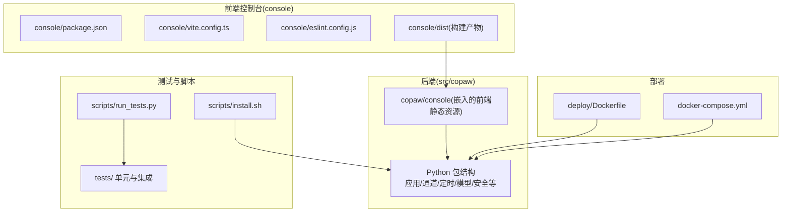
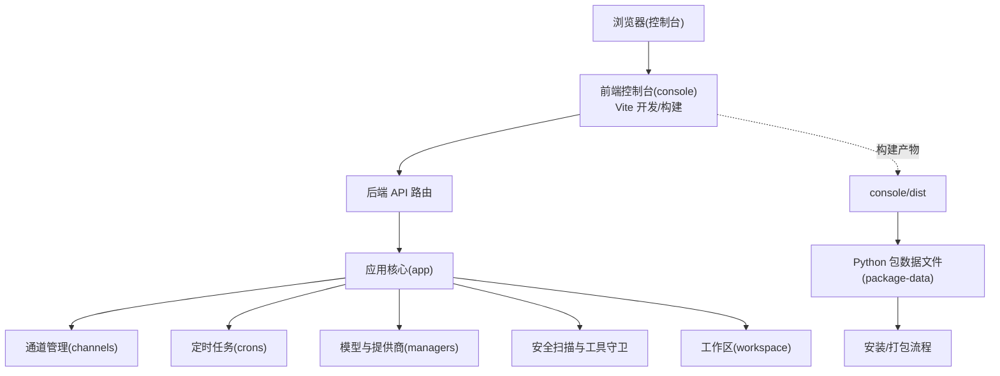
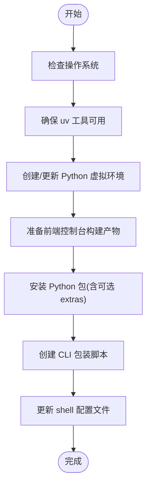
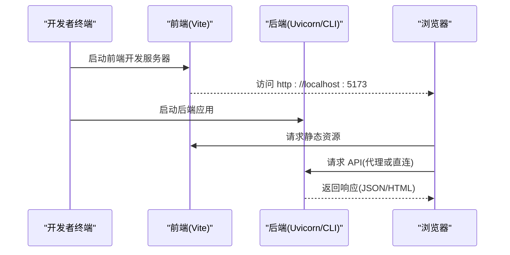
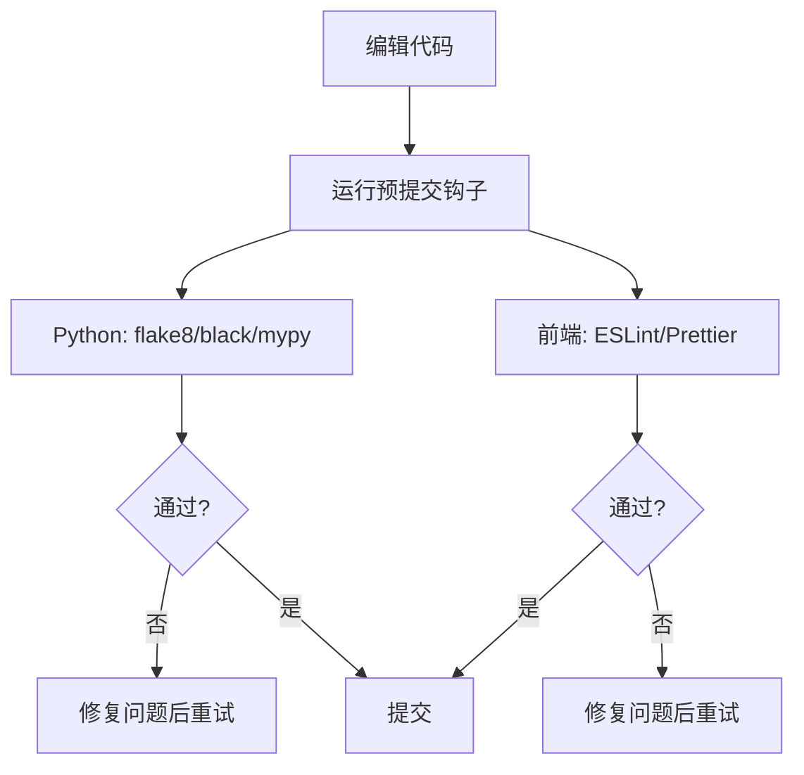
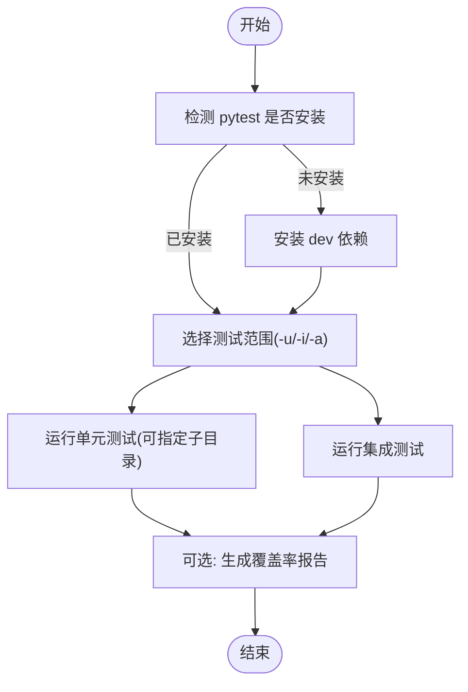
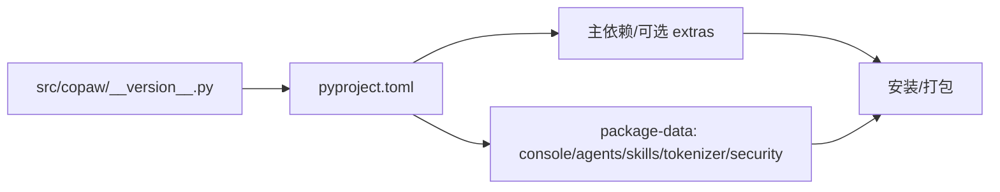
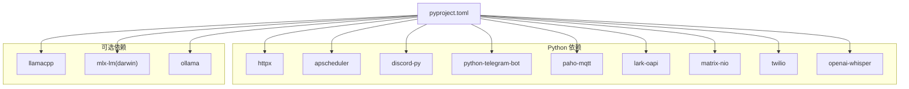

# 开发指南

<cite>
**本文引用的文件**
- [README.md](file://README.md)
- [CONTRIBUTING.md](file://CONTRIBUTING.md)
- [pyproject.toml](file://pyproject.toml)
- [setup.py](file://setup.py)
- [scripts/install.sh](file://scripts/install.sh)
- [scripts/run_tests.py](file://scripts/run_tests.py)
- [.pre-commit-config.yaml](file://.pre-commit-config.yaml)
- [docker-compose.yml](file://docker-compose.yml)
- [deploy/Dockerfile](file://deploy/Dockerfile)
- [src/copaw/__version__.py](file://src/copaw/__version__.py)
- [console/package.json](file://console/package.json)
- [console/vite.config.ts](file://console/vite.config.ts)
- [console/eslint.config.js](file://console/eslint.config.js)
</cite>

## 目录
1. [简介](#简介)
2. [项目结构](#项目结构)
3. [核心组件](#核心组件)
4. [架构总览](#架构总览)
5. [详细组件分析](#详细组件分析)
6. [依赖分析](#依赖分析)
7. [性能考虑](#性能考虑)
8. [故障排查指南](#故障排查指南)
9. [结论](#结论)
10. [附录](#附录)

## 简介
本开发指南面向希望参与 CoPaw 项目开发的工程师与贡献者，覆盖从开发环境搭建、依赖安装到本地开发服务器启动的完整流程；同时给出代码规范、测试要求、提交流程、模块依赖关系、开发工具使用、调试技巧、性能分析与错误排查建议，并补充贡献流程、代码审查标准与发布流程要点。文档以循序渐进的方式组织内容，兼顾新手与资深开发者。

## 项目结构
CoPaw 采用“Python 后端 + React 前端控制台 + 多语言技能与工具”的分层架构：
- 后端核心位于 src/copaw，包含应用服务、通道适配器、定时任务、模型与提供商管理、安全扫描与工具守卫等模块。
- 前端控制台位于 console，基于 Vite + React 构建，产物打包至后端包内以便直接分发。
- 测试位于 tests，分为单元测试与集成测试。
- 部署相关位于 deploy，包含多阶段 Dockerfile、Supervisord 配置与入口脚本。
- 安装与构建脚本位于 scripts，覆盖一键安装、测试运行、打包与镜像构建等。

图表来源
- [console/package.json:1-57](file://console/package.json#L1-L57)
- [console/vite.config.ts:1-48](file://console/vite.config.ts#L1-L48)
- [console/eslint.config.js:1-29](file://console/eslint.config.js#L1-L29)
- [deploy/Dockerfile:1-103](file://deploy/Dockerfile#L1-L103)
- [docker-compose.yml:1-23](file://docker-compose.yml#L1-L23)
- [scripts/run_tests.py:1-282](file://scripts/run_tests.py#L1-L282)
- [scripts/install.sh:1-340](file://scripts/install.sh#L1-L340)

章节来源
- [README.md: 428-448:428-448](file://README.md#L428-L448)
- [pyproject.toml: 41-55:41-55](file://pyproject.toml#L41-L55)

## 核心组件
- 应用与路由：后端通过 FastAPI 风格的路由器模块对外提供 API，支持代理、认证、工作区、技能、工具、模型与提供商等接口。
- 通道系统：统一的通道基类与注册机制，支持钉钉、飞书、QQ、Discord、Telegram、语音、MQTT 等多种渠道。
- 定时任务：基于 APScheduler 的心跳与计划任务管理，支持持久化与动态更新。
- 模型与提供商：内置多家云模型提供商与本地模型后端（llama.cpp、MLX、Ollama），支持自定义提供商。
- 安全与工具守卫：对技能与工具调用进行策略扫描与危险命令检测。
- 控制台前端：React + Ant Design，提供聊天、配置、技能与工具管理、定时任务与心跳等界面。

章节来源
- [README.md: 31-52:31-52](file://README.md#L31-L52)
- [pyproject.toml: 64-91:64-91](file://pyproject.toml#L64-L91)

## 架构总览
下图展示从浏览器访问到后端处理的关键路径，以及前端构建产物如何被后端打包分发。

图表来源
- [console/vite.config.ts:1-48](file://console/vite.config.ts#L1-L48)
- [pyproject.toml: 45-55:45-55](file://pyproject.toml#L45-L55)
- [deploy/Dockerfile: 87-89:87-89](file://deploy/Dockerfile#L87-L89)

## 详细组件分析

### 开发环境搭建与依赖安装
- 推荐方式：使用一键安装脚本自动完成 uv 环境、Python 虚拟环境、Node.js 与前端构建、后端安装与 CLI 包装。
- 从源码安装：先在 console 目录执行前端依赖安装与构建，再将构建产物复制到后端包内，最后以可编辑模式安装 Python 包。
- 可选依赖：根据需要启用本地模型后端（llama.cpp、MLX、Ollama）与语音识别等扩展功能。

图表来源
- [scripts/install.sh: 95-132:95-132](file://scripts/install.sh#L95-L132)
- [scripts/install.sh: 136-245:136-245](file://scripts/install.sh#L136-L245)
- [scripts/install.sh: 256-340:256-340](file://scripts/install.sh#L256-L340)
- [README.md: 428-448:428-448](file://README.md#L428-L448)

章节来源
- [scripts/install.sh: 1-340:1-340](file://scripts/install.sh#L1-L340)
- [README.md: 428-448:428-448](file://README.md#L428-L448)

### 开发服务器启动流程
- 前端开发服务器：在 console 目录运行 Vite 开发服务器，默认监听 5173 端口，支持热更新与跨主机访问。
- 后端开发服务器：通过 CLI 启动应用，配合前端代理或同机部署，访问 http://127.0.0.1:8088 打开控制台。
- Docker 方式：使用 docker-compose 快速拉起容器，映射本地工作目录与密钥目录，便于快速验证。

图表来源
- [console/vite.config.ts: 33-36:33-36](file://console/vite.config.ts#L33-L36)
- [docker-compose.yml: 9-23:9-23](file://docker-compose.yml#L9-L23)

章节来源
- [console/vite.config.ts: 1-L48:1-48](file://console/vite.config.ts#L1-L48)
- [docker-compose.yml: 1-L23:1-23](file://docker-compose.yml#L1-L23)

### 代码规范与格式化
- Python 代码风格：遵循 Black 与 flake8 规则，mypy 进行类型检查；部分文件排除规则见预提交配置。
- 前端代码风格：TypeScript + ESLint + Prettier；React Hooks 与刷新规则已配置。
- 提交信息：采用 Conventional Commits 规范，PR 标题与正文需清晰描述变更范围与动机。

图表来源
- [.pre-commit-config.yaml: 1-L120:1-120](file://.pre-commit-config.yaml#L1-L120)
- [console/eslint.config.js: 1-L29:1-29](file://console/eslint.config.js#L1-L29)
- [CONTRIBUTING.md: 23-67:23-67](file://CONTRIBUTING.md#L23-L67)

章节来源
- [.pre-commit-config.yaml: 1-L120:1-120](file://.pre-commit-config.yaml#L1-L120)
- [CONTRIBUTING.md: 68-86:68-86](file://CONTRIBUTING.md#L68-L86)

### 测试要求与运行
- 测试框架：pytest，支持并行执行（pytest-xdist），覆盖率报告生成。
- 测试分类：tests/unit 与 tests/integrated，支持按子目录运行与全量运行。
- 本地测试脚本：scripts/run_tests.py 提供统一入口，自动检测 pytest 并按参数执行。

图表来源
- [scripts/run_tests.py: 63-L282:63-282](file://scripts/run_tests.py#L63-L282)
- [pyproject.toml: 93-L99:93-99](file://pyproject.toml#L93-L99)

章节来源
- [scripts/run_tests.py: 1-L282:1-282](file://scripts/run_tests.py#L1-L282)
- [pyproject.toml: 64-L99:64-99](file://pyproject.toml#L64-L99)

### 提交流程与代码审查
- 提交前门禁：安装 dev 依赖、安装并运行预提交钩子、执行 pytest。
- 提交信息与 PR 标题：遵循 Conventional Commits，保持简洁明确。
- 文档更新：涉及用户行为变更时同步更新网站文档与 README。
- CI 政策：预提交失败的 PR 不予合并。

章节来源
- [CONTRIBUTING.md: 68-86:68-86](file://CONTRIBUTING.md#L68-L86)
- [CONTRIBUTING.md: 23-67:23-67](file://CONTRIBUTING.md#L23-L67)

### 模块依赖关系
- Python 依赖：后端主依赖与可选 extras（local、llamacpp、mlx、ollama、whisper、full）在 pyproject.toml 中声明。
- 包数据：console 前端静态资源、技能与安全规则等通过 package-data 注入到最终包中。
- 版本：版本号由 __version__.py 动态注入。

图表来源
- [pyproject.toml: 1-L99:1-99](file://pyproject.toml#L1-L99)
- [src/copaw/__version__.py: 1-L3:1-3](file://src/copaw/__version__.py#L1-L3)

章节来源
- [pyproject.toml: 1-L99:1-99](file://pyproject.toml#L1-L99)
- [src/copaw/__version__.py: 1-L3:1-3](file://src/copaw/__version__.py#L1-L3)

### 开发工具使用
- 前端：Vite + React + TypeScript，支持热更新与样式模块化；ESLint 与 Prettier 统一风格。
- 后端：uv 管理虚拟环境与依赖，支持离线与加速镜像源；Docker 多阶段构建与 Supervisor 管理进程。
- 安装：一键安装脚本自动处理 uv、Python、Node.js、前端构建与 CLI 包装。

章节来源
- [console/package.json: 1-L57:1-57](file://console/package.json#L1-L57)
- [console/vite.config.ts: 1-L48:1-48](file://console/vite.config.ts#L1-L48)
- [scripts/install.sh: 1-L340:1-340](file://scripts/install.sh#L1-L340)
- [deploy/Dockerfile: 1-L103:1-103](file://deploy/Dockerfile#L1-L103)

### 调试技巧
- 前端调试：Vite 开发服务器支持热更新与跨主机访问，可在浏览器开发者工具中查看网络与状态。
- 后端调试：通过 CLI 启动应用，结合日志与断点定位问题；Docker 环境可通过容器日志与 Supervisor 管理。
- 安装与环境：若 uv 或 Node.js 缺失，安装脚本会提示并尝试自动处理；必要时手动配置 PATH。

章节来源
- [console/vite.config.ts: 33-L36:33-36](file://console/vite.config.ts#L33-L36)
- [scripts/install.sh: 104-L132:104-132](file://scripts/install.sh#L104-L132)

### 性能分析与优化建议
- 前端性能：减少不必要的重渲染、合理拆分组件、使用样式模块化避免全局污染。
- 后端性能：关注模型请求延迟与并发处理能力，合理配置定时任务与通道消费者队列。
- 部署性能：容器内使用系统 Chromium，避免重复下载浏览器；Supervisord 管理进程稳定性。

章节来源
- [deploy/Dockerfile: 73-L78:73-78](file://deploy/Dockerfile#L73-L78)

### 错误排查指南
- 安装失败：检查 uv 与 Python 版本，确认镜像源可用；参考安装脚本输出与错误提示。
- 前端构建失败：确认 Node.js 与 npm 可用，先在 console 目录执行 npm ci 与构建。
- 测试失败：使用 run_tests.py 统一入口，开启覆盖率定位问题；检查 pytest 配置与并行参数。
- Docker 运行异常：核对卷挂载、端口映射与环境变量；必要时进入容器查看日志。

章节来源
- [scripts/install.sh: 187-L206:187-206](file://scripts/install.sh#L187-L206)
- [scripts/run_tests.py: 63-L74:63-74](file://scripts/run_tests.py#L63-L74)
- [docker-compose.yml: 9-L23:9-23](file://docker-compose.yml#L9-L23)

## 依赖分析
- Python 主要依赖：HTTP 客户端、调度器、消息通道 SDK、Web 框架、OCR/语音识别、矩阵协议、MQTT、Twilio 等。
- 可选依赖：本地模型后端（llama.cpp、MLX）、Ollama、Whisper 等，按平台与需求启用。
- 包数据：console 前端静态资源、技能与安全规则随包分发，确保安装后即可运行。

图表来源
- [pyproject.toml: 7-L36:7-36](file://pyproject.toml#L7-L36)
- [pyproject.toml: 64-L91:64-91](file://pyproject.toml#L64-L91)

章节来源
- [pyproject.toml: 1-L99:1-99](file://pyproject.toml#L1-L99)

## 性能考虑
- 前端：利用 Vite 的依赖预优化与按需加载，减少首屏时间；CSS Modules 与主题切换避免样式冲突。
- 后端：合理设置并发与超时，避免阻塞；定时任务与通道消费解耦，降低耦合度。
- 部署：容器内复用系统浏览器，减少下载开销；Supervisord 管理进程生命周期。

章节来源
- [console/vite.config.ts: 37-L40:37-40](file://console/vite.config.ts#L37-L40)
- [deploy/Dockerfile: 73-L78:73-78](file://deploy/Dockerfile#L73-L78)

## 故障排查指南
- 安装问题：优先检查 uv 与 Python 版本，国内网络可切换阿里云镜像；若 Constrained Language Mode 导致 PowerShell 无法自动下载 uv，需手动安装并配置 PATH。
- 前端构建：若未找到 console/dist，先在 console 目录执行 npm ci 与构建；如无 Node.js，先安装再运行。
- 测试问题：未安装 pytest 时，按提示安装 dev 依赖；并行测试需安装 pytest-xdist。
- Docker 问题：确认卷名与端口映射正确；如需连接宿主机服务，使用 host.docker.internal 或 host 网络。

章节来源
- [scripts/install.sh: 134-L147:134-147](file://scripts/install.sh#L134-L147)
- [scripts/install.sh: 187-L206:187-206](file://scripts/install.sh#L187-L206)
- [scripts/run_tests.py: 222-L227:222-227](file://scripts/run_tests.py#L222-L227)
- [docker-compose.yml: 9-L23:9-23](file://docker-compose.yml#L9-L23)

## 结论
本指南提供了从环境搭建到开发、测试、部署与排错的全流程指引。建议在开发前先完成一键安装与前端构建，随后使用统一测试脚本与预提交钩子保证质量，最后通过 Docker 快速验证部署效果。遵循贡献规范与代码审查标准，有助于提升协作效率与代码质量。

## 附录
- 版本信息：当前版本由 __version__.py 动态注入，用于包分发与 CLI 显示。
- 发布流程：版本更新后，确保 README 与网站文档同步；通过 CI 与安装脚本验证安装与运行。

章节来源
- [src/copaw/__version__.py: 1-L3:1-3](file://src/copaw/__version__.py#L1-L3)
- [README.md: 57-L62:57-62](file://README.md#L57-L62)