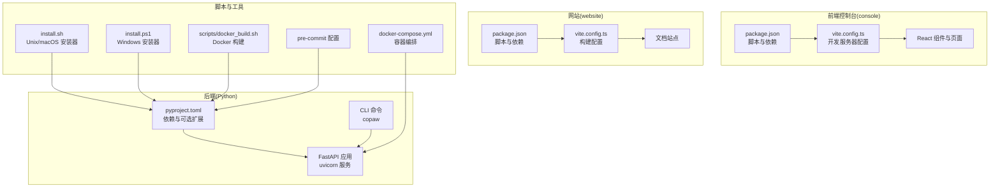
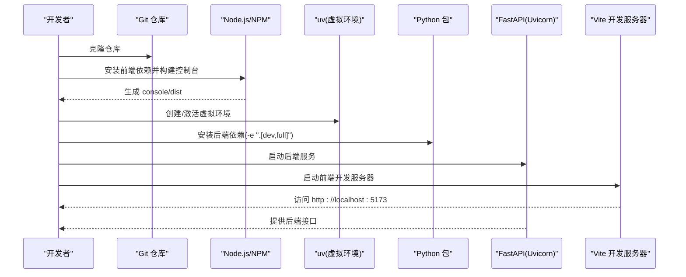
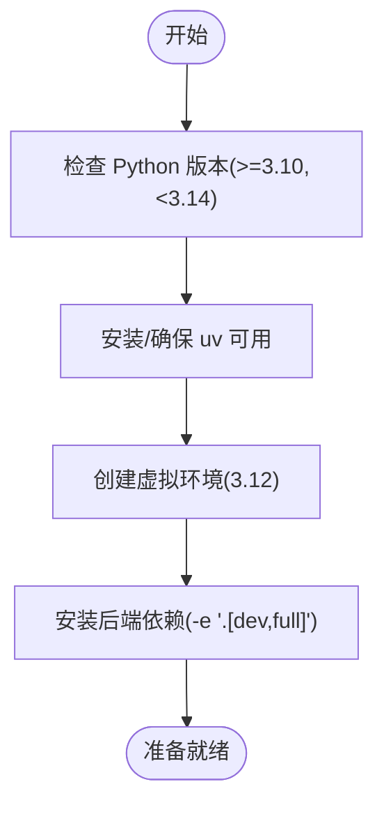
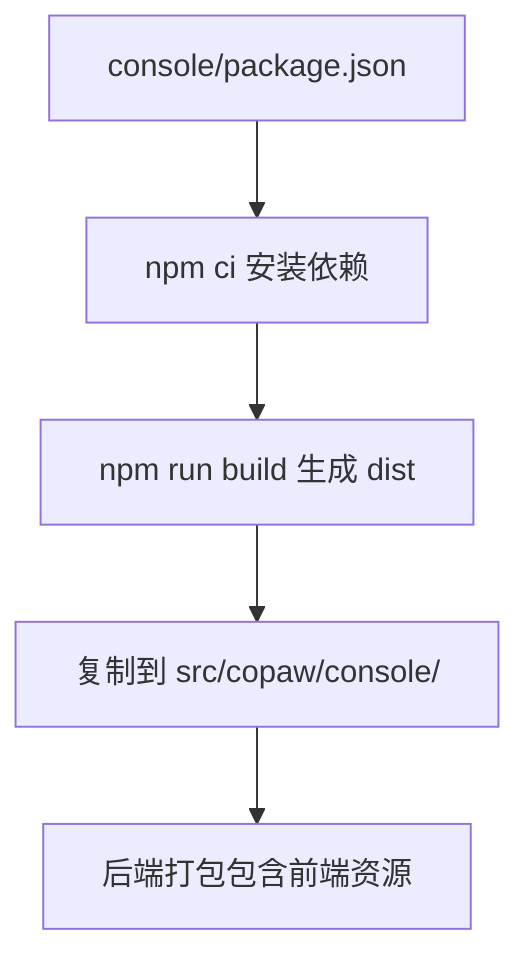
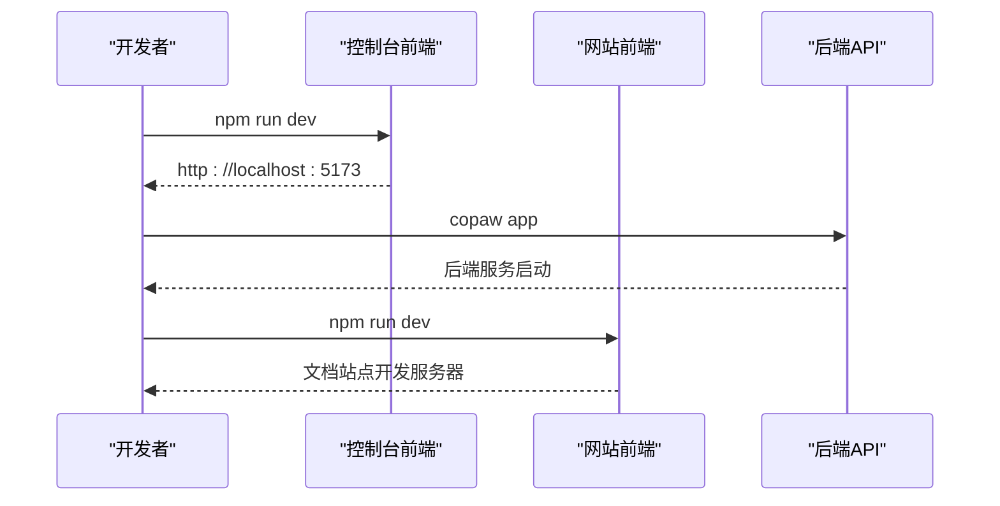
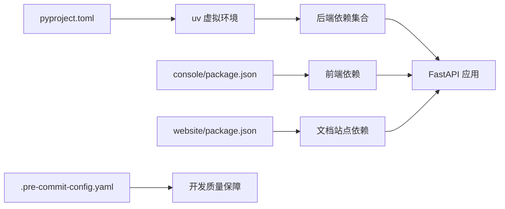

# 开发环境搭建

<cite>
**本文档引用的文件**
- [pyproject.toml](file://pyproject.toml)
- [console/package.json](file://console/package.json)
- [website/package.json](file://website/package.json)
- [console/vite.config.ts](file://console/vite.config.ts)
- [website/vite.config.ts](file://website/vite.config.ts)
- [scripts/install.sh](file://scripts/install.sh)
- [scripts/install.ps1](file://scripts/install.ps1)
- [.pre-commit-config.yaml](file://.pre-commit-config.yaml)
- [docker-compose.yml](file://docker-compose.yml)
- [scripts/docker_build.sh](file://scripts/docker_build.sh)
- [README.md](file://README.md)
- [CONTRIBUTING.md](file://CONTRIBUTING.md)
</cite>

## 目录
1. [简介](#简介)
2. [项目结构](#项目结构)
3. [核心组件](#核心组件)
4. [架构总览](#架构总览)
5. [详细组件分析](#详细组件分析)
6. [依赖关系分析](#依赖关系分析)
7. [性能考虑](#性能考虑)
8. [故障排除指南](#故障排除指南)
9. [结论](#结论)
10. [附录](#附录)

## 简介
本指南面向希望在本地进行 CoPaw 开发的工程师，涵盖以下内容：
- Python 环境要求与依赖安装
- Node.js 环境配置与前端依赖安装
- 项目克隆、虚拟环境创建与依赖安装流程
- 前后端开发服务器启动方法（Vite 开发服务器、FastAPI/Uvicorn 开发服务器）
- IDE 配置建议（VSCode、PyCharm 等）与调试配置
- 断点设置与热重载功能说明
- 常见环境问题排查与解决方案

## 项目结构
CoPaw 采用前后端分离的多包结构：
- 后端：Python 包，提供 FastAPI 应用、CLI、通道与技能管理等
- 前端控制台：React + Vite，位于 console 目录
- 网站文档：React + Vite，位于 website 目录
- 脚本：安装脚本、Docker 构建脚本等

**图表来源**
- [pyproject.toml:1-99](file://pyproject.toml#L1-L99)
- [console/package.json:1-57](file://console/package.json#L1-L57)
- [console/vite.config.ts:1-48](file://console/vite.config.ts#L1-L48)
- [website/package.json:1-36](file://website/package.json#L1-L36)
- [website/vite.config.ts:1-8](file://website/vite.config.ts#L1-L8)
- [scripts/install.sh:1-340](file://scripts/install.sh#L1-L340)
- [scripts/install.ps1:1-477](file://scripts/install.ps1#L1-L477)
- [docker-compose.yml:1-23](file://docker-compose.yml#L1-L23)
- [scripts/docker_build.sh:1-32](file://scripts/docker_build.sh#L1-L32)
- [.pre-commit-config.yaml:1-120](file://.pre-commit-config.yaml#L1-L120)

**章节来源**
- [pyproject.toml:1-99](file://pyproject.toml#L1-L99)
- [console/package.json:1-57](file://console/package.json#L1-L57)
- [website/package.json:1-36](file://website/package.json#L1-L36)
- [console/vite.config.ts:1-48](file://console/vite.config.ts#L1-L48)
- [website/vite.config.ts:1-8](file://website/vite.config.ts#L1-L8)
- [scripts/install.sh:1-340](file://scripts/install.sh#L1-L340)
- [scripts/install.ps1:1-477](file://scripts/install.ps1#L1-L477)
- [docker-compose.yml:1-23](file://docker-compose.yml#L1-L23)
- [scripts/docker_build.sh:1-32](file://scripts/docker_build.sh#L1-L32)
- [.pre-commit-config.yaml:1-120](file://.pre-commit-config.yaml#L1-L120)

## 核心组件
- Python 环境与依赖
  - Python 版本范围：>=3.10,<3.14
  - 可选扩展：dev、local、llamacpp、mlx、ollama、whisper、full
  - 测试与质量工具：pytest、pytest-asyncio、pre-commit、pytest-cov
- 前端控制台
  - Vite 开发服务器，默认端口 5173，允许外网访问
  - React + TypeScript + Ant Design 生态
- 网站文档
  - Vite 构建，支持静态资源与路由
- 安装与运行
  - 提供 Unix/macOS 与 Windows 的自动安装脚本，内置 uv 管理 Python 环境
  - 支持 Docker 一键运行与 compose 编排

**章节来源**
- [pyproject.toml:6-99](file://pyproject.toml#L6-L99)
- [console/package.json:1-57](file://console/package.json#L1-L57)
- [console/vite.config.ts:33-36](file://console/vite.config.ts#L33-L36)
- [website/package.json:1-36](file://website/package.json#L1-L36)
- [website/vite.config.ts:1-8](file://website/vite.config.ts#L1-L8)
- [scripts/install.sh:26-48](file://scripts/install.sh#L26-L48)
- [scripts/install.ps1:29-35](file://scripts/install.ps1#L29-L35)

## 架构总览
开发时的典型工作流：
- 克隆仓库后，先构建前端控制台并复制到后端包中
- 使用 uv 创建隔离的 Python 虚拟环境并安装后端依赖
- 启动后端 FastAPI 服务（uvicorn）
- 启动前端 Vite 开发服务器（console 或 website）

**图表来源**
- [README.md:428-448](file://README.md#L428-L448)
- [console/package.json:6-16](file://console/package.json#L6-L16)
- [console/vite.config.ts:33-36](file://console/vite.config.ts#L33-L36)
- [pyproject.toml:64-91](file://pyproject.toml#L64-L91)

**章节来源**
- [README.md:428-448](file://README.md#L428-L448)
- [console/package.json:6-16](file://console/package.json#L6-L16)
- [console/vite.config.ts:33-36](file://console/vite.config.ts#L33-L36)
- [pyproject.toml:64-91](file://pyproject.toml#L64-L91)

## 详细组件分析

### Python 环境与依赖安装
- Python 版本要求
  - 要求 Python >=3.10 且 <3.14
- 可选依赖
  - dev：开发与测试工具
  - local：本地模型相关
  - llamacpp、mlx、ollama、whisper：按需启用的扩展
  - full：组合所有扩展
- 安装方式
  - 推荐使用 uv 创建虚拟环境并安装
  - 开发模式可安装完整依赖集

**图表来源**
- [pyproject.toml:6-99](file://pyproject.toml#L6-L99)
- [scripts/install.sh:104-147](file://scripts/install.sh#L104-L147)
- [scripts/install.ps1:85-209](file://scripts/install.ps1#L85-L209)

**章节来源**
- [pyproject.toml:6-99](file://pyproject.toml#L6-L99)
- [scripts/install.sh:104-147](file://scripts/install.sh#L104-L147)
- [scripts/install.ps1:85-209](file://scripts/install.ps1#L85-L209)

### Node.js 环境与前端依赖
- 控制台前端(console)
  - 使用 Vite 开发服务器，默认 host=0.0.0.0，端口 5173
  - 通过 package.json 中的 scripts 管理开发、构建与预览
- 网站前端(website)
  - 使用 Vite 构建文档站点
- 依赖安装
  - 使用 npm ci 安装依赖
  - 构建后将产物复制到后端包内以供运行时使用

**图表来源**
- [console/package.json:6-16](file://console/package.json#L6-L16)
- [README.md:428-444](file://README.md#L428-L444)

**章节来源**
- [console/package.json:6-16](file://console/package.json#L6-L16)
- [console/vite.config.ts:33-36](file://console/vite.config.ts#L33-L36)
- [website/package.json:5-11](file://website/package.json#L5-L11)
- [website/vite.config.ts:4-7](file://website/vite.config.ts#L4-L7)
- [README.md:428-444](file://README.md#L428-L444)

### 开发服务器启动流程
- 后端(FastAPI/Uvicorn)
  - 使用 copaw CLI 启动应用
  - 默认监听地址与端口由后端配置决定
- 前端(Vite)
  - 控制台：npm run dev（或 pnpm run dev）
  - 网站：npm run dev（或 pnpm run dev）
  - 控制台开发服务器默认端口 5173，允许外网访问

**图表来源**
- [console/package.json:6-16](file://console/package.json#L6-L16)
- [website/package.json:5-11](file://website/package.json#L5-L11)
- [console/vite.config.ts:33-36](file://console/vite.config.ts#L33-L36)
- [README.md:97-107](file://README.md#L97-L107)

**章节来源**
- [console/package.json:6-16](file://console/package.json#L6-L16)
- [website/package.json:5-11](file://website/package.json#L5-L11)
- [console/vite.config.ts:33-36](file://console/vite.config.ts#L33-L36)
- [README.md:97-107](file://README.md#L97-L107)

### IDE 配置建议（VSCode、PyCharm）
- VSCode
  - Python 解释器选择：指向 uv 虚拟环境中的 python
  - 扩展推荐：Python、Pylance、Black、Flake8、pre-commit hooks
  - 调试：配置 Python 调试任务，指向后端入口模块
  - 前端调试：在 VSCode 中打开控制台目录，使用 Live Server 或内置调试
- PyCharm
  - 项目解释器选择：指向 uv 虚拟环境
  - 代码风格：启用 Black、Flake8、pre-commit 集成
  - 运行配置：添加 Python 运行配置，指向 copaw CLI 或后端入口
- 热重载
  - 前端：Vite 默认支持热重载
  - 后端：开发模式下可结合 uvicorn 的自动重启能力

**章节来源**
- [.pre-commit-config.yaml:1-120](file://.pre-commit-config.yaml#L1-L120)
- [CONTRIBUTING.md:68-86](file://CONTRIBUTING.md#L68-L86)

### 调试配置、断点设置与热重载
- 后端调试
  - 使用 IDE 的 Python 调试器附加到 uvicorn 进程
  - 在 copaw CLI 或 FastAPI 应用入口设置断点
- 前端调试
  - 在浏览器中打开控制台前端页面，设置断点
  - Vite 开发服务器支持模块热替换
- 热重载
  - 前端：Vite HMR 自动刷新
  - 后端：结合 pre-commit 与测试命令，确保修改后快速验证

**章节来源**
- [CONTRIBUTING.md:68-86](file://CONTRIBUTING.md#L68-L86)
- [console/vite.config.ts:33-36](file://console/vite.config.ts#L33-L36)

## 依赖关系分析
- 后端依赖
  - 核心：FastAPI 生态（uvicorn）、调度器（apscheduler）、HTTP 客户端（httpx）、模型与推理（transformers、onnxruntime、google-genai 等）
  - 可选扩展：llamacpp、mlx、ollama、whisper 等
- 前端依赖
  - 控制台：React、Ant Design、i18n、Markdown 渲染等
  - 网站：React、Mermaid、路由等
- 工具链
  - 安装：uv（虚拟环境与包管理）
  - 质量：pre-commit、black、flake8、pylint、pytest

**图表来源**
- [pyproject.toml:64-91](file://pyproject.toml#L64-L91)
- [console/package.json:18-54](file://console/package.json#L18-L54)
- [website/package.json:12-34](file://website/package.json#L12-L34)
- [.pre-commit-config.yaml:1-120](file://.pre-commit-config.yaml#L1-L120)

**章节来源**
- [pyproject.toml:64-91](file://pyproject.toml#L64-L91)
- [console/package.json:18-54](file://console/package.json#L18-L54)
- [website/package.json:12-34](file://website/package.json#L12-L34)
- [.pre-commit-config.yaml:1-120](file://.pre-commit-config.yaml#L1-L120)

## 性能考虑
- 前端开发
  - 使用 Vite 的快速冷启动与热重载，减少等待时间
  - 控制台开发服务器默认允许外网访问，便于移动端联调
- 后端开发
  - 使用 uv 与虚拟环境隔离依赖，避免全局污染
  - 按需启用可选扩展，减少不必要的依赖加载
- Docker 开发
  - 使用 docker-compose 快速启动后端服务，便于与外部服务联调

**章节来源**
- [console/vite.config.ts:33-36](file://console/vite.config.ts#L33-L36)
- [docker-compose.yml:9-23](file://docker-compose.yml#L9-L23)

## 故障排除指南
- Python 版本不满足要求
  - 症状：安装失败或运行时报版本错误
  - 处理：使用 uv 创建指定 Python 版本的虚拟环境
- uv 未找到或无法自动安装
  - 症状：安装脚本报错，找不到 uv
  - 处理：手动安装 uv 并将其加入 PATH；Windows 用户可使用 -UvPath 参数
- Node.js 未安装或 npm 不可用
  - 症状：前端依赖安装失败或无法构建
  - 处理：安装 Node.js LTS，并确保 npm 可用；如无源码，控制台 UI 将不可用
- Windows 执行策略限制
  - 症状：PowerShell 报错，脚本无法执行
  - 处理：调整执行策略或使用 CMD 包装器；必要时手动添加路径
- Docker 端口冲突
  - 症状：端口 8088 被占用
  - 处理：修改映射端口或停止占用进程
- 本地模型扩展缺失
  - 症状：启用 llamacpp/MLX/Ollama 后功能异常
  - 处理：根据平台安装对应扩展并重新安装依赖

**章节来源**
- [scripts/install.sh:104-132](file://scripts/install.sh#L104-L132)
- [scripts/install.ps1:68-83](file://scripts/install.ps1#L68-L83)
- [scripts/install.ps1:150-191](file://scripts/install.ps1#L150-L191)
- [scripts/install.ps1:375-450](file://scripts/install.ps1#L375-L450)
- [docker-compose.yml:14-15](file://docker-compose.yml#L14-L15)
- [pyproject.toml:74-91](file://pyproject.toml#L74-L91)

## 结论
通过本指南，您可以在本地完成 CoPaw 的开发环境搭建，包括：
- Python 与 Node.js 环境准备
- 依赖安装与前端构建
- 前后端开发服务器启动
- IDE 调试与热重载配置
- 常见问题排查与解决方案

建议在开发过程中遵循 pre-commit 规范与测试流程，确保代码质量与一致性。

## 附录

### 开发环境搭建步骤清单
- 克隆仓库
- 安装 Node.js 与 npm
- 安装 Python 与 uv
- 创建并激活虚拟环境
- 安装后端依赖（含 dev 与 full）
- 构建前端控制台并复制到后端包
- 启动后端与前端开发服务器

**章节来源**
- [README.md:428-448](file://README.md#L428-L448)
- [console/package.json:6-16](file://console/package.json#L6-L16)
- [pyproject.toml:64-91](file://pyproject.toml#L64-L91)