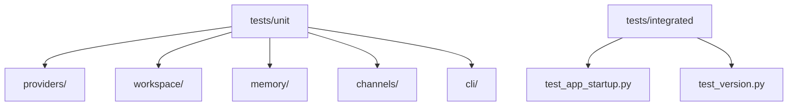
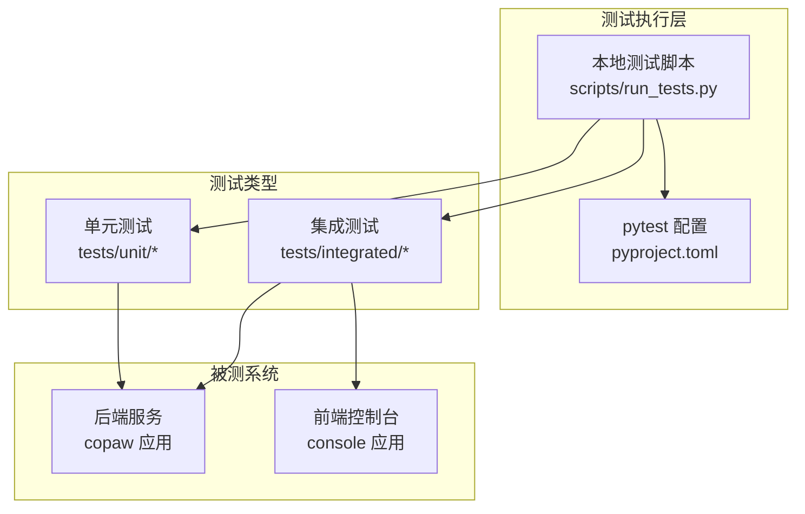
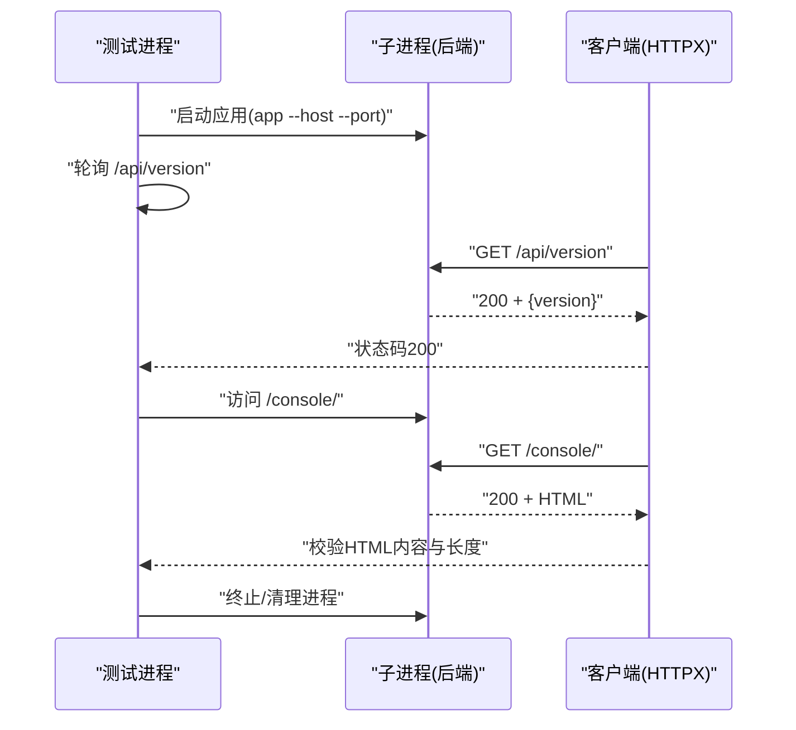
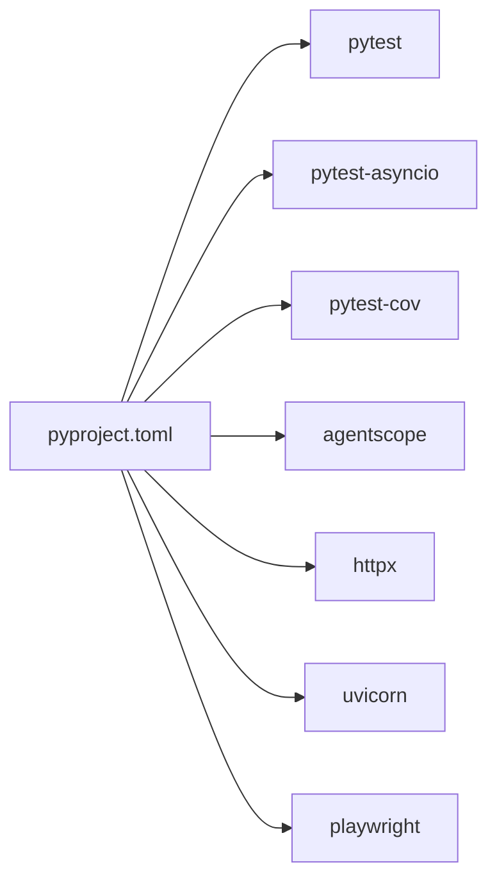

# 测试指南

<cite>
**本文引用的文件**
- [pyproject.toml](file://pyproject.toml)
- [scripts/run_tests.py](file://scripts/run_tests.py)
- [tests/integrated/test_app_startup.py](file://tests/integrated/test_app_startup.py)
- [tests/unit/providers/test_openai_provider.py](file://tests/unit/providers/test_openai_provider.py)
- [tests/unit/workspace/test_workspace.py](file://tests/unit/workspace/test_workspace.py)
- [tests/unit/memory/test_copaw_token_counter.py](file://tests/unit/memory/test_copaw_token_counter.py)
- [tests/unit/cli/test_cli_version.py](file://tests/unit/cli/test_cli_version.py)
- [console/vite.config.ts](file://console/vite.config.ts)
- [console/src/main.tsx](file://console/src/main.tsx)
- [console/src/pages/Chat/sessionApi/index.ts](file://console/src/pages/Chat/sessionApi/index.ts)
</cite>

## 目录
1. [简介](#简介)
2. [项目结构](#项目结构)
3. [核心组件](#核心组件)
4. [架构总览](#架构总览)
5. [详细组件分析](#详细组件分析)
6. [依赖分析](#依赖分析)
7. [性能考虑](#性能考虑)
8. [故障排查指南](#故障排查指南)
9. [结论](#结论)
10. [附录](#附录)

## 简介
本测试指南面向CoPaw项目的开发者与贡献者，系统化阐述测试框架与策略，覆盖单元测试、集成测试与端到端测试的组织方式；详解pytest配置、测试用例编写规范、测试数据管理；给出前端（React Testing Library）与后端测试最佳实践；明确覆盖率要求、持续集成中的测试执行与报告生成；提供测试环境搭建、模拟对象使用与异步测试处理方法，并总结常见问题的调试技巧与性能测试方法。

## 项目结构
CoPaw采用分层清晰的测试目录组织：
- tests/unit：按功能模块划分子目录，如providers、workspace、memory、channels、cli等，便于隔离与并行执行。
- tests/integrated：端到端/集成测试，验证应用启动、API可用性与控制台页面加载等。

图表来源
- [tests/unit/providers/test_openai_provider.py:1-269](file://tests/unit/providers/test_openai_provider.py#L1-L269)
- [tests/unit/workspace/test_workspace.py:1-97](file://tests/unit/workspace/test_workspace.py#L1-L97)
- [tests/integrated/test_app_startup.py:1-133](file://tests/integrated/test_app_startup.py#L1-L133)

章节来源
- [pyproject.toml:93-99](file://pyproject.toml#L93-L99)
- [scripts/run_tests.py:76-173](file://scripts/run_tests.py#L76-L173)

## 核心组件
- 测试运行器：本地脚本scripts/run_tests.py提供统一入口，支持按模块运行、覆盖率生成、并行执行。
- pytest配置：通过pyproject.toml集中配置asyncio模式、标记与默认行为。
- 单元测试：以功能域为单位组织，广泛使用pytest fixtures与monkeypatch进行模拟。
- 集成测试：通过子进程启动应用，验证HTTP接口与静态资源返回。

章节来源
- [scripts/run_tests.py:175-282](file://scripts/run_tests.py#L175-L282)
- [pyproject.toml:93-99](file://pyproject.toml#L93-L99)

## 架构总览
下图展示测试体系在CoPaw中的位置与交互关系：

图表来源
- [scripts/run_tests.py:148-173](file://scripts/run_tests.py#L148-L173)
- [pyproject.toml:93-99](file://pyproject.toml#L93-L99)
- [tests/integrated/test_app_startup.py:33-133](file://tests/integrated/test_app_startup.py#L33-L133)

## 详细组件分析

### 后端pytest配置与标记
- asyncio模式：启用自动asyncio模式与函数级作用域，适配大量异步测试。
- 自定义标记：slow标记用于区分耗时测试，可通过命令行选择性跳过。
- 插件依赖：dev可选依赖包含pytest、pytest-asyncio、pytest-cov，满足覆盖率需求。

章节来源
- [pyproject.toml:93-99](file://pyproject.toml#L93-L99)

### 单元测试组织与示例
- 模块化目录：providers、workspace、memory、channels、cli等子目录对应不同领域。
- 异步测试：大量使用pytest.mark.asyncio与async/await，确保并发场景正确性。
- 模拟与断言：通过monkeypatch替换内部依赖、构造Fake对象，验证输入输出与副作用。

示例文件路径
- [tests/unit/providers/test_openai_provider.py:1-269](file://tests/unit/providers/test_openai_provider.py#L1-L269)
- [tests/unit/workspace/test_workspace.py:1-97](file://tests/unit/workspace/test_workspace.py#L1-L97)
- [tests/unit/memory/test_copaw_token_counter.py:1-393](file://tests/unit/memory/test_copaw_token_counter.py#L1-L393)
- [tests/unit/cli/test_cli_version.py:1-13](file://tests/unit/cli/test_cli_version.py#L1-L13)

章节来源
- [tests/unit/providers/test_openai_provider.py:21-149](file://tests/unit/providers/test_openai_provider.py#L21-L149)
- [tests/unit/workspace/test_workspace.py:8-80](file://tests/unit/workspace/test_workspace.py#L8-L80)
- [tests/unit/memory/test_copaw_token_counter.py:171-234](file://tests/unit/memory/test_copaw_token_counter.py#L171-L234)
- [tests/unit/cli/test_cli_version.py:8-13](file://tests/unit/cli/test_cli_version.py#L8-L13)

### 集成测试：应用启动与控制台访问
- 子进程启动：通过Python子进程启动copaw应用，监听随机空闲端口。
- 健康检查：轮询/api/version确认后端就绪；随后访问/console/验证HTML响应。
- 资源清理：异常或超时后终止子进程，避免僵尸进程。

图表来源
- [tests/integrated/test_app_startup.py:33-133](file://tests/integrated/test_app_startup.py#L33-L133)

章节来源
- [tests/integrated/test_app_startup.py:33-133](file://tests/integrated/test_app_startup.py#L33-L133)

### 前端测试最佳实践（React Testing Library）
- Vite开发服务器：前端通过vite.config.ts配置开发服务器与别名，便于本地联调。
- 控制台入口：console/src/main.tsx对console错误与警告进行过滤，减少无关噪音。
- 会话API去重：console/src/pages/Chat/sessionApi/index.ts中实现请求去重逻辑，提升并发稳定性。

章节来源
- [console/vite.config.ts:1-47](file://console/vite.config.ts#L1-L47)
- [console/src/main.tsx:1-30](file://console/src/main.tsx#L1-L30)
- [console/src/pages/Chat/sessionApi/index.ts:354-393](file://console/src/pages/Chat/sessionApi/index.ts#L354-L393)

### 测试数据管理与模拟对象
- 模拟外部依赖：通过monkeypatch替换类属性或模块常量，注入Fake对象或异常，验证错误分支。
- 全局缓存清理：针对全局缓存型组件（如token计数器），在测试前清理缓存，保证测试隔离。
- 异步模拟：使用异步迭代器或返回空流的Fake对象，验证异步连接与模型检测流程。

章节来源
- [tests/unit/providers/test_openai_provider.py:21-149](file://tests/unit/providers/test_openai_provider.py#L21-L149)
- [tests/unit/memory/test_copaw_token_counter.py:39-42](file://tests/unit/memory/test_copaw_token_counter.py#L39-L42)

### 异步测试处理方法
- 标记与作用域：pytest.mark.asyncio与函数级作用域确保事件循环正确初始化与释放。
- 并发与去重：前端会话API中通过Map与Promise实现并发请求去重，避免重复网络请求与状态污染。
- 超时与重试：集成测试中使用固定超时与指数退避式等待，结合日志采集定位启动失败原因。

章节来源
- [tests/unit/workspace/test_workspace.py:8-80](file://tests/unit/workspace/test_workspace.py#L8-L80)
- [console/src/pages/Chat/sessionApi/index.ts:354-393](file://console/src/pages/Chat/sessionApi/index.ts#L354-L393)
- [tests/integrated/test_app_startup.py:67-104](file://tests/integrated/test_app_startup.py#L67-L104)

## 依赖分析
- 运行时依赖：后端主要依赖agentscope、httpx、uvicorn、apscheduler、playwright等，为测试提供真实运行环境。
- 开发依赖：pytest、pytest-asyncio、pytest-cov构成测试框架与覆盖率工具链。
- 可选依赖：llamacpp、mlx、ollama、whisper等，用于扩展模型与语音能力，测试时可按需安装。

图表来源
- [pyproject.toml:64-91](file://pyproject.toml#L64-L91)

章节来源
- [pyproject.toml:6-36](file://pyproject.toml#L6-L36)
- [pyproject.toml:64-91](file://pyproject.toml#L64-L91)

## 性能考虑
- 并行执行：本地测试脚本支持pytest-xdist并行，建议在多核环境下开启以缩短总时长。
- 覆盖率报告：启用HTML与缺失行报告，便于识别未覆盖路径并优化测试矩阵。
- 异步与并发：合理拆分异步用例，避免长时间阻塞；前端请求去重降低重复开销。
- 集成测试超时：设置合理的最大等待时间与错误回传，平衡稳定性与速度。

章节来源
- [scripts/run_tests.py:156-166](file://scripts/run_tests.py#L156-L166)
- [tests/integrated/test_app_startup.py:67-104](file://tests/integrated/test_app_startup.py#L67-L104)

## 故障排查指南
- 依赖缺失：本地测试脚本会在未安装pytest时提示安装命令，优先安装dev与full可选依赖。
- 启动失败：集成测试会收集最近日志片段，若出现ImportError/ModuleNotFoundError，优先检查可选依赖与平台兼容性。
- 并发问题：前端会话API中存在请求去重逻辑，若出现状态不一致，检查临时ID解析回调与URL同步。
- 超时与退出：子进程提前退出时，测试会输出最后若干行日志，结合状态码与异常信息定位根因。

章节来源
- [scripts/run_tests.py:222-227](file://scripts/run_tests.py#L222-L227)
- [tests/integrated/test_app_startup.py:76-84](file://tests/integrated/test_app_startup.py#L76-L84)
- [console/src/pages/Chat/sessionApi/index.ts:354-393](file://console/src/pages/Chat/sessionApi/index.ts#L354-L393)

## 结论
CoPaw的测试体系以pytest为核心，配合本地测试脚本与可选依赖，形成从单元到集成的完整闭环。通过模块化组织、异步测试与模拟对象，以及前端请求去重等工程实践，既保证了测试效率，也提升了稳定性。建议在CI中启用覆盖率报告与并行执行，并对慢测试使用标记进行选择性运行。

## 附录

### 测试策略与组织
- 单元测试：按功能域划分目录，使用pytest-asyncio与monkeypatch，覆盖正常/异常/边界路径。
- 集成测试：验证应用启动、API可用性与控制台页面加载，关注超时与日志采集。
- 端到端测试：可基于playwright在CI中补充浏览器自动化场景（当前仓库未包含E2E测试文件）。

章节来源
- [tests/integrated/test_app_startup.py:33-133](file://tests/integrated/test_app_startup.py#L33-L133)

### 覆盖率要求与CI执行
- 覆盖率生成：本地脚本支持生成HTML与缺失行报告，默认对src/copaw包统计。
- CI建议：在CI中固定Python版本与依赖，启用并行执行与覆盖率上传，结合PR评论与工件归档。

章节来源
- [scripts/run_tests.py:156-166](file://scripts/run_tests.py#L156-L166)
- [pyproject.toml:64-70](file://pyproject.toml#L64-L70)

### 测试环境搭建
- 安装开发依赖：pip install -e ".[dev,full]"
- 运行全部测试：python scripts/run_tests.py
- 仅运行某模块：python scripts/run_tests.py -u providers
- 生成覆盖率：python scripts/run_tests.py -a -c
- 并行执行：python scripts/run_tests.py -p

章节来源
- [scripts/run_tests.py:175-282](file://scripts/run_tests.py#L175-L282)