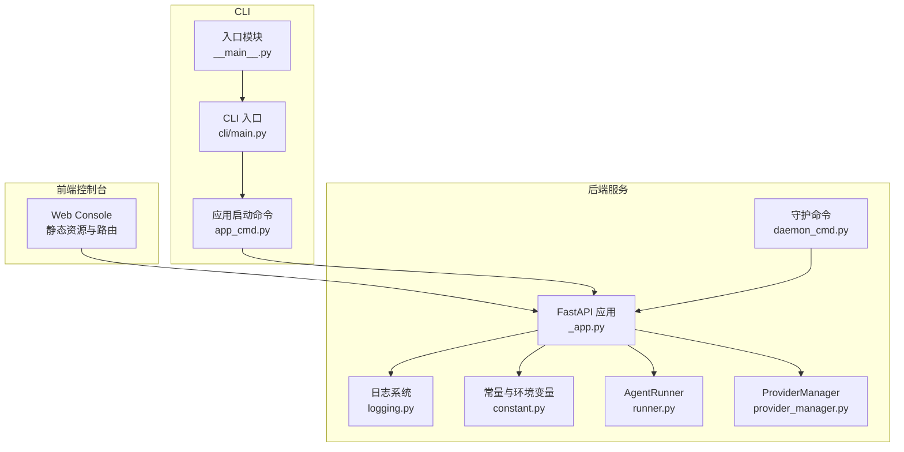
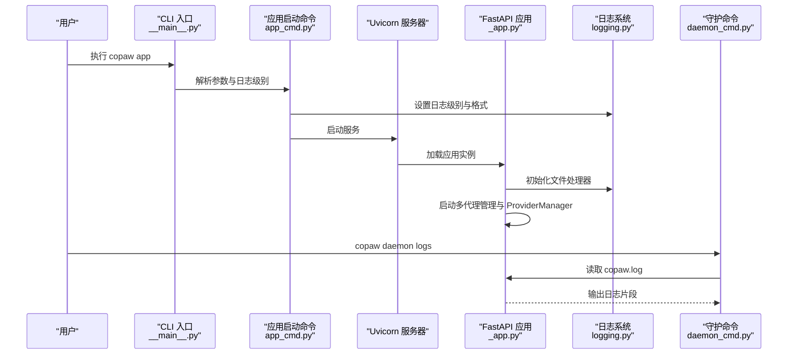
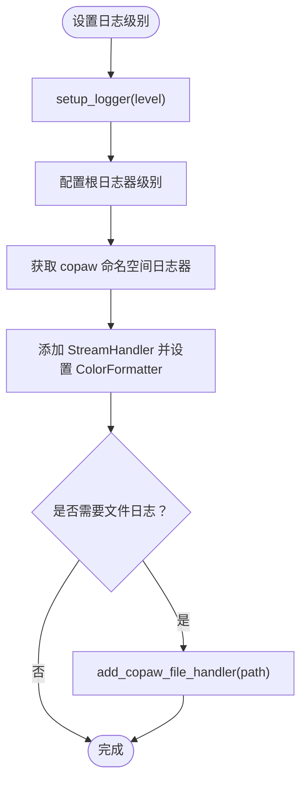
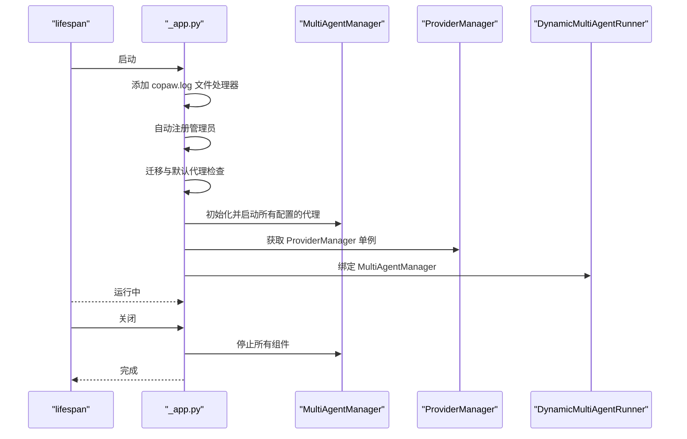
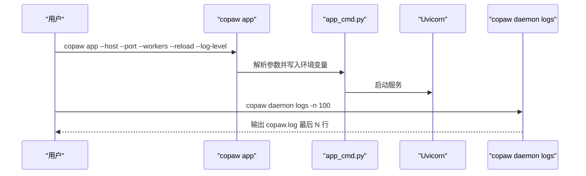
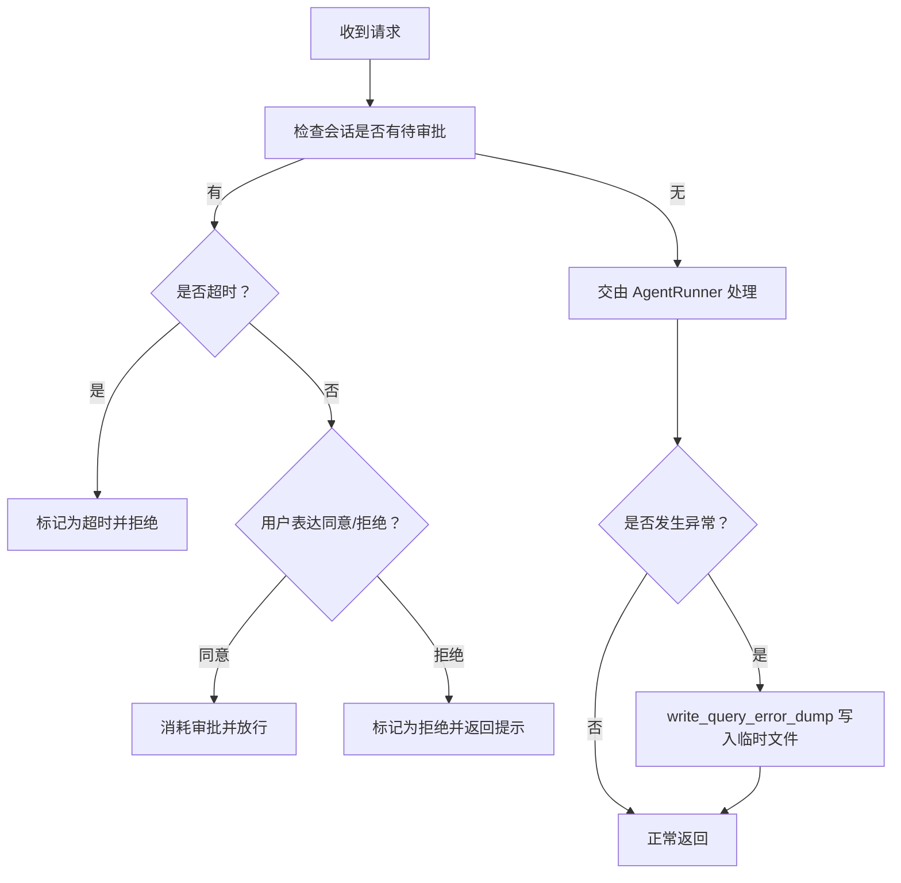
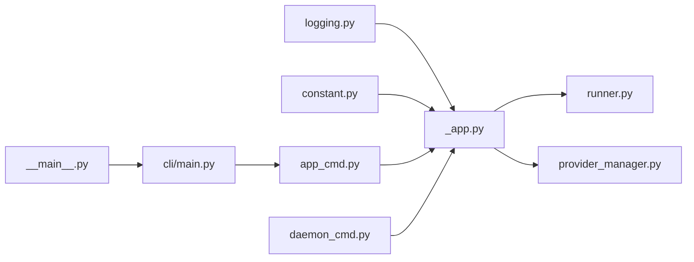

# 调试与故障排除

<cite>
**本文引用的文件**
- [src/copaw/utils/logging.py](file://src/copaw/utils/logging.py)
- [src/copaw/app/_app.py](file://src/copaw/app/_app.py)
- [src/copaw/constant.py](file://src/copaw/constant.py)
- [src/copaw/cli/app_cmd.py](file://src/copaw/cli/app_cmd.py)
- [src/copaw/cli/daemon_cmd.py](file://src/copaw/cli/daemon_cmd.py)
- [src/copaw/app/runner/runner.py](file://src/copaw/app/runner/runner.py)
- [src/copaw/providers/provider_manager.py](file://src/copaw/providers/provider_manager.py)
- [src/copaw/app/runner/query_error_dump.py](file://src/copaw/app/runner/query_error_dump.py)
- [src/copaw/app/agent_config_watcher.py](file://src/copaw/app/agent_config_watcher.py)
- [src/copaw/__main__.py](file://src/copaw/__main__.py)
- [src/copaw/cli/main.py](file://src/copaw/cli/main.py)
- [README.md](file://README.md)
</cite>

## 目录
1. [简介](#简介)
2. [项目结构](#项目结构)
3. [核心组件](#核心组件)
4. [架构总览](#架构总览)
5. [详细组件分析](#详细组件分析)
6. [依赖分析](#依赖分析)
7. [性能考虑](#性能考虑)
8. [故障排除指南](#故障排除指南)
9. [结论](#结论)
10. [附录](#附录)

## 简介
本指南面向使用者与维护者，系统化介绍 CoPaw 的调试与故障排除方法，覆盖日志体系、常见问题诊断、开发工具使用、性能分析与资源监控、错误信息与堆栈分析、以及如何收集诊断信息与提交有效 Bug 报告。内容基于仓库中的实际实现与文档，确保可操作性与准确性。

## 项目结构
CoPaw 采用“Python 后端 + 前端控制台”的分层架构：后端通过 FastAPI 提供 API 与 Web Console；CLI 负责应用启动、守护进程命令与日志查看；日志系统统一由 Python 模块管理；运行期通过多工作区/多代理机制承载不同会话与能力。

图表来源
- [src/copaw/app/_app.py:241-409](file://src/copaw/app/_app.py#L241-L409)
- [src/copaw/utils/logging.py:104-185](file://src/copaw/utils/logging.py#L104-L185)
- [src/copaw/constant.py:72-121](file://src/copaw/constant.py#L72-L121)
- [src/copaw/app/runner/runner.py:63-200](file://src/copaw/app/runner/runner.py#L63-L200)
- [src/copaw/providers/provider_manager.py:1-200](file://src/copaw/providers/provider_manager.py#L1-L200)
- [src/copaw/cli/daemon_cmd.py:105-124](file://src/copaw/cli/daemon_cmd.py#L105-L124)
- [src/copaw/cli/app_cmd.py:54-94](file://src/copaw/cli/app_cmd.py#L54-L94)
- [src/copaw/__main__.py:1-7](file://src/copaw/__main__.py#L1-L7)
- [src/copaw/cli/main.py:130-173](file://src/copaw/cli/main.py#L130-L173)

章节来源
- [src/copaw/app/_app.py:241-409](file://src/copaw/app/_app.py#L241-L409)
- [src/copaw/utils/logging.py:104-185](file://src/copaw/utils/logging.py#L104-L185)
- [src/copaw/constant.py:72-121](file://src/copaw/constant.py#L72-L121)
- [src/copaw/cli/app_cmd.py:54-94](file://src/copaw/cli/app_cmd.py#L54-L94)
- [src/copaw/cli/daemon_cmd.py:105-124](file://src/copaw/cli/daemon_cmd.py#L105-L124)
- [src/copaw/__main__.py:1-7](file://src/copaw/__main__.py#L1-L7)
- [src/copaw/cli/main.py:130-173](file://src/copaw/cli/main.py#L130-L173)

## 核心组件
- 日志系统：统一命名空间、彩色终端输出、可选文件落盘、访问日志过滤。
- 应用生命周期：启动、迁移、多代理管理、关闭清理。
- CLI 与守护：应用启动、守护状态/重启/重载配置/版本/日志查看。
- 运行器：消息处理、工具调用审批、错误转储。
- 提供商管理：统一模型提供商注册与默认提供商定义。
- 常量与环境：工作目录、日志级别、CORS、LLM 重试等。

章节来源
- [src/copaw/utils/logging.py:104-185](file://src/copaw/utils/logging.py#L104-L185)
- [src/copaw/app/_app.py:148-239](file://src/copaw/app/_app.py#L148-L239)
- [src/copaw/cli/app_cmd.py:54-94](file://src/copaw/cli/app_cmd.py#L54-L94)
- [src/copaw/cli/daemon_cmd.py:53-124](file://src/copaw/cli/daemon_cmd.py#L53-L124)
- [src/copaw/app/runner/runner.py:63-200](file://src/copaw/app/runner/runner.py#L63-L200)
- [src/copaw/providers/provider_manager.py:1-200](file://src/copaw/providers/provider_manager.py#L1-L200)
- [src/copaw/constant.py:72-121](file://src/copaw/constant.py#L72-L121)

## 架构总览
下图展示从 CLI 到后端服务、日志与守护命令的关键交互路径，帮助快速定位问题来源。

图表来源
- [src/copaw/__main__.py:1-7](file://src/copaw/__main__.py#L1-L7)
- [src/copaw/cli/app_cmd.py:54-94](file://src/copaw/cli/app_cmd.py#L54-L94)
- [src/copaw/app/_app.py:148-239](file://src/copaw/app/_app.py#L148-L239)
- [src/copaw/utils/logging.py:142-185](file://src/copaw/utils/logging.py#L142-L185)
- [src/copaw/cli/daemon_cmd.py:105-124](file://src/copaw/cli/daemon_cmd.py#L105-L124)

## 详细组件分析

### 日志系统与使用方法
- 日志命名空间：仅输出 copaw.* 命名空间下的日志，避免第三方库噪声。
- 终端输出：彩色格式，包含时间戳、级别、源文件与行号；非终端输出自动去色。
- 文件落盘：按平台选择 FileHandler 或 RotatingFileHandler，最大 5MiB，保留 3 份备份；Windows/Linux 使用简单文件句柄以避免锁问题。
- 访问日志过滤：可按路径子串抑制 uvicorn access 日志，减少噪音。
- 日志级别：支持 critical/error/warning/info/debug/trace；trace 为更细粒度调试。
- 关键日志点：
  - 应用启动完成、停止完成
  - 多代理管理初始化与停止
  - ProviderManager 获取实例
  - 动态多代理运行器查询与错误回传
  - 配置变更与通道重载

图表来源
- [src/copaw/utils/logging.py:104-185](file://src/copaw/utils/logging.py#L104-L185)

章节来源
- [src/copaw/utils/logging.py:104-185](file://src/copaw/utils/logging.py#L104-L185)
- [src/copaw/app/_app.py:148-239](file://src/copaw/app/_app.py#L148-L239)
- [src/copaw/cli/app_cmd.py:54-94](file://src/copaw/cli/app_cmd.py#L54-L94)

### 应用生命周期与关键日志点
- 生命周期钩子：lifespan 在启动阶段注册管理员、初始化多代理管理器、ProviderManager，并在关闭时停止所有组件。
- 关键日志点：
  - 检查遗留配置迁移
  - 初始化 MultiAgentManager
  - ProviderManager 单例获取
  - 动态多代理运行器设置与查询
  - 应用启动/停止完成

图表来源
- [src/copaw/app/_app.py:148-239](file://src/copaw/app/_app.py#L148-L239)

章节来源
- [src/copaw/app/_app.py:148-239](file://src/copaw/app/_app.py#L148-L239)

### CLI 启动与守护命令
- 应用启动命令：解析 host/port、workers、reload、log-level；持久化最后使用的 API 地址；根据 log-level 决定是否输出初始化耗时；可隐藏特定访问日志路径。
- 守护命令：status/restart/reload-config/version/logs；logs 支持指定行数范围（1..2000）。

图表来源
- [src/copaw/cli/app_cmd.py:54-94](file://src/copaw/cli/app_cmd.py#L54-L94)
- [src/copaw/cli/daemon_cmd.py:105-124](file://src/copaw/cli/daemon_cmd.py#L105-L124)

章节来源
- [src/copaw/cli/app_cmd.py:54-94](file://src/copaw/cli/app_cmd.py#L54-L94)
- [src/copaw/cli/daemon_cmd.py:53-124](file://src/copaw/cli/daemon_cmd.py#L53-L124)

### 运行器与错误转储
- AgentRunner：处理消息、解析待审批工具调用、超时/批准/拒绝逻辑；对错误进行转储，包含请求上下文、异常类型/消息、堆栈与代理状态快照。
- 错误转储文件：临时文件，包含 UTC 时间戳、请求摘要、完整请求对象、代理状态序列化结果与堆栈字符串。

图表来源
- [src/copaw/app/runner/runner.py:97-174](file://src/copaw/app/runner/runner.py#L97-L174)
- [src/copaw/app/runner/query_error_dump.py:48-104](file://src/copaw/app/runner/query_error_dump.py#L48-L104)

章节来源
- [src/copaw/app/runner/runner.py:97-174](file://src/copaw/app/runner/runner.py#L97-L174)
- [src/copaw/app/runner/query_error_dump.py:48-104](file://src/copaw/app/runner/query_error_dump.py#L48-L104)

### 提供商管理与模型路由
- ProviderManager：集中管理内置与自定义提供商，提供统一接口；内置多种提供商与默认模型列表；支持本地模型后端。
- 关键点：默认提供商定义、模型槽位配置、连接检查与冻结 URL 等策略。

章节来源
- [src/copaw/providers/provider_manager.py:1-200](file://src/copaw/providers/provider_manager.py#L1-L200)

### 配置变更监听与通道热重载
- AgentConfigWatcher：比较通道配置哈希，发现变化则逐个通道重载，记录日志便于追踪。

章节来源
- [src/copaw/app/agent_config_watcher.py:179-214](file://src/copaw/app/agent_config_watcher.py#L179-L214)

## 依赖分析
- 日志系统依赖 Python 标准库 logging 与 handlers；在 Windows 上启用 ANSI 支持；按平台选择文件处理器。
- 应用依赖 FastAPI、CORSMiddleware、静态资源挂载；在启动时加载环境变量与配置。
- CLI 依赖 Click；守护命令依赖运行时上下文与工作目录。
- 运行器依赖 agentscope 的 Runner 接口与消息协议；错误转储依赖临时文件与 JSON 序列化。
- 提供商管理依赖 agentscope 的 ChatModelBase 与各提供商实现。

图表来源
- [src/copaw/utils/logging.py:104-185](file://src/copaw/utils/logging.py#L104-L185)
- [src/copaw/app/_app.py:241-409](file://src/copaw/app/_app.py#L241-L409)
- [src/copaw/constant.py:72-121](file://src/copaw/constant.py#L72-L121)
- [src/copaw/app/runner/runner.py:63-200](file://src/copaw/app/runner/runner.py#L63-L200)
- [src/copaw/providers/provider_manager.py:1-200](file://src/copaw/providers/provider_manager.py#L1-L200)
- [src/copaw/cli/main.py:130-173](file://src/copaw/cli/main.py#L130-L173)
- [src/copaw/cli/app_cmd.py:54-94](file://src/copaw/cli/app_cmd.py#L54-L94)
- [src/copaw/cli/daemon_cmd.py:105-124](file://src/copaw/cli/daemon_cmd.py#L105-L124)
- [src/copaw/__main__.py:1-7](file://src/copaw/__main__.py#L1-L7)

章节来源
- [src/copaw/utils/logging.py:104-185](file://src/copaw/utils/logging.py#L104-L185)
- [src/copaw/app/_app.py:241-409](file://src/copaw/app/_app.py#L241-L409)
- [src/copaw/constant.py:72-121](file://src/copaw/constant.py#L72-L121)
- [src/copaw/app/runner/runner.py:63-200](file://src/copaw/app/runner/runner.py#L63-L200)
- [src/copaw/providers/provider_manager.py:1-200](file://src/copaw/providers/provider_manager.py#L1-L200)
- [src/copaw/cli/main.py:130-173](file://src/copaw/cli/main.py#L130-L173)
- [src/copaw/cli/app_cmd.py:54-94](file://src/copaw/cli/app_cmd.py#L54-L94)
- [src/copaw/cli/daemon_cmd.py:105-124](file://src/copaw/cli/daemon_cmd.py#L105-L124)
- [src/copaw/__main__.py:1-7](file://src/copaw/__main__.py#L1-L7)

## 性能考虑
- 日志级别：生产环境建议 info；调试时使用 debug/trace，注意 trace 会产生大量日志。
- 访问日志过滤：通过 hide-access-paths 减少高频接口日志干扰。
- 多工作区与多代理：合理设置 workers 与内存阈值，避免并发过高导致抖动。
- 模型提供商：合理配置 LLM 重试次数与退避参数，避免瞬时错误放大。
- 静态资源：确保 MIME 类型正确，避免浏览器重复下载或缓存问题。

## 故障排除指南

### 通用诊断流程
- 确认日志级别与输出位置：使用 copaw app --log-level debug/trace，观察控制台与 copaw.log。
- 查看最近日志：copaw daemon logs -n 200，定位异常时间段。
- 检查工作目录与权限：确认 WORKING_DIR 可写，媒体与模型目录存在。
- 验证环境变量：COPAW_LOG_LEVEL、COPAW_CORS_ORIGINS、COPAW_LLM_MAX_RETRIES 等。

章节来源
- [src/copaw/cli/app_cmd.py:54-94](file://src/copaw/cli/app_cmd.py#L54-L94)
- [src/copaw/cli/daemon_cmd.py:105-124](file://src/copaw/cli/daemon_cmd.py#L105-L124)
- [src/copaw/constant.py:72-121](file://src/copaw/constant.py#L72-L121)

### 代理无法启动
- 症状：应用启动后无响应或报错退出。
- 排查步骤：
  - 提升日志级别到 debug/trace，观察启动阶段日志（迁移、多代理初始化、ProviderManager 获取）。
  - 检查工作目录是否存在、权限是否足够。
  - 若使用容器，确认数据卷挂载与端口映射正确。
  - 关注应用生命周期日志点：启动完成、停止完成。
- 相关日志点
  - 启动阶段：迁移与默认代理检查、MultiAgentManager 初始化、ProviderManager 获取。
  - 停止阶段：停止 MultiAgentManager。

章节来源
- [src/copaw/app/_app.py:177-239](file://src/copaw/app/_app.py#L177-L239)

### 渠道连接失败
- 症状：特定渠道无法接收/发送消息，或出现 HTTP 错误。
- 排查步骤：
  - 确认渠道配置（如 token、URL、代理）正确。
  - 查看渠道相关日志与错误转储文件（若产生）。
  - 对于 QQ 等渠道，关注 HTTP 请求与响应体截断信息。
- 相关日志点
  - 渠道配置变更与重载（AgentConfigWatcher）。
  - 运行器处理消息与工具调用审批。

章节来源
- [src/copaw/app/agent_config_watcher.py:179-214](file://src/copaw/app/agent_config_watcher.py#L179-L214)
- [src/copaw/app/runner/runner.py:97-174](file://src/copaw/app/runner/runner.py#L97-L174)

### 模型调用异常
- 症状：调用提供商失败、超时、返回空结果。
- 排查步骤：
  - 检查 API Key、Base URL、代理设置。
  - 调整 LLM 重试次数与退避参数。
  - 使用 ProviderManager 的连接检查能力（如可用）。
  - 观察运行器错误转储，提取请求上下文与堆栈。
- 相关日志点
  - ProviderManager 单例获取。
  - AgentRunner 查询处理与错误转储。

章节来源
- [src/copaw/providers/provider_manager.py:1-200](file://src/copaw/providers/provider_manager.py#L1-L200)
- [src/copaw/app/runner/runner.py:97-174](file://src/copaw/app/runner/runner.py#L97-L174)
- [src/copaw/app/runner/query_error_dump.py:48-104](file://src/copaw/app/runner/query_error_dump.py#L48-L104)

### 开发工具使用
- 浏览器开发者工具
  - Network：观察 API 请求/响应、CORS、WebSocket 连接。
  - Console：查看前端错误与警告。
  - Application/Storage：检查缓存、Cookie、本地存储。
- Python 调试器
  - 使用断点定位运行器 query_handler、工具调用审批与错误转储路径。
  - 结合日志级别 trace 获取更细粒度调用链。
- 网络抓包工具
  - 使用 Wireshark/Charles/Fiddler 抓取渠道与提供商通信，核对认证头、代理设置与超时。

### 性能分析与资源监控
- 日志采样：在 debug/trace 下采集启动与关键路径日志，结合 copaw.log 分析瓶颈。
- 进程监控：观察 CPU、内存、文件描述符数量；容器环境下关注容器资源限制。
- 模型调用：统计请求耗时、重试次数与成功率，优化重试策略。
- 前端性能：利用浏览器性能面板分析渲染与网络瀑布。

### 错误信息解读与堆栈跟踪
- 错误转储：当运行器捕获异常时，会生成临时 JSON 文件，包含：
  - 异常类型与消息
  - 请求摘要（会话、用户、渠道）
  - 完整请求对象
  - 代理状态快照
  - UTC 时间戳与堆栈字符串
- 建议：在提交 Bug 报告前，附上对应时间段的日志与错误转储文件路径。

章节来源
- [src/copaw/app/runner/query_error_dump.py:48-104](file://src/copaw/app/runner/query_error_dump.py#L48-L104)

### 如何收集诊断信息与提交有效 Bug 报告
- 必备信息
  - 版本号：copaw --version 或 /api/version
  - 日志级别与日志片段（至少 200 行）
  - 错误转储文件（如有）
  - 配置文件（脱敏敏感信息）
  - 操作系统与部署方式（本地/容器/桌面应用）
- 提交渠道
  - 参考项目文档中的贡献与问题反馈说明，按模板填写。

章节来源
- [README.md:381-384](file://README.md#L381-L384)

## 结论
通过统一的日志体系、清晰的生命周期钩子、完善的 CLI 与守护命令、以及运行期错误转储机制，CoPaw 能够在复杂场景下提供可靠的调试与故障排除能力。建议在日常运维中固定使用 info 级别，按需开启 debug/trace，并配合守护命令与错误转储文件进行问题定位与报告。

## 附录
- 常用命令
  - 启动应用：copaw app --host --port --workers --reload --log-level
  - 查看日志：copaw daemon logs -n 200
  - 版本信息：copaw daemon version
  - 重载配置：copaw daemon reload-config
- 关键环境变量
  - COPAW_LOG_LEVEL：日志级别
  - COPAW_CORS_ORIGINS：允许的跨域来源
  - COPAW_LLM_MAX_RETRIES：LLM 最大重试次数
  - COPAW_WORKING_DIR：工作目录
  - PLAYWRIGHT_CHROMIUM_EXECUTABLE_PATH：Playwright 可执行路径（容器场景）

章节来源
- [src/copaw/constant.py:72-201](file://src/copaw/constant.py#L72-L201)
- [src/copaw/cli/app_cmd.py:54-94](file://src/copaw/cli/app_cmd.py#L54-L94)
- [src/copaw/cli/daemon_cmd.py:92-124](file://src/copaw/cli/daemon_cmd.py#L92-L124)
- [README.md:381-384](file://README.md#L381-L384)