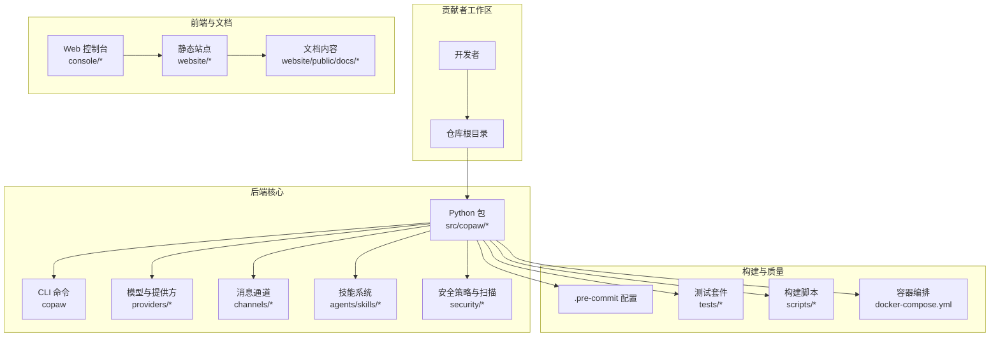
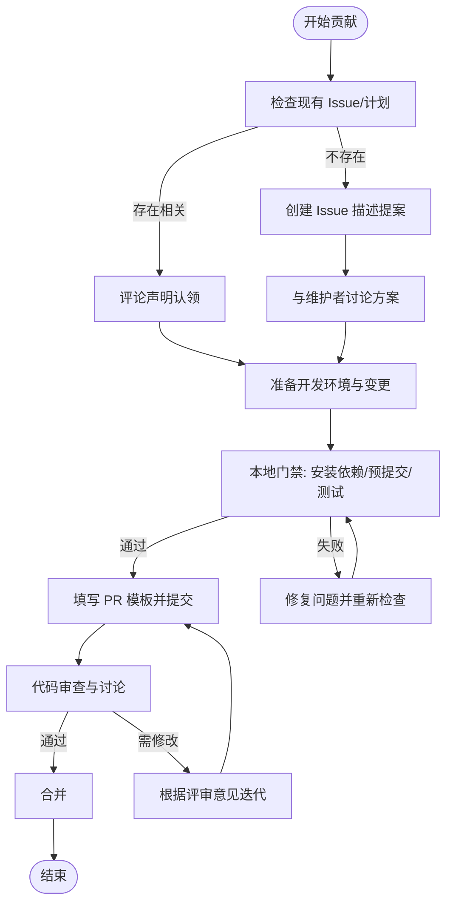
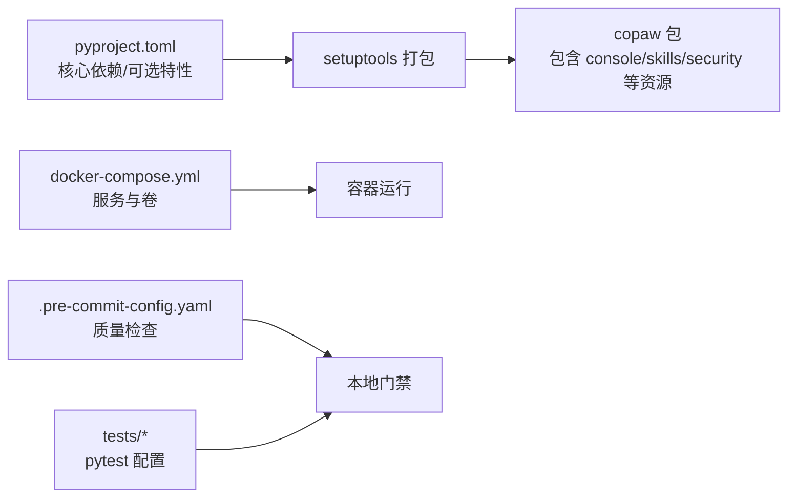

# 贡献流程

<cite>
**本文引用的文件**   
- [CONTRIBUTING.md](file://CONTRIBUTING.md)
- [CONTRIBUTING_zh.md](file://CONTRIBUTING_zh.md)
- [.github/PULL_REQUEST_TEMPLATE.md](file://.github/PULL_REQUEST_TEMPLATE.md)
- [SECURITY.md](file://SECURITY.md)
- [.pre-commit-config.yaml](file://.pre-commit-config.yaml)
- [pyproject.toml](file://pyproject.toml)
- [docker-compose.yml](file://docker-compose.yml)
- [scripts/README.md](file://scripts/README.md)
- [website/README.md](file://website/README.md)
- [src/copaw/security/skill_scanner/data/default_policy.yaml](file://src/copaw/security/skill_scanner/data/default_policy.yaml)
- [src/copaw/security/tool_guard/rules/dangerous_shell_commands.yaml](file://src/copaw/security/tool_guard/rules/dangerous_shell_commands.yaml)
</cite>

## 目录
1. [简介](#简介)
2. [项目结构](#项目结构)
3. [核心组件](#核心组件)
4. [架构总览](#架构总览)
5. [详细组件分析](#详细组件分析)
6. [依赖分析](#依赖分析)
7. [性能考虑](#性能考虑)
8. [故障排查指南](#故障排查指南)
9. [结论](#结论)
10. [附录](#附录)

## 简介
本文件为 CoPaw 的完整贡献流程文档，覆盖从问题发现到代码合并的全流程，包括 Issue 创建、讨论参与、PR 提交与审查、合并要求、不同类型贡献（bug 修复、新功能、文档改进、平台支持）的规范，以及安全披露、许可证与代码所有权、社区沟通渠道、版本发布与治理参与等内容。目标是帮助贡献者高效、合规地参与项目。

## 项目结构
CoPaw 采用前后端分离与多语言混合的工程组织方式：
- 后端与核心逻辑：Python 包结构位于 src/copaw，包含应用、通道、技能、安全策略、本地模型、CLI 等模块。
- 前端控制台：console 目录提供 Web 控制台界面，网站文档站点位于 website 目录。
- 脚本与构建：scripts 目录提供打包、测试、Docker 构建等辅助脚本。
- 质量与安全：.pre-commit-config.yaml 定义本地预提交检查；SECURITY.md 定义安全披露流程；安全扫描规则位于 src/copaw/security/*。

图表来源
- [pyproject.toml:1-99](file://pyproject.toml#L1-L99)
- [docker-compose.yml:1-23](file://docker-compose.yml#L1-L23)
- [.pre-commit-config.yaml:1-120](file://.pre-commit-config.yaml#L1-L120)

章节来源
- [pyproject.toml:1-99](file://pyproject.toml#L1-L99)
- [docker-compose.yml:1-23](file://docker-compose.yml#L1-L23)
- [.pre-commit-config.yaml:1-120](file://.pre-commit-config.yaml#L1-L120)

## 核心组件
- 贡献指南与规范
  - 英文与中文贡献指南明确了 Issue 流程、提交信息格式、PR 标题格式、本地门禁、代码质量与文档更新要求。
- PR 模板
  - 统一的 PR 模板涵盖变更类型、影响范围、本地验证证据、测试说明等，便于审查与回归。
- 安全策略
  - 安全披露流程、信任边界、受保护范围、运营建议与规则文件，保障贡献与使用安全。
- 质量与安全规则
  - 预提交钩子配置、测试与覆盖率、危险命令规则、技能扫描策略，形成端到端的质量与安全防线。

章节来源
- [CONTRIBUTING.md:11-86](file://CONTRIBUTING.md#L11-L86)
- [CONTRIBUTING_zh.md:11-86](file://CONTRIBUTING_zh.md#L11-L86)
- [.github/PULL_REQUEST_TEMPLATE.md:1-54](file://.github/PULL_REQUEST_TEMPLATE.md#L1-L54)
- [SECURITY.md:1-158](file://SECURITY.md#L1-L158)
- [.pre-commit-config.yaml:1-120](file://.pre-commit-config.yaml#L1-L120)
- [src/copaw/security/tool_guard/rules/dangerous_shell_commands.yaml:1-120](file://src/copaw/security/tool_guard/rules/dangerous_shell_commands.yaml#L1-L120)
- [src/copaw/security/skill_scanner/data/default_policy.yaml:1-245](file://src/copaw/security/skill_scanner/data/default_policy.yaml#L1-L245)

## 架构总览
贡献流程由“问题发现—讨论—准备—提交—审查—合并”构成，贯穿本地质量门禁与 CI 策略，确保变更可追踪、可验证、可回滚。

图表来源
- [CONTRIBUTING.md:15-86](file://CONTRIBUTING.md#L15-L86)
- [CONTRIBUTING_zh.md:15-86](file://CONTRIBUTING_zh.md#L15-L86)
- [.github/PULL_REQUEST_TEMPLATE.md:1-54](file://.github/PULL_REQUEST_TEMPLATE.md#L1-L54)

章节来源
- [CONTRIBUTING.md:15-86](file://CONTRIBUTING.md#L15-L86)
- [CONTRIBUTING_zh.md:15-86](file://CONTRIBUTING_zh.md#L15-L86)
- [.github/PULL_REQUEST_TEMPLATE.md:1-54](file://.github/PULL_REQUEST_TEMPLATE.md#L1-L54)

## 详细组件分析

### Issue 发现与讨论
- 在开始任何实现前，先搜索现有 Issue 与项目计划，避免重复劳动；若无相关 Issue，创建新 Issue 描述需求与预期。
- 对大型或设计敏感的改动，优先在 Issue 中讨论，获得维护者反馈后再行开发。

章节来源
- [CONTRIBUTING.md:15-21](file://CONTRIBUTING.md#L15-L21)
- [CONTRIBUTING_zh.md:15-21](file://CONTRIBUTING_zh.md#L15-L21)

### 提交信息与 PR 标题规范
- 提交信息遵循 Conventional Commits，类型包括 feat、fix、docs、test、refactor、chore、perf、style、build、revert 等。
- PR 标题格式与提交信息一致，scope 必须为小写，描述简洁明确。

章节来源
- [CONTRIBUTING.md:23-66](file://CONTRIBUTING.md#L23-L66)
- [CONTRIBUTING_zh.md:23-66](file://CONTRIBUTING_zh.md#L23-L66)

### 本地质量门禁与 CI 策略
- 本地门禁（提交前必须通过）：
  - 安装开发依赖与可选特性
  - 安装并运行预提交检查
  - 运行测试套件
- CI 策略：预提交检查失败的 PR 不视为可合并。
- 前端格式化：如涉及 console 或 website 目录，提交前运行格式化命令。
- 文档更新：对用户可见的行为变更，需同步更新文档与 README。

章节来源
- [CONTRIBUTING.md:68-86](file://CONTRIBUTING.md#L68-L86)
- [CONTRIBUTING_zh.md:68-86](file://CONTRIBUTING_zh.md#L68-L86)
- [.pre-commit-config.yaml:1-120](file://.pre-commit-config.yaml#L1-L120)
- [pyproject.toml:93-99](file://pyproject.toml#L93-L99)

### PR 模板使用与审查流程
- PR 模板包含：变更描述、关联 Issue、安全注意事项、变更类型、影响组件、本地验证证据、测试说明等。
- 审查要点：是否满足本地门禁、测试是否通过、文档是否更新、是否引入重大变更或破坏性改动。

章节来源
- [.github/PULL_REQUEST_TEMPLATE.md:1-54](file://.github/PULL_REQUEST_TEMPLATE.md#L1-L54)

### 不同类型贡献指南
- 新增模型/模型提供方
  - 用户配置：通过 Console 或 providers.json 添加自定义提供方，无需代码变更。
  - 内置提供方：新增 ProviderDefinition 与 ChatModel 类，注册到注册表，补充文档与配置键说明。
- 新增通道
  - 实现 BaseChannel 子类，遵循统一协议（native payload → content_parts），注册内置通道，CLI 与 Console 支持。
- 新增基础技能
  - 目录结构包含 SKILL.md、references/、scripts/；内置技能位于 agents/skills/<skill_name>/，文档位于 website/public/docs/。
- 平台支持
  - 兼容性修复、安装与运行脚本、平台特定功能与文档说明；测试并说明受影响平台。

章节来源
- [CONTRIBUTING.md:95-214](file://CONTRIBUTING.md#L95-L214)
- [CONTRIBUTING_zh.md:95-214](file://CONTRIBUTING_zh.md#L95-L214)

### 安全披露与信任边界
- 私密报告：通过阿里巴巴安全响应中心（ASRC）报告漏洞。
- 报告要素：标题、严重性评估、影响、受影响组件、技术复现步骤、演示影响、环境、修复建议等。
- 受保护范围：不在范围内的场景（如仅提示注入、共享实例的多租户假设等）。
- 运营建议：限制通道与用户、最小权限、隔离部署、定期审查配置与技能。

章节来源
- [SECURITY.md:1-158](file://SECURITY.md#L1-L158)

### 质量与安全规则
- 预提交检查：AST、YAML/JSON/XML/TOML 校验、编码与换行、私钥检测、尾随空白、mypy、flake8、pylint、prettier 等。
- 危险命令规则：对 rm、mv、mkfs/dd、fork bomb、pipe-to-shell、reverse shell、系统篡改、权限变更、混淆执行等模式进行检测与分级。
- 技能扫描策略：隐藏文件白名单、规则作用域、凭证占位符、文件分类、大小与数量限制、置信度阈值等。

章节来源
- [.pre-commit-config.yaml:1-120](file://.pre-commit-config.yaml#L1-L120)
- [src/copaw/security/tool_guard/rules/dangerous_shell_commands.yaml:1-120](file://src/copaw/security/tool_guard/rules/dangerous_shell_commands.yaml#L1-L120)
- [src/copaw/security/skill_scanner/data/default_policy.yaml:1-245](file://src/copaw/security/skill_scanner/data/default_policy.yaml#L1-L245)

### 社区交流与问题反馈
- 讨论区：GitHub Discussions
- Bug 与功能请求：GitHub Issues
- 社区：钉钉群与 Discord

章节来源
- [CONTRIBUTING.md:237-242](file://CONTRIBUTING.md#L237-L242)
- [CONTRIBUTING_zh.md:237-243](file://CONTRIBUTING_zh.md#L237-L243)

### 版本发布与治理参与
- 版本发布：遵循 Conventional Commits 与本地门禁，CI 通过后合并主分支，版本号由动态配置管理。
- 治理参与：通过 Issue 讨论、PR 审查、安全与文档贡献等方式参与项目治理与决策。

章节来源
- [CONTRIBUTING.md:23-66](file://CONTRIBUTING.md#L23-L66)
- [pyproject.toml:38-39](file://pyproject.toml#L38-L39)

## 依赖分析
- 依赖与可选特性：pyproject.toml 定义核心依赖与可选特性（dev、local、llamacpp、mlx、ollama、whisper、full）。
- 包分发：setuptools 打包 console、技能、安全规则等资源到最终包。
- 运行与部署：docker-compose 提供数据卷与端口映射，支持容器化部署。

图表来源
- [pyproject.toml:1-99](file://pyproject.toml#L1-L99)
- [docker-compose.yml:1-23](file://docker-compose.yml#L1-L23)
- [.pre-commit-config.yaml:1-120](file://.pre-commit-config.yaml#L1-L120)
- [pyproject.toml:93-99](file://pyproject.toml#L93-L99)

章节来源
- [pyproject.toml:1-99](file://pyproject.toml#L1-L99)
- [docker-compose.yml:1-23](file://docker-compose.yml#L1-L23)
- [.pre-commit-config.yaml:1-120](file://.pre-commit-config.yaml#L1-L120)
- [pyproject.toml:93-99](file://pyproject.toml#L93-L99)

## 性能考虑
- 本地门禁与测试：通过 pytest 与覆盖率工具定位性能瓶颈与回归。
- 预提交检查：mypy、flake8、pylint 等静态检查有助于早期发现潜在性能与可维护性问题。
- 前端格式化：console/website 的格式化可减少构建与运行时差异带来的性能波动。

章节来源
- [CONTRIBUTING.md:68-86](file://CONTRIBUTING.md#L68-L86)
- [CONTRIBUTING_zh.md:68-86](file://CONTRIBUTING_zh.md#L68-L86)
- [.pre-commit-config.yaml:1-120](file://.pre-commit-config.yaml#L1-L120)
- [pyproject.toml:93-99](file://pyproject.toml#L93-L99)

## 故障排查指南
- 预提交失败
  - 检查 AST/YAML/JSON/XML/TOML 格式与编码；确认私钥未被提交；清理尾随空白；运行自动修复后再次检查。
- 测试失败
  - 使用 scripts/README.md 中的测试脚本运行单元/集成测试，定位失败用例并修复。
- 前端格式化问题
  - 在 console 与 website 目录分别运行格式化命令，确保一致性。
- 容器部署问题
  - 检查 docker-compose.yml 的卷与端口映射，确认 copaw-data 与 copaw-secrets 卷可用。

章节来源
- [.pre-commit-config.yaml:1-120](file://.pre-commit-config.yaml#L1-L120)
- [scripts/README.md:30-53](file://scripts/README.md#L30-L53)
- [website/README.md:18-46](file://website/README.md#L18-L46)
- [docker-compose.yml:1-23](file://docker-compose.yml#L1-L23)

## 结论
通过遵循本贡献流程，贡献者可在保证质量与安全的前提下，高效完成从问题发现到代码合并的全过程。请始终关注本地门禁、审查反馈与文档更新，并在需要时通过 Issue 与 Discussions 进行充分沟通。

## 附录
- 贡献指南（英文）
  - [CONTRIBUTING.md](file://CONTRIBUTING.md)
- 贡献指南（中文）
  - [CONTRIBUTING_zh.md](file://CONTRIBUTING_zh.md)
- PR 模板
  - [.github/PULL_REQUEST_TEMPLATE.md](file://.github/PULL_REQUEST_TEMPLATE.md)
- 安全策略
  - [SECURITY.md](file://SECURITY.md)
- 预提交配置
  - [.pre-commit-config.yaml](file://.pre-commit-config.yaml)
- 项目配置与依赖
  - [pyproject.toml](file://pyproject.toml)
- 容器编排
  - [docker-compose.yml](file://docker-compose.yml)
- 构建与测试脚本
  - [scripts/README.md](file://scripts/README.md)
- 网站开发与部署
  - [website/README.md](file://website/README.md)
- 技能扫描默认策略
  - [src/copaw/security/skill_scanner/data/default_policy.yaml](file://src/copaw/security/skill_scanner/data/default_policy.yaml)
- 工具守卫危险命令规则
  - [src/copaw/security/tool_guard/rules/dangerous_shell_commands.yaml](file://src/copaw/security/tool_guard/rules/dangerous_shell_commands.yaml)