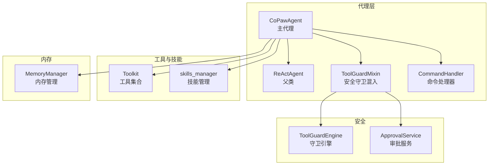
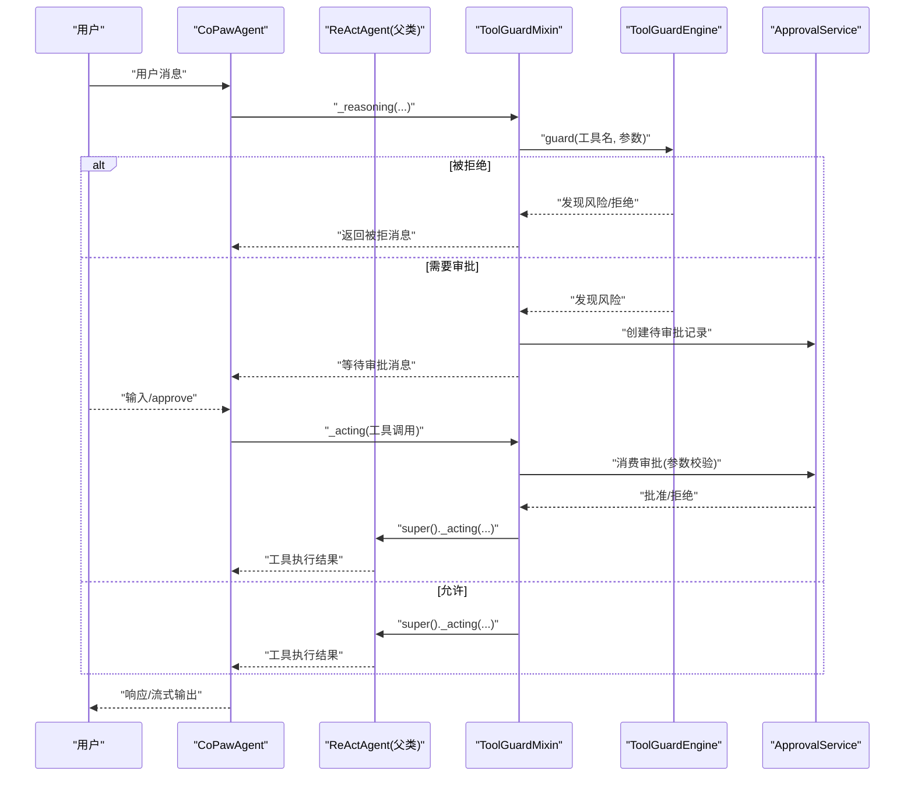
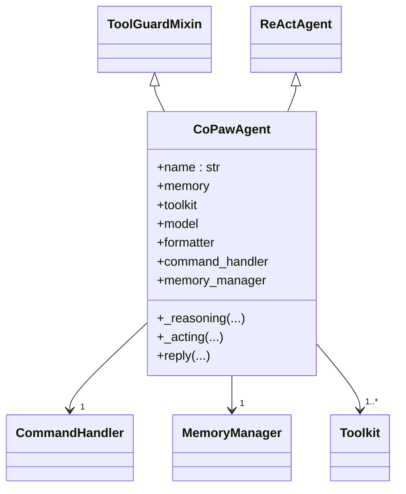
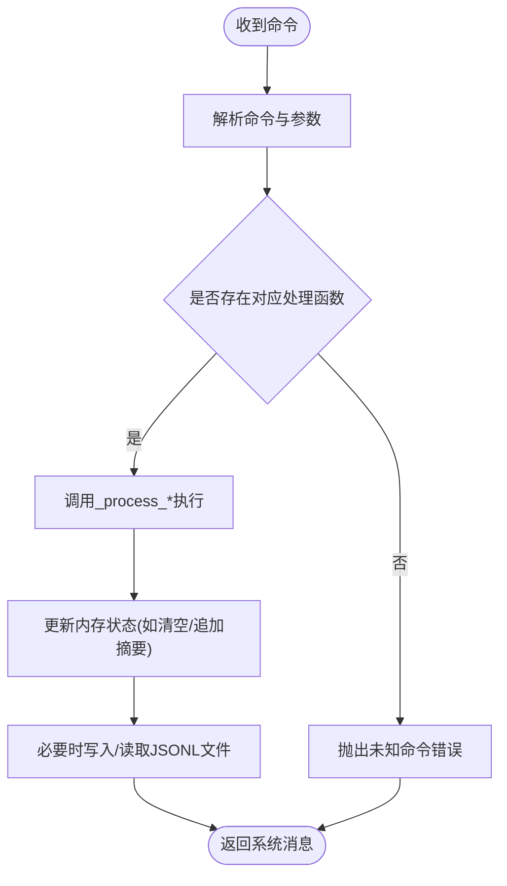
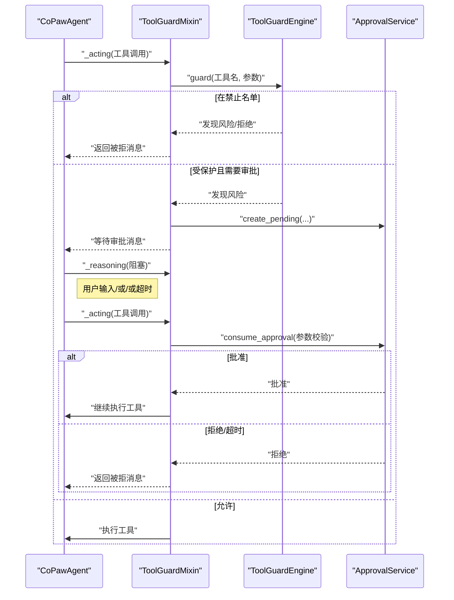
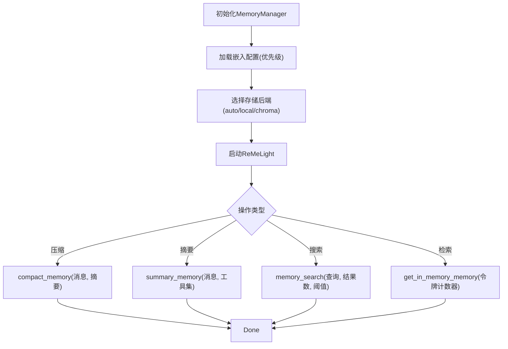
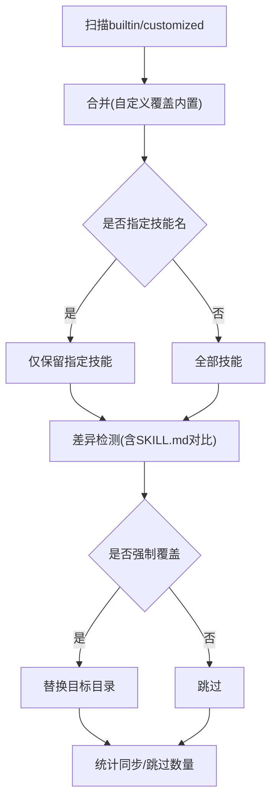
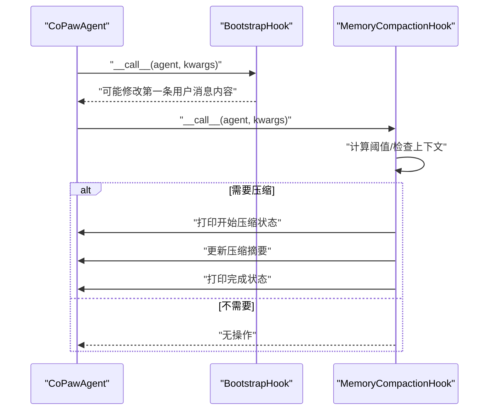
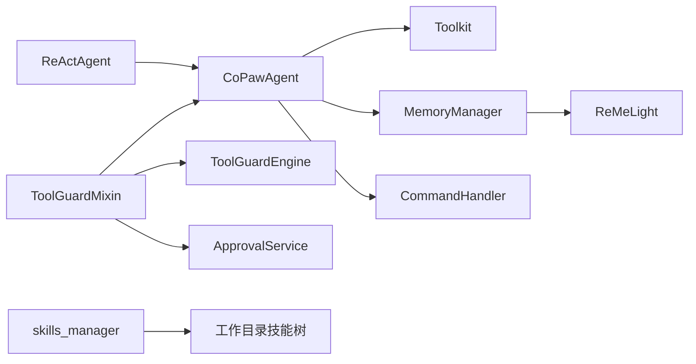

# 代理核心实现

<cite>
**本文引用的文件**
- [react_agent.py](file://src/copaw/agents/react_agent.py)
- [command_handler.py](file://src/copaw/agents/command_handler.py)
- [tool_guard_mixin.py](file://src/copaw/agents/tool_guard_mixin.py)
- [memory_manager.py](file://src/copaw/agents/memory/memory_manager.py)
- [skills_manager.py](file://src/copaw/agents/skills_manager.py)
- [bootstrap.py](file://src/copaw/agents/hooks/bootstrap.py)
- [memory_compaction.py](file://src/copaw/agents/hooks/memory_compaction.py)
- [tools/__init__.py](file://src/copaw/agents/tools/__init__.py)
- [engine.py](file://src/copaw/security/tool_guard/engine.py)
- [service.py](file://src/copaw/app/approvals/service.py)
</cite>

## 目录
1. [引言](#引言)
2. [项目结构](#项目结构)
3. [核心组件](#核心组件)
4. [架构总览](#架构总览)
5. [详细组件分析](#详细组件分析)
6. [依赖分析](#依赖分析)
7. [性能考虑](#性能考虑)
8. [故障排查指南](#故障排查指南)
9. [结论](#结论)
10. [附录](#附录)

## 引言
本文件面向AI代理开发者，系统化阐述CoPaw代理核心实现：ReAct代理架构、思考-行动循环机制、命令处理器与工具调用、内存管理系统与检索、工具集动态加载与安全执行、配置与行为控制、性能优化、使用示例与调试技巧，以及扩展与最佳实践。目标是帮助读者快速理解并高效定制与运维CoPaw代理。

## 项目结构
CoPaw代理核心位于src/copaw/agents目录，围绕以下关键模块组织：
- 代理主体：CoPawAgent（继承ReActAgent，集成工具、技能、内存）
- 命令处理器：CommandHandler（系统命令如/compact、/new等）
- 安全守卫：ToolGuardMixin + ToolGuardEngine + ApprovalService
- 内存管理：MemoryManager（ReMeLight扩展，支持压缩、摘要、搜索）
- 技能管理：skills_manager（内置/自定义/激活技能同步与校验）
- 钩子：BootstrapHook（首次交互引导）、MemoryCompactionHook（上下文压缩）

图表来源
- [react_agent.py:63-165](file://src/copaw/agents/react_agent.py#L63-L165)
- [command_handler.py:59-81](file://src/copaw/agents/command_handler.py#L59-L81)
- [tool_guard_mixin.py:24-48](file://src/copaw/agents/tool_guard_mixin.py#L24-L48)
- [memory_manager.py:43-139](file://src/copaw/agents/memory/memory_manager.py#L43-L139)
- [skills_manager.py:627-686](file://src/copaw/agents/skills_manager.py#L627-L686)
- [engine.py:52-146](file://src/copaw/security/tool_guard/engine.py#L52-L146)
- [service.py:58-136](file://src/copaw/app/approvals/service.py#L58-L136)

章节来源
- [react_agent.py:1-165](file://src/copaw/agents/react_agent.py#L1-L165)
- [command_handler.py:1-112](file://src/copaw/agents/command_handler.py#L1-L112)
- [tool_guard_mixin.py:1-48](file://src/copaw/agents/tool_guard_mixin.py#L1-L48)
- [memory_manager.py:1-139](file://src/copaw/agents/memory/memory_manager.py#L1-L139)
- [skills_manager.py:1-139](file://src/copaw/agents/skills_manager.py#L1-L139)

## 核心组件
- CoPawAgent：ReActAgent子类，负责系统提示构建、工具注册、技能加载、内存管理接入、命令处理、MCP客户端注册与恢复、媒体块降级重试、打印过滤等。
- CommandHandler：解析并执行系统命令（/compact、/new、/clear、/history、/message、/dump_history、/load_history、/await_summary）。
- ToolGuardMixin：在推理与行动阶段插入安全守卫，支持自动拒绝、预审批、审批等待与清理被拒消息。
- MemoryManager：基于ReMeLight的内存管理，提供消息压缩、摘要生成、向量/全文检索、嵌入模型热重载、令牌计数器适配。
- skills_manager：内置/自定义/激活技能树同步、版本比较、导入导出、ZIP安全校验、目录树构建与读取。
- 钩子：BootstrapHook（首次交互引导）、MemoryCompactionHook（上下文压缩阈值触发）。

章节来源
- [react_agent.py:63-165](file://src/copaw/agents/react_agent.py#L63-L165)
- [command_handler.py:59-112](file://src/copaw/agents/command_handler.py#L59-L112)
- [tool_guard_mixin.py:24-48](file://src/copaw/agents/tool_guard_mixin.py#L24-L48)
- [memory_manager.py:43-139](file://src/copaw/agents/memory/memory_manager.py#L43-L139)
- [skills_manager.py:366-392](file://src/copaw/agents/skills_manager.py#L366-L392)
- [bootstrap.py:20-104](file://src/copaw/agents/hooks/bootstrap.py#L20-L104)
- [memory_compaction.py:28-83](file://src/copaw/agents/hooks/memory_compaction.py#L28-L83)

## 架构总览
ReAct代理的核心在于“思考-行动”循环：先推理（Reasoning），再根据结果选择工具或直接输出（Acting）。CoPaw在此基础上增加了：
- 安全守卫：在行动前拦截敏感工具调用，必要时进入审批流程。
- 动态工具与技能：运行期从工作目录加载技能，按策略注册工具函数。
- 内存管理：自动压缩与摘要，降低上下文开销；支持向量/全文检索。
- 媒体块降级：当模型不支持多模态时，自动剥离媒体块并重试。
- 命令系统：通过/前缀命令进行会话控制与调试。

图表来源
- [tool_guard_mixin.py:103-181](file://src/copaw/agents/tool_guard_mixin.py#L103-L181)
- [engine.py:161-206](file://src/copaw/security/tool_guard/engine.py#L161-L206)
- [service.py:80-136](file://src/copaw/app/approvals/service.py#L80-L136)

## 详细组件分析

### ReAct代理与CoPawAgent
- 初始化流程：构建系统提示、创建模型与格式化器、组装Toolkit（内置工具+技能）、设置内存管理、注册钩子、初始化命令处理器。
- 工具注册：根据配置启用/禁用内置工具，支持命名冲突策略（覆盖/跳过/抛错/重命名）。
- 技能注册：确保工作目录技能初始化，扫描可用技能，逐个注册为代理技能。
- 内存管理：可选启用，注入MemoryManager的InMemoryMemory实例，并注册memory_search工具。
- Hook注册：BootstrapHook（首次交互引导）、MemoryCompactionHook（上下文压缩）。
- MCP客户端：延迟注册，支持断线恢复与重建，保证会话稳定性。
- 媒体块降级：推理/总结阶段若遇到400/媒体相关错误，剥离媒体块后重试；总结阶段过滤phantom tool_use块，避免前端闪烁。
- 命令处理：在reply入口统一处理/前缀命令，支持紧凑、新建、清空、历史查看、消息查看、历史导出/导入、等待摘要完成。

图表来源
- [react_agent.py:63-165](file://src/copaw/agents/react_agent.py#L63-L165)
- [tool_guard_mixin.py:24-48](file://src/copaw/agents/tool_guard_mixin.py#L24-L48)

章节来源
- [react_agent.py:83-165](file://src/copaw/agents/react_agent.py#L83-L165)
- [react_agent.py:166-228](file://src/copaw/agents/react_agent.py#L166-L228)
- [react_agent.py:230-256](file://src/copaw/agents/react_agent.py#L230-L256)
- [react_agent.py:288-351](file://src/copaw/agents/react_agent.py#L288-L351)
- [react_agent.py:369-550](file://src/copaw/agents/react_agent.py#L369-L550)
- [react_agent.py:558-784](file://src/copaw/agents/react_agent.py#L558-L784)
- [react_agent.py:786-840](file://src/copaw/agents/react_agent.py#L786-L840)

### 命令处理器（CommandHandler）
- 支持命令集合：/compact、/new、/clear、/history、/compact_str、/await_summary、/message、/dump_history、/load_history。
- 解析与路由：按空格拆分命令与参数，反射调用_process_*方法。
- 交互语义：
  - /compact：后台启动摘要任务，更新压缩摘要，清空内容。
  - /new：清空压缩摘要与内容，启动摘要任务。
  - /clear：清空内容与压缩摘要。
  - /history：按配置截断输出历史摘要。
  - /compact_str：展示当前压缩摘要。
  - /await_summary：等待所有摘要任务完成。
  - /message n：显示第n条消息（带时间戳、角色、内容，超长截断）。
  - /dump_history：将压缩摘要（如有）与消息写入JSONL文件。
  - /load_history：从JSONL文件恢复（含摘要标记识别）。
- 安全与健壮性：异常捕获、文件存在性检查、最大加载条目限制、日志记录。

图表来源
- [command_handler.py:460-488](file://src/copaw/agents/command_handler.py#L460-L488)
- [command_handler.py:113-145](file://src/copaw/agents/command_handler.py#L113-L145)
- [command_handler.py:147-172](file://src/copaw/agents/command_handler.py#L147-L172)
- [command_handler.py:174-186](file://src/copaw/agents/command_handler.py#L174-L186)
- [command_handler.py:205-230](file://src/copaw/agents/command_handler.py#L205-L230)
- [command_handler.py:328-382](file://src/copaw/agents/command_handler.py#L328-L382)
- [command_handler.py:384-458](file://src/copaw/agents/command_handler.py#L384-L458)

章节来源
- [command_handler.py:45-112](file://src/copaw/agents/command_handler.py#L45-L112)
- [command_handler.py:460-488](file://src/copaw/agents/command_handler.py#L460-L488)

### 工具守卫与安全执行（ToolGuardMixin + Engine + ApprovalService）
- ToolGuardMixin在推理与行动阶段拦截工具调用：
  - 若工具在“禁止名单”，直接返回被拒消息。
  - 若在“受保护范围”，先尝试一次性预审批；否则进入正式审批流程。
  - 审批期间阻塞后续推理，等待/approve或任意消息以拒绝。
  - 清理被拒消息与解释性助手消息，保持对话整洁。
- ToolGuardEngine：
  - 懒加载单例，支持环境变量与配置开关。
  - 默认守护者为规则型守卫，可注册/注销其他守护者。
  - 聚合各守护者发现，形成ToolGuardResult。
- ApprovalService：
  - 维护待审批与已完成审批记录，支持按会话/工具名/参数匹配消费。
  - 提供超时回收、容量上限控制，保障内存健康。

图表来源
- [tool_guard_mixin.py:103-181](file://src/copaw/agents/tool_guard_mixin.py#L103-L181)
- [tool_guard_mixin.py:315-348](file://src/copaw/agents/tool_guard_mixin.py#L315-L348)
- [engine.py:161-206](file://src/copaw/security/tool_guard/engine.py#L161-L206)
- [service.py:80-136](file://src/copaw/app/approvals/service.py#L80-L136)

章节来源
- [tool_guard_mixin.py:36-48](file://src/copaw/agents/tool_guard_mixin.py#L36-L48)
- [tool_guard_mixin.py:103-181](file://src/copaw/agents/tool_guard_mixin.py#L103-L181)
- [tool_guard_mixin.py:187-310](file://src/copaw/agents/tool_guard_mixin.py#L187-L310)
- [tool_guard_mixin.py:315-348](file://src/copaw/agents/tool_guard_mixin.py#L315-L348)
- [engine.py:52-146](file://src/copaw/security/tool_guard/engine.py#L52-L146)
- [service.py:58-136](file://src/copaw/app/approvals/service.py#L58-L136)

### 内存管理系统（MemoryManager）
- 继承ReMeLight，提供：
  - 压缩：compact_memory，按比例与令牌计数器压缩消息。
  - 摘要：summary_memory，结合文件操作工具生成综合摘要。
  - 搜索：memory_search，向量相似与全文检索组合。
  - 内存检索：get_in_memory_memory，带令牌计数器。
  - 嵌入配置：优先级配置>环境变量>默认，支持热重载与重启。
  - 后端选择：auto/local/chroma，按平台自动选择。
- 与代理集成：在CoPawAgent中注入InMemoryMemory实例，注册memory_search工具，联动摘要任务。

图表来源
- [memory_manager.py:53-139](file://src/copaw/agents/memory/memory_manager.py#L53-L139)
- [memory_manager.py:198-228](file://src/copaw/agents/memory/memory_manager.py#L198-L228)
- [memory_manager.py:230-257](file://src/copaw/agents/memory/memory_manager.py#L230-L257)
- [memory_manager.py:259-293](file://src/copaw/agents/memory/memory_manager.py#L259-L293)
- [memory_manager.py:295-310](file://src/copaw/agents/memory/memory_manager.py#L295-L310)

章节来源
- [memory_manager.py:43-139](file://src/copaw/agents/memory/memory_manager.py#L43-L139)
- [memory_manager.py:198-293](file://src/copaw/agents/memory/memory_manager.py#L198-L293)

### 技能管理（skills_manager）
- 目录结构：
  - 内置技能：src/copaw/agents/skills
  - 自定义技能：workspace/customized_skills
  - 激活技能：workspace/active_skills
- 同步策略：
  - builtin → active：首次复制，后续由customized覆盖。
  - customized → active：差异检测与覆盖，强制模式可覆盖。
  - active → customized：非builtin首次回写，builtin按版本升级。
- 数据结构：SkillInfo（名称、描述、内容、来源、路径、references/scripts树）。
- 导入/导出：ZIP安全解压（大小限制、路径合法性、禁止符号链接），树形文件创建。
- 版本与元数据：SKILL.md YAML Front Matter校验，版本号解析与比较。

图表来源
- [skills_manager.py:183-260](file://src/copaw/agents/skills_manager.py#L183-L260)
- [skills_manager.py:263-341](file://src/copaw/agents/skills_manager.py#L263-L341)
- [skills_manager.py:344-363](file://src/copaw/agents/skills_manager.py#L344-L363)
- [skills_manager.py:394-470](file://src/copaw/agents/skills_manager.py#L394-L470)
- [skills_manager.py:529-550](file://src/copaw/agents/skills_manager.py#L529-L550)

章节来源
- [skills_manager.py:63-84](file://src/copaw/agents/skills_manager.py#L63-L84)
- [skills_manager.py:183-260](file://src/copaw/agents/skills_manager.py#L183-L260)
- [skills_manager.py:263-341](file://src/copaw/agents/skills_manager.py#L263-L341)
- [skills_manager.py:344-363](file://src/copaw/agents/skills_manager.py#L344-L363)
- [skills_manager.py:394-470](file://src/copaw/agents/skills_manager.py#L394-L470)
- [skills_manager.py:529-550](file://src/copaw/agents/skills_manager.py#L529-L550)

### 钩子：首次引导与上下文压缩
- BootstrapHook：首次用户交互时，若存在BOOTSTRAP.md，则在第一条用户消息前插入引导内容，并写入完成标志，防止重复触发。
- MemoryCompactionHook：在推理前检查上下文令牌数，超过阈值则触发压缩，保留系统提示与近期消息，摘要旧消息并更新压缩摘要。

图表来源
- [bootstrap.py:42-104](file://src/copaw/agents/hooks/bootstrap.py#L42-L104)
- [memory_compaction.py:62-201](file://src/copaw/agents/hooks/memory_compaction.py#L62-L201)

章节来源
- [bootstrap.py:20-104](file://src/copaw/agents/hooks/bootstrap.py#L20-L104)
- [memory_compaction.py:28-201](file://src/copaw/agents/hooks/memory_compaction.py#L28-L201)

## 依赖分析
- 组件耦合：
  - CoPawAgent依赖ReActAgent、Toolkit、MemoryManager、CommandHandler、MCP客户端、工具集、安全引擎与审批服务。
  - ToolGuardMixin通过MRO覆盖父类推理/行动方法，确保安全拦截贯穿执行链。
  - MemoryManager依赖嵌入配置与令牌计数器，与代理共享模型与格式化器。
  - skills_manager与工作目录强耦合，提供技能树同步与安全导入。
- 外部依赖：
  - agentscope（ReActAgent、Toolkit、Msg、InMemoryMemory等）
  - reme（ReMeLight、向量/全文检索）
  - 异步与并发：asyncio、Future、锁（ApprovalService）
- 循环依赖：未见直接循环；安全模块通过懒初始化避免导入环。

图表来源
- [react_agent.py:14-52](file://src/copaw/agents/react_agent.py#L14-L52)
- [tool_guard_mixin.py:36-43](file://src/copaw/agents/tool_guard_mixin.py#L36-L43)
- [memory_manager.py:27-42](file://src/copaw/agents/memory/memory_manager.py#L27-L42)
- [skills_manager.py:63-84](file://src/copaw/agents/skills_manager.py#L63-L84)

章节来源
- [react_agent.py:14-52](file://src/copaw/agents/react_agent.py#L14-L52)
- [tool_guard_mixin.py:36-43](file://src/copaw/agents/tool_guard_mixin.py#L36-L43)
- [memory_manager.py:27-42](file://src/copaw/agents/memory/memory_manager.py#L27-L42)
- [skills_manager.py:63-84](file://src/copaw/agents/skills_manager.py#L63-L84)

## 性能考虑
- 上下文压缩：
  - 使用MemoryCompactionHook在阈值接近时自动压缩，减少令牌占用。
  - 保留系统提示与近期消息，仅压缩中间段，兼顾语义完整性。
- 令牌计数器：
  - MemoryManager与工具函数均使用统一令牌计数器，避免重复计算。
- 嵌入与检索：
  - 支持向量与全文检索，按需开启；Windows平台自动选择本地后端，其他平台默认Chroma。
  - 嵌入配置热重载，避免频繁重启。
- 媒体块降级：
  - 推理失败时自动剥离媒体块并重试，避免无效请求导致的重试风暴。
- 并发与回收：
  - 审批服务对待审批与已完成记录设置超时与容量上限，防止内存泄漏。

章节来源
- [memory_compaction.py:100-140](file://src/copaw/agents/hooks/memory_compaction.py#L100-L140)
- [memory_manager.py:169-187](file://src/copaw/agents/memory/memory_manager.py#L169-L187)
- [memory_manager.py:188-196](file://src/copaw/agents/memory/memory_manager.py#L188-L196)
- [react_agent.py:702-784](file://src/copaw/agents/react_agent.py#L702-L784)
- [service.py:209-267](file://src/copaw/app/approvals/service.py#L209-L267)

## 故障排查指南
- 媒体块相关错误：
  - 现象：模型报400或包含image/audio/video/vision/multimodal关键字。
  - 处理：剥离媒体块（含ToolResultBlock内嵌媒体），插入占位文本，重试推理/总结。
- 工具被拒：
  - 现象：出现“工具已拦截/Tool Blocked”消息。
  - 处理：检查ToolGuardEngine配置与规则；确认是否在禁止名单；如需审批，输入/或发送任意消息拒绝。
- 审批超时：
  - 现象：长时间等待/或超时。
  - 处理：审批服务对超时记录进行回收；检查/await_summary等待任务完成。
- 命令异常：
  - 现象：/message索引越界、/load_history文件不存在。
  - 处理：根据提示修正索引或先执行/dump_history生成文件。
- MCP客户端中断：
  - 现象：注册过程中会话中断。
  - 处理：自动尝试关闭/重连；失败则重建客户端并替换引用，保持共享引用稳定。

章节来源
- [react_agent.py:702-784](file://src/copaw/agents/react_agent.py#L702-L784)
- [tool_guard_mixin.py:174-180](file://src/copaw/agents/tool_guard_mixin.py#L174-L180)
- [service.py:209-267](file://src/copaw/app/approvals/service.py#L209-L267)
- [command_handler.py:284-303](file://src/copaw/agents/command_handler.py#L284-L303)
- [command_handler.py:401-406](file://src/copaw/agents/command_handler.py#L401-L406)
- [react_agent.py:434-550](file://src/copaw/agents/react_agent.py#L434-L550)

## 结论
CoPaw代理核心通过ReAct框架与工具/技能/内存/安全四大支柱，实现了高扩展、可治理、可审计的智能体系统。其设计强调：
- 明确的安全边界（工具守卫与审批）
- 可控的上下文规模（压缩与摘要）
- 动态的能力扩展（技能树与工具注册）
- 稳定的运行时（MCP恢复、媒体块降级、钩子机制）

这些特性使CoPaw既能满足通用代理需求，又便于在企业与研究场景中进行深度定制与安全加固。

## 附录

### 使用示例与调试技巧
- 启动首次交互引导：在工作目录放置BOOTSTRAP.md，首次用户消息将自动插入引导内容。
- 控制上下文大小：合理设置memory_compact_threshold与memory_compact_ratio；必要时使用/compact或/await_summary。
- 查看历史与消息：/history查看摘要；/message N查看第N条消息；/dump_history与/load_history用于离线分析。
- 安全审批：遇到风险提示时，输入/approve进行审批；也可发送任意消息拒绝。
- MCP客户端：若出现会话中断，系统将自动恢复或重建客户端；可通过/await_summary确认后台任务完成。

章节来源
- [bootstrap.py:56-95](file://src/copaw/agents/hooks/bootstrap.py#L56-L95)
- [memory_compaction.py:169-191](file://src/copaw/agents/hooks/memory_compaction.py#L169-L191)
- [command_handler.py:205-230](file://src/copaw/agents/command_handler.py#L205-L230)
- [command_handler.py:260-326](file://src/copaw/agents/command_handler.py#L260-L326)
- [command_handler.py:328-382](file://src/copaw/agents/command_handler.py#L328-L382)
- [command_handler.py:384-458](file://src/copaw/agents/command_handler.py#L384-L458)
- [tool_guard_mixin.py:237-310](file://src/copaw/agents/tool_guard_mixin.py#L237-L310)
- [react_agent.py:369-550](file://src/copaw/agents/react_agent.py#L369-L550)

### 配置与行为控制要点
- 工具启用：通过AgentProfileConfig.tools.builtin_tools控制内置工具启用/禁用，默认启用。
- 名称冲突策略：namesake_strategy支持override/skip/raise/rename，影响工具/技能注册。
- 内存管理开关：ENABLE_MEMORY_MANAGER=false可全局禁用内存管理功能。
- 嵌入配置：优先使用配置项，其次环境变量（EMBEDDING_*），最后默认值；支持热重载。
- 工具守卫：COPAW_TOOL_GUARD_ENABLED控制开关；可注册额外守护者或重载规则。

章节来源
- [react_agent.py:182-227](file://src/copaw/agents/react_agent.py#L182-L227)
- [react_agent.py:301-304](file://src/copaw/agents/react_agent.py#L301-L304)
- [memory_manager.py:149-167](file://src/copaw/agents/memory/memory_manager.py#L149-L167)
- [engine.py:34-50](file://src/copaw/security/tool_guard/engine.py#L34-L50)

### 扩展与最佳实践
- 扩展工具：在tools/__init__.py中导出新工具函数，CoPawAgent按配置自动注册。
- 扩展技能：在workspace/customized_skills新增技能目录（含SKILL.md），系统将自动同步至active_skills并注册。
- 自定义守卫：实现BaseToolGuardian接口并注册到ToolGuardEngine，参与参数风险评估。
- 自定义钩子：在pre_reasoning/pre_acting阶段注册钩子，实现业务逻辑前置处理。
- 错误处理：利用媒体块降级、MCP恢复、审批回收等机制提升鲁棒性；命令处理器提供完善的错误反馈与边界检查。

章节来源
- [tools/__init__.py:1-47](file://src/copaw/agents/tools/__init__.py#L1-L47)
- [skills_manager.py:627-686](file://src/copaw/agents/skills_manager.py#L627-L686)
- [engine.py:100-114](file://src/copaw/security/tool_guard/engine.py#L100-L114)
- [bootstrap.py:42-95](file://src/copaw/agents/hooks/bootstrap.py#L42-L95)
- [memory_compaction.py:62-201](file://src/copaw/agents/hooks/memory_compaction.py#L62-L201)
- [react_agent.py:702-784](file://src/copaw/agents/react_agent.py#L702-L784)
- [react_agent.py:369-550](file://src/copaw/agents/react_agent.py#L369-L550)