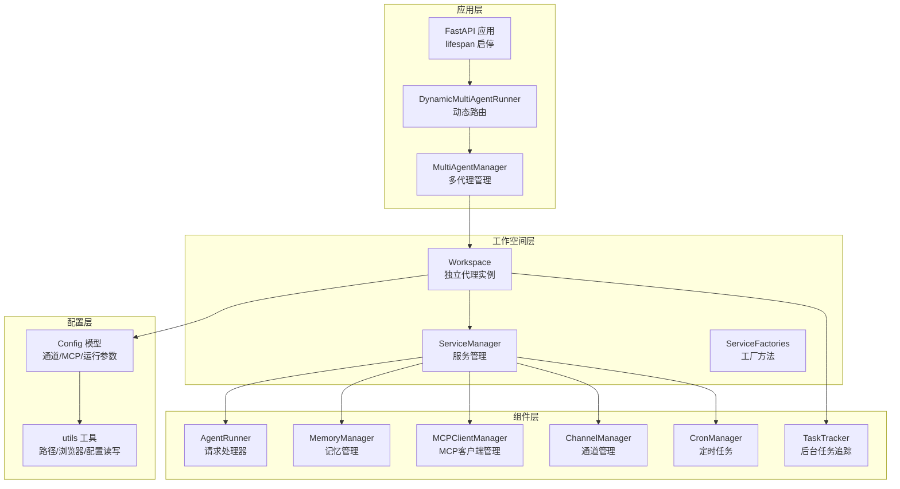
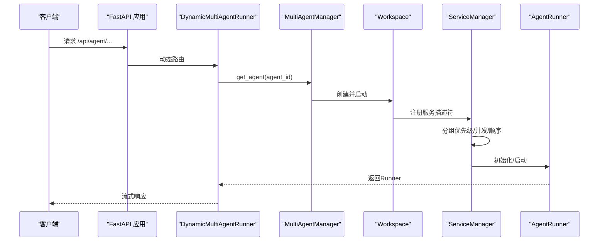
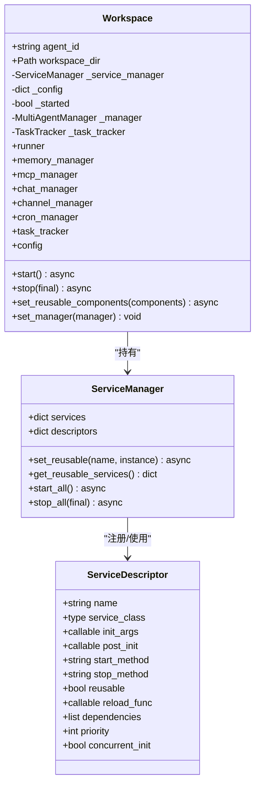
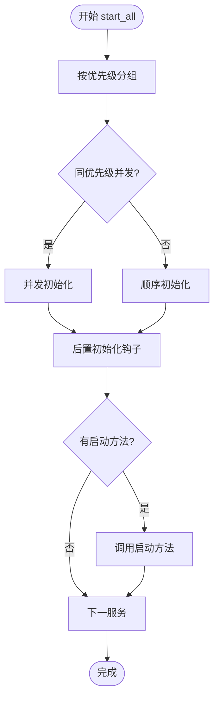
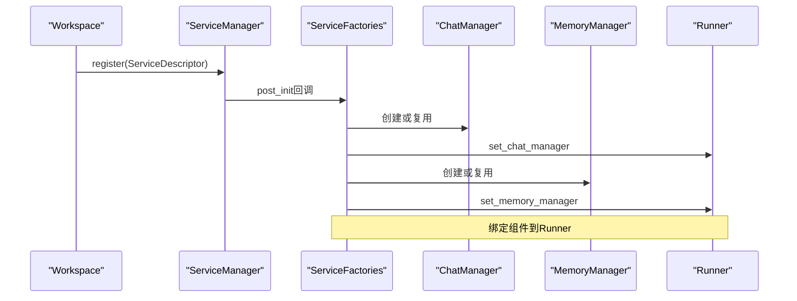
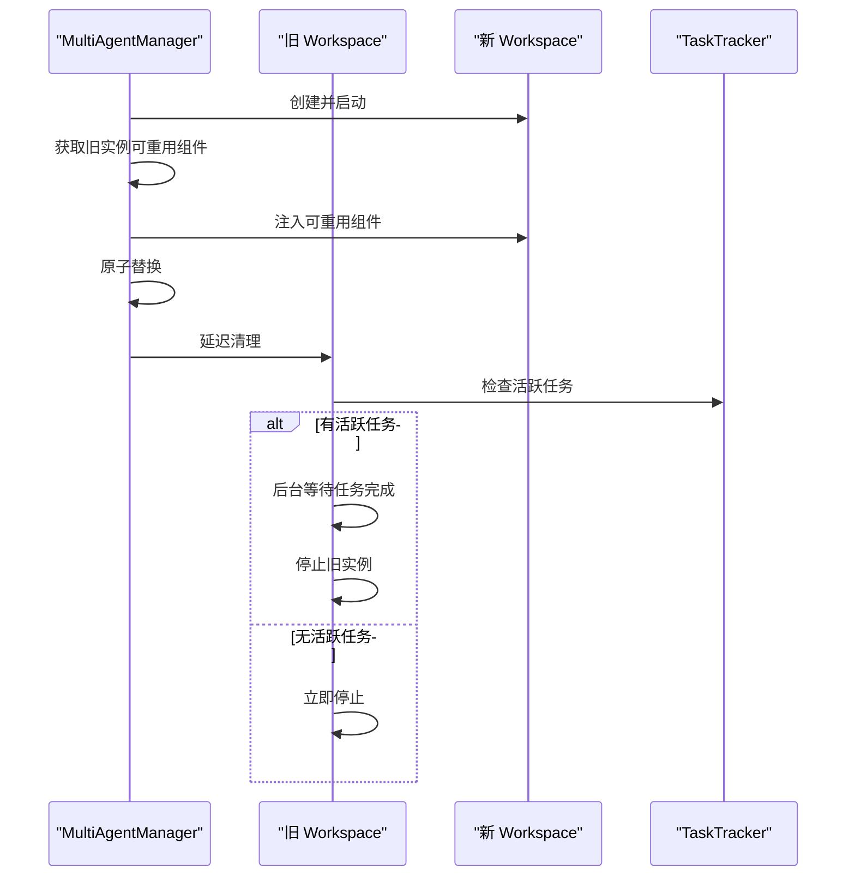
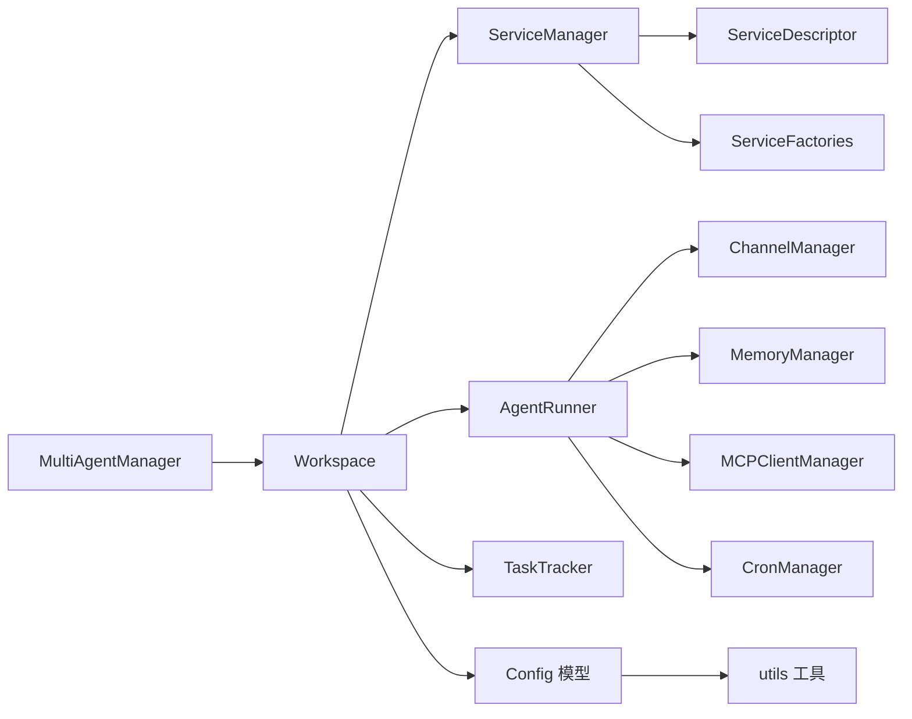

# 代理工作空间管理

<cite>
**本文档引用的文件**
- [workspace.py](file://src/copaw/app/workspace/workspace.py)
- [service_manager.py](file://src/copaw/app/workspace/service_manager.py)
- [service_factories.py](file://src/copaw/app/workspace/service_factories.py)
- [_app.py](file://src/copaw/app/_app.py)
- [multi_agent_manager.py](file://src/copaw/app/multi_agent_manager.py)
- [config.py](file://src/copaw/config/config.py)
- [utils.py](file://src/copaw/config/utils.py)
- [task_tracker.py](file://src/copaw/app/runner/task_tracker.py)
- [workspace.py](file://src/copaw/app/routers/workspace.py)
- [test_workspace.py](file://tests/unit/workspace/test_workspace.py)
</cite>

## 目录
1. [简介](#简介)
2. [项目结构](#项目结构)
3. [核心组件](#核心组件)
4. [架构总览](#架构总览)
5. [详细组件分析](#详细组件分析)
6. [依赖关系分析](#依赖关系分析)
7. [性能考虑](#性能考虑)
8. [故障排查指南](#故障排查指南)
9. [结论](#结论)
10. [附录](#附录)

## 简介
本文件面向CoPaw的代理工作空间管理系统，系统性阐述Workspace类的设计理念与实现原理，覆盖工作空间的创建、启动、停止与销毁流程；深入解析ServiceManager的服务管理机制（服务注册、生命周期管理、资源共享策略）；详解ServiceFactory的服务创建模式与可重用组件机制；并提供使用示例、配置选项、性能优化与故障处理策略。文档兼顾初学者易读性与高级用户的深度技术细节与扩展指导。

## 项目结构
CoPaw采用模块化分层设计：
- 应用入口与生命周期：FastAPI应用在应用启动时初始化多代理管理器，并通过动态路由将请求分发到对应工作空间的Runner。
- 工作空间与服务管理：每个Workspace封装独立的运行时组件（Runner、ChannelManager、MemoryManager、MCPClientManager、CronManager），通过ServiceManager统一注册、并发启动与停止。
- 配置与工具：配置模型定义了通道、MCP、心跳、运行参数等；工具函数负责路径解析、浏览器检测、配置加载与保存等。
- 路由与操作：提供工作空间打包下载与上传合并的API，便于运维与迁移。

图表来源
- [_app.py:148-239](file://src/copaw/app/_app.py#L148-L239)
- [multi_agent_manager.py:34-82](file://src/copaw/app/multi_agent_manager.py#L34-L82)
- [workspace.py:52-114](file://src/copaw/app/workspace/workspace.py#L52-L114)
- [service_manager.py:74-91](file://src/copaw/app/workspace/service_manager.py#L74-L91)
- [config.py:455-526](file://src/copaw/config/config.py#L455-L526)
- [utils.py:423-474](file://src/copaw/config/utils.py#L423-L474)

章节来源
- [_app.py:148-239](file://src/copaw/app/_app.py#L148-L239)
- [multi_agent_manager.py:17-32](file://src/copaw/app/multi_agent_manager.py#L17-L32)
- [workspace.py:39-78](file://src/copaw/app/workspace/workspace.py#L39-L78)
- [service_manager.py:74-91](file://src/copaw/app/workspace/service_manager.py#L74-L91)
- [config.py:455-526](file://src/copaw/config/config.py#L455-L526)
- [utils.py:423-474](file://src/copaw/config/utils.py#L423-L474)

## 核心组件
- Workspace：封装单个代理的完整运行时环境，包含Runner、ChannelManager、MemoryManager、MCPClientManager、CronManager等。通过ServiceManager进行统一注册与生命周期管理。
- ServiceManager：服务注册中心，支持优先级分组、并发/顺序初始化、可重用组件标记、优雅停止与错误隔离。
- ServiceFactory：服务创建工厂，负责根据配置或复用实例装配具体组件（如MCP、聊天管理、通道管理、配置监听器等）。
- MultiAgentManager：多代理管理器，支持懒加载、零停机热重载、后台清理、全局生命周期控制。
- TaskTracker：后台任务追踪器，支持SSE事件缓冲、多订阅者、取消与清理。
- 配置系统：基于Pydantic的配置模型，支持通道、MCP、运行参数、安全策略等。

章节来源
- [workspace.py:39-114](file://src/copaw/app/workspace/workspace.py#L39-L114)
- [service_manager.py:30-72](file://src/copaw/app/workspace/service_manager.py#L30-L72)
- [service_factories.py:18-164](file://src/copaw/app/workspace/service_factories.py#L18-L164)
- [multi_agent_manager.py:17-32](file://src/copaw/app/multi_agent_manager.py#L17-L32)
- [task_tracker.py:31-45](file://src/copaw/app/runner/task_tracker.py#L31-L45)
- [config.py:380-453](file://src/copaw/config/config.py#L380-L453)

## 架构总览
下图展示从应用启动到请求路由的关键流程，以及工作空间内部服务的启动顺序与依赖关系。

图表来源
- [_app.py:64-125](file://src/copaw/app/_app.py#L64-L125)
- [multi_agent_manager.py:34-82](file://src/copaw/app/multi_agent_manager.py#L34-L82)
- [workspace.py:311-337](file://src/copaw/app/workspace/workspace.py#L311-L337)
- [service_manager.py:171-200](file://src/copaw/app/workspace/service_manager.py#L171-L200)

## 详细组件分析

### Workspace 类设计与实现
- 设计理念
  - 将Runner、ChannelManager、MemoryManager、MCPClientManager、CronManager等组件封装为独立服务，通过ServiceDescriptor声明式注册，避免硬编码初始化逻辑。
  - 支持可重用组件（reusable）与热重载：旧实例的可重用组件在新实例启动前注入，实现零停机切换。
  - 生命周期严格控制：start()失败自动回滚stop()，stop(final)区分最终停止与热重载场景。
- 关键流程
  - 创建：初始化目录、构建ServiceManager、注册服务描述符。
  - 启动：加载配置、按优先级并发/顺序启动服务、设置管理器引用。
  - 停止：按逆优先级停止，final=False跳过可重用组件，避免影响新实例。
  - 可重用：set_reusable_components()在start()前调用，ServiceManager记录reused_services集合。
- 属性访问：通过属性委托到ServiceManager.services字典，统一获取各组件实例。

图表来源
- [workspace.py:52-114](file://src/copaw/app/workspace/workspace.py#L52-L114)
- [service_manager.py:30-72](file://src/copaw/app/workspace/service_manager.py#L30-L72)
- [service_manager.py:81-91](file://src/copaw/app/workspace/service_manager.py#L81-L91)

章节来源
- [workspace.py:52-114](file://src/copaw/app/workspace/workspace.py#L52-L114)
- [workspace.py:134-278](file://src/copaw/app/workspace/workspace.py#L134-L278)
- [workspace.py:311-358](file://src/copaw/app/workspace/workspace.py#L311-L358)

### ServiceManager 服务管理机制
- 服务注册与描述符
  - ServiceDescriptor定义服务名称、类、初始化参数、后置初始化钩子、启动/停止方法、是否可重用、依赖关系、优先级与并发初始化策略。
  - register()记录描述符，支持覆盖警告。
- 生命周期管理
  - start_all()：按优先级分组，同一优先级内并发（concurrent_init=True）或顺序执行；对已重用服务跳过创建与启动。
  - stop_all(final)：逆优先级停止，final=False跳过可重用服务；异常被记录但不中断整体停止流程。
- 可重用组件
  - set_reusable()：在start_all()前标记服务实例为可重用，触发reload_func（如需要）。
  - get_reusable_services()：导出可重用实例供新实例注入。
- 错误处理
  - 单个服务启动失败会抛出异常，上层可捕获并调用stop()回滚。
  - 停止阶段的异常仅记录告警，保证系统稳定退出。

图表来源
- [service_manager.py:171-200](file://src/copaw/app/workspace/service_manager.py#L171-L200)
- [service_manager.py:201-229](file://src/copaw/app/workspace/service_manager.py#L201-L229)

章节来源
- [service_manager.py:92-157](file://src/copaw/app/workspace/service_manager.py#L92-L157)
- [service_manager.py:171-200](file://src/copaw/app/workspace/service_manager.py#L171-L200)
- [service_manager.py:324-415](file://src/copaw/app/workspace/service_manager.py#L324-L415)

### ServiceFactory 服务创建模式与可重用组件
- 工厂职责
  - create_mcp_service：根据Agent配置初始化MCPClientManager并注入Runner。
  - create_chat_service：创建或复用ChatManager并绑定到Runner。
  - create_channel_service：按配置创建ChannelManager并注入Runner。
  - create_agent_config_watcher / create_mcp_config_watcher：条件创建配置监听器。
- 可重用策略
  - MemoryManager、ChatManager等标记为reusable，MultiAgentManager在热重载时将旧实例的可重用组件传递给新实例，减少重启成本。
  - reload_func（如存在）在set_reusable()时调用，用于迁移状态或重新绑定。

图表来源
- [workspace.py:145-278](file://src/copaw/app/workspace/workspace.py#L145-L278)
- [service_factories.py:18-164](file://src/copaw/app/workspace/service_factories.py#L18-L164)

章节来源
- [service_factories.py:18-164](file://src/copaw/app/workspace/service_factories.py#L18-L164)

### 多代理管理与零停机热重载
- 懒加载：首次请求时才创建并启动Workspace。
- 热重载：创建新实例并完全启动后，原子替换旧实例；若旧实例仍有活跃任务，则延后清理，确保请求不中断。
- 全局停止：应用关闭时取消待清理任务并逐个停止所有代理。

图表来源
- [multi_agent_manager.py:200-311](file://src/copaw/app/multi_agent_manager.py#L200-L311)
- [multi_agent_manager.py:83-179](file://src/copaw/app/multi_agent_manager.py#L83-L179)

章节来源
- [multi_agent_manager.py:34-82](file://src/copaw/app/multi_agent_manager.py#L34-L82)
- [multi_agent_manager.py:200-311](file://src/copaw/app/multi_agent_manager.py#L200-L311)
- [multi_agent_manager.py:338-362](file://src/copaw/app/multi_agent_manager.py#L338-L362)

### 配置系统与工作空间API
- 配置模型
  - ChannelConfig、MCPConfig、AgentsRunningConfig、SecurityConfig等，定义通道、MCP客户端、运行参数与安全策略。
  - AgentProfileConfig：每个代理独立配置文件，包含通道、MCP、心跳、运行参数、语言、工具、安全等。
- 工作空间API
  - 下载：将整个工作空间打包为zip流式返回。
  - 上传：校验zip安全性后合并到工作空间目录。

章节来源
- [config.py:167-185](file://src/copaw/config/config.py#L167-L185)
- [config.py:535-626](file://src/copaw/config/config.py#L535-L626)
- [config.py:394-453](file://src/copaw/config/config.py#L394-L453)
- [workspace.py:112-203](file://src/copaw/app/routers/workspace.py#L112-L203)

## 依赖关系分析
- 组件耦合
  - Workspace依赖ServiceManager进行服务编排；ServiceManager依赖ServiceDescriptor描述符与工厂方法。
  - MultiAgentManager依赖Workspace与ServiceManager，负责懒加载与热重载。
  - Runner作为核心调度器，被多个服务（MCP、Chat、Channel、Cron）依赖。
- 外部依赖
  - FastAPI应用通过DynamicMultiAgentRunner动态路由至Workspace.Runner。
  - 配置系统提供通道、MCP、运行参数等外部输入。
- 循环依赖
  - 未发现直接循环依赖；服务间通过接口契约（方法名字符串）解耦。

图表来源
- [multi_agent_manager.py:17-32](file://src/copaw/app/multi_agent_manager.py#L17-L32)
- [workspace.py:52-114](file://src/copaw/app/workspace/workspace.py#L52-L114)
- [service_manager.py:74-91](file://src/copaw/app/workspace/service_manager.py#L74-L91)
- [service_factories.py:18-164](file://src/copaw/app/workspace/service_factories.py#L18-L164)
- [config.py:455-526](file://src/copaw/config/config.py#L455-L526)
- [utils.py:423-474](file://src/copaw/config/utils.py#L423-L474)

章节来源
- [multi_agent_manager.py:17-32](file://src/copaw/app/multi_agent_manager.py#L17-L32)
- [workspace.py:52-114](file://src/copaw/app/workspace/workspace.py#L52-L114)
- [service_manager.py:74-91](file://src/copaw/app/workspace/service_manager.py#L74-L91)
- [service_factories.py:18-164](file://src/copaw/app/workspace/service_factories.py#L18-L164)
- [config.py:455-526](file://src/copaw/config/config.py#L455-L526)
- [utils.py:423-474](file://src/copaw/config/utils.py#L423-L474)

## 性能考虑
- 并发启动：ServiceManager按优先级分组，同一组内尽可能并发初始化，缩短启动时间。
- 可重用组件：MemoryManager、ChatManager等可重用，热重载时避免重建，降低延迟。
- 零停机重载：旧实例在后台清理，新实例立即接管请求，最小化业务中断。
- 任务追踪：TaskTracker使用队列缓冲SSE事件，限制队列大小避免内存膨胀；支持取消与清理。
- I/O优化：工作空间打包/上传使用线程池执行阻塞操作，避免阻塞事件循环。

章节来源
- [service_manager.py:188-200](file://src/copaw/app/workspace/service_manager.py#L188-L200)
- [multi_agent_manager.py:200-311](file://src/copaw/app/multi_agent_manager.py#L200-L311)
- [task_tracker.py:18-20](file://src/copaw/app/runner/task_tracker.py#L18-L20)
- [workspace.py:139-140](file://src/copaw/app/routers/workspace.py#L139-L140)

## 故障排查指南
- 启动失败
  - 现象：start()抛出异常并自动调用stop()回滚。
  - 排查：检查配置文件（通道、MCP、运行参数）、依赖服务可用性（数据库、网络、进程）。
- 停止异常
  - 现象：stop_all()中个别服务停止报错但不影响整体。
  - 排查：查看日志中的警告信息，确认资源释放是否成功。
- 热重载卡顿
  - 现象：旧实例仍有活跃任务导致延迟清理。
  - 排查：检查TaskTracker活跃任务列表，等待任务完成后自动清理。
- 配置变更未生效
  - 现象：修改配置后未触发更新。
  - 排查：确认已启用相应配置监听器（AgentConfigWatcher、MCPConfigWatcher），并在MultiAgentManager中执行reload_agent()。
- 工作空间上传安全
  - 现象：上传zip失败或被拒绝。
  - 排查：确保zip合法且无路径穿越风险，content-type正确。

章节来源
- [workspace.py:330-337](file://src/copaw/app/workspace/workspace.py#L330-L337)
- [service_manager.py:354-360](file://src/copaw/app/workspace/service_manager.py#L354-L360)
- [multi_agent_manager.py:83-179](file://src/copaw/app/multi_agent_manager.py#L83-L179)
- [workspace.py:56-71](file://src/copaw/app/routers/workspace.py#L56-L71)
- [workspace.py:165-203](file://src/copaw/app/routers/workspace.py#L165-L203)

## 结论
CoPaw的工作空间管理系统以Workspace为核心，结合ServiceManager与ServiceFactory实现了高内聚、低耦合的服务编排；通过MultiAgentManager提供懒加载与零停机热重载能力；配合完善的配置系统与工作空间API，满足生产环境的稳定性与可运维性需求。该体系既适合初学者快速上手，也为高级用户提供了灵活的扩展点与深度定制空间。

## 附录

### 使用示例与最佳实践
- 工作空间配置
  - 在AgentProfileConfig中定义通道、MCP、运行参数、语言、工具与安全策略。
  - 使用Config模型加载/保存配置，确保路径规范化与兼容性。
- 服务初始化
  - 在Workspace._register_services()中声明ServiceDescriptor，明确依赖与优先级。
  - 使用ServiceFactory创建或复用组件，并在post_init中完成绑定。
- 资源清理
  - stop(final=True)用于完全停止；热重载场景使用stop(final=False)保留可重用组件。
  - MultiAgentManager.stop_all()在应用关闭时统一清理。
- 零停机热重载
  - 调用reload_agent()，系统自动创建新实例、注入可重用组件、原子替换并延后清理旧实例。
- 工作空间操作
  - 下载：GET /api/workspace/download，打包当前工作空间。
  - 上传：POST /api/workspace/upload，合并zip内容到工作空间。

章节来源
- [config.py:394-453](file://src/copaw/config/config.py#L394-L453)
- [config.py:535-626](file://src/copaw/config/config.py#L535-L626)
- [workspace.py:134-278](file://src/copaw/app/workspace/workspace.py#L134-L278)
- [service_factories.py:18-164](file://src/copaw/app/workspace/service_factories.py#L18-L164)
- [multi_agent_manager.py:200-311](file://src/copaw/app/multi_agent_manager.py#L200-L311)
- [workspace.py:112-203](file://src/copaw/app/routers/workspace.py#L112-L203)

### 配置选项速查
- 通道配置（ChannelConfig）
  - 支持内置通道类型（如Discord、Telegram、WeCom等），含启用开关、消息过滤、权限策略等。
- MCP配置（MCPConfig）
  - 客户端列表，支持stdio、streamable_http、sse等传输方式，自动启用条件与环境变量。
- 运行参数（AgentsRunningConfig）
  - 最大迭代次数、令牌计数模型、上下文窗口长度、记忆压缩阈值与保留比例、嵌入配置等。
- 安全配置（SecurityConfig）
  - 工具守卫、技能扫描器模式与白名单、超时与规则集等。

章节来源
- [config.py:167-185](file://src/copaw/config/config.py#L167-L185)
- [config.py:535-626](file://src/copaw/config/config.py#L535-L626)
- [config.py:252-353](file://src/copaw/config/config.py#L252-L353)
- [config.py:797-800](file://src/copaw/config/config.py#L797-L800)