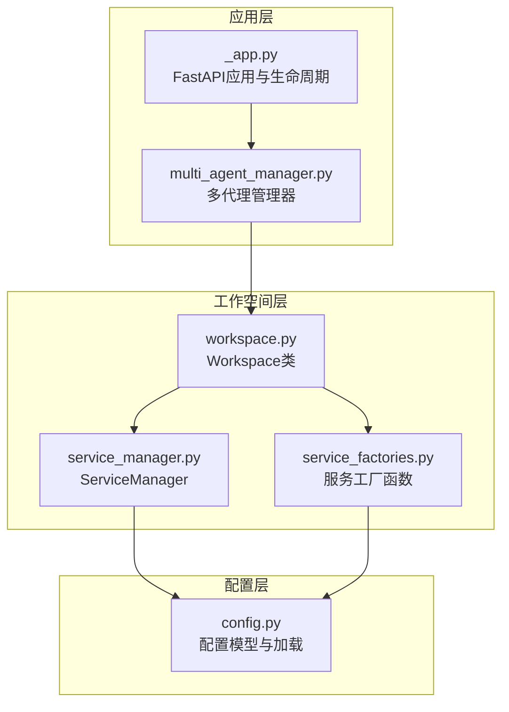
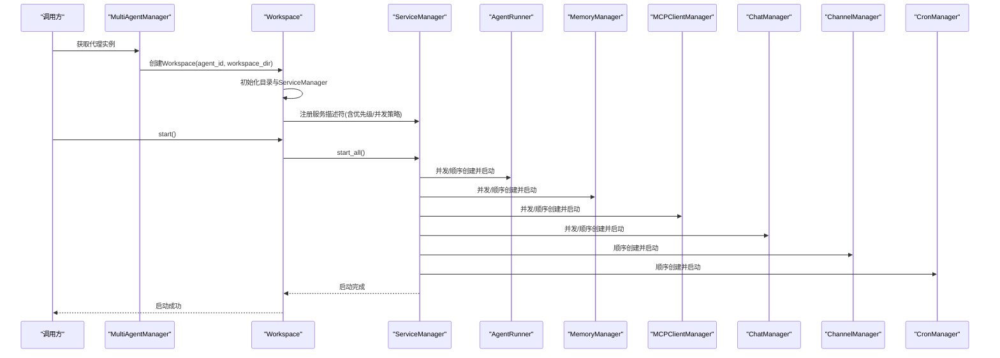
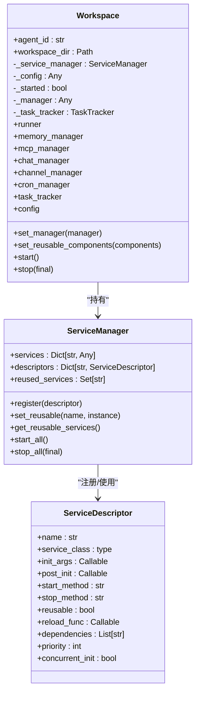
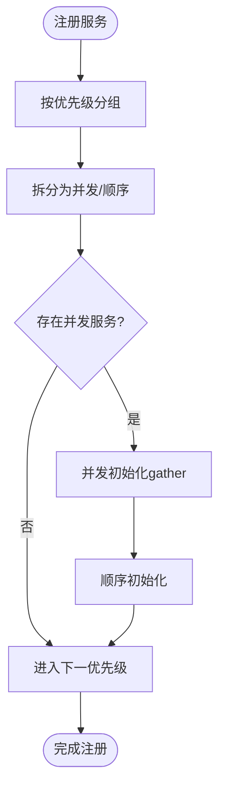
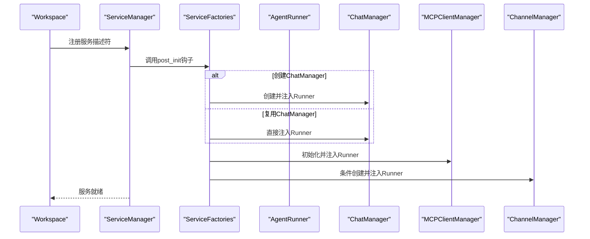
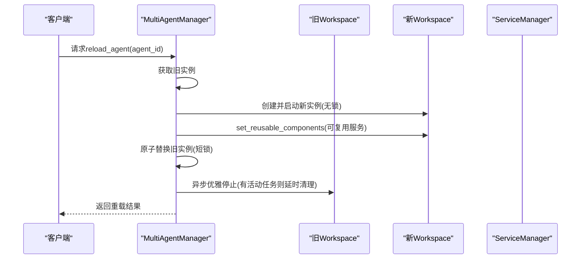
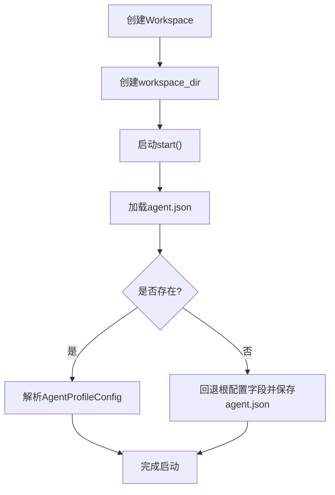
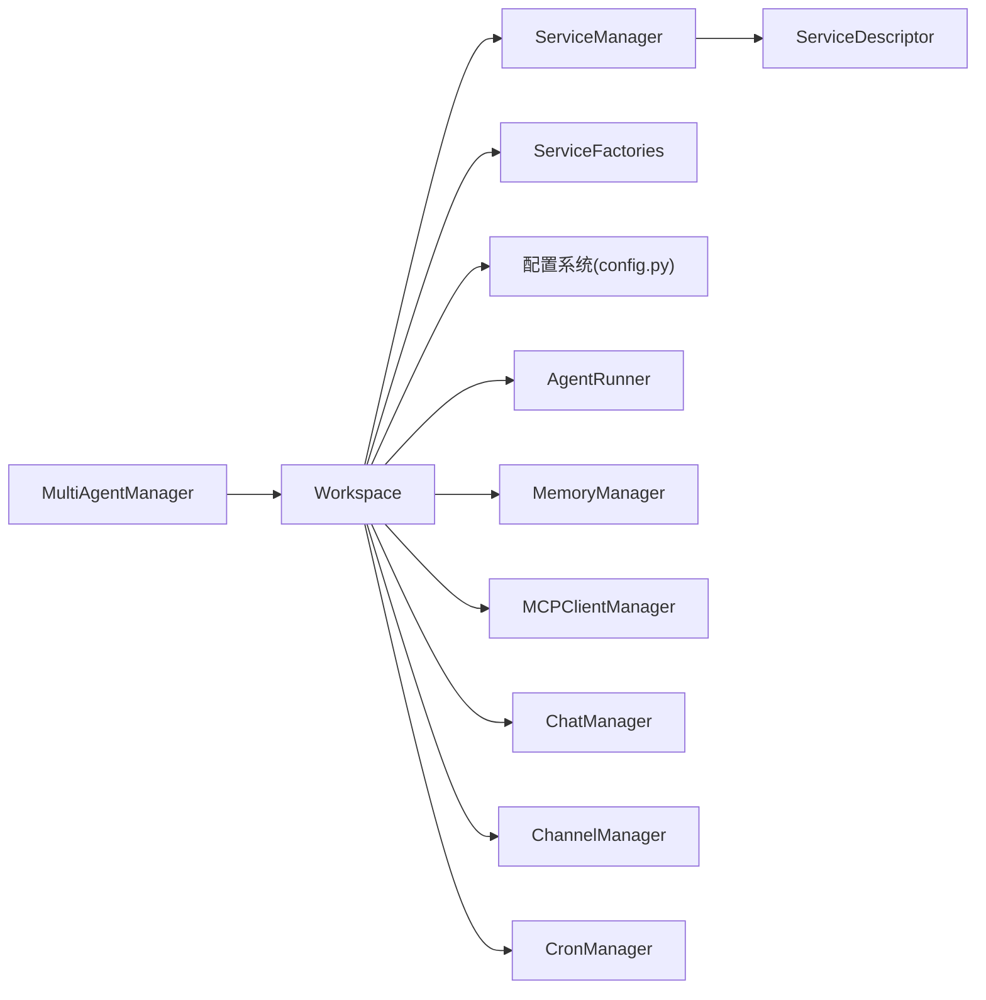

# 工作空间核心实现

<cite>
**本文档引用的文件**
- [workspace.py](file://src/copaw/app/workspace/workspace.py)
- [service_manager.py](file://src/copaw/app/workspace/service_manager.py)
- [service_factories.py](file://src/copaw/app/workspace/service_factories.py)
- [multi_agent_manager.py](file://src/copaw/app/multi_agent_manager.py)
- [_app.py](file://src/copaw/app/_app.py)
- [config.py](file://src/copaw/config/config.py)
- [test_workspace.py](file://tests/unit/workspace/test_workspace.py)
</cite>

## 目录
1. [简介](#简介)
2. [项目结构](#项目结构)
3. [核心组件](#核心组件)
4. [架构总览](#架构总览)
5. [详细组件分析](#详细组件分析)
6. [依赖分析](#依赖分析)
7. [性能考虑](#性能考虑)
8. [故障排查指南](#故障排查指南)
9. [结论](#结论)
10. [附录](#附录)

## 简介
本文件面向CoPaw的工作空间（Workspace）核心实现，系统性阐述其设计理念、架构原理与运行机制。重点覆盖：
- 工作空间生命周期管理：创建、启动、停止、销毁
- 组件注册机制与依赖注入模式：通过ServiceDescriptor声明式注册、ServiceManager统一调度
- 服务注册策略：优先级排序、并发初始化与顺序初始化
- 配置加载：agent_id与workspace_dir的配置、目录结构初始化、agent.json配置文件加载
- 使用示例：从创建到零停机热重载的完整流程
- 错误处理与性能优化策略

## 项目结构
工作空间相关代码集中在应用层的workspace子模块，并与多代理管理器、应用生命周期、配置系统紧密协作：
- 应用入口与多代理管理：在应用生命周期中集中启动/停止所有代理实例
- 工作空间：封装单个代理的完整运行时组件
- 服务管理：统一的服务注册、生命周期与依赖处理
- 配置系统：根配置与代理配置分离，代理配置位于各自工作空间目录

图表来源
- [_app.py:148-239](file://src/copaw/app/_app.py#L148-L239)
- [multi_agent_manager.py:34-82](file://src/copaw/app/multi_agent_manager.py#L34-L82)
- [workspace.py:52-78](file://src/copaw/app/workspace/workspace.py#L52-L78)
- [service_manager.py:74-91](file://src/copaw/app/workspace/service_manager.py#L74-L91)
- [service_factories.py:18-34](file://src/copaw/app/workspace/service_factories.py#L18-L34)
- [config.py:844-928](file://src/copaw/config/config.py#L844-L928)

章节来源
- [_app.py:148-239](file://src/copaw/app/_app.py#L148-L239)
- [multi_agent_manager.py:17-33](file://src/copaw/app/multi_agent_manager.py#L17-L33)
- [workspace.py:39-78](file://src/copaw/app/workspace/workspace.py#L39-L78)
- [service_manager.py:74-91](file://src/copaw/app/workspace/service_manager.py#L74-L91)
- [service_factories.py:18-34](file://src/copaw/app/workspace/service_factories.py#L18-L34)
- [config.py:844-928](file://src/copaw/config/config.py#L844-L928)

## 核心组件
- Workspace：单代理工作空间的容器，负责目录初始化、服务注册、生命周期控制与可复用组件传递
- ServiceDescriptor：服务描述符，定义服务类、初始化参数、后置初始化钩子、启动/停止方法、可复用性、依赖与优先级等
- ServiceManager：统一的服务注册、并发/顺序初始化、启动/停止、可复用组件管理
- ServiceFactories：服务工厂函数，用于在Workspace注册阶段创建或复用具体服务实例
- MultiAgentManager：多代理管理器，支持懒加载、零停机热重载、批量启动与优雅关闭
- 配置系统：根配置（config.json）与代理配置（workspace/agent.json）分离，支持迁移与回退兼容

章节来源
- [workspace.py:39-122](file://src/copaw/app/workspace/workspace.py#L39-L122)
- [service_manager.py:30-72](file://src/copaw/app/workspace/service_manager.py#L30-L72)
- [service_factories.py:18-62](file://src/copaw/app/workspace/service_factories.py#L18-L62)
- [multi_agent_manager.py:17-33](file://src/copaw/app/multi_agent_manager.py#L17-L33)
- [config.py:844-928](file://src/copaw/config/config.py#L844-L928)

## 架构总览
工作空间采用“声明式服务注册 + 统一生命周期管理”的架构模式：
- Workspace在构造时创建ServiceManager并注册所有服务描述符
- ServiceManager按优先级分组，同优先级内并发初始化，不同优先级间顺序执行
- 通过post_init钩子完成跨服务的装配（如将ChatManager注入Runner）
- 支持可复用组件在热重载时传递，避免重复初始化
- 多代理管理器负责全局生命周期与零停机热重载

图表来源
- [multi_agent_manager.py:34-82](file://src/copaw/app/multi_agent_manager.py#L34-L82)
- [workspace.py:311-337](file://src/copaw/app/workspace/workspace.py#L311-L337)
- [service_manager.py:171-200](file://src/copaw/app/workspace/service_manager.py#L171-L200)

## 详细组件分析

### Workspace类设计与生命周期
- 设计理念
  - 将Runner、ChannelManager、MemoryManager、MCPClientManager、CronManager等作为独立服务进行统一管理
  - 通过ServiceDescriptor声明式注册替代硬编码初始化逻辑，提升可维护性与可测试性
- 生命周期
  - 创建：初始化agent_id、workspace_dir（自动创建目录）、ServiceManager；注册全部服务
  - 启动：加载agent配置、调用ServiceManager.start_all()，按优先级并发/顺序启动
  - 停止：调用ServiceManager.stop_all(final)，可选择是否停止可复用组件
  - 销毁：停止后释放资源，状态置为未启动
- 可复用组件
  - 在热重载前通过set_reusable_components传入旧实例中的可复用服务，减少初始化成本
- 属性访问
  - 通过属性委托到ServiceManager.services字典，便于外部安全访问各服务实例

图表来源
- [workspace.py:39-122](file://src/copaw/app/workspace/workspace.py#L39-L122)
- [service_manager.py:74-91](file://src/copaw/app/workspace/service_manager.py#L74-L91)
- [service_manager.py:30-72](file://src/copaw/app/workspace/service_manager.py#L30-L72)

章节来源
- [workspace.py:52-122](file://src/copaw/app/workspace/workspace.py#L52-L122)
- [workspace.py:311-358](file://src/copaw/app/workspace/workspace.py#L311-L358)
- [service_manager.py:74-157](file://src/copaw/app/workspace/service_manager.py#L74-L157)

### 服务注册机制与ServiceDescriptor
- ServiceDescriptor字段
  - name：服务唯一标识
  - service_class：服务类（若为None则仅通过post_init创建/装配）
  - init_args：返回初始化参数的可调用对象
  - post_init：创建/装配后的钩子，常用于跨服务注入
  - start_method/stop_method：启动/停止方法名
  - reusable/reload_func：可复用性与重载钩子
  - dependencies：依赖的服务名称列表
  - priority：启动优先级（数值越小越早启动），停止时逆序
  - concurrent_init：是否允许并发初始化
- 注册策略
  - Workspace._register_services中声明式注册，将Runner置于优先级10，其他核心服务优先级20并允许并发初始化，ChannelManager与CronManager分别在优先级30与40顺序初始化
  - Runner启动作为独立服务在优先级25顺序执行，确保Runner在其他服务之后可用
  - 条件服务（AgentConfigWatcher、MCPConfigWatcher）在优先级50/51顺序初始化，仅在需要时创建

图表来源
- [workspace.py:134-278](file://src/copaw/app/workspace/workspace.py#L134-L278)
- [service_manager.py:158-200](file://src/copaw/app/workspace/service_manager.py#L158-L200)

章节来源
- [workspace.py:134-278](file://src/copaw/app/workspace/workspace.py#L134-L278)
- [service_manager.py:30-72](file://src/copaw/app/workspace/service_manager.py#L30-L72)

### 依赖注入与服务工厂
- 依赖注入模式
  - 通过init_args向服务类注入必需参数（如agent_id、workspace_dir）
  - 通过post_init钩子完成跨服务装配（如将ChatManager/MCPClientManager注入Runner）
- 服务工厂
  - create_mcp_service：根据配置初始化MCPClientManager并注入Runner
  - create_chat_service：创建或复用ChatManager并注入Runner
  - create_channel_service：根据配置创建ChannelManager（条件创建）
  - create_agent_config_watcher/create_mcp_config_watcher：根据需要创建配置监听器

图表来源
- [workspace.py:145-278](file://src/copaw/app/workspace/workspace.py#L145-L278)
- [service_factories.py:18-101](file://src/copaw/app/workspace/service_factories.py#L18-L101)
- [service_factories.py:104-163](file://src/copaw/app/workspace/service_factories.py#L104-L163)

章节来源
- [service_factories.py:18-101](file://src/copaw/app/workspace/service_factories.py#L18-L101)
- [service_factories.py:104-163](file://src/copaw/app/workspace/service_factories.py#L104-L163)

### 多代理管理与零停机热重载
- 懒加载：首次请求时才创建并启动Workspace
- 零停机热重载：新实例先在后台完全启动，再原子替换旧实例，旧实例在任务完成后异步清理
- 批量启动：应用启动时并发启动所有已配置的代理
- 优雅关闭：取消延迟清理任务，逐个停止所有代理

图表来源
- [multi_agent_manager.py:200-311](file://src/copaw/app/multi_agent_manager.py#L200-L311)

章节来源
- [multi_agent_manager.py:34-82](file://src/copaw/app/multi_agent_manager.py#L34-L82)
- [multi_agent_manager.py:200-311](file://src/copaw/app/multi_agent_manager.py#L200-L311)
- [multi_agent_manager.py:338-362](file://src/copaw/app/multi_agent_manager.py#L338-L362)

### 配置加载与目录结构
- agent_id与workspace_dir
  - agent_id：代理唯一标识
  - workspace_dir：代理工作空间目录，构造时自动创建
- 目录结构初始化
  - Workspace在构造时创建工作空间目录
  - 服务工厂在需要时创建特定文件（如chats.json）
- 配置文件加载
  - Workspace在启动时加载agent.json（位于workspace_dir下）
  - 若不存在，则回退到根配置中的字段并生成agent.json以保持兼容
  - 配置迁移：支持从旧版单代理结构迁移到新版多代理结构

图表来源
- [workspace.py:52-61](file://src/copaw/app/workspace/workspace.py#L52-L61)
- [workspace.py:320-322](file://src/copaw/app/workspace/workspace.py#L320-L322)
- [config.py:844-928](file://src/copaw/config/config.py#L844-L928)
- [config.py:966-1101](file://src/copaw/config/config.py#L966-L1101)

章节来源
- [workspace.py:52-61](file://src/copaw/app/workspace/workspace.py#L52-L61)
- [workspace.py:320-322](file://src/copaw/app/workspace/workspace.py#L320-L322)
- [config.py:844-928](file://src/copaw/config/config.py#L844-L928)
- [config.py:966-1101](file://src/copaw/config/config.py#L966-L1101)

## 依赖分析
- 内部依赖
  - Workspace依赖ServiceManager与ServiceDescriptor进行服务管理
  - ServiceFactories在注册阶段被调用，完成跨服务装配
  - MultiAgentManager依赖Workspace进行实例化与生命周期管理
- 外部依赖
  - 配置系统：根配置与代理配置模型
  - 运行时组件：AgentRunner、MemoryManager、MCPClientManager、ChatManager、ChannelManager、CronManager等
- 耦合与内聚
  - Workspace与ServiceManager高内聚，通过描述符解耦具体服务类
  - ServiceFactories提供低耦合的装配逻辑，便于测试与扩展

图表来源
- [workspace.py:134-278](file://src/copaw/app/workspace/workspace.py#L134-L278)
- [service_manager.py:74-91](file://src/copaw/app/workspace/service_manager.py#L74-L91)
- [service_factories.py:18-101](file://src/copaw/app/workspace/service_factories.py#L18-L101)
- [multi_agent_manager.py:34-82](file://src/copaw/app/multi_agent_manager.py#L34-L82)
- [config.py:844-928](file://src/copaw/config/config.py#L844-L928)

章节来源
- [workspace.py:134-278](file://src/copaw/app/workspace/workspace.py#L134-L278)
- [service_manager.py:74-91](file://src/copaw/app/workspace/service_manager.py#L74-L91)
- [service_factories.py:18-101](file://src/copaw/app/workspace/service_factories.py#L18-L101)
- [multi_agent_manager.py:34-82](file://src/copaw/app/multi_agent_manager.py#L34-L82)
- [config.py:844-928](file://src/copaw/config/config.py#L844-L928)

## 性能考虑
- 并发初始化
  - 同优先级内的服务尽可能并发启动，显著缩短启动时间
  - 顺序服务严格遵循依赖关系，保证启动顺序正确
- 可复用组件
  - 热重载时传递可复用组件（如MemoryManager、ChatManager），避免重复初始化
- 异步与非阻塞
  - ServiceManager使用asyncio.gather进行并发等待，异常不影响整体流程
  - 多代理管理器的热重载采用“先启动新实例，再原子替换”的策略，最小化阻塞
- 日志与可观测性
  - 关键步骤均记录日志，便于定位性能瓶颈与问题

[本节为通用性能讨论，不直接分析具体文件]

## 故障排查指南
- 启动失败
  - 现象：start()抛出异常并自动尝试stop()
  - 排查：检查agent.json是否存在且格式正确；确认依赖服务（如MCP、Channel）配置是否有效
- 停止异常
  - 现象：stop()过程中某些服务停止失败但不会中断整体关闭
  - 排查：查看对应服务的stop_method实现；确认是否为可复用服务导致跳过停止
- 热重载失败
  - 现象：新实例启动失败或替换失败
  - 排查：检查新实例的启动日志；确认可复用组件传递是否成功；必要时回滚到旧实例
- 配置不生效
  - 现象：修改配置后未生效
  - 排查：确认是否需要触发热重载；检查配置路径与权限；验证agent.json是否被正确生成

章节来源
- [workspace.py:330-337](file://src/copaw/app/workspace/workspace.py#L330-L337)
- [service_manager.py:324-360](file://src/copaw/app/workspace/service_manager.py#L324-L360)
- [multi_agent_manager.py:274-289](file://src/copaw/app/multi_agent_manager.py#L274-L289)

## 结论
Workspace通过声明式服务注册与统一生命周期管理，实现了高内聚、低耦合的工作空间架构。配合ServiceDescriptor的优先级与并发策略、ServiceFactories的依赖注入与装配、以及MultiAgentManager的零停机热重载能力，形成了稳定、可扩展、易维护的多代理运行时框架。配置系统的兼容性设计进一步保障了升级与回退的平滑过渡。

[本节为总结性内容，不直接分析具体文件]

## 附录

### 使用示例：工作空间的创建、启动、停止与销毁
- 创建
  - 通过MultiAgentManager.get_agent(agent_id)懒加载或创建并启动Workspace
  - 或直接实例化Workspace(agent_id, workspace_dir)
- 启动
  - 调用workspace.start()，内部会加载agent.json并按优先级并发/顺序启动服务
- 停止
  - 调用workspace.stop(final=True)停止所有服务；若final=False则跳过可复用服务
- 销毁
  - 停止后释放资源，状态置为未启动；热重载时由MultiAgentManager原子替换实例

章节来源
- [multi_agent_manager.py:34-82](file://src/copaw/app/multi_agent_manager.py#L34-L82)
- [workspace.py:311-358](file://src/copaw/app/workspace/workspace.py#L311-L358)
- [test_workspace.py:8-24](file://tests/unit/workspace/test_workspace.py#L8-L24)

### 配置选项与最佳实践
- agent_id
  - 建议使用短UUID（6字符），便于URL与日志识别
- workspace_dir
  - 建议位于WORKING_DIR下的独立子目录，确保权限与磁盘空间充足
- 服务优先级
  - Runner优先级10，核心服务20，Runner启动25，ChannelManager30，CronManager40，配置监听器50/51
- 并发初始化
  - 对于无依赖的内存型服务（如MemoryManager、ChatManager、MCPClientManager）设置concurrent_init=True
- 可复用组件
  - 对于可复用服务（如MemoryManager、ChatManager）在热重载前通过set_reusable_components传递
- 错误处理
  - 启动失败自动回滚；停止失败记录警告但不中断关闭；热重载失败保留旧实例

章节来源
- [workspace.py:145-278](file://src/copaw/app/workspace/workspace.py#L145-L278)
- [service_manager.py:171-200](file://src/copaw/app/workspace/service_manager.py#L171-L200)
- [multi_agent_manager.py:257-273](file://src/copaw/app/multi_agent_manager.py#L257-L273)