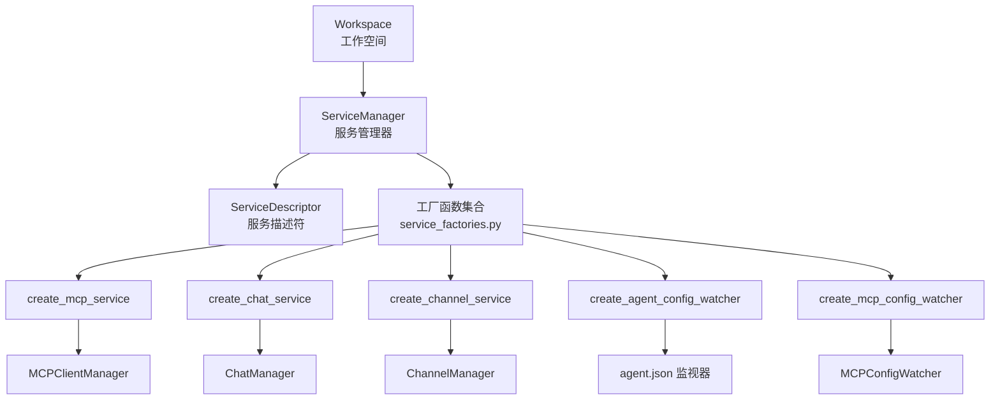
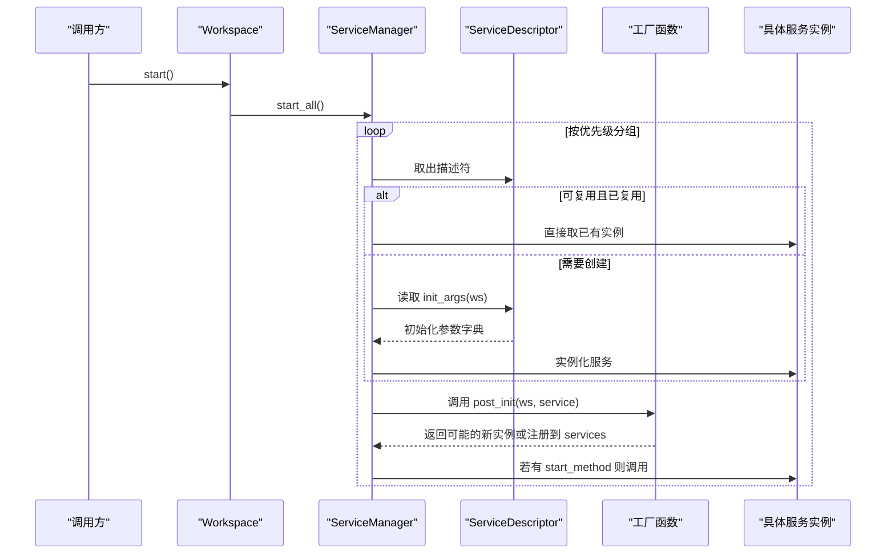
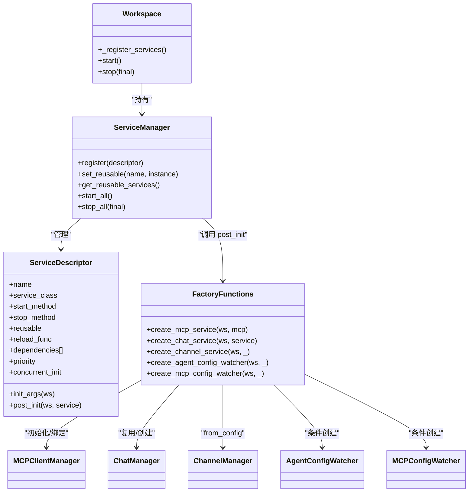

# 服务工厂

<cite>
**本文引用的文件列表**
- [service_factories.py](file://src/copaw/app/workspace/service_factories.py)
- [service_manager.py](file://src/copaw/app/workspace/service_manager.py)
- [workspace.py](file://src/copaw/app/workspace/workspace.py)
- [agent_config_watcher.py](file://src/copaw/app/agent_config_watcher.py)
- [watcher.py](file://src/copaw/app/mcp/watcher.py)
- [manager.py](file://src/copaw/app/runner/manager.py)
- [manager.py](file://src/copaw/app/channels/manager.py)
</cite>

## 目录
1. [简介](#简介)
2. [项目结构](#项目结构)
3. [核心组件](#核心组件)
4. [架构总览](#架构总览)
5. [详细组件分析](#详细组件分析)
6. [依赖关系分析](#依赖关系分析)
7. [性能考量](#性能考量)
8. [故障排查指南](#故障排查指南)
9. [结论](#结论)
10. [附录](#附录)

## 简介
本文件系统性阐述 CoPaw 的“服务工厂”体系，重点围绕 Workspace 的服务注册与生命周期管理，以及一组“工厂函数”如何在统一的 ServiceManager 框架下创建并装配各类服务组件。文档将深入解释 create_mcp_service、create_chat_service、create_channel_service、create_agent_config_watcher、create_mcp_config_watcher 等工厂函数的设计意图、参数传递机制、依赖注入模式与配置生成策略，并提供可操作的使用示例与扩展建议，兼顾初学者与高级用户的理解深度。

## 项目结构
服务工厂体系位于工作空间模块，核心文件如下：
- 工作空间与服务管理：workspace.py、service_manager.py
- 工厂函数：service_factories.py
- 监视器：agent_config_watcher.py、mcp/watcher.py
- 关键服务：runner/manager.py（聊天管理）、channels/manager.py（通道管理）

图表来源
- [workspace.py:134-277](file://src/copaw/app/workspace/workspace.py#L134-L277)
- [service_manager.py:74-415](file://src/copaw/app/workspace/service_manager.py#L74-L415)
- [service_factories.py:18-164](file://src/copaw/app/workspace/service_factories.py#L18-L164)

章节来源
- [workspace.py:134-277](file://src/copaw/app/workspace/workspace.py#L134-L277)
- [service_manager.py:74-415](file://src/copaw/app/workspace/service_manager.py#L74-L415)
- [service_factories.py:18-164](file://src/copaw/app/workspace/service_factories.py#L18-L164)

## 核心组件
- ServiceDescriptor：声明式服务元数据，包含服务名、构造类、初始化参数、后置初始化钩子、启动/停止方法、优先级、并发策略、可复用性等。
- ServiceManager：统一注册、启动/停止、依赖解析与热重载复用的服务编排器。
- 工厂函数：以 Workspace 为上下文，按需创建或复用服务实例，并进行跨组件装配。

章节来源
- [service_manager.py:30-72](file://src/copaw/app/workspace/service_manager.py#L30-L72)
- [service_manager.py:74-415](file://src/copaw/app/workspace/service_manager.py#L74-L415)
- [workspace.py:134-277](file://src/copaw/app/workspace/workspace.py#L134-L277)

## 架构总览
服务工厂采用“描述符 + 管理器 + 工厂函数”的分层设计：
- 描述符层：以 ServiceDescriptor 声明服务的生命周期与依赖。
- 管理器层：ServiceManager 解析优先级与依赖，按序并发/串行启动/停止服务，处理可复用组件的热重载。
- 工厂层：工厂函数在 post_init 阶段执行，负责复杂对象的创建、配置加载与跨组件绑定。

图表来源
- [workspace.py:311-337](file://src/copaw/app/workspace/workspace.py#L311-L337)
- [service_manager.py:171-323](file://src/copaw/app/workspace/service_manager.py#L171-L323)
- [service_manager.py:201-323](file://src/copaw/app/workspace/service_manager.py#L201-L323)

## 详细组件分析

### ServiceDescriptor 与 ServiceManager
- ServiceDescriptor 提供服务的“声明式配置”，包括：
  - 名称、类、初始化参数回调、后置初始化钩子、启动/停止方法名、是否可复用、依赖列表、优先级、是否并发初始化。
- ServiceManager 的职责：
  - 注册描述符、按优先级与依赖排序、并发/串行启动、异常捕获与日志记录、停止阶段的可复用跳过与最终关闭。
  - 提供 set_reusable 与 get_reusable_services，支撑热重载场景下的组件复用。

章节来源
- [service_manager.py:30-72](file://src/copaw/app/workspace/service_manager.py#L30-L72)
- [service_manager.py:74-415](file://src/copaw/app/workspace/service_manager.py#L74-L415)

### 工作空间注册流程
Workspace 在初始化时调用 _register_services，通过 ServiceDescriptor 将各服务注册到 ServiceManager，并设定优先级与依赖顺序。例如：
- Runner（优先级 10）先于其他服务启动；
- MemoryManager（优先级 20）并发初始化，并在 post_init 中将自身注入 Runner；
- MCPManager（优先级 20）通过工厂函数 create_mcp_service 完成 MCP 初始化与 Runner 绑定；
- ChatManager（优先级 20）通过工厂函数 create_chat_service 复用或新建，并绑定到 Runner；
- ChannelManager（优先级 30）在 post_init 中从配置创建；
- CronManager（优先级 40）随后启动；
- AgentConfigWatcher（优先级 50）与 MCPConfigWatcher（优先级 51）在条件满足时创建并启动。

章节来源
- [workspace.py:134-277](file://src/copaw/app/workspace/workspace.py#L134-L277)

### 工厂函数详解

#### create_mcp_service
- 功能：根据 Workspace 配置初始化 MCPClientManager，并将其设置到 Runner 上。
- 参数传递机制：接收 Workspace 实例与 MCPClientManager 实例，从 Workspace 的内部配置读取 MCP 配置并初始化，失败时记录警告日志。
- 依赖注入：将 MCP 管理器注入 Runner 的 set_mcp_manager 方法，建立运行时依赖。
- 使用场景：当 Workspace 配置中存在 MCP 配置时，需要在 Runner 启动前完成 MCP 管理器的初始化与绑定。

章节来源
- [service_factories.py:18-34](file://src/copaw/app/workspace/service_factories.py#L18-L34)

#### create_chat_service
- 功能：创建或复用 ChatManager，并始终将其绑定到 Runner。
- 参数传递机制：接收 Workspace 实例与现有 ChatManager（可为 None）。若传入非空，则直接复用；否则创建新的 ChatManager 并持久化到 Workspace 的服务字典。
- 依赖注入：通过 Runner 的 set_chat_manager 方法完成绑定。
- 使用场景：在多实例或热重载场景下，允许复用已存在的 ChatManager 以避免重复初始化。

章节来源
- [service_factories.py:36-62](file://src/copaw/app/workspace/service_factories.py#L36-L62)

#### create_channel_service
- 功能：根据 Workspace 配置创建 ChannelManager；若未配置通道则返回 None。
- 参数传递机制：从 Workspace 的临时 Config 对象读取 channels 配置，结合 Runner 进程处理器与工作目录创建 ChannelManager。
- 依赖注入：通过 Workspace 的服务字典注册 channel_manager，并返回实例以便后续使用。
- 使用场景：当 agent.json 或 config.json 中启用了至少一种通道时，需要创建并启动 ChannelManager。

章节来源
- [service_factories.py:64-101](file://src/copaw/app/workspace/service_factories.py#L64-L101)

#### create_agent_config_watcher
- 功能：在存在 ChannelManager 或 CronManager 时创建 AgentConfigWatcher，用于监听 agent.json 的变更并自动重载通道与心跳。
- 参数传递机制：从 Workspace 的服务字典获取 channel_manager 与 cron_manager，构造 watcher 并注册到服务字典。
- 使用场景：需要在不重启服务的情况下动态调整通道配置与心跳调度。

章节来源
- [service_factories.py:104-131](file://src/copaw/app/workspace/service_factories.py#L104-L131)

#### create_mcp_config_watcher
- 功能：在存在 MCP 管理器时创建 MCPConfigWatcher，用于监听 MCP 配置变更并热重载客户端。
- 参数传递机制：通过配置加载器从 agent.json 加载 MCP 配置，构造 watcher 并注册到服务字典。
- 使用场景：需要在不重启服务的情况下动态增删改 MCP 客户端。

章节来源
- [service_factories.py:134-163](file://src/copaw/app/workspace/service_factories.py#L134-L163)

### 关键服务与监视器

#### ChatManager（来自 runner/manager.py）
- 职责：管理聊天规范（ChatSpec）的持久化与查询，不负责会话状态管理。
- 典型方法：列出聊天、获取聊天、创建/更新/删除聊天、按用户/通道过滤计数等。
- 与工厂的关系：create_chat_service 可复用已存在的 ChatManager 实例，减少 IO 与初始化成本。

章节来源
- [manager.py:17-200](file://src/copaw/app/runner/manager.py#L17-L200)

#### ChannelManager（来自 channels/manager.py）
- 职责：维护通道队列与消费者循环，按通道类型处理入站消息并转发至 Runner。
- 典型方法：from_config 从配置创建通道、启动/停止、入队与批处理等。
- 与工厂的关系：create_channel_service 通过 from_config 从 Workspace 配置创建 ChannelManager。

章节来源
- [manager.py:114-200](file://src/copaw/app/channels/manager.py#L114-L200)

#### AgentConfigWatcher（来自 agent_config_watcher.py）
- 职责：轮询 agent.json，检测通道与心跳配置变化，增量重载通道与心跳调度。
- 特性：快照哈希对比、失败回滚、线程安全与异步任务管理。

章节来源
- [agent_config_watcher.py:35-278](file://src/copaw/app/agent_config_watcher.py#L35-L278)

#### MCPConfigWatcher（来自 mcp/watcher.py）
- 职责：轮询 MCP 配置，检测客户端变更，按需新增、替换或移除 MCP 客户端。
- 特性：并发重载控制、失败重试上限、失败跟踪与跳过策略。

章节来源
- [watcher.py:26-334](file://src/copaw/app/mcp/watcher.py#L26-L334)

## 依赖关系分析

图表来源
- [workspace.py:134-277](file://src/copaw/app/workspace/workspace.py#L134-L277)
- [service_manager.py:74-415](file://src/copaw/app/workspace/service_manager.py#L74-L415)
- [service_factories.py:18-164](file://src/copaw/app/workspace/service_factories.py#L18-L164)

章节来源
- [workspace.py:134-277](file://src/copaw/app/workspace/workspace.py#L134-L277)
- [service_manager.py:74-415](file://src/copaw/app/workspace/service_manager.py#L74-L415)
- [service_factories.py:18-164](file://src/copaw/app/workspace/service_factories.py#L18-L164)

## 性能考量
- 并发初始化：ServiceDescriptor.concurrent_init 为 True 的服务可并行启动，降低冷启动时间。
- 优先级与依赖：通过 priority 与 dependencies 控制启动顺序，避免不必要的串行等待。
- 可复用组件：set_reusable 支持热重载场景下的内存与 IO 复用，减少重建成本。
- 异步轮询：AgentConfigWatcher 与 MCPConfigWatcher 使用异步任务与轮询，避免阻塞主线程。
- 失败隔离：MCPConfigWatcher 的失败重试与跳过策略防止单个客户端失败拖垮整体。

## 故障排查指南
- 启动失败：检查 ServiceManager 的 start_all 日志，定位具体服务的 post_init 或 start 抛错。
- 服务未启动：确认 ServiceDescriptor 的 start_method 是否正确，以及依赖是否满足。
- 配置未生效：确认 create_channel_service 与 create_mcp_service 的条件分支是否被触发（配置是否存在）。
- 热重载无效：确认 set_reusable 调用时机（必须在 start_all 之前），并检查可复用标记与 reload_func。
- 监视器不工作：检查 AgentConfigWatcher/MCPConfigWatcher 的轮询间隔、配置路径与快照哈希逻辑。

章节来源
- [service_manager.py:171-323](file://src/copaw/app/workspace/service_manager.py#L171-L323)
- [service_manager.py:324-415](file://src/copaw/app/workspace/service_manager.py#L324-L415)
- [agent_config_watcher.py:74-95](file://src/copaw/app/agent_config_watcher.py#L74-L95)
- [watcher.py:69-106](file://src/copaw/app/mcp/watcher.py#L69-L106)

## 结论
CoPaw 的服务工厂体系通过“描述符 + 管理器 + 工厂函数”的分层设计，实现了服务的声明式注册、可复用的热重载与灵活的配置驱动装配。工厂函数在 post_init 阶段承担了复杂对象创建与跨组件绑定的任务，配合监视器实现了运行时配置的动态更新。该体系既保证了可测试性与可维护性，也为扩展新服务与自定义工厂提供了清晰的接口与最佳实践路径。

## 附录

### 使用示例与最佳实践

- 创建并启动工作空间
  - 步骤：实例化 Workspace → 调用 start → ServiceManager 按优先级启动各服务 → 工厂函数完成跨组件绑定。
  - 注意：确保 Workspace 配置已加载（Workspace.config 会在首次访问时加载 agent.json）。

- 自定义服务创建
  - 新增 ServiceDescriptor：在 Workspace._register_services 中注册新的服务描述符。
  - 新增工厂函数：在 service_factories.py 中编写工厂函数，必要时在 Workspace 属性中暴露访问器。
  - 最佳实践：为新服务设置合理的 priority、dependencies、reusable 与 start_method。

- 条件服务创建
  - ChannelManager、AgentConfigWatcher、MCPConfigWatcher 均在条件满足时才创建，避免无用资源占用。
  - 扩展思路：在工厂函数中增加更多条件判断，或引入配置开关。

- 热重载与复用
  - 使用 set_reusable 将旧实例转移给新 Workspace，减少 IO 与初始化成本。
  - 确保服务具备可复用性（reusable=True）并在需要时提供 reload_func。

- 配置生成策略
  - ChannelManager 通过 from_config 从配置对象创建，支持默认值合并与启用标志检查。
  - MCPConfigWatcher 通过配置加载器动态读取 MCP 配置，支持快照哈希对比与增量重载。

章节来源
- [workspace.py:279-357](file://src/copaw/app/workspace/workspace.py#L279-L357)
- [service_factories.py:64-101](file://src/copaw/app/workspace/service_factories.py#L64-L101)
- [service_factories.py:104-163](file://src/copaw/app/workspace/service_factories.py#L104-L163)
- [manager.py:157-200](file://src/copaw/app/channels/manager.py#L157-L200)
- [watcher.py:129-140](file://src/copaw/app/mcp/watcher.py#L129-L140)