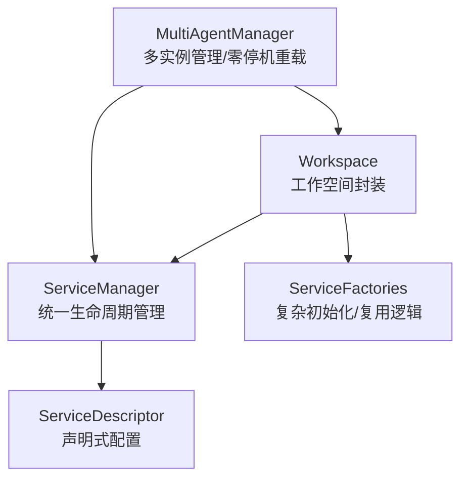
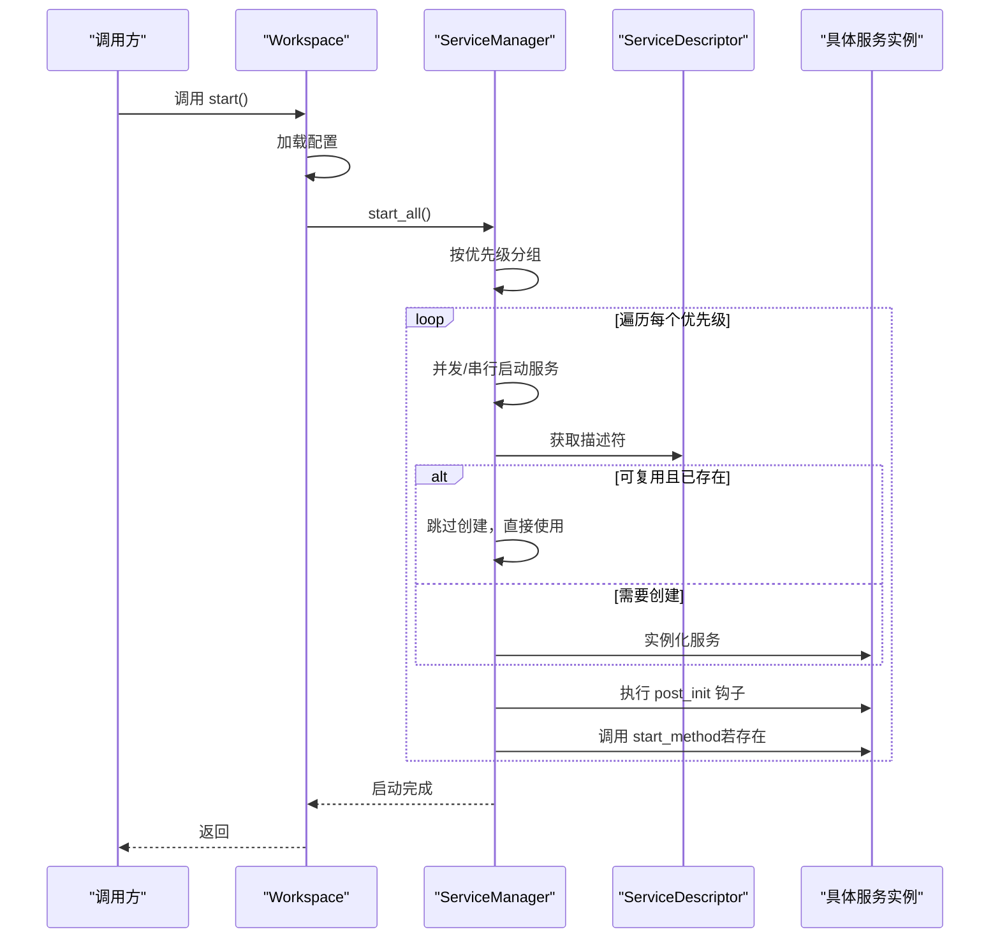
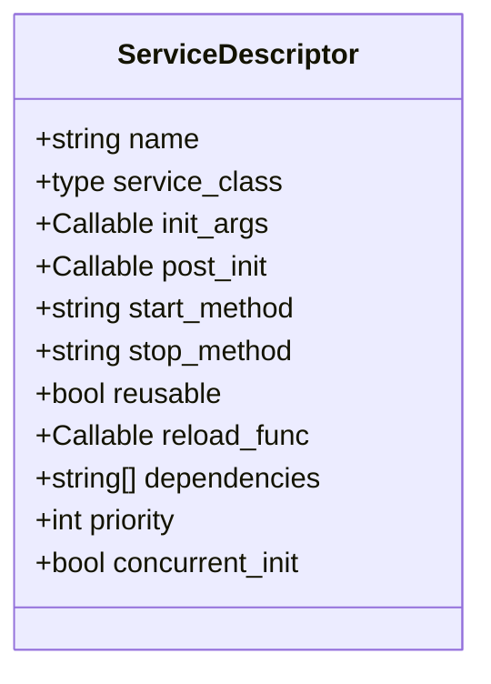
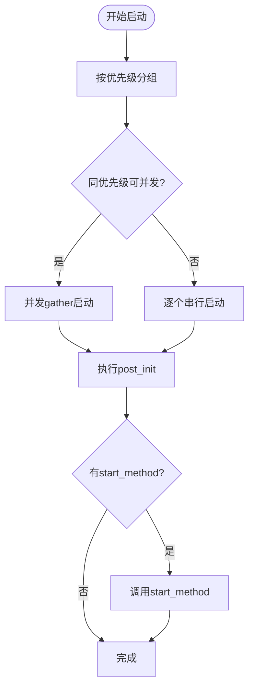
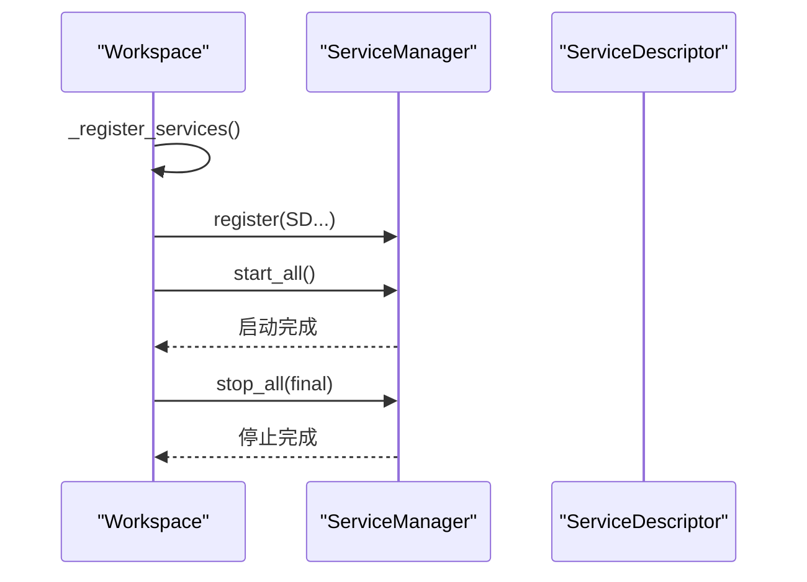
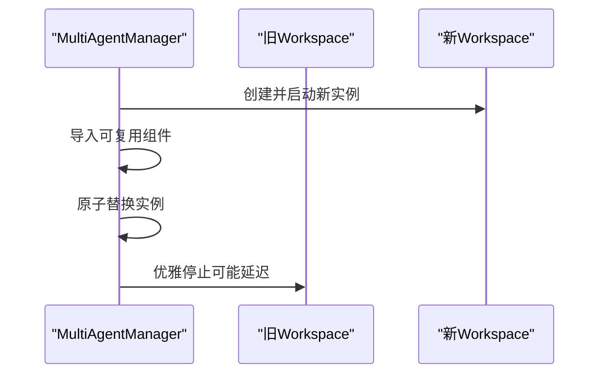
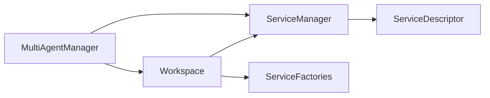

# 服务管理器

<cite>
**本文引用的文件列表**
- [service_manager.py](file://src/copaw/app/workspace/service_manager.py)
- [workspace.py](file://src/copaw/app/workspace/workspace.py)
- [service_factories.py](file://src/copaw/app/workspace/service_factories.py)
- [multi_agent_manager.py](file://src/copaw/app/multi_agent_manager.py)
- [test_workspace.py](file://tests/unit/workspace/test_workspace.py)
</cite>

## 目录
1. [简介](#简介)
2. [项目结构](#项目结构)
3. [核心组件](#核心组件)
4. [架构总览](#架构总览)
5. [详细组件分析](#详细组件分析)
6. [依赖关系分析](#依赖关系分析)
7. [性能考量](#性能考量)
8. [故障排查指南](#故障排查指南)
9. [结论](#结论)
10. [附录：使用示例与最佳实践](#附录使用示例与最佳实践)

## 简介
本文件面向初学者与高级用户，系统化阐述 CoPaw 的服务管理器（ServiceManager）设计与实现，重点覆盖：
- 服务注册与声明式配置（ServiceDescriptor）
- 生命周期管理（启动/停止/重启）
- 启动顺序控制、并发初始化策略与依赖关系处理
- 资源共享与重用机制（热重载）
- 错误恢复与日志记录
- 实际使用示例与扩展建议

## 项目结构
围绕服务管理器的关键文件组织如下：
- 服务管理器与描述符定义：src/copaw/app/workspace/service_manager.py
- 工作空间集成与服务注册：src/copaw/app/workspace/workspace.py
- 服务工厂函数（用于复杂初始化与复用逻辑）：src/copaw/app/workspace/service_factories.py
- 多实例管理与零停机热重载：src/copaw/app/multi_agent_manager.py
- 单元测试（验证工作空间行为）：tests/unit/workspace/test_workspace.py

图表来源
- [service_manager.py:74-415](file://src/copaw/app/workspace/service_manager.py#L74-L415)
- [workspace.py:39-367](file://src/copaw/app/workspace/workspace.py#L39-L367)
- [service_factories.py:18-164](file://src/copaw/app/workspace/service_factories.py#L18-L164)
- [multi_agent_manager.py:17-451](file://src/copaw/app/multi_agent_manager.py#L17-L451)

章节来源
- [service_manager.py:1-415](file://src/copaw/app/workspace/service_manager.py#L1-L415)
- [workspace.py:1-367](file://src/copaw/app/workspace/workspace.py#L1-L367)
- [service_factories.py:1-164](file://src/copaw/app/workspace/service_factories.py#L1-L164)
- [multi_agent_manager.py:1-451](file://src/copaw/app/multi_agent_manager.py#L1-L451)

## 核心组件
- ServiceDescriptor：声明式服务配置，包含服务类、初始化参数、后置初始化钩子、启动/停止方法、是否可复用、重载回调、依赖列表、优先级、是否允许并发初始化等。
- ServiceManager：统一注册、生命周期编排、依赖解析、并发初始化与资源复用。
- Workspace：工作空间封装，负责在启动时注册所有服务，并通过 ServiceManager 管理其生命周期。
- ServiceFactories：提供复杂初始化与复用逻辑（如聊天管理器、通道管理器、MCP 管理器等），便于测试与解耦。
- MultiAgentManager：多实例管理器，支持零停机热重载，利用 ServiceManager 的复用能力实现平滑切换。

章节来源
- [service_manager.py:30-72](file://src/copaw/app/workspace/service_manager.py#L30-L72)
- [service_manager.py:74-415](file://src/copaw/app/workspace/service_manager.py#L74-L415)
- [workspace.py:134-277](file://src/copaw/app/workspace/workspace.py#L134-L277)
- [service_factories.py:18-164](file://src/copaw/app/workspace/service_factories.py#L18-L164)
- [multi_agent_manager.py:200-311](file://src/copaw/app/multi_agent_manager.py#L200-L311)

## 架构总览
服务管理器采用“声明式配置 + 统一编排”的架构：
- 通过 ServiceDescriptor 声明服务的类型、初始化方式、生命周期钩子与依赖关系；
- ServiceManager 按优先级分组并行或串行启动服务，支持并发初始化与重用；
- Workspace 在启动时集中注册服务，暴露属性访问；
- MultiAgentManager 在多实例场景下进行零停机热重载，借助 ServiceManager 的复用能力完成原子替换。

图表来源
- [workspace.py:311-337](file://src/copaw/app/workspace/workspace.py#L311-L337)
- [service_manager.py:171-229](file://src/copaw/app/workspace/service_manager.py#L171-L229)
- [service_manager.py:201-260](file://src/copaw/app/workspace/service_manager.py#L201-L260)
- [service_manager.py:262-322](file://src/copaw/app/workspace/service_manager.py#L262-L322)

## 详细组件分析

### ServiceDescriptor：服务配置模型
- 关键字段
  - name：服务唯一标识
  - service_class：服务类（None 表示由 post_init 创建）
  - init_args：返回初始化参数的可调用对象
  - post_init：后置初始化钩子（可异步），用于复杂装配或复用
  - start_method/stop_method：启动/停止方法名
  - reusable/reload_func：是否可复用及复用时的重载回调
  - dependencies：前置依赖服务名称列表（当前实现未强制校验，但可通过优先级与顺序保证）
  - priority：启动优先级（越小越早）
  - concurrent_init：是否允许并发初始化

图表来源
- [service_manager.py:30-72](file://src/copaw/app/workspace/service_manager.py#L30-L72)

章节来源
- [service_manager.py:30-72](file://src/copaw/app/workspace/service_manager.py#L30-L72)

### ServiceManager：生命周期编排与并发策略
- 注册与发现
  - register：注册 ServiceDescriptor；重复注册会警告并覆盖。
- 启动流程
  - start_all：按优先级分组，同一优先级内先并发（concurrent_init=True）再串行（concurrent_init=False）。
  - _start_service：根据是否复用决定创建或复用实例，执行 post_init，再调用 start_method。
  - _get_or_create_service：从 init_args 获取参数并实例化服务。
  - _run_post_init：支持同步/异步 post_init，可返回新实例并自动登记。
  - _run_start_method：动态调用 start_method，支持协程。
- 停止流程
  - stop_all：逆序优先级停止，同一优先级并发停止；可选择是否停止可复用服务（final 控制）。
  - _stop_service：跳过可复用且非 final 的服务；若存在 stop_method 则调用。
- 复用与热重载
  - set_reusable：标记某服务可复用并注入实例；若 descriptor 提供 reload_func，则在复用时调用。
  - get_reusable_services：导出可复用实例集合，供新实例导入。
- 日志与异常
  - 启动失败会记录异常并抛出；停止阶段捕获异常并记录警告，不中断整体关闭流程。

图表来源
- [service_manager.py:171-229](file://src/copaw/app/workspace/service_manager.py#L171-L229)
- [service_manager.py:262-322](file://src/copaw/app/workspace/service_manager.py#L262-L322)

章节来源
- [service_manager.py:92-156](file://src/copaw/app/workspace/service_manager.py#L92-L156)
- [service_manager.py:171-229](file://src/copaw/app/workspace/service_manager.py#L171-L229)
- [service_manager.py:230-322](file://src/copaw/app/workspace/service_manager.py#L230-L322)
- [service_manager.py:324-415](file://src/copaw/app/workspace/service_manager.py#L324-L415)

### Workspace：服务注册与生命周期入口
- 服务注册
  - 在 _register_services 中集中注册各服务，明确优先级与并发策略。
  - 使用 ServiceDescriptor 定义服务类、初始化参数、后置初始化、启动/停止方法、是否可复用等。
- 启停流程
  - start：加载配置后委托 ServiceManager 启动所有服务；失败则回滚并停止已启动部分。
  - stop：委托 ServiceManager 停止服务，final 参数控制是否停止可复用服务。
- 复用接口
  - set_reusable_components：在启动前导入可复用组件（如 MemoryManager、ChatManager）。

图表来源
- [workspace.py:134-277](file://src/copaw/app/workspace/workspace.py#L134-L277)
- [workspace.py:311-357](file://src/copaw/app/workspace/workspace.py#L311-L357)

章节来源
- [workspace.py:134-277](file://src/copaw/app/workspace/workspace.py#L134-L277)
- [workspace.py:279-357](file://src/copaw/app/workspace/workspace.py#L279-L357)

### ServiceFactories：复杂初始化与复用逻辑
- create_mcp_service：基于配置初始化 MCP 管理器，并将其挂接到 runner。
- create_chat_service：复用或新建 ChatManager，并始终绑定到新的 runner。
- create_channel_service：按配置创建 ChannelManager（条件性）。
- create_agent_config_watcher/create_mcp_config_watcher：按需创建配置监听器。

这些工厂函数作为 post_init 的一部分，承担了复杂装配与跨组件绑定职责，提升可测试性与可维护性。

章节来源
- [service_factories.py:18-164](file://src/copaw/app/workspace/service_factories.py#L18-L164)

### MultiAgentManager：零停机热重载
- reload_agent：以“先创建新实例、再原子替换、最后优雅停止旧实例”的方式实现零停机重载。
- 复用策略：从旧实例导出可复用服务，导入到新实例中，减少重启成本。
- 清理策略：若旧实例仍有活跃任务，延迟清理并在后台等待任务完成。

图表来源
- [multi_agent_manager.py:200-311](file://src/copaw/app/multi_agent_manager.py#L200-L311)

章节来源
- [multi_agent_manager.py:200-311](file://src/copaw/app/multi_agent_manager.py#L200-L311)

## 依赖关系分析
- Workspace 依赖 ServiceManager 进行服务注册与生命周期管理。
- ServiceManager 依赖 ServiceDescriptor 描述服务配置。
- ServiceFactories 作为 Workspace 的辅助模块，提供复杂初始化与复用逻辑。
- MultiAgentManager 依赖 Workspace 与 ServiceManager，实现零停机热重载。

图表来源
- [workspace.py:17-31](file://src/copaw/app/workspace/workspace.py#L17-L31)
- [service_manager.py:74-91](file://src/copaw/app/workspace/service_manager.py#L74-L91)
- [service_factories.py:18-164](file://src/copaw/app/workspace/service_factories.py#L18-L164)
- [multi_agent_manager.py:17-32](file://src/copaw/app/multi_agent_manager.py#L17-L32)

章节来源
- [workspace.py:17-31](file://src/copaw/app/workspace/workspace.py#L17-L31)
- [service_manager.py:74-91](file://src/copaw/app/workspace/service_manager.py#L74-L91)
- [service_factories.py:18-164](file://src/copaw/app/workspace/service_factories.py#L18-L164)
- [multi_agent_manager.py:17-32](file://src/copaw/app/multi_agent_manager.py#L17-L32)

## 性能考量
- 启动并发：同一优先级内尽可能并发初始化，显著缩短启动时间。
- 串行约束：对需要严格顺序的服务（如 Runner 启动）使用串行，避免竞争条件。
- 复用策略：通过可复用服务减少重启成本，尤其适用于大对象（如内存管理器、聊天管理器）。
- 停止并发：停止阶段同样采用并发，但保留 final 参数以支持优雅关闭。
- 异常隔离：启动/停止阶段的异常被记录并传播，避免阻塞其他服务。

[本节为通用性能讨论，无需列出章节来源]

## 故障排查指南
- 启动失败
  - 检查对应服务的 init_args、post_init 是否正确返回实例。
  - 查看日志中的异常堆栈，定位具体服务。
- 停止异常
  - 停止阶段会记录警告但不中断流程；检查相关服务的 stop_method 是否存在且可调用。
- 复用问题
  - 确认服务在 ServiceDescriptor 中标记为 reusable，并在 post_init 中正确处理复用逻辑。
  - 若提供 reload_func，请确保其在复用时能正确迁移状态。
- 零停机重载
  - 若旧实例仍有活跃任务，清理会被延迟；可在后台观察清理日志。

章节来源
- [service_manager.py:223-228](file://src/copaw/app/workspace/service_manager.py#L223-L228)
- [service_manager.py:355-359](file://src/copaw/app/workspace/service_manager.py#L355-L359)
- [workspace.py:330-336](file://src/copaw/app/workspace/workspace.py#L330-L336)

## 结论
ServiceManager 通过声明式配置与统一编排，实现了服务的可插拔、可复用与高可靠运行。结合 MultiAgentManager 的零停机热重载能力，CoPaw 能够在生产环境中实现平滑升级与资源高效复用。对于扩展者而言，遵循 ServiceDescriptor 的约定、合理设置优先级与并发策略、在 post_init 中处理复杂装配与复用逻辑，是构建稳定服务的关键。

[本节为总结性内容，无需列出章节来源]

## 附录：使用示例与最佳实践

### 示例一：注册一个基础服务
- 步骤
  - 定义 ServiceDescriptor，指定 service_class、init_args、start_method、stop_method、priority、concurrent_init。
  - 在 Workspace._register_services 中调用 sm.register 注册。
- 注意事项
  - 若服务需要复用，设置 reusable=True，并在 post_init 中处理复用逻辑。
  - 对于需要严格顺序的服务，设置较低的 priority 或在 post_init 中显式等待前置服务。

章节来源
- [workspace.py:146-202](file://src/copaw/app/workspace/workspace.py#L146-L202)

### 示例二：使用工厂函数进行复杂初始化
- 步骤
  - 在 Workspace._register_services 中使用 service_class=None，并设置 post_init 为对应的工厂函数。
  - 工厂函数负责创建实例、绑定到其他服务、处理配置等。
- 适用场景
  - ChatManager、ChannelManager、MCP 管理器等需要跨组件装配的服务。

章节来源
- [workspace.py:182-228](file://src/copaw/app/workspace/workspace.py#L182-L228)
- [service_factories.py:18-164](file://src/copaw/app/workspace/service_factories.py#L18-L164)

### 示例三：启用服务复用与热重载
- 步骤
  - 在旧实例停止前，调用 get_reusable_services 导出可复用服务。
  - 在新实例启动前，调用 set_reusable_components 导入这些服务。
  - 在 MultiAgentManager.reload_agent 中完成原子替换与旧实例优雅停止。
- 注意事项
  - 仅对标记为 reusable 的服务进行复用。
  - 如提供 reload_func，确保其能正确迁移状态。

章节来源
- [workspace.py:279-309](file://src/copaw/app/workspace/workspace.py#L279-L309)
- [service_manager.py:106-156](file://src/copaw/app/workspace/service_manager.py#L106-L156)
- [multi_agent_manager.py:257-311](file://src/copaw/app/multi_agent_manager.py#L257-L311)

### 示例四：启动/停止流程与资源清理
- 启动
  - Workspace.start：加载配置后调用 ServiceManager.start_all。
- 停止
  - Workspace.stop：调用 ServiceManager.stop_all(final)。
  - 若 final=False，可复用服务不会被停止，以便热重载。
- 资源清理
  - 停止阶段会尝试调用 stop_method；异常会被记录但不影响整体关闭。

章节来源
- [workspace.py:311-357](file://src/copaw/app/workspace/workspace.py#L311-L357)
- [service_manager.py:324-415](file://src/copaw/app/workspace/service_manager.py#L324-L415)

### 最佳实践
- 优先级设计
  - 将必须先启动的服务设为较低 priority，确保依赖链正确。
- 并发策略
  - 对无共享状态或可并发安全的服务设置 concurrent_init=True，加速启动。
- 复用策略
  - 对大对象或昂贵资源（如内存管理器、聊天管理器）设置 reusable，并提供 reload_func。
- 错误处理
  - 在 post_init 中进行健壮性检查；启动/停止阶段的日志有助于快速定位问题。
- 测试与解耦
  - 将复杂初始化逻辑放入 ServiceFactories，便于单元测试与模拟。

[本节为实践建议，无需列出章节来源]