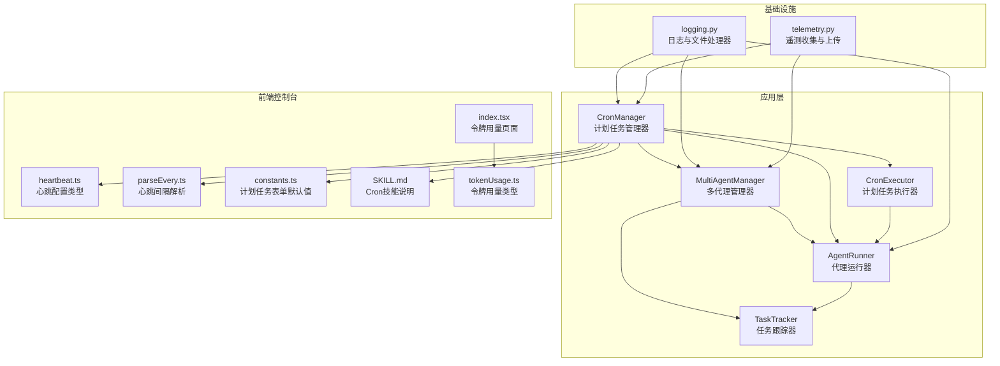
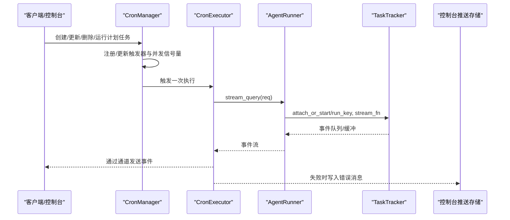
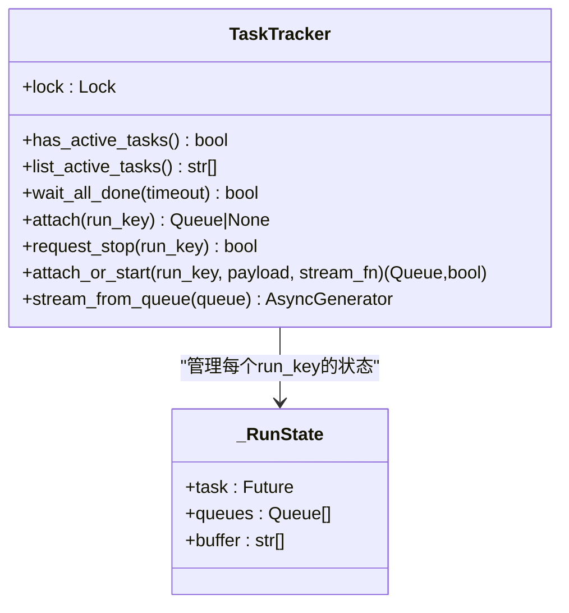
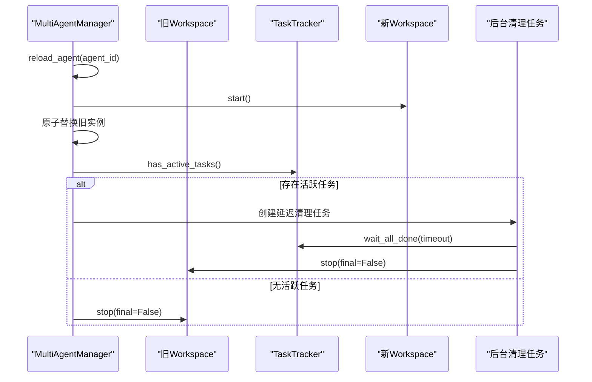
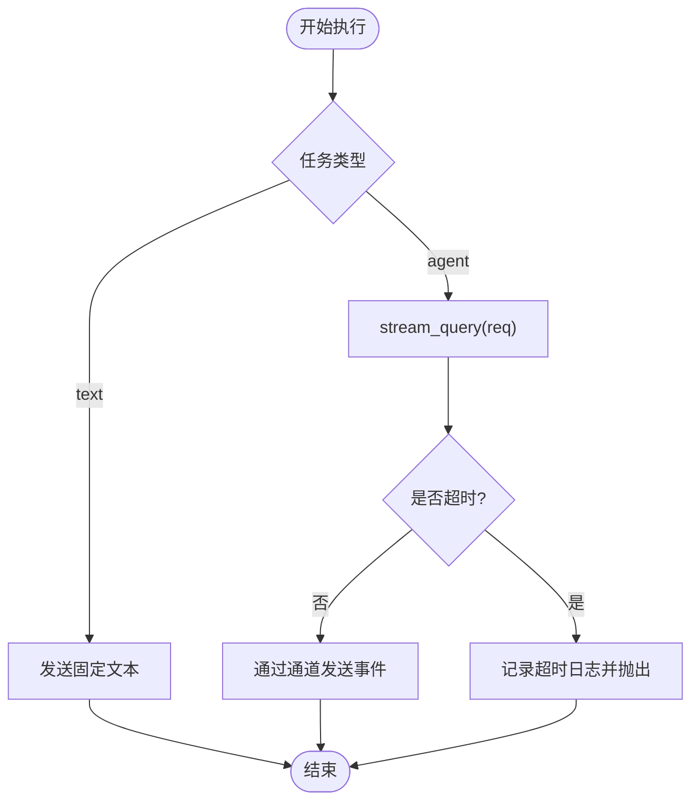
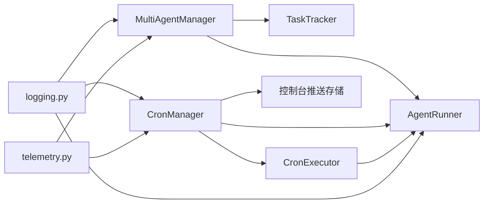

# 代理监控与跟踪

<cite>
**本文引用的文件**
- [task_tracker.py](file://src/copaw/app/runner/task_tracker.py)
- [multi_agent_manager.py](file://src/copaw/app/multi_agent_manager.py)
- [manager.py](file://src/copaw/app/crons/manager.py)
- [executor.py](file://src/copaw/app/crons/executor.py)
- [runner.py](file://src/copaw/app/runner/runner.py)
- [telemetry.py](file://src/copaw/utils/telemetry.py)
- [logging.py](file://src/copaw/utils/logging.py)
- [heartbeat.ts](file://console/src/api/types/heartbeat.ts)
- [parseEvery.ts](file://console/src/pages/Control/Heartbeat/parseEvery.ts)
- [constants.ts](file://console/src/pages/Control/CronJobs/components/constants.ts)
- [SKILL.md](file://src/copaw/agents/skills/cron/SKILL.md)
- [tokenUsage.ts](file://console/src/api/types/tokenUsage.ts)
- [index.tsx](file://console/src/pages/Settings/TokenUsage/index.tsx)
</cite>

## 目录
1. [简介](#简介)
2. [项目结构](#项目结构)
3. [核心组件](#核心组件)
4. [架构总览](#架构总览)
5. [详细组件分析](#详细组件分析)
6. [依赖分析](#依赖分析)
7. [性能考量](#性能考量)
8. [故障排查指南](#故障排查指南)
9. [结论](#结论)
10. [附录](#附录)

## 简介
本文件面向CoPaw的代理监控与跟踪系统，聚焦以下主题：
- 任务跟踪：has_active_tasks、list_active_tasks、wait_all_done等监控能力的实现与使用
- 活动检测：如何识别并统计正在运行的任务
- 清理任务管理：延迟清理任务的创建、调度与回调机制
- 告警与可观测性：错误推送、心跳、日志与遥测
- 使用示例：活动任务监控、清理任务管理、资源使用统计
- 性能分析与运维建议：并发控制、超时与优雅停机策略

## 项目结构
围绕“任务跟踪—工作空间—计划任务—通道分发”的主线，CoPaw在应用层提供了统一的TaskTracker用于后台任务的生命周期管理；在多代理管理器中，利用TaskTracker进行零停机热重载与延迟清理；计划任务模块负责定时触发与并发控制，并在失败时通过控制台推送错误信息；遥测与日志模块提供系统级观测与诊断。

图表来源
- [task_tracker.py:31-222](file://src/copaw/app/runner/task_tracker.py#L31-L222)
- [multi_agent_manager.py:17-451](file://src/copaw/app/multi_agent_manager.py#L17-L451)
- [manager.py:32-359](file://src/copaw/app/crons/manager.py#L32-L359)
- [executor.py:13-90](file://src/copaw/app/crons/executor.py#L13-L90)
- [runner.py:63-515](file://src/copaw/app/runner/runner.py#L63-L515)
- [telemetry.py:1-311](file://src/copaw/utils/telemetry.py#L1-L311)
- [logging.py:104-185](file://src/copaw/utils/logging.py#L104-L185)
- [heartbeat.ts:1-11](file://console/src/api/types/heartbeat.ts#L1-L11)
- [parseEvery.ts:1-43](file://console/src/pages/Control/Heartbeat/parseEvery.ts#L1-L43)
- [constants.ts:1-29](file://console/src/pages/Control/CronJobs/components/constants.ts#L1-L29)
- [SKILL.md:45-99](file://src/copaw/agents/skills/cron/SKILL.md#L45-L99)
- [tokenUsage.ts:1-16](file://console/src/api/types/tokenUsage.ts#L1-L16)
- [index.tsx:1-222](file://console/src/pages/Settings/TokenUsage/index.tsx#L1-L222)

章节来源
- [task_tracker.py:1-222](file://src/copaw/app/runner/task_tracker.py#L1-L222)
- [multi_agent_manager.py:1-451](file://src/copaw/app/multi_agent_manager.py#L1-L451)
- [manager.py:1-359](file://src/copaw/app/crons/manager.py#L1-L359)
- [executor.py:1-90](file://src/copaw/app/crons/executor.py#L1-L90)
- [runner.py:1-515](file://src/copaw/app/runner/runner.py#L1-L515)
- [telemetry.py:1-311](file://src/copaw/utils/telemetry.py#L1-L311)
- [logging.py:1-185](file://src/copaw/utils/logging.py#L1-L185)
- [heartbeat.ts:1-11](file://console/src/api/types/heartbeat.ts#L1-L11)
- [parseEvery.ts:1-43](file://console/src/pages/Control/Heartbeat/parseEvery.ts#L1-L43)
- [constants.ts:1-29](file://console/src/pages/Control/CronJobs/components/constants.ts#L1-L29)
- [SKILL.md:45-99](file://src/copaw/agents/skills/cron/SKILL.md#L45-L99)
- [tokenUsage.ts:1-16](file://console/src/api/types/tokenUsage.ts#L1-L16)
- [index.tsx:1-222](file://console/src/pages/Settings/TokenUsage/index.tsx#L1-L222)

## 核心组件
- 任务跟踪器（TaskTracker）
  - 提供任务状态查询、活跃任务列表、等待全部完成、附加订阅队列、请求取消等功能
  - 支持事件缓冲与多订阅者队列，自动清理死队列
- 多代理管理器（MultiAgentManager）
  - 零停机热重载：在替换旧实例前后，基于TaskTracker判断是否需要延迟清理
  - 统一管理清理任务集合，支持批量取消与等待完成
- 计划任务管理器（CronManager）与执行器（CronExecutor）
  - 基于APScheduler调度，支持并发信号量、超时与误点宽限
  - 失败时通过控制台推送存储记录错误，便于前端展示
- 代理运行器（AgentRunner）
  - 作为计划任务执行器的下游，负责流式生成与会话状态持久化
- 日志与遥测（logging.py、telemetry.py）
  - 统一命名空间日志输出、彩色终端格式、文件轮转
  - 系统信息采集与上传，避免阻塞安装流程

章节来源
- [task_tracker.py:31-222](file://src/copaw/app/runner/task_tracker.py#L31-L222)
- [multi_agent_manager.py:83-336](file://src/copaw/app/multi_agent_manager.py#L83-L336)
- [manager.py:32-359](file://src/copaw/app/crons/manager.py#L32-L359)
- [executor.py:13-90](file://src/copaw/app/crons/executor.py#L13-L90)
- [runner.py:63-515](file://src/copaw/app/runner/runner.py#L63-L515)
- [logging.py:104-185](file://src/copaw/utils/logging.py#L104-L185)
- [telemetry.py:48-311](file://src/copaw/utils/telemetry.py#L48-L311)

## 架构总览
下图展示了“任务跟踪—多代理管理—计划任务—通道分发”的交互路径，以及错误与告警的回传链路。

图表来源
- [manager.py:184-208](file://src/copaw/app/crons/manager.py#L184-L208)
- [executor.py:18-90](file://src/copaw/app/crons/executor.py#L18-L90)
- [runner.py:175-378](file://src/copaw/app/runner/runner.py#L175-L378)
- [task_tracker.py:124-207](file://src/copaw/app/runner/task_tracker.py#L124-L207)

## 详细组件分析

### 任务跟踪器（TaskTracker）
- 关键方法
  - has_active_tasks：遍历运行状态，判断是否存在未完成任务
  - list_active_tasks：返回所有未完成任务的run_key列表
  - wait_all_done：循环等待直至无活跃任务，支持超时
  - attach/attach_or_start：为现有或新建run_key创建事件队列并回放缓冲
  - request_stop：取消指定run_key对应的任务
- 实现要点
  - 使用锁保护内部状态字典_runs
  - 事件缓冲与多队列广播，满队列时自动清理死队列
  - 异常时注入错误事件并关闭队列，最终清理运行项

图表来源
- [task_tracker.py:22-222](file://src/copaw/app/runner/task_tracker.py#L22-L222)

章节来源
- [task_tracker.py:54-123](file://src/copaw/app/runner/task_tracker.py#L54-L123)

### 多代理管理器（MultiAgentManager）
- 零停机热重载流程
  - 在原子交换新旧实例前后，调用旧实例的TaskTracker检查活跃任务
  - 若存在活跃任务，则创建延迟清理任务，在等待完成后停止旧实例
  - 若无活跃任务，则立即停止旧实例
- 延迟清理任务管理
  - 维护_set[asyncio.Task]，跟踪所有挂起的延迟清理任务
  - 提供cancel_all_cleanup_tasks以在关停时取消并等待完成
- 并发与可观测性
  - 使用异步锁保证实例替换过程的线程安全
  - 记录详细的日志，包含活跃任务数量、清理调度与完成情况

图表来源
- [multi_agent_manager.py:83-178](file://src/copaw/app/multi_agent_manager.py#L83-L178)
- [task_tracker.py:79-97](file://src/copaw/app/runner/task_tracker.py#L79-L97)

章节来源
- [multi_agent_manager.py:83-178](file://src/copaw/app/multi_agent_manager.py#L83-L178)
- [multi_agent_manager.py:313-336](file://src/copaw/app/multi_agent_manager.py#L313-L336)

### 计划任务管理器与执行器（CronManager/CronExecutor）
- 调度与并发
  - 基于APScheduler的CronTrigger与IntervalTrigger
  - 每个作业维护独立的并发信号量，受runtime.max_concurrency限制
  - 支持misfire_grace_seconds，避免错过触发时机
- 执行与超时
  - CronExecutor.execute根据task_type选择“发送固定文本”或“代理问答”
  - 对代理问答路径，使用asyncio.wait_for控制整体超时
- 错误处理与告警
  - CronManager._task_done_cb抑制异常传播，记录错误并推送到控制台推送存储
  - 前端可通过会话ID接收错误消息，便于用户感知

图表来源
- [executor.py:18-90](file://src/copaw/app/crons/executor.py#L18-L90)
- [manager.py:211-232](file://src/copaw/app/crons/manager.py#L211-L232)

章节来源
- [manager.py:236-285](file://src/copaw/app/crons/manager.py#L236-L285)
- [executor.py:75-89](file://src/copaw/app/crons/executor.py#L75-L89)

### 代理运行器（AgentRunner）
- 查询处理
  - 解析用户意图、审批状态、命令路径与代理对话
  - 通过stream_printing_messages流式生成消息，支持中断与异常捕获
- 会话与状态
  - 自动注册聊天、加载/保存会话状态，确保上下文一致性
- 与TaskTracker协作
  - 通过attach_or_start将事件流写入队列，供前端/控制台订阅

章节来源
- [runner.py:175-378](file://src/copaw/app/runner/runner.py#L175-L378)
- [task_tracker.py:124-207](file://src/copaw/app/runner/task_tracker.py#L124-L207)

### 心跳与控制台配置
- 心跳配置类型定义了启用开关、周期与活跃时段
- 前端解析“每X小时/分钟”字符串，序列化回后端
- 控制台计划任务表单提供默认值，包括最大并发、超时与误点宽限

章节来源
- [heartbeat.ts:1-11](file://console/src/api/types/heartbeat.ts#L1-L11)
- [parseEvery.ts:16-43](file://console/src/pages/Control/Heartbeat/parseEvery.ts#L16-L43)
- [constants.ts:5-29](file://console/src/pages/Control/CronJobs/components/constants.ts#L5-L29)

### 使用示例与最佳实践

- 活动任务监控
  - 获取活跃任务：调用has_active_tasks与list_active_tasks，结合UI刷新策略
  - 等待全部完成：在关停或热重载前调用wait_all_done(timeout)，避免任务被强制中断
  - 参考路径：[has_active_tasks:54-64](file://src/copaw/app/runner/task_tracker.py#L54-L64)、[list_active_tasks:66-77](file://src/copaw/app/runner/task_tracker.py#L66-L77)、[wait_all_done:79-97](file://src/copaw/app/runner/task_tracker.py#L79-L97)

- 清理任务管理
  - 零停机热重载：reload_agent期间，若旧实例存在活跃任务则创建延迟清理任务
  - 批量取消：stop_all前调用cancel_all_cleanup_tasks，确保关停时无悬挂任务
  - 参考路径：[_graceful_stop_old_instance:83-178](file://src/copaw/app/multi_agent_manager.py#L83-L178)、[cancel_all_cleanup_tasks:313-336](file://src/copaw/app/multi_agent_manager.py#L313-L336)

- 计划任务与告警
  - 创建计划任务：参考Cron技能说明中的示例命令
  - 失败告警：CronManager在后台任务失败时推送错误消息到控制台
  - 参考路径：[SKILL.md:45-99](file://src/copaw/agents/skills/cron/SKILL.md#L45-L99)、[_task_done_cb:211-232](file://src/copaw/app/crons/manager.py#L211-L232)

- 资源使用统计
  - 前端令牌用量页面通过API获取按模型/日期聚合的统计信息
  - 参考路径：[tokenUsage.ts:1-16](file://console/src/api/types/tokenUsage.ts#L1-L16)、[index.tsx:1-222](file://console/src/pages/Settings/TokenUsage/index.tsx#L1-L222)

## 依赖分析
- 组件耦合
  - MultiAgentManager依赖TaskTracker进行活跃任务检测与延迟清理
  - CronManager依赖CronExecutor与AgentRunner，后者再依赖TaskTracker进行事件广播
  - CronManager通过控制台推送存储回传错误信息
- 外部依赖
  - APscheduler用于调度
  - asyncio用于并发与任务管理
  - httpx用于遥测上传

图表来源
- [multi_agent_manager.py:83-178](file://src/copaw/app/multi_agent_manager.py#L83-L178)
- [manager.py:32-359](file://src/copaw/app/crons/manager.py#L32-L359)
- [executor.py:13-90](file://src/copaw/app/crons/executor.py#L13-L90)
- [runner.py:63-515](file://src/copaw/app/runner/runner.py#L63-L515)
- [logging.py:104-185](file://src/copaw/utils/logging.py#L104-L185)
- [telemetry.py:163-311](file://src/copaw/utils/telemetry.py#L163-L311)

章节来源
- [multi_agent_manager.py:1-451](file://src/copaw/app/multi_agent_manager.py#L1-L451)
- [manager.py:1-359](file://src/copaw/app/crons/manager.py#L1-L359)

## 性能考量
- 并发控制
  - 计划任务使用信号量限制最大并发，避免资源争用
  - TaskTracker的事件队列设置上限，防止内存膨胀
- 超时与优雅停机
  - 计划任务与等待全部完成均支持超时，避免长时间阻塞
  - 热重载采用延迟清理，确保正在进行的流式任务完整完成
- 日志与遥测
  - 彩色终端日志与文件轮转，便于快速定位问题
  - 遥测上传失败静默处理，不影响主流程

## 故障排查指南
- 计划任务失败
  - 检查CronManager的日志与控制台推送存储中的错误消息
  - 核对cron表达式、并发与超时配置
  - 参考路径：[_task_done_cb:211-232](file://src/copaw/app/crons/manager.py#L211-L232)
- 任务无法停止或清理
  - 使用TaskTracker的request_stop与wait_all_done进行手动干预
  - 在关停时调用cancel_all_cleanup_tasks确保无悬挂任务
  - 参考路径：[request_stop:115-122](file://src/copaw/app/runner/task_tracker.py#L115-L122)、[wait_all_done:79-97](file://src/copaw/app/runner/task_tracker.py#L79-L97)、[cancel_all_cleanup_tasks:313-336](file://src/copaw/app/multi_agent_manager.py#L313-L336)
- 日志与遥测
  - 使用setup_logger与add_copaw_file_handler配置输出级别与文件处理器
  - 遥测上传失败不会影响安装，可在下次版本升级时重新触发
  - 参考路径：[logging.py:104-185](file://src/copaw/utils/logging.py#L104-L185)、[telemetry.py:292-311](file://src/copaw/utils/telemetry.py#L292-L311)

章节来源
- [manager.py:211-232](file://src/copaw/app/crons/manager.py#L211-L232)
- [task_tracker.py:79-122](file://src/copaw/app/runner/task_tracker.py#L79-L122)
- [multi_agent_manager.py:313-336](file://src/copaw/app/multi_agent_manager.py#L313-L336)
- [logging.py:104-185](file://src/copaw/utils/logging.py#L104-L185)
- [telemetry.py:292-311](file://src/copaw/utils/telemetry.py#L292-L311)

## 结论
CoPaw的代理监控与跟踪体系以TaskTracker为核心，贯穿多代理管理、计划任务与通道分发，形成“可观测—可控—可恢复”的闭环。通过has_active_tasks、list_active_tasks、wait_all_done等能力，系统实现了对后台任务的精细化治理；通过延迟清理与并发控制，确保零停机与资源安全；通过日志、遥测与控制台推送，构建了完善的告警与诊断链路。运维人员可据此建立自动化巡检与应急处置流程，提升系统的稳定性与可维护性。

## 附录
- 快速参考
  - 活动任务监控：[has_active_tasks:54-64](file://src/copaw/app/runner/task_tracker.py#L54-L64)、[list_active_tasks:66-77](file://src/copaw/app/runner/task_tracker.py#L66-L77)、[wait_all_done:79-97](file://src/copaw/app/runner/task_tracker.py#L79-L97)
  - 清理任务管理：[_graceful_stop_old_instance:83-178](file://src/copaw/app/multi_agent_manager.py#L83-L178)、[cancel_all_cleanup_tasks:313-336](file://src/copaw/app/multi_agent_manager.py#L313-L336)
  - 计划任务与告警：[CronManager:211-232](file://src/copaw/app/crons/manager.py#L211-L232)、[CronExecutor:75-89](file://src/copaw/app/crons/executor.py#L75-L89)
  - 资源使用统计：[tokenUsage.ts:1-16](file://console/src/api/types/tokenUsage.ts#L1-L16)、[index.tsx:1-222](file://console/src/pages/Settings/TokenUsage/index.tsx#L1-L222)