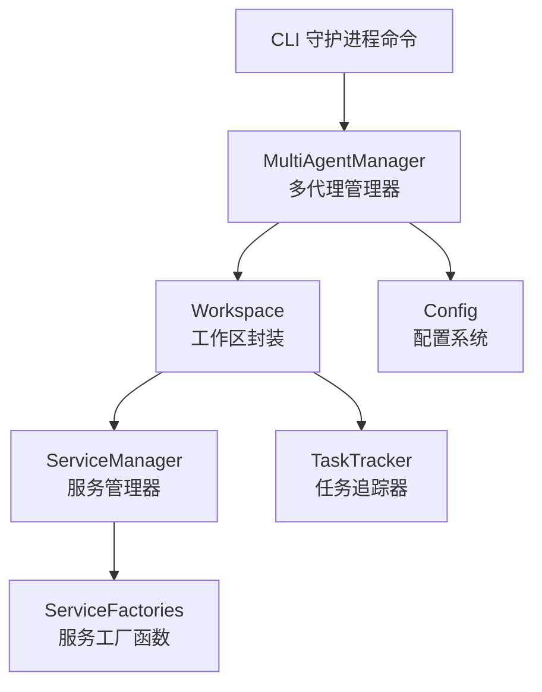
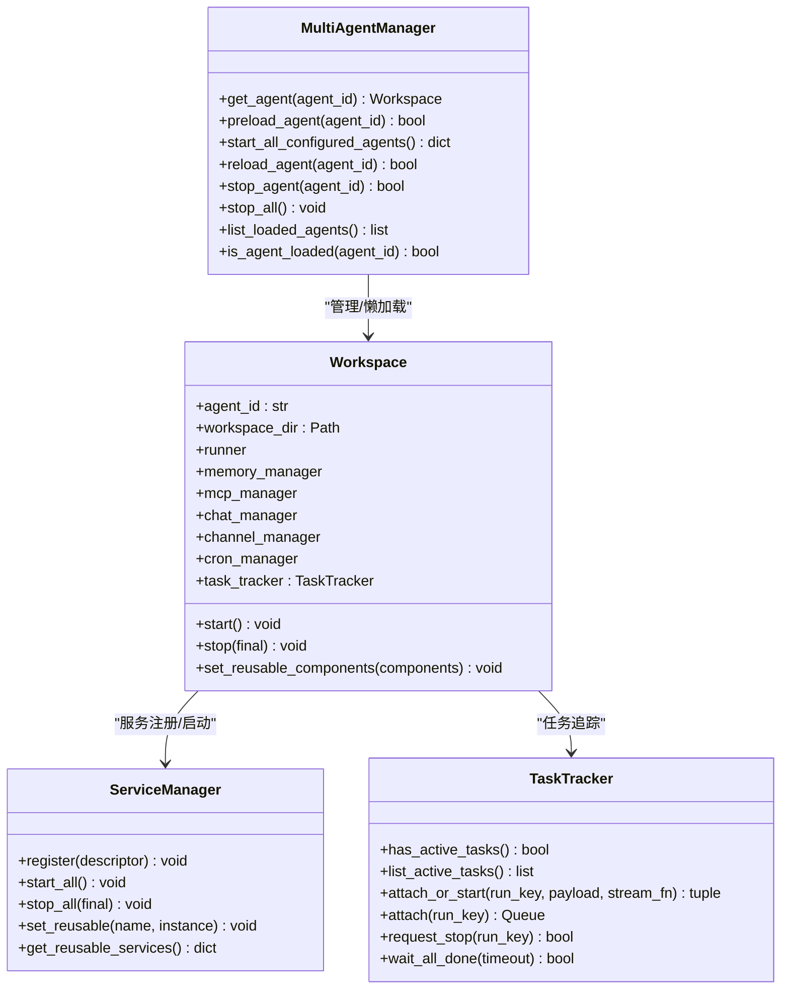
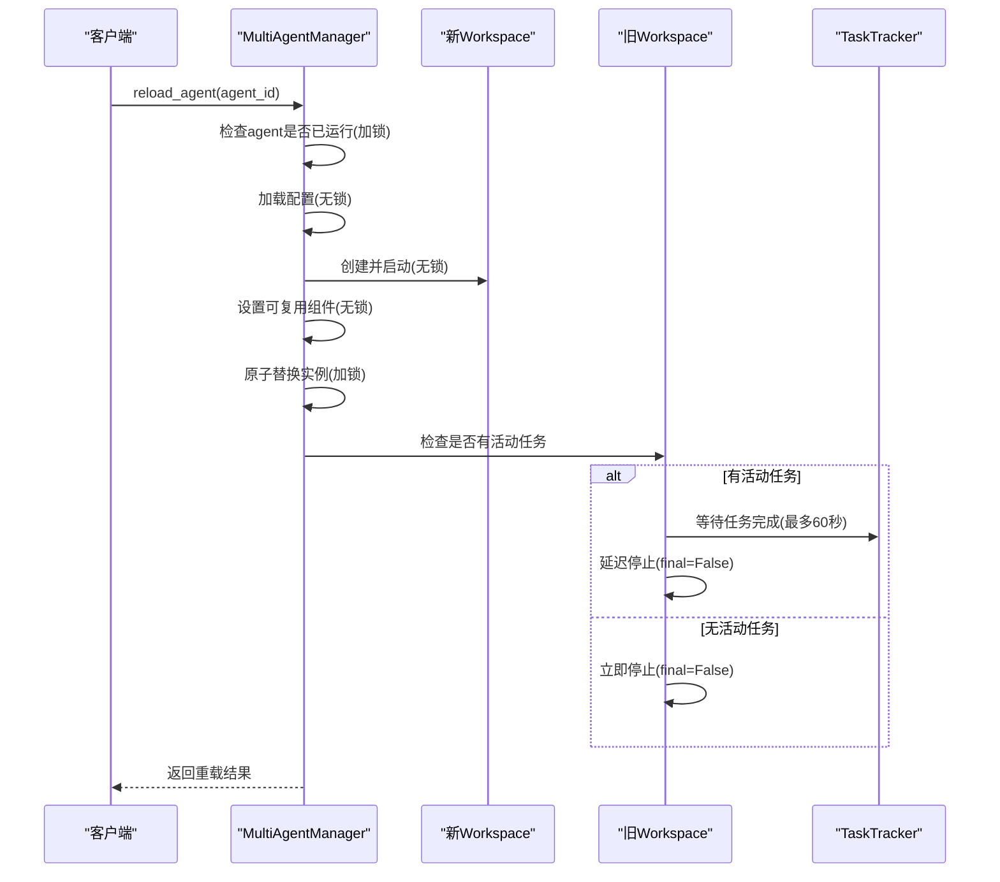
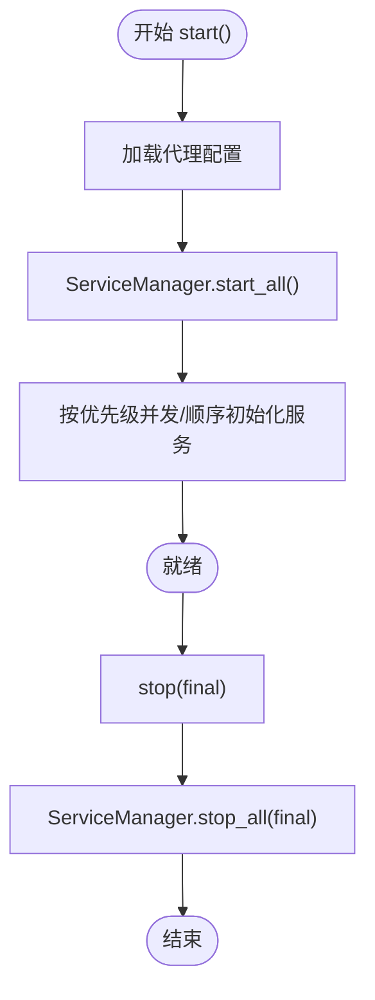
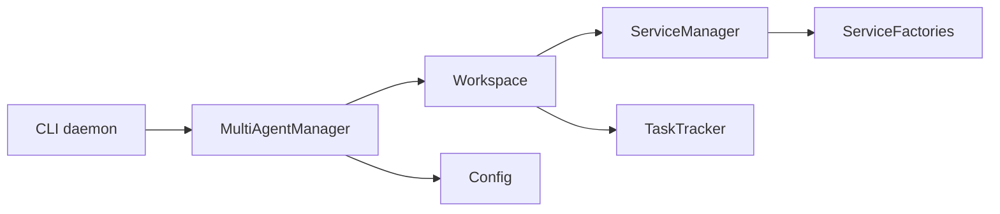

# 多代理管理系统

<cite>
**本文引用的文件**
- [multi_agent_manager.py](file://src/copaw/app/multi_agent_manager.py)
- [workspace.py](file://src/copaw/app/workspace/workspace.py)
- [service_manager.py](file://src/copaw/app/workspace/service_manager.py)
- [service_factories.py](file://src/copaw/app/workspace/service_factories.py)
- [task_tracker.py](file://src/copaw/app/runner/task_tracker.py)
- [config.py](file://src/copaw/config/config.py)
- [daemon_cmd.py](file://src/copaw/cli/daemon_cmd.py)
- [multi-agent.zh.md](file://website/public/docs/multi-agent.zh.md)
</cite>

## 目录
1. [简介](#简介)
2. [项目结构](#项目结构)
3. [核心组件](#核心组件)
4. [架构总览](#架构总览)
5. [详细组件分析](#详细组件分析)
6. [依赖关系分析](#依赖关系分析)
7. [性能考量](#性能考量)
8. [故障排查指南](#故障排查指南)
9. [结论](#结论)
10. [附录](#附录)

## 简介
本文件面向CoPaw的多代理管理系统，围绕MultiAgentManager的设计理念与实现原理展开，重点覆盖：
- 懒加载机制：仅在首次请求时创建并启动代理工作区
- 零停机重载：通过“先创建新实例、再原子替换、最后优雅停止旧实例”的流程，保证服务连续性
- 生命周期管理：统一的启动、停止、预加载、批量启动能力
- 工作区隔离与资源共享：基于Workspace的独立运行时与ServiceManager的可复用组件策略
- 并发代理管理、资源优化与故障恢复：结合TaskTracker与后台清理任务保障长连接与流式任务的稳定性
- 配置选项、性能考虑与最佳实践：帮助初学者快速上手，同时为高级用户提供深入的技术细节与扩展指导

## 项目结构
多代理管理相关的关键模块位于src/copaw/app/下，核心文件如下：
- 多代理管理器：src/copaw/app/multi_agent_manager.py
- 工作区封装：src/copaw/app/workspace/workspace.py
- 服务管理器：src/copaw/app/workspace/service_manager.py
- 服务工厂：src/copaw/app/workspace/service_factories.py
- 任务追踪器：src/copaw/app/runner/task_tracker.py
- 配置系统：src/copaw/config/config.py
- CLI守护进程命令：src/copaw/cli/daemon_cmd.py
- 文档：website/public/docs/multi-agent.zh.md

图表来源
- [multi_agent_manager.py:17-451](file://src/copaw/app/multi_agent_manager.py#L17-L451)
- [workspace.py:39-367](file://src/copaw/app/workspace/workspace.py#L39-L367)
- [service_manager.py:74-415](file://src/copaw/app/workspace/service_manager.py#L74-L415)
- [service_factories.py:18-164](file://src/copaw/app/workspace/service_factories.py#L18-L164)
- [task_tracker.py:31-222](file://src/copaw/app/runner/task_tracker.py#L31-L222)
- [config.py:455-525](file://src/copaw/config/config.py#L455-L525)
- [daemon_cmd.py:48-124](file://src/copaw/cli/daemon_cmd.py#L48-L124)

章节来源
- [multi_agent_manager.py:17-451](file://src/copaw/app/multi_agent_manager.py#L17-L451)
- [workspace.py:39-367](file://src/copaw/app/workspace/workspace.py#L39-L367)
- [service_manager.py:74-415](file://src/copaw/app/workspace/service_manager.py#L74-L415)
- [service_factories.py:18-164](file://src/copaw/app/workspace/service_factories.py#L18-L164)
- [task_tracker.py:31-222](file://src/copaw/app/runner/task_tracker.py#L31-L222)
- [config.py:455-525](file://src/copaw/config/config.py#L455-L525)
- [daemon_cmd.py:48-124](file://src/copaw/cli/daemon_cmd.py#L48-L124)

## 核心组件
- MultiAgentManager：集中管理多个Workspace实例，提供懒加载、零停机重载、生命周期管理、并发启动等能力
- Workspace：单个代理的完整运行时封装，包含Runner、ChannelManager、MemoryManager、MCPClientManager、CronManager等组件
- ServiceManager：统一注册、生命周期管理与依赖解析的服务容器，支持可复用组件与热重载
- ServiceFactories：将具体服务初始化逻辑抽取为工厂函数，便于测试与组织
- TaskTracker：跟踪运行中的任务，支持事件缓冲、队列广播、主动取消与等待全部完成
- Config：根配置与代理配置的结构化定义，支撑多代理的独立工作区与共享资源

章节来源
- [multi_agent_manager.py:17-451](file://src/copaw/app/multi_agent_manager.py#L17-L451)
- [workspace.py:39-367](file://src/copaw/app/workspace/workspace.py#L39-L367)
- [service_manager.py:74-415](file://src/copaw/app/workspace/service_manager.py#L74-L415)
- [service_factories.py:18-164](file://src/copaw/app/workspace/service_factories.py#L18-L164)
- [task_tracker.py:31-222](file://src/copaw/app/runner/task_tracker.py#L31-L222)
- [config.py:455-525](file://src/copaw/config/config.py#L455-L525)

## 架构总览
多代理管理采用“管理器-工作区-服务层-任务追踪”的分层架构：
- MultiAgentManager作为顶层协调者，负责实例缓存、懒加载、零停机重载与批量启动
- Workspace封装单个代理的完整运行时，内部通过ServiceManager统一管理服务组件
- ServiceManager以声明式ServiceDescriptor注册服务，支持优先级、并发初始化、依赖关系与可复用组件
- TaskTracker为长连接与流式任务提供运行时状态与事件缓冲，保障零停机重载期间的连续性

图表来源
- [multi_agent_manager.py:17-451](file://src/copaw/app/multi_agent_manager.py#L17-L451)
- [workspace.py:39-367](file://src/copaw/app/workspace/workspace.py#L39-L367)
- [service_manager.py:74-415](file://src/copaw/app/workspace/service_manager.py#L74-L415)
- [task_tracker.py:31-222](file://src/copaw/app/runner/task_tracker.py#L31-L222)

## 详细组件分析

### MultiAgentManager 设计与实现
- 懒加载：首次请求时读取配置、创建Workspace并启动，随后缓存于内存字典中
- 零停机重载：先在无锁环境下创建并启动新实例，再在极短临界区内进行原子替换，最后根据是否存在活动任务决定立即停止或延时清理
- 生命周期管理：支持单实例停止、批量启动、预加载、查询状态等
- 线程安全：使用异步锁保护共享状态，避免竞态条件
- 资源复用：在重载前从旧实例提取可复用服务，减少重启成本

图表来源
- [multi_agent_manager.py:200-311](file://src/copaw/app/multi_agent_manager.py#L200-L311)
- [task_tracker.py:79-97](file://src/copaw/app/runner/task_tracker.py#L79-L97)

章节来源
- [multi_agent_manager.py:17-451](file://src/copaw/app/multi_agent_manager.py#L17-L451)

### Workspace 工作区封装
- 独立运行时：每个Workspace代表一个独立代理实例，拥有自己的Runner、ChannelManager、MemoryManager、MCPClientManager、CronManager
- 服务注册：通过ServiceDescriptor声明式注册，支持post_init钩子、start_method/stop_method、优先级与并发初始化
- 可复用组件：在set_reusable_components阶段注入可复用服务，避免重复创建
- 启停流程：start()加载配置并通过ServiceManager启动所有服务；stop(final)支持跳过可复用组件以配合零停机重载

图表来源
- [workspace.py:311-357](file://src/copaw/app/workspace/workspace.py#L311-L357)
- [service_manager.py:171-323](file://src/copaw/app/workspace/service_manager.py#L171-L323)

章节来源
- [workspace.py:39-367](file://src/copaw/app/workspace/workspace.py#L39-L367)
- [service_manager.py:74-415](file://src/copaw/app/workspace/service_manager.py#L74-L415)

### ServiceManager 服务管理
- 描述符驱动：ServiceDescriptor定义服务名称、类、初始化参数、后置初始化、启动/停止方法、可复用标记、依赖与优先级
- 启动策略：按优先级分组，同优先级内可并发启动；支持sequential与concurrent两种模式
- 停止策略：反向优先级停止，final=True时停止所有服务，否则跳过可复用组件
- 可复用组件：set_reusable与get_reusable_services配合Workspace实现热重载

章节来源
- [service_manager.py:30-156](file://src/copaw/app/workspace/service_manager.py#L30-L156)
- [service_manager.py:171-415](file://src/copaw/app/workspace/service_manager.py#L171-L415)

### ServiceFactories 服务工厂
- 将具体服务初始化逻辑抽取为工厂函数，便于测试与解耦
- 支持MCP、聊天管理、通道管理、配置监听器等服务的创建与绑定

章节来源
- [service_factories.py:18-164](file://src/copaw/app/workspace/service_factories.py#L18-L164)

### TaskTracker 任务追踪
- 事件缓冲：为每个run_key维护队列与事件缓冲，支持断线重连时的缓冲回放
- 并发广播：同一run_key的多个订阅者共享缓冲，自动丢弃阻塞队列
- 主动控制：支持attach_or_start、attach、request_stop、wait_all_done等操作
- 长连接保障：在零停机重载中，旧实例的任务在超时后仍可继续运行，新实例接管请求

章节来源
- [task_tracker.py:31-222](file://src/copaw/app/runner/task_tracker.py#L31-L222)

### 配置系统与工作区隔离
- 根配置：AgentsConfig包含active_agent与profiles映射，每个代理仅记录ID与工作区路径
- 代理配置：AgentProfileConfig存储在workspace/agent.json，包含频道、MCP、心跳、运行参数、语言、工具、安全等
- 工作区隔离：每个代理拥有独立工作区目录，配置与数据相互隔离
- 共享资源：模型提供商、环境变量等全局资源可在多代理间共享

章节来源
- [config.py:455-525](file://src/copaw/config/config.py#L455-L525)
- [config.py:394-453](file://src/copaw/config/config.py#L394-L453)

### CLI 守护进程命令
- 提供status、restart、reload-config、version、logs等命令，支持通过--agent-id指定目标代理
- CLI上下文通过load_config解析代理工作区路径，但不持有MultiAgentManager引用

章节来源
- [daemon_cmd.py:48-124](file://src/copaw/cli/daemon_cmd.py#L48-L124)

## 依赖关系分析
- MultiAgentManager依赖Workspace与配置系统，通过异步锁协调并发访问
- Workspace依赖ServiceManager与TaskTracker，内部通过ServiceFactories创建服务
- ServiceManager依赖ServiceDescriptor与优先级调度，支持可复用组件
- TaskTracker被Workspace与Runner使用，保障长连接与流式任务的稳定性
- CLI通过daemon_cmd调用守护进程命令，间接影响多代理管理

图表来源
- [multi_agent_manager.py:17-451](file://src/copaw/app/multi_agent_manager.py#L17-L451)
- [workspace.py:39-367](file://src/copaw/app/workspace/workspace.py#L39-L367)
- [service_manager.py:74-415](file://src/copaw/app/workspace/service_manager.py#L74-L415)
- [service_factories.py:18-164](file://src/copaw/app/workspace/service_factories.py#L18-L164)
- [task_tracker.py:31-222](file://src/copaw/app/runner/task_tracker.py#L31-L222)
- [daemon_cmd.py:48-124](file://src/copaw/cli/daemon_cmd.py#L48-L124)

章节来源
- [multi_agent_manager.py:17-451](file://src/copaw/app/multi_agent_manager.py#L17-L451)
- [workspace.py:39-367](file://src/copaw/app/workspace/workspace.py#L39-L367)
- [service_manager.py:74-415](file://src/copaw/app/workspace/service_manager.py#L74-L415)
- [service_factories.py:18-164](file://src/copaw/app/workspace/service_factories.py#L18-L164)
- [task_tracker.py:31-222](file://src/copaw/app/runner/task_tracker.py#L31-L222)
- [daemon_cmd.py:48-124](file://src/copaw/cli/daemon_cmd.py#L48-L124)

## 性能考量
- 懒加载与并发启动：get_agent与start_all_configured_agents充分利用异步与并发，降低冷启动延迟
- 零停机重载：最小化临界区加锁时间，避免阻塞其他代理的请求
- 可复用组件：通过ServiceManager的reusable机制减少重复初始化成本
- 任务追踪优化：TaskTracker使用队列缓冲与背压策略，避免内存膨胀
- 配置与IO：配置读取与工作区文件访问尽量在无锁阶段完成，减少锁竞争

## 故障排查指南
- 重载失败：检查新实例启动日志，确认异常后会尝试清理新实例并保持旧实例运行
- 停止异常：stop_all会先取消所有后台清理任务，再逐个停止实例，避免孤儿实例
- 长连接中断：TaskTracker会在attach时回放缓冲事件，确保断线重连后的连续性
- 配置变更：通过CLI的reload-config命令重新读取配置，或在Web控制台中更新代理配置

章节来源
- [multi_agent_manager.py:313-361](file://src/copaw/app/multi_agent_manager.py#L313-L361)
- [task_tracker.py:99-207](file://src/copaw/app/runner/task_tracker.py#L99-L207)
- [daemon_cmd.py:79-89](file://src/copaw/cli/daemon_cmd.py#L79-L89)

## 结论
MultiAgentManager通过懒加载、零停机重载与可复用组件策略，实现了高可用、低延迟的多代理运行时。结合Workspace的独立工作区与ServiceManager的声明式服务管理，系统在保证隔离的同时最大化资源利用率。TaskTracker进一步增强了长连接与流式任务的稳定性。对于初学者，可通过Web控制台与CLI快速上手；对于高级用户，可利用可复用组件与并发启动策略进行性能优化与扩展。

## 附录

### 使用示例与最佳实践
- 并发代理管理：使用start_all_configured_agents一次性启动所有代理，提升冷启动效率
- 资源优化：合理设置可复用组件，减少重复初始化；根据业务场景调整TaskTracker队列大小
- 故障恢复：在重载失败时，旧实例将继续提供服务；必要时通过stop_agent或stop_all进行清理
- 配置管理：通过CLI或Web控制台更新代理配置，必要时使用reload-config使变更生效

章节来源
- [multi_agent_manager.py:399-445](file://src/copaw/app/multi_agent_manager.py#L399-L445)
- [multi-agent.zh.md:355-397](file://website/public/docs/multi-agent.zh.md#L355-L397)