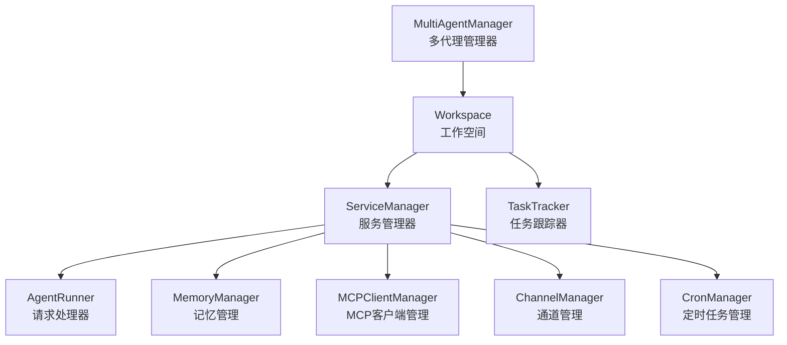
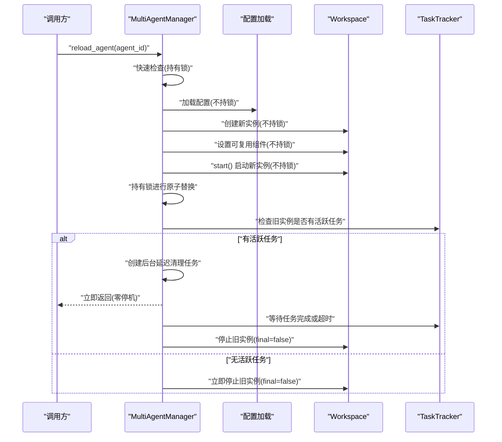
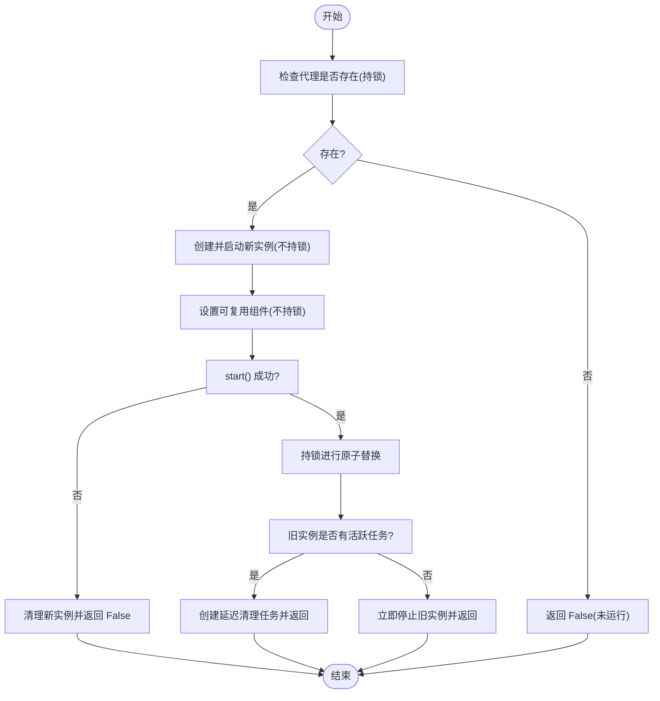
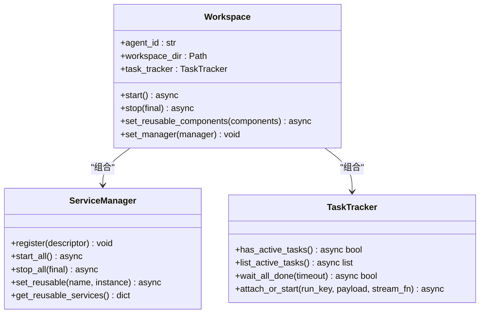
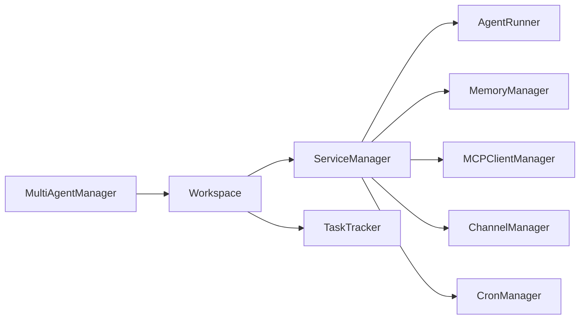

# 并发代理生命周期管理

<cite>
**本文引用的文件**
- [multi_agent_manager.py](file://src/copaw/app/multi_agent_manager.py)
- [workspace.py](file://src/copaw/app/workspace/workspace.py)
- [service_manager.py](file://src/copaw/app/workspace/service_manager.py)
- [task_tracker.py](file://src/copaw/app/runner/task_tracker.py)
- [_app.py](file://src/copaw/app/_app.py)
- [cli_main.py](file://src/copaw/cli/main.py)
</cite>

## 目录
1. [简介](#简介)
2. [项目结构](#项目结构)
3. [核心组件](#核心组件)
4. [架构总览](#架构总览)
5. [详细组件分析](#详细组件分析)
6. [依赖分析](#依赖分析)
7. [性能考虑](#性能考虑)
8. [故障排查指南](#故障排查指南)
9. [结论](#结论)
10. [附录](#附录)

## 简介
本文件围绕 CoPaw 的并发代理生命周期管理进行系统化技术文档编写，重点解析 MultiAgentManager 中的并发控制设计理念与实现原理，覆盖 async 锁机制、任务跟踪与资源协调、stop_agent、stop_all、start_all_configured_agents 等关键方法的实现逻辑，以及并发访问控制、异常处理与资源清理策略。文档同时提供批量启动、优雅关闭与资源回收的使用示例，涵盖性能优化、错误恢复与监控指标建议，兼顾初学者与高级用户的理解需求。

## 项目结构
CoPaw 的多代理生命周期管理由以下模块协同完成：
- MultiAgentManager：集中式多代理工作空间管理器，负责懒加载、生命周期管理与热重载。
- Workspace：单个代理的工作空间封装，包含 Runner、ChannelManager、MemoryManager、MCPClientManager、CronManager 等组件。
- ServiceManager：统一的服务注册与生命周期管理，支持依赖排序、并发初始化与组件复用。
- TaskTracker：后台任务跟踪器，用于流式/重连场景的任务状态管理与优雅停止。
- 应用入口与 CLI：提供应用启动、关闭流程与命令行交互。

图表来源
- [multi_agent_manager.py:17-451](file://src/copaw/app/multi_agent_manager.py#L17-L451)
- [workspace.py:39-367](file://src/copaw/app/workspace/workspace.py#L39-L367)
- [service_manager.py:74-415](file://src/copaw/app/workspace/service_manager.py#L74-L415)
- [task_tracker.py:31-222](file://src/copaw/app/runner/task_tracker.py#L31-L222)

章节来源
- [multi_agent_manager.py:17-451](file://src/copaw/app/multi_agent_manager.py#L17-L451)
- [workspace.py:39-367](file://src/copaw/app/workspace/workspace.py#L39-L367)
- [service_manager.py:74-415](file://src/copaw/app/workspace/service_manager.py#L74-L415)
- [task_tracker.py:31-222](file://src/copaw/app/runner/task_tracker.py#L31-L222)

## 核心组件
- MultiAgentManager：提供懒加载、并发安全的 get_agent、零停机 reload_agent、批量启动 start_all_configured_agents、优雅关闭 stop_all 与延迟清理 cancel_all_cleanup_tasks 等能力。
- Workspace：封装单个代理的完整运行时环境，通过 ServiceManager 注册并管理各子系统；提供 set_reusable_components 支持热重载复用。
- ServiceManager：声明式服务描述与生命周期编排，支持优先级分组、并发/串行初始化、依赖关系与组件复用。
- TaskTracker：按 run_key 跟踪后台任务，支持活跃任务检查、等待全部完成、附加队列与优雅取消。

章节来源
- [multi_agent_manager.py:17-451](file://src/copaw/app/multi_agent_manager.py#L17-L451)
- [workspace.py:39-367](file://src/copaw/app/workspace/workspace.py#L39-L367)
- [service_manager.py:74-415](file://src/copaw/app/workspace/service_manager.py#L74-L415)
- [task_tracker.py:31-222](file://src/copaw/app/runner/task_tracker.py#L31-L222)

## 架构总览
MultiAgentManager 作为上层控制器，协调 Workspace 的启动/停止与热重载；Workspace 内部通过 ServiceManager 组织服务，TaskTracker 提供后台任务的并发与资源控制能力。reload_agent 实现零停机切换，通过“先创建新实例、再原子替换、最后延迟清理旧实例”的策略，最大化可用性与一致性。

图表来源
- [multi_agent_manager.py:200-311](file://src/copaw/app/multi_agent_manager.py#L200-L311)
- [workspace.py:311-357](file://src/copaw/app/workspace/workspace.py#L311-L357)
- [task_tracker.py:54-98](file://src/copaw/app/runner/task_tracker.py#L54-L98)

## 详细组件分析

### MultiAgentManager 设计与并发控制
- 并发控制核心
  - 使用 asyncio.Lock() 保护共享状态（agents 字典、清理任务集合），最小化持锁时间，仅在必要时获取锁。
  - 将耗时操作（如 Workspace.start()、配置加载）放在持锁之外，以降低阻塞其他代理操作的概率。
- 关键方法
  - get_agent：懒加载，不存在则从配置加载代理引用并创建 Workspace，随后启动并缓存。
  - reload_agent：零停机热重载，先创建并启动新实例，再原子替换旧实例，最后根据活跃任务情况决定立即或延迟停止旧实例。
  - stop_agent：移除并停止指定代理实例。
  - stop_all：优雅关闭所有代理，先取消所有延迟清理任务，再逐一停止并清空缓存。
  - start_all_configured_agents：并发启动配置中定义的所有代理，聚合结果并统计成功率。
  - cancel_all_cleanup_tasks：取消并等待所有延迟清理任务完成，避免资源泄露。
- 异常处理与资源清理
  - 新实例启动失败时尽力清理新实例，保留旧实例继续服务。
  - 延迟清理任务通过 asyncio.create_task 创建并跟踪，完成后回调移除任务，异常日志记录但不影响主流程。
  - stop_all 中对每个代理停止异常进行捕获并记录，保证整体关闭流程继续执行。

图表来源
- [multi_agent_manager.py:200-311](file://src/copaw/app/multi_agent_manager.py#L200-L311)

章节来源
- [multi_agent_manager.py:34-82](file://src/copaw/app/multi_agent_manager.py#L34-L82)
- [multi_agent_manager.py:180-199](file://src/copaw/app/multi_agent_manager.py#L180-L199)
- [multi_agent_manager.py:200-311](file://src/copaw/app/multi_agent_manager.py#L200-L311)
- [multi_agent_manager.py:313-336](file://src/copaw/app/multi_agent_manager.py#L313-L336)
- [multi_agent_manager.py:338-361](file://src/copaw/app/multi_agent_manager.py#L338-L361)
- [multi_agent_manager.py:399-445](file://src/copaw/app/multi_agent_manager.py#L399-L445)

### Workspace 生命周期与服务编排
- 初始化与服务注册
  - Workspace 在构造时创建 ServiceManager 并注册各类服务（Runner、MemoryManager、MCPClientManager、ChannelManager、CronManager 等），通过 ServiceDescriptor 指定优先级、并发初始化与依赖关系。
- 可复用组件
  - set_reusable_components 允许在 start() 前将旧实例的可复用组件注入新实例，减少重启成本。
- 启动与停止
  - start() 通过 ServiceManager 按优先级并发/串行启动服务；stop(final) 支持跳过可复用组件（热重载场景）或彻底停止（最终关闭）。
- 任务跟踪
  - 通过 task_tracker 属性暴露 TaskTracker，供 reload 逻辑判断是否需要延迟清理。

图表来源
- [workspace.py:39-133](file://src/copaw/app/workspace/workspace.py#L39-L133)
- [workspace.py:279-357](file://src/copaw/app/workspace/workspace.py#L279-L357)
- [service_manager.py:74-415](file://src/copaw/app/workspace/service_manager.py#L74-L415)
- [task_tracker.py:31-222](file://src/copaw/app/runner/task_tracker.py#L31-L222)

章节来源
- [workspace.py:52-133](file://src/copaw/app/workspace/workspace.py#L52-L133)
- [workspace.py:134-278](file://src/copaw/app/workspace/workspace.py#L134-L278)
- [workspace.py:279-357](file://src/copaw/app/workspace/workspace.py#L279-L357)
- [service_manager.py:106-156](file://src/copaw/app/workspace/service_manager.py#L106-L156)
- [service_manager.py:171-229](file://src/copaw/app/workspace/service_manager.py#L171-L229)
- [service_manager.py:324-415](file://src/copaw/app/workspace/service_manager.py#L324-L415)

### ServiceManager：声明式服务编排
- 特性
  - 通过 ServiceDescriptor 描述服务名称、类、初始化参数、post_init、start/stop 方法、可复用性、依赖与优先级。
  - 按优先级分组，同优先级内支持并发初始化；串行初始化用于强依赖场景。
  - 支持组件复用：start_all 时跳过 reused 服务；stop_all 可选择是否停止可复用服务。
- 并发与错误处理
  - 并发启动使用 asyncio.gather；异常被捕获并抛出，保证启动失败时能回滚。
  - 停止阶段使用 asyncio.gather(return_exceptions=True)，记录异常但不中断整体流程。

章节来源
- [service_manager.py:30-72](file://src/copaw/app/workspace/service_manager.py#L30-L72)
- [service_manager.py:158-229](file://src/copaw/app/workspace/service_manager.py#L158-L229)
- [service_manager.py:324-415](file://src/copaw/app/workspace/service_manager.py#L324-L415)

### TaskTracker：后台任务跟踪与优雅停止
- 功能
  - 以 run_key 为维度跟踪任务状态（task、队列列表、事件缓冲区），支持活跃任务检查、列出活跃任务、等待全部完成、附加队列与优雅取消。
  - attach_or_start 支持附加到现有运行或启动新运行，内部通过弱引用避免循环引用。
- 并发与资源回收
  - 生产者在锁保护下广播事件，自动修剪满队列（丢弃订阅者）。
  - 任务完成后清理 run 记录，释放内存。

章节来源
- [task_tracker.py:31-98](file://src/copaw/app/runner/task_tracker.py#L31-L98)
- [task_tracker.py:99-208](file://src/copaw/app/runner/task_tracker.py#L99-L208)
- [task_tracker.py:209-222](file://src/copaw/app/runner/task_tracker.py#L209-L222)

## 依赖分析
- 多代理管理器依赖 Workspace 与配置加载工具；Workspace 依赖 ServiceManager 与 TaskTracker；ServiceManager 再依赖具体服务类（Runner、MemoryManager、MCPClientManager、ChannelManager、CronManager）。
- 并发与锁策略贯穿于 MultiAgentManager 的关键路径，确保线程安全与高吞吐。

图表来源
- [multi_agent_manager.py:11-12](file://src/copaw/app/multi_agent_manager.py#L11-L12)
- [workspace.py:18-31](file://src/copaw/app/workspace/workspace.py#L18-L31)
- [service_manager.py:74-91](file://src/copaw/app/workspace/service_manager.py#L74-L91)

章节来源
- [multi_agent_manager.py:11-12](file://src/copaw/app/multi_agent_manager.py#L11-L12)
- [workspace.py:18-31](file://src/copaw/app/workspace/workspace.py#L18-L31)
- [service_manager.py:74-91](file://src/copaw/app/workspace/service_manager.py#L74-L91)

## 性能考虑
- 并发启动：start_all_configured_agents 使用 asyncio.gather 并发启动所有代理，显著缩短启动时间。
- 最小持锁：get_agent、reload_agent、stop_agent 等关键路径尽量在持锁外完成耗时操作，仅在原子替换与状态更新时持锁，降低阻塞。
- 零停机热重载：通过“先创建新实例、再原子替换、最后延迟清理”的策略，最大化服务可用性。
- 可复用组件：set_reusable_components 减少重复初始化成本，提升 reload 性能。
- 资源回收：cancel_all_cleanup_tasks 在关闭前清理延迟任务，避免悬挂任务占用资源。

章节来源
- [multi_agent_manager.py:399-445](file://src/copaw/app/multi_agent_manager.py#L399-L445)
- [multi_agent_manager.py:200-311](file://src/copaw/app/multi_agent_manager.py#L200-L311)
- [workspace.py:279-309](file://src/copaw/app/workspace/workspace.py#L279-L309)

## 故障排查指南
- 启动失败
  - 现象：start_all_configured_agents 返回部分失败。
  - 排查：查看日志中“Failed to start agent ...”条目，确认对应代理配置与依赖是否正确；逐个尝试 preload_agent 定位问题。
- 热重载失败
  - 现象：reload_agent 返回 False 或新实例启动失败。
  - 排查：检查新实例 start() 抛出的异常；确认旧实例可复用组件传递成功；验证配置中代理 ID 存在。
- 延迟清理卡住
  - 现象：旧实例长时间未停止。
  - 排查：检查 TaskTracker.wait_all_done 是否超时；确认活跃任务是否正常完成；必要时强制停止旧实例。
- 关闭异常
  - 现象：stop_all 中个别代理停止报错。
  - 排查：查看日志中“Error stopping agent ...”；确认服务 stop 方法实现与依赖关系；确保 final 参数使用正确。

章节来源
- [multi_agent_manager.py:417-430](file://src/copaw/app/multi_agent_manager.py#L417-L430)
- [multi_agent_manager.py:274-288](file://src/copaw/app/multi_agent_manager.py#L274-L288)
- [multi_agent_manager.py:313-336](file://src/copaw/app/multi_agent_manager.py#L313-L336)
- [multi_agent_manager.py:352-359](file://src/copaw/app/multi_agent_manager.py#L352-L359)

## 结论
MultiAgentManager 通过精细的并发控制与资源协调，实现了多代理的高效生命周期管理。其核心在于最小持锁、零停机热重载、可复用组件与完善的异常处理与清理策略。配合 Workspace 的声明式服务编排与 TaskTracker 的后台任务管理，系统在高并发场景下仍能保持稳定与高性能。

## 附录

### 使用示例与最佳实践
- 批量启动
  - 调用 start_all_configured_agents 获取所有代理的启动结果映射，统计成功数量并记录失败原因。
  - 建议在应用启动阶段调用，以便尽早暴露配置问题。
- 优雅关闭
  - 调用 stop_all，内部会先取消所有延迟清理任务，再逐一停止代理并清空缓存。
  - 在容器或进程退出钩子中调用，确保资源完全回收。
- 资源回收
  - 在应用关闭前调用 cancel_all_cleanup_tasks，确保后台清理任务被取消或完成。
- 监控指标建议
  - 记录 MultiAgentManager 的操作次数与耗时（get_agent、reload_agent、stop_agent、start_all_configured_agents）。
  - 记录 TaskTracker 的活跃任务数量与等待完成耗时，评估热重载影响。
  - 记录 ServiceManager 的启动/停止阶段耗时与异常数，定位慢启动或失败原因。

章节来源
- [multi_agent_manager.py:399-445](file://src/copaw/app/multi_agent_manager.py#L399-L445)
- [multi_agent_manager.py:338-361](file://src/copaw/app/multi_agent_manager.py#L338-L361)
- [multi_agent_manager.py:313-336](file://src/copaw/app/multi_agent_manager.py#L313-L336)