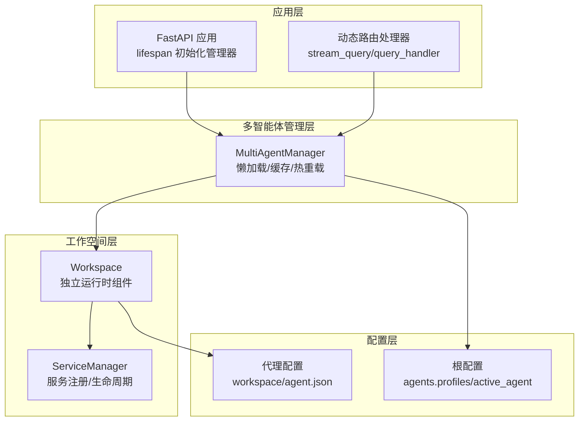
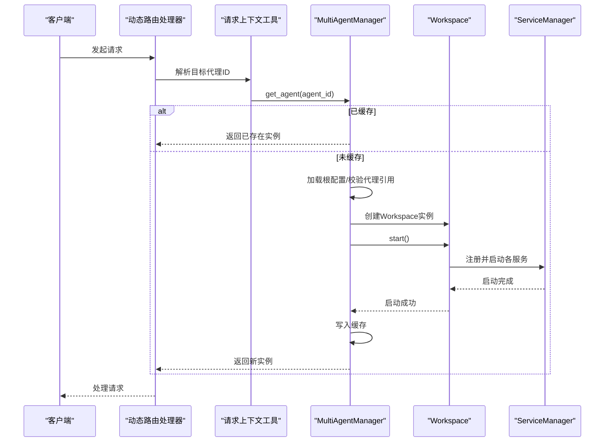
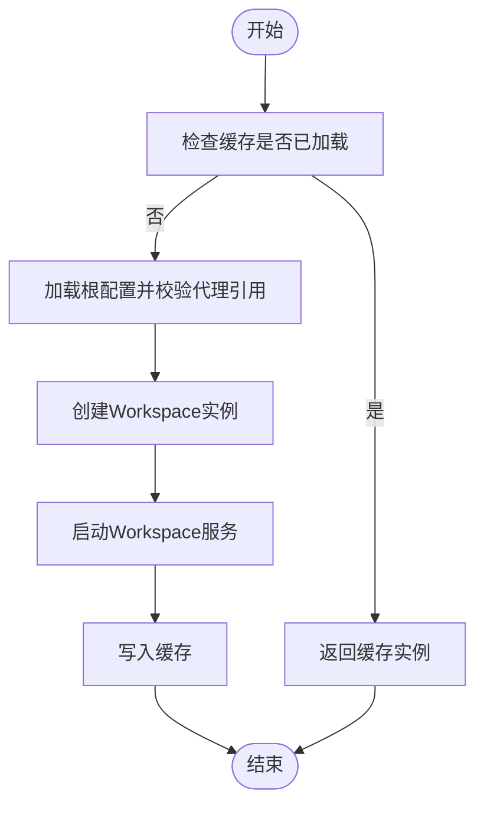
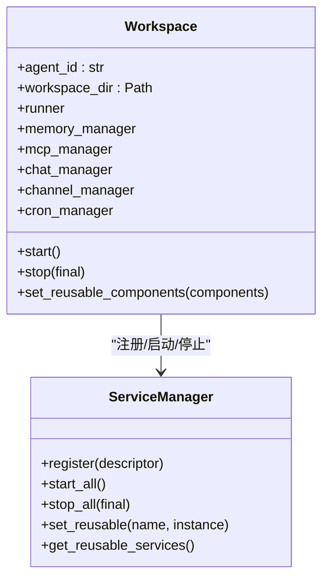
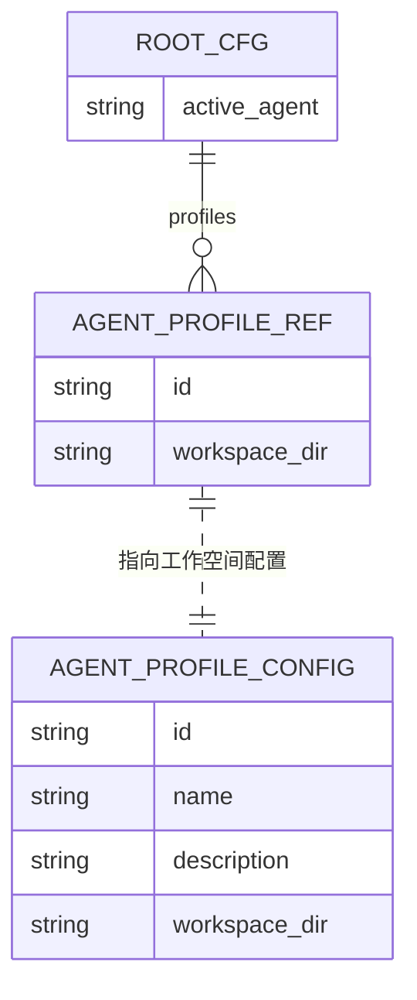
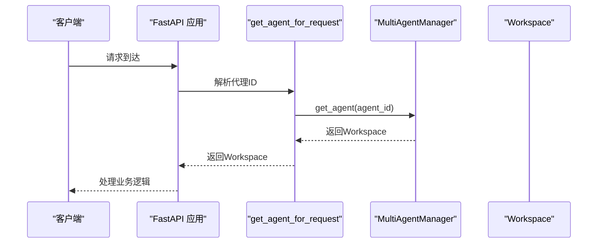
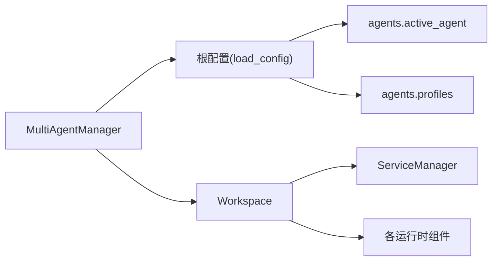

# 懒加载机制

<cite>
**本文引用的文件**
- [multi_agent_manager.py](file://src/copaw/app/multi_agent_manager.py)
- [workspace.py](file://src/copaw/app/workspace/workspace.py)
- [service_manager.py](file://src/copaw/app/workspace/service_manager.py)
- [_app.py](file://src/copaw/app/_app.py)
- [agent_context.py](file://src/copaw/app/agent_context.py)
- [config.py](file://src/copaw/config/config.py)
- [utils.py](file://src/copaw/config/utils.py)
</cite>

## 目录
1. [简介](#简介)
2. [项目结构](#项目结构)
3. [核心组件](#核心组件)
4. [架构总览](#架构总览)
5. [详细组件分析](#详细组件分析)
6. [依赖分析](#依赖分析)
7. [性能考量](#性能考量)
8. [故障排查指南](#故障排查指南)
9. [结论](#结论)
10. [附录](#附录)

## 简介
本文件围绕 CoPaw 的多智能体懒加载机制展开，重点解析 MultiAgentManager 中的按需创建工作空间实例、内存优化策略与性能权衡，并深入说明 get_agent 方法的实现逻辑（配置加载、实例创建与缓存管理）。同时对比懒加载与传统预加载的优势，给出高并发场景下的行为特征与最佳实践，覆盖配置项、使用示例与常见陷阱。

## 项目结构
CoPaw 的多智能体运行时由以下关键模块协同组成：
- 应用生命周期与路由：FastAPI 应用通过 lifespan 初始化 MultiAgentManager，并在请求处理链路中动态路由到对应 Workspace。
- 多智能体管理器：MultiAgentManager 负责按需创建与缓存 Workspace 实例，支持零停机热重载。
- 工作空间：Workspace 封装独立智能体的完整运行时组件（Runner、ChannelManager、MemoryManager、MCPClientManager、CronManager），并通过 ServiceManager 统一注册与生命周期管理。
- 配置系统：根配置包含 agents.profiles（代理引用）与 agents.active_agent（当前活跃代理），工作空间配置位于各自工作目录下。

图表来源
- [_app.py:148-239](file://src/copaw/app/_app.py#L148-L239)
- [multi_agent_manager.py:17-33](file://src/copaw/app/multi_agent_manager.py#L17-L33)
- [workspace.py:39-78](file://src/copaw/app/workspace/workspace.py#L39-L78)
- [service_manager.py:74-91](file://src/copaw/app/workspace/service_manager.py#L74-L91)
- [config.py:455-496](file://src/copaw/config/config.py#L455-L496)

章节来源
- [_app.py:148-239](file://src/copaw/app/_app.py#L148-L239)
- [multi_agent_manager.py:17-33](file://src/copaw/app/multi_agent_manager.py#L17-L33)
- [workspace.py:39-78](file://src/copaw/app/workspace/workspace.py#L39-L78)
- [service_manager.py:74-91](file://src/copaw/app/workspace/service_manager.py#L74-L91)
- [config.py:455-496](file://src/copaw/config/config.py#L455-L496)

## 核心组件
- MultiAgentManager：集中式多智能体管理器，提供懒加载、生命周期管理、线程安全（异步锁）、零停机热重载与批量预加载能力。
- Workspace：单个智能体的独立运行时容器，封装 Runner、ChannelManager、MemoryManager、MCPClientManager、CronManager 等组件。
- ServiceManager：统一的服务注册、依赖解析与生命周期管理，支持可复用组件在热重载时保留。
- 配置系统：根配置定义代理引用与活跃代理；代理配置存储于各自工作目录，描述具体运行参数与功能开关。

章节来源
- [multi_agent_manager.py:17-33](file://src/copaw/app/multi_agent_manager.py#L17-L33)
- [workspace.py:39-78](file://src/copaw/app/workspace/workspace.py#L39-L78)
- [service_manager.py:74-91](file://src/copaw/app/workspace/service_manager.py#L74-L91)
- [config.py:380-496](file://src/copaw/config/config.py#L380-L496)

## 架构总览
懒加载的核心在于“按需创建 + 缓存复用”。请求到达时，根据优先级确定目标代理 ID，若缓存中不存在则从配置加载代理引用并创建 Workspace，随后启动其内部服务。启动成功后将实例放入缓存，后续请求直接复用，避免重复初始化成本。

图表来源
- [agent_context.py:22-84](file://src/copaw/app/agent_context.py#L22-L84)
- [multi_agent_manager.py:34-82](file://src/copaw/app/multi_agent_manager.py#L34-L82)
- [workspace.py:311-337](file://src/copaw/app/workspace/workspace.py#L311-L337)
- [service_manager.py:171-200](file://src/copaw/app/workspace/service_manager.py#L171-L200)

## 详细组件分析

### MultiAgentManager：懒加载与缓存
- 懒加载策略
  - get_agent 在缓存命中时直接返回；未命中时加载根配置，校验代理引用，创建 Workspace 并启动，最后写入缓存。
  - 线程安全：使用异步锁保护缓存访问与实例替换，避免竞态。
- 零停机热重载
  - reload_agent 分为“创建新实例（不持锁）+ 原子替换（短时持锁）+ 延迟清理旧实例（不持锁）”三阶段，最小化阻塞时间。
  - 可复用组件：从旧实例提取可复用服务（如 MemoryManager、ChatManager），在新实例启动前注入，降低重启抖动。
- 生命周期管理
  - stop_agent：停止指定实例并移除缓存。
  - stop_all：取消待执行的延迟清理任务，逐个停止所有实例并清空缓存。
  - start_all_configured_agents：并发启动配置中的所有代理，提升启动效率。
- 批量预加载
  - preload_agent：显式触发懒加载以在启动阶段完成初始化，便于提前暴露错误或缩短首次请求延迟。

图表来源
- [multi_agent_manager.py:34-82](file://src/copaw/app/multi_agent_manager.py#L34-L82)

章节来源
- [multi_agent_manager.py:34-82](file://src/copaw/app/multi_agent_manager.py#L34-L82)
- [multi_agent_manager.py:200-311](file://src/copaw/app/multi_agent_manager.py#L200-L311)
- [multi_agent_manager.py:382-445](file://src/copaw/app/multi_agent_manager.py#L382-L445)

### Workspace：独立运行时与组件复用
- 组件构成
  - Runner：请求处理核心。
  - ChannelManager：消息通道管理。
  - MemoryManager：对话记忆。
  - MCPClientManager：外部工具客户端。
  - CronManager：定时任务。
- 服务注册与启动
  - 通过 ServiceManager 以优先级分组并发启动，支持可复用组件在热重载时保留。
- 组件复用
  - set_reusable_components：在新实例启动前注入旧实例的可复用组件，避免重复初始化。
  - stop(final)：支持“最终停止”与“非最终停止”，前者停止所有服务，后者跳过可复用组件以便热重载。

图表来源
- [workspace.py:39-133](file://src/copaw/app/workspace/workspace.py#L39-L133)
- [workspace.py:279-310](file://src/copaw/app/workspace/workspace.py#L279-L310)
- [workspace.py:311-357](file://src/copaw/app/workspace/workspace.py#L311-L357)
- [service_manager.py:74-156](file://src/copaw/app/workspace/service_manager.py#L74-L156)

章节来源
- [workspace.py:39-133](file://src/copaw/app/workspace/workspace.py#L39-L133)
- [workspace.py:279-357](file://src/copaw/app/workspace/workspace.py#L279-L357)
- [service_manager.py:74-156](file://src/copaw/app/workspace/service_manager.py#L74-L156)

### 配置系统：代理引用与活跃代理
- 根配置 agents.profiles
  - 存储代理 ID 到工作目录的映射，用于懒加载时定位 Workspace。
- 根配置 agents.active_agent
  - 请求未显式指定代理时的回退策略。
- 代理配置 workspace/agent.json
  - 存放每个代理的完整配置（通道、心跳、运行参数等），由 Workspace 在启动时加载。

图表来源
- [config.py:455-496](file://src/copaw/config/config.py#L455-L496)
- [config.py:380-453](file://src/copaw/config/config.py#L380-L453)
- [utils.py:1-200](file://src/copaw/config/utils.py#L1-L200)

章节来源
- [config.py:455-496](file://src/copaw/config/config.py#L455-L496)
- [config.py:380-453](file://src/copaw/config/config.py#L380-L453)
- [utils.py:1-200](file://src/copaw/config/utils.py#L1-L200)

### 请求上下文与动态路由
- 动态路由
  - FastAPI 应用在 lifespan 中初始化 MultiAgentManager，并将 get_agent_by_id 挂载到 app.state，供路由处理器调用。
- 请求上下文
  - get_agent_for_request 根据参数、请求状态、请求头与配置解析目标代理 ID，再通过 MultiAgentManager 获取 Workspace。

图表来源
- [_app.py:199-207](file://src/copaw/app/_app.py#L199-L207)
- [agent_context.py:22-84](file://src/copaw/app/agent_context.py#L22-L84)
- [multi_agent_manager.py:34-82](file://src/copaw/app/multi_agent_manager.py#L34-L82)

章节来源
- [_app.py:199-207](file://src/copaw/app/_app.py#L199-L207)
- [agent_context.py:22-84](file://src/copaw/app/agent_context.py#L22-L84)
- [multi_agent_manager.py:34-82](file://src/copaw/app/multi_agent_manager.py#L34-L82)

## 依赖分析
- MultiAgentManager 依赖
  - 配置加载：通过 load_config 读取根配置，解析代理引用。
  - Workspace：创建并启动独立运行时。
  - 异步锁：保证缓存与实例替换的线程安全。
- Workspace 依赖
  - ServiceManager：统一注册与启动服务。
  - 各组件：Runner、ChannelManager、MemoryManager、MCPClientManager、CronManager。
- 配置系统
  - 根配置与代理配置分离，代理引用仅包含必要元信息，实际配置在工作空间内。

图表来源
- [multi_agent_manager.py:12-14](file://src/copaw/app/multi_agent_manager.py#L12-L14)
- [multi_agent_manager.py:34-82](file://src/copaw/app/multi_agent_manager.py#L34-L82)
- [workspace.py:39-78](file://src/copaw/app/workspace/workspace.py#L39-L78)
- [service_manager.py:74-91](file://src/copaw/app/workspace/service_manager.py#L74-L91)
- [config.py:455-496](file://src/copaw/config/config.py#L455-L496)

章节来源
- [multi_agent_manager.py:12-14](file://src/copaw/app/multi_agent_manager.py#L12-L14)
- [multi_agent_manager.py:34-82](file://src/copaw/app/multi_agent_manager.py#L34-L82)
- [workspace.py:39-78](file://src/copaw/app/workspace/workspace.py#L39-L78)
- [service_manager.py:74-91](file://src/copaw/app/workspace/service_manager.py#L74-L91)
- [config.py:455-496](file://src/copaw/config/config.py#L455-L496)

## 性能考量
- 启动时间优化
  - 懒加载：仅在首次请求时创建实例，显著降低冷启动时间。
  - 批量预加载：在应用启动阶段并发启动所有代理，缩短后续首次请求延迟。
  - 零停机热重载：新实例启动完成后原子替换旧实例，避免服务中断与重建开销。
- 内存优化
  - 按需创建：未使用的代理不会占用内存。
  - 可复用组件：热重载时保留 MemoryManager、ChatManager 等昂贵资源，减少重复初始化。
  - 延迟清理：旧实例在后台等待活动任务完成后再停止，避免内存泄漏与数据丢失。
- 并发与吞吐
  - get_agent 使用异步锁保护关键路径，但持有时间极短（仅在缓存检查与实例替换时）。
  - start_all_configured_agents 并发启动多个代理，充分利用多核 CPU。
- 高并发场景建议
  - 合理设置代理数量与资源上限，避免同时启动过多实例导致瞬时资源紧张。
  - 对热点代理进行预加载，结合懒加载平衡启动时间与内存占用。
  - 使用可复用组件与零停机热重载，降低维护窗口内的服务不可用风险。

## 故障排查指南
- 常见问题
  - 代理未找到：get_agent 抛出异常，检查 agents.profiles 是否包含目标 ID，确认配置路径正确。
  - 启动失败：Workspace.start 抛出异常，查看日志定位具体组件启动失败原因（如模型提供商连接失败）。
  - 热重载失败：新实例启动失败会回滚至旧实例，检查新实例日志与资源占用。
  - 延迟清理任务堆积：大量旧实例未及时停止，检查是否有长时间运行的任务或异常退出。
- 排查步骤
  - 检查应用日志：关注 MultiAgentManager 的创建、启动与替换日志。
  - 校验配置：确认 agents.active_agent 与 agents.profiles 正确。
  - 观察资源：监控内存与 CPU 使用，评估可复用组件的收益。
  - 回滚策略：若热重载失败，旧实例仍可继续服务，无需中断业务。

章节来源
- [multi_agent_manager.py:58-62](file://src/copaw/app/multi_agent_manager.py#L58-L62)
- [multi_agent_manager.py:278-288](file://src/copaw/app/multi_agent_manager.py#L278-L288)
- [multi_agent_manager.py:313-336](file://src/copaw/app/multi_agent_manager.py#L313-L336)
- [workspace.py:330-336](file://src/copaw/app/workspace/workspace.py#L330-L336)

## 结论
CoPaw 的懒加载机制通过“按需创建 + 缓存复用 + 零停机热重载”实现了启动时间与内存占用的双重优化。MultiAgentManager 的设计兼顾了线程安全与高并发性能，配合 Workspace 的组件复用与 ServiceManager 的生命周期管理，使得系统在复杂场景下仍保持稳定与高效。对于高并发与大规模部署，建议结合预加载、可复用组件与合理的资源配额，达到最佳的可用性与性能平衡。

## 附录

### 使用示例与最佳实践
- 延迟初始化
  - 通过 get_agent 按需创建实例，避免启动阶段的资源浪费。
- 内存使用优化
  - 启动阶段对热点代理进行预加载，其余代理采用懒加载。
  - 启用可复用组件，减少热重载时的重建成本。
- 启动时间减少
  - 使用 start_all_configured_agents 并发启动所有代理。
  - 将耗时初始化（如模型加载）放在后台任务中，缩短关键路径。
- 配置要点
  - 确保 agents.profiles 正确映射代理 ID 到工作目录。
  - 设置 agents.active_agent 作为默认代理，简化请求路由。
- 最佳实践清单
  - 预加载高频代理，懒加载低频代理。
  - 定期清理延迟清理任务，避免资源泄露。
  - 监控热重载成功率，及时修复失败场景。
  - 控制并发启动数量，避免瞬时资源不足。

### 配置选项速览
- 根配置
  - agents.active_agent：当前活跃代理 ID。
  - agents.profiles：代理 ID 到工作目录的映射。
- 代理配置（workspace/agent.json）
  - channels、mcp、heartbeat、running、llm_routing、tools、security 等。

章节来源
- [config.py:455-496](file://src/copaw/config/config.py#L455-L496)
- [config.py:380-453](file://src/copaw/config/config.py#L380-L453)