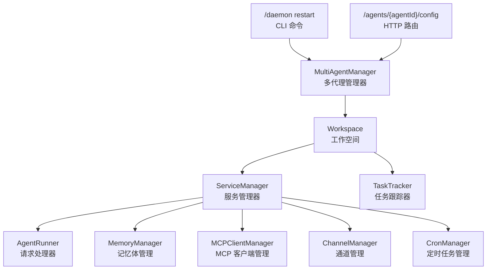
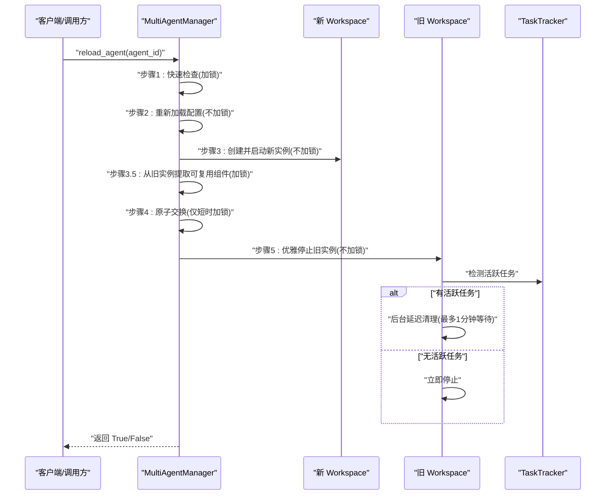
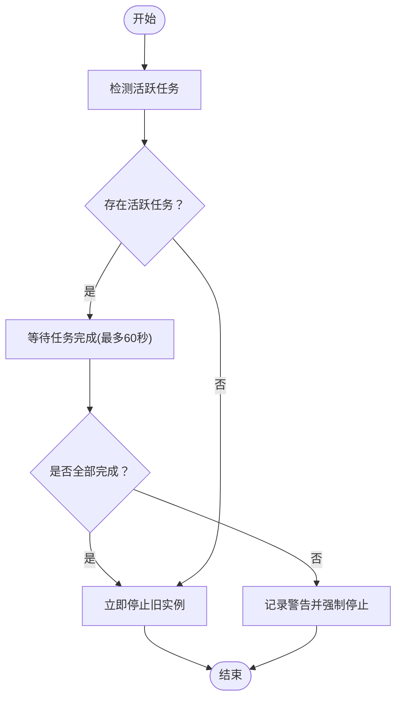
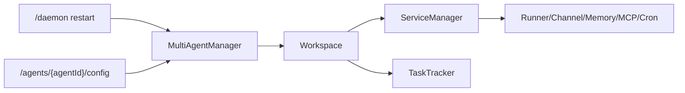

# 零停机重载

<cite>
**本文引用的文件**
- [multi_agent_manager.py](file://src/copaw/app/multi_agent_manager.py)
- [workspace.py](file://src/copaw/app/workspace/workspace.py)
- [task_tracker.py](file://src/copaw/app/runner/task_tracker.py)
- [service_manager.py](file://src/copaw/app/workspace/service_manager.py)
- [daemon_commands.py](file://src/copaw/app/runner/daemon_commands.py)
- [agents.py](file://src/copaw/app/routers/agents.py)
- [commands.en.md](file://website/public/docs/commands.en.md)
</cite>

## 目录
1. [简介](#简介)
2. [项目结构](#项目结构)
3. [核心组件](#核心组件)
4. [架构总览](#架构总览)
5. [详细组件分析](#详细组件分析)
6. [依赖关系分析](#依赖关系分析)
7. [性能考量](#性能考量)
8. [故障排除指南](#故障排除指南)
9. [结论](#结论)
10. [附录](#附录)

## 简介
本文件系统化阐述 CoPaw 的“零停机重载”能力，围绕 reload_agent 方法展开，深入解析其设计理念与实现原理，包括：
- 原子性切换：最小锁持有时间，确保新请求立即由新实例处理
- 后台清理：在不影响新实例的前提下，等待或强制停止旧实例
- 故障恢复：失败时的回滚与清理策略，保证服务可用性
- 五步流程：实例创建、配置检查、原子交换、优雅停止、后台清理
- 活跃任务检测、延迟清理与资源回收策略
- 使用示例：配置更新、模型热替换、技能重载
- 错误处理、超时控制与回滚机制

## 项目结构
与零停机重载直接相关的核心模块如下：
- 多代理管理器：负责代理实例的生命周期与重载
- 工作空间：封装单个代理的完整运行时（Runner、ChannelManager、MemoryManager、MCPClientManager、CronManager 等）
- 任务跟踪器：用于检测活跃任务并等待其完成
- 服务管理器：统一注册、启动/停止与可复用组件传递
- 运行时命令与路由：对外暴露重载入口（CLI 与 HTTP）

图表来源
- [multi_agent_manager.py:17-451](file://src/copaw/app/multi_agent_manager.py#L17-L451)
- [workspace.py:39-367](file://src/copaw/app/workspace/workspace.py#L39-L367)
- [service_manager.py:74-186](file://src/copaw/app/workspace/service_manager.py#L74-L186)
- [task_tracker.py:31-159](file://src/copaw/app/runner/task_tracker.py#L31-L159)
- [daemon_commands.py:126-149](file://src/copaw/app/runner/daemon_commands.py#L126-L149)
- [agents.py:222-265](file://src/copaw/app/routers/agents.py#L222-L265)

章节来源
- [multi_agent_manager.py:17-451](file://src/copaw/app/multi_agent_manager.py#L17-L451)
- [workspace.py:39-367](file://src/copaw/app/workspace/workspace.py#L39-L367)
- [service_manager.py:74-186](file://src/copaw/app/workspace/service_manager.py#L74-L186)
- [task_tracker.py:31-159](file://src/copaw/app/runner/task_tracker.py#L31-L159)
- [daemon_commands.py:126-149](file://src/copaw/app/runner/daemon_commands.py#L126-L149)
- [agents.py:222-265](file://src/copaw/app/routers/agents.py#L222-L265)

## 核心组件
- MultiAgentManager.reload_agent：零停机重载的主入口，执行五步流程并协调后台清理
- Workspace：单个代理的独立运行时，包含服务注册、启动/停止与可复用组件传递
- ServiceManager：统一的服务生命周期管理，支持可复用组件在重载时传递
- TaskTracker：跟踪活跃任务，提供“是否有活跃任务”“列出活跃任务”“等待全部完成”的能力
- CLI 与 HTTP 路由：通过 /daemon restart 或 /agents/{agentId}/config 更新后触发重载

章节来源
- [multi_agent_manager.py:200-311](file://src/copaw/app/multi_agent_manager.py#L200-L311)
- [workspace.py:134-310](file://src/copaw/app/workspace/workspace.py#L134-L310)
- [service_manager.py:146-156](file://src/copaw/app/workspace/service_manager.py#L146-L156)
- [task_tracker.py:54-98](file://src/copaw/app/runner/task_tracker.py#L54-L98)
- [daemon_commands.py:126-149](file://src/copaw/app/runner/daemon_commands.py#L126-L149)
- [agents.py:247-258](file://src/copaw/app/routers/agents.py#L247-L258)

## 架构总览
零停机重载的总体流程如下：

图表来源
- [multi_agent_manager.py:200-311](file://src/copaw/app/multi_agent_manager.py#L200-L311)
- [workspace.py:311-357](file://src/copaw/app/workspace/workspace.py#L311-L357)
- [task_tracker.py:79-98](file://src/copaw/app/runner/task_tracker.py#L79-L98)

## 详细组件分析

### reload_agent 方法设计与实现
- 设计理念
  - 最小化阻塞：仅在“原子交换”阶段短暂持有锁，其余步骤均在无锁状态下进行
  - 无缝切换：新实例启动成功后立即替换旧实例，新请求由新实例处理
  - 可靠清理：若存在活跃任务，则后台等待完成后停止；否则立即停止
  - 可复用组件：将旧实例中可复用的服务（如 MemoryManager、ChatManager）传递给新实例，避免重复初始化
- 五步流程详解
  1) 实例创建：在无锁状态下创建并启动新 Workspace，耗时较长但不影响其他代理
  2) 配置检查：重新读取配置，确认目标代理存在
  3) 原子交换：在短时加锁内完成旧/新实例替换，确保后续请求由新实例处理
  4) 优雅停止：根据活跃任务情况决定立即停止或后台延迟清理
  5) 后台清理：通过后台任务等待活跃任务完成，超时后强制停止，避免悬挂实例
- 错误处理与回滚
  - 新实例启动失败：记录异常并尝试停止新实例，保持旧实例继续服务
  - 替换过程中实例被移除：停止新实例并返回失败
  - 后台清理异常：记录警告，不影响新实例正常服务

章节来源
- [multi_agent_manager.py:200-311](file://src/copaw/app/multi_agent_manager.py#L200-L311)
- [workspace.py:311-357](file://src/copaw/app/workspace/workspace.py#L311-L357)
- [service_manager.py:146-156](file://src/copaw/app/workspace/service_manager.py#L146-L156)

### 活跃任务检测与延迟清理
- 活跃任务检测
  - 通过 TaskTracker.has_active_tasks 判断是否存在未完成的任务
  - 通过 TaskTracker.list_active_tasks 获取当前所有活跃任务键列表
- 延迟清理策略
  - 若存在活跃任务：创建后台任务等待任务完成，最长等待约 1 分钟；若超时则记录警告并强制停止
  - 若无活跃任务：立即停止旧实例
- 资源回收
  - 旧实例停止时，非最终关闭（final=False）会跳过可复用组件的销毁，以便新实例复用
  - 可复用组件由 ServiceManager 统一管理，确保在新旧实例间安全传递

图表来源
- [multi_agent_manager.py:83-178](file://src/copaw/app/multi_agent_manager.py#L83-L178)
- [task_tracker.py:79-98](file://src/copaw/app/runner/task_tracker.py#L79-L98)

章节来源
- [multi_agent_manager.py:83-178](file://src/copaw/app/multi_agent_manager.py#L83-L178)
- [task_tracker.py:54-98](file://src/copaw/app/runner/task_tracker.py#L54-L98)

### 可复用组件传递与热替换
- 可复用组件
  - MemoryManager、ChatManager 等服务在 ServiceDescriptor 中声明为可复用
  - 旧实例停止时不会销毁这些组件，而是传递给新实例
- 传递流程
  - 在“原子交换”前，从旧实例提取可复用组件集合
  - 在新实例启动前设置这些组件，避免重复初始化
- 典型场景
  - 配置更新：无需重启模型后端，直接重载代理配置
  - 技能/工具变更：在不中断对话的情况下应用新技能定义

章节来源
- [workspace.py:279-310](file://src/copaw/app/workspace/workspace.py#L279-L310)
- [service_manager.py:146-156](file://src/copaw/app/workspace/service_manager.py#L146-L156)
- [multi_agent_manager.py:257-273](file://src/copaw/app/multi_agent_manager.py#L257-L273)

### 触发入口与使用示例
- CLI 触发
  - /daemon restart：在聊天中或通过 copaw daemon restart 触发零停机重载
- HTTP 触发
  - /agents/{agentId}/config：更新代理配置后，异步触发重载，不阻塞请求
- 使用示例
  - 配置更新：修改代理配置文件后，发送 /daemon restart 或调用 /agents/{agentId}/config，系统自动重载
  - 模型热替换：更新模型提供商配置后，重载代理以应用新模型参数
  - 技能重载：更新技能定义后，重载代理以启用新技能

章节来源
- [daemon_commands.py:126-149](file://src/copaw/app/runner/daemon_commands.py#L126-L149)
- [agents.py:247-258](file://src/copaw/app/routers/agents.py#L247-L258)
- [commands.en.md:241-260](file://website/public/docs/commands.en.md#L241-L260)

## 依赖关系分析
- 多代理管理器依赖工作空间与任务跟踪器，以实现零停机重载
- 工作空间通过服务管理器统一管理各子系统，支持可复用组件传递
- CLI 与 HTTP 路由作为外部触发入口，最终调用多代理管理器的重载逻辑

图表来源
- [multi_agent_manager.py:200-311](file://src/copaw/app/multi_agent_manager.py#L200-L311)
- [workspace.py:134-310](file://src/copaw/app/workspace/workspace.py#L134-L310)
- [service_manager.py:74-186](file://src/copaw/app/workspace/service_manager.py#L74-L186)
- [task_tracker.py:31-159](file://src/copaw/app/runner/task_tracker.py#L31-L159)
- [daemon_commands.py:126-149](file://src/copaw/app/runner/daemon_commands.py#L126-L149)
- [agents.py:247-258](file://src/copaw/app/routers/agents.py#L247-L258)

章节来源
- [multi_agent_manager.py:200-311](file://src/copaw/app/multi_agent_manager.py#L200-L311)
- [workspace.py:134-310](file://src/copaw/app/workspace/workspace.py#L134-L310)
- [service_manager.py:74-186](file://src/copaw/app/workspace/service_manager.py#L74-L186)
- [task_tracker.py:31-159](file://src/copaw/app/runner/task_tracker.py#L31-L159)
- [daemon_commands.py:126-149](file://src/copaw/app/runner/daemon_commands.py#L126-L149)
- [agents.py:247-258](file://src/copaw/app/routers/agents.py#L247-L258)

## 性能考量
- 并发与无锁操作：实例创建与启动在无锁状态下进行，避免阻塞其他代理
- 最小锁持有时间：原子交换仅在短时加锁内完成，降低竞争开销
- 可复用组件：减少重复初始化成本，提升重载速度
- 后台清理：避免主线程等待，提高响应性
- 超时控制：等待活跃任务完成最多约 1 分钟，超时后强制停止，防止长时间挂起

## 故障排除指南
- 新实例启动失败
  - 现象：日志记录启动异常，旧实例继续服务
  - 排查：检查配置文件、模型后端状态、磁盘空间与权限
  - 处理：修复问题后再次触发重载
- 原子交换失败
  - 现象：替换过程中实例被移除，新实例停止
  - 排查：确认代理 ID 正确且未被并发删除
  - 处理：重试重载或等待下一次请求触发加载
- 后台清理异常
  - 现象：延迟清理任务出现警告，不影响新实例
  - 排查：查看任务跟踪器状态与活跃任务列表
  - 处理：等待清理任务完成或强制取消并重启
- 超时未完成
  - 现象：等待活跃任务完成超时，记录警告并强制停止
  - 排查：检查长连接、SSE/流式任务是否正常结束
  - 处理：优化任务结束逻辑或调整超时策略

章节来源
- [multi_agent_manager.py:274-288](file://src/copaw/app/multi_agent_manager.py#L274-L288)
- [multi_agent_manager.py:111-135](file://src/copaw/app/multi_agent_manager.py#L111-L135)
- [task_tracker.py:79-98](file://src/copaw/app/runner/task_tracker.py#L79-L98)

## 结论
CoPaw 的零停机重载通过“无锁实例创建 + 最小锁原子交换 + 后台延迟清理”的组合，实现了高可用、低干扰的代理重载。配合可复用组件传递与完善的错误处理，能够在不中断用户会话与后台任务的前提下，平滑地应用配置更新、模型热替换与技能重载等运维需求。

## 附录
- 触发方式
  - 聊天中：/daemon restart
  - 终端：copaw daemon restart
  - HTTP：/agents/{agentId}/config 更新后自动触发
- 关键路径参考
  - [reload_agent 主流程:200-311](file://src/copaw/app/multi_agent_manager.py#L200-L311)
  - [后台清理与超时控制:83-178](file://src/copaw/app/multi_agent_manager.py#L83-L178)
  - [活跃任务检测:54-98](file://src/copaw/app/runner/task_tracker.py#L54-L98)
  - [可复用组件传递:279-310](file://src/copaw/app/workspace/workspace.py#L279-L310)
  - [CLI 触发入口:126-149](file://src/copaw/app/runner/daemon_commands.py#L126-L149)
  - [HTTP 触发入口:247-258](file://src/copaw/app/routers/agents.py#L247-L258)