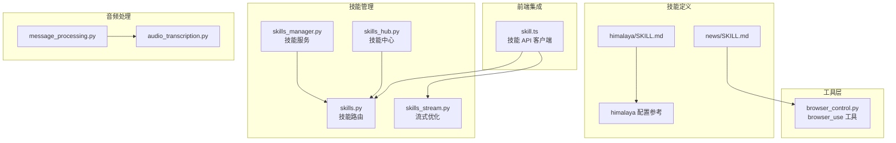
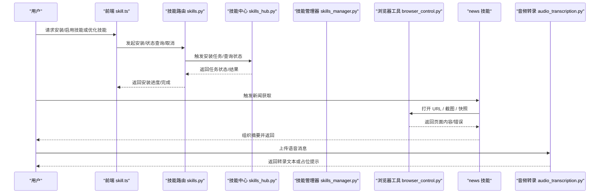
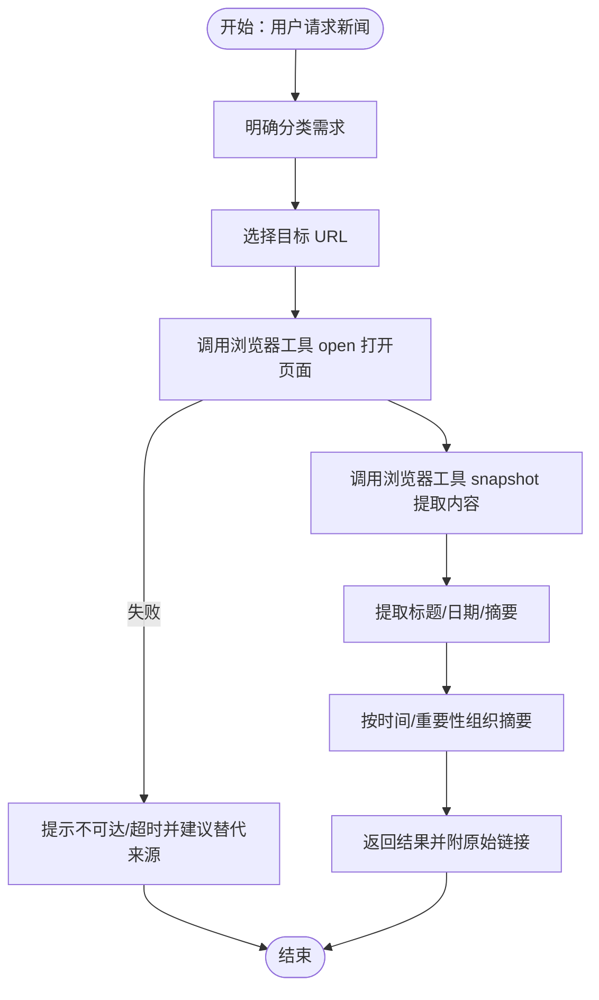
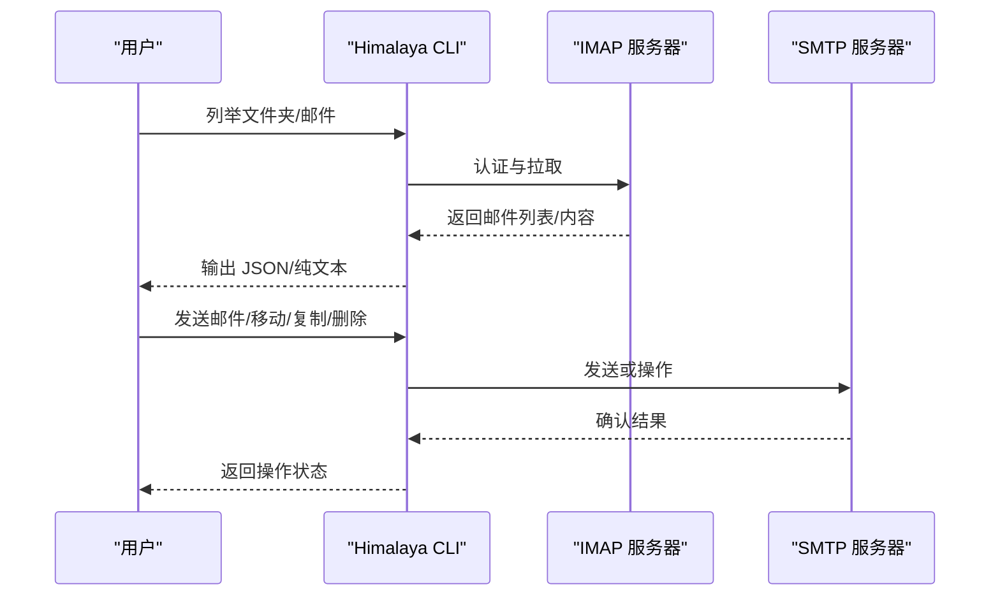
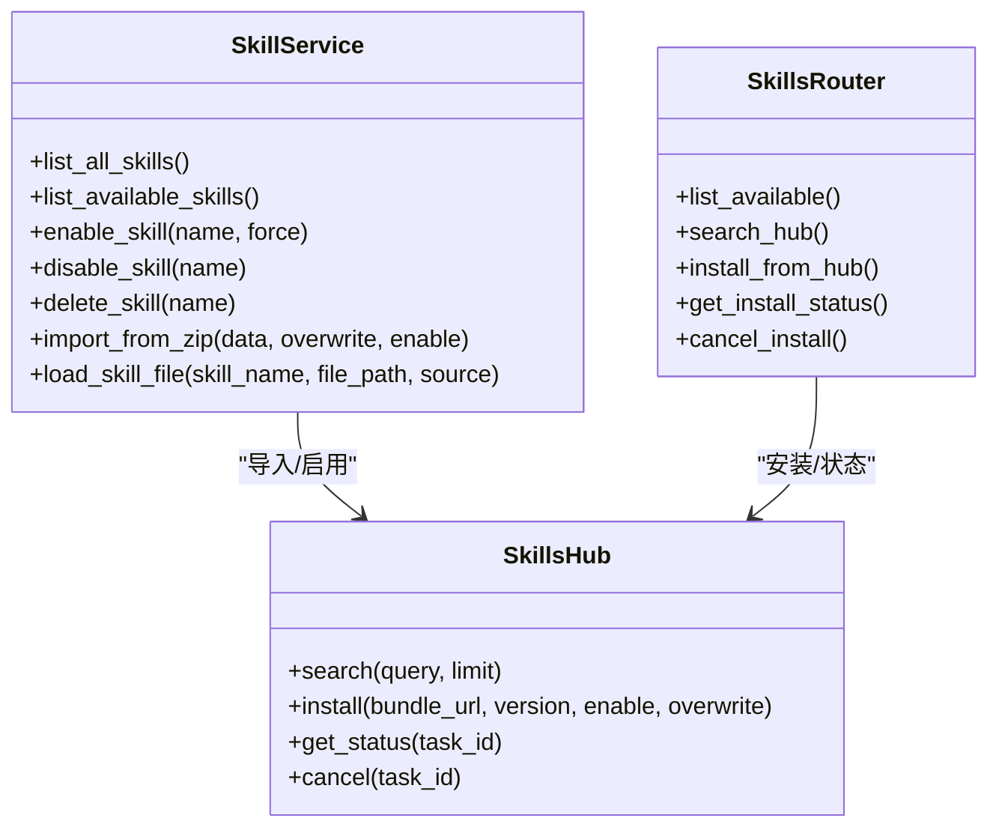
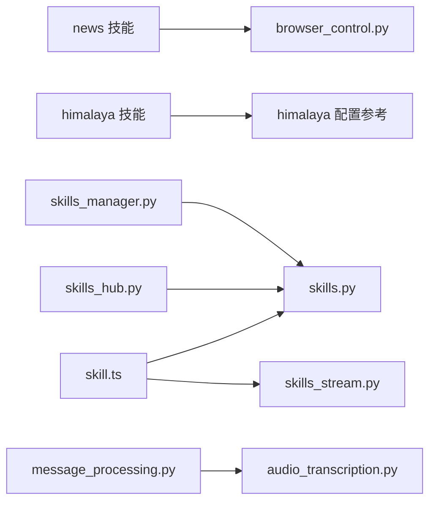

# 信息获取技能

<cite>
**本文引用的文件**
- [news/SKILL.md](file://src/copaw/agents/skills/news/SKILL.md)
- [himalaya/SKILL.md](file://src/copaw/agents/skills/himalaya/SKILL.md)
- [himalaya 配置参考](file://src/copaw/agents/skills/himalaya/references/configuration.md)
- [浏览器工具 browser_control.py](file://src/copaw/agents/tools/browser_control.py)
- [技能管理器 skills_manager.py](file://src/copaw/agents/skills_manager.py)
- [技能中心 skills_hub.py](file://src/copaw/agents/skills_hub.py)
- [技能路由 skills.py](file://src/copaw/app/routers/skills.py)
- [技能流式优化 skills_stream.py](file://src/copaw/app/routers/skills_stream.py)
- [前端技能模块 skill.ts](file://console/src/api/modules/skill.ts)
- [音频转录 audio_transcription.py](file://src/copaw/agents/utils/audio_transcription.py)
- [消息处理 message_processing.py](file://src/copaw/agents/utils/message_processing.py)
</cite>

## 目录
1. [简介](#简介)
2. [项目结构](#项目结构)
3. [核心组件](#核心组件)
4. [架构总览](#架构总览)
5. [详细组件分析](#详细组件分析)
6. [依赖关系分析](#依赖关系分析)
7. [性能考量](#性能考量)
8. [故障排查指南](#故障排查指南)
9. [结论](#结论)
10. [附录](#附录)

## 简介
本文件面向 CoPaw 的“信息获取技能”，系统化梳理两类能力：
- 新闻聚合技能：从权威中文新闻站点抓取最新资讯，通过浏览器工具打开页面、截图快照并提炼摘要，支持多分类并行获取与来源切换。
- Himalaya 邮件 CLI 技能：基于终端邮件客户端管理邮箱，支持多账户、IMAP/SMTP、附件下载、邮件搜索与组织等操作。

文档覆盖功能特性、使用方法、配置要点、准确性与时效性保障、内容质量控制以及常见问题排查，帮助用户高效、安全地获取与管理信息。

## 项目结构
信息获取相关能力主要分布在以下模块：
- 技能定义与文档：news、himalaya 技能的 SKILL.md 及其参考文档
- 工具层：浏览器工具 browser_use 实现网页打开、导航、截图、快照等
- 技能管理：技能目录扫描、启用/禁用、导入、版本与安全校验
- 技能中心：技能仓库搜索、安装、状态查询与取消
- 前端集成：技能安装、流式优化接口调用
- 音频处理：语音消息转录与本地/云端 Whisper 集成

图表来源
- [news/SKILL.md:1-52](file://src/copaw/agents/skills/news/SKILL.md#L1-L52)
- [himalaya/SKILL.md:1-300](file://src/copaw/agents/skills/himalaya/SKILL.md#L1-L300)
- [himalaya 配置参考:1-185](file://src/copaw/agents/skills/himalaya/references/configuration.md#L1-L185)
- [浏览器工具 browser_control.py:301-608](file://src/copaw/agents/tools/browser_control.py#L301-L608)
- [技能管理器 skills_manager.py:627-941](file://src/copaw/agents/skills_manager.py#L627-L941)
- [技能中心 skills_hub.py:1-200](file://src/copaw/agents/skills_hub.py#L1-L200)
- [技能路由 skills.py:170-447](file://src/copaw/app/routers/skills.py#L170-L447)
- [技能流式优化 skills_stream.py:168-210](file://src/copaw/app/routers/skills_stream.py#L168-L210)
- [前端技能模块 skill.ts:90-184](file://console/src/api/modules/skill.ts#L90-L184)
- [音频转录 audio_transcription.py:295-318](file://src/copaw/agents/utils/audio_transcription.py#L295-L318)
- [消息处理 message_processing.py:217-277](file://src/copaw/agents/utils/message_processing.py#L217-L277)

章节来源
- [news/SKILL.md:1-52](file://src/copaw/agents/skills/news/SKILL.md#L1-L52)
- [himalaya/SKILL.md:1-300](file://src/copaw/agents/skills/himalaya/SKILL.md#L1-L300)
- [himalaya 配置参考:1-185](file://src/copaw/agents/skills/himalaya/references/configuration.md#L1-L185)
- [浏览器工具 browser_control.py:301-608](file://src/copaw/agents/tools/browser_control.py#L301-L608)
- [技能管理器 skills_manager.py:627-941](file://src/copaw/agents/skills_manager.py#L627-L941)
- [技能中心 skills_hub.py:1-200](file://src/copaw/agents/skills_hub.py#L1-L200)
- [技能路由 skills.py:170-447](file://src/copaw/app/routers/skills.py#L170-L447)
- [技能流式优化 skills_stream.py:168-210](file://src/copaw/app/routers/skills_stream.py#L168-L210)
- [前端技能模块 skill.ts:90-184](file://console/src/api/modules/skill.ts#L90-L184)
- [音频转录 audio_transcription.py:295-318](file://src/copaw/agents/utils/audio_transcription.py#L295-L318)
- [消息处理 message_processing.py:217-277](file://src/copaw/agents/utils/message_processing.py#L217-L277)

## 核心组件
- 新闻聚合技能
  - 使用浏览器工具打开指定新闻站点 URL，执行截图与快照，提取标题、日期与摘要，按时间或重要性组织回复。
  - 支持多分类并行获取，避免跨页内容混杂；对不可达或超时站点给出替代建议。
- Himalaya 邮件 CLI 技能
  - 通过 IMAP/SMTP 管理邮件，支持多账户、文件夹列举、分页、搜索、读取、发送、移动/复制、删除、附件下载、输出格式化与调试日志。
  - 提供交互式向导与手动配置两种方式，强调凭据安全存储与配置项完整性。
- 浏览器工具 browser_use
  - 统一的网页自动化入口，支持启动/停止、打开/跳转、截图、PDF 导出、标签页管理、等待与错误处理。
- 技能管理与技能中心
  - 自动扫描内置与自定义技能，启用/禁用、回写自定义、导入 ZIP、版本比较与安全扫描。
  - 技能中心提供搜索、安装任务状态查询与取消，支持重试与超时控制。
- 音频处理
  - 语音消息在“自动”模式下优先尝试转录；在“原生”模式下进行格式转换后直传模型；失败时显示占位提示并保留通知以便 LLM 知晓文件路径。

章节来源
- [news/SKILL.md:15-52](file://src/copaw/agents/skills/news/SKILL.md#L15-L52)
- [himalaya/SKILL.md:25-300](file://src/copaw/agents/skills/himalaya/SKILL.md#L25-L300)
- [himalaya 配置参考:1-185](file://src/copaw/agents/skills/himalaya/references/configuration.md#L1-L185)
- [浏览器工具 browser_control.py:301-608](file://src/copaw/agents/tools/browser_control.py#L301-L608)
- [技能管理器 skills_manager.py:627-941](file://src/copaw/agents/skills_manager.py#L627-L941)
- [技能中心 skills_hub.py:225-375](file://src/copaw/agents/skills_hub.py#L225-L375)
- [音频转录 audio_transcription.py:295-318](file://src/copaw/agents/utils/audio_transcription.py#L295-L318)
- [消息处理 message_processing.py:217-277](file://src/copaw/agents/utils/message_processing.py#L217-L277)

## 架构总览
信息获取技能的端到端流程如下：

图表来源
- [前端技能模块 skill.ts:90-184](file://console/src/api/modules/skill.ts#L90-L184)
- [技能路由 skills.py:170-447](file://src/copaw/app/routers/skills.py#L170-L447)
- [技能中心 skills_hub.py:225-375](file://src/copaw/agents/skills_hub.py#L225-L375)
- [技能管理器 skills_manager.py:627-941](file://src/copaw/agents/skills_manager.py#L627-L941)
- [浏览器工具 browser_control.py:301-608](file://src/copaw/agents/tools/browser_control.py#L301-L608)
- [音频转录 audio_transcription.py:295-318](file://src/copaw/agents/utils/audio_transcription.py#L295-L318)

## 详细组件分析

### 新闻聚合技能
- 功能特性
  - 多分类权威来源：政治、金融、社会、世界、科技、体育、娱乐
  - 流程闭环：打开页面 → 截图快照 → 提取标题/日期/摘要 → 组织回复
  - 错误处理：站点不可达/超时提示并建议替代来源
- 使用方法
  - 明确用户需求（单分类或多分类）
  - 选择对应 URL，调用浏览器工具打开页面
  - 对同一会话内多次打开不同分类时，先 open 再 snapshot，避免内容混杂
  - 将原文链接一并返回，便于用户进一步阅读
- 配置与定制
  - 可在 news 技能中扩展/替换来源表，遵循统一的分类与 URL 结构
  - 通过浏览器工具参数控制截图尺寸、全页截图与等待时间，提升稳定性
- 准确性与时效性
  - 页面结构可能随站点更新变化，若提取失败，提示用户直接访问链接
  - 建议定期检查来源可用性与快照解析规则

图表来源
- [news/SKILL.md:17-51](file://src/copaw/agents/skills/news/SKILL.md#L17-L51)
- [浏览器工具 browser_control.py:974-1044](file://src/copaw/agents/tools/browser_control.py#L974-L1044)

章节来源
- [news/SKILL.md:15-52](file://src/copaw/agents/skills/news/SKILL.md#L15-L52)
- [浏览器工具 browser_control.py:301-608](file://src/copaw/agents/tools/browser_control.py#L301-L608)

### Himalaya 邮件 CLI 技能
- 功能特性
  - 多账户管理：支持多个账户配置与切换
  - 邮件操作：列举、搜索、读取、发送、移动/复制、删除、附件下载
  - 输出与调试：支持 JSON/纯文本输出，开启调试日志
- 使用方法
  - 安装 Himalaya CLI 并准备配置文件 ~/.config/himalaya/config.toml
  - 使用交互式向导或手动编写配置，确保 IMAP/SMTP 凭据安全
  - 常用命令：列举文件夹、分页列举、搜索、读取、发送、移动/复制、删除、附件下载
- 配置要点
  - IMAP/SMTP 主机、端口、加密方式、登录名与认证方式
  - 密码存储：推荐使用安全存储命令或系统钥匙串
  - 特定服务商配置：如 163 需要额外扩展字段与已发送文件夹存在性
- 准确性与时效性
  - 命令输出支持 JSON/纯文本，便于程序化消费与二次处理
  - 建议定期检查凭据有效性与服务器变更

图表来源
- [himalaya/SKILL.md:75-300](file://src/copaw/agents/skills/himalaya/SKILL.md#L75-L300)
- [himalaya 配置参考:1-185](file://src/copaw/agents/skills/himalaya/references/configuration.md#L1-L185)

章节来源
- [himalaya/SKILL.md:25-300](file://src/copaw/agents/skills/himalaya/SKILL.md#L25-L300)
- [himalaya 配置参考:1-185](file://src/copaw/agents/skills/himalaya/references/configuration.md#L1-L185)

### 浏览器工具 browser_use
- 能力范围
  - 生命周期：启动/停止无头/可见浏览器
  - 导航：打开 URL、跳转、后退
  - 截图与 PDF：支持元素级截图、全页截图、PDF 导出
  - 交互：点击、悬停、选择选项、键盘输入、等待
  - 会话：标签页管理、引用定位、帧内操作
- 错误处理
  - 统一返回 JSON 结构，包含 ok/error/message/url 等字段
  - 异常捕获并记录，便于上层技能感知与降级策略
- 性能与稳定性
  - 支持 headed/headless 模式切换，满足可视化与后台运行需求
  - 提供等待与超时参数，降低网络波动影响

章节来源
- [浏览器工具 browser_control.py:301-608](file://src/copaw/agents/tools/browser_control.py#L301-L608)
- [浏览器工具 browser_control.py:990-1200](file://src/copaw/agents/tools/browser_control.py#L990-L1200)

### 技能管理与技能中心
- 技能管理
  - 自动扫描内置与自定义技能，去重与覆盖逻辑清晰
  - 启用/禁用/删除/导入 ZIP，支持安全扫描与版本比较
  - 回写自定义技能，保持工作区一致性
- 技能中心
  - 搜索、安装、状态查询与取消，支持重试与超时控制
  - 支持从多种来源解析技能包，提取 references/scripts 与额外资产
- 前端集成
  - 提供安装任务状态轮询与取消接口
  - 支持流式优化技能内容（SSE），便于实时反馈

图表来源
- [技能管理器 skills_manager.py:627-941](file://src/copaw/agents/skills_manager.py#L627-L941)
- [技能中心 skills_hub.py:225-375](file://src/copaw/agents/skills_hub.py#L225-L375)
- [技能路由 skills.py:170-447](file://src/copaw/app/routers/skills.py#L170-L447)

章节来源
- [技能管理器 skills_manager.py:627-941](file://src/copaw/agents/skills_manager.py#L627-L941)
- [技能中心 skills_hub.py:1-200](file://src/copaw/agents/skills_hub.py#L1-L200)
- [技能路由 skills.py:170-447](file://src/copaw/app/routers/skills.py#L170-L447)
- [前端技能模块 skill.ts:90-184](file://console/src/api/modules/skill.ts#L90-L184)
- [技能流式优化 skills_stream.py:168-210](file://src/copaw/app/routers/skills_stream.py#L168-L210)

### 音频处理与语音消息
- 模式说明
  - 自动模式：优先尝试转录；成功则以文本形式呈现，失败则显示占位提示并保留通知
  - 原生模式：进行格式转换后直传模型；不支持且转换失败时显示占位提示
- 依赖与可用性
  - 本地 Whisper：需要 ffmpeg 与 openai-whisper
  - 远程 Whisper API：需配置提供商与凭据
- 与消息处理的协作
  - 在消息渲染阶段根据音频模式决定是否替换为转录文本或原生音频块

章节来源
- [音频转录 audio_transcription.py:122-148](file://src/copaw/agents/utils/audio_transcription.py#L122-L148)
- [音频转录 audio_transcription.py:295-318](file://src/copaw/agents/utils/audio_transcription.py#L295-L318)
- [消息处理 message_processing.py:217-277](file://src/copaw/agents/utils/message_processing.py#L217-L277)

## 依赖关系分析
- 新闻技能依赖浏览器工具进行页面打开与内容快照，再由技能内部逻辑组织摘要
- Himalaya 技能依赖 CLI 与配置文件，通过 IMAP/SMTP 与远端服务器交互
- 技能管理器与技能中心共同维护技能生命周期，前端通过 API 与其交互
- 音频处理模块独立于技能，但与消息处理协同，影响最终呈现

图表来源
- [news/SKILL.md:15-52](file://src/copaw/agents/skills/news/SKILL.md#L15-L52)
- [himalaya/SKILL.md:25-300](file://src/copaw/agents/skills/himalaya/SKILL.md#L25-L300)
- [himalaya 配置参考:1-185](file://src/copaw/agents/skills/himalaya/references/configuration.md#L1-L185)
- [浏览器工具 browser_control.py:301-608](file://src/copaw/agents/tools/browser_control.py#L301-L608)
- [技能管理器 skills_manager.py:627-941](file://src/copaw/agents/skills_manager.py#L627-L941)
- [技能中心 skills_hub.py:225-375](file://src/copaw/agents/skills_hub.py#L225-L375)
- [技能路由 skills.py:170-447](file://src/copaw/app/routers/skills.py#L170-L447)
- [技能流式优化 skills_stream.py:168-210](file://src/copaw/app/routers/skills_stream.py#L168-L210)
- [前端技能模块 skill.ts:90-184](file://console/src/api/modules/skill.ts#L90-L184)
- [消息处理 message_processing.py:217-277](file://src/copaw/agents/utils/message_processing.py#L217-L277)
- [音频转录 audio_transcription.py:295-318](file://src/copaw/agents/utils/audio_transcription.py#L295-L318)

章节来源
- [技能路由 skills.py:170-447](file://src/copaw/app/routers/skills.py#L170-L447)
- [技能中心 skills_hub.py:225-375](file://src/copaw/agents/skills_hub.py#L225-L375)
- [浏览器工具 browser_control.py:301-608](file://src/copaw/agents/tools/browser_control.py#L301-L608)

## 性能考量
- 新闻技能
  - 控制并发：同一会话内逐类打开页面并快照，避免跨页内容干扰
  - 超时与重试：合理设置等待时间与网络超时，减少失败重试成本
  - 截图优化：按需全页截图，必要时仅对关键元素截图
- Himalaya 技能
  - 分页与过滤：使用分页参数与搜索条件减少一次性数据量
  - 输出格式：JSON 适合程序化处理，纯文本适合快速查看
- 技能中心
  - 超时与重试：根据 HTTP 状态码与环境变量调整重试策略
  - 速率限制：在 GitHub 等平台设置令牌以避免限流
- 音频处理
  - 本地 Whisper 需要 ffmpeg 与模型加载，首次加载有延迟；可缓存模型实例
  - 自动模式下优先转录，减少大体积音频传输带来的带宽压力

## 故障排查指南
- 新闻技能
  - 页面结构变更导致提取失败：提示用户直接打开链接
  - 多分类混合：确保先 open 再 snapshot，避免跨页内容混杂
  - 站点不可达/超时：建议更换来源或稍后重试
- Himalaya 技能
  - 配置错误：检查 config.toml 中主机、端口、加密、认证方式与凭据
  - 163 特殊要求：添加扩展字段与已发送文件夹存在性
  - 输出格式问题：使用 --output json/plain 检查
  - 调试：设置 RUST_LOG=debug 或 trace 获取详细日志
- 技能中心
  - 安装失败：检查网络、超时与重试配置；必要时设置 GITHUB_TOKEN
  - 任务取消：通过取消接口终止长时间运行的任务
- 音频处理
  - 自动模式失败：检查转录提供商配置与可用性；确认 ffmpeg 与 Whisper 依赖
  - 原生模式失败：确认文件格式支持与转换流程

章节来源
- [news/SKILL.md:47-51](file://src/copaw/agents/skills/news/SKILL.md#L47-L51)
- [himalaya/SKILL.md:277-299](file://src/copaw/agents/skills/himalaya/SKILL.md#L277-L299)
- [himalaya 配置参考:70-78](file://src/copaw/agents/skills/himalaya/references/configuration.md#L70-L78)
- [技能中心 skills_hub.py:225-375](file://src/copaw/agents/skills_hub.py#L225-L375)
- [音频转录 audio_transcription.py:122-148](file://src/copaw/agents/utils/audio_transcription.py#L122-L148)

## 结论
- 新闻聚合技能通过浏览器工具实现稳定、可控的内容抓取与摘要生成，适合多分类并行获取与快速浏览
- Himalaya 邮件 CLI 技能提供完整的终端邮件管理能力，配合安全配置与调试手段，满足日常与自动化场景
- 技能管理与技能中心保障了技能的生命周期与可维护性，前端流式优化进一步提升用户体验
- 音频处理模块在自动与原生模式间灵活切换，兼顾准确度与性能

## 附录
- 使用示例（步骤化）
  - 新闻技能
    - 明确用户需求：例如“今日国际新闻”
    - 选择 URL：从分类表中选取对应站点
    - 打开页面：调用浏览器工具 open
    - 快照提取：调用浏览器工具 snapshot 并解析标题/日期/摘要
    - 组织回复：按时间/重要性排序并附原始链接
  - Himalaya 技能
    - 初始化配置：运行交互式向导或编写 config.toml
    - 列举邮件：使用 envelope list 并设置分页
    - 搜索与读取：按主题/发件人搜索并读取正文
    - 发送邮件：使用模板管道或 Python 发送
    - 管理附件：下载附件至指定目录
- 配置与优化
  - 新闻技能：扩展来源表、调整快照参数、完善错误提示
  - Himalaya 技能：完善凭据存储、启用调试日志、使用 JSON 输出
  - 技能中心：设置超时与重试、配置令牌、监控安装状态
  - 音频处理：安装 ffmpeg 与 Whisper、配置提供商、选择合适模式