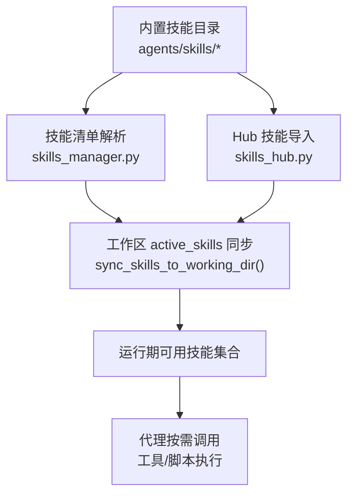
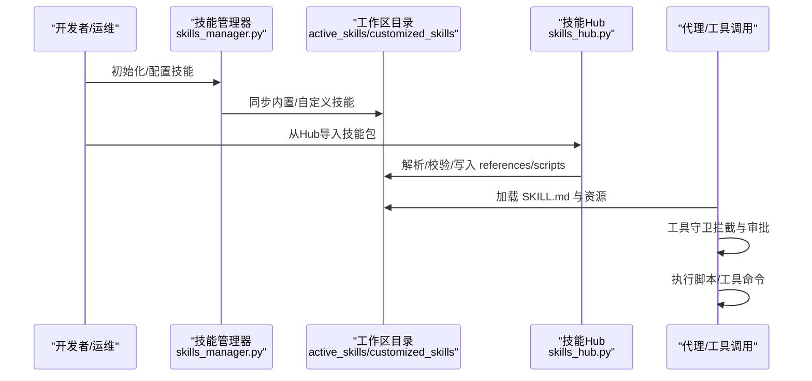
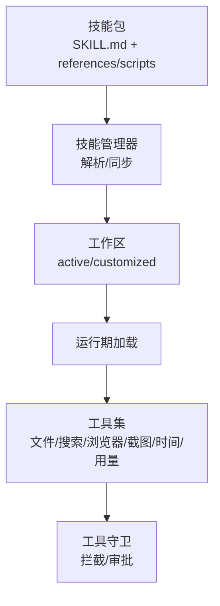

# 内置技能

<cite>
**本文引用的文件**
- [skills_hub.py](file://src/copaw/agents/skills_hub.py)
- [skills_manager.py](file://src/copaw/agents/skills_manager.py)
- [tool_guard_mixin.py](file://src/copaw/agents/tool_guard_mixin.py)
- [tools/__init__.py](file://src/copaw/agents/tools/__init__.py)
- [pdf/SKILL.md](file://src/copaw/agents/skills/pdf/SKILL.md)
- [docx/SKILL.md](file://src/copaw/agents/skills/docx/SKILL.md)
- [xlsx/SKILL.md](file://src/copaw/agents/skills/xlsx/SKILL.md)
- [pptx/SKILL.md](file://src/copaw/agents/skills/pptx/SKILL.md)
- [news/SKILL.md](file://src/copaw/agents/skills/news/SKILL.md)
- [himalaya/SKILL.md](file://src/copaw/agents/skills/himalaya/SKILL.md)
- [dingtalk_channel/SKILL.md](file://src/copaw/agents/skills/dingtalk_channel/SKILL.md)
- [cron/SKILL.md](file://src/copaw/agents/skills/cron/SKILL.md)
</cite>

## 目录
1. [引言](#引言)
2. [项目结构](#项目结构)
3. [核心组件](#核心组件)
4. [架构总览](#架构总览)
5. [详细组件分析](#详细组件分析)
6. [依赖分析](#依赖分析)
7. [性能考虑](#性能考虑)
8. [故障排查指南](#故障排查指南)
9. [结论](#结论)
10. [附录](#附录)

## 引言
本文件系统化梳理 CoPaw 的内置技能体系，覆盖文档处理（PDF、DOCX、XLSX、PPTX）、系统工具（文件搜索、浏览器控制、截图）、通信（钉钉渠道、定时任务）、信息获取（新闻聚合、播客 Himalaya）等能力。文档面向使用者与开发者，提供技能功能特性、输入输出、依赖与安全限制、使用示例与最佳实践、版本管理与更新机制，以及扩展开发规范。

## 项目结构
CoPaw 的内置技能以“技能包”形式组织，每个技能包包含一个 SKILL.md 描述文件及可选的 references/scripts 子目录。技能生命周期由技能管理器统一同步至工作区 active_skills 目录，并在运行期被代理按需加载与执行。

图表来源
- [skills_manager.py](file://src/copaw/agents/skills_manager.py)
- [skills_hub.py](file://src/copaw/agents/skills_hub.py)

章节来源
- [skills_manager.py](file://src/copaw/agents/skills_manager.py)
- [skills_hub.py](file://src/copaw/agents/skills_hub.py)

## 核心组件
- 技能管理器：负责扫描内置与自定义技能、构建技能树、同步到 active_skills、列出可用技能、创建新技能等。
- 技能 Hub：支持从外部 Hub 源拉取技能包，校验与解压，注入 references/scripts/assets。
- 工具守卫：在代理执行工具前进行敏感工具拦截与审批流控制，保障安全。
- 工具集：封装常用系统级能力（文件 IO、搜索、浏览器、截图、时间、用量统计等），供技能脚本与工具链复用。

章节来源
- [skills_manager.py](file://src/copaw/agents/skills_manager.py)
- [skills_hub.py](file://src/copaw/agents/skills_hub.py)
- [tool_guard_mixin.py](file://src/copaw/agents/tool_guard_mixin.py)
- [tools/__init__.py](file://src/copaw/agents/tools/__init__.py)

## 架构总览
内置技能的全生命周期包括：内置技能打包、自定义覆盖、工作区同步、运行期加载、工具调用与安全守卫、Hub 导入与版本管理。

图表来源
- [skills_manager.py](file://src/copaw/agents/skills_manager.py)
- [skills_hub.py](file://src/copaw/agents/skills_hub.py)

## 详细组件分析

### 办公文档处理技能

#### PDF 处理技能（pdf）
- 功能要点
  - 文本/表格提取、元数据读取、合并/拆分、旋转、加水印、创建 PDF、表单填充、加密/解密、OCR、图片提取等。
  - 提供 Python 库（pypdf、pdfplumber、reportlab）与命令行工具（pdftotext、qpdf、pdftk）双路径。
- 输入输出
  - 输入：PDF 文件路径、命令行参数、脚本参数。
  - 输出：文本/表格结果、新生成的 PDF、图片、加密/解密后的文件。
- 依赖要求
  - Python 包：pypdf、pdfplumber、reportlab、pdftotext、pdftoppm、qpdf。
  - 可选：OCR（pytesseract + pdf2image）。
- 安全限制
  - 注意对受保护 PDF 的解密与再加密流程，避免信息泄露。
- 使用示例与最佳实践
  - 使用 pypdf 合并多份 PDF；用 pdfplumber 提取表格并导出为 Excel；用 reportlab 生成报告；用 qpdf 执行批量旋转/拆分。
- 版本管理
  - SKILL.md 中包含内置版本号，随内置技能升级而更新。

章节来源
- [pdf/SKILL.md](file://src/copaw/agents/skills/pdf/SKILL.md)

#### DOCX 处理技能（docx）
- 功能要点
  - 新建/编辑 Word 文档、转换 .doc 至 .docx、提取内容（含修订跟踪）、插入/替换图片、接受修订、导出为 PDF/图像。
- 输入输出
  - 输入：.doc/.docx、模板、脚本参数。
  - 输出：.docx、Markdown、PDF、图像。
- 依赖要求
  - npm：docx（JS 库）；LibreOffice：soffice；pandoc：文本提取；pdftoppm：文档转图像。
- 安全限制
  - 严格遵循 XML 结构与样式覆盖规则，避免破坏文档结构。
- 使用示例与最佳实践
  - 使用 docx-js 生成专业文档；通过 unpack/pack 流程编辑现有文档；使用 accept_changes.py 清理修订。
- 版本管理
  - SKILL.md 中包含内置版本号。

章节来源
- [docx/SKILL.md](file://src/copaw/agents/skills/docx/SKILL.md)

#### XLSX 处理技能（xlsx）
- 功能要点
  - 读取/分析表格数据（pandas）、创建/编辑 Excel（openpyxl）、公式计算与验证（LibreOffice recalc）、颜色与格式标准、财务模型规范。
- 输入输出
  - 输入：.xlsx/.xlsm/.csv/.tsv、模板、脚本参数。
  - 输出：Excel 文件、错误诊断 JSON。
- 依赖要求
  - openpyxl、pandas、LibreOffice（soffice）。
- 安全限制
  - 严禁硬编码计算值，必须使用公式；确保无 #REF!/#DIV/0! 等错误。
- 使用示例与最佳实践
  - 先用 pandas 分析，再用 openpyxl 写入格式与公式；务必执行 scripts/recalc.py 进行公式重算与错误检查。
- 版本管理
  - SKILL.md 中包含内置版本号。

章节来源
- [xlsx/SKILL.md](file://src/copaw/agents/skills/xlsx/SKILL.md)

#### PPTX 处理技能（pptx）
- 功能要点
  - 读取/解析演示文稿、编辑/创建幻灯片、缩略图生成、设计配色与排版建议、QA 流程。
- 输入输出
  - 输入：.pptx、模板、脚本参数。
  - 输出：.pptx、缩略图、可视化检查结果。
- 依赖要求
  - markitdown[pptx]、Pillow、pptxgenjs、LibreOffice、pdftoppm。
- 安全限制
  - 避免重复布局、低对比度、文本溢出等常见问题。
- 使用示例与最佳实践
  - 使用 thumbnail.py 获取视觉概览；按设计建议生成配色与版式；通过 QA 流程反复修正。
- 版本管理
  - SKILL.md 中包含内置版本号。

章节来源
- [pptx/SKILL.md](file://src/copaw/agents/skills/pptx/SKILL.md)

### 系统工具技能

#### 文件搜索与读写（file_io、file_search）
- 功能要点
  - 文本/二进制文件读取、写入、追加、编辑；支持通配符与正则搜索。
- 输入输出
  - 输入：文件路径、搜索条件、写入内容。
  - 输出：文件内容、匹配结果列表。
- 依赖要求
  - 系统文件系统访问权限。
- 安全限制
  - 严格限制路径遍历与危险路径写入。
- 使用示例与最佳实践
  - 使用 glob/grep 搜索日志文件；对敏感文件采用只读模式；大文件分块读取。

章节来源
- [tools/__init__.py](file://src/copaw/agents/tools/__init__.py)

#### 浏览器控制与截图（browser_control、browser_snapshot、desktop_screenshot）
- 功能要点
  - 可视浏览器启动、页面打开、快照、元素交互；桌面截图。
- 输入输出
  - 输入：URL、页面选择器、截图参数。
  - 输出：页面内容/截图文件。
- 依赖要求
  - 可视浏览器环境（headless/headed）。
- 安全限制
  - 仅在受控会话内执行，避免访问敏感站点。
- 使用示例与最佳实践
  - 先 open 页面，再 snapshot；对动态内容等待稳定后再截图。

章节来源
- [tools/__init__.py](file://src/copaw/agents/tools/__init__.py)

#### 时间与时区（get_current_time、set_user_timezone）
- 功能要点
  - 获取当前时间、设置用户时区。
- 输入输出
  - 输入：时区标识。
  - 输出：格式化时间字符串。
- 依赖要求
  - 系统时钟与时区配置。
- 安全限制
  - 仅读取，不写入系统时钟。

章节来源
- [tools/__init__.py](file://src/copaw/agents/tools/__init__.py)

#### 令牌用量统计（get_token_usage）
- 功能要点
  - 查询与统计模型调用用量。
- 输入输出
  - 输出：用量明细与汇总。
- 依赖要求
  - 计费/用量记录服务。
- 安全限制
  - 仅限授权查询。

章节来源
- [tools/__init__.py](file://src/copaw/agents/tools/__init__.py)

### 通信技能

#### 钉钉渠道连接（dingtalk_channel）
- 功能要点
  - 通过可视浏览器自动化完成钉钉应用创建、机器人配置、版本发布与凭证获取；支持登录中断与恢复。
- 输入输出
  - 输入：用户自定义应用名/描述/图片、目标频道、会话标识。
  - 输出：Client ID/Client Secret 凭证与绑定指引。
- 依赖要求
  - 钉钉开发者后台、浏览器环境、图片上传。
- 安全限制
  - 凭证仅展示不自动写入；需用户手动绑定。
- 使用示例与最佳实践
  - 先进行配置确认，明确图片规范与默认值；上传前先点击触发 chooser；发布后方可生效。
- 版本管理
  - SKILL.md 中包含内置版本号。

章节来源
- [dingtalk_channel/SKILL.md](file://src/copaw/agents/skills/dingtalk_channel/SKILL.md)

#### 定时任务（cron）
- 功能要点
  - 通过 copaw 命令管理定时任务：创建、查询、暂停/恢复、删除、立即执行。
- 输入输出
  - 输入：任务类型（text/agent）、cron 表达式、频道与目标会话、消息内容。
  - 输出：任务 ID、状态、执行结果。
- 依赖要求
  - copaw CLI、通道与会话配置。
- 安全限制
  - 必须显式指定 agent-id，防止误绑定到默认 agent。
- 使用示例与最佳实践
  - 使用 JSON 规范化创建复杂任务；定期检查任务状态与日志。
- 版本管理
  - SKILL.md 中包含内置版本号。

章节来源
- [cron/SKILL.md](file://src/copaw/agents/skills/cron/SKILL.md)

### 信息获取技能

#### 新闻聚合（news）
- 功能要点
  - 从指定中文新闻源抓取最新资讯，使用浏览器打开页面并截图提取标题与摘要。
- 输入输出
  - 输入：新闻类别（政治/金融/社会/世界/科技/体育/娱乐）。
  - 输出：摘要列表与来源链接。
- 依赖要求
  - 浏览器工具与网络访问。
- 安全限制
  - 页面结构变化时需调整快照策略。
- 使用示例与最佳实践
  - 逐类打开页面，snapshot 后提取关键信息；若站点不可达，提示用户改用其他来源。

章节来源
- [news/SKILL.md](file://src/copaw/agents/skills/news/SKILL.md)

#### 播客 Himalaya（himalaya）
- 功能要点
  - 通过 himalaya CLI 管理邮件（列出、读取、搜索、发送、移动、删除、附件下载等），支持多账户与 MML。
- 输入输出
  - 输入：账户配置、命令参数（列表/读取/发送/移动/删除/附件下载）。
  - 输出：邮件列表/正文/原始 MIME、操作结果。
- 依赖要求
  - himalaya CLI、IMAP/SMTP 配置。
- 安全限制
  - 密码存储于安全后端；避免在非交互环境使用会阻塞的命令。
- 使用示例与最佳实践
  - 使用 template write | template send 管道发送带附件的邮件；为 163 邮箱设置必要的扩展配置。
- 版本管理
  - SKILL.md 中包含内置版本号。

章节来源
- [himalaya/SKILL.md](file://src/copaw/agents/skills/himalaya/SKILL.md)

## 依赖分析
- 技能包依赖
  - 每个技能包通过 SKILL.md 声明名称、描述、内置版本号与元数据。
  - references/scripts 子目录存放运行期资源与脚本，由技能管理器统一解析与写入。
- 外部依赖
  - 文档处理：Python 库与命令行工具（poppler-utils、LibreOffice、docx、pptxgenjs 等）。
  - 通信：浏览器、钉钉开发者后台、IMAP/SMTP。
  - 定时任务：copaw CLI。
- 安全依赖
  - 工具守卫对敏感工具进行拦截与审批，防止高危操作。

图表来源
- [skills_manager.py](file://src/copaw/agents/skills_manager.py)
- [tools/__init__.py](file://src/copaw/agents/tools/__init__.py)
- [tool_guard_mixin.py](file://src/copaw/agents/tool_guard_mixin.py)

章节来源
- [skills_manager.py](file://src/copaw/agents/skills_manager.py)
- [tools/__init__.py](file://src/copaw/agents/tools/__init__.py)
- [tool_guard_mixin.py](file://src/copaw/agents/tool_guard_mixin.py)

## 性能考虑
- 技能同步
  - 合并内置与自定义技能时，优先自定义覆盖内置；仅在差异或强制模式下更新，减少不必要的写入。
- 大文件处理
  - PDF/图像/视频等大对象建议分步处理，避免一次性加载内存。
- 并发与超时
  - 浏览器与外部服务调用应设置合理超时与重试策略，避免阻塞。
- 资源清理
  - 临时文件与中间产物及时清理，避免磁盘占用。

## 故障排查指南
- 技能未加载
  - 检查 active_skills 目录是否存在 SKILL.md；确认技能名称与路径合法。
- 依赖缺失
  - 按技能文档安装所需 Python 包或系统工具；Windows 环境需确保 PATH 正确。
- 工具守卫拦截
  - 查看最近一次工具调用的拒绝标记与严重级别；根据审批流程进行批准或修正参数。
- 浏览器异常
  - headless/headed 模式切换；检查页面结构变化导致的选择器失效；必要时重新 snapshot。
- 定时任务异常
  - 使用 copaw cron state 查看状态；核对 agent-id 与 cron 表达式。

章节来源
- [tool_guard_mixin.py](file://src/copaw/agents/tool_guard_mixin.py)
- [skills_manager.py](file://src/copaw/agents/skills_manager.py)
- [cron/SKILL.md](file://src/copaw/agents/skills/cron/SKILL.md)

## 结论
CoPaw 的内置技能体系以“技能包 + 工作区同步 + 运行期加载 + 工具守卫”的架构实现，覆盖办公文档、系统工具、通信与信息获取等高频场景。通过严格的版本管理与安全控制，既保证易用性也兼顾安全性。建议在生产环境中结合工具守卫与最小权限原则，配合 Hub 与自定义技能扩展能力，持续迭代优化。

## 附录

### 技能版本管理与更新机制
- 内置版本号
  - 每个 SKILL.md 的 metadata 中包含内置版本号，用于区分内置技能版本。
- 同步策略
  - 内置技能优先级低于自定义技能；当自定义与内置同名时，自定义覆盖内置。
  - 支持强制同步与差异同步，避免不必要的覆盖。
- Hub 导入
  - 支持从 Hub 拉取技能包，自动解析 references/scripts 并写入工作区。
- 回滚与回退
  - 通过 active_skills 与 customized_skills 的差异比对，可快速回退到上一版本。

章节来源
- [skills_manager.py](file://src/copaw/agents/skills_manager.py)
- [skills_hub.py](file://src/copaw/agents/skills_hub.py)

### 开发规范与扩展指南
- 目录结构
  - 每个技能包包含 SKILL.md 与可选的 references/scripts 子目录。
- SKILL.md 规范
  - 必须包含 name、description、metadata（含内置版本号）。
  - references/scripts 子目录内容将被解析为树形结构写入工作区。
- 安全规范
  - 对高危工具调用启用工具守卫；对文件路径与命令参数进行白名单校验。
- 依赖声明
  - 在 SKILL.md 中声明 Python 包与系统工具依赖；提供安装指引。
- 最佳实践
  - 使用脚本化流程（unpack/pack、recalc、thumbnail 等）提升一致性；
  - 对外部服务调用增加重试与降级策略；
  - 对输出进行质量检查（公式错误、图片合规、页面布局）。

章节来源
- [skills_manager.py](file://src/copaw/agents/skills_manager.py)
- [tool_guard_mixin.py](file://src/copaw/agents/tool_guard_mixin.py)
- [pdf/SKILL.md](file://src/copaw/agents/skills/pdf/SKILL.md)
- [docx/SKILL.md](file://src/copaw/agents/skills/docx/SKILL.md)
- [xlsx/SKILL.md](file://src/copaw/agents/skills/xlsx/SKILL.md)
- [pptx/SKILL.md](file://src/copaw/agents/skills/pptx/SKILL.md)
- [news/SKILL.md](file://src/copaw/agents/skills/news/SKILL.md)
- [himalaya/SKILL.md](file://src/copaw/agents/skills/himalaya/SKILL.md)
- [dingtalk_channel/SKILL.md](file://src/copaw/agents/skills/dingtalk_channel/SKILL.md)
- [cron/SKILL.md](file://src/copaw/agents/skills/cron/SKILL.md)