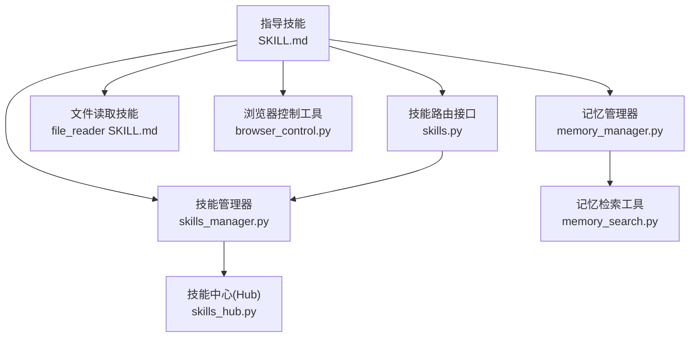
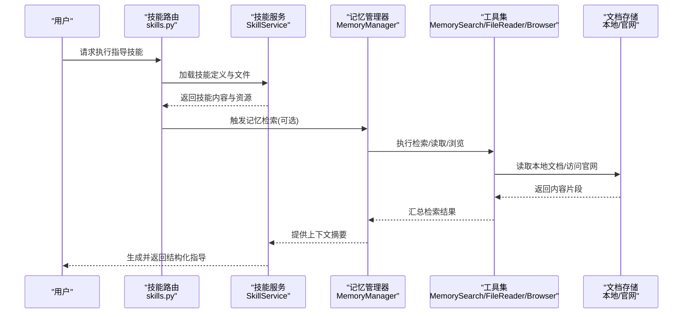
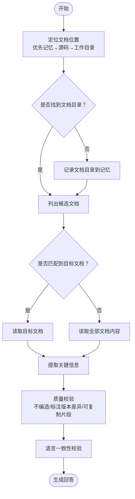
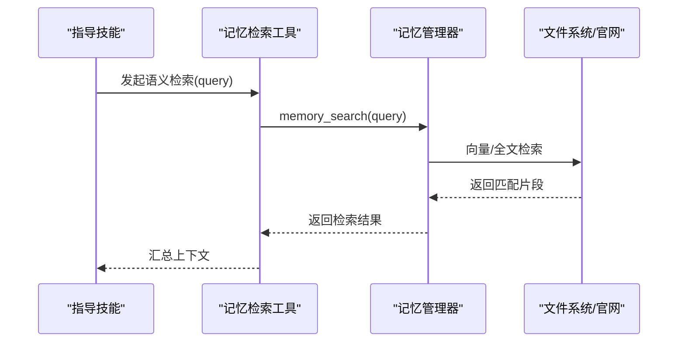
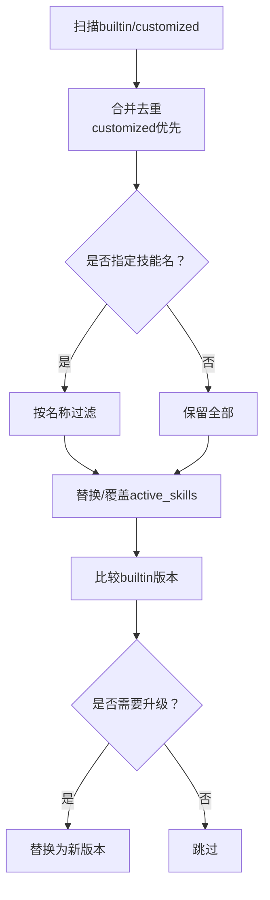
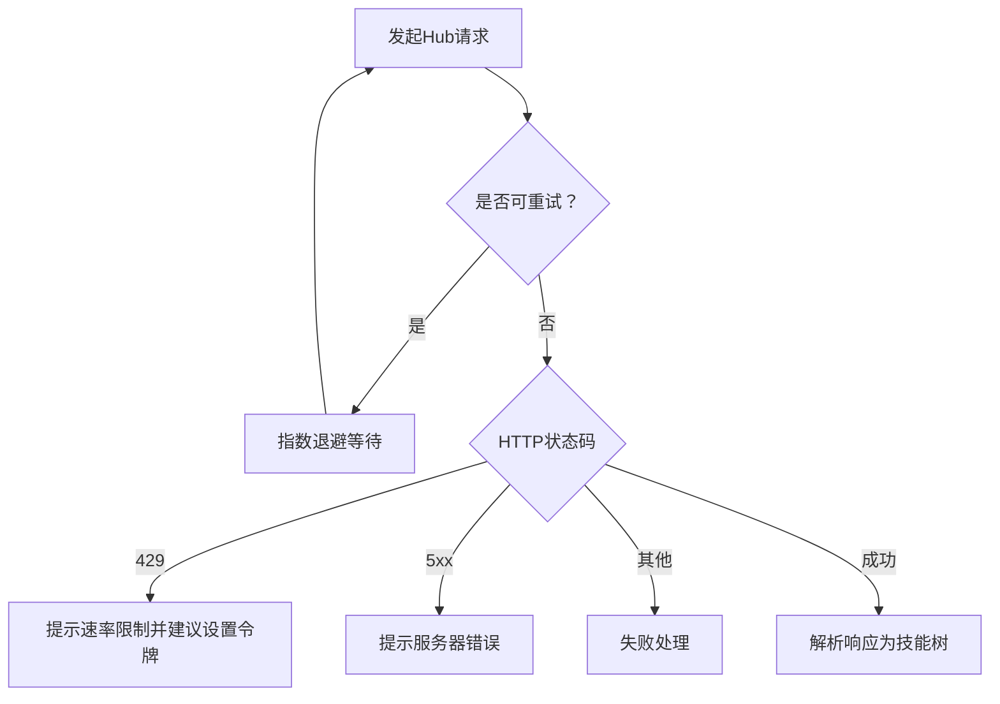
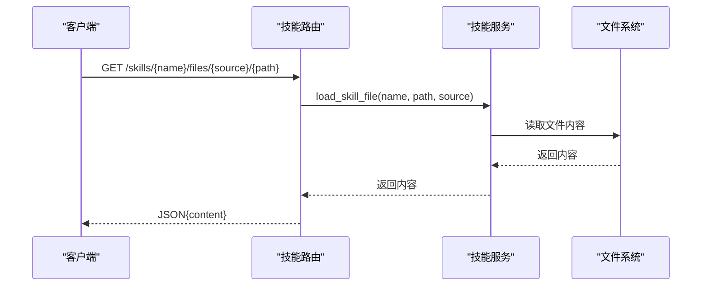
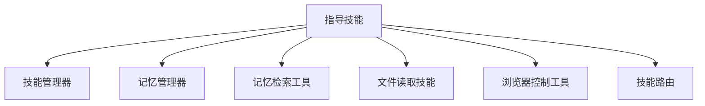

# 指导技能

<cite>
**本文引用的文件**
- [SKILL.md](file://src/copaw/agents/skills/guidance/SKILL.md)
- [skills_hub.py](file://src/copaw/agents/skills_hub.py)
- [skills_manager.py](file://src/copaw/agents/skills_manager.py)
- [memory_manager.py](file://src/copaw/agents/memory/memory_manager.py)
- [memory_search.py](file://src/copaw/agents/tools/memory_search.py)
- [file_reader SKILL.md](file://src/copaw/agents/skills/file_reader/SKILL.md)
- [browser_control.py](file://src/copaw/agents/tools/browser_control.py)
- [skills.py](file://src/copaw/app/routers/skills.py)
- [memory.zh.md](file://website/public/docs/memory.zh.md)
</cite>

## 目录
1. [简介](#简介)
2. [项目结构](#项目结构)
3. [核心组件](#核心组件)
4. [架构总览](#架构总览)
5. [详细组件分析](#详细组件分析)
6. [依赖关系分析](#依赖关系分析)
7. [性能考量](#性能考量)
8. [故障排查指南](#故障排查指南)
9. [结论](#结论)
10. [附录](#附录)

## 简介
指导技能（guidance）是CoPaw内置的一类智能问答技能，专注于回答用户关于安装、初始化、环境配置、依赖要求与常见配置项的问题。其核心设计原则是“先查本地文档，再回答”，确保答案基于真实、可追溯的信息来源；当本地信息不足时，会回退到官网文档兜底，并明确标注信息来源。

指导技能通过标准化流程实现“定位文档—检索匹配—阅读内容—提取要点—生成回答”的闭环，支持多语言输出，严格遵循“不臆测、不编造”的质量准则，并在必要时提示用户补充缺失信息（如操作系统类型、安装方式、错误日志等）。

## 项目结构
指导技能位于内置技能目录下，配套有技能管理器、技能中心（Hub）以及与记忆系统、文件读取、浏览器控制等工具的集成点。下图展示了与指导技能相关的关键模块及其交互关系。

**图表来源**
- [SKILL.md](file://src/copaw/agents/skills/guidance/SKILL.md)
- [skills_manager.py](file://src/copaw/agents/skills_manager.py)
- [skills_hub.py](file://src/copaw/agents/skills_hub.py)
- [memory_manager.py](file://src/copaw/agents/memory/memory_manager.py)
- [memory_search.py](file://src/copaw/agents/tools/memory_search.py)
- [file_reader SKILL.md](file://src/copaw/agents/skills/file_reader/SKILL.md)
- [browser_control.py](file://src/copaw/agents/tools/browser_control.py)
- [skills.py](file://src/copaw/app/routers/skills.py)

**章节来源**
- [SKILL.md](file://src/copaw/agents/skills/guidance/SKILL.md)
- [skills_manager.py](file://src/copaw/agents/skills_manager.py)
- [skills_hub.py](file://src/copaw/agents/skills_hub.py)
- [memory_manager.py](file://src/copaw/agents/memory/memory_manager.py)
- [memory_search.py](file://src/copaw/agents/tools/memory_search.py)
- [file_reader SKILL.md](file://src/copaw/agents/skills/file_reader/SKILL.md)
- [browser_control.py](file://src/copaw/agents/tools/browser_control.py)
- [skills.py](file://src/copaw/app/routers/skills.py)

## 核心组件
- 指导技能定义与流程规范
  - 指导技能通过SKILL.md定义名称、描述、元数据与标准流程，强调“先本地、后官网”的检索策略与“可复制”的输出规范。
  - 关键流程包括：定位文档位置、文档检索与匹配、阅读与摘要、提取要点与语言一致性、官网兜底与质量要求。
  - 参考：[SKILL.md](file://src/copaw/agents/skills/guidance/SKILL.md)

- 技能管理与同步
  - 技能管理器负责内置与自定义技能的收集、去重、同步与版本比较，确保active_skills目录始终包含最新且可覆盖的技能树。
  - 支持从builtin与customized目录合并，自定义覆盖内置同名技能；同时支持将active变更回写至customized，便于版本升级与持久化。
  - 参考：[skills_manager.py](file://src/copaw/agents/skills_manager.py)

- 技能中心（Hub）与网络能力
  - 技能中心提供统一的搜索、详情、版本与文件下载接口，支持超时、重试、指数退避与速率限制处理，保障网络稳定性与安全性。
  - 支持从Hub拉取技能包并解析为本地技能树，含references与scripts子树的归一化处理。
  - 参考：[skills_hub.py](file://src/copaw/agents/skills_hub.py)

- 记忆系统与检索
  - 记忆管理器基于ReMeLight扩展，提供消息压缩、总结、向量+全文检索等能力；记忆检索工具封装为可注册的工具函数，便于在技能流程中调用。
  - 参考：[memory_manager.py](file://src/copaw/agents/memory/memory_manager.py)、[memory_search.py](file://src/copaw/agents/tools/memory_search.py)

- 文件读取与浏览器控制
  - 文件读取技能用于读取与摘要文本类文件，适合在指导技能中读取本地文档；浏览器控制工具提供网页自动化能力，可用于官网兜底场景。
  - 参考：[file_reader SKILL.md](file://src/copaw/agents/skills/file_reader/SKILL.md)、[browser_control.py](file://src/copaw/agents/tools/browser_control.py)

- 技能路由与加载
  - 技能路由提供按名称与来源（builtin/customized）加载技能内文件的能力，便于在运行时动态读取references/scripts资源。
  - 参考：[skills.py](file://src/copaw/app/routers/skills.py)

**章节来源**
- [SKILL.md](file://src/copaw/agents/skills/guidance/SKILL.md)
- [skills_manager.py](file://src/copaw/agents/skills_manager.py)
- [skills_hub.py](file://src/copaw/agents/skills_hub.py)
- [memory_manager.py](file://src/copaw/agents/memory/memory_manager.py)
- [memory_search.py](file://src/copaw/agents/tools/memory_search.py)
- [file_reader SKILL.md](file://src/copaw/agents/skills/file_reader/SKILL.md)
- [browser_control.py](file://src/copaw/agents/tools/browser_control.py)
- [skills.py](file://src/copaw/app/routers/skills.py)

## 架构总览
指导技能的运行架构围绕“技能定义—技能管理—知识检索—工具调用—结果生成”展开。下图展示了端到端的数据流与控制流。

**图表来源**
- [skills.py](file://src/copaw/app/routers/skills.py)
- [skills_manager.py](file://src/copaw/agents/skills_manager.py)
- [memory_manager.py](file://src/copaw/agents/memory/memory_manager.py)
- [memory_search.py](file://src/copaw/agents/tools/memory_search.py)
- [file_reader SKILL.md](file://src/copaw/agents/skills/file_reader/SKILL.md)
- [browser_control.py](file://src/copaw/agents/tools/browser_control.py)

## 详细组件分析

### 指导技能流程与推理机制
指导技能采用“先本地、后官网”的两阶段检索策略，结合记忆检索与文件读取工具，形成可解释、可追溯的知识抽取链路。流程要点如下：

- 文档定位
  - 优先从记忆中检索“文档目录”；若未找到，回退到项目源码根目录与工作目录进行特征文件搜索，最终将文档目录写入记忆。
  - 参考：[SKILL.md](file://src/copaw/agents/skills/guidance/SKILL.md)

- 文档检索与匹配
  - 基于文件命名规范（如topic.lang.md）进行筛选，优先匹配与问题相关的主题词，未命中时进入全文阅读阶段。
  - 参考：[SKILL.md](file://src/copaw/agents/skills/guidance/SKILL.md)

- 内容阅读与摘要
  - 对候选文档进行内容读取与关键段落抽取，优先关注安装步骤、配置项、示例命令、注意事项与版本要求。
  - 参考：[SKILL.md](file://src/copaw/agents/skills/guidance/SKILL.md)

- 结果生成与语言一致性
  - 先给出直接结论与步骤/命令/配置示例，再补充前置条件与常见坑；输出语言与用户提问保持一致。
  - 参考：[SKILL.md](file://src/copaw/agents/skills/guidance/SKILL.md)

- 官网兜底与质量要求
  - 当本地文档缺失或信息不足时，访问官网作为兜底，并在答案中标注信息来源；严格避免编造配置项与命令。
  - 参考：[SKILL.md](file://src/copaw/agents/skills/guidance/SKILL.md)

**图表来源**
- [SKILL.md](file://src/copaw/agents/skills/guidance/SKILL.md)

**章节来源**
- [SKILL.md](file://src/copaw/agents/skills/guidance/SKILL.md)

### 记忆检索与工具集成
指导技能可借助记忆检索工具在历史对话与知识片段中召回相关内容，提升回答的上下文相关性与准确性。

- 记忆检索工具
  - 将查询语义化映射到向量空间，结合BM25全文检索，返回带路径与行号的相关片段。
  - 参考：[memory_search.py](file://src/copaw/agents/tools/memory_search.py)、[memory.zh.md](file://website/public/docs/memory.zh.md)

- 记忆管理器
  - 提供消息压缩、总结与检索接口，支持向量与全文检索混合模式，具备可热加载的嵌入模型配置。
  - 参考：[memory_manager.py](file://src/copaw/agents/memory/memory_manager.py)

**图表来源**
- [memory_search.py](file://src/copaw/agents/tools/memory_search.py)
- [memory_manager.py](file://src/copaw/agents/memory/memory_manager.py)
- [memory.zh.md](file://website/public/docs/memory.zh.md)

**章节来源**
- [memory_search.py](file://src/copaw/agents/tools/memory_search.py)
- [memory_manager.py](file://src/copaw/agents/memory/memory_manager.py)
- [memory.zh.md](file://website/public/docs/memory.zh.md)

### 技能管理与版本控制
指导技能作为内置技能，由技能管理器负责扫描、同步与版本比较，确保active_skills目录始终包含最新版本；同时支持自定义覆盖与回写。

- 同步策略
  - builtin与customized目录合并，customized覆盖builtin同名技能；支持按名称过滤与强制覆盖。
  - 参考：[skills_manager.py](file://src/copaw/agents/skills_manager.py)

- 版本比较与升级
  - 读取SKILL.md中的builtin_skill_version，比较builtin与active版本，自动升级active技能。
  - 参考：[skills_manager.py](file://src/copaw/agents/skills_manager.py)

**图表来源**
- [skills_manager.py](file://src/copaw/agents/skills_manager.py)

**章节来源**
- [skills_manager.py](file://src/copaw/agents/skills_manager.py)

### 技能中心（Hub）与网络稳定性
当需要从Hub导入或更新技能时，技能中心提供统一的HTTP请求封装，包含超时、重试、指数退避与速率限制处理，确保网络异常下的稳健性。

- 关键特性
  - 超时与重试参数可配置；对429/5xx等状态码进行分级处理与用户提示。
  - 支持从Hub拉取技能包并解析为本地技能树，含references与scripts子树的归一化。
  - 参考：[skills_hub.py](file://src/copaw/agents/skills_hub.py)

**图表来源**
- [skills_hub.py](file://src/copaw/agents/skills_hub.py)

**章节来源**
- [skills_hub.py](file://src/copaw/agents/skills_hub.py)

### 技能路由与动态资源加载
技能路由提供按名称与来源（builtin/customized）加载技能内文件的能力，便于在运行时动态读取references/scripts资源，支撑指导技能的上下文增强。

- 路由行为
  - 支持加载references与scripts下的任意相对路径文件，返回文件内容字符串。
  - 参考：[skills.py](file://src/copaw/app/routers/skills.py)

**图表来源**
- [skills.py](file://src/copaw/app/routers/skills.py)

**章节来源**
- [skills.py](file://src/copaw/app/routers/skills.py)

## 依赖关系分析
指导技能在运行期依赖以下模块与工具：
- 技能管理器：提供技能扫描、合并、同步与版本比较能力
- 记忆管理器与检索工具：提供语义检索与上下文摘要能力
- 文件读取技能：提供文本类文件的读取与摘要能力
- 浏览器控制工具：提供网页自动化与官网兜底能力
- 技能路由：提供动态资源加载能力

**图表来源**
- [skills_manager.py](file://src/copaw/agents/skills_manager.py)
- [memory_manager.py](file://src/copaw/agents/memory/memory_manager.py)
- [memory_search.py](file://src/copaw/agents/tools/memory_search.py)
- [file_reader SKILL.md](file://src/copaw/agents/skills/file_reader/SKILL.md)
- [browser_control.py](file://src/copaw/agents/tools/browser_control.py)
- [skills.py](file://src/copaw/app/routers/skills.py)

**章节来源**
- [skills_manager.py](file://src/copaw/agents/skills_manager.py)
- [memory_manager.py](file://src/copaw/agents/memory/memory_manager.py)
- [memory_search.py](file://src/copaw/agents/tools/memory_search.py)
- [file_reader SKILL.md](file://src/copaw/agents/skills/file_reader/SKILL.md)
- [browser_control.py](file://src/copaw/agents/tools/browser_control.py)
- [skills.py](file://src/copaw/app/routers/skills.py)

## 性能考量
- 检索效率
  - 记忆检索采用向量+BM25混合策略，兼顾语义相关性与精确匹配；合理设置max_results与min_score可平衡召回与性能。
  - 参考：[memory.zh.md](file://website/public/docs/memory.zh.md)

- I/O与缓存
  - 记忆管理器支持嵌入模型的缓存配置与维度参数，有助于降低重复计算开销。
  - 参考：[memory_manager.py](file://src/copaw/agents/memory/memory_manager.py)

- 网络稳定性
  - 技能中心对HTTP错误进行分级处理与指数退避，避免频繁重试导致的资源浪费。
  - 参考：[skills_hub.py](file://src/copaw/agents/skills_hub.py)

## 故障排查指南
- 记忆检索不可用
  - 若ReMe未启动，记忆检索会返回错误提示；请检查记忆管理器初始化与启动状态。
  - 参考：[memory_manager.py](file://src/copaw/agents/memory/memory_manager.py)

- 记忆检索失败
  - 检查网络连通性与嵌入模型配置；必要时调整FTS开关与内存后端。
  - 参考：[memory_manager.py](file://src/copaw/agents/memory/memory_manager.py)

- 技能未加载或版本落后
  - 确认active_skills目录存在且包含目标技能；如builtin版本更高，系统会自动升级。
  - 参考：[skills_manager.py](file://src/copaw/agents/skills_manager.py)

- 技能路由返回空内容
  - 检查技能名称、来源与文件路径是否正确；确保references/scripts子树存在对应文件。
  - 参考：[skills.py](file://src/copaw/app/routers/skills.py)

**章节来源**
- [memory_manager.py](file://src/copaw/agents/memory/memory_manager.py)
- [skills_manager.py](file://src/copaw/agents/skills_manager.py)
- [skills.py](file://src/copaw/app/routers/skills.py)

## 结论
指导技能通过“先本地、后官网”的检索策略与“可解释、可追溯”的知识抽取链路，为用户提供高质量、可复制的安装与配置指导。配合记忆检索、文件读取与浏览器控制等工具，指导技能能够在复杂场景中实现精准定位与高效回答。技能管理器与技能中心（Hub）进一步保障了技能的版本一致性与网络稳定性，为持续演进提供了基础。

## 附录
- 使用示例（场景化）
  - 场景A：用户询问安装方式与依赖要求
    - 指导技能优先定位安装与环境配置文档，提取步骤与依赖清单，必要时回退官网说明。
  - 场景B：用户遇到配置项冲突
    - 指导技能结合记忆检索召回历史讨论，对比当前文档版本，给出兼容性建议与迁移步骤。
  - 场景C：用户希望获取可复制的命令示例
    - 指导技能在结论后提供可直接粘贴的命令片段，并标注前置条件与常见陷阱。

- 配置方法与更新机制
  - 初始化与配置：通过copaw init或copaw skills config完成技能初始化与配置。
  - 更新机制：builtin版本高于active时自动升级；自定义覆盖builtin同名技能，变更后回写至customized目录。
  - 参考：[skills_manager.py](file://src/copaw/agents/skills_manager.py)

- 效果评估与质量保证
  - 质量要求：不编造配置项与命令；版本差异需明确标注；信息不足时明确缺口并引导用户提供更多信息。
  - 知识时效性：通过builtin版本字段与Hub升级机制保障技能内容的及时更新。
  - 用户体验优化：提供多语言输出、可复制片段与清晰的前置条件说明，减少二次沟通成本。
  - 参考：[SKILL.md](file://src/copaw/agents/skills/guidance/SKILL.md)