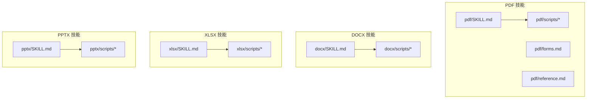
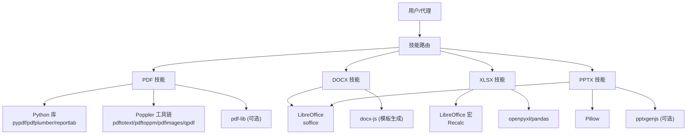
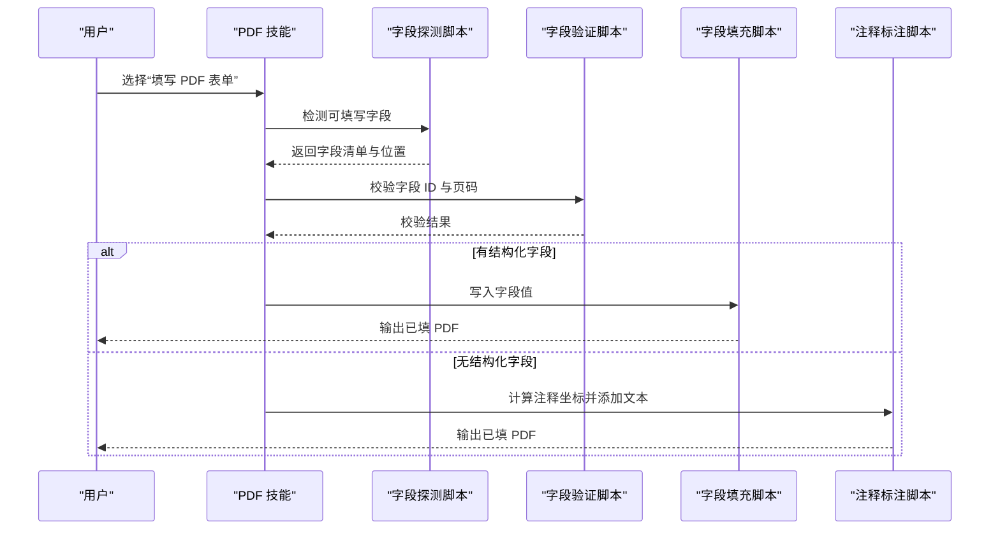
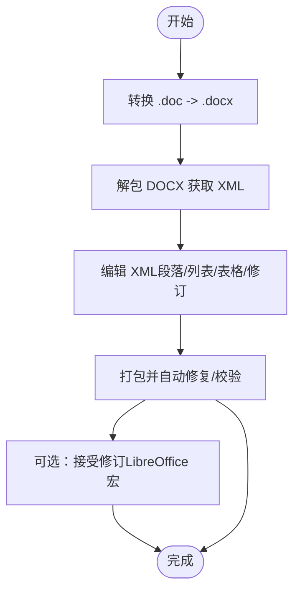
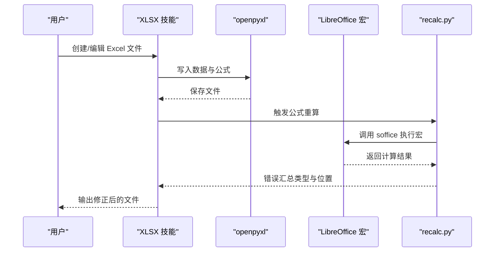
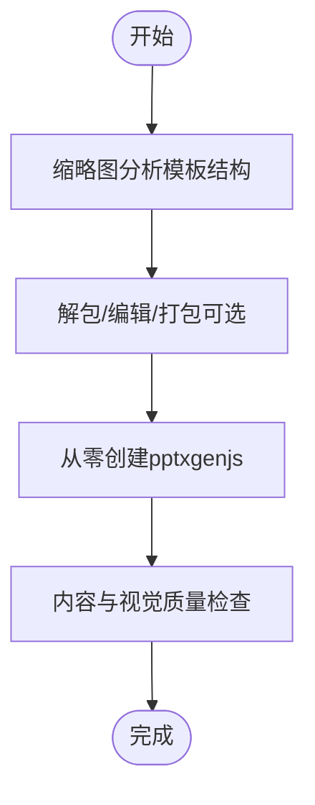
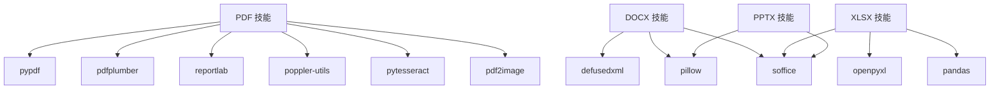

# 文档处理技能

<cite>
**本文引用的文件**
- [pdf/SKILL.md](file://src/copaw/agents/skills/pdf/SKILL.md)
- [pdf/forms.md](file://src/copaw/agents/skills/pdf/forms.md)
- [pdf/reference.md](file://src/copaw/agents/skills/pdf/reference.md)
- [pdf/scripts/extract_form_field_info.py](file://src/copaw/agents/skills/pdf/scripts/extract_form_field_info.py)
- [pdf/scripts/fill_fillable_fields.py](file://src/copaw/agents/skills/pdf/scripts/fill_fillable_fields.py)
- [pdf/scripts/fill_pdf_form_with_annotations.py](file://src/copaw/agents/skills/pdf/scripts/fill_pdf_form_with_annotations.py)
- [pdf/scripts/check_fillable_fields.py](file://src/copaw/agents/skills/pdf/scripts/check_fillable_fields.py)
- [docx/SKILL.md](file://src/copaw/agents/skills/docx/SKILL.md)
- [docx/scripts/office/soffice.py](file://src/copaw/agents/skills/docx/scripts/office/soffice.py)
- [docx/scripts/accept_changes.py](file://src/copaw/agents/skills/docx/scripts/accept_changes.py)
- [docx/scripts/office/unpack.py](file://src/copaw/agents/skills/docx/scripts/office/unpack.py)
- [docx/scripts/office/pack.py](file://src/copaw/agents/skills/docx/scripts/office/pack.py)
- [xlsx/SKILL.md](file://src/copaw/agents/skills/xlsx/SKILL.md)
- [xlsx/scripts/recalc.py](file://src/copaw/agents/skills/xlsx/scripts/recalc.py)
- [pptx/SKILL.md](file://src/copaw/agents/skills/pptx/SKILL.md)
- [pptx/scripts/thumbnail.py](file://src/copaw/agents/skills/pptx/scripts/thumbnail.py)
</cite>

## 目录
1. [简介](#简介)
2. [项目结构](#项目结构)
3. [核心组件](#核心组件)
4. [架构总览](#架构总览)
5. [详细组件分析](#详细组件分析)
6. [依赖关系分析](#依赖关系分析)
7. [性能考量](#性能考量)
8. [故障排查指南](#故障排查指南)
9. [结论](#结论)
10. [附录](#附录)

## 简介
本文件系统性梳理 CoPaw 的文档处理技能，覆盖 PDF、DOCX、XLSX、PPTX 四类常用办公文档的处理能力与使用方法。内容包括：
- 功能特性：文本提取、表格抽取、表单填写、格式转换、内容验证、公式重算、可视化缩略图等
- 使用场景：批量处理、模板化生成、跨格式转换、自动化报表与演示文稿制作
- 操作方法：命令行脚本、Python 脚本、JavaScript 库（pdf-lib）、LibreOffice 驱动
- 依赖要求：Python 库、Poppler 工具链、LibreOffice、Node.js 生态（docx、pptxgenjs）
- 性能与安全：内存分块、图像分辨率控制、沙箱与权限限制
- 常见问题与最佳实践：公式错误、坐标系转换、XML 校验、宏配置

## 项目结构
CoPaw 将每个文档类型封装为独立“技能”目录，内含：
- 技能说明文档（SKILL.md）：概述能力、前置条件、快速参考
- 脚本目录（scripts/）：具体实现逻辑，如 PDF 表单字段提取与填写、DOCX 打包解包、XLSX 公式重算、PPTX 缩略图生成
- 参考与表单指南（reference.md、forms.md）：高级用法、坐标转换、复杂工作流

**图表来源**
- [pdf/SKILL.md](file://src/copaw/agents/skills/pdf/SKILL.md)
- [docx/SKILL.md](file://src/copaw/agents/skills/docx/SKILL.md)
- [xlsx/SKILL.md](file://src/copaw/agents/skills/xlsx/SKILL.md)
- [pptx/SKILL.md](file://src/copaw/agents/skills/pptx/SKILL.md)

**章节来源**
- [pdf/SKILL.md](file://src/copaw/agents/skills/pdf/SKILL.md)
- [docx/SKILL.md](file://src/copaw/agents/skills/docx/SKILL.md)
- [xlsx/SKILL.md](file://src/copaw/agents/skills/xlsx/SKILL.md)
- [pptx/SKILL.md](file://src/copaw/agents/skills/pptx/SKILL.md)

## 核心组件
- PDF 技能：文本/表格提取、合并/拆分、旋转、加水印、创建 PDF、OCR 扫描版、表单填写（结构化字段与注释标注）
- DOCX 技能：DOC/DOCX 转换、内容读取、编辑与打包、接受修订、docx-js 模板生成、页面尺寸与样式规范
- XLSX 技能：数据读写与分析、公式构建、格式化、公式重算（LibreOffice 驱动）、错误检测与修复
- PPTX 技能：内容读取、模板分析、缩略图生成、从零创建（pptxgenjs）、设计规范与质量检查

**章节来源**
- [pdf/SKILL.md](file://src/copaw/agents/skills/pdf/SKILL.md)
- [docx/SKILL.md](file://src/copaw/agents/skills/docx/SKILL.md)
- [xlsx/SKILL.md](file://src/copaw/agents/skills/xlsx/SKILL.md)
- [pptx/SKILL.md](file://src/copaw/agents/skills/pptx/SKILL.md)

## 架构总览
各技能通过统一的脚本接口调用底层工具链：
- Python 库：pypdf、pdfplumber、reportlab、openpyxl、pandas、pillow、pdf2image、pytesseract
- 命令行工具：poppler-utils（pdftotext、pdftoppm、pdfimages、qpdf）、LibreOffice（soffice）
- JavaScript 生态：docx（docx-js）、pptxgenjs、pdf-lib（用于浏览器端或 Node 环境）

**图表来源**
- [pdf/SKILL.md](file://src/copaw/agents/skills/pdf/SKILL.md)
- [docx/SKILL.md](file://src/copaw/agents/skills/docx/SKILL.md)
- [xlsx/SKILL.md](file://src/copaw/agents/skills/xlsx/SKILL.md)
- [pptx/SKILL.md](file://src/copaw/agents/skills/pptx/SKILL.md)

## 详细组件分析

### PDF 技能
- 处理能力
  - 文本与表格提取：pdfplumber 提取布局文本与表格；pypdf 提供基础读写
  - 合并与拆分、旋转、加水印、加密/解密：pypdf、qpdf
  - 创建 PDF：reportlab
  - OCR 扫描版 PDF：pdf2image + pytesseract
  - 表单填写：两种路径
    - 结构化字段：先探测可填写字段，再按字段值填充
    - 注释标注：基于结构或视觉估计，将文本以 FreeText 注解形式叠加到 PDF
- 使用示例
  - 判断是否可填写字段并执行相应流程
  - 使用结构提取坐标，校验边界框后批量填写
  - 对无结构字段的扫描版 PDF，采用图像放大精确定位后标注
- 关键脚本
  - 字段探测与信息导出：[extract_form_field_info.py](file://src/copaw/agents/skills/pdf/scripts/extract_form_field_info.py)
  - 结构化字段填充：[fill_fillable_fields.py](file://src/copaw/agents/skills/pdf/scripts/fill_fillable_fields.py)
  - 注释标注填充：[fill_pdf_form_with_annotations.py](file://src/copaw/agents/skills/pdf/scripts/fill_pdf_form_with_annotations.py)
  - 可填写字段检测：[check_fillable_fields.py](file://src/copaw/agents/skills/pdf/scripts/check_fillable_fields.py)
- 依赖与前置条件
  - Python 库：pypdf、pdfplumber、reportlab、pandas（表格合并）、pytesseract、pdf2image
  - 命令行：pdftotext、pdftoppm、pdfimages、qpdf
  - 可选：pdf-lib（浏览器/Node 环境）
- 性能与安全
  - 大文件建议分页处理，避免一次性加载
  - OCR 仅在需要时启用，控制分辨率与页数
  - 注意字段类型与状态值（复选框勾选/未勾选值），避免无效值导致失败

**图表来源**
- [pdf/scripts/extract_form_field_info.py](file://src/copaw/agents/skills/pdf/scripts/extract_form_field_info.py)
- [pdf/scripts/check_fillable_fields.py](file://src/copaw/agents/skills/pdf/scripts/check_fillable_fields.py)
- [pdf/scripts/fill_fillable_fields.py](file://src/copaw/agents/skills/pdf/scripts/fill_fillable_fields.py)
- [pdf/scripts/fill_pdf_form_with_annotations.py](file://src/copaw/agents/skills/pdf/scripts/fill_pdf_form_with_annotations.py)

**章节来源**
- [pdf/SKILL.md](file://src/copaw/agents/skills/pdf/SKILL.md)
- [pdf/forms.md](file://src/copaw/agents/skills/pdf/forms.md)
- [pdf/reference.md](file://src/copaw/agents/skills/pdf/reference.md)
- [pdf/scripts/extract_form_field_info.py](file://src/copaw/agents/skills/pdf/scripts/extract_form_field_info.py)
- [pdf/scripts/fill_fillable_fields.py](file://src/copaw/agents/skills/pdf/scripts/fill_fillable_fields.py)
- [pdf/scripts/fill_pdf_form_with_annotations.py](file://src/copaw/agents/skills/pdf/scripts/fill_pdf_form_with_annotations.py)
- [pdf/scripts/check_fillable_fields.py](file://src/copaw/agents/skills/pdf/scripts/check_fillable_fields.py)

### DOCX 技能
- 处理能力
  - DOC/DOCX 转换：LibreOffice soffice
  - 内容读取：pandoc（跟踪修订）、直接解包查看 XML
  - 编辑与打包：解包 → 修改 XML → 打包 → 自动修复与校验
  - 接受修订：通过 LibreOffice 宏自动接受所有修订
  - 模板生成：docx-js（需安装 npm 包），严格遵循页面尺寸、编号、表格宽度等规范
- 使用示例
  - 将 .doc 转为 .docx 后进行编辑
  - 解包后修改段落、列表、表格样式，再打包输出
  - 使用 docx-js 生成带目录、页眉页脚、分页符的正式报告
- 关键脚本
  - soffice 辅助器（Linux 下规避 AF_UNIX 套接字限制）：[soffice.py](file://src/copaw/agents/skills/docx/scripts/office/soffice.py)
  - 接受修订宏：[accept_changes.py](file://src/copaw/agents/skills/docx/scripts/accept_changes.py)
  - 解包/打包：[unpack.py](file://src/copaw/agents/skills/docx/scripts/office/unpack.py)、[pack.py](file://src/copaw/agents/skills/docx/scripts/office/pack.py)
- 依赖与前置条件
  - LibreOffice（soffice）、pandoc、poppler 工具链（可选）
  - Windows 环境需确保 soffice 在 PATH 中
- 最佳实践
  - 页面尺寸必须显式设置（docx-js 默认 A4，需 US Letter）
  - 表格必须同时设置列宽数组与单元格宽度，避免渲染异常
  - 图片插入必须指定类型（png/jpg 等），并提供替代文本
  - 目录必须使用 HeadingLevel，且包含 outlineLevel

**图表来源**
- [docx/scripts/office/soffice.py](file://src/copaw/agents/skills/docx/scripts/office/soffice.py)
- [docx/scripts/accept_changes.py](file://src/copaw/agents/skills/docx/scripts/accept_changes.py)
- [docx/scripts/office/unpack.py](file://src/copaw/agents/skills/docx/scripts/office/unpack.py)
- [docx/scripts/office/pack.py](file://src/copaw/agents/skills/docx/scripts/office/pack.py)

**章节来源**
- [docx/SKILL.md](file://src/copaw/agents/skills/docx/SKILL.md)
- [docx/scripts/office/soffice.py](file://src/copaw/agents/skills/docx/scripts/office/soffice.py)
- [docx/scripts/accept_changes.py](file://src/copaw/agents/skills/docx/scripts/accept_changes.py)
- [docx/scripts/office/unpack.py](file://src/copaw/agents/skills/docx/scripts/office/unpack.py)
- [docx/scripts/office/pack.py](file://src/copaw/agents/skills/docx/scripts/office/pack.py)

### XLSX 技能
- 处理能力
  - 数据分析与批量操作：pandas
  - 公式构建与格式化：openpyxl
  - 公式重算：通过 LibreOffice 宏计算并扫描错误（#REF!、#DIV/0!、#VALUE! 等）
  - 错误检测与修复：统计错误数量与位置，定位问题单元格
- 使用示例
  - 新建工作簿并添加公式，保存后使用 recalc.py 进行重算与错误扫描
  - 加载现有文件，插入行/列、新增工作表，最后重算并验证
- 关键脚本
  - 公式重算与错误扫描：[recalc.py](file://src/copaw/agents/skills/xlsx/scripts/recalc.py)
- 依赖与前置条件
  - openpyxl、pandas、LibreOffice（soffice）
  - Windows 环境需确保 soffice 在 PATH 中
- 最佳实践
  - 严禁在 Python 中硬编码计算结果，应使用 Excel 公式保持动态更新
  - 使用 data_only=True 仅读取计算值时，保存会丢失公式
  - 大文件优先使用 read_only/write_only 模式

**图表来源**
- [xlsx/scripts/recalc.py](file://src/copaw/agents/skills/xlsx/scripts/recalc.py)

**章节来源**
- [xlsx/SKILL.md](file://src/copaw/agents/skills/xlsx/SKILL.md)
- [xlsx/scripts/recalc.py](file://src/copaw/agents/skills/xlsx/scripts/recalc.py)

### PPTX 技能
- 处理能力
  - 内容读取：markitdown
  - 模板分析：缩略图网格（多列布局），标注隐藏幻灯片
  - 编辑与创建：解包/打包（与 DOCX 类似），支持从零创建（pptxgenjs）
  - 设计规范：配色、字体、排版、间距、避免常见设计误区
- 使用示例
  - 通过缩略图快速评估模板结构与内容分布
  - 使用 pptxgenjs 生成新演示文稿，遵循设计规范
- 关键脚本
  - 缩略图生成：[thumbnail.py](file://src/copaw/agents/skills/pptx/scripts/thumbnail.py)
- 依赖与前置条件
  - LibreOffice（soffice）、Pillow、poppler 工具链（pdftoppm 或 pdf2image）
  - Windows 环境需确保 soffice 在 PATH 中
- 最佳实践
  - 每张幻灯片必须有视觉元素（图片/图标/图表），避免纯文字
  - 统一配色与字体组合，标题与正文字号差明显
  - 避免装饰线、居中正文、低对比度元素、随机间距

**图表来源**
- [pptx/scripts/thumbnail.py](file://src/copaw/agents/skills/pptx/scripts/thumbnail.py)

**章节来源**
- [pptx/SKILL.md](file://src/copaw/agents/skills/pptx/SKILL.md)
- [pptx/scripts/thumbnail.py](file://src/copaw/agents/skills/pptx/scripts/thumbnail.py)

## 依赖关系分析
- Python 库
  - PDF：pypdf、pdfplumber、reportlab、pandas、pdf2image、pytesseract
  - DOCX/PPTX：defusedxml、pillow、pdf2image（回退方案）
  - XLSX：openpyxl、pandas
- 命令行工具
  - poppler-utils：pdftotext、pdftoppm、pdfimages、qpdf
  - LibreOffice：soffice（宏环境初始化与文档转换）
- JavaScript 生态
  - docx-js（DOCX）、pptxgenjs（PPTX）、pdf-lib（PDF，可选）

**图表来源**
- [pdf/SKILL.md](file://src/copaw/agents/skills/pdf/SKILL.md)
- [docx/SKILL.md](file://src/copaw/agents/skills/docx/SKILL.md)
- [xlsx/SKILL.md](file://src/copaw/agents/skills/xlsx/SKILL.md)
- [pptx/SKILL.md](file://src/copaw/agents/skills/pptx/SKILL.md)

**章节来源**
- [pdf/SKILL.md](file://src/copaw/agents/skills/pdf/SKILL.md)
- [docx/SKILL.md](file://src/copaw/agents/skills/docx/SKILL.md)
- [xlsx/SKILL.md](file://src/copaw/agents/skills/xlsx/SKILL.md)
- [pptx/SKILL.md](file://src/copaw/agents/skills/pptx/SKILL.md)

## 性能考量
- 大文件处理
  - 分块读取与写入，避免一次性加载至内存
  - 使用 qpdf 分割大文件，pypdfium2 流式渲染页面
- 文本提取
  - 纯文本：pdftotext -bbox-layout 更快
  - 结构化数据：pdfplumber，必要时配合可视化调试图
- 图像提取
  - pdfimages 速度优于渲染整页
  - 控制分辨率与页数，减少 I/O 与 CPU 开销
- 表单填写
  - 优先使用结构化字段（pdf-lib 或 pypdf），坐标校验后再注释标注
- 公式重算
  - recalc.py 自动配置 LibreOffice 宏，超时可控，错误类型集中统计

[本节为通用指导，无需特定文件引用]

## 故障排查指南
- PDF 表单
  - 字段 ID 不存在或页码不匹配：检查 extract_form_field_info 导出的字段清单
  - 复选框/单选值不在允许集合：核对 checked_value/unchecked_value 或选项值
  - 坐标系混用：结构提取用 PDF 坐标，图像估计用像素坐标，hybrid 模式需正确转换
- DOCX/PPTX
  - 解包失败：确认文件为有效 Office ZIP，XML 是否损坏
  - 打包后无法打开：运行 pack 的自动修复与校验，关注 durableId、空白保留等
  - 修订接受失败：检查 soffice 宏环境初始化与超时设置
- XLSX
  - 公式错误：使用 recalc.py 输出错误汇总，逐项修正
  - data_only=True 导致公式丢失：重新以 data_only=False 打开并恢复公式
- PPTX
  - 缩略图生成失败：确认 pdftoppm 可用，否则安装 pdf2image 并使用回退方案
  - 设计问题：按设计规范逐项检查，必要时子代理复核

**章节来源**
- [pdf/scripts/fill_fillable_fields.py](file://src/copaw/agents/skills/pdf/scripts/fill_fillable_fields.py)
- [pdf/scripts/fill_pdf_form_with_annotations.py](file://src/copaw/agents/skills/pdf/scripts/fill_pdf_form_with_annotations.py)
- [docx/scripts/office/pack.py](file://src/copaw/agents/skills/docx/scripts/office/pack.py)
- [docx/scripts/accept_changes.py](file://src/copaw/agents/skills/docx/scripts/accept_changes.py)
- [xlsx/scripts/recalc.py](file://src/copaw/agents/skills/xlsx/scripts/recalc.py)
- [pptx/scripts/thumbnail.py](file://src/copaw/agents/skills/pptx/scripts/thumbnail.py)

## 结论
CoPaw 的文档处理技能围绕四类主流办公文档提供了从读取、编辑、转换到生成的完整闭环。通过 Python 脚本与命令行工具链的组合，结合 LibreOffice 与 poppler 的强大生态，能够高效完成复杂的文档自动化任务。建议在实际应用中：
- 明确文档类型与目标格式，选择最合适的处理路径
- 严格遵循各技能的前置条件与最佳实践
- 对关键流程（表单填写、公式重算、缩略图生成）进行验证与回归测试

[本节为总结性内容，无需特定文件引用]

## 附录
- 快速参考
  - PDF：文本/表格提取、合并/拆分、旋转、加水印、创建 PDF、OCR、表单填写
  - DOCX：.doc 转 .docx、解包/打包、接受修订、docx-js 模板生成
  - XLSX：pandas 数据分析、openpyxl 格式化、公式重算与错误扫描
  - PPTX：内容读取、模板缩略图、pptxgenjs 生成、设计规范与 QA

[本节为概览性内容，无需特定文件引用]