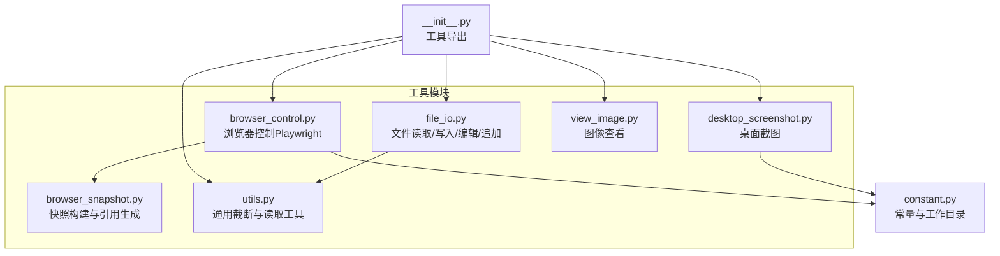
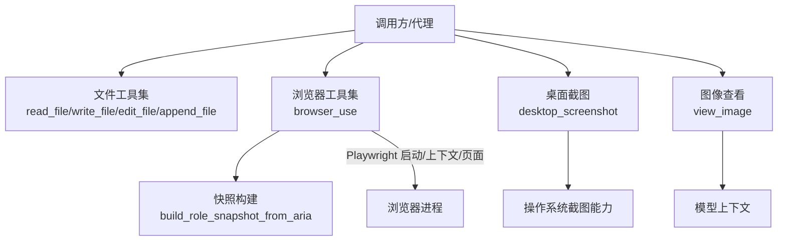
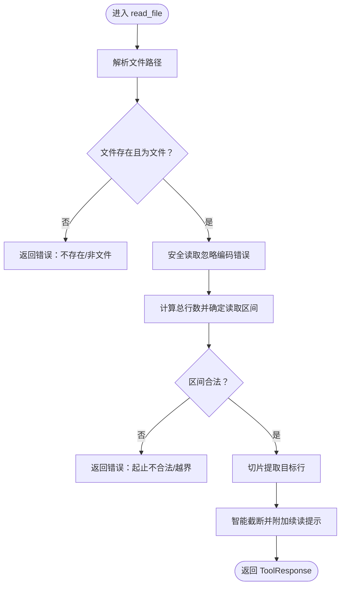
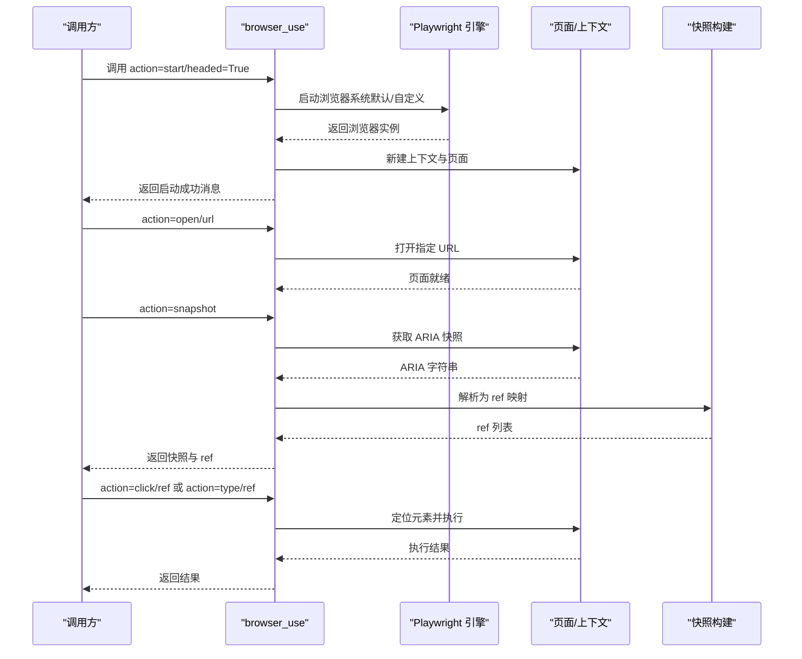
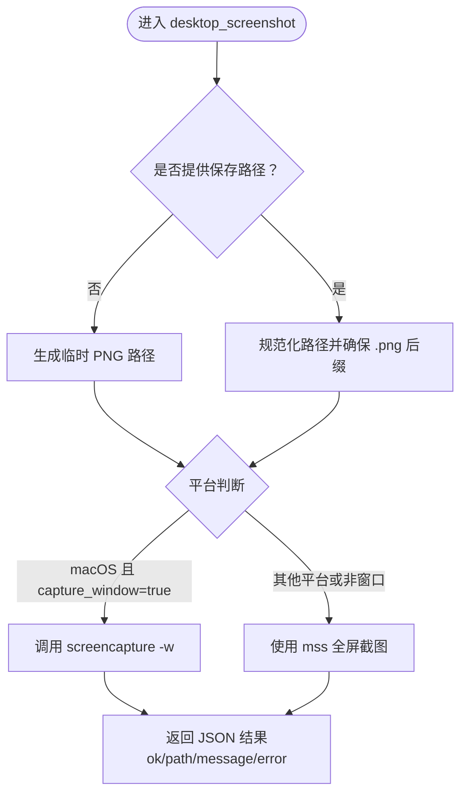
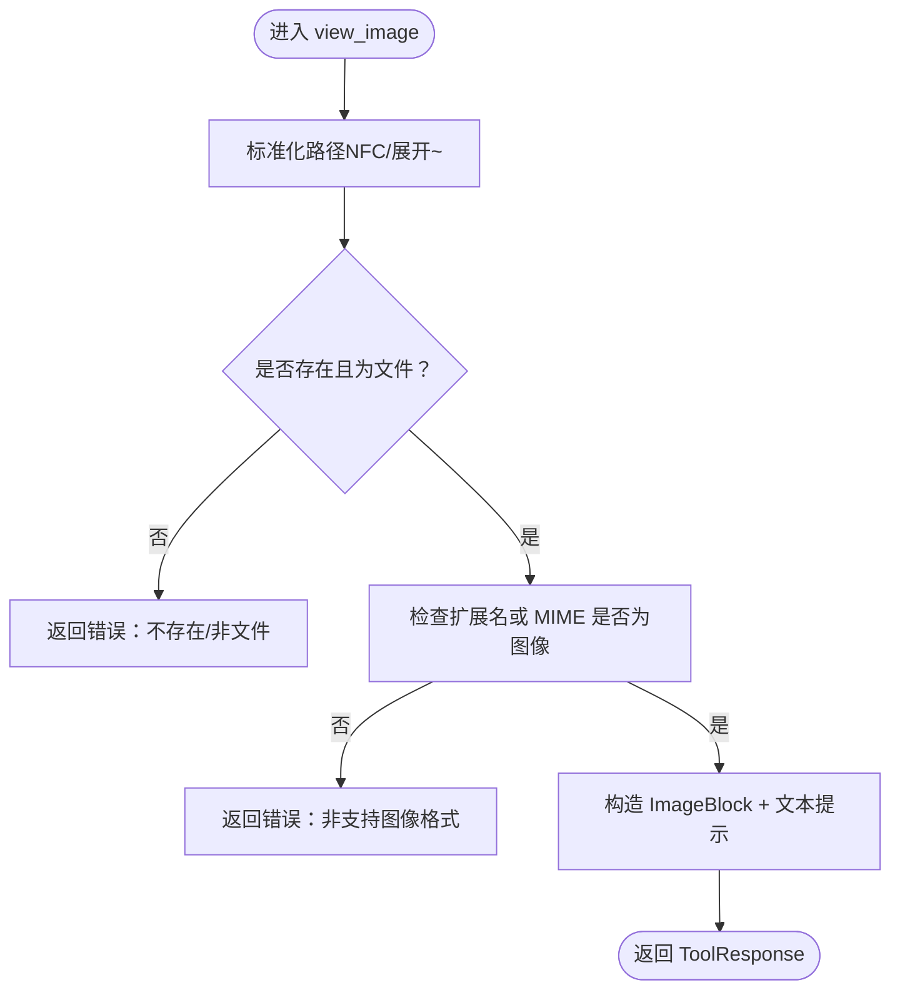
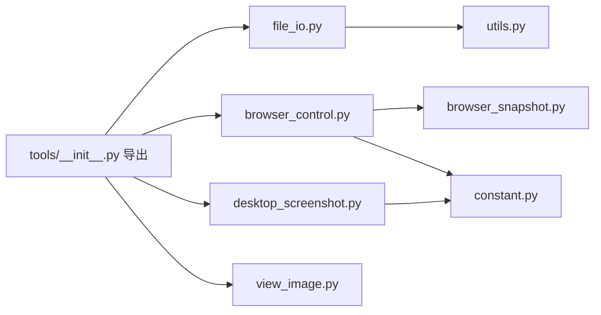

# 系统工具技能

<cite>
**本文引用的文件**
- [file_io.py](file://src/copaw/agents/tools/file_io.py)
- [browser_control.py](file://src/copaw/agents/tools/browser_control.py)
- [browser_snapshot.py](file://src/copaw/agents/tools/browser_snapshot.py)
- [desktop_screenshot.py](file://src/copaw/agents/tools/desktop_screenshot.py)
- [view_image.py](file://src/copaw/agents/tools/view_image.py)
- [utils.py](file://src/copaw/agents/tools/utils.py)
- [__init__.py](file://src/copaw/agents/tools/__init__.py)
- [constant.py](file://src/copaw/constant.py)
- [SKILL.md](file://src/copaw/agents/skills/file_reader/SKILL.md)
</cite>

## 目录
1. [简介](#简介)
2. [项目结构](#项目结构)
3. [核心组件](#核心组件)
4. [架构总览](#架构总览)
5. [详细组件分析](#详细组件分析)
6. [依赖分析](#依赖分析)
7. [性能考量](#性能考量)
8. [故障排除指南](#故障排除指南)
9. [结论](#结论)
10. [附录](#附录)

## 简介
本文件系统性梳理 CoPaw 的“系统工具技能”，重点覆盖以下能力：
- 文件读取与编辑：文本文件读取、范围读取、写入、追加、全文替换
- 浏览器控制：启动/停止、打开页面、导航、回退、点击、输入、截图、快照、表单填写、键盘事件、网络请求与控制台日志导出、PDF 导出、标签页管理、等待策略等
- 桌面截图：全屏截图（跨平台）、macOS 窗口选择截图
- 图像查看：将本地图片以图像块形式注入到模型上下文，便于视觉分析

文档将从功能、参数、输出格式、使用场景、权限与安全、性能影响、故障排除与使用技巧等方面进行说明，并提供可视化流程图与时序图帮助理解。

## 项目结构
系统工具技能位于后端 Python 包中，核心文件组织如下：
- 工具模块集中于 src/copaw/agents/tools 下，按功能拆分
- 工具统一在 __init__.py 中导出，供上层调用
- 常量与工作目录等环境配置位于 src/copaw/constant.py
- 文件读取技能的使用说明位于 src/copaw/agents/skills/file_reader/SKILL.md

**图表来源**
- [__init__.py:1-47](file://src/copaw/agents/tools/__init__.py#L1-L47)
- [file_io.py:1-351](file://src/copaw/agents/tools/file_io.py#L1-L351)
- [browser_control.py:1-2674](file://src/copaw/agents/tools/browser_control.py#L1-L2674)
- [browser_snapshot.py:1-249](file://src/copaw/agents/tools/browser_snapshot.py#L1-L249)
- [desktop_screenshot.py:1-144](file://src/copaw/agents/tools/desktop_screenshot.py#L1-L144)
- [view_image.py:1-82](file://src/copaw/agents/tools/view_image.py#L1-L82)
- [utils.py:1-241](file://src/copaw/agents/tools/utils.py#L1-L241)
- [constant.py:1-201](file://src/copaw/constant.py#L1-L201)

**章节来源**
- [__init__.py:1-47](file://src/copaw/agents/tools/__init__.py#L1-L47)
- [constant.py:72-86](file://src/copaw/constant.py#L72-L86)

## 核心组件
- 文件读取工具：支持绝对/相对路径解析、范围读取、智能截断、错误处理
- 浏览器控制工具：基于 Playwright 的动作式 API，支持多标签页、快照引用、对话框与文件选择器处理、网络与控制台日志收集、PDF 导出等
- 桌面截图工具：跨平台全屏截图；macOS 支持窗口选择截图
- 图像查看工具：将本地图片封装为模型可消费的图像块

**章节来源**
- [file_io.py:35-351](file://src/copaw/agents/tools/file_io.py#L35-L351)
- [browser_control.py:301-608](file://src/copaw/agents/tools/browser_control.py#L301-L608)
- [browser_snapshot.py:185-249](file://src/copaw/agents/tools/browser_snapshot.py#L185-L249)
- [desktop_screenshot.py:101-144](file://src/copaw/agents/tools/desktop_screenshot.py#L101-L144)
- [view_image.py:24-82](file://src/copaw/agents/tools/view_image.py#L24-L82)

## 架构总览
系统工具通过统一的工具接口对外暴露，浏览器控制模块内部集成快照构建与 Playwright 生命周期管理，桌面截图与图像查看分别面向系统级与模型上下文。

**图表来源**
- [browser_control.py:301-608](file://src/copaw/agents/tools/browser_control.py#L301-L608)
- [browser_snapshot.py:185-249](file://src/copaw/agents/tools/browser_snapshot.py#L185-L249)
- [desktop_screenshot.py:101-144](file://src/copaw/agents/tools/desktop_screenshot.py#L101-L144)
- [view_image.py:24-82](file://src/copaw/agents/tools/view_image.py#L24-L82)

## 详细组件分析

### 文件读取与编辑（file_io）
- 路径解析：支持绝对路径与相对路径（相对路径解析至当前工作目录或工作空间目录）
- 读取能力：支持全量读取与行区间读取，自动添加续读提示
- 写入/追加：创建或覆盖写入、末尾追加
- 文本替换：在文件内查找并替换所有匹配片段，失败时返回错误
- 截断策略：对大文件输出进行行数与字节限制，保留首部或尾部并给出续读提示
- 错误处理：对不存在、非文件、编码异常等情况进行明确报错

**图表来源**
- [file_io.py:35-162](file://src/copaw/agents/tools/file_io.py#L35-L162)
- [utils.py:133-182](file://src/copaw/agents/tools/utils.py#L133-L182)

**章节来源**
- [file_io.py:35-351](file://src/copaw/agents/tools/file_io.py#L35-L351)
- [utils.py:133-241](file://src/copaw/agents/tools/utils.py#L133-L241)
- [constant.py:72-86](file://src/copaw/constant.py#L72-L86)

### 浏览器控制（browser_control）
- 动作式 API：统一入口 browser_use，支持 start/stop/open/navigate/navigate_back/screenshot/snapshot/click/type/eval/evaluate/resize/console_messages/handle_dialog/file_upload/fill_form/install/press_key/network_requests/run_code/drag/hover/select_option/tabs/wait_for/pdf/close 等
- 多标签页：通过 page_id 管理多个页面，新标签页自动注册并设为当前
- 快照与引用：结合快照构建模块生成元素引用（ref），优先使用 ref 进行定位
- 生命周期与空闲回收：后台空闲 watchdog 在长时间无活动后自动关闭浏览器以释放资源
- 平台与默认浏览器：根据系统默认浏览器或容器环境选择启动策略；支持同步/异步模式混合
- 日志与网络：收集控制台日志与网络请求，支持保存到文件
- 表单与交互：支持文件上传、表单填充、键盘事件、拖拽、悬停、选项选择、等待策略、PDF 导出、关闭页面等

**图表来源**
- [browser_control.py:301-608](file://src/copaw/agents/tools/browser_control.py#L301-L608)
- [browser_snapshot.py:185-249](file://src/copaw/agents/tools/browser_snapshot.py#L185-L249)

**章节来源**
- [browser_control.py:301-909](file://src/copaw/agents/tools/browser_control.py#L301-L909)
- [browser_snapshot.py:1-249](file://src/copaw/agents/tools/browser_snapshot.py#L1-L249)
- [constant.py:118-132](file://src/copaw/constant.py#L118-L132)

### 桌面截图（desktop_screenshot）
- 全屏截图：跨平台使用 mss 库进行全屏捕获
- 窗口截图（macOS）：通过系统 screencapture 工具支持用户选择窗口
- 输出格式：默认保存为 PNG；若未指定路径则写入临时目录
- 错误处理：缺失依赖、命令超时、文件未创建等情况均返回结构化错误

**图表来源**
- [desktop_screenshot.py:101-144](file://src/copaw/agents/tools/desktop_screenshot.py#L101-L144)

**章节来源**
- [desktop_screenshot.py:1-144](file://src/copaw/agents/tools/desktop_screenshot.py#L1-L144)

### 图像查看（view_image）
- 输入校验：路径存在性、文件类型（扩展名或 MIME）
- 输出封装：将图片封装为图像块与文本提示，注入模型上下文
- 使用场景：与桌面截图、浏览器截图等工具配合，实现视觉分析

**图表来源**
- [view_image.py:24-82](file://src/copaw/agents/tools/view_image.py#L24-L82)

**章节来源**
- [view_image.py:1-82](file://src/copaw/agents/tools/view_image.py#L1-L82)

## 依赖分析
- 工具导出：工具在 __init__.py 中统一导出，供上层模块直接引用
- 环境与常量：工作目录、媒体目录、Playwright 可执行路径等由常量模块提供
- 截断与读取：文件读取工具依赖通用截断与安全读取函数
- 浏览器控制：依赖快照构建模块与系统默认浏览器检测逻辑

**图表来源**
- [__init__.py:1-47](file://src/copaw/agents/tools/__init__.py#L1-L47)
- [file_io.py:1-351](file://src/copaw/agents/tools/file_io.py#L1-L351)
- [browser_control.py:1-2674](file://src/copaw/agents/tools/browser_control.py#L1-L2674)
- [browser_snapshot.py:1-249](file://src/copaw/agents/tools/browser_snapshot.py#L1-L249)
- [desktop_screenshot.py:1-144](file://src/copaw/agents/tools/desktop_screenshot.py#L1-L144)
- [view_image.py:1-82](file://src/copaw/agents/tools/view_image.py#L1-L82)
- [utils.py:1-241](file://src/copaw/agents/tools/utils.py#L1-L241)
- [constant.py:72-86](file://src/copaw/constant.py#L72-L86)

**章节来源**
- [__init__.py:1-47](file://src/copaw/agents/tools/__init__.py#L1-L47)
- [constant.py:72-86](file://src/copaw/constant.py#L72-L86)

## 性能考量
- 浏览器生命周期：空闲回收机制避免长时间占用渲染进程；建议在任务结束后显式调用停止
- 截图性能：mss 为轻量级跨平台方案；macOS 窗口选择可能触发用户交互，增加等待时间
- 文件读取：对大文件采用行数与字节限制的截断策略，避免一次性传输过多数据
- 平台差异：Windows/Uvicorn 热重载模式下使用同步 Playwright 线程池，避免异步子进程问题

[本节为通用指导，无需具体文件分析]

## 故障排除指南
- 浏览器未安装/不可用
  - 现象：导入 Playwright 抛出异常
  - 处理：按照提示安装 Playwright 并运行安装脚本
  - 参考
    - [browser_control.py:204-232](file://src/copaw/agents/tools/browser_control.py#L204-L232)
- 浏览器启动失败
  - 现象：启动后立即失败或无响应
  - 处理：检查容器环境参数、系统默认浏览器检测、可执行路径
  - 参考
    - [browser_control.py:718-794](file://src/copaw/agents/tools/browser_control.py#L718-L794)
    - [constant.py:131-132](file://src/copaw/constant.py#L131-L132)
- 空闲自动关闭
  - 现象：长时间无操作后浏览器被关闭
  - 处理：在需要时再次调用启动动作，或调整空闲超时策略
  - 参考
    - [browser_control.py:132-154](file://src/copaw/agents/tools/browser_control.py#L132-L154)
- 桌面截图失败
  - 现象：mss 缺失、命令超时、文件未创建
  - 处理：安装 mss；macOS 下确认 screencapture 权限与交互
  - 参考
    - [desktop_screenshot.py:49-98](file://src/copaw/agents/tools/desktop_screenshot.py#L49-L98)
- 图像查看失败
  - 现象：路径不存在、非图像格式
  - 处理：确认路径与扩展名/MIME 类型
  - 参考
    - [view_image.py:44-68](file://src/copaw/agents/tools/view_image.py#L44-L68)
- 文件读取异常
  - 现象：路径非法、编码错误、范围越界
  - 处理：修正路径与行区间；必要时使用范围读取
  - 参考
    - [file_io.py:83-162](file://src/copaw/agents/tools/file_io.py#L83-L162)
    - [utils.py:133-182](file://src/copaw/agents/tools/utils.py#L133-L182)

**章节来源**
- [browser_control.py:204-232](file://src/copaw/agents/tools/browser_control.py#L204-L232)
- [browser_control.py:718-794](file://src/copaw/agents/tools/browser_control.py#L718-L794)
- [browser_control.py:132-154](file://src/copaw/agents/tools/browser_control.py#L132-L154)
- [desktop_screenshot.py:49-98](file://src/copaw/agents/tools/desktop_screenshot.py#L49-L98)
- [view_image.py:44-68](file://src/copaw/agents/tools/view_image.py#L44-L68)
- [file_io.py:83-162](file://src/copaw/agents/tools/file_io.py#L83-L162)
- [utils.py:133-182](file://src/copaw/agents/tools/utils.py#L133-L182)

## 结论
系统工具技能围绕“文件、浏览器、截图、图像”四大类能力构建，具备完善的参数校验、错误处理与跨平台适配。通过统一的工具导出与环境常量配置，开发者可以快速组合这些工具完成复杂任务。建议在生产环境中关注浏览器空闲回收、截图依赖安装与图像格式校验，以获得稳定高效的体验。

[本节为总结性内容，无需具体文件分析]

## 附录

### 实际使用示例（步骤说明）
- 文件内容提取
  - 步骤：调用 read_file 指定文件路径与可选行区间；如需大文件摘要，先进行范围读取再汇总
  - 参考
    - [file_io.py:35-162](file://src/copaw/agents/tools/file_io.py#L35-L162)
    - [SKILL.md:28-47](file://src/copaw/agents/skills/file_reader/SKILL.md#L28-L47)
- 网页浏览控制
  - 步骤：browser_use 启动浏览器；open 打开 URL；snapshot 生成快照与引用；click/type 等动作基于 ref 执行；结束时可导出控制台与网络日志
  - 参考
    - [browser_control.py:301-608](file://src/copaw/agents/tools/browser_control.py#L301-L608)
    - [browser_snapshot.py:185-249](file://src/copaw/agents/tools/browser_snapshot.py#L185-L249)
- 屏幕截图操作
  - 步骤：desktop_screenshot 全屏截图；macOS 可选窗口截图；随后 view_image 将图片注入模型上下文
  - 参考
    - [desktop_screenshot.py:101-144](file://src/copaw/agents/tools/desktop_screenshot.py#L101-L144)
    - [view_image.py:24-82](file://src/copaw/agents/tools/view_image.py#L24-L82)

### 参数与输出格式速览
- 文件读取
  - 输入：file_path、start_line、end_line
  - 输出：ToolResponse（文本块，含续读提示或错误）
  - 参考
    - [file_io.py:35-162](file://src/copaw/agents/tools/file_io.py#L35-L162)
- 浏览器控制
  - 输入：action 及对应参数（如 url、page_id、selector、text、code、path、wait、full_page、width、height、level、filename、accept、prompt_text、ref、element、paths_json、fields_json、key、submit、slowly、include_static、screenshot_type、snapshot_filename、double_click、button、modifiers_json、start_ref、end_ref、start_selector、end_selector、start_element、end_element、values_json、tab_action、index、wait_time、text_gone、frame_selector、headed）
  - 输出：ToolResponse（JSON 字符串，包含 ok/message/path/error 等）
  - 参考
    - [browser_control.py:301-608](file://src/copaw/agents/tools/browser_control.py#L301-L608)
- 桌面截图
  - 输入：path、capture_window
  - 输出：ToolResponse（JSON，包含 ok、path、message 或 error）
  - 参考
    - [desktop_screenshot.py:101-144](file://src/copaw/agents/tools/desktop_screenshot.py#L101-L144)
- 图像查看
  - 输入：image_path
  - 输出：ToolResponse（图像块 + 文本提示，或错误）
  - 参考
    - [view_image.py:24-82](file://src/copaw/agents/tools/view_image.py#L24-L82)

### 权限与安全
- 文件访问：遵循工作目录与工作空间目录规则，避免越权访问
- 浏览器：默认无头运行，避免弹窗干扰；可通过 headed 参数显式开启可见窗口
- 截图：依赖系统截图能力，需确保运行环境具备相应权限
- 图像查看：严格校验文件类型，防止非图像内容注入

**章节来源**
- [file_io.py:16-33](file://src/copaw/agents/tools/file_io.py#L16-L33)
- [browser_control.py:814-909](file://src/copaw/agents/tools/browser_control.py#L814-L909)
- [desktop_screenshot.py:101-144](file://src/copaw/agents/tools/desktop_screenshot.py#L101-L144)
- [view_image.py:24-82](file://src/copaw/agents/tools/view_image.py#L24-L82)