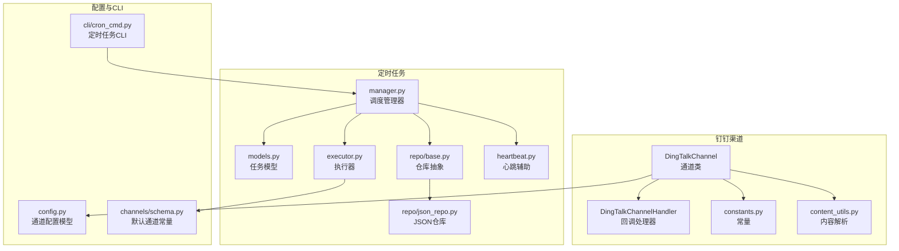
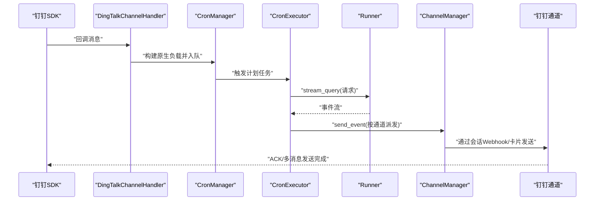
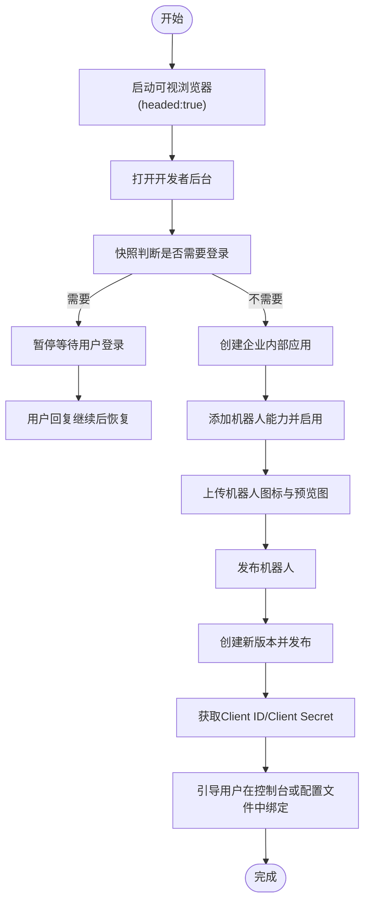
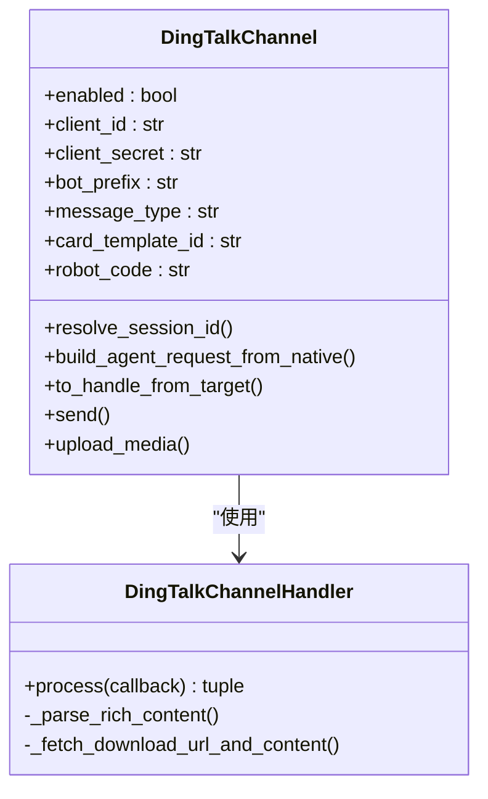
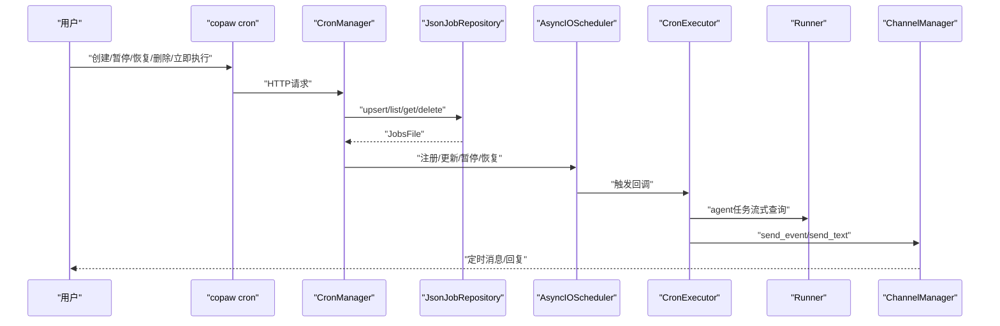
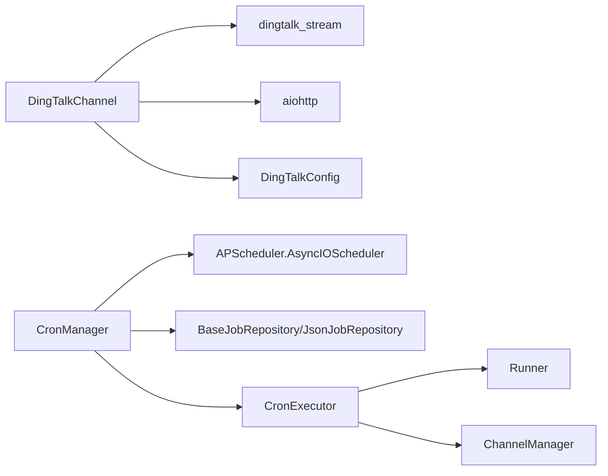

# 通信技能

<cite>
**本文引用的文件**
- [src\copaw\agents\skills\dingtalk_channel\SKILL.md](file://src\copaw\agents\skills\dingtalk_channel\SKILL.md)
- [src\copaw\agents\skills\cron\SKILL.md](file://src\copaw\agents\skills\cron\SKILL.md)
- [src\copaw\app\channels\dingtalk\channel.py](file://src\copaw\app\channels\dingtalk\channel.py)
- [src\copaw\app\channels\dingtalk\handler.py](file://src\copaw\app\channels\dingtalk\handler.py)
- [src\copaw\app\channels\dingtalk\constants.py](file://src\copaw\app\channels\dingtalk\constants.py)
- [src\copaw\app\channels\dingtalk\content_utils.py](file://src\copaw\app\channels\dingtalk\content_utils.py)
- [src\copaw\app\crons\models.py](file://src\copaw\app\crons\models.py)
- [src\copaw\app\crons\manager.py](file://src\copaw\app\crons\manager.py)
- [src\copaw\app\crons\executor.py](file://src\copaw\app\crons\executor.py)
- [src\copaw\app\crons\repo\base.py](file://src\copaw\app\crons\repo\base.py)
- [src\copaw\app\crons\repo\json_repo.py](file://src\copaw\app\crons\repo\json_repo.py)
- [src\copaw\app\crons\heartbeat.py](file://src\copaw\app\crons\heartbeat.py)
- [src\copaw\app\channels\schema.py](file://src\copaw\app\channels\schema.py)
- [src\copaw\config\config.py](file://src\copaw\config\config.py)
- [src\copaw\cli\cron_cmd.py](file://src\copaw\cli\cron_cmd.py)
</cite>

## 目录
1. [引言](#引言)
2. [项目结构](#项目结构)
3. [核心组件](#核心组件)
4. [架构总览](#架构总览)
5. [详细组件分析](#详细组件分析)
6. [依赖关系分析](#依赖关系分析)
7. [性能考量](#性能考量)
8. [故障排查指南](#故障排查指南)
9. [结论](#结论)
10. [附录](#附录)

## 引言
本文件面向CoPaw的“通信技能”，聚焦两大能力：
- 钉钉渠道技能：通过可视浏览器自动化完成钉钉应用创建、机器人配置与发布，并引导用户在控制台或配置文件中绑定凭证，实现与钉钉的稳定对接。
- 定时任务技能：通过copaw命令行管理定时任务，支持创建、查询、暂停/恢复、删除、立即执行等操作；支持Cron表达式调度与任务执行器，覆盖“固定文本消息”和“向Agent提问并回传结果”的两类任务类型。

文档将从系统架构、组件关系、数据流、处理逻辑、集成方法与最佳实践等方面进行深入说明，并提供可视化图表与使用场景示例，帮助读者快速上手并安全高效地使用这些通信能力。

## 项目结构
围绕通信技能的关键目录与文件：
- 钉钉渠道：通道类、回调处理器、常量与内容解析工具
- 定时任务：模型定义、调度管理器、执行器、仓库抽象与JSON存储、心跳辅助
- 配置：通道配置模型（含钉钉）
- CLI：定时任务命令行接口

**图表来源**
- [src\copaw\app\channels\dingtalk\channel.py](file://src\copaw\app\channels\dingtalk\channel.py)
- [src\copaw\app\channels\dingtalk\handler.py](file://src\copaw\app\channels\dingtalk\handler.py)
- [src\copaw\app\channels\dingtalk\constants.py](file://src\copaw\app\channels\dingtalk\constants.py)
- [src\copaw\app\channels\dingtalk\content_utils.py](file://src\copaw\app\channels\dingtalk\content_utils.py)
- [src\copaw\app\crons\models.py](file://src\copaw\app\crons\models.py)
- [src\copaw\app\crons\manager.py](file://src\copaw\app\crons\manager.py)
- [src\copaw\app\crons\executor.py](file://src\copaw\app\crons\executor.py)
- [src\copaw\app\crons\repo\base.py](file://src\copaw\app\crons\repo\base.py)
- [src\copaw\app\crons\repo\json_repo.py](file://src\copaw\app\crons\repo\json_repo.py)
- [src\copaw\app\crons\heartbeat.py](file://src\copaw\app\crons\heartbeat.py)
- [src\copaw\config\config.py](file://src\copaw\config\config.py)
- [src\copaw\cli\cron_cmd.py](file://src\copaw\cli\cron_cmd.py)
- [src\copaw\app\channels\schema.py](file://src\copaw\app\channels\schema.py)

**章节来源**
- [src\copaw\agents\skills\dingtalk_channel\SKILL.md](file://src\copaw\agents\skills\dingtalk_channel\SKILL.md)
- [src\copaw\agents\skills\cron\SKILL.md](file://src\copaw\agents\skills\cron\SKILL.md)

## 核心组件
- 钉钉渠道
  - 通道类：负责接收钉钉回调、构建请求、去重、媒体上传、会话Webhook持久化与回复发送。
  - 回调处理器：将钉钉回调转换为运行时内容列表，排队并等待回复Future，最终统一回复。
  - 常量与内容工具：定义发送标记、Token缓存、类型映射、会话ID短截取、富文本解析等。
- 定时任务
  - 模型：定义任务规范、调度规范、派发目标、运行时参数与状态视图。
  - 管理器：基于AsyncIOScheduler调度，注册/更新任务、并发信号量、状态维护、心跳集成。
  - 执行器：根据任务类型（text/agent）派发至通道或执行Agent查询并流式回传。
  - 仓库：抽象持久化接口与JSON文件实现，支持原子写入。
  - 心跳：按配置周期运行，可选派发至最近一次对话目标。

**章节来源**
- [src\copaw\app\channels\dingtalk\channel.py](file://src\copaw\app\channels\dingtalk\channel.py)
- [src\copaw\app\channels\dingtalk\handler.py](file://src\copaw\app\channels\dingtalk\handler.py)
- [src\copaw\app\channels\dingtalk\constants.py](file://src\copaw\app\channels\dingtalk\constants.py)
- [src\copaw\app\channels\dingtalk\content_utils.py](file://src\copaw\app\channels\dingtalk\content_utils.py)
- [src\copaw\app\crons\models.py](file://src\copaw\app\crons\models.py)
- [src\copaw\app\crons\manager.py](file://src\copaw\app\crons\manager.py)
- [src\copaw\app\crons\executor.py](file://src\copaw\app\crons\executor.py)
- [src\copaw\app\crons\repo\base.py](file://src\copaw\app\crons\repo\base.py)
- [src\copaw\app\crons\repo\json_repo.py](file://src\copaw\app\crons\repo\json_repo.py)
- [src\copaw\app\crons\heartbeat.py](file://src\copaw\app\crons\heartbeat.py)

## 架构总览
下图展示了从钉钉回调到Agent处理再到通道回复的整体链路，以及定时任务的调度与执行路径。

**图表来源**
- [src\copaw\app\channels\dingtalk\handler.py](file://src\copaw\app\channels\dingtalk\handler.py)
- [src\copaw\app\crons\manager.py](file://src\copaw\app\crons\manager.py)
- [src\copaw\app\crons\executor.py](file://src\copaw\app\crons\executor.py)

## 详细组件分析

### 钉钉渠道技能（可视化自动化对接）
- 功能要点
  - 通过可视浏览器自动化创建钉钉应用、添加机器人能力、配置图标与预览图、开启Stream模式并发布。
  - 引导用户在控制台或配置文件中绑定Client ID/Client Secret。
  - 支持图片上传策略（本地路径或URL下载后上传）、上传失败时的人工干预与恢复。
  - 执行前显著确认（自定义项、图片规范、默认值），强制规则确保发布生效。
- 关键流程
  - 登录检测与暂停、创建应用、添加机器人、上传媒体、发布版本、获取凭证、绑定方式。
- 最佳实践
  - 使用headed模式启动浏览器，遇到登录页务必暂停等待用户手动登录。
  - 严格遵循“创建新版本并发布”的强制规则，未发布不可宣称生效。
  - 上传前先点击上传入口触发选择器，再调用file_upload传入本地路径数组。
  - 遇到图片规格不符时暂停并让用户手动上传合规图片后继续。

**图表来源**
- [src\copaw\agents\skills\dingtalk_channel\SKILL.md](file://src\copaw\agents\skills\dingtalk_channel\SKILL.md)

**章节来源**
- [src\copaw\agents\skills\dingtalk_channel\SKILL.md](file://src\copaw\agents\skills\dingtalk_channel\SKILL.md)

### 钉钉通道类与回调处理器
- 通道类职责
  - 初始化与配置加载（环境变量/配置对象）、媒体目录管理、会话Webhook存储与持久化。
  - 去重机制（基于消息ID）、合并流式内容为一次性回复、支持AI卡片与Webhook多消息发送。
  - 媒体上传（Open API）、富文本解析、会话ID短截取以适配定时任务查找。
- 回调处理器职责
  - 解析富文本内容（图片/音频/视频/文件），提取下载码并通过下载URL构建内容部件。
  - 构建原生负载（通道ID、发送者、内容部件、元信息），入队并等待回复Future。
  - 处理重复消息、群聊/私聊识别、@机器人标记、会话Webhook存在性记录。

**图表来源**
- [src\copaw\app\channels\dingtalk\channel.py](file://src\copaw\app\channels\dingtalk\channel.py)
- [src\copaw\app\channels\dingtalk\handler.py](file://src\copaw\app\channels\dingtalk\handler.py)

**章节来源**
- [src\copaw\app\channels\dingtalk\channel.py](file://src\copaw\app\channels\dingtalk\channel.py)
- [src\copaw\app\channels\dingtalk\handler.py](file://src\copaw\app\channels\dingtalk\handler.py)
- [src\copaw\app\channels\dingtalk\constants.py](file://src\copaw\app\channels\dingtalk\constants.py)
- [src\copaw\app\channels\dingtalk\content_utils.py](file://src\copaw\app\channels\dingtalk\content_utils.py)

### 定时任务技能（CLI与调度）
- 命令行能力
  - 列表、查看、状态、删除、暂停/恢复、立即执行。
  - 支持从JSON文件批量创建，或通过内联参数构建任务规范。
- 任务类型
  - text：定时向指定频道发送固定文本。
  - agent：定时向Agent提问并将回复流式发送到频道。
- Cron表达式与调度
  - 支持5字段（分钟/小时/日/月/星期），自动规范化星期数字到英文缩写。
  - 基于AsyncIOScheduler与CronTrigger，支持最大并发、超时、错失宽限时间。
- 执行与派发
  - 执行器根据任务类型派发至通道或执行Agent查询，支持流式增量与最终一次性发送。
  - 仓库抽象与JSON文件实现，提供原子写入保障。

**图表来源**
- [src\copaw\cli\cron_cmd.py](file://src\copaw\cli\cron_cmd.py)
- [src\copaw\app\crons\manager.py](file://src\copaw\app\crons\manager.py)
- [src\copaw\app\crons\repo\json_repo.py](file://src\copaw\app\crons\repo\json_repo.py)
- [src\copaw\app\crons\executor.py](file://src\copaw\app\crons\executor.py)

**章节来源**
- [src\copaw\agents\skills\cron\SKILL.md](file://src\copaw\agents\skills\cron\SKILL.md)
- [src\copaw\cli\cron_cmd.py](file://src\copaw\cli\cron_cmd.py)
- [src\copaw\app\crons\models.py](file://src\copaw\app\crons\models.py)
- [src\copaw\app\crons\manager.py](file://src\copaw\app\crons\manager.py)
- [src\copaw\app\crons\executor.py](file://src\copaw\app\crons\executor.py)
- [src\copaw\app\crons\repo\base.py](file://src\copaw\app\crons\repo\base.py)
- [src\copaw\app\crons\repo\json_repo.py](file://src\copaw\app\crons\repo\json_repo.py)

### 配置与集成要点
- 钉钉通道配置
  - 通过环境变量或配置对象注入client_id/client_secret/message_type/card模板等。
  - 支持媒体目录、私聊/群聊策略、@机器人要求、白名单/黑名单等。
- 定时任务配置
  - 通过CLI创建任务时需显式指定agent_id，避免被错误地创建到default agent工作区。
  - 任务规范包含调度、派发目标、运行时参数与元信息，支持流式/最终两种派发模式。

**章节来源**
- [src\copaw\config\config.py](file://src\copaw\config\config.py)
- [src\copaw\agents\skills\cron\SKILL.md](file://src\copaw\agents\skills\cron\SKILL.md)

## 依赖关系分析
- 钉钉通道依赖
  - dingtalk_stream SDK用于回调处理与回复。
  - aiohttp用于媒体上传与会话Webhook发送。
  - 通道配置模型提供客户端凭证与行为开关。
- 定时任务依赖
  - APScheduler v3用于异步调度，CronTrigger解析5字段表达式。
  - 仓库抽象保证任务持久化一致性，JSON实现提供原子写入。
  - 执行器依赖Runner与ChannelManager进行Agent查询与消息派发。

**图表来源**
- [src\copaw\app\channels\dingtalk\channel.py](file://src\copaw\app\channels\dingtalk\channel.py)
- [src\copaw\app\crons\manager.py](file://src\copaw\app\crons\manager.py)
- [src\copaw\app\crons\repo\json_repo.py](file://src\copaw\app\crons\repo\json_repo.py)
- [src\copaw\app\crons\executor.py](file://src\copaw\app\crons\executor.py)
- [src\copaw\config\config.py](file://src\copaw\config\config.py)

**章节来源**
- [src\copaw\app\channels\dingtalk\channel.py](file://src\copaw\app\channels\dingtalk\channel.py)
- [src\copaw\app\crons\manager.py](file://src\copaw\app\crons\manager.py)
- [src\copaw\app\crons\repo\json_repo.py](file://src\copaw\app\crons\repo\json_repo.py)
- [src\copaw\app\crons\executor.py](file://src\copaw\app\crons\executor.py)
- [src\copaw\config\config.py](file://src\copaw\config\config.py)

## 性能考量
- 钉钉通道
  - 去重与消息ID集合降低重复处理成本；媒体上传采用Open API并缓存Token减少请求次数。
  - 会话Webhook用于多消息推送，避免长轮询阻塞；富文本解析按需下载媒体URL。
- 定时任务
  - 每任务独立信号量限制并发，避免资源争用；错失宽限时长与超时控制保障稳定性。
  - JSON仓库原子写入减少竞态风险；调度器仅在有效任务上注册，降低无效唤醒。

[本节为通用指导，无需具体文件分析]

## 故障排查指南
- 钉钉通道
  - 重复消息：检查消息ID去重逻辑与回调线程安全。
  - 上传失败：核对图片规格与格式，必要时暂停并人工上传合规图片。
  - 会话Webhook过期：使用会话ID短截取与持久化存储，重启后从磁盘恢复。
- 定时任务
  - Cron表达式无效：确认5字段格式与星期命名规范化；检查时区设置。
  - 任务未执行：确认任务已启用、调度器已启动、状态未被自动禁用。
  - 执行超时/取消：调整runtime.timeout_seconds；查看最后状态与错误信息。

**章节来源**
- [src\copaw\app\channels\dingtalk\channel.py](file://src\copaw\app\channels\dingtalk\channel.py)
- [src\copaw\app\crons\models.py](file://src\copaw\app\crons\models.py)
- [src\copaw\app\crons\manager.py](file://src\copaw\app\crons\manager.py)

## 结论
- 钉钉渠道技能通过可视化自动化简化了应用创建与机器人发布的复杂流程，并提供了严格的发布与绑定约束，确保配置生效与后续通信稳定。
- 定时任务技能以CLI为中心，结合模型、调度器与执行器，实现了灵活的任务编排与可靠的消息派发，支持文本与Agent两类任务类型。
- 建议在生产环境中：
  - 钉钉：严格遵循发布流程与图片规范，妥善管理会话Webhook生命周期。
  - 定时任务：显式指定agent_id，合理设置并发与超时，定期检查状态与错误日志。

[本节为总结性内容，无需具体文件分析]

## 附录
- 使用场景示例
  - 定时提醒：每天9:00向钉钉频道发送“早上好！”文本消息。
  - 自动汇报：每2小时向Agent提问“我有什么待办事项？”，并将回复流式发送到钉钉。
  - 周期性任务：每周日凌晨零点汇总上周工作并发送到指定会话。
- 配置示例路径
  - 钉钉通道配置位于用户主目录下的配置文件中，键路径为channels.dingtalk。
  - 定时任务通过copaw cron命令创建，需提供agent_id、channel、target-user、target-session与text等参数。

**章节来源**
- [src\copaw\agents\skills\cron\SKILL.md](file://src\copaw\agents\skills\cron\SKILL.md)
- [src\copaw\agents\skills\dingtalk_channel\SKILL.md](file://src\copaw\agents\skills\dingtalk_channel\SKILL.md)
- [src\copaw\config\config.py](file://src\copaw\config\config.py)