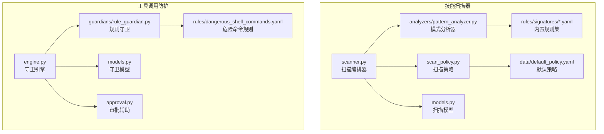
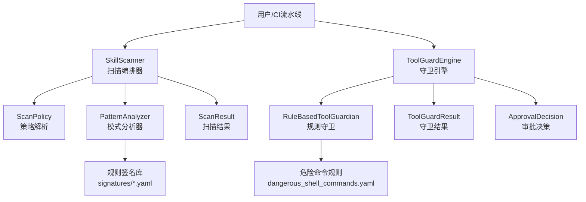
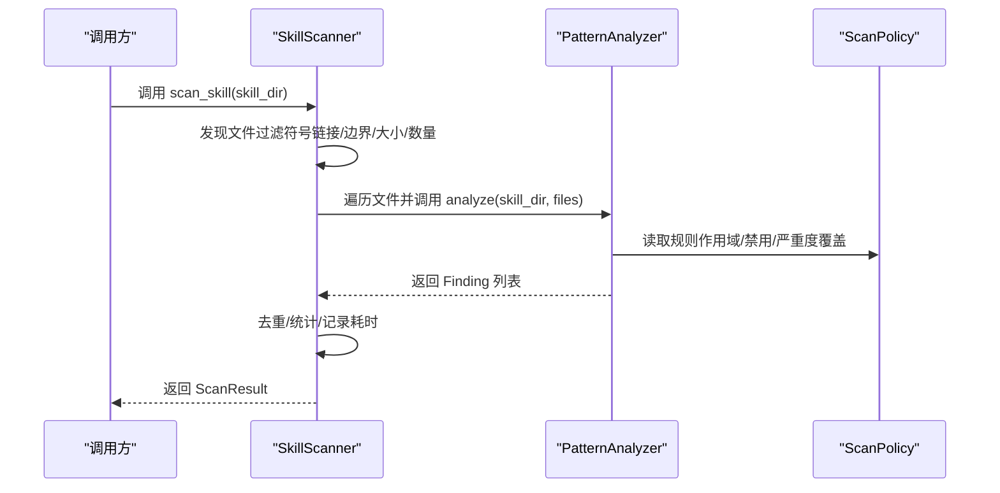
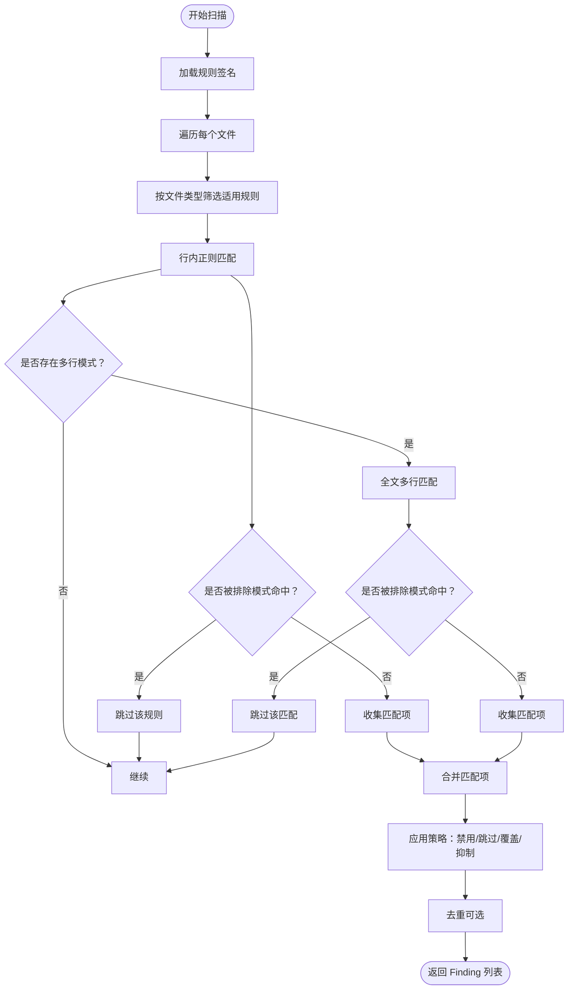
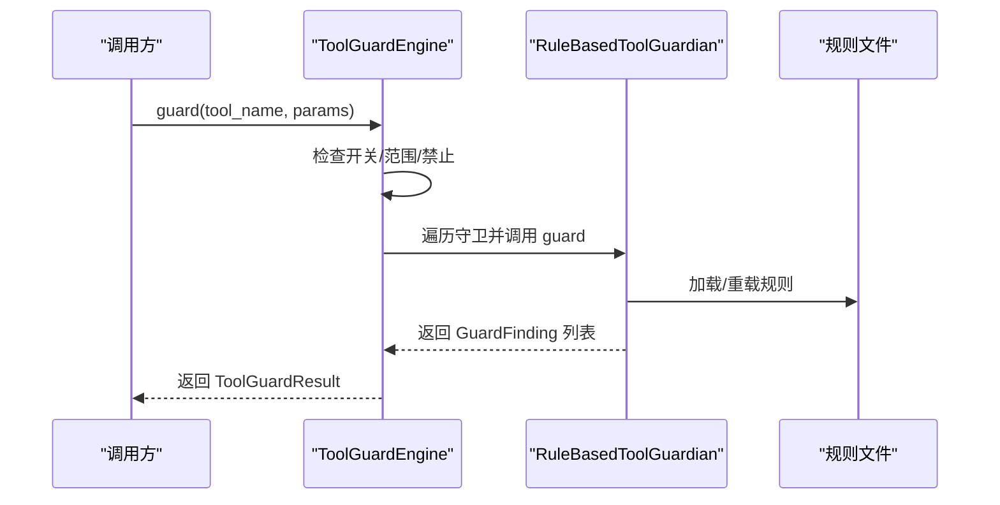
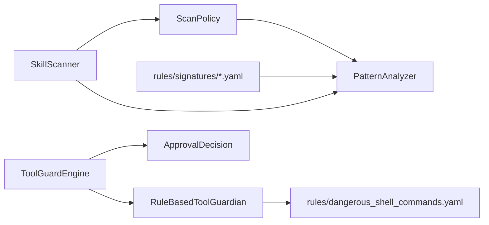

# 技能安全机制

<cite>
**本文引用的文件**
- [scanner.py](file://src/copaw/security/skill_scanner/scanner.py)
- [models.py](file://src/copaw/security/skill_scanner/models.py)
- [scan_policy.py](file://src/copaw/security/skill_scanner/scan_policy.py)
- [pattern_analyzer.py](file://src/copaw/security/skill_scanner/analyzers/pattern_analyzer.py)
- [default_policy.yaml](file://src/copaw/security/skill_scanner/data/default_policy.yaml)
- [command_injection.yaml](file://src/copaw/security/skill_scanner/rules/signatures/command_injection.yaml)
- [data_exfiltration.yaml](file://src/copaw/security/skill_scanner/rules/signatures/data_exfiltration.yaml)
- [hardcoded_secrets.yaml](file://src/copaw/security/skill_scanner/rules/signatures/hardcoded_secrets.yaml)
- [obfuscation.yaml](file://src/copaw/security/skill_scanner/rules/signatures/obfuscation.yaml)
- [prompt_injection.yaml](file://src/copaw/security/skill_scanner/rules/signatures/prompt_injection.yaml)
- [engine.py](file://src/copaw/security/tool_guard/engine.py)
- [rule_guardian.py](file://src/copaw/security/tool_guard/guardians/rule_guardian.py)
- [dangerous_shell_commands.yaml](file://src/copaw/security/tool_guard/rules/dangerous_shell_commands.yaml)
- [models.py](file://src/copaw/security/tool_guard/models.py)
- [approval.py](file://src/copaw/security/tool_guard/approval.py)
</cite>

## 目录
1. [简介](#简介)
2. [项目结构](#项目结构)
3. [核心组件](#核心组件)
4. [架构总览](#架构总览)
5. [详细组件分析](#详细组件分析)
6. [依赖关系分析](#依赖关系分析)
7. [性能考量](#性能考量)
8. [故障排查指南](#故障排查指南)
9. [结论](#结论)
10. [附录](#附录)

## 简介
本文件系统性阐述 CoPaw 技能安全机制，覆盖技能扫描器与工具调用防护两大子系统。技能扫描器通过规则引擎对技能包进行静态安全扫描，识别命令注入、数据泄露、硬编码密钥、混淆技术、提示注入等威胁；工具调用防护在运行时拦截高危工具调用，结合规则匹配与审批流程实现“可审计、可阻断、可恢复”的安全控制。

## 项目结构
安全相关代码主要位于 src/copaw/security 下，分为两个子系统：
- 技能扫描器（skill_scanner）：负责离线扫描技能包，产出扫描结果与合规性判断
- 工具调用防护（tool_guard）：负责在线拦截工具调用参数，产出守卫结果与风险等级

**图表来源**
- [scanner.py:76-319](file://src/copaw/security/skill_scanner/scanner.py#L76-L319)
- [pattern_analyzer.py:236-393](file://src/copaw/security/skill_scanner/analyzers/pattern_analyzer.py#L236-L393)
- [scan_policy.py:156-476](file://src/copaw/security/skill_scanner/scan_policy.py#L156-L476)
- [engine.py:52-218](file://src/copaw/security/tool_guard/engine.py#L52-L218)
- [rule_guardian.py:280-383](file://src/copaw/security/tool_guard/guardians/rule_guardian.py#L280-L383)

**章节来源**
- [scanner.py:1-319](file://src/copaw/security/skill_scanner/scanner.py#L1-L319)
- [engine.py:1-218](file://src/copaw/security/tool_guard/engine.py#L1-L218)

## 核心组件
- 技能扫描器（SkillScanner）
  - 负责遍历技能目录、加载策略、注册分析器、执行扫描并聚合结果
  - 支持文件大小与数量限制、跳过扩展名集合、去重策略
- 模式分析器（PatternAnalyzer）
  - 基于 YAML 规则的正则签名匹配，支持行内与多行匹配、排除模式、按文件类型过滤
  - 支持策略级规则禁用、严重度覆盖、文档路径跳过、测试凭证抑制
- 扫描策略（ScanPolicy）
  - 组织级策略，包含隐藏文件处理、规则作用域、凭证白名单、文件分类、阈值与严重度覆盖
  - 支持从 YAML 加载与合并，默认策略位于 data/default_policy.yaml
- 守卫引擎（ToolGuardEngine）
  - 运行时拦截工具调用，按规则匹配参数，生成守卫结果
  - 支持开关控制、守护范围与禁止列表、动态重载规则
- 规则守卫（RuleBasedToolGuardian）
  - 基于 YAML 规则的参数扫描，支持工具/参数维度匹配、忽略大小写、上下文片段
  - 支持内置规则与配置中自定义规则叠加
- 审批辅助（ApprovalDecision）
  - 提供审批决策枚举与摘要格式化，用于审批流程展示

**章节来源**
- [scanner.py:76-319](file://src/copaw/security/skill_scanner/scanner.py#L76-L319)
- [pattern_analyzer.py:236-393](file://src/copaw/security/skill_scanner/analyzers/pattern_analyzer.py#L236-L393)
- [scan_policy.py:156-476](file://src/copaw/security/skill_scanner/scan_policy.py#L156-L476)
- [engine.py:52-218](file://src/copaw/security/tool_guard/engine.py#L52-L218)
- [rule_guardian.py:280-383](file://src/copaw/security/tool_guard/guardians/rule_guardian.py#L280-L383)
- [models.py:103-185](file://src/copaw/security/tool_guard/models.py#L103-L185)
- [approval.py:12-38](file://src/copaw/security/tool_guard/approval.py#L12-L38)

## 架构总览
技能扫描器与工具调用防护分别面向“离线静态”和“在线动态”，二者共享统一的威胁分类与严重度体系，便于在不同阶段协同治理。

**图表来源**
- [scanner.py:148-242](file://src/copaw/security/skill_scanner/scanner.py#L148-L242)
- [pattern_analyzer.py:265-347](file://src/copaw/security/skill_scanner/analyzers/pattern_analyzer.py#L265-L347)
- [engine.py:161-206](file://src/copaw/security/tool_guard/engine.py#L161-L206)
- [rule_guardian.py:329-382](file://src/copaw/security/tool_guard/guardians/rule_guardian.py#L329-L382)

## 详细组件分析

### 技能扫描器工作流
- 文件发现：递归遍历技能目录，跳过符号链接、非文件、超出边界路径、超大文件与超过上限的文件数
- 分析器执行：逐个分析器执行扫描，收集所有发现并记录失败的分析器
- 结果聚合：去重（可选）、统计最高严重度、输出扫描结果

**图表来源**
- [scanner.py:148-242](file://src/copaw/security/skill_scanner/scanner.py#L148-L242)
- [pattern_analyzer.py:265-347](file://src/copaw/security/skill_scanner/analyzers/pattern_analyzer.py#L265-L347)

**章节来源**
- [scanner.py:148-299](file://src/copaw/security/skill_scanner/scanner.py#L148-L299)

### 模式分析器与规则引擎
- 规则加载：从 rules/signatures 目录加载 YAML 规则，构建 SecurityRule 对象并按类别/文件类型索引
- 匹配逻辑：先按行匹配，再对含换行的模式进行多行匹配；支持排除模式
- 策略集成：根据策略过滤规则（禁用、文档路径跳过、仅代码文件）、严重度覆盖、测试凭证抑制、去重

**图表来源**
- [pattern_analyzer.py:163-347](file://src/copaw/security/skill_scanner/analyzers/pattern_analyzer.py#L163-L347)
- [scan_policy.py:183-231](file://src/copaw/security/skill_scanner/scan_policy.py#L183-L231)

**章节来源**
- [pattern_analyzer.py:236-393](file://src/copaw/security/skill_scanner/analyzers/pattern_analyzer.py#L236-L393)
- [scan_policy.py:156-231](file://src/copaw/security/skill_scanner/scan_policy.py#L156-L231)

### 扫描策略与白名单机制
- 隐藏文件/目录白名单：允许特定点文件/点目录不作为风险
- 规则作用域：按规则 ID 控制仅在文档或仅在代码文件触发；按路径关键字与文件名模式识别文档区
- 凭证白名单：已知测试值与占位符标记自动抑制误报
- 文件分类：静止类（图片/字体）、结构化（PDF/Office）、归档（压缩包）、代码类（脚本/语言源码）
- 严重度覆盖与禁用规则：按规则 ID 覆盖严重度或完全禁用

**章节来源**
- [scan_policy.py:156-476](file://src/copaw/security/skill_scanner/scan_policy.py#L156-L476)
- [default_policy.yaml:1-245](file://src/copaw/security/skill_scanner/data/default_policy.yaml#L1-L245)

### 内置扫描规则详解
- 命令注入
  - 危险函数调用（eval/exec/compile）、字符串格式化拼接 shell、shell=True、用户输入直接 eval、路径穿越、SQL 注入、嵌入脚本/JS 的二进制文件、find -exec 潜在滥用、Node 子进程与动态函数构造
  - 参考规则文件：[command_injection.yaml:1-195](file://src/copaw/security/skill_scanner/rules/signatures/command_injection.yaml#L1-L195)
- 数据泄露
  - 网络请求原语、POST 高置信外发、socket 外连、敏感文件读取、Base64 编码+网络组合、JS 网络/FS 访问
  - 参考规则文件：[data_exfiltration.yaml:1-142](file://src/copaw/security/skill_scanner/rules/signatures/data_exfiltration.yaml#L1-L142)
- 硬编码密钥
  - AWS/GitHub/Stripe/Google/JWT 秘钥、私钥块、密码/密钥变量、连接串
  - 参考规则文件：[hardcoded_secrets.yaml:1-150](file://src/copaw/security/skill_scanner/rules/signatures/hardcoded_secrets.yaml#L1-L150)
- 混淆技术
  - base64 解码+执行链、大段十六进制、XOR 编码、二进制可执行文件
  - 参考规则文件：[obfuscation.yaml:1-47](file://src/copaw/security/skill_scanner/rules/signatures/obfuscation.yaml#L1-L47)
- 提示注入
  - 忽视先前指令、开启不受限模式、绕过策略、揭示系统提示、隐藏操作
  - 参考规则文件：[prompt_injection.yaml:1-59](file://src/copaw/security/skill_scanner/rules/signatures/prompt_injection.yaml#L1-L59)

**章节来源**
- [command_injection.yaml:1-195](file://src/copaw/security/skill_scanner/rules/signatures/command_injection.yaml#L1-L195)
- [data_exfiltration.yaml:1-142](file://src/copaw/security/skill_scanner/rules/signatures/data_exfiltration.yaml#L1-L142)
- [hardcoded_secrets.yaml:1-150](file://src/copaw/security/skill_scanner/rules/signatures/hardcoded_secrets.yaml#L1-L150)
- [obfuscation.yaml:1-47](file://src/copaw/security/skill_scanner/rules/signatures/obfuscation.yaml#L1-L47)
- [prompt_injection.yaml:1-59](file://src/copaw/security/skill_scanner/rules/signatures/prompt_injection.yaml#L1-L59)

### 工具调用防护机制
- 引擎初始化：支持环境变量与配置开关；默认启用规则守卫
- 守护范围与禁止列表：从配置解析受保护工具集与绝对禁止工具集
- 规则匹配：将参数值转为字符串后按规则匹配，生成守卫发现并附上下文片段
- 动态重载：支持重新加载规则与更新受保护/禁止工具集

**图表来源**
- [engine.py:161-206](file://src/copaw/security/tool_guard/engine.py#L161-L206)
- [rule_guardian.py:329-382](file://src/copaw/security/tool_guard/guardians/rule_guardian.py#L329-L382)

**章节来源**
- [engine.py:52-218](file://src/copaw/security/tool_guard/engine.py#L52-L218)
- [rule_guardian.py:280-383](file://src/copaw/security/tool_guard/guardians/rule_guardian.py#L280-L383)
- [dangerous_shell_commands.yaml:1-120](file://src/copaw/security/tool_guard/rules/dangerous_shell_commands.yaml#L1-L120)

### 审批流程与日志
- 审批决策：批准/拒绝/超时三种状态，配合摘要格式化用于审批界面展示
- 审计字段：守卫结果包含工具名、参数、发现、耗时、使用守卫器、时间戳等，便于审计与回溯

**章节来源**
- [approval.py:12-38](file://src/copaw/security/tool_guard/approval.py#L12-L38)
- [models.py:103-185](file://src/copaw/security/tool_guard/models.py#L103-L185)

## 依赖关系分析
- 技能扫描器
  - 依赖 ScanPolicy 进行规则作用域与严重度控制
  - PatternAnalyzer 依赖规则签名库与策略
  - 输出 ScanResult 供上层决策
- 工具调用防护
  - 依赖 RuleBasedToolGuardian 与规则文件
  - 依赖配置解析受保护/禁止工具集
  - 输出 ToolGuardResult 与审批辅助

**图表来源**
- [pattern_analyzer.py:254-257](file://src/copaw/security/skill_scanner/analyzers/pattern_analyzer.py#L254-L257)
- [engine.py:133-145](file://src/copaw/security/tool_guard/engine.py#L133-L145)
- [rule_guardian.py:304-314](file://src/copaw/security/tool_guard/guardians/rule_guardian.py#L304-L314)

**章节来源**
- [scanner.py:100-134](file://src/copaw/security/skill_scanner/scanner.py#L100-L134)
- [engine.py:64-77](file://src/copaw/security/tool_guard/engine.py#L64-L77)

## 性能考量
- 文件发现阶段的路径解析与大小检查避免了不必要的 IO 与内存占用
- 正则匹配采用两阶段策略（行内优先、多行兜底），减少全量扫描成本
- 策略层面的“仅代码文件”“文档区跳过”“最大文件数/大小”等阈值有效控制扫描规模
- 去重与测试凭证抑制降低误报与重复计算

[本节为通用性能讨论，无需具体文件引用]

## 故障排查指南
- 扫描器未发现任何文件
  - 检查是否为符号链接、是否越界、是否被跳过扩展名过滤、是否超过文件数量/大小限制
  - 参考：[scanner.py:248-299](file://src/copaw/security/skill_scanner/scanner.py#L248-L299)
- 分析器异常退出
  - 查看日志中的失败记录，确认规则加载与正则有效性
  - 参考：[scanner.py:200-213](file://src/copaw/security/skill_scanner/scanner.py#L200-L213)、[pattern_analyzer.py:68-84](file://src/copaw/security/skill_scanner/analyzers/pattern_analyzer.py#L68-L84)
- 守卫引擎未生效
  - 检查 COPAW_TOOL_GUARD_ENABLED 环境变量与配置开关
  - 参考：[engine.py:34-50](file://src/copaw/security/tool_guard/engine.py#L34-L50)
- 规则未触发或误报过多
  - 检查策略中的规则禁用、文档区跳过、仅代码文件、严重度覆盖与测试凭证抑制
  - 参考：[scan_policy.py:183-231](file://src/copaw/security/skill_scanner/scan_policy.py#L183-L231)、[pattern_analyzer.py:285-346](file://src/copaw/security/skill_scanner/analyzers/pattern_analyzer.py#L285-L346)

**章节来源**
- [scanner.py:200-213](file://src/copaw/security/skill_scanner/scanner.py#L200-L213)
- [pattern_analyzer.py:68-84](file://src/copaw/security/skill_scanner/analyzers/pattern_analyzer.py#L68-L84)
- [engine.py:34-50](file://src/copaw/security/tool_guard/engine.py#L34-L50)
- [scan_policy.py:183-231](file://src/copaw/security/skill_scanner/scan_policy.py#L183-L231)

## 结论
CoPaw 的技能安全机制以“策略驱动 + 规则引擎 + 双轨防护”为核心：离线扫描器通过可定制策略与签名规则快速定位高风险模式，运行时工具守卫在关键入口处阻断高危行为，并通过审批流程实现可控的人机协同。建议组织基于默认策略快速落地，逐步细化规则与阈值，形成可持续演进的安全基线。

[本节为总结性内容，无需具体文件引用]

## 附录

### 扫描策略配置要点
- 隐藏文件与目录白名单：仅保留确属工程元信息的点文件/点目录
- 规则作用域：将文档与示例场景的规则设为“仅代码文件”或“文档区跳过”
- 凭证白名单：维护组织内部的测试值与占位符集合，避免误报
- 文件分类：确保代码类/静止类/结构化/归档扩展正确映射
- 严重度覆盖：对特定规则进行组织级严重度调整
- 禁用规则：对不适用的规则进行禁用

**章节来源**
- [scan_policy.py:156-476](file://src/copaw/security/skill_scanner/scan_policy.py#L156-L476)
- [default_policy.yaml:1-245](file://src/copaw/security/skill_scanner/data/default_policy.yaml#L1-L245)

### 自定义规则添加方法
- 技能扫描器
  - 在 rules/signatures 目录新增 YAML 规则文件，遵循 SecurityRule 字段规范
  - 使用 PatternAnalyzer 默认加载路径或指定自定义路径
  - 参考：[pattern_analyzer.py:163-229](file://src/copaw/security/skill_scanner/analyzers/pattern_analyzer.py#L163-L229)
- 工具调用防护
  - 在 rules 目录新增 YAML 规则文件，遵循 GuardRule 字段规范
  - 可通过配置文件注入自定义规则并禁用不需要的规则
  - 参考：[rule_guardian.py:153-231](file://src/copaw/security/tool_guard/guardians/rule_guardian.py#L153-L231)、[dangerous_shell_commands.yaml:1-120](file://src/copaw/security/tool_guard/rules/dangerous_shell_commands.yaml#L1-L120)

**章节来源**
- [pattern_analyzer.py:163-229](file://src/copaw/security/skill_scanner/analyzers/pattern_analyzer.py#L163-L229)
- [rule_guardian.py:153-231](file://src/copaw/security/tool_guard/guardians/rule_guardian.py#L153-L231)
- [dangerous_shell_commands.yaml:1-120](file://src/copaw/security/tool_guard/rules/dangerous_shell_commands.yaml#L1-L120)

### 开发与部署中的安全检查建议
- 开发期
  - 启用技能扫描器，将扫描结果纳入 PR 审查清单
  - 使用默认策略与内置规则，逐步引入组织级策略覆盖
- 测试期
  - 在 CI 中集成扫描器，设置阈值（如不允许 CRITICAL/HIGH）
  - 对工具调用防护进行回归测试，验证规则匹配与审批流程
- 生产期
  - 通过环境变量/配置开关控制工具守卫启用范围
  - 建立规则变更发布流程与灰度策略，定期评估误报率与漏报率

[本节为通用实践建议，无需具体文件引用]