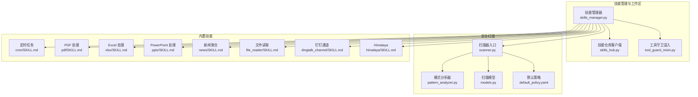
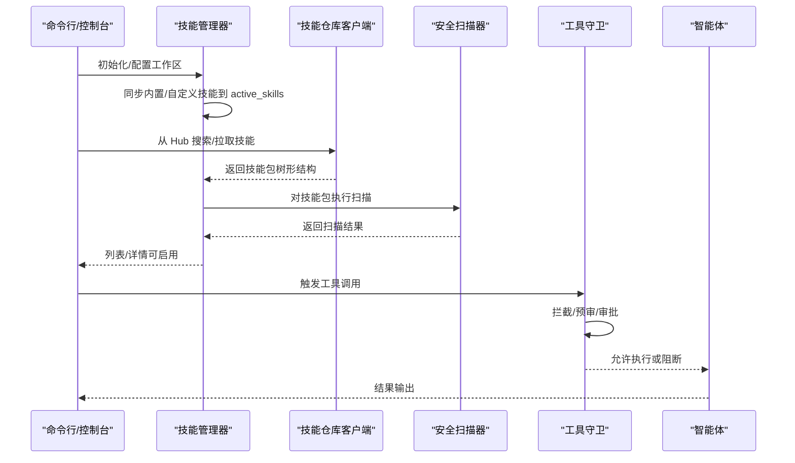
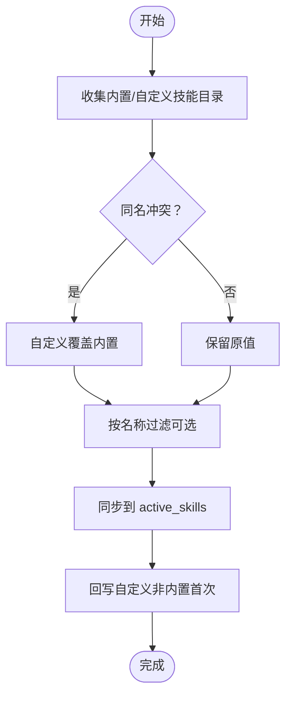
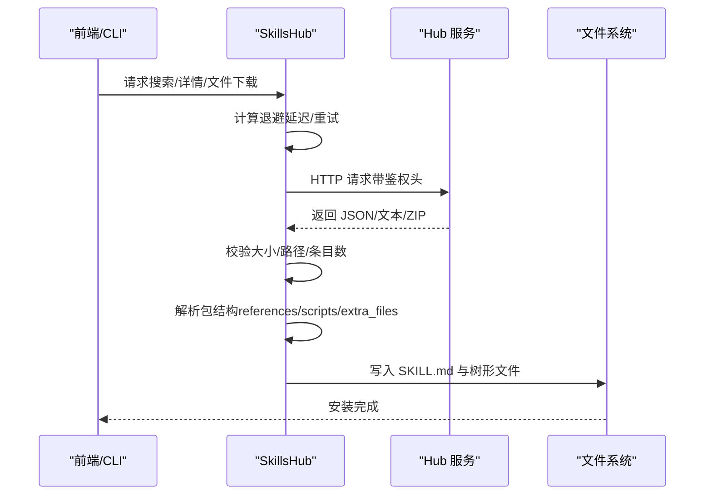
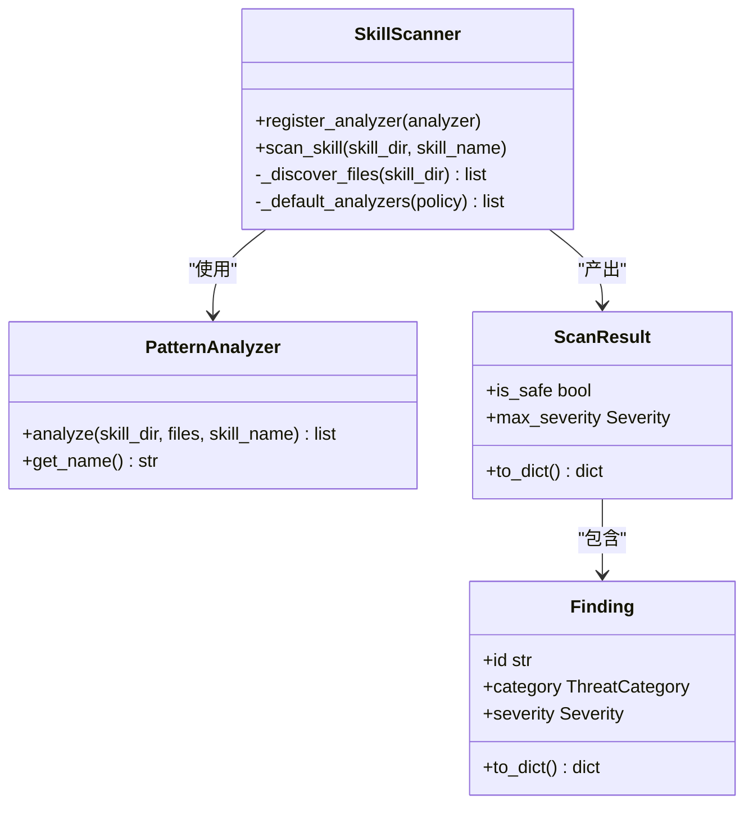
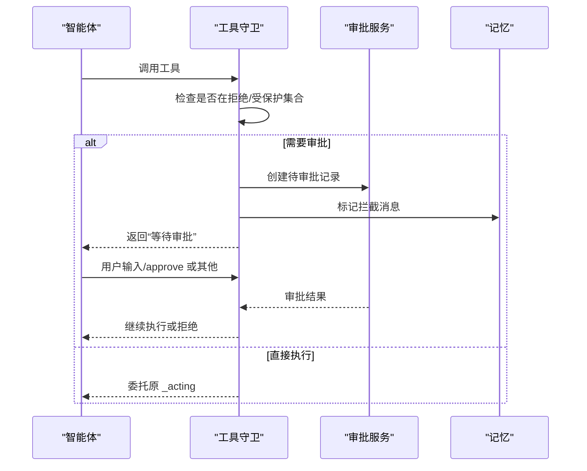
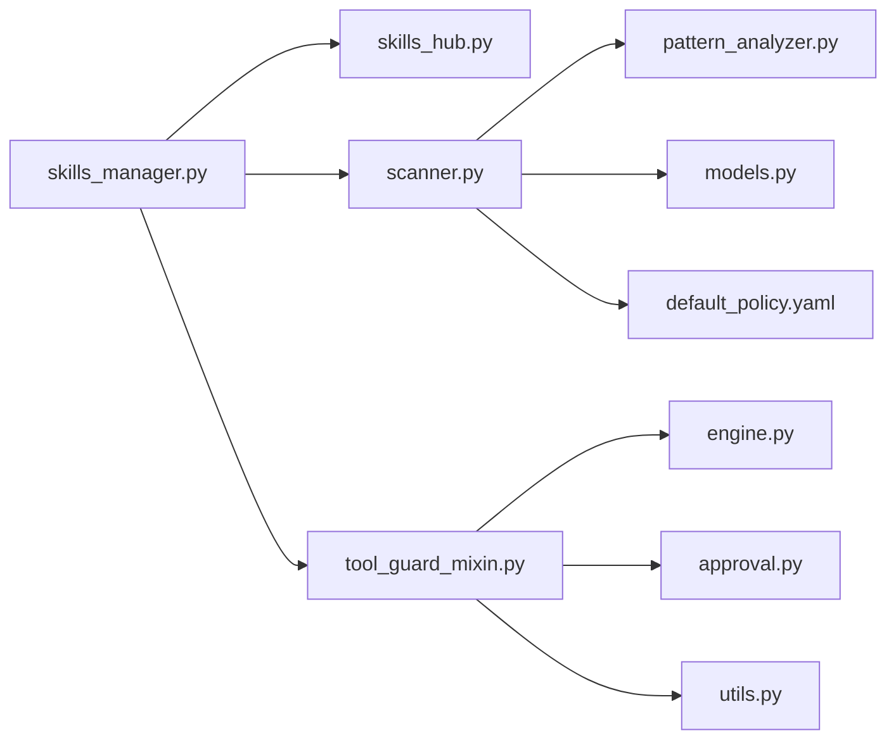

# 技能扩展系统

<cite>
**本文引用的文件**
- [skills_manager.py](file://src/copaw/agents/skills_manager.py)
- [skills_hub.py](file://src/copaw/agents/skills_hub.py)
- [tool_guard_mixin.py](file://src/copaw/agents/tool_guard_mixin.py)
- [scanner.py](file://src/copaw/security/skill_scanner/scanner.py)
- [models.py](file://src/copaw/security/skill_scanner/models.py)
- [pattern_analyzer.py](file://src/copaw/security/skill_scanner/analyzers/pattern_analyzer.py)
- [default_policy.yaml](file://src/copaw/security/skill_scanner/data/default_policy.yaml)
- [dangerous_shell_commands.yaml](file://src/copaw/security/tool_guard/rules/dangerous_shell_commands.yaml)
- [engine.py](file://src/copaw/security/tool_guard/engine.py)
- [approval.py](file://src/copaw/security/tool_guard/approval.py)
- [utils.py](file://src/copaw/security/tool_guard/utils.py)
- [SKILL.md（定时任务）](file://src/copaw/agents/skills/cron/SKILL.md)
- [SKILL.md（钉钉通道）](file://src/copaw/agents/skills/dingtalk_channel/SKILL.md)
- [SKILL.md（PDF 处理）](file://src/copaw/agents/skills/pdf/SKILL.md)
- [SKILL.md（Excel 处理）](file://src/copaw/agents/skills/xlsx/SKILL.md)
- [SKILL.md（PowerPoint 处理）](file://src/copaw/agents/skills/pptx/SKILL.md)
- [SKILL.md（新闻聚合）](file://src/copaw/agents/skills/news/SKILL.md)
- [SKILL.md（文件读取）](file://src/copaw/agents/skills/file_reader/SKILL.md)
- [SKILL.md（Himalaya）](file://src/copaw/agents/skills/himalaya/SKILL.md)
</cite>

## 目录
1. [简介](#简介)
2. [项目结构](#项目结构)
3. [核心组件](#核心组件)
4. [架构总览](#架构总览)
5. [详细组件分析](#详细组件分析)
6. [依赖分析](#依赖分析)
7. [性能考量](#性能考量)
8. [故障排查指南](#故障排查指南)
9. [结论](#结论)
10. [附录](#附录)

## 简介
本文件面向 CoPaw 的“技能扩展系统”，系统化阐述技能管理器的动态加载机制与技能注册流程；详解内置技能的功能特性（如定时任务、PDF 处理、Office 文档处理、新闻聚合等）；给出技能开发规范与 API 接口定义；提供自定义技能开发的完整指南（含模板、参数定义与安全考虑）；解释安全扫描机制与工具守卫的沙箱式执行思路；并附带性能优化与错误处理最佳实践及调试技巧。

## 项目结构
技能扩展系统由以下关键模块构成：
- 技能管理与工作区：技能目录结构、同步策略、导入导出与校验
- 技能仓库与安装：从 Hub 拉取、解包、校验与落盘
- 安全扫描：对技能包进行多维扫描与风险评估
- 工具守卫：运行时拦截敏感工具调用，支持预审与审批流
- 内置技能：提供常见能力（定时、PDF/Office 处理、新闻聚合等）

**图表来源**
- [skills_manager.py:1-1206](file://src/copaw/agents/skills_manager.py#L1-L1206)
- [skills_hub.py:1-1619](file://src/copaw/agents/skills_hub.py#L1-L1619)
- [tool_guard_mixin.py:1-349](file://src/copaw/agents/tool_guard_mixin.py#L1-L349)
- [scanner.py:1-319](file://src/copaw/security/skill_scanner/scanner.py#L1-L319)
- [models.py:1-235](file://src/copaw/security/skill_scanner/models.py#L1-L235)
- [pattern_analyzer.py](file://src/copaw/security/skill_scanner/analyzers/pattern_analyzer.py)
- [default_policy.yaml](file://src/copaw/security/skill_scanner/data/default_policy.yaml)
- [SKILL.md（定时任务）](file://src/copaw/agents/skills/cron/SKILL.md)
- [SKILL.md（PDF 处理）](file://src/copaw/agents/skills/pdf/SKILL.md)
- [SKILL.md（Excel 处理）](file://src/copaw/agents/skills/xlsx/SKILL.md)
- [SKILL.md（PowerPoint 处理）](file://src/copaw/agents/skills/pptx/SKILL.md)
- [SKILL.md（新闻聚合）](file://src/copaw/agents/skills/news/SKILL.md)
- [SKILL.md（文件读取）](file://src/copaw/agents/skills/file_reader/SKILL.md)
- [SKILL.md（钉钉通道）](file://src/copaw/agents/skills/dingtalk_channel/SKILL.md)
- [SKILL.md（Himalaya）](file://src/copaw/agents/skills/himalaya/SKILL.md)

**章节来源**
- [skills_manager.py:1-1206](file://src/copaw/agents/skills_manager.py#L1-L1206)
- [skills_hub.py:1-1619](file://src/copaw/agents/skills_hub.py#L1-L1619)

## 核心组件
- 技能管理器（SkillService/同步函数）
  - 负责从内置与自定义目录收集技能，构建 SkillInfo 列表，支持按需同步至 active_skills，并提供导入/导出与校验能力
- 技能仓库客户端（Skills Hub）
  - 提供从 Hub 拉取技能包、解析元数据、解压与树形落盘、取消检查与重试退避等能力
- 安全扫描器（SkillScanner）
  - 遍历技能包文件，按策略跳过/限制，调用各分析器（默认 PatternAnalyzer），汇总 ScanResult
- 工具守卫（ToolGuardMixin）
  - 在 ReActAgent 的 _acting/_reasoning 生命周期钩子中拦截敏感工具调用，支持自动拒绝、预审与审批流
- 内置技能
  - 提供定时任务、PDF/Office 文档处理、新闻聚合、文件读取、渠道适配等能力

**章节来源**
- [skills_manager.py:627-800](file://src/copaw/agents/skills_manager.py#L627-L800)
- [skills_hub.py:488-634](file://src/copaw/agents/skills_hub.py#L488-L634)
- [scanner.py:76-319](file://src/copaw/security/skill_scanner/scanner.py#L76-L319)
- [tool_guard_mixin.py:24-349](file://src/copaw/agents/tool_guard_mixin.py#L24-L349)

## 架构总览
技能扩展系统的控制流分为“静态装配”和“动态执行”两部分：
- 静态装配：初始化工作区 → 同步内置/自定义技能 → 导入 Hub 技能 → 安全扫描 → 可视化/API 展示
- 动态执行：工具守卫拦截 → 预审/审批 → 执行工具 → 记忆清理与结果回写

**图表来源**
- [skills_manager.py:183-260](file://src/copaw/agents/skills_manager.py#L183-L260)
- [skills_hub.py:488-634](file://src/copaw/agents/skills_hub.py#L488-L634)
- [scanner.py:148-242](file://src/copaw/security/skill_scanner/scanner.py#L148-L242)
- [tool_guard_mixin.py:103-181](file://src/copaw/agents/tool_guard_mixin.py#L103-L181)

## 详细组件分析

### 技能管理器与动态加载机制
- 目录结构与来源
  - 内置技能目录：agents/skills
  - 自定义技能目录：workspace/customized_skills
  - 激活技能目录：workspace/active_skills
- 加载与合并策略
  - 先读取内置技能，再读取自定义技能，同名以自定义覆盖
  - 支持按名称过滤与强制覆盖同步
- 技能信息结构（SkillInfo）
  - 包含 name/description/content/source/path/references/scripts
  - references/scripts 以树形字典表示目录结构
- 安全导入与校验
  - ZIP 解压前进行大小与路径合法性校验，禁止越界路径与符号链接
  - 从 ZIP 导入时校验 SKILL.md 必备字段（name/description），并清洗树形结构
- 创建新技能
  - 校验 SKILL.md YAML Front Matter，支持 references/scripts/extra_files 三类树形结构写入

**图表来源**
- [skills_manager.py:183-341](file://src/copaw/agents/skills_manager.py#L183-L341)

**章节来源**
- [skills_manager.py:63-121](file://src/copaw/agents/skills_manager.py#L63-L121)
- [skills_manager.py:183-341](file://src/copaw/agents/skills_manager.py#L183-L341)
- [skills_manager.py:394-520](file://src/copaw/agents/skills_manager.py#L394-L520)
- [skills_manager.py:529-625](file://src/copaw/agents/skills_manager.py#L529-L625)
- [skills_manager.py:699-800](file://src/copaw/agents/skills_manager.py#L699-L800)

### 技能仓库客户端与 Hub 安装流程
- 环境变量与重试退避
  - HTTP 超时、重试次数、指数退避基线与上限
- 取消检查与上下文
  - 使用 contextvar 注入取消检查器，支持用户中断
- 下载与解包
  - 限制最大响应体大小与条目数量，逐块读取避免内存峰值
  - 解析 Hub 返回的元数据，必要时回取文件内容，生成统一包结构
- 树形落盘
  - 将 references/scripts/extra_files 写入对应子目录，确保仅保留允许路径

**图表来源**
- [skills_hub.py:102-130](file://src/copaw/agents/skills_hub.py#L102-L130)
- [skills_hub.py:226-335](file://src/copaw/agents/skills_hub.py#L226-L335)
- [skills_hub.py:488-634](file://src/copaw/agents/skills_hub.py#L488-L634)
- [skills_hub.py:635-704](file://src/copaw/agents/skills_hub.py#L635-L704)

**章节来源**
- [skills_hub.py:70-100](file://src/copaw/agents/skills_hub.py#L70-L100)
- [skills_hub.py:108-129](file://src/copaw/agents/skills_hub.py#L108-L129)
- [skills_hub.py:183-224](file://src/copaw/agents/skills_hub.py#L183-L224)
- [skills_hub.py:488-634](file://src/copaw/agents/skills_hub.py#L488-L634)

### 安全扫描器与规则体系
- 扫描范围与限制
  - 文件遍历排除符号链接与越界路径；按策略/硬编码跳过二进制/归档/可执行等扩展名
  - 控制最大文件数与单文件大小
- 分析器编排
  - 默认启用 PatternAnalyzer；支持注册自定义分析器
  - 汇总各分析器结果，去重后生成 ScanResult
- 结果模型
  - Severity/ThreatCategory/Finding/ScanResult 等模型定义扫描结果与分类

**图表来源**
- [scanner.py:76-319](file://src/copaw/security/skill_scanner/scanner.py#L76-L319)
- [models.py:19-235](file://src/copaw/security/skill_scanner/models.py#L19-L235)
- [pattern_analyzer.py](file://src/copaw/security/skill_scanner/analyzers/pattern_analyzer.py)

**章节来源**
- [scanner.py:76-134](file://src/copaw/security/skill_scanner/scanner.py#L76-L134)
- [scanner.py:148-242](file://src/copaw/security/skill_scanner/scanner.py#L148-L242)
- [scanner.py:248-299](file://src/copaw/security/skill_scanner/scanner.py#L248-L299)
- [models.py:19-235](file://src/copaw/security/skill_scanner/models.py#L19-L235)

### 工具守卫与沙箱式执行思路
- 拦截点
  - _acting：在工具调用前进行拦截，支持自动拒绝、预审与审批
  - _reasoning：当等待审批时短路推理，提示用户操作
- 审批流
  - 通过审批服务记录待审批项，标记记忆中的“被拦截”消息，支持清理
- 混入设计
  - 与 ReActAgent 通过 MRO 组合，保持职责分离

**图表来源**
- [tool_guard_mixin.py:103-181](file://src/copaw/agents/tool_guard_mixin.py#L103-L181)
- [tool_guard_mixin.py:237-309](file://src/copaw/agents/tool_guard_mixin.py#L237-L309)
- [tool_guard_mixin.py:315-348](file://src/copaw/agents/tool_guard_mixin.py#L315-L348)

**章节来源**
- [tool_guard_mixin.py:24-48](file://src/copaw/agents/tool_guard_mixin.py#L24-L48)
- [tool_guard_mixin.py:103-181](file://src/copaw/agents/tool_guard_mixin.py#L103-L181)
- [tool_guard_mixin.py:237-309](file://src/copaw/agents/tool_guard_mixin.py#L237-L309)
- [tool_guard_mixin.py:315-348](file://src/copaw/agents/tool_guard_mixin.py#L315-L348)

### 内置技能功能概览
- 定时任务（cron）
  - 基于 CRON 表达式的周期性任务调度与心跳监控
- PDF 处理（pdf）
  - 提供表单提取、注释填充、图片转换、字段校验等脚本与参考文档
- Excel 处理（xlsx）
  - 提供公式重计算等脚本与编辑说明
- PowerPoint 处理（pptx）
  - 提供幻灯片增删、缩略图生成、模板与脚本说明
- 新闻聚合（news）
  - 提供聚合与展示能力
- 文件读取（file_reader）
  - 提供通用文件读取能力
- 钉钉通道（dingtalk_channel）
  - 提供企业微信通道适配
- Himalaya
  - 提供参考配置与说明

**章节来源**
- [SKILL.md（定时任务）](file://src/copaw/agents/skills/cron/SKILL.md)
- [SKILL.md（PDF 处理）](file://src/copaw/agents/skills/pdf/SKILL.md)
- [SKILL.md（Excel 处理）](file://src/copaw/agents/skills/xlsx/SKILL.md)
- [SKILL.md（PowerPoint 处理）](file://src/copaw/agents/skills/pptx/SKILL.md)
- [SKILL.md（新闻聚合）](file://src/copaw/agents/skills/news/SKILL.md)
- [SKILL.md（文件读取）](file://src/copaw/agents/skills/file_reader/SKILL.md)
- [SKILL.md（钉钉通道）](file://src/copaw/agents/skills/dingtalk_channel/SKILL.md)
- [SKILL.md（Himalaya）](file://src/copaw/agents/skills/himalaya/SKILL.md)

## 依赖分析
- 组件耦合
  - SkillService 依赖 skills_manager 的目录扫描与树形写入
  - SkillsHub 依赖 SkillService 的导入/校验流程
  - SkillScanner 依赖 analyzers 与策略配置
  - ToolGuardMixin 依赖审批服务与记忆模块
- 外部依赖
  - HTTP 客户端、YAML/JSON 解析、frontmatter、zipfile、pathlib 等

**图表来源**
- [skills_manager.py:1-1206](file://src/copaw/agents/skills_manager.py#L1-L1206)
- [skills_hub.py:1-1619](file://src/copaw/agents/skills_hub.py#L1-L1619)
- [scanner.py:1-319](file://src/copaw/security/skill_scanner/scanner.py#L1-L319)
- [models.py:1-235](file://src/copaw/security/skill_scanner/models.py#L1-L235)
- [pattern_analyzer.py](file://src/copaw/security/skill_scanner/analyzers/pattern_analyzer.py)
- [default_policy.yaml](file://src/copaw/security/skill_scanner/data/default_policy.yaml)
- [engine.py](file://src/copaw/security/tool_guard/engine.py)
- [approval.py](file://src/copaw/security/tool_guard/approval.py)
- [utils.py](file://src/copaw/security/tool_guard/utils.py)

**章节来源**
- [skills_manager.py:1-1206](file://src/copaw/agents/skills_manager.py#L1-L1206)
- [skills_hub.py:1-1619](file://src/copaw/agents/skills_hub.py#L1-L1619)
- [scanner.py:1-319](file://src/copaw/security/skill_scanner/scanner.py#L1-L319)
- [tool_guard_mixin.py:1-349](file://src/copaw/agents/tool_guard_mixin.py#L1-L349)

## 性能考量
- I/O 与内存
  - 技能扫描限制最大文件数与单文件大小，避免大体积二进制导致内存压力
  - ZIP 解压采用分块读取，避免一次性加载超大响应体
- 网络与重试
  - 指数退避与可配置超时/重试，降低 Hub 不稳定带来的影响
- 目录遍历
  - 排除符号链接与越界路径，减少无效 I/O 并提升安全性

**章节来源**
- [scanner.py:70-74](file://src/copaw/security/skill_scanner/scanner.py#L70-L74)
- [scanner.py:248-299](file://src/copaw/security/skill_scanner/scanner.py#L248-L299)
- [skills_hub.py:102-106](file://src/copaw/agents/skills_hub.py#L102-L106)
- [skills_hub.py:183-224](file://src/copaw/agents/skills_hub.py#L183-L224)

## 故障排查指南
- 技能未生效
  - 检查 active_skills 是否存在且包含 SKILL.md
  - 使用 ensure_skills_initialized 查看日志提示
- ZIP 导入失败
  - 检查压缩包大小与条目数是否超过限制
  - 确认路径不包含越界或符号链接
- Hub 请求异常
  - 关注 429/5xx 与速率限制提示，设置 GITHUB_TOKEN 提升限额
  - 检查网络与代理配置
- 安全扫描不通过
  - 查看 ScanResult 中高危/严重发现，按建议修复
- 工具被拦截
  - 查看审批服务中的待审批项，确认是否需要预审或人工批准

**章节来源**
- [skills_manager.py:366-392](file://src/copaw/agents/skills_manager.py#L366-L392)
- [skills_hub.py:251-301](file://src/copaw/agents/skills_hub.py#L251-L301)
- [scanner.py:204-213](file://src/copaw/security/skill_scanner/scanner.py#L204-L213)
- [tool_guard_mixin.py:174-179](file://src/copaw/agents/tool_guard_mixin.py#L174-L179)

## 结论
CoPaw 的技能扩展系统通过“工作区目录 + Hub 安装 + 安全扫描 + 工具守卫”的组合，实现了从技能装配到运行期安全的闭环。技能管理器负责动态加载与合并，技能仓库提供便捷的生态分发，安全扫描与工具守卫则保障了技能包与工具调用的安全性。内置技能覆盖文档处理、定时任务与消息通道等高频场景，便于快速落地。

## 附录

### 技能开发规范与 API 接口定义
- 目录结构
  - SKILL.md（必需，包含 YAML Front Matter 的 name/description）
  - references/（可选，参考材料）
  - scripts/（可选，运行脚本）
  - 其他根级资产（可选）
- API 关键点
  - 技能创建：支持 references/scripts/extra_files 三类树形结构写入
  - ZIP 导入：校验 SKILL.md 字段、路径安全与大小限制
  - 同步策略：自定义覆盖内置，支持按名称过滤与强制覆盖
- 开发建议
  - 明确技能边界与最小权限原则
  - 在 references 提供使用说明与依赖清单
  - 在 scripts 中提供幂等、可重试的实现

**章节来源**
- [skills_manager.py:699-800](file://src/copaw/agents/skills_manager.py#L699-L800)
- [skills_manager.py:529-625](file://src/copaw/agents/skills_manager.py#L529-L625)
- [skills_manager.py:183-260](file://src/copaw/agents/skills_manager.py#L183-L260)

### 自定义技能开发完整指南
- 步骤
  - 准备 SKILL.md（含 name/description），编写 references/scripts
  - 使用 SkillService.create_skill 或从 ZIP 导入
  - 进行安全扫描与测试
  - 在 active_skills 中启用并验证
- 参数定义
  - name：技能目录名（将作为 UI/API 的标识）
  - content：SKILL.md 内容（含 YAML Front Matter）
  - references/scripts/extra_files：树形结构（文件内容或嵌套目录）
- 安全考虑
  - 避免硬编码凭据与敏感路径
  - 严格限制文件类型与大小
  - 使用工具守卫拦截高风险工具调用

**章节来源**
- [skills_manager.py:699-800](file://src/copaw/agents/skills_manager.py#L699-L800)
- [scanner.py:70-74](file://src/copaw/security/skill_scanner/scanner.py#L70-L74)
- [tool_guard_mixin.py:103-181](file://src/copaw/agents/tool_guard_mixin.py#L103-L181)

### 调试技巧
- 日志级别
  - 使用 debug/warning/info 级别定位问题（如未发现技能、扫描失败、拦截记录）
- 快速验证
  - 通过 list_available_skills/list_all_skills 快速确认技能状态
  - 使用 ensure_skills_initialized 输出加载摘要
- 网络与 Hub
  - 设置 COPAW_SKILLS_HUB_HTTP_TIMEOUT/RETRIES/BACKOFF 环境变量优化稳定性
  - 遇到 429/5xx 时查看重试与退避日志

**章节来源**
- [skills_manager.py:344-392](file://src/copaw/agents/skills_manager.py#L344-L392)
- [skills_hub.py:70-100](file://src/copaw/agents/skills_hub.py#L70-L100)
- [scanner.py:204-213](file://src/copaw/security/skill_scanner/scanner.py#L204-L213)