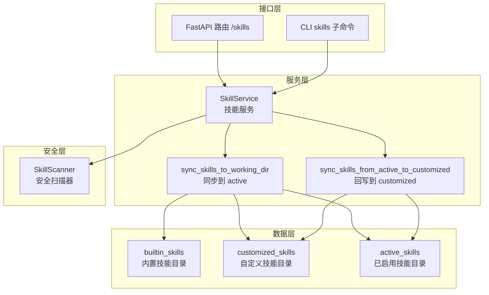
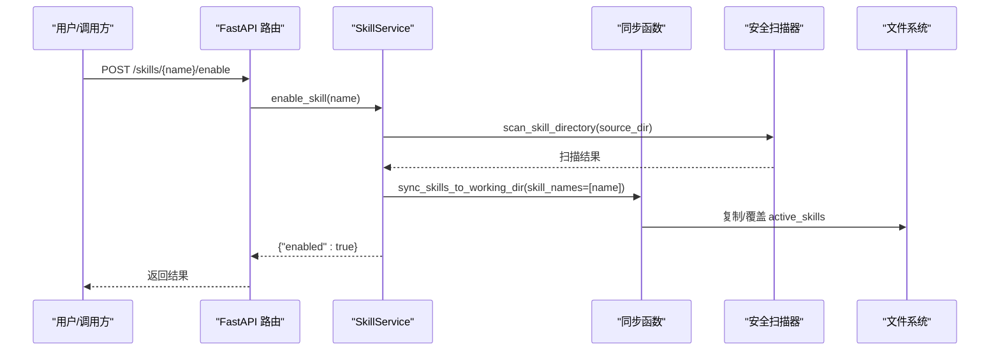
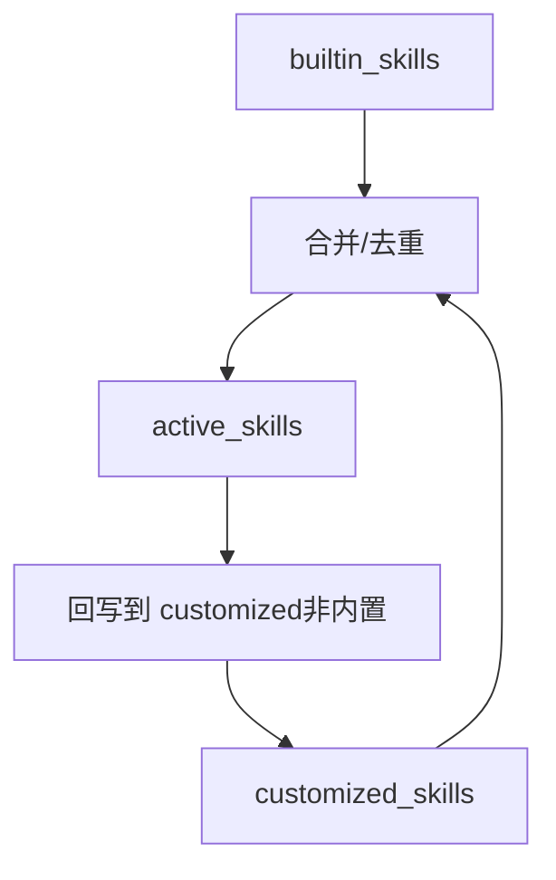
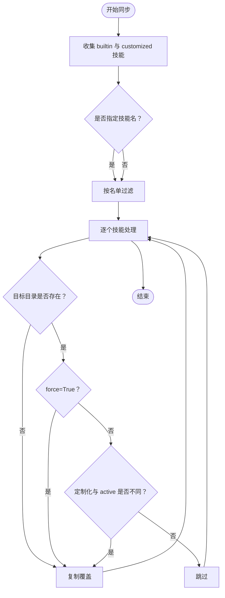
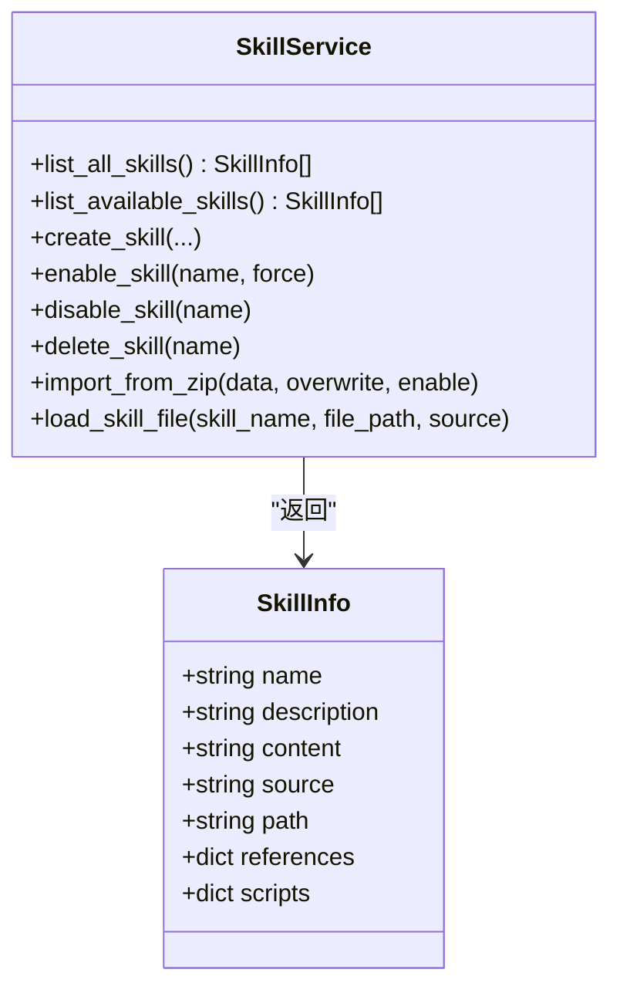
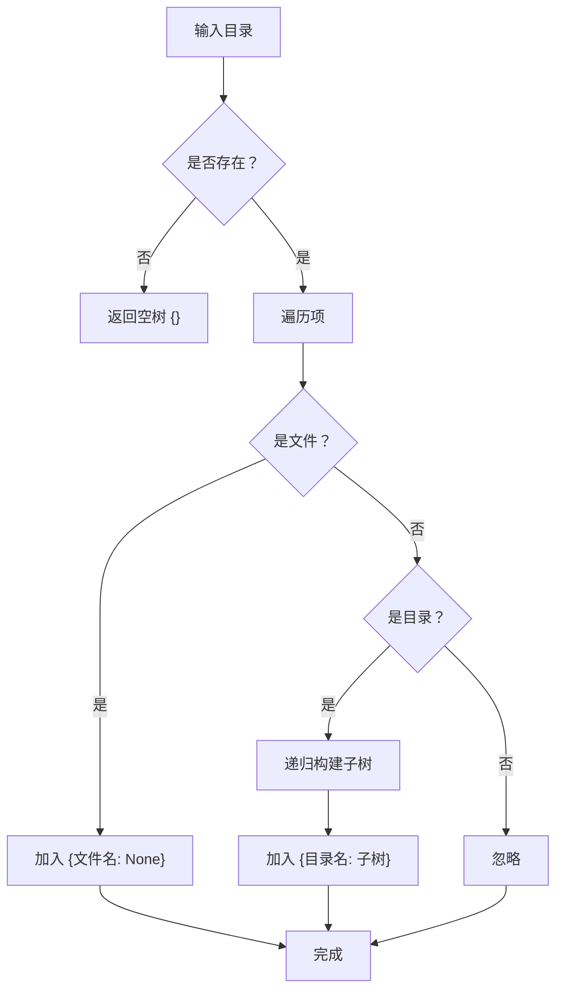
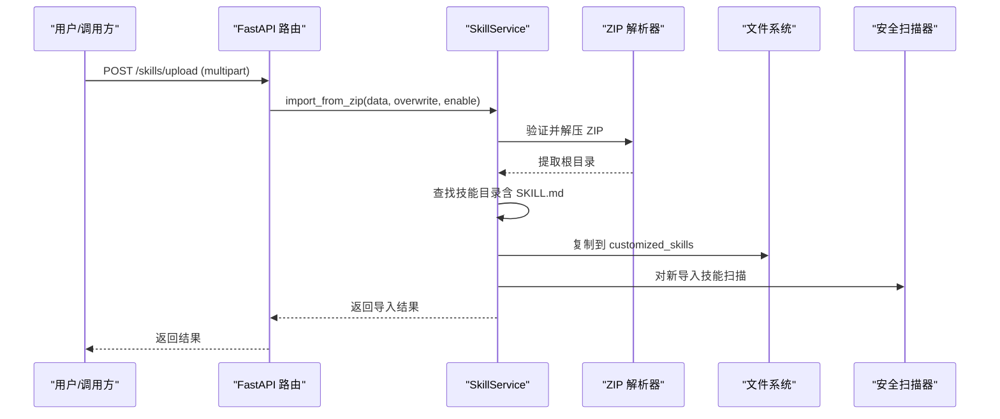
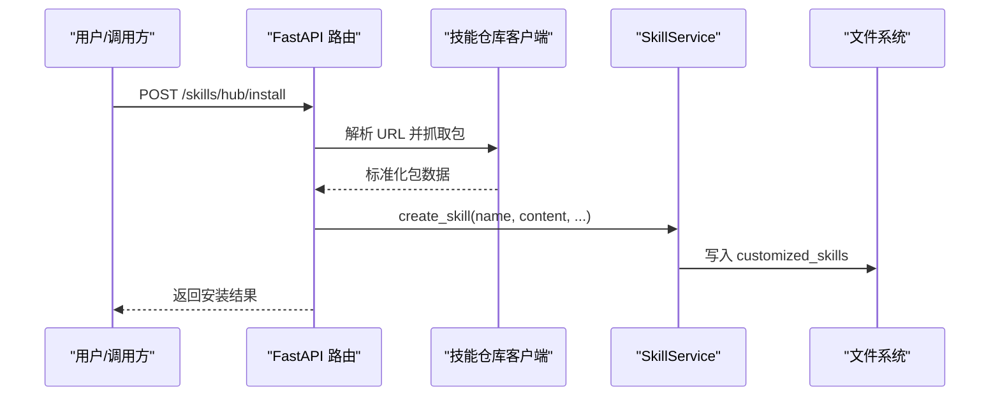
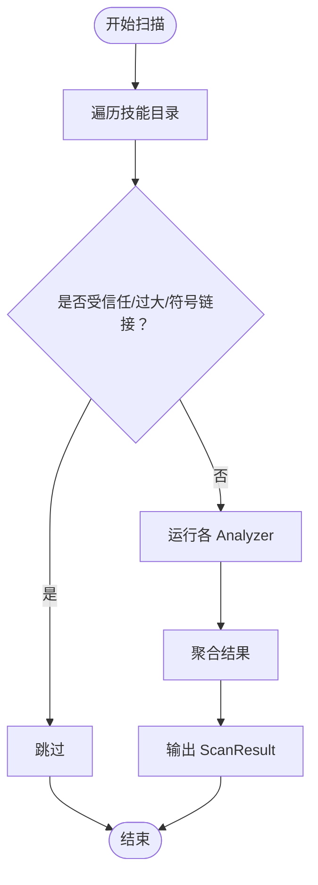
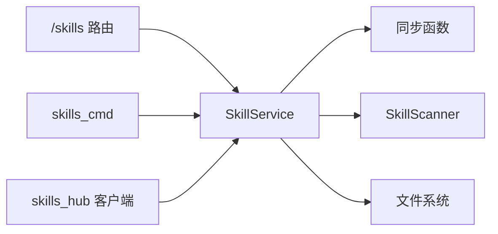

# 技能管理器

<cite>
**本文引用的文件**
- [skills_manager.py](file://src/copaw/agents/skills_manager.py)
- [skills_hub.py](file://src/copaw/agents/skills_hub.py)
- [skills.py](file://src/copaw/app/routers/skills.py)
- [skills_cmd.py](file://src/copaw/cli/skills_cmd.py)
- [scanner.py](file://src/copaw/security/skill_scanner/scanner.py)
- [docx/SKILL.md](file://src/copaw/agents/skills/docx/SKILL.md)
- [pdf/SKILL.md](file://src/copaw/agents/skills/pdf/SKILL.md)
</cite>

## 目录
1. [简介](#简介)
2. [项目结构](#项目结构)
3. [核心组件](#核心组件)
4. [架构总览](#架构总览)
5. [详细组件分析](#详细组件分析)
6. [依赖关系分析](#依赖关系分析)
7. [性能考量](#性能考量)
8. [故障排查指南](#故障排查指南)
9. [结论](#结论)
10. [附录：API 使用示例](#附录api-使用示例)

## 简介
本文件系统性阐述 CoPaw 的技能管理器，涵盖以下关键主题：
- 技能的动态加载机制与目录结构（builtin/customized/active）
- 同步策略与版本管理
- 技能列表读取与 SkillInfo 结构
- 技能树构建算法
- 导入/导出、ZIP 包处理与安全验证
- 通过 CLI 与 Web API 进行技能管理的操作流程

## 项目结构
技能管理器由后端 Python 模块、Web 路由器、CLI 命令以及安全扫描器组成，形成“服务层 + 接口层 + 安全层”的分层设计。

图表来源
- [skills_manager.py:183-260](file://src/copaw/agents/skills_manager.py#L183-L260)
- [skills_manager.py:263-341](file://src/copaw/agents/skills_manager.py#L263-L341)
- [skills.py:119-161](file://src/copaw/app/routers/skills.py#L119-L161)
- [skills_cmd.py:29-124](file://src/copaw/cli/skills_cmd.py#L29-L124)
- [scanner.py:148-242](file://src/copaw/security/skill_scanner/scanner.py#L148-L242)

章节来源
- [skills_manager.py:63-76](file://src/copaw/agents/skills_manager.py#L63-L76)
- [skills.py:119-161](file://src/copaw/app/routers/skills.py#L119-L161)
- [skills_cmd.py:29-124](file://src/copaw/cli/skills_cmd.py#L29-L124)

## 核心组件
- SkillInfo：技能信息结构体，承载名称、描述、内容、来源、路径及 references/scripts 目录树。
- SkillService：技能服务类，负责技能的创建、启用/禁用、删除、导入 ZIP、文件读取等。
- 同步函数：将 builtin 与 customized 合并到 active_skills，并在回写时处理版本升级与覆盖逻辑。
- 技能仓库客户端：支持从多种外部源（ClawHub、LobeHub、ModelScope、GitHub 等）拉取技能包。
- 安全扫描器：对技能包进行静态扫描，阻断高危风险。

章节来源
- [skills_manager.py:28-61](file://src/copaw/agents/skills_manager.py#L28-L61)
- [skills_manager.py:627-941](file://src/copaw/agents/skills_manager.py#L627-L941)
- [skills_manager.py:183-260](file://src/copaw/agents/skills_manager.py#L183-L260)
- [skills_manager.py:263-341](file://src/copaw/agents/skills_manager.py#L263-L341)
- [skills_hub.py:1567-1599](file://src/copaw/agents/skills_hub.py#L1567-L1599)
- [scanner.py:148-242](file://src/copaw/security/skill_scanner/scanner.py#L148-L242)

## 架构总览
技能管理器围绕“目录树 + 版本元数据 + 安全扫描”展开，形成如下闭环：
- 读取：从 builtin 与 customized 合并技能，去重优先定制化。
- 同步：将合并结果写入 active_skills；若存在定制化变更则覆盖；若为内置技能且版本更高则回写。
- 回写：首次将 active_skills 写入 customized（非内置技能），后续仅在版本升级时更新。
- 安全：启用前/后均执行扫描，阻断高危风险。
- 导入：支持 ZIP 包与外部仓库直链导入，统一标准化为 SkillInfo 并写入 customized。

图表来源
- [skills.py:626-693](file://src/copaw/app/routers/skills.py#L626-L693)
- [skills_manager.py:893-940](file://src/copaw/agents/skills_manager.py#L893-L940)
- [scanner.py:148-242](file://src/copaw/security/skill_scanner/scanner.py#L148-L242)

## 详细组件分析

### 目录结构与职责
- builtin_skills：内置技能目录，来自代码包内资源，包含 SKILL.md 与可选的 references/scripts 子树。
- customized_skills：工作区内的自定义技能目录，用户创建或导入的技能存放于此。
- active_skills：当前已启用的技能集合，由同步流程从 builtin/customized 生成。

图表来源
- [skills_manager.py:63-76](file://src/copaw/agents/skills_manager.py#L63-L76)
- [skills_manager.py:206-224](file://src/copaw/agents/skills_manager.py#L206-L224)
- [skills_manager.py:297-318](file://src/copaw/agents/skills_manager.py#L297-L318)

章节来源
- [skills_manager.py:63-76](file://src/copaw/agents/skills_manager.py#L63-L76)
- [skills_manager.py:206-224](file://src/copaw/agents/skills_manager.py#L206-L224)

### 同步策略与版本管理
- 合并顺序：先读取 builtin，再读取 customized（同名以定制化为准）。
- 强制覆盖：当 force=True 或定制化与 active 不一致时，覆盖 active。
- 版本升级：若 active 中为内置技能且 builtin 版本更高，则回写 active 并计为同步成功。
- 回写规则：首次将 active 中的非内置技能写入 customized；后续仅在版本升级时更新。

图表来源
- [skills_manager.py:183-260](file://src/copaw/agents/skills_manager.py#L183-L260)
- [skills_manager.py:263-341](file://src/copaw/agents/skills_manager.py#L263-L341)

章节来源
- [skills_manager.py:183-260](file://src/copaw/agents/skills_manager.py#L183-L260)
- [skills_manager.py:263-341](file://src/copaw/agents/skills_manager.py#L263-L341)

### 技能列表读取与 SkillInfo 结构
- 列表读取：遍历目录，解析每个技能的 SKILL.md，提取描述与元数据，构建 SkillInfo。
- 目录树：references 与 scripts 目录被转换为嵌套字典结构，便于前端展示与编辑。
- 去重策略：同名技能以定制化为准，避免重复显示。

图表来源
- [skills_manager.py:28-61](file://src/copaw/agents/skills_manager.py#L28-L61)
- [skills_manager.py:394-470](file://src/copaw/agents/skills_manager.py#L394-L470)
- [skills_manager.py:649-685](file://src/copaw/agents/skills_manager.py#L649-L685)

章节来源
- [skills_manager.py:28-61](file://src/copaw/agents/skills_manager.py#L28-L61)
- [skills_manager.py:394-470](file://src/copaw/agents/skills_manager.py#L394-L470)
- [skills_manager.py:649-685](file://src/copaw/agents/skills_manager.py#L649-L685)

### 技能树构建算法
- 目录树递归：遍历目录，将文件表示为 None，子目录递归展开为嵌套字典。
- 参考与脚本树：分别从 references 与 scripts 目录构建独立的树结构，用于 UI 展示与 API 访问。

图表来源
- [skills_manager.py:87-121](file://src/copaw/agents/skills_manager.py#L87-L121)

章节来源
- [skills_manager.py:87-121](file://src/copaw/agents/skills_manager.py#L87-L121)

### 导入/导出与 ZIP 包处理
- ZIP 解压与校验：限制最大解压体积、禁止危险路径与符号链接，确保安全性。
- 技能发现：在 ZIP 根或单层包装目录中查找包含 SKILL.md 的技能目录。
- 导入流程：校验 YAML Front Matter，复制到 customized_skills，必要时执行安全扫描与自动启用。

图表来源
- [skills.py:463-514](file://src/copaw/app/routers/skills.py#L463-L514)
- [skills_manager.py:1000-1086](file://src/copaw/agents/skills_manager.py#L1000-L1086)
- [skills_manager.py:529-550](file://src/copaw/agents/skills_manager.py#L529-L550)

章节来源
- [skills.py:463-514](file://src/copaw/app/routers/skills.py#L463-L514)
- [skills_manager.py:1000-1086](file://src/copaw/agents/skills_manager.py#L1000-L1086)
- [skills_manager.py:529-550](file://src/copaw/agents/skills_manager.py#L529-L550)

### 外部仓库导入（ClawHub/LobeHub/ModelScope/GitHub）
- URL 解析：根据 URL 类型选择对应抓取器（ClawHub、LobeHub、ModelScope、GitHub 等）。
- 包标准化：统一为包含 name、content、references、scripts、extra_files 的结构。
- 安装流程：创建技能（写入 customized），可选启用并回写 active。

图表来源
- [skills.py:344-388](file://src/copaw/app/routers/skills.py#L344-L388)
- [skills_hub.py:1567-1599](file://src/copaw/agents/skills_hub.py#L1567-L1599)
- [skills_manager.py:699-800](file://src/copaw/agents/skills_manager.py#L699-L800)

章节来源
- [skills_hub.py:1567-1599](file://src/copaw/agents/skills_hub.py#L1567-L1599)
- [skills_manager.py:699-800](file://src/copaw/agents/skills_manager.py#L699-L800)

### 安全验证与扫描
- 扫描范围：遍历技能目录，排除受信任扩展与大文件，避免误报与性能问题。
- 扫描时机：启用前（预激活）与导入后（后置）均可触发扫描。
- 错误处理：扫描异常可降级记录日志，不影响导入/启用流程。

图表来源
- [scanner.py:248-299](file://src/copaw/security/skill_scanner/scanner.py#L248-L299)
- [scanner.py:148-242](file://src/copaw/security/skill_scanner/scanner.py#L148-L242)

章节来源
- [scanner.py:148-242](file://src/copaw/security/skill_scanner/scanner.py#L148-L242)
- [scanner.py:248-299](file://src/copaw/security/skill_scanner/scanner.py#L248-L299)

### API 与 CLI 使用场景
- Web API
  - 获取所有技能：GET /skills
  - 获取可用技能：GET /skills/available
  - 启用技能：POST /skills/{name}/enable
  - 禁用技能：POST /skills/{name}/disable
  - 创建技能：POST /skills
  - 上传 ZIP：POST /skills/upload
  - 批量禁用：POST /skills/batch-disable
  - 加载技能文件：GET /skills/{skill_name}/files/{source}/{file_path}
- CLI
  - 列出技能：copaw skills list
  - 交互式配置：copaw skills config

章节来源
- [skills.py:122-193](file://src/copaw/app/routers/skills.py#L122-L193)
- [skills.py:568-693](file://src/copaw/app/routers/skills.py#L568-L693)
- [skills_cmd.py:127-181](file://src/copaw/cli/skills_cmd.py#L127-L181)

## 依赖关系分析
- SkillService 依赖同步函数与安全扫描器，同时暴露给 FastAPI 路由与 CLI。
- 同步函数依赖目录工具与版本解析（SKILL.md frontmatter）。
- 技能仓库客户端依赖网络请求与 ZIP 解析，最终通过 SkillService 写入本地。

图表来源
- [skills.py:119-161](file://src/copaw/app/routers/skills.py#L119-L161)
- [skills_cmd.py:29-124](file://src/copaw/cli/skills_cmd.py#L29-L124)
- [skills_manager.py:627-941](file://src/copaw/agents/skills_manager.py#L627-L941)
- [skills_hub.py:1567-1599](file://src/copaw/agents/skills_hub.py#L1567-L1599)

章节来源
- [skills.py:119-161](file://src/copaw/app/routers/skills.py#L119-L161)
- [skills_cmd.py:29-124](file://src/copaw/cli/skills_cmd.py#L29-L124)
- [skills_manager.py:627-941](file://src/copaw/agents/skills_manager.py#L627-L941)
- [skills_hub.py:1567-1599](file://src/copaw/agents/skills_hub.py#L1567-L1599)

## 性能考量
- 目录遍历与 ZIP 解压：通过限制最大体积与文件数量，避免内存与磁盘压力。
- 版本比较：仅在内置技能场景下进行版本号比较，减少不必要的 IO。
- 扫描策略：默认跳过常见二进制与压缩文件，降低扫描时间。
- 异步与线程：Web API 在导入 ZIP 时使用线程池，避免阻塞事件循环。

章节来源
- [skills_manager.py:521-550](file://src/copaw/agents/skills_manager.py#L521-L550)
- [scanner.py:76-134](file://src/copaw/security/skill_scanner/scanner.py#L76-L134)
- [skills.py:497-502](file://src/copaw/app/routers/skills.py#L497-L502)

## 故障排查指南
- 同步失败
  - 检查 builtin/customized 目录是否存在与权限。
  - 确认 force 参数与定制化差异判定逻辑。
- 启用失败
  - 查看安全扫描错误响应，定位高危规则。
  - 确认 SKILL.md Front Matter 是否完整。
- 导入 ZIP 失败
  - 检查 ZIP 是否有效、是否包含 SKILL.md。
  - 关注大小限制与路径合法性。
- 外部仓库导入失败
  - 检查 URL 类型与网络连通性。
  - 若为 GitHub，检查 GITHUB_TOKEN 与速率限制。

章节来源
- [skills_manager.py:183-260](file://src/copaw/agents/skills_manager.py#L183-L260)
- [skills_manager.py:893-940](file://src/copaw/agents/skills_manager.py#L893-L940)
- [skills_manager.py:1000-1086](file://src/copaw/agents/skills_manager.py#L1000-L1086)
- [skills_hub.py:226-335](file://src/copaw/agents/skills_hub.py#L226-L335)
- [skills.py:28-50](file://src/copaw/app/routers/skills.py#L28-L50)

## 结论
CoPaw 技能管理器通过清晰的目录分层、严谨的同步与版本策略、完善的 ZIP 与外部仓库导入能力，以及严格的安全扫描，实现了可维护、可扩展、可审计的技能生命周期管理。结合 Web API 与 CLI，用户可以灵活地进行技能的创建、启用、禁用、导入与导出。

## 附录：API 使用示例
- 获取所有技能
  - 请求：GET /skills
  - 响应：SkillSpec 数组（包含 enabled 字段）
- 启用技能
  - 请求：POST /skills/{name}/enable
  - 行为：预扫描 + 同步到 active_skills
- 禁用技能
  - 请求：POST /skills/{name}/disable
  - 行为：删除 active_skills 下对应目录
- 创建技能
  - 请求：POST /skills（JSON：name、content、references、scripts）
  - 行为：写入 customized_skills，可选启用
- 上传 ZIP
  - 请求：POST /skills/upload（multipart：file、enable、overwrite）
  - 行为：解压 + 校验 + 导入 + 可选启用
- 批量禁用
  - 请求：POST /skills/batch-disable（JSON：skill_name[]）

章节来源
- [skills.py:122-193](file://src/copaw/app/routers/skills.py#L122-L193)
- [skills.py:568-693](file://src/copaw/app/routers/skills.py#L568-L693)
- [skills.py:463-514](file://src/copaw/app/routers/skills.py#L463-L514)
- [skills.py:517-530](file://src/copaw/app/routers/skills.py#L517-L530)