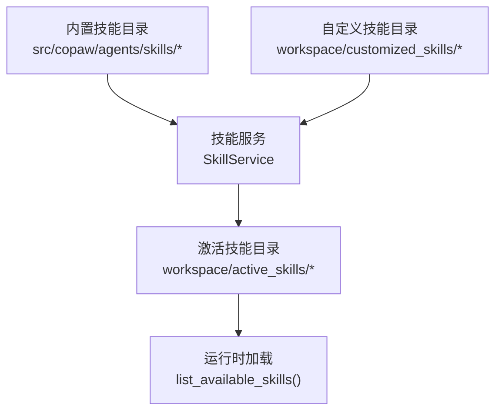
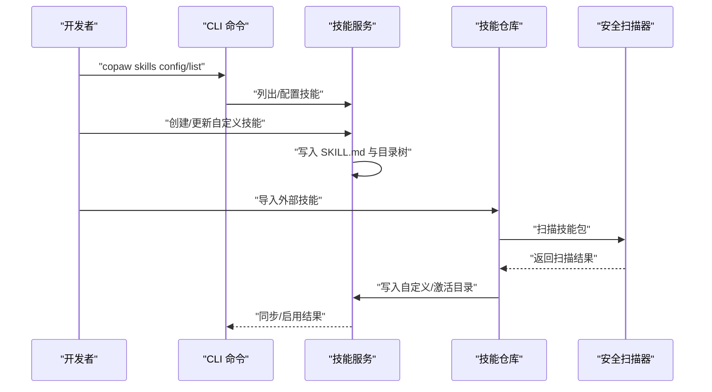
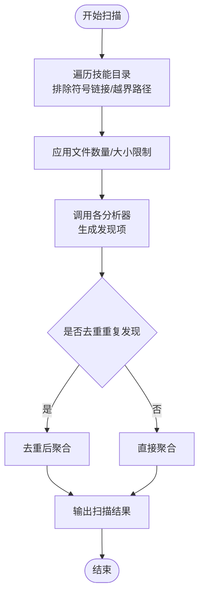
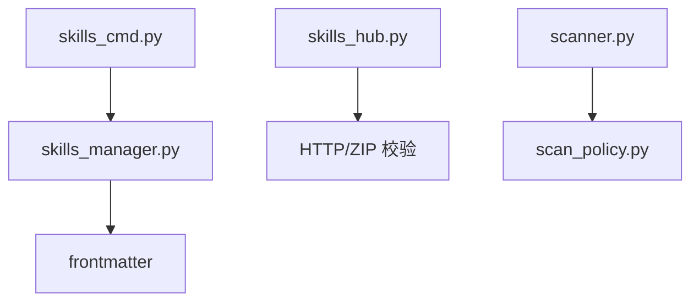

# 自定义技能开发

<cite>
**本文引用的文件**
- [skills_manager.py](file://src/copaw/agents/skills_manager.py)
- [skills_hub.py](file://src/copaw/agents/skills_hub.py)
- [scanner.py](file://src/copaw/security/skill_scanner/scanner.py)
- [models.py](file://src/copaw/security/skill_scanner/models.py)
- [scan_policy.py](file://src/copaw/security/skill_scanner/scan_policy.py)
- [default_policy.yaml](file://src/copaw/security/skill_scanner/data/default_policy.yaml)
- [SKILL.md](file://src/copaw/agents/skills/cron/SKILL.md)
- [SKILL.md](file://src/copaw/agents/skills/docx/SKILL.md)
- [SKILL.md](file://src/copaw/agents/skills/pdf/SKILL.md)
- [accept_changes.py](file://src/copaw/agents/skills/docx/scripts/accept_changes.py)
- [check_bounding_boxes.py](file://src/copaw/agents/skills/pdf/scripts/check_bounding_boxes.py)
- [fill_pdf_form_with_annotations.py](file://src/copaw/agents/skills/pdf/scripts/fill_pdf_form_with_annotations.py)
- [skills_cmd.py](file://src/copaw/cli/skills_cmd.py)
</cite>

## 目录
1. [简介](#简介)
2. [项目结构](#项目结构)
3. [核心组件](#核心组件)
4. [架构总览](#架构总览)
5. [详细组件分析](#详细组件分析)
6. [依赖分析](#依赖分析)
7. [性能考虑](#性能考虑)
8. [故障排查指南](#故障排查指南)
9. [结论](#结论)
10. [附录](#附录)

## 简介
本指南面向希望在 CoPaw 中开发与发布自定义技能的开发者。文档覆盖从技能模板创建、目录结构规范、YAML Front Matter 字段说明，到技能脚本编写、安全扫描、调试与性能优化，以及打包、发布与版本管理的最佳实践。读者无需深入编程背景即可按步骤完成高质量技能开发。

## 项目结构
CoPaw 的技能体系由“内置技能”“自定义技能”“激活技能”三层目录构成，并通过技能服务进行同步与管理：
- 内置技能目录：包含官方提供的技能模板与示例
- 自定义技能目录：开发者本地创建与修改的技能
- 激活技能目录：运行时生效的技能集合

图表来源
- [skills_manager.py:63-84](file://src/copaw/agents/skills_manager.py#L63-L84)
- [skills_manager.py:183-260](file://src/copaw/agents/skills_manager.py#L183-L260)
- [skills_manager.py:344-363](file://src/copaw/agents/skills_manager.py#L344-L363)

章节来源
- [skills_manager.py:63-84](file://src/copaw/agents/skills_manager.py#L63-L84)
- [skills_manager.py:183-260](file://src/copaw/agents/skills_manager.py#L183-L260)
- [skills_manager.py:344-363](file://src/copaw/agents/skills_manager.py#L344-L363)

## 核心组件
- 技能服务（SkillService）：负责技能的读取、创建、同步与启用/禁用，统一管理内置与自定义技能
- 技能仓库（Skills Hub）：提供从外部源导入技能的能力，支持从网络下载并校验
- 安全扫描器（SkillScanner）：对技能包进行静态扫描，识别潜在威胁
- 扫描策略（ScanPolicy）：可定制的扫描规则与阈值，支持组织级策略覆盖
- CLI 技能命令：提供交互式技能配置与列表查看

章节来源
- [skills_manager.py:627-800](file://src/copaw/agents/skills_manager.py#L627-L800)
- [skills_hub.py:488-633](file://src/copaw/agents/skills_hub.py#L488-L633)
- [scanner.py:76-242](file://src/copaw/security/skill_scanner/scanner.py#L76-L242)
- [scan_policy.py:156-177](file://src/copaw/security/skill_scanner/scan_policy.py#L156-L177)
- [skills_cmd.py:127-182](file://src/copaw/cli/skills_cmd.py#L127-L182)

## 架构总览
技能开发与运行的关键流程如下：
- 开发者在自定义技能目录创建新技能（含 SKILL.md 与可选的 references/scripts 子目录）
- 通过技能服务将自定义技能同步至激活技能目录
- 运行时仅加载激活技能目录中的技能
- 导入外部技能时，先进行安全扫描，再写入自定义或激活目录
- CLI 支持交互式选择启用哪些技能

图表来源
- [skills_cmd.py:127-182](file://src/copaw/cli/skills_cmd.py#L127-L182)
- [skills_manager.py:699-800](file://src/copaw/agents/skills_manager.py#L699-L800)
- [skills_hub.py:488-633](file://src/copaw/agents/skills_hub.py#L488-L633)
- [scanner.py:148-242](file://src/copaw/security/skill_scanner/scanner.py#L148-L242)

## 详细组件分析

### 技能模板与目录结构
- 每个技能以独立目录存在，根目录必须包含 SKILL.md 文件
- 可选子目录：
  - references：存放文档、参考材料等非执行文件
  - scripts：存放可执行脚本（Python/Shell/JS 等）
- 目录树结构会被序列化为嵌套字典，用于前端展示与打包

章节来源
- [skills_manager.py:28-61](file://src/copaw/agents/skills_manager.py#L28-L61)
- [skills_manager.py:440-451](file://src/copaw/agents/skills_manager.py#L440-L451)
- [skills_manager.py:473-519](file://src/copaw/agents/skills_manager.py#L473-L519)

### SKILL.md 的 YAML Front Matter 规范
- 必需字段
  - name：技能名称（将作为技能目录名）
  - description：技能描述
- 可选元数据
  - metadata：可包含版本号等扩展信息
  - license：许可证声明
- 解析逻辑
  - 读取 SKILL.md 并解析 YAML Front Matter
  - 若缺失 name/description，将拒绝导入/创建

章节来源
- [skills_manager.py:752-775](file://src/copaw/agents/skills_manager.py#L752-L775)
- [skills_manager.py:588-603](file://src/copaw/agents/skills_manager.py#L588-L603)
- [SKILL.md:1-6](file://src/copaw/agents/skills/cron/SKILL.md#L1-L6)
- [SKILL.md:1-6](file://src/copaw/agents/skills/docx/SKILL.md#L1-L6)
- [SKILL.md:1-6](file://src/copaw/agents/skills/pdf/SKILL.md#L1-L6)

### 技能目录树构建与写入
- 目录树递归构建，文件以 None 表示，目录以嵌套字典表示
- 创建新技能时，可传入 references/scripts 的树形结构，自动写入对应文件
- 支持扁平或嵌套结构，便于组织多层级资源

章节来源
- [skills_manager.py:87-121](file://src/copaw/agents/skills_manager.py#L87-L121)
- [skills_manager.py:473-519](file://src/copaw/agents/skills_manager.py#L473-L519)
- [skills_manager.py:728-751](file://src/copaw/agents/skills_manager.py#L728-L751)

### 技能同步与版本管理
- 同步策略
  - 自定义技能优先于内置技能覆盖
  - 支持强制覆盖与差异检测
- 版本管理
  - 通过 metadata 中的版本号进行比较
  - 当内置版本更高时，可回滚内置版本到激活目录

章节来源
- [skills_manager.py:183-260](file://src/copaw/agents/skills_manager.py#L183-L260)
- [skills_manager.py:263-341](file://src/copaw/agents/skills_manager.py#L263-L341)
- [skills_manager.py:142-161](file://src/copaw/agents/skills_manager.py#L142-L161)
- [SKILL.md](file://src/copaw/agents/skills/cron/SKILL.md#L4)

### 外部技能导入与校验
- 支持从网络 URL 或压缩包导入技能
- 导入前进行安全扫描，失败则拒绝写入
- 支持从多种外部站点提取技能标识并下载

章节来源
- [skills_hub.py:488-633](file://src/copaw/agents/skills_hub.py#L488-L633)
- [skills_hub.py:635-633](file://src/copaw/agents/skills_hub.py#L635-L633)
- [scanner.py:148-242](file://src/copaw/security/skill_scanner/scanner.py#L148-L242)

### 安全扫描与策略
- 扫描器
  - 遍历技能目录，跳过符号链接与越界路径
  - 限制最大文件数与单文件大小
  - 默认使用模式匹配分析器
- 策略
  - 可配置隐藏文件白名单、规则范围、凭证占位符、文件分类与阈值
  - 支持严重性覆盖与规则禁用

图表来源
- [scanner.py:248-299](file://src/copaw/security/skill_scanner/scanner.py#L248-L299)
- [scanner.py:148-242](file://src/copaw/security/skill_scanner/scanner.py#L148-L242)
- [scan_policy.py:156-177](file://src/copaw/security/skill_scanner/scan_policy.py#L156-L177)

章节来源
- [scanner.py:76-134](file://src/copaw/security/skill_scanner/scanner.py#L76-L134)
- [scanner.py:248-299](file://src/copaw/security/skill_scanner/scanner.py#L248-L299)
- [scan_policy.py:156-177](file://src/copaw/security/skill_scanner/scan_policy.py#L156-L177)
- [default_policy.yaml:1-245](file://src/copaw/security/skill_scanner/data/default_policy.yaml#L1-L245)

### CLI 技能管理
- 列表：显示所有技能及其启用状态
- 配置：交互式勾选启用/禁用技能
- 应用变更：根据选择启用或禁用技能

章节来源
- [skills_cmd.py:127-182](file://src/copaw/cli/skills_cmd.py#L127-L182)
- [skills_cmd.py:29-125](file://src/copaw/cli/skills_cmd.py#L29-L125)

### 技能脚本示例与最佳实践
- Python 脚本
  - 示例：接受跟踪更改（DOCX）、边界框检查（PDF）、注释填充（PDF）
  - 最佳实践：严格输入校验、超时控制、错误码与返回消息
- JS/TS 脚本
  - 示例：在 DOCX 中创建文档、设置页面尺寸与样式
  - 最佳实践：明确单位（DXA）、避免 Unicode 下标/上标、表格宽度与列宽一致
- Shell/命令行工具
  - 示例：使用 poppler 工具链进行文本/图像提取
  - 最佳实践：在 SKILL.md 中明确依赖安装方式与环境要求

章节来源
- [accept_changes.py:37-90](file://src/copaw/agents/skills/docx/scripts/accept_changes.py#L37-L90)
- [check_bounding_boxes.py:15-56](file://src/copaw/agents/skills/pdf/scripts/check_bounding_boxes.py#L15-L56)
- [fill_pdf_form_with_annotations.py:33-96](file://src/copaw/agents/skills/pdf/scripts/fill_pdf_form_with_annotations.py#L33-L96)
- [SKILL.md:8-11](file://src/copaw/agents/skills/docx/SKILL.md#L8-L11)
- [SKILL.md:8-11](file://src/copaw/agents/skills/pdf/SKILL.md#L8-L11)

## 依赖分析
- 技能服务依赖 frontmatter 解析 YAML Front Matter
- 技能仓库依赖 HTTP 请求与 ZIP 解压，包含安全校验（大小、路径、符号链接）
- 安全扫描器依赖策略配置与文件发现逻辑
- CLI 依赖技能服务进行技能列表与配置

图表来源
- [skills_manager.py](file://src/copaw/agents/skills_manager.py#L13)
- [skills_hub.py:13-23](file://src/copaw/agents/skills_hub.py#L13-L23)
- [scanner.py:24-27](file://src/copaw/security/skill_scanner/scanner.py#L24-L27)
- [scan_policy.py:26-32](file://src/copaw/security/skill_scanner/scan_policy.py#L26-L32)
- [skills_cmd.py](file://src/copaw/cli/skills_cmd.py#L9)

章节来源
- [skills_manager.py](file://src/copaw/agents/skills_manager.py#L13)
- [skills_hub.py:13-23](file://src/copaw/agents/skills_hub.py#L13-L23)
- [scanner.py:24-27](file://src/copaw/security/skill_scanner/scanner.py#L24-L27)
- [scan_policy.py:26-32](file://src/copaw/security/skill_scanner/scan_policy.py#L26-L32)
- [skills_cmd.py](file://src/copaw/cli/skills_cmd.py#L9)

## 性能考虑
- 目录扫描与文件读取
  - 限制最大文件数量与单文件大小，避免内存与 I/O 压力
  - 跳过大型二进制与归档文件，减少扫描开销
- ZIP 导入
  - 限制解压后总大小与条目数量，防止内存耗尽
  - 校验路径合法性，避免目录穿越
- 扫描器
  - 默认仅对代码类文件触发高风险规则，降低误报与扫描时间
  - 可通过策略调整规则范围与阈值

章节来源
- [scanner.py:70-74](file://src/copaw/security/skill_scanner/scanner.py#L70-L74)
- [scanner.py:248-299](file://src/copaw/security/skill_scanner/scanner.py#L248-L299)
- [skills_hub.py:65-67](file://src/copaw/agents/skills_hub.py#L65-L67)
- [skills_hub.py:529-550](file://src/copaw/agents/skills_hub.py#L529-L550)
- [scan_policy.py:123-131](file://src/copaw/security/skill_scanner/scan_policy.py#L123-L131)

## 故障排查指南
- SKILL.md 解析失败
  - 检查 YAML Front Matter 是否包含 name 与 description
  - 确认文件编码为 UTF-8
- 导入技能被拒绝
  - 检查扫描结果中的严重级别与发现项
  - 调整策略或修复脚本中的敏感模式
- ZIP 导入异常
  - 确认压缩包大小与条目数未超过限制
  - 检查路径是否包含非法字符或上级目录引用
- CLI 配置无效
  - 确认工作空间路径正确
  - 检查技能启用/禁用是否成功写入激活目录

章节来源
- [skills_manager.py:752-775](file://src/copaw/agents/skills_manager.py#L752-L775)
- [scanner.py:148-242](file://src/copaw/security/skill_scanner/scanner.py#L148-L242)
- [skills_hub.py:529-550](file://src/copaw/agents/skills_hub.py#L529-L550)
- [skills_cmd.py:127-182](file://src/copaw/cli/skills_cmd.py#L127-L182)

## 结论
通过遵循本文的技能模板规范、目录结构与安全策略，开发者可以高效地创建、导入、启用与维护自定义技能。结合 CLI 工具与内置扫描机制，可在保证安全性的前提下快速迭代技能功能。

## 附录

### 技能开发完整示例（步骤概览）
- 创建技能目录与 SKILL.md（包含 name/description）
- 在 references/scripts 中组织资源与脚本
- 使用技能服务创建或导入技能
- 通过 CLI 配置启用技能
- 运行前进行安全扫描与策略校验
- 部署与版本管理：在 metadata 中维护版本号，必要时回滚内置版本

章节来源
- [skills_manager.py:699-800](file://src/copaw/agents/skills_manager.py#L699-L800)
- [skills_hub.py:488-633](file://src/copaw/agents/skills_hub.py#L488-L633)
- [skills_cmd.py:127-182](file://src/copaw/cli/skills_cmd.py#L127-L182)
- [SKILL.md](file://src/copaw/agents/skills/cron/SKILL.md#L4)