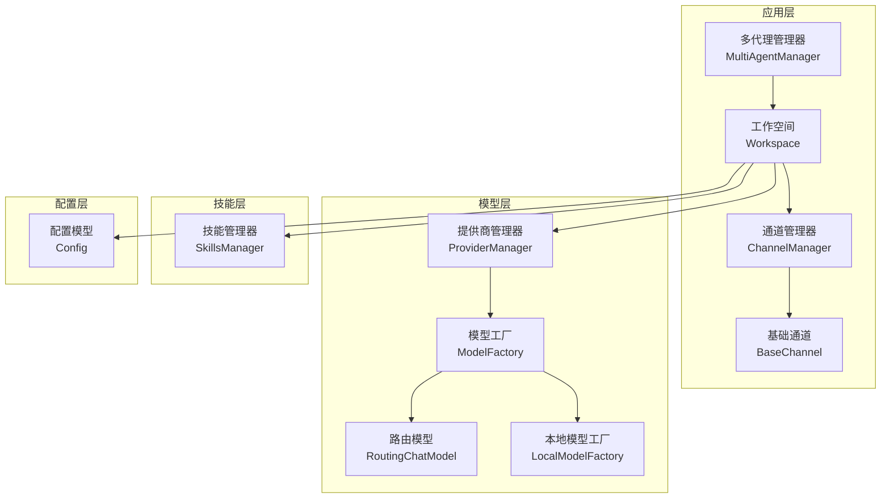
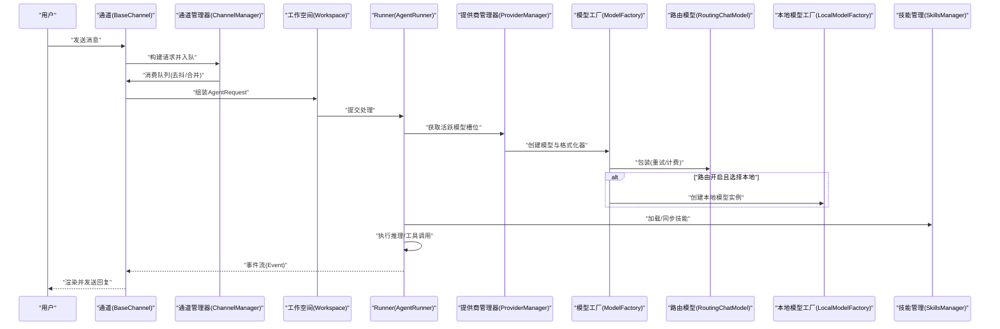
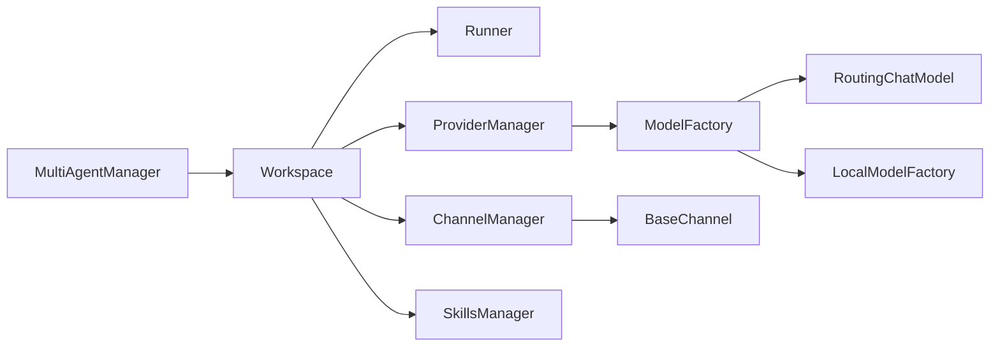

# 核心功能

<cite>
**本文引用的文件**
- [src/copaw/app/multi_agent_manager.py](file://src/copaw/app/multi_agent_manager.py)
- [src/copaw/app/workspace/workspace.py](file://src/copaw/app/workspace/workspace.py)
- [src/copaw/app/channels/base.py](file://src/copaw/app/channels/base.py)
- [src/copaw/app/channels/manager.py](file://src/copaw/app/channels/manager.py)
- [src/copaw/agents/skills_manager.py](file://src/copaw/agents/skills_manager.py)
- [src/copaw/agents/model_factory.py](file://src/copaw/agents/model_factory.py)
- [src/copaw/agents/routing_chat_model.py](file://src/copaw/agents/routing_chat_model.py)
- [src/copaw/providers/provider_manager.py](file://src/copaw/providers/provider_manager.py)
- [src/copaw/local_models/factory.py](file://src/copaw/local_models/factory.py)
- [src/copaw/config/config.py](file://src/copaw/config/config.py)
</cite>

## 目录
1. [简介](#简介)
2. [项目结构](#项目结构)
3. [核心组件](#核心组件)
4. [架构总览](#架构总览)
5. [详细组件分析](#详细组件分析)
6. [依赖分析](#依赖分析)
7. [性能考虑](#性能考虑)
8. [故障排除指南](#故障排除指南)
9. [结论](#结论)
10. [附录](#附录)

## 简介
本文件面向CoPaw的核心功能，系统性梳理并解释以下关键模块：多代理管理系统（MultiAgentManager）、聊天渠道适配器（ChannelManager/BaseChannel）、技能扩展系统（SkillsManager）、模型管理器（ProviderManager/ModelFactory/RoutingChatModel）与本地模型工厂（LocalModelFactory）。文档从设计理念、实现原理、使用方法到模块间协作机制进行深入说明，并提供配置要点、性能建议与排障指引，兼顾初学者与高级用户的理解需求。

## 项目结构
CoPaw采用“工作空间（Workspace）+ 多代理管理（MultiAgentManager）”的组织方式，每个Agent在独立的工作空间内运行完整生命周期：Runner、ChannelManager、MemoryManager、MCPClientManager、CronManager等服务通过统一的服务注册与启动流程装配。聊天渠道以适配器模式接入，支持多种平台；技能系统负责内置/自定义/激活技能的同步与管理；模型层抽象了云端与本地模型的选择与封装。

图示来源
- [src/copaw/app/multi_agent_manager.py:17-451](file://src/copaw/app/multi_agent_manager.py#L17-L451)
- [src/copaw/app/workspace/workspace.py:39-367](file://src/copaw/app/workspace/workspace.py#L39-L367)
- [src/copaw/app/channels/manager.py:114-565](file://src/copaw/app/channels/manager.py#L114-L565)
- [src/copaw/app/channels/base.py:69-800](file://src/copaw/app/channels/base.py#L69-L800)
- [src/copaw/providers/provider_manager.py:288-717](file://src/copaw/providers/provider_manager.py#L288-L717)
- [src/copaw/agents/model_factory.py:280-379](file://src/copaw/agents/model_factory.py#L280-L379)
- [src/copaw/agents/routing_chat_model.py:65-123](file://src/copaw/agents/routing_chat_model.py#L65-L123)
- [src/copaw/local_models/factory.py:42-125](file://src/copaw/local_models/factory.py#L42-L125)
- [src/copaw/agents/skills_manager.py:627-800](file://src/copaw/agents/skills_manager.py#L627-L800)
- [src/copaw/config/config.py:1-800](file://src/copaw/config/config.py#L1-L800)

章节来源
- [src/copaw/app/multi_agent_manager.py:17-451](file://src/copaw/app/multi_agent_manager.py#L17-L451)
- [src/copaw/app/workspace/workspace.py:39-367](file://src/copaw/app/workspace/workspace.py#L39-L367)
- [src/copaw/app/channels/manager.py:114-565](file://src/copaw/app/channels/manager.py#L114-L565)
- [src/copaw/app/channels/base.py:69-800](file://src/copaw/app/channels/base.py#L69-L800)
- [src/copaw/providers/provider_manager.py:288-717](file://src/copaw/providers/provider_manager.py#L288-L717)
- [src/copaw/agents/model_factory.py:280-379](file://src/copaw/agents/model_factory.py#L280-L379)
- [src/copaw/agents/routing_chat_model.py:65-123](file://src/copaw/agents/routing_chat_model.py#L65-L123)
- [src/copaw/local_models/factory.py:42-125](file://src/copaw/local_models/factory.py#L42-L125)
- [src/copaw/agents/skills_manager.py:627-800](file://src/copaw/agents/skills_manager.py#L627-L800)
- [src/copaw/config/config.py:1-800](file://src/copaw/config/config.py#L1-L800)

## 核心组件
- 多代理管理系统（MultiAgentManager）
  - 职责：按需加载、生命周期管理、零停机热重载、并发启动、优雅停止。
  - 关键点：异步锁保护、延迟清理后台任务、原子替换实例、可预加载与批量启动。
- 工作空间（Workspace）
  - 职责：聚合Runner、ChannelManager、MemoryManager、MCPClientManager、CronManager等服务，声明式注册与启动。
  - 关键点：ServiceManager统一管理、可设置复用组件、按优先级启动。
- 聊天渠道适配器（ChannelManager/BaseChannel）
  - 职责：统一入队/出队、去抖合并、会话隔离、错误处理、消息渲染与发送。
  - 关键点：每通道消费者循环、时间去抖、内容去抖、渲染样式控制。
- 技能扩展系统（SkillsManager）
  - 职责：内置/自定义/激活技能目录树同步、版本比较、导入导出、列表与读取。
  - 关键点：SKILL.md前端数据解析、目录树结构化表示、覆盖策略。
- 模型管理器与工厂（ProviderManager/ModelFactory/RoutingChatModel）
  - 职责：提供商注册与持久化、模型槽位选择、格式化器增强、本地/云端路由。
  - 关键点：单例ProviderManager、文件块支持格式化器、双槽位路由决策。
- 本地模型工厂（LocalModelFactory）
  - 职责：本地模型单例加载/卸载、后端选择（llama.cpp/MLX）、参数透传。
  - 关键点：线程锁保护、重复加载复用、不同后端实例化。

章节来源
- [src/copaw/app/multi_agent_manager.py:17-451](file://src/copaw/app/multi_agent_manager.py#L17-L451)
- [src/copaw/app/workspace/workspace.py:39-367](file://src/copaw/app/workspace/workspace.py#L39-L367)
- [src/copaw/app/channels/base.py:69-800](file://src/copaw/app/channels/base.py#L69-L800)
- [src/copaw/app/channels/manager.py:114-565](file://src/copaw/app/channels/manager.py#L114-L565)
- [src/copaw/agents/skills_manager.py:627-800](file://src/copaw/agents/skills_manager.py#L627-L800)
- [src/copaw/agents/model_factory.py:280-379](file://src/copaw/agents/model_factory.py#L280-L379)
- [src/copaw/agents/routing_chat_model.py:65-123](file://src/copaw/agents/routing_chat_model.py#L65-L123)
- [src/copaw/providers/provider_manager.py:288-717](file://src/copaw/providers/provider_manager.py#L288-L717)
- [src/copaw/local_models/factory.py:42-125](file://src/copaw/local_models/factory.py#L42-L125)

## 架构总览
下图展示从请求进入（渠道）到模型调用再到响应返回的整体链路，以及与技能、内存、定时任务等子系统的交互。

图示来源
- [src/copaw/app/channels/base.py:443-583](file://src/copaw/app/channels/base.py#L443-L583)
- [src/copaw/app/channels/manager.py:307-378](file://src/copaw/app/channels/manager.py#L307-L378)
- [src/copaw/app/workspace/workspace.py:311-367](file://src/copaw/app/workspace/workspace.py#L311-L367)
- [src/copaw/providers/provider_manager.py:699-717](file://src/copaw/providers/provider_manager.py#L699-L717)
- [src/copaw/agents/model_factory.py:280-379](file://src/copaw/agents/model_factory.py#L280-L379)
- [src/copaw/agents/routing_chat_model.py:65-123](file://src/copaw/agents/routing_chat_model.py#L65-L123)
- [src/copaw/local_models/factory.py:42-125](file://src/copaw/local_models/factory.py#L42-L125)
- [src/copaw/agents/skills_manager.py:183-260](file://src/copaw/agents/skills_manager.py#L183-L260)

## 详细组件分析

### 多代理管理系统（MultiAgentManager）
- 设计理念
  - 懒加载：仅在首次访问时创建工作空间，降低初始资源占用。
  - 零停机热重载：新旧实例原子替换，后台延迟清理旧实例，保证服务连续性。
  - 并发与线程安全：基于异步锁与后台任务，避免阻塞主流程。
- 实现要点
  - get_agent：懒加载与缓存、配置校验、启动实例并记录引用。
  - reload_agent：创建新实例（无锁）、原子替换、委托清理逻辑（有无活动任务分支）。
  - stop_all/cancel_all_cleanup_tasks：优雅关闭，取消并等待后台清理任务。
  - start_all_configured_agents：并发启动所有已配置代理，收集结果统计。
- 使用方法
  - 获取代理：通过agent_id获取Workspace实例。
  - 热重载：reload_agent实现无缝升级。
  - 批量启动：start_all_configured_agents并发初始化。
- 最佳实践
  - 在高并发场景下，优先使用并发启动与懒加载策略。
  - 对于长任务，利用零停机特性进行滚动更新。

章节来源
- [src/copaw/app/multi_agent_manager.py:17-451](file://src/copaw/app/multi_agent_manager.py#L17-L451)

### 工作空间（Workspace）
- 设计理念
  - 声明式服务注册：通过ServiceDescriptor集中定义服务初始化顺序、并发策略与可复用性。
  - 组件解耦：Runner、ChannelManager、MemoryManager、MCPClientManager、CronManager各司其职。
- 实现要点
  - _register_services：注册Runner、MemoryManager、MCPClient、ChatService、ChannelManager、CronManager等，定义启动优先级与并发策略。
  - set_reusable_components：在热重载前注入可复用组件（如MemoryManager、ChatManager），避免重建。
  - start/stop：统一通过ServiceManager启动/停止，支持final=false的渐进式停止。
- 使用方法
  - 初始化：传入agent_id与workspace_dir。
  - 启动：await start()，内部加载配置并启动所有服务。
  - 停止：await stop(final=True/False)，决定是否停止可复用组件。
- 最佳实践
  - 将共享组件标记为reusable，配合MultiAgentManager的set_reusable_components提升热重载效率。

章节来源
- [src/copaw/app/workspace/workspace.py:39-367](file://src/copaw/app/workspace/workspace.py#L39-L367)

### 聊天渠道适配器（ChannelManager/BaseChannel）
- 设计理念
  - 适配器模式：统一入队/出队、去抖合并、会话隔离、错误回调与消息渲染。
  - 异步队列与多消费者：每通道固定数量消费者并行处理，同会话串行合并。
- 实现要点
  - BaseChannel
    - 去抖：时间去抖（native payload）与内容去抖（无文本缓冲至有文本再发送）。
    - 合并：merge_native_items/merge_requests，统一元信息与内容部分。
    - 渲染：MessageRenderer根据RenderStyle过滤工具消息与思考内容。
    - 发送：send_content_parts统一文本与媒体，媒体补充到文本末尾或单独发送。
  - ChannelManager
    - 队列：每通道队列与消费者任务，支持动态替换通道。
    - 入队：线程安全enqueue，按会话键去抖合并。
    - 启停：start_all/stop_all，支持替换通道与清理挂起项。
- 使用方法
  - from_env/from_config：从环境或配置创建通道实例。
  - enqueue/send_text/send_event：向指定通道投递消息。
- 最佳实践
  - 合理设置filter_tool_messages/filter_thinking以优化用户体验。
  - 对需要实时性的通道（如钉钉）启用native合并与时间去抖。

章节来源
- [src/copaw/app/channels/base.py:69-800](file://src/copaw/app/channels/base.py#L69-L800)
- [src/copaw/app/channels/manager.py:114-565](file://src/copaw/app/channels/manager.py#L114-L565)

### 技能扩展系统（SkillsManager）
- 设计理念
  - 分层目录：builtin/customized/active_skills三层结构，自定义覆盖内置。
  - 版本与差异：内置技能版本比较，差异检测与增量同步。
  - 结构化存储：SKILL.md前端数据解析，目录树结构化表示，支持脚本与引用文件。
- 实现要点
  - 目录扫描：_collect_skills_from_dir/_build_directory_tree。
  - 同步策略：sync_skills_to_working_dir/back-sync定制化覆盖。
  - 导入与创建：_import_skill_dir/create_skill（支持树形文件结构）。
  - 列表与读取：list_all_skills/list_available_skills，去重策略。
- 使用方法
  - 同步：sync_skills_to_working_dir指定技能名或全量同步。
  - 创建：create_skill(name, content, references/scripts/extra_files)。
  - 列表：list_all_skills查看内置/自定义/激活技能。
- 最佳实践
  - 自定义技能命名规范，避免与内置冲突。
  - 使用references/scripts组织复杂技能资产，便于维护。

章节来源
- [src/copaw/agents/skills_manager.py:627-800](file://src/copaw/agents/skills_manager.py#L627-L800)

### 模型管理器与工厂（ProviderManager/ModelFactory/RoutingChatModel）
- 设计理念
  - 统一提供商抽象：内置与自定义提供商注册、持久化与迁移。
  - 双槽位路由：本地/云端模型选择，策略可配置（local_first/cloud_first）。
  - 格式化器增强：兼容多厂商API，支持文件块与思维块处理。
- 实现要点
  - ProviderManager
    - 注册内置提供商（OpenAI、Anthropic、Gemini、Ollama等）。
    - 提供器增删改查、模型发现、活跃模型保存与加载。
    - 单例模式与本地模型更新（llama.cpp/MLX）。
  - ModelFactory
    - create_model_and_formatter：按agent_id或全局配置选择模型与格式化器。
    - 文件块支持格式化器：_create_file_block_support_formatter增强tool_result转换。
    - 包装重试与计费：RetryChatModel/TokenRecordingModelWrapper。
  - RoutingChatModel
    - RoutingPolicy：基于配置选择local/cloud。
    - 决策日志：记录路由原因，便于调试。
- 使用方法
  - 选择模型：ProviderManager.activate_model(provider_id, model_id)。
  - 创建实例：create_model_and_formatter(agent_id?)。
  - 路由配置：AgentsLLMRoutingConfig.enabled/mode/local/cloud。
- 最佳实践
  - 本地模型优先：在低延迟与隐私要求高的场景启用local_first。
  - 格式化器一致性：确保格式化器与模型API兼容，必要时启用文件块支持。

章节来源
- [src/copaw/providers/provider_manager.py:288-717](file://src/copaw/providers/provider_manager.py#L288-L717)
- [src/copaw/agents/model_factory.py:280-379](file://src/copaw/agents/model_factory.py#L280-L379)
- [src/copaw/agents/routing_chat_model.py:65-123](file://src/copaw/agents/routing_chat_model.py#L65-L123)
- [src/copaw/config/config.py:355-378](file://src/copaw/config/config.py#L355-L378)

### 本地模型工厂（LocalModelFactory）
- 设计理念
  - 单例模式：相同模型复用已加载实例，不同模型先卸载再加载。
  - 后端抽象：llama.cpp与MLX后端统一接口，参数透传。
- 实现要点
  - create_local_chat_model：线程锁保护、重复加载复用、不同后端实例化。
  - unload_active_model：释放当前本地模型资源。
  - get_active_local_model：查询当前活跃模型与后端。
- 使用方法
  - 加载模型：create_local_chat_model(model_id, stream, backend_kwargs, generate_kwargs)。
  - 卸载模型：unload_active_model。
- 最佳实践
  - 控制并发加载，避免频繁切换模型导致资源浪费。
  - 合理设置generate_kwargs（如温度、top_p）以平衡性能与质量。

章节来源
- [src/copaw/local_models/factory.py:42-125](file://src/copaw/local_models/factory.py#L42-L125)

## 依赖分析
- 组件耦合
  - MultiAgentManager依赖Workspace，Workspace依赖ServiceManager与各子系统。
  - ChannelManager依赖BaseChannel族类，统一处理入队/出队与去抖。
  - SkillsManager依赖技能目录与SKILL.md解析，与Workspace协同。
  - ModelFactory/ProviderManager/RoutingChatModel共同构成模型层，支持本地/云端双槽位。
- 外部依赖
  - ProviderManager依赖外部模型提供商（OpenAI、Anthropic、Gemini、Ollama等）。
  - LocalModelFactory依赖本地后端库（llama.cpp/MLX）。
- 循环依赖
  - 未见直接循环依赖；ProviderManager与ModelFactory通过配置解耦。

图示来源
- [src/copaw/app/multi_agent_manager.py:17-451](file://src/copaw/app/multi_agent_manager.py#L17-L451)
- [src/copaw/app/workspace/workspace.py:39-367](file://src/copaw/app/workspace/workspace.py#L39-L367)
- [src/copaw/app/channels/manager.py:114-565](file://src/copaw/app/channels/manager.py#L114-L565)
- [src/copaw/providers/provider_manager.py:288-717](file://src/copaw/providers/provider_manager.py#L288-L717)
- [src/copaw/agents/model_factory.py:280-379](file://src/copaw/agents/model_factory.py#L280-L379)
- [src/copaw/agents/routing_chat_model.py:65-123](file://src/copaw/agents/routing_chat_model.py#L65-L123)
- [src/copaw/local_models/factory.py:42-125](file://src/copaw/local_models/factory.py#L42-L125)
- [src/copaw/agents/skills_manager.py:627-800](file://src/copaw/agents/skills_manager.py#L627-L800)

章节来源
- [src/copaw/app/multi_agent_manager.py:17-451](file://src/copaw/app/multi_agent_manager.py#L17-L451)
- [src/copaw/app/workspace/workspace.py:39-367](file://src/copaw/app/workspace/workspace.py#L39-L367)
- [src/copaw/app/channels/manager.py:114-565](file://src/copaw/app/channels/manager.py#L114-L565)
- [src/copaw/providers/provider_manager.py:288-717](file://src/copaw/providers/provider_manager.py#L288-L717)
- [src/copaw/agents/model_factory.py:280-379](file://src/copaw/agents/model_factory.py#L280-L379)
- [src/copaw/agents/routing_chat_model.py:65-123](file://src/copaw/agents/routing_chat_model.py#L65-L123)
- [src/copaw/local_models/factory.py:42-125](file://src/copaw/local_models/factory.py#L42-L125)
- [src/copaw/agents/skills_manager.py:627-800](file://src/copaw/agents/skills_manager.py#L627-L800)

## 性能考虑
- 多消费者与队列
  - ChannelManager为每通道配置固定消费者数，提升吞吐；合理设置队列容量与去抖阈值，避免积压。
- 懒加载与热重载
  - MultiAgentManager懒加载与零停机重载减少冷启动与停机时间；并发启动缩短初始化时间。
- 模型层优化
  - 本地模型单例复用避免重复加载；路由策略按场景选择local_first或cloud_first。
  - 格式化器增强减少API错误与重试开销。
- I/O与磁盘
  - SkillsManager同步时注意大文件与压缩包大小限制，避免超时与安全风险。
- 线程与异步
  - 使用异步锁与后台任务，避免阻塞主事件循环；及时取消与等待后台清理任务。

## 故障排除指南
- 通道相关
  - 现象：消息未送达或乱序
  - 排查：检查去抖配置、时间去抖与内容去抖逻辑；确认会话键一致。
  - 参考路径：[src/copaw/app/channels/base.py:247-280](file://src/copaw/app/channels/base.py#L247-L280)、[src/copaw/app/channels/manager.py:307-378](file://src/copaw/app/channels/manager.py#L307-L378)
- 模型相关
  - 现象：模型不可用或API错误
  - 排查：确认ProviderManager中活跃模型槽位与提供商可用性；检查格式化器与文件块支持。
  - 参考路径：[src/copaw/providers/provider_manager.py:452-468](file://src/copaw/providers/provider_manager.py#L452-L468)、[src/copaw/agents/model_factory.py:320-350](file://src/copaw/agents/model_factory.py#L320-L350)
- 技能相关
  - 现象：技能未生效或版本落后
  - 排查：执行sync_skills_to_working_dir；检查SKILL.md前端数据与目录树结构。
  - 参考路径：[src/copaw/agents/skills_manager.py:183-260](file://src/copaw/agents/skills_manager.py#L183-L260)
- 代理相关
  - 现象：重载失败或资源泄漏
  - 排查：确认旧实例清理任务完成；检查后台任务状态与异常日志。
  - 参考路径：[src/copaw/app/multi_agent_manager.py:83-179](file://src/copaw/app/multi_agent_manager.py#L83-L179)

章节来源
- [src/copaw/app/channels/base.py:247-280](file://src/copaw/app/channels/base.py#L247-L280)
- [src/copaw/app/channels/manager.py:307-378](file://src/copaw/app/channels/manager.py#L307-L378)
- [src/copaw/providers/provider_manager.py:452-468](file://src/copaw/providers/provider_manager.py#L452-L468)
- [src/copaw/agents/model_factory.py:320-350](file://src/copaw/agents/model_factory.py#L320-L350)
- [src/copaw/agents/skills_manager.py:183-260](file://src/copaw/agents/skills_manager.py#L183-L260)
- [src/copaw/app/multi_agent_manager.py:83-179](file://src/copaw/app/multi_agent_manager.py#L83-L179)

## 结论
CoPaw通过“工作空间+多代理管理”的架构实现了Agent的独立运行与高效管理；通道适配器提供了统一的消息处理与渲染能力；技能系统保障了可扩展与可维护的工具生态；模型层则在云端与本地之间灵活切换并提供稳定的格式化与计费能力。上述设计既满足初学者快速上手，也为高级用户提供了深度定制与优化的空间。

## 附录
- 配置要点
  - 通道配置：启用/禁用、去抖、过滤工具消息与思考内容、允许列表与提及策略。
  - 运行配置：最大迭代次数、上下文长度、记忆压缩阈值、嵌入配置等。
  - LLM路由：开启路由、默认模式（local_first/cloud_first）、本地/云端槽位。
  - 参考路径：[src/copaw/config/config.py:28-526](file://src/copaw/config/config.py#L28-L526)
- 使用示例（步骤）
  - 启动代理：MultiAgentManager.start_all_configured_agents并发启动。
  - 发送消息：ChannelManager.enqueue/channel.send_text。
  - 切换模型：ProviderManager.activate_model/provider.get_chat_model_instance。
  - 同步技能：SkillsManager.sync_skills_to_working_dir。
- 最佳实践
  - 优先使用懒加载与并发启动，结合零停机重载提升可用性。
  - 合理配置去抖与过滤策略，优化用户体验。
  - 本地模型单例复用与后端参数调优，平衡性能与资源占用。