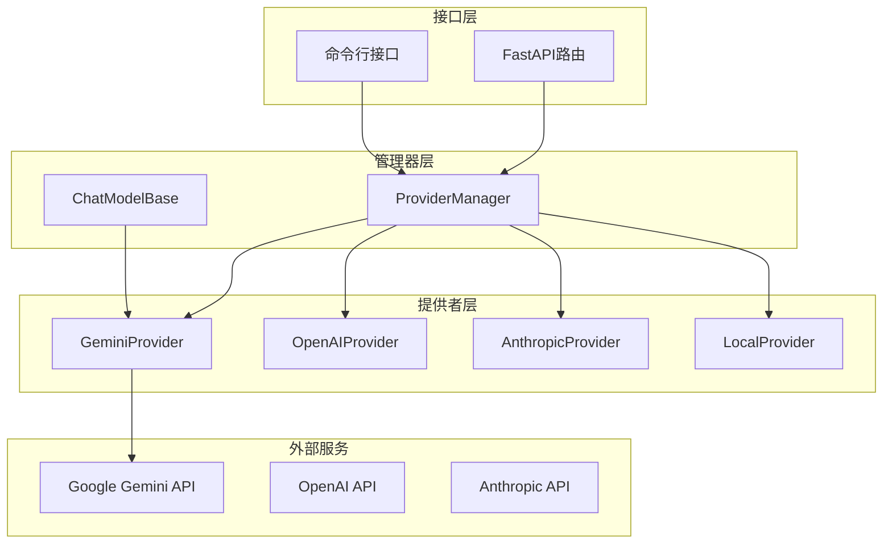
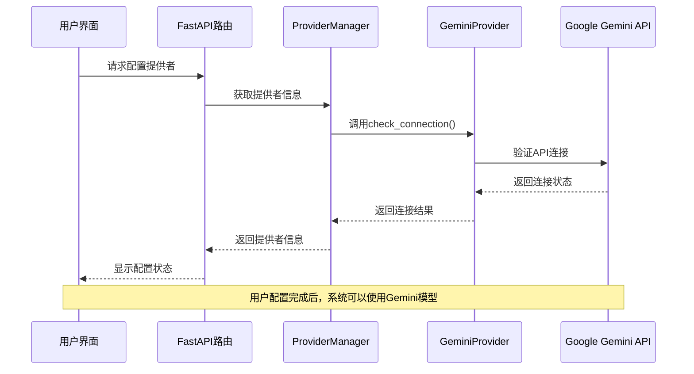
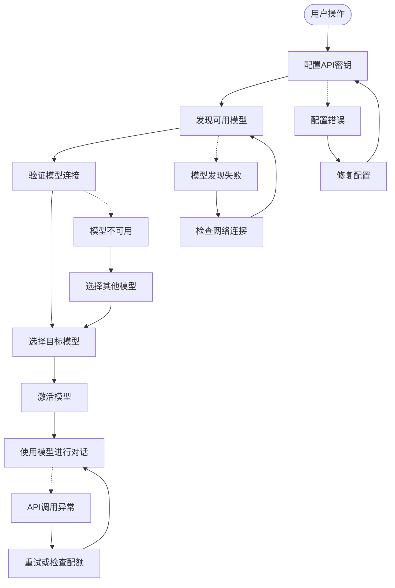
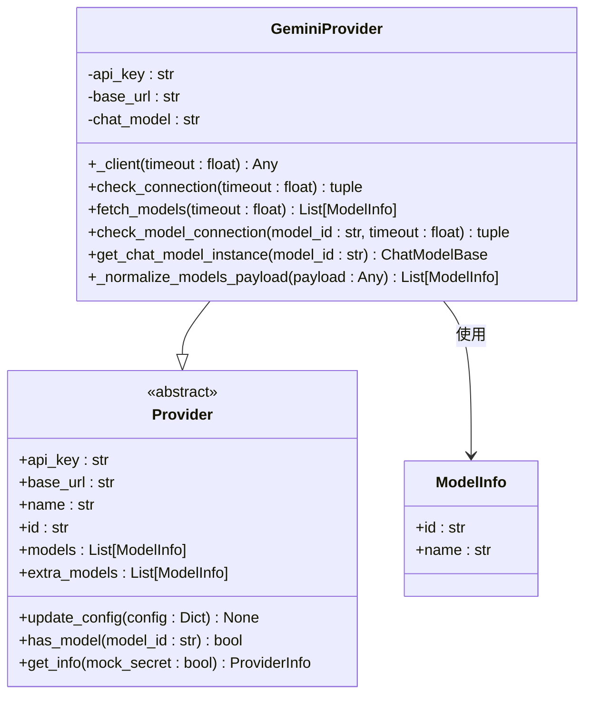
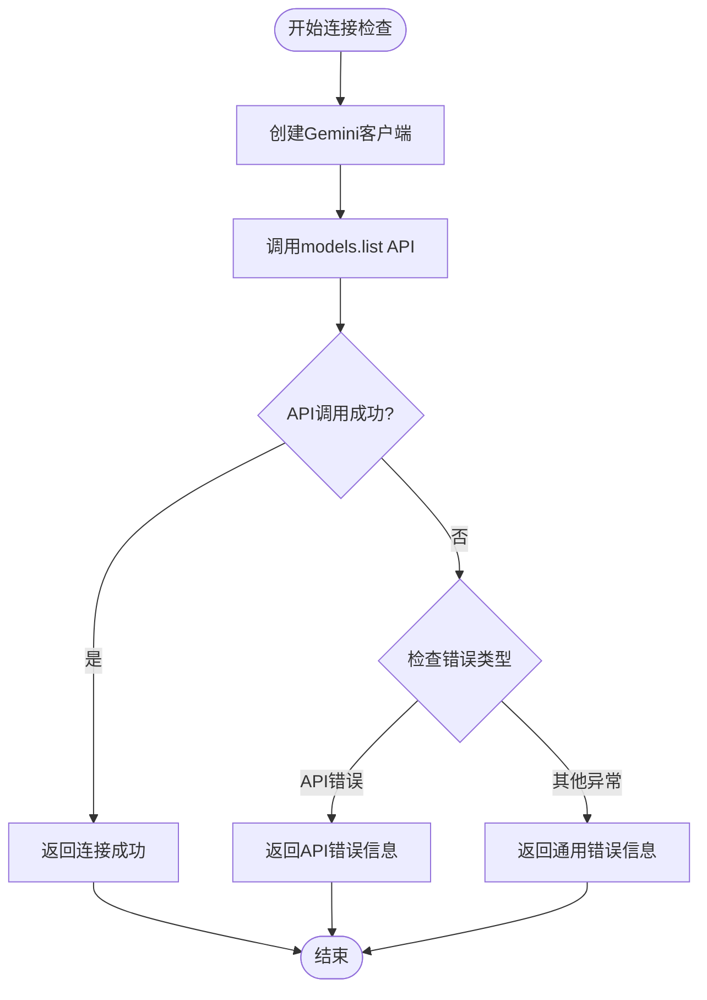
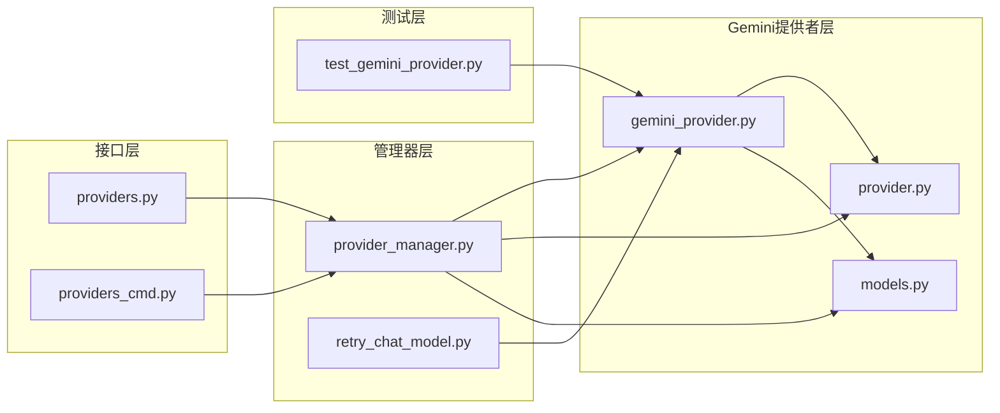

# Google Gemini提供者

<cite>
**本文档引用的文件**
- [gemini_provider.py](file://src/copaw/providers/gemini_provider.py)
- [provider.py](file://src/copaw/providers/provider.py)
- [models.py](file://src/copaw/providers/models.py)
- [provider_manager.py](file://src/copaw/providers/provider_manager.py)
- [providers.py](file://src/copaw/app/routers/providers.py)
- [providers_cmd.py](file://src/copaw/cli/providers_cmd.py)
- [test_gemini_provider.py](file://tests/unit/providers/test_gemini_provider.py)
- [models.en.md](file://website/public/docs/models.en.md)
- [models.zh.md](file://website/public/docs/models.zh.md)
- [retry_chat_model.py](file://src/copaw/providers/retry_chat_model.py)
- [constant.py](file://src/copaw/constant.py)
</cite>

## 目录
1. [简介](#简介)
2. [项目结构](#项目结构)
3. [核心组件](#核心组件)
4. [架构概览](#架构概览)
5. [详细组件分析](#详细组件分析)
6. [依赖关系分析](#依赖关系分析)
7. [性能考虑](#性能考虑)
8. [故障排除指南](#故障排除指南)
9. [结论](#结论)
10. [附录](#附录)

## 简介

Google Gemini提供者是CoPaw框架中的一个关键组件，负责集成Google AI Studio的Gemini API服务。该提供者实现了统一的模型抽象接口，支持多种Gemini模型的配置和管理，包括预配置的模型列表和动态模型发现功能。

本提供者基于AgentScope的原生GeminiChatModel，通过google-genai SDK与Google的Gemini API进行交互。它提供了完整的模型生命周期管理，包括连接验证、模型发现、配置管理和错误处理等功能。

## 项目结构

CoPaw项目采用模块化架构设计，Gemini提供者作为独立的提供者模块集成到整个系统中：



**图表来源**
- [provider_manager.py:33-338](file://src/copaw/providers/provider_manager.py#L33-L338)
- [gemini_provider.py:17-131](file://src/copaw/providers/gemini_provider.py#L17-L131)

**章节来源**
- [provider_manager.py:288-717](file://src/copaw/providers/provider_manager.py#L288-L717)
- [gemini_provider.py:1-131](file://src/copaw/providers/gemini_provider.py#L1-L131)

## 核心组件

### GeminiProvider类

GeminiProvider是Google Gemini提供者的主类，继承自Provider基类，实现了特定于Gemini API的功能：

**主要特性：**
- **API集成**：使用google-genai SDK与Google Gemini API通信
- **模型发现**：支持动态获取可用的Gemini模型列表
- **连接验证**：提供完整的连接性和模型可用性检查
- **配置管理**：支持API密钥管理和生成参数配置
- **流式响应**：基于AgentScope的流式聊天模型

**关键方法：**
- `_client()`：创建Gemini客户端实例
- `check_connection()`：验证API连接
- `fetch_models()`：获取可用模型列表
- `check_model_connection()`：测试特定模型可用性
- `get_chat_model_instance()`：创建聊天模型实例

**章节来源**
- [gemini_provider.py:17-131](file://src/copaw/providers/gemini_provider.py#L17-L131)

### Provider基类体系

Provider基类定义了所有提供者共享的通用接口和功能：

**核心功能：**
- **配置管理**：提供统一的配置更新机制
- **模型管理**：支持模型的添加、删除和查询
- **信息获取**：提供标准化的提供者信息输出
- **类型安全**：使用Pydantic模型确保数据完整性

**章节来源**
- [provider.py:73-202](file://src/copaw/providers/provider.py#L73-L202)

## 架构概览

Gemini提供者在整个CoPaw架构中扮演着重要的中间层角色，连接前端界面、后端服务和外部API：



**图表来源**
- [providers.py:211-236](file://src/copaw/app/routers/providers.py#L211-L236)
- [gemini_provider.py:58-77](file://src/copaw/providers/gemini_provider.py#L58-L77)

### 数据流架构



**图表来源**
- [providers_cmd.py:95-177](file://src/copaw/cli/providers_cmd.py#L95-L177)
- [gemini_provider.py:78-121](file://src/copaw/providers/gemini_provider.py#L78-L121)

## 详细组件分析

### GeminiProvider实现详解

#### 客户端初始化机制

GeminiProvider通过`_client()`方法创建Gemini客户端实例，该方法接受超时参数并配置HTTP选项：



**图表来源**
- [gemini_provider.py:17-131](file://src/copaw/providers/gemini_provider.py#L17-L131)
- [provider.py:73-202](file://src/copaw/providers/provider.py#L73-L202)

#### 模型发现机制

Gemini提供者实现了智能的模型发现功能，能够自动获取Google Gemini API提供的所有可用模型：

**模型规范化流程：**
1. 从API获取原始模型列表
2. 移除"models/"前缀以获得简洁的模型ID
3. 处理显示名称，确保没有重复的前缀
4. 去除重复项，确保每个模型只出现一次

**章节来源**
- [gemini_provider.py:26-56](file://src/copaw/providers/gemini_provider.py#L26-L56)
- [test_gemini_provider.py:259-301](file://tests/unit/providers/test_gemini_provider.py#L259-L301)

#### 连接验证过程

Gemini提供者提供了多层次的连接验证机制：

**连接检查流程：**


**图表来源**
- [gemini_provider.py:58-77](file://src/copaw/providers/gemini_provider.py#L58-L77)

**章节来源**
- [gemini_provider.py:58-91](file://src/copaw/providers/gemini_provider.py#L58-L91)
- [test_gemini_provider.py:41-94](file://tests/unit/providers/test_gemini_provider.py#L41-L94)

### ProviderManager集成

ProviderManager作为Gemini提供者的管理器，负责提供者实例的创建、配置和生命周期管理：

**内置提供者配置：**
- **Google Gemini**：支持模型发现，预配置多个Gemini模型
- **OpenAI**：标准的OpenAI兼容提供者
- **Anthropic**：支持Claude系列模型
- **本地提供者**：支持llama.cpp和MLX本地模型

**章节来源**
- [provider_manager.py:254-263](file://src/copaw/providers/provider_manager.py#L254-L263)
- [provider_manager.py:321-338](file://src/copaw/providers/provider_manager.py#L321-L338)

### API接口集成

Gemini提供者通过FastAPI路由和CLI接口提供完整的用户交互体验：

**Web API功能：**
- **提供者配置**：支持API密钥和基础URL配置
- **模型发现**：动态获取可用模型列表
- **连接测试**：验证提供者配置的有效性
- **模型测试**：验证特定模型的可用性

**CLI功能：**
- **交互式配置**：提供友好的命令行配置界面
- **批量操作**：支持批量配置多个提供者
- **模型管理**：支持模型的添加、删除和查询

**章节来源**
- [providers.py:95-122](file://src/copaw/app/routers/providers.py#L95-L122)
- [providers_cmd.py:95-177](file://src/copaw/cli/providers_cmd.py#L95-L177)

## 依赖关系分析

### 外部依赖

Gemini提供者依赖以下关键外部库：

**核心依赖：**
- `google-genai`：Google Gemini API SDK
- `agentscope`：AI模型抽象和聊天模型实现
- `pydantic`：数据验证和序列化
- `fastapi`：Web API框架

**内部依赖：**
- `provider.py`：提供者基类定义
- `models.py`：数据模型定义
- `retry_chat_model.py`：重试机制实现

### 内部依赖关系



**图表来源**
- [gemini_provider.py:14-14](file://src/copaw/providers/gemini_provider.py#L14-L14)
- [provider_manager.py:16-28](file://src/copaw/providers/provider_manager.py#L16-L28)

**章节来源**
- [gemini_provider.py:9-14](file://src/copaw/providers/gemini_provider.py#L9-L14)
- [provider_manager.py:16-28](file://src/copaw/providers/provider_manager.py#L16-L28)

## 性能考虑

### 超时配置

Gemini提供者支持灵活的超时配置，通过环境变量进行全局控制：

**超时参数：**
- `COPAW_MODEL_PROVIDER_CHECK_TIMEOUT`：提供者连接检查超时时间
- 默认值：5.0秒
- 最小值：0秒
- 允许无限：False

**章节来源**
- [constant.py:123-129](file://src/copaw/constant.py#L123-L129)

### 重试机制

为了提高API调用的可靠性，系统集成了透明的重试机制：

**重试配置：**
- `COPAW_LLM_MAX_RETRIES`：最大重试次数，默认3次
- `COPAW_LLM_BACKOFF_BASE`：基础退避时间，默认1.0秒
- `COPAW_LLM_BACKOFF_CAP`：最大退避时间，默认10.0秒

**重试条件：**
- 429 限流错误
- 500 服务器内部错误
- 502 网关错误
- 503 服务不可用
- 504 网关超时
- 529 超载保护

**章节来源**
- [retry_chat_model.py:82-204](file://src/copaw/providers/retry_chat_model.py#L82-L204)
- [constant.py:172-189](file://src/copaw/constant.py#L172-L189)

### 流式处理优化

Gemini提供者支持流式响应处理，通过AgentScope的流式聊天模型实现：

**流式处理特性：**
- 实时响应生成
- 支持工具调用
- 错误恢复机制
- 内存效率优化

## 故障排除指南

### 常见问题诊断

**API密钥相关问题：**
- 确认API密钥格式正确
- 验证API密钥权限范围
- 检查API配额限制
- 确认网络连接正常

**模型连接问题：**
- 验证模型ID格式
- 检查模型可用性状态
- 确认模型权限配置
- 验证API版本兼容性

**网络连接问题：**
- 检查防火墙设置
- 验证代理配置
- 确认DNS解析正常
- 检查SSL证书有效性

### 错误处理策略

Gemini提供者实现了完善的错误处理机制：

**错误分类：**
1. **认证错误**：API密钥无效或过期
2. **权限错误**：API密钥权限不足
3. **网络错误**：连接超时或DNS解析失败
4. **业务逻辑错误**：模型不可用或请求格式错误

**章节来源**
- [gemini_provider.py:58-121](file://src/copaw/providers/gemini_provider.py#L58-L121)
- [test_gemini_provider.py:61-94](file://tests/unit/providers/test_gemini_provider.py#L61-L94)

### 调试技巧

**启用详细日志：**
```bash
export COPAW_LOG_LEVEL=DEBUG
```

**测试连接：**
```bash
# 使用CLI测试Gemini连接
copaw models config-key gemini
copaw models test gemini
```

**验证模型：**
```bash
# 测试特定模型
copaw models test-model --model-id gemini-2.5-flash
```

## 结论

Google Gemini提供者为CoPaw框架提供了完整的Google Gemini API集成解决方案。通过模块化的架构设计和完善的错误处理机制，该提供者能够可靠地管理多种Gemini模型，并为用户提供一致的配置和使用体验。

**主要优势：**
- **统一接口**：提供标准化的模型抽象接口
- **灵活配置**：支持动态模型发现和配置管理
- **健壮性**：完善的错误处理和重试机制
- **易用性**：丰富的Web和CLI交互接口

**未来发展方向：**
- 增加更多Gemini模型的支持
- 优化性能和资源使用
- 扩展高级功能如多模态处理
- 加强安全性和合规性支持

## 附录

### 配置示例

**基本配置步骤：**
1. 在Google AI Studio获取API密钥
2. 在CoPaw中配置Gemini提供者
3. 启用模型发现功能
4. 选择目标Gemini模型

**环境变量配置：**
```bash
# 设置超时时间
export COPAW_MODEL_PROVIDER_CHECK_TIMEOUT=10.0

# 配置重试参数
export COPAW_LLM_MAX_RETRIES=5
export COPAW_LLM_BACKOFF_BASE=2.0
export COPAW_LLM_BACKOFF_CAP=30.0
```

**章节来源**
- [models.en.md:42-64](file://website/public/docs/models.en.md#L42-L64)
- [models.zh.md:42-64](file://website/public/docs/models.zh.md#L42-L64)

### 最佳实践

**安全配置：**
- 使用专用的API密钥
- 定期轮换API密钥
- 限制API密钥权限范围
- 启用HTTPS加密传输

**性能优化：**
- 合理设置超时参数
- 使用流式响应处理
- 实施适当的重试策略
- 监控API使用情况

**监控和维护：**
- 定期检查API连接状态
- 监控模型可用性
- 跟踪使用统计信息
- 及时更新模型配置