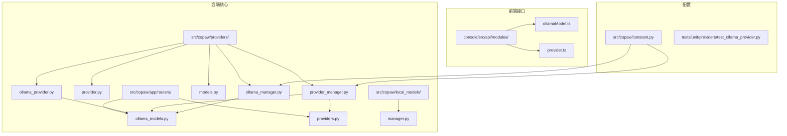
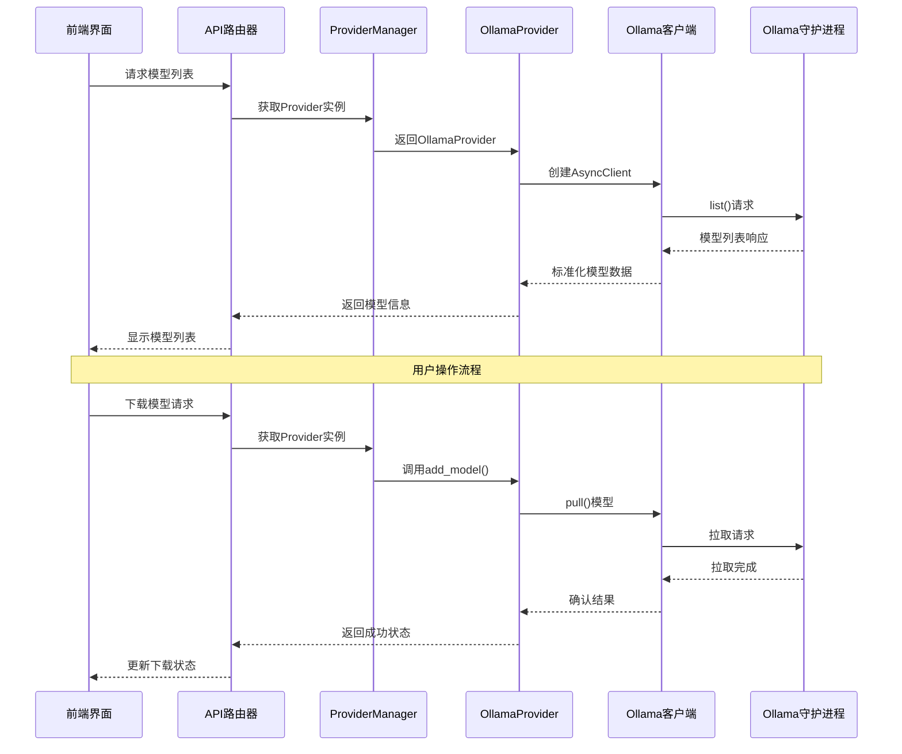
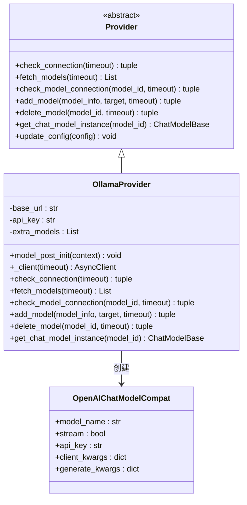
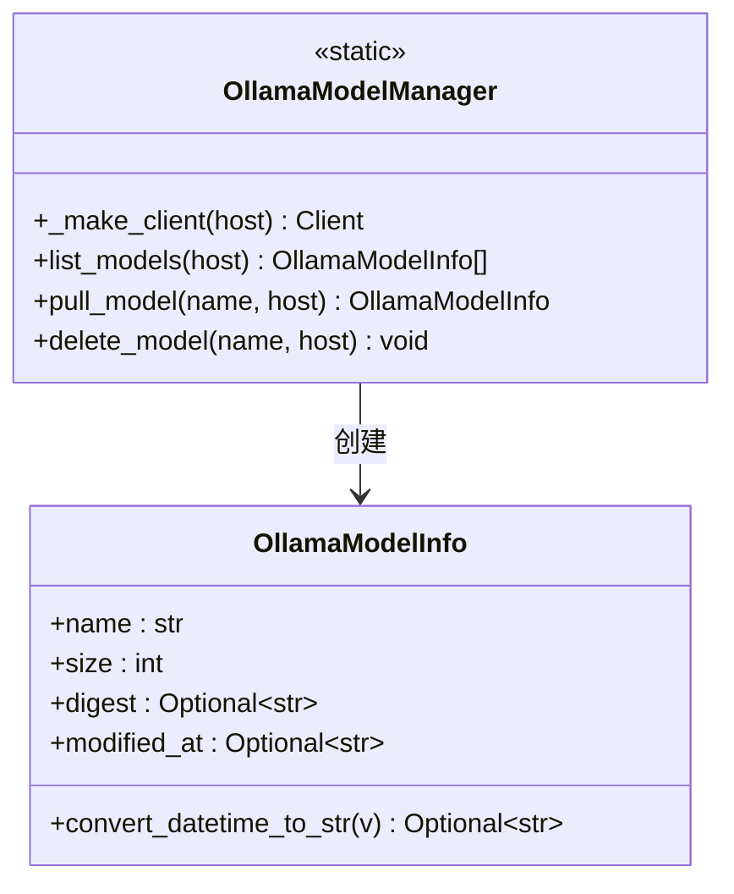
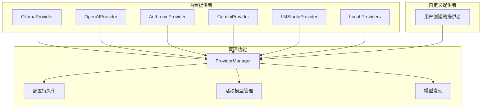
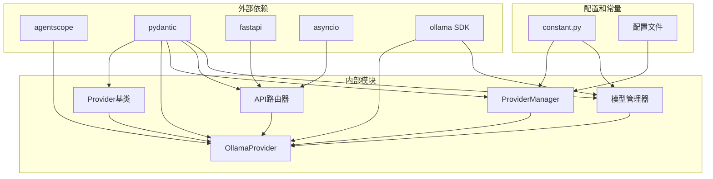

# Ollama提供者

<cite>
**本文档引用的文件**
- [ollama_provider.py](file://src/copaw/providers/ollama_provider.py)
- [ollama_manager.py](file://src/copaw/providers/ollama_manager.py)
- [provider.py](file://src/copaw/providers/provider.py)
- [models.py](file://src/copaw/providers/models.py)
- [provider_manager.py](file://src/copaw/providers/provider_manager.py)
- [ollama_models.py](file://src/copaw/app/routers/ollama_models.py)
- [providers.py](file://src/copaw/app/routers/providers.py)
- [constant.py](file://src/copaw/constant.py)
- [manager.py](file://src/copaw/local_models/manager.py)
- [ollamaModel.ts](file://console/src/api/modules/ollamaModel.ts)
- [provider.ts](file://console/src/api/modules/provider.ts)
- [test_ollama_provider.py](file://tests/unit/providers/test_ollama_provider.py)
</cite>

## 目录
1. [简介](#简介)
2. [项目结构](#项目结构)
3. [核心组件](#核心组件)
4. [架构概览](#架构概览)
5. [详细组件分析](#详细组件分析)
6. [依赖关系分析](#依赖关系分析)
7. [性能考虑](#性能考虑)
8. [故障排除指南](#故障排除指南)
9. [结论](#结论)
10. [附录](#附录)

## 简介

Ollama提供者是CoPaw框架中用于集成本地Ollama模型服务的核心组件。该实现提供了完整的模型生命周期管理，包括模型发现、拉取、删除和连接测试功能。通过统一的Provider接口，Ollama提供者能够无缝集成到CoPaw的多提供者架构中，为用户提供一致的模型管理体验。

本实现支持通过环境变量自动配置Ollama服务地址，默认监听本地端口11434，同时兼容OpenAI兼容的/v1端点格式。提供者还集成了异步客户端以确保非阻塞的操作体验。

## 项目结构

CoPaw项目采用模块化架构设计，Ollama提供者相关代码分布在多个关键目录中：



**图表来源**
- [ollama_provider.py:1-179](file://src/copaw/providers/ollama_provider.py#L1-L179)
- [provider_manager.py:1-717](file://src/copaw/providers/provider_manager.py#L1-L717)
- [ollama_models.py:1-291](file://src/copaw/app/routers/ollama_models.py#L1-L291)

**章节来源**
- [ollama_provider.py:1-179](file://src/copaw/providers/ollama_provider.py#L1-L179)
- [provider_manager.py:265-271](file://src/copaw/providers/provider_manager.py#L265-L271)

## 核心组件

Ollama提供者系统由以下核心组件构成：

### 主要提供者类
- **OllamaProvider**: 实现Ollama本地模型服务的完整集成
- **Provider**: 抽象基类，定义所有提供者的通用接口
- **ProviderManager**: 管理所有提供者实例的中央控制器

### 模型管理组件
- **OllamaModelManager**: 高级Ollama SDK封装器
- **OllamaModelInfo**: 单个Ollama模型的元数据结构
- **LocalModelManager**: 本地模型下载和管理（对比参考）

### API路由器
- **OllamaModelsRouter**: 提供Ollama模型管理的REST API端点
- **ProvidersRouter**: 通用提供者管理API

**章节来源**
- [provider.py:73-231](file://src/copaw/providers/provider.py#L73-L231)
- [provider_manager.py:288-717](file://src/copaw/providers/provider_manager.py#L288-L717)
- [ollama_manager.py:75-140](file://src/copaw/providers/ollama_manager.py#L75-L140)

## 架构概览

Ollama提供者采用分层架构设计，实现了从用户界面到本地服务的完整数据流：



**图表来源**
- [ollama_models.py:152-190](file://src/copaw/app/routers/ollama_models.py#L152-L190)
- [ollama_provider.py:85-94](file://src/copaw/providers/ollama_provider.py#L85-L94)
- [provider_manager.py:352-363](file://src/copaw/providers/provider_manager.py#L352-L363)

## 详细组件分析

### OllamaProvider实现

OllamaProvider类实现了完整的Provider抽象接口，提供了本地Ollama服务的深度集成：



**图表来源**
- [provider.py:73-175](file://src/copaw/providers/provider.py#L73-L175)
- [ollama_provider.py:19-179](file://src/copaw/providers/ollama_provider.py#L19-L179)

#### 关键特性实现

**环境变量配置**
- 支持OLLAMA_HOST环境变量自动检测
- 默认回退到http://127.0.0.1:11434
- 自动处理/v1端点兼容性

**异步客户端管理**
- 使用AsyncClient确保非阻塞操作
- 可配置超时参数
- 错误处理和异常转换

**模型标准化**
- 统一模型ID和名称格式
- 去重处理避免重复条目
- 兼容不同返回格式

**章节来源**
- [ollama_provider.py:22-30](file://src/copaw/providers/ollama_provider.py#L22-L30)
- [ollama_provider.py:32-40](file://src/copaw/providers/ollama_provider.py#L32-L40)
- [ollama_provider.py:42-67](file://src/copaw/providers/ollama_provider.py#L42-L67)

### OllamaModelManager高级封装

OllamaModelManager提供了对Ollama SDK的高级封装，专注于模型生命周期管理：



**图表来源**
- [ollama_manager.py:75-140](file://src/copaw/providers/ollama_manager.py#L75-L140)
- [ollama_manager.py:21-44](file://src/copaw/providers/ollama_manager.py#L21-L44)

#### 模型生命周期管理

**模型发现**
- 通过ollama.list()获取当前可用模型
- 解析返回的JSON数据结构
- 转换为内部统一的数据格式

**模型拉取**
- 支持同步阻塞操作
- 适用于线程执行器环境
- 完成后验证模型存在性

**模型删除**
- 直接调用SDK删除功能
- 记录操作日志便于追踪

**章节来源**
- [ollama_manager.py:96-140](file://src/copaw/providers/ollama_manager.py#L96-L140)

### API路由器实现

OllamaModelsRouter提供了完整的REST API接口，支持异步任务管理和状态跟踪：

```mermaid
flowchart TD
A[HTTP请求到达] --> B{请求类型判断}
B --> |GET /list| C[列出模型]
B --> |POST /download| D[开始下载任务]
B --> |GET /download-status| E[查询下载状态]
B --> |DELETE /download/{id}| F[取消下载任务]
B --> |DELETE /{name}| G[删除模型]
C --> H[调用ProviderManager]
D --> I[创建下载任务]
I --> J[启动后台任务]
J --> K[调用OllamaProvider.add_model]
K --> L[更新任务状态]
E --> M[返回任务列表]
F --> N[取消任务并中断下载]
G --> O[调用OllamaProvider.delete_model]
H --> P[返回模型列表]
L --> Q[返回任务状态]
N --> R[返回取消结果]
O --> S[返回删除成功]
```

**图表来源**
- [ollama_models.py:152-291](file://src/copaw/app/routers/ollama_models.py#L152-L291)

#### 异步任务管理

**任务状态跟踪**
- 使用DownloadTaskStore管理任务生命周期
- 支持任务创建、更新、取消和清理
- 线程安全的任务注册和注销

**错误处理策略**
- 区分Ollama连接错误和其他异常类型
- 提供详细的错误消息和状态码
- 支持任务级别的错误恢复

**章节来源**
- [ollama_models.py:94-150](file://src/copaw/app/routers/ollama_models.py#L94-L150)
- [ollama_models.py:59-68](file://src/copaw/app/routers/ollama_models.py#L59-L68)

### ProviderManager集成

ProviderManager作为中央控制器，负责管理所有提供者实例：



**图表来源**
- [provider_manager.py:288-717](file://src/copaw/providers/provider_manager.py#L288-L717)

#### 提供者初始化

**内置提供者注册**
- 预定义的标准提供者集合
- 支持多种AI服务提供商
- 配置默认模型列表

**自定义提供者支持**
- 用户可创建自定义提供者
- 灵活的配置选项
- 安全的存储机制

**章节来源**
- [provider_manager.py:321-337](file://src/copaw/providers/provider_manager.py#L321-L337)
- [provider_manager.py:423-440](file://src/copaw/providers/provider_manager.py#L423-L440)

## 依赖关系分析

Ollama提供者系统具有清晰的依赖层次结构：



**图表来源**
- [provider.py:1-231](file://src/copaw/providers/provider.py#L1-L231)
- [ollama_provider.py:1-179](file://src/copaw/providers/ollama_provider.py#L1-L179)
- [constant.py:1-201](file://src/copaw/constant.py#L1-L201)

### 关键依赖关系

**核心依赖链**
- OllamaProvider依赖agentscope ChatModelBase
- API路由器依赖FastAPI框架
- ProviderManager依赖pydantic进行数据验证
- 所有组件共享constant.py中的配置常量

**版本兼容性**
- 支持不同版本的ollama SDK
- 向后兼容OpenAI兼容端点格式
- 灵活的超时配置机制

**章节来源**
- [ollama_provider.py:14-16](file://src/copaw/providers/ollama_provider.py#L14-L16)
- [constant.py:123-129](file://src/copaw/constant.py#L123-L129)

## 性能考虑

### 异步操作优化

Ollama提供者采用了多项性能优化措施：

**异步客户端使用**
- AsyncClient确保非阻塞的网络操作
- 合理的超时配置避免长时间等待
- 连接池管理提高资源利用率

**内存管理**
- 模型列表去重避免重复存储
- 及时清理临时对象减少内存占用
- 任务状态的高效存储机制

**并发控制**
- 线程安全的任务注册和注销
- 适当的锁机制保护共享资源
- 异步任务的优雅取消支持

### 缓存策略

**模型信息缓存**
- ProviderManager维护模型列表缓存
- 减少频繁的SDK调用
- 支持手动刷新机制

**配置持久化**
- 配置变更的原子性写入
- 失败恢复机制
- 最小化磁盘I/O操作

### 网络优化

**连接复用**
- SDK客户端的连接复用
- 避免频繁的TCP连接建立
- 适当的keep-alive设置

**错误重试**
- 智能的错误检测和分类
- 有限次数的自动重试
- 指数退避策略

## 故障排除指南

### 常见问题诊断

**Ollama服务连接问题**
- 检查服务是否正在运行
- 验证网络连通性和防火墙设置
- 确认端口11434未被占用

**SDK安装问题**
- 确保安装了copaw[ollama]扩展包
- 验证Python版本兼容性
- 检查依赖库的正确安装

**权限和路径问题**
- 确认工作目录的读写权限
- 检查模型文件的存储空间
- 验证环境变量的正确设置

### 调试技巧

**启用详细日志**
- 设置COPAW_LOG_LEVEL为DEBUG
- 监控API请求和响应
- 分析异步任务的执行状态

**性能监控**
- 监控模型拉取的进度和速度
- 跟踪内存使用情况
- 分析CPU和网络资源消耗

**错误分析**
- 查看具体的异常堆栈信息
- 检查网络连接状态
- 验证模型名称的正确性

### 最佳实践

**配置管理**
- 使用环境变量管理敏感配置
- 定期备份配置文件
- 实施配置版本控制

**运维建议**
- 定期清理不需要的模型文件
- 监控磁盘空间使用情况
- 实施自动化的健康检查

**安全考虑**
- 限制API访问权限
- 实施适当的认证机制
- 定期更新软件版本

**章节来源**
- [test_ollama_provider.py:1-294](file://tests/unit/providers/test_ollama_provider.py#L1-L294)

## 结论

Ollama提供者为CoPaw框架提供了强大而灵活的本地模型服务集成能力。通过精心设计的架构和完善的错误处理机制，该实现能够在保证性能的同时提供可靠的用户体验。

主要优势包括：
- 完整的模型生命周期管理
- 灵活的配置选项和环境变量支持
- 强大的异步操作能力和性能优化
- 详细的错误处理和故障排除机制
- 与CoPaw整体架构的无缝集成

未来可以考虑的功能增强包括：
- 更精细的模型版本管理
- 改进的缓存策略
- 更丰富的监控和告警功能
- 增强的安全审计功能

## 附录

### 配置示例

**基础配置**
```json
{
  "id": "ollama",
  "name": "Ollama",
  "base_url": "http://localhost:11434",
  "api_key": "",
  "require_api_key": false,
  "support_model_discovery": true,
  "generate_kwargs": {
    "max_tokens": null
  }
}
```

**环境变量配置**
- OLLAMA_HOST: 设置Ollama服务地址
- COPAW_MODEL_PROVIDER_CHECK_TIMEOUT: 超时时间配置

**API端点使用**
- GET /models/{provider_id}/test: 测试连接
- POST /models/{provider_id}/discover: 发现模型
- POST /models/{provider_id}/models: 添加模型
- DELETE /models/{provider_id}/models/{model_id}: 删除模型

### 部署建议

**生产环境部署**
- 使用反向代理服务器
- 配置SSL证书和HTTPS
- 实施负载均衡和高可用性
- 设置适当的日志轮转策略

**开发环境配置**
- 使用本地Ollama实例
- 配置调试模式和详细日志
- 实施热重载和自动重启
- 建立开发工具链集成

**监控和维护**
- 实施应用性能监控
- 设置健康检查和告警
- 定期备份配置和数据
- 制定灾难恢复计划