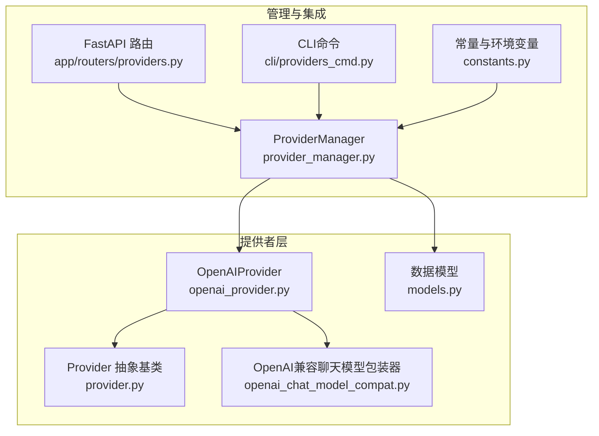
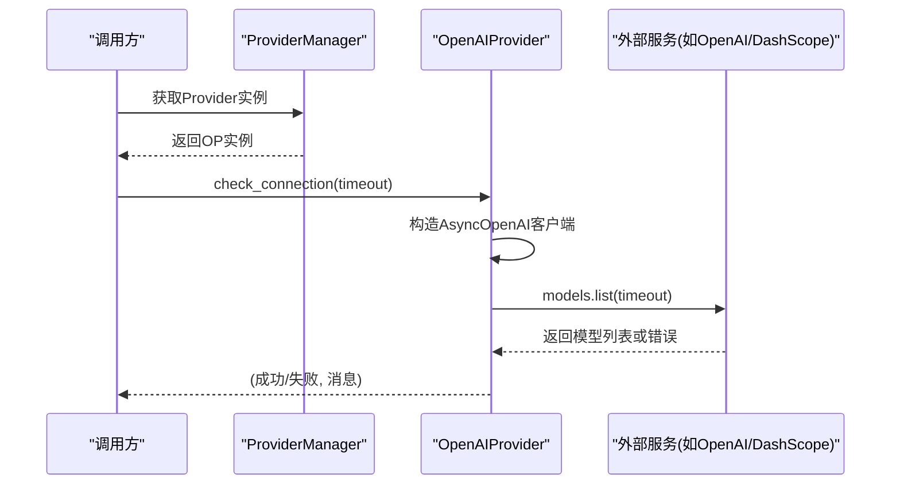
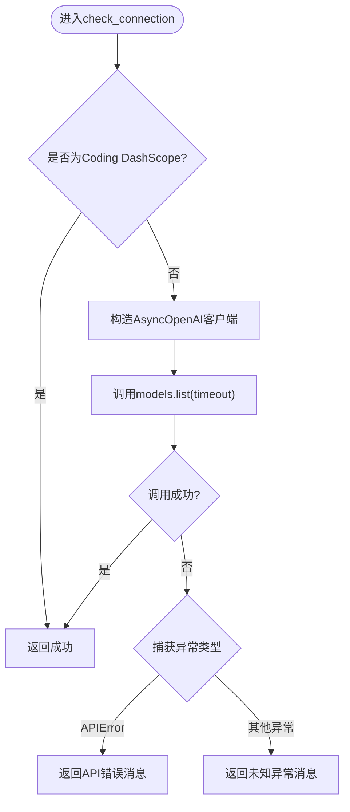
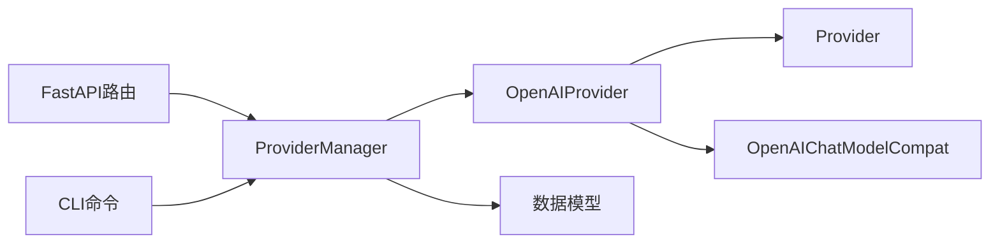

# OpenAI提供者

<cite>
**本文引用的文件**
- [openai_provider.py](file://src/copaw/providers/openai_provider.py)
- [provider.py](file://src/copaw/providers/provider.py)
- [models.py](file://src/copaw/providers/models.py)
- [openai_chat_model_compat.py](file://src/copaw/providers/openai_chat_model_compat.py)
- [provider_manager.py](file://src/copaw/providers/provider_manager.py)
- [constants.py](file://src/copaw/constant.py)
- [providers.py](file://src/copaw/app/routers/providers.py)
- [providers_cmd.py](file://src/copaw/cli/providers_cmd.py)
- [test_openai_provider.py](file://tests/unit/providers/test_openai_provider.py)
</cite>

## 目录
1. [简介](#简介)
2. [项目结构](#项目结构)
3. [核心组件](#核心组件)
4. [架构总览](#架构总览)
5. [详细组件分析](#详细组件分析)
6. [依赖分析](#依赖分析)
7. [性能考虑](#性能考虑)
8. [故障排除指南](#故障排除指南)
9. [结论](#结论)
10. [附录：配置与使用示例](#附录配置与使用示例)

## 简介
本文件面向OpenAI提供者（OpenAIProvider）的实现进行系统化技术文档化，覆盖以下主题：
- 异步客户端配置与超时控制
- 模型发现机制与数据规范化、去重
- 连接检查与模型可用性测试
- DashScope兼容模式的特殊处理（阿里云DashScope与Coding DashScope）
- 完整配置示例（API密钥、基础URL、请求超时）
- 错误处理策略、连接测试方法与性能优化建议
- 实际使用案例与故障排除指南

## 项目结构
OpenAI提供者位于Python包“src/copaw/providers”中，围绕抽象基类Provider构建，配合ProviderManager统一管理内置与自定义提供者，并通过FastAPI与CLI提供配置、模型发现与连接测试能力。

图表来源
- [openai_provider.py:18-157](file://src/copaw/providers/openai_provider.py#L18-L157)
- [provider.py:73-202](file://src/copaw/providers/provider.py#L73-L202)
- [models.py:11-81](file://src/copaw/providers/models.py#L11-L81)
- [openai_chat_model_compat.py:186-213](file://src/copaw/providers/openai_chat_model_compat.py#L186-L213)
- [provider_manager.py:288-717](file://src/copaw/providers/provider_manager.py#L288-L717)
- [constants.py:162-165](file://src/copaw/constant.py#L162-L165)
- [providers.py:84-121](file://src/copaw/app/routers/providers.py#L84-L121)
- [providers_cmd.py:95-177](file://src/copaw/cli/providers_cmd.py#L95-L177)

章节来源
- [openai_provider.py:18-157](file://src/copaw/providers/openai_provider.py#L18-L157)
- [provider_manager.py:138-282](file://src/copaw/providers/provider_manager.py#L138-L282)

## 核心组件
- OpenAIProvider：继承Provider，实现异步客户端、模型发现、连接检查、模型可用性测试以及DashScope兼容模式下的头部注入。
- Provider：抽象基类，定义ProviderInfo、模型增删、配置更新、信息导出等通用接口。
- ProviderManager：内置与自定义提供者注册、持久化、激活模型槽位、迁移旧配置等。
- OpenAIChatModelCompat：对流式响应的工具调用块进行安全规范化与额外内容透传，增强兼容性。
- 数据模型：ProviderDefinition、ProviderSettings、CustomProviderData、ModelInfo、ActiveModelsInfo等。

章节来源
- [openai_provider.py:18-157](file://src/copaw/providers/openai_provider.py#L18-L157)
- [provider.py:73-202](file://src/copaw/providers/provider.py#L73-L202)
- [models.py:11-81](file://src/copaw/providers/models.py#L11-L81)
- [openai_chat_model_compat.py:186-213](file://src/copaw/providers/openai_chat_model_compat.py#L186-L213)
- [provider_manager.py:288-717](file://src/copaw/providers/provider_manager.py#L288-L717)

## 架构总览
OpenAIProvider作为具体实现，遵循Provider接口规范，通过内部异步客户端与外部服务交互；在DashScope兼容模式下，根据不同的基础URL注入特定的默认请求头以满足平台要求；ProviderManager负责提供者生命周期管理与持久化；API与CLI提供统一的配置入口与测试能力。

图表来源
- [openai_provider.py:50-64](file://src/copaw/providers/openai_provider.py#L50-L64)
- [provider_manager.py:352-363](file://src/copaw/providers/provider_manager.py#L352-L363)

## 详细组件分析

### OpenAIProvider类
- 异步客户端配置
  - 使用AsyncOpenAI构造函数，支持base_url、api_key、timeout参数。
  - 超时参数可按调用点传入，默认值在方法签名中体现。
- 模型发现机制
  - 调用client.models.list(timeout)获取模型列表。
  - 将原始payload标准化为ModelInfo列表，字段提取与清洗逻辑明确。
- 模型规范化与去重
  - 规范化：从payload.data遍历，提取id与name，空id跳过，name缺失时回退到id。
  - 去重：基于id集合去重，保持顺序稳定。
- 连接检查
  - 对于Coding DashScope基础URL直接返回成功，避免不必要的网络调用。
  - 其他情况调用models.list，捕获APIError与未知异常，返回布尔结果与消息。
- 模型可用性测试
  - 使用chat.completions.create发起一次极短流式请求（max_tokens=1），消费首个片段后断开，用于验证模型可用性。
- DashScope兼容模式
  - 当base_url为阿里云DashScope兼容模式时，注入x-dashscope-agentapp头部。
  - 当base_url为Coding DashScope时，注入X-DashScope-Cdpl头部。
  - 两种头部均携带固定Agent元信息JSON字符串。
- 聊天模型实例化
  - 通过OpenAIChatModelCompat创建实例，传递模型名、流式开关、API密钥、客户端参数与生成参数。

图表来源
- [openai_provider.py:50-64](file://src/copaw/providers/openai_provider.py#L50-L64)

章节来源
- [openai_provider.py:18-157](file://src/copaw/providers/openai_provider.py#L18-L157)

### Provider抽象基类与数据模型
- ProviderInfo：描述提供者的基本信息、URL、密钥、聊天模型类名、预置与用户添加的模型列表、API前缀、本地/冻结URL/密钥需求、是否支持模型发现与连接检查、生成参数等。
- Provider：定义抽象方法（连接检查、模型发现、模型可用性测试、聊天模型实例化），并提供模型增删、配置更新、信息导出、是否存在某模型等通用能力。
- 数据模型：ModelInfo、ProviderDefinition、ProviderSettings、CustomProviderData、ModelSlotConfig、ActiveModelsInfo等，支撑提供者定义、持久化与激活槽位。

章节来源
- [provider.py:11-202](file://src/copaw/providers/provider.py#L11-L202)
- [models.py:11-81](file://src/copaw/providers/models.py#L11-L81)

### ProviderManager与内置提供者
- ProviderManager负责：
  - 注册内置提供者（含OpenAI、Azure OpenAI、DashScope、Aliyun Coding Plan等）。
  - 加载/保存提供者配置至磁盘，支持迁移旧格式。
  - 提供者列表、配置更新、模型发现、激活模型槽位、本地模型更新等。
- 内置提供者示例：
  - DashScope：freeze_url=True，api_key_prefix="sk"，基础URL为兼容模式。
  - Aliyun Coding Plan：support_connection_check=False，freeze_url=True，基础URL为Coding DashScope。
  - OpenAI：freeze_url=True，api_key_prefix="sk-"，基础URL为官方API。
  - Azure OpenAI：无默认URL，需用户自定义。

章节来源
- [provider_manager.py:138-282](file://src/copaw/providers/provider_manager.py#L138-L282)
- [provider_manager.py:288-717](file://src/copaw/providers/provider_manager.py#L288-L717)

### OpenAI兼容聊天模型包装器
- 作用：对流式响应中的工具调用块进行安全规范化，丢弃不可解析的条目，同时保留可解析的函数名与参数；对可能携带的额外内容（如Gemini思维签名）进行透传。
- 关键流程：克隆流对象、逐条规范化、收集额外内容、生成最终的ChatResponse序列。

章节来源
- [openai_chat_model_compat.py:186-213](file://src/copaw/providers/openai_chat_model_compat.py#L186-L213)

### DashScope兼容模式的特殊处理
- 常量来源：DASHSCOPE_BASE_URL可通过环境变量覆盖，默认指向阿里云DashScope兼容模式。
- 头部注入：
  - 阿里云DashScope：x-dashscope-agentapp，包含Agent类型、部署类型、模块码、Agent码等信息。
  - Coding DashScope：X-DashScope-Cdpl，包含相同Agent元信息。
- 行为差异：
  - 对Coding DashScope的连接检查直接返回成功，避免无模型配置时的无效调用。

章节来源
- [openai_provider.py:14-15](file://src/copaw/providers/openai_provider.py#L14-L15)
- [openai_provider.py:124-147](file://src/copaw/providers/openai_provider.py#L124-L147)
- [constants.py:162-165](file://src/copaw/constant.py#L162-L165)

## 依赖分析
- 组件耦合
  - OpenAIProvider依赖Provider抽象基类与OpenAIChatModelCompat。
  - ProviderManager聚合Provider实例，负责持久化与迁移。
  - API与CLI通过ProviderManager暴露统一的配置与测试接口。
- 外部依赖
  - agentscope模型：OpenAIChatModel及其响应解析。
  - openai SDK：AsyncOpenAI客户端与APIError异常类型。
- 可能的循环依赖
  - 未见直接循环导入；ProviderManager在初始化时加载内置提供者，避免运行期循环。

图表来源
- [openai_provider.py:12-15](file://src/copaw/providers/openai_provider.py#L12-L15)
- [provider_manager.py:288-338](file://src/copaw/providers/provider_manager.py#L288-L338)

章节来源
- [openai_provider.py:12-15](file://src/copaw/providers/openai_provider.py#L12-L15)
- [provider_manager.py:288-338](file://src/copaw/providers/provider_manager.py#L288-L338)

## 性能考虑
- 超时控制
  - 所有网络调用均支持timeout参数，建议在高延迟网络环境下适当增大超时值。
  - ProviderManager与常量中提供全局超时配置项，便于统一管理。
- 流式响应
  - 模型可用性测试采用极短流式请求并尽快消费首个片段，减少资源占用。
- 去重与规范化
  - 模型列表规范化与去重在内存中完成，时间复杂度O(n)，空间复杂度O(n)。
- DashScope兼容
  - Coding DashScope连接检查直接返回成功，避免不必要的网络往返。

章节来源
- [openai_provider.py:21-26](file://src/copaw/providers/openai_provider.py#L21-L26)
- [openai_provider.py:88-109](file://src/copaw/providers/openai_provider.py#L88-L109)
- [constants.py:123-129](file://src/copaw/constant.py#L123-L129)

## 故障排除指南
- 连接失败
  - 检查base_url与api_key是否正确配置；对于自定义或Azure OpenAI，确保提供了正确的端点。
  - 若为DashScope/Coding DashScope，确认基础URL与API密钥匹配对应平台。
- 模型发现为空
  - 确认API密钥有效且具备相应权限；检查网络连通性与代理设置。
  - 对于某些平台（如Aliyun Coding Plan），不支持无模型配置的连接检查，需先配置模型。
- 模型可用性测试失败
  - 检查模型ID是否正确；尝试使用更短的超时或禁用流式以定位问题。
- 错误处理策略
  - APIError被捕获并转换为明确的错误消息；未知异常返回通用错误提示。
  - ProviderManager在模型发现失败时记录警告并返回空列表，避免中断流程。

章节来源
- [openai_provider.py:50-76](file://src/copaw/providers/openai_provider.py#L50-L76)
- [openai_provider.py:88-117](file://src/copaw/providers/openai_provider.py#L88-L117)
- [provider_manager.py:384-406](file://src/copaw/providers/provider_manager.py#L384-L406)

## 结论
OpenAIProvider通过清晰的抽象与实现分离，提供了对OpenAI及兼容服务（尤其是DashScope）的良好支持。其模型发现、规范化与去重、连接检查与模型可用性测试、以及兼容模式下的头部注入，共同构成了一个健壮、可扩展的提供者实现。结合ProviderManager、API与CLI，用户可以便捷地配置、测试与管理多提供商与多模型场景。

## 附录：配置与使用示例

### 配置要点
- API密钥设置
  - 通过API或CLI更新Provider配置，支持更新api_key与base_url。
  - 对于require_api_key为True的提供者，必须设置有效密钥。
- 基础URL配置
  - 内置提供者通常自带默认URL；自定义或Azure OpenAI需手动填写。
  - DashScope与Aliyun Coding Plan有专用基础URL，需与对应平台匹配。
- 请求超时处理
  - 支持在调用check_connection、fetch_models、check_model_connection时传入timeout参数。
  - 全局超时可通过环境变量进行统一配置。

章节来源
- [providers.py:95-121](file://src/copaw/app/routers/providers.py#L95-L121)
- [providers_cmd.py:95-177](file://src/copaw/cli/providers_cmd.py#L95-L177)
- [constants.py:123-129](file://src/copaw/constant.py#L123-L129)

### DashScope兼容模式配置
- 阿里云DashScope
  - 基础URL：兼容模式
  - 头部：x-dashscope-agentapp，携带Agent元信息
- Coding DashScope
  - 基础URL：v1
  - 头部：X-DashScope-Cdpl，携带Agent元信息
  - 连接检查：直接返回成功

章节来源
- [openai_provider.py:14-15](file://src/copaw/providers/openai_provider.py#L14-L15)
- [openai_provider.py:124-147](file://src/copaw/providers/openai_provider.py#L124-L147)
- [provider_manager.py:147-165](file://src/copaw/providers/provider_manager.py#L147-L165)

### 连接测试与模型发现
- 连接测试
  - 通过API或CLI对Provider执行连接测试，可临时覆盖api_key与base_url进行验证。
- 模型发现
  - 调用Provider的模型发现接口，将结果写入extra_models并持久化。
- 模型可用性测试
  - 针对指定模型ID执行可用性测试，验证流式响应与最小token限制。

章节来源
- [providers.py:211-236](file://src/copaw/app/routers/providers.py#L211-L236)
- [providers.py:243-271](file://src/copaw/app/routers/providers.py#L243-L271)
- [providers.py:279-299](file://src/copaw/app/routers/providers.py#L279-L299)

### 实际使用案例
- 在Web界面或CLI中选择OpenAI/DashScope/Azure OpenAI等提供者，填写API密钥与基础URL，点击“连接测试”验证连通性。
- 使用“模型发现”获取可用模型列表，将其加入extra_models后激活为当前LLM。
- 对特定模型执行“模型测试”，确保其在目标提供者上可用。

章节来源
- [providers.py:84-121](file://src/copaw/app/routers/providers.py#L84-L121)
- [providers_cmd.py:371-404](file://src/copaw/cli/providers_cmd.py#L371-L404)