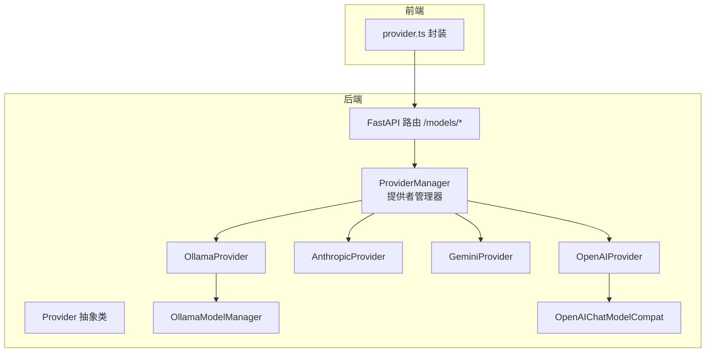
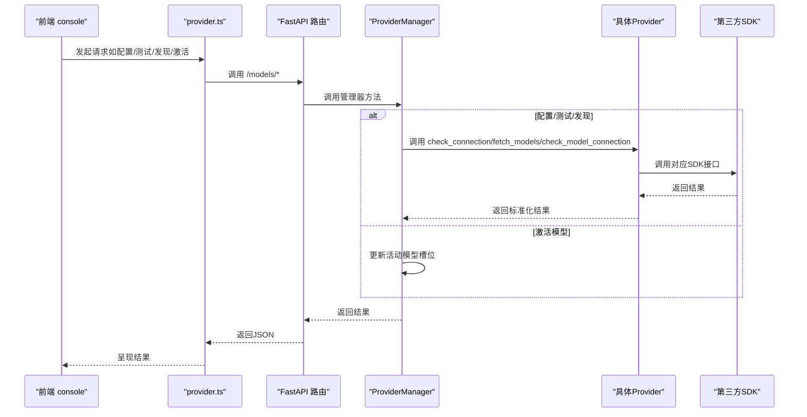
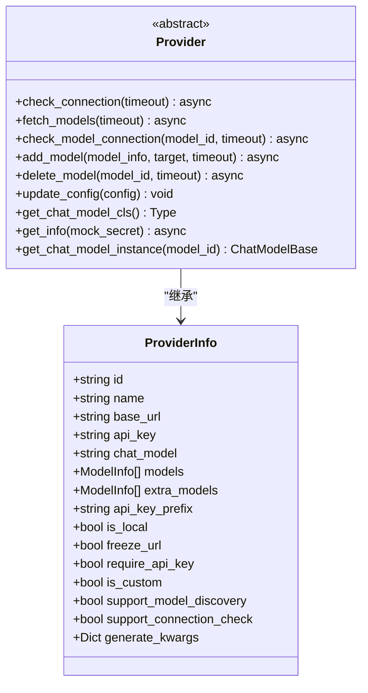
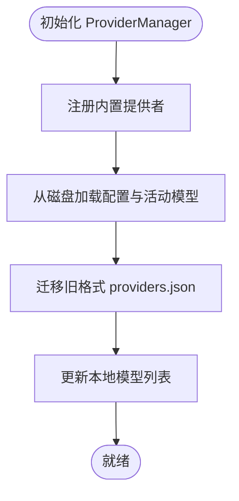
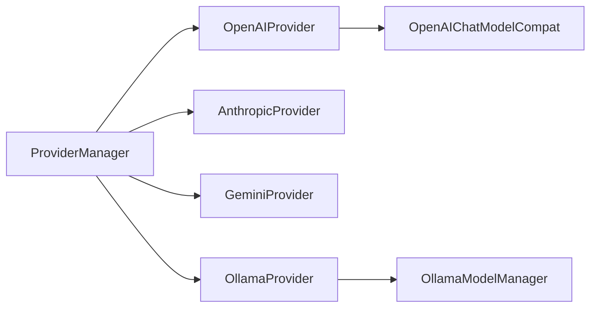

# 云模型提供者

<cite>
**本文引用的文件**
- [src/copaw/providers/provider.py](file://src/copaw/providers/provider.py)
- [src/copaw/providers/models.py](file://src/copaw/providers/models.py)
- [src/copaw/providers/openai_provider.py](file://src/copaw/providers/openai_provider.py)
- [src/copaw/providers/anthropic_provider.py](file://src/copaw/providers/anthropic_provider.py)
- [src/copaw/providers/gemini_provider.py](file://src/copaw/providers/gemini_provider.py)
- [src/copaw/providers/ollama_provider.py](file://src/copaw/providers/ollama_provider.py)
- [src/copaw/providers/openai_chat_model_compat.py](file://src/copaw/providers/openai_chat_model_compat.py)
- [src/copaw/providers/ollama_manager.py](file://src/copaw/providers/ollama_manager.py)
- [src/copaw/providers/provider_manager.py](file://src/copaw/providers/provider_manager.py)
- [src/copaw/app/routers/providers.py](file://src/copaw/app/routers/providers.py)
- [src/copaw/constant.py](file://src/copaw/constant.py)
- [console/src/api/modules/provider.ts](file://console/src/api/modules/provider.ts)
</cite>

## 目录
1. [简介](#简介)
2. [项目结构](#项目结构)
3. [核心组件](#核心组件)
4. [架构总览](#架构总览)
5. [详细组件分析](#详细组件分析)
6. [依赖分析](#依赖分析)
7. [性能考虑](#性能考虑)
8. [故障排除指南](#故障排除指南)
9. [结论](#结论)
10. [附录](#附录)

## 简介
本文件面向CoPaw的“云模型提供者”子系统，系统性梳理了对主流大模型服务（OpenAI、Anthropic、Google Gemini、Ollama）的集成实现与使用方式。文档覆盖以下主题：
- 各提供者的特有配置项、API限制与典型使用场景
- 配置示例与最佳实践：API密钥管理、URL配置、模型发现机制
- 提供者差异与选型建议：性能、成本、功能特性
- 故障排除与常见问题处理
- 前后端交互流程与数据模型

## 项目结构
围绕“云模型提供者”的代码主要分布在Python后端与TypeScript前端两部分：
- 后端提供者抽象与具体实现位于src/copaw/providers
- 提供者管理器与API路由位于src/copaw/providers与src/copaw/app/routers
- 常量与超时配置位于src/copaw/constant.py
- 前端API封装位于console/src/api/modules/provider.ts

图表来源
- [src/copaw/providers/provider_manager.py:288-717](file://src/copaw/providers/provider_manager.py#L288-L717)
- [src/copaw/providers/openai_provider.py:18-157](file://src/copaw/providers/openai_provider.py#L18-L157)
- [src/copaw/providers/anthropic_provider.py:18-156](file://src/copaw/providers/anthropic_provider.py#L18-L156)
- [src/copaw/providers/gemini_provider.py:17-131](file://src/copaw/providers/gemini_provider.py#L17-L131)
- [src/copaw/providers/ollama_provider.py:19-179](file://src/copaw/providers/ollama_provider.py#L19-L179)
- [src/copaw/providers/ollama_manager.py:75-140](file://src/copaw/providers/ollama_manager.py#L75-L140)
- [src/copaw/app/routers/providers.py:22-437](file://src/copaw/app/routers/providers.py#L22-L437)
- [console/src/api/modules/provider.ts:15-91](file://console/src/api/modules/provider.ts#L15-L91)

章节来源
- [src/copaw/providers/provider_manager.py:288-717](file://src/copaw/providers/provider_manager.py#L288-L717)
- [src/copaw/app/routers/providers.py:22-437](file://src/copaw/app/routers/providers.py#L22-L437)

## 核心组件
- Provider/ProviderInfo：定义提供者元信息、配置字段与通用能力（连接检查、模型发现、模型可用性测试、实例化聊天模型）
- ProviderManager：内置提供者注册、自定义提供者管理、持久化存储、活动模型槽位管理
- 具体提供者实现：OpenAIProvider、AnthropicProvider、GeminiProvider、OllamaProvider
- OpenAIChatModelCompat：增强OpenAI风格流式响应解析，兼容异常工具调用格式
- OllamaModelManager：基于Ollama Python SDK的模型生命周期管理
- FastAPI路由：统一的提供者配置、连接测试、模型发现、活动模型设置等REST接口
- 前端API封装：provider.ts对上述路由进行类型化封装

章节来源
- [src/copaw/providers/provider.py:11-231](file://src/copaw/providers/provider.py#L11-L231)
- [src/copaw/providers/models.py:11-81](file://src/copaw/providers/models.py#L11-L81)
- [src/copaw/providers/provider_manager.py:288-717](file://src/copaw/providers/provider_manager.py#L288-L717)
- [src/copaw/app/routers/providers.py:22-437](file://src/copaw/app/routers/providers.py#L22-L437)

## 架构总览
下图展示从前端到后端、再到各提供者SDK的完整调用链路与职责分工。

图表来源
- [console/src/api/modules/provider.ts:15-91](file://console/src/api/modules/provider.ts#L15-L91)
- [src/copaw/app/routers/providers.py:84-437](file://src/copaw/app/routers/providers.py#L84-L437)
- [src/copaw/providers/provider_manager.py:342-717](file://src/copaw/providers/provider_manager.py#L342-L717)

## 详细组件分析

### Provider 抽象与数据模型
- ModelInfo：模型标识与显示名
- ProviderInfo：提供者元信息（含基础URL、API密钥、聊天模型类名、预置模型列表、额外模型列表、密钥前缀、是否本地、URL冻结、是否需要密钥、是否自定义、是否支持模型发现、是否支持连接检查、生成参数等）
- Provider：抽象基类，定义统一接口（连接检查、模型发现、模型可用性测试、添加/删除模型、更新配置、获取聊天模型类、获取信息、实例化聊天模型）

图表来源
- [src/copaw/providers/provider.py:11-231](file://src/copaw/providers/provider.py#L11-L231)

章节来源
- [src/copaw/providers/provider.py:11-231](file://src/copaw/providers/provider.py#L11-L231)
- [src/copaw/providers/models.py:11-81](file://src/copaw/providers/models.py#L11-L81)

### ProviderManager：提供者全生命周期管理
- 内置提供者注册：OpenAI、Azure OpenAI、DashScope、ModelScope、Kimi（中/国际）、DeepSeek、Anthropic、Gemini、MiniMax（中/国际）、Ollama、LM Studio、llama.cpp、MLX
- 自定义提供者：动态创建、持久化、冲突解决
- 存储策略：内置/自定义提供者分别保存在独立目录；活动模型槽位持久化
- 运行时行为：加载磁盘配置、迁移旧格式、更新本地模型列表、按需实例化聊天模型

图表来源
- [src/copaw/providers/provider_manager.py:321-696](file://src/copaw/providers/provider_manager.py#L321-L696)

章节来源
- [src/copaw/providers/provider_manager.py:288-717](file://src/copaw/providers/provider_manager.py#L288-L717)

### OpenAIProvider：兼容OpenAI生态与国内兼容层
- 客户端：基于AsyncOpenAI，支持自定义base_url与超时
- 模型发现：调用models.list并去重归一化
- 连接测试：对DashScope/CodingPlan特殊处理；其余通过models.list或对特定模型发起极短流式请求验证
- 模型实例化：返回OpenAIChatModelCompat，注入默认头部以适配DashScope代理场景
- 特殊URL：支持DashScope兼容模式与CodingPlan兼容层，并自动附加Agent头信息

章节来源
- [src/copaw/providers/openai_provider.py:18-157](file://src/copaw/providers/openai_provider.py#L18-L157)

### AnthropicProvider：Anthropic Claude API
- 客户端：AsyncAnthropic
- 模型发现：读取models.list并归一化
- 连接测试：messages.list_models与对目标模型发起极短流式请求
- 模型实例化：返回AgentScope的AnthropicChatModel，注入DashScope兼容头

章节来源
- [src/copaw/providers/anthropic_provider.py:18-156](file://src/copaw/providers/anthropic_provider.py#L18-L156)

### GeminiProvider：Google Gemini
- 客户端：google.generativeai.Client，异步枚举模型
- 模型发现：异步遍历models.list并归一化（去除models/前缀）
- 连接测试：调用generate_content_stream进行连通性验证
- 模型实例化：返回AgentScope的GeminiChatModel

章节来源
- [src/copaw/providers/gemini_provider.py:17-131](file://src/copaw/providers/gemini_provider.py#L17-L131)

### OllamaProvider：本地模型托管平台
- 客户端：AsyncClient，默认从环境变量或回退地址解析base_url，自动剥离末尾/v1
- 模型发现：调用client.list并归一化
- 连接测试：client.list与client.chat进行连通性验证
- 添加/删除模型：通过client.pull/pull/delete委托Ollama守护进程
- 模型实例化：将base_url转换为OpenAI兼容/v1端点，返回OpenAIChatModelCompat

章节来源
- [src/copaw/providers/ollama_provider.py:19-179](file://src/copaw/providers/ollama_provider.py#L19-L179)
- [src/copaw/providers/ollama_manager.py:75-140](file://src/copaw/providers/ollama_manager.py#L75-L140)

### OpenAIChatModelCompat：流式响应健壮解析
- 功能：对OpenAI风格流式响应中的工具调用块进行清洗与补全，确保解析稳定；同时透传Gemini思维模型的额外内容
- 应用：在OpenAI兼容路径上统一增强解析体验

章节来源
- [src/copaw/providers/openai_chat_model_compat.py:186-213](file://src/copaw/providers/openai_chat_model_compat.py#L186-L213)

### API路由与前端交互
- 路由：/models 列表、配置、测试连接、模型发现、测试模型、增删自定义提供者、增删模型、查询/设置活动模型
- 前端：provider.ts对上述路由进行类型化封装，便于控制台页面调用

章节来源
- [src/copaw/app/routers/providers.py:22-437](file://src/copaw/app/routers/providers.py#L22-L437)
- [console/src/api/modules/provider.ts:15-91](file://console/src/api/modules/provider.ts#L15-L91)

## 依赖分析
- ProviderManager对各Provider实现存在强耦合：通过ProviderInfo/Provider抽象统一调度
- 具体Provider依赖对应SDK：OpenAI、Anthropic、Google Generative AI、Ollama
- OpenAI兼容路径共享OpenAIChatModelCompat，降低解析差异带来的复杂度
- OllamaProvider与OllamaModelManager共同构成本地模型生命周期管理闭环

图表来源
- [src/copaw/providers/provider_manager.py:288-717](file://src/copaw/providers/provider_manager.py#L288-L717)
- [src/copaw/providers/ollama_manager.py:75-140](file://src/copaw/providers/ollama_manager.py#L75-L140)
- [src/copaw/providers/openai_chat_model_compat.py:186-213](file://src/copaw/providers/openai_chat_model_compat.py#L186-L213)

章节来源
- [src/copaw/providers/provider_manager.py:288-717](file://src/copaw/providers/provider_manager.py#L288-L717)

## 性能考虑
- 超时控制：通过常量COPAW_MODEL_PROVIDER_CHECK_TIMEOUT统一控制提供者可达性检查与模型可用性测试的超时时间
- 流式响应：所有提供者均采用流式输出，提升交互体验；OpenAI兼容路径通过OpenAIChatModelCompat增强解析稳定性
- 本地模型：OllamaProvider支持模型拉取/删除，结合本地计算资源可显著降低网络延迟与带宽消耗
- 生成参数：各ProviderInfo支持generate_kwargs，可在不修改SDK的情况下灵活传递参数

章节来源
- [src/copaw/constant.py:123-129](file://src/copaw/constant.py#L123-L129)
- [src/copaw/providers/provider.py:67-70](file://src/copaw/providers/provider.py#L67-L70)
- [src/copaw/providers/openai_chat_model_compat.py:186-213](file://src/copaw/providers/openai_chat_model_compat.py#L186-L213)

## 故障排除指南
- API密钥错误
  - 现象：连接测试失败，提示认证失败
  - 排查：确认api_key_prefix与实际密钥前缀一致；检查密钥权限范围
- URL不可达
  - 现象：连接测试返回连接失败
  - 排查：确认base_url正确且可访问；若为DashScope/CodingPlan兼容层，确认代理头已正确注入
- 模型不可用
  - 现象：模型可用性测试失败
  - 排查：确认模型ID拼写正确；对Ollama检查模型是否已拉取；对云端提供者确认模型白名单与配额
- 本地模型异常
  - 现象：OllamaProvider无法列出/拉取/删除模型
  - 排查：确认Ollama Python SDK已安装；确认Ollama守护进程运行；确认base_url未以/v1结尾（内部会自动转换）
- 模型发现失败
  - 现象：点击“发现模型”无结果
  - 排查：检查网络与URL；对需要密钥的提供者在请求中临时传入密钥进行测试；查看日志中的警告信息
- 活动模型未生效
  - 现象：设置后仍使用默认模型
  - 排查：确认已成功保存至全局或代理级配置；检查ProviderManager的活动模型槽位状态

章节来源
- [src/copaw/providers/openai_provider.py:50-117](file://src/copaw/providers/openai_provider.py#L50-L117)
- [src/copaw/providers/anthropic_provider.py:57-117](file://src/copaw/providers/anthropic_provider.py#L57-L117)
- [src/copaw/providers/gemini_provider.py:58-120](file://src/copaw/providers/gemini_provider.py#L58-L120)
- [src/copaw/providers/ollama_provider.py:69-179](file://src/copaw/providers/ollama_provider.py#L69-L179)
- [src/copaw/app/routers/providers.py:206-300](file://src/copaw/app/routers/providers.py#L206-L300)

## 结论
CoPaw的云模型提供者体系以Provider抽象为核心，统一了多源大模型的接入方式，通过ProviderManager实现配置持久化与活动模型管理，并以OpenAIChatModelCompat等组件提升跨生态的一致性体验。针对不同场景（云端/本地、国际/国内），系统提供了清晰的配置路径与完善的故障排查手段。

## 附录

### 配置示例与最佳实践
- API密钥管理
  - 使用环境变量或安全存储管理密钥；避免硬编码
  - 对DashScope/CodingPlan等兼容层，注意api_key_prefix的正确性
- URL配置
  - 云端提供者优先使用freeze_url为True的内置URL；自定义时仅在允许编辑的提供者上修改base_url
  - OllamaProvider会自动解析环境变量与回退地址，避免手动维护/v1后缀
- 模型发现机制
  - 在路由层提供“发现模型”能力，支持临时传入api_key/base_url进行探测
  - 对需要密钥的提供者，建议先单独测试连接再执行发现
- 生成参数
  - 通过generate_kwargs传递额外参数，避免直接修改SDK客户端

章节来源
- [src/copaw/providers/provider.py:67-70](file://src/copaw/providers/provider.py#L67-L70)
- [src/copaw/app/routers/providers.py:175-204](file://src/copaw/app/routers/providers.py#L175-L204)
- [src/copaw/providers/ollama_provider.py:22-31](file://src/copaw/providers/ollama_provider.py#L22-L31)

### 提供者差异与选择标准
- OpenAI/Azure OpenAI
  - 适用：国际通用场景，生态丰富
  - 注意：Azure需自定义base_url；注意模型白名单与配额
- DashScope/ModelScope
  - 适用：国内用户，兼容OpenAI协议
  - 注意：兼容层可能需要附加代理头
- Anthropic
  - 适用：推理与安全敏感场景
  - 注意：消息接口与OpenAI差异，使用专用聊天模型
- Gemini
  - 适用：多模态与Google生态集成
  - 注意：模型名称含前缀，发现时会自动清理
- Ollama/LM Studio
  - 适用：本地部署，低延迟与隐私保护
  - 注意：需安装Ollama Python SDK；模型拉取/删除由守护进程负责

章节来源
- [src/copaw/providers/provider_manager.py:138-281](file://src/copaw/providers/provider_manager.py#L138-L281)
- [src/copaw/providers/openai_provider.py:124-147](file://src/copaw/providers/openai_provider.py#L124-L147)
- [src/copaw/providers/anthropic_provider.py:123-146](file://src/copaw/providers/anthropic_provider.py#L123-L146)
- [src/copaw/providers/gemini_provider.py:28-56](file://src/copaw/providers/gemini_provider.py#L28-L56)
- [src/copaw/providers/ollama_provider.py:163-179](file://src/copaw/providers/ollama_provider.py#L163-L179)